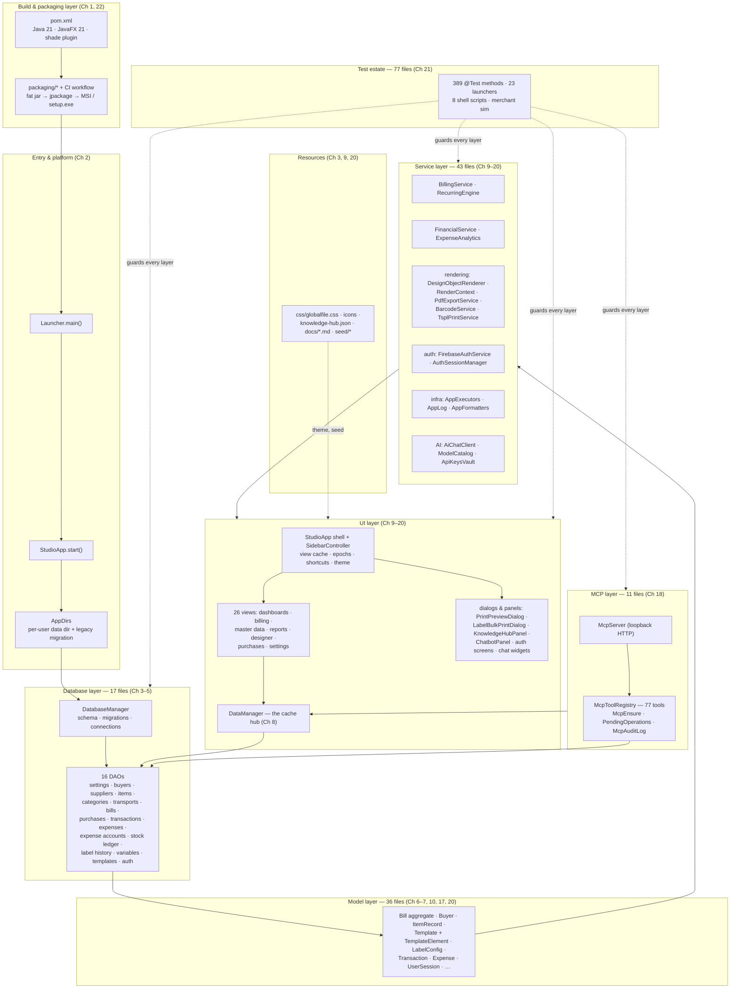
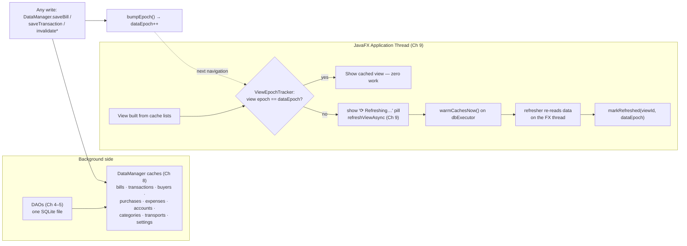
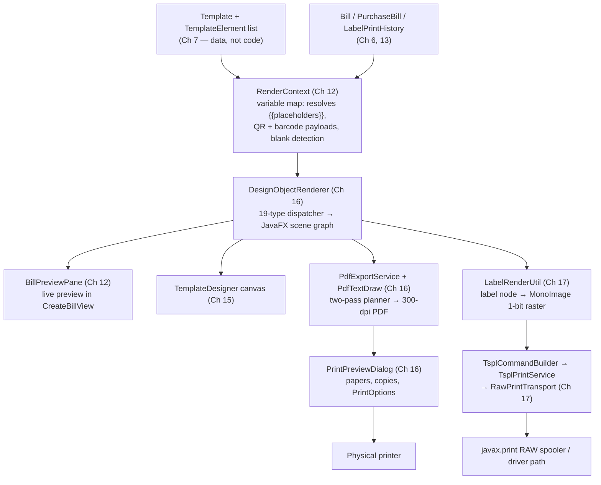
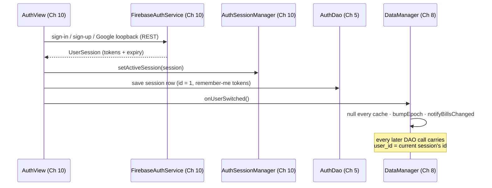
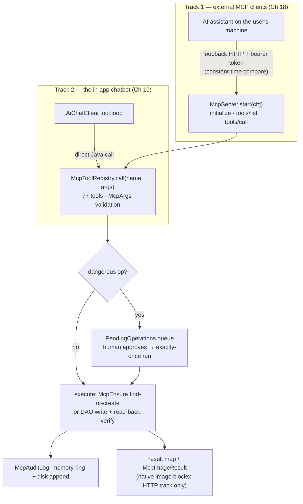
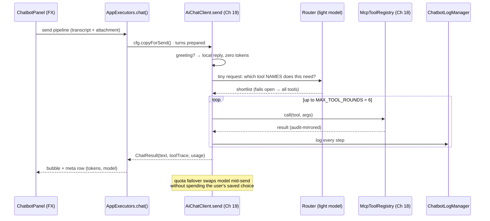

# Appendix A1 — Full-Project Architecture Recap & Data-Flow Map

> **Part 14 of InvoiceStudio: Zero to Finished Product**
> Files covered: none new — this appendix is the map of every file the previous
> 22 chapters built, drawn in one place. Every name in it was verified against
> the repository; every "Ch" reference points at the chapter that explained the
> file or idea in full.
> Goal at the end: **you can open any file in the project and name its layer,
> its chapter, its callers, and the engine it participates in — without
> guessing.**

---

## 1. What this appendix covers

Chapters 1–22 were a *build order*: each chapter added files on top of the
ones before it, and each ended with a checkpoint you could run. This appendix
is the same project seen from above, after the dust has settled. It is the
reference you reach for six months from now, when you remember that *something*
handles stock movements but not *where* it lives.

Concretely, this appendix gives you four things:

1. **The layer map** — one diagram and ten tables placing every one of the
   305 tracked files into its layer, with the chapter that covered it and a
   one-line role. (This is the bird's-eye companion to
   `appendix-file-inventory.md`, which is the file-by-file ledger.)
2. **The five cross-cutting engines** — the five flows that no single layer
   owns: data flow with epoch invalidation, the document pipeline,
   authentication and per-user partitioning, the MCP dual track, and the AI
   assistant loop. Each gets its own diagram and chapter references.
3. **The key invariants** — the eight rules the whole app silently depends
   on, why each exists, and where in the code each one is enforced.
4. **A coverage self-check** — what this appendix covered and what it
   deliberately did not re-cover.

A word on how to read it: layers are presented bottom-up (build → entry →
database → model → service → UI → MCP → resources → tests), which is the same
order the book built them in. When you are hunting a bug, you usually travel
the opposite way — from the screen backwards — and Appendix A2 walks exactly
that direction, screen by screen.

---

## 2. The whole app in one diagram

Everything below is one Java 21 desktop process: a JavaFX front end, a
file-backed SQLite database, an embedded HTTP server for AI tools, and a
fleet of services that keep the books consistent. The dashed arrows are the
five engines this appendix dissects in §4.

Read the diagram with one rule in mind: **arrows mean "depends on", and no
arrow ever skips a layer upward.** A view never touches a DAO directly (it
goes through `DataManager`); the MCP registry does touch DAOs, but only
because it *is* a headless client sitting at the same altitude as the views.
The test estate touches everything, on purpose — it is the floor inspection,
not a wall.

---

## 3. The layers, file by file

Legend for every table: **Ch** = the chapter that read the file in full (the
chapter's §11 self-check lists it). Roles are one line by design — the chapter
is the deep dive.

### 3.1 Build, config & environment (Ch 1, 22)

| File | Ch | Role in one line |
|---|---|---|
| `pom.xml` | 1 | Maven recipe: Java 21, nine dependencies, JavaFX + shade plugins, `mainClass` = `Launcher`. |
| `README.md` | 1 | Human-facing build/run/install guide (two drifts flagged in Ch 1). |
| `.gitignore` | 1 | Keeps `target/`, local data and verify outputs out of git. |
| `fx.env` | 1 | Module-path classpath for running JavaFX from a shell in development. |
| `.vscode/settings.json` | 1 | Editor config (unreadable when written — honest `GAP:` in Ch 1). |
| `packaging/build-windows-installer.ps1` | 22 | Shades the jar, runs jpackage (MSI or app-image), hands off to Inno Setup. |
| `packaging/InvoiceStudio.iss` | 22 | Classic `setup.exe` definition: tasks, files, icons, run page. |
| `packaging/InvoiceStudio.ico` | 22 | Multi-resolution installer/app icon. |
| `.github/workflows/windows-installer.yml` | 22 | Builds the installer on push/tag, uploads artifact, promotes Releases. |
| `dash2-smoke/mcp-server.json` | 21 | Isolated MCP config so the Dashboard-2 smoke run cannot touch real settings. |
| `MERCHANT_SIM_REPORT.md` | 21 | The three-month simulated-business stress report — release acceptance evidence. |

### 3.2 Entry & platform (Ch 2)

| File | Ch | Role |
|---|---|---|
| `Launcher.java` | 2 | One method: `Application.launch(StudioApp.class, args)` — keeps fat-jar and jpackage starts legal. |
| `AppDirs.java` | 2 | Resolves the per-user data dir (`%APPDATA%\InvoiceStudio` on Windows, `-Dinvoicestudio.data.dir` override), builds `jdbc:sqlite:` URL, migrates a legacy working-directory database once. |

Two utilities live in the service layer but belong to the platform story:
`AppLog` (the single file-logging funnel, Ch 2) and `AppExecutors` (the three
named daemon pools `io()` / `chat()` / `cpu()` plus the `runOnFx` bridge, Ch 2
with the threading contract expanded in Ch 9).

### 3.3 Database layer — `db/` (Ch 3–5)

Seventeen files: one manager, sixteen DAOs. The split follows the book's
chapters: Ch 3 built the foundation, Ch 4 the master-data librarians, Ch 5 the
documents-and-ledgers librarians.

| File | Ch | Role |
|---|---|---|
| `DatabaseManager.java` | 3 | Singleton over SQLite: 17 tables created `IF NOT EXISTS`, converging migrations, legacy purge, `INSERT OR IGNORE` seeding of 16 built-in variables; `getInstance()` uses `AppDirs.databaseUrl()`, `initCustom()` serves tests. |
| `SettingsDao.java` | 4 | One settings row per user (JSON blob in a plain column); never-null read contract. |
| `BuyerDao.java` | 4 | Buyers CRUD with tenant-guarded upsert and `LOWER()` name lookup. |
| `SupplierDao.java` | 4 | Suppliers CRUD — structural twin of BuyerDao with cost-side fields. |
| `ItemDao.java` | 4 | Items + stock snapshot columns; per-field defensive row mapper. |
| `CategoryDao.java` | 4 | Item categories CRUD with protected-default guards. |
| `TransportDao.java` | 4 | Transport parties CRUD (parcel logistics directory). |
| `BillDao.java` | 5 | Sales bills + nested payments; write-time projections (bill_no, date, status, grand_total, due_amount as real columns) so lists sort without parsing JSON. |
| `PurchaseBillDao.java` | 5 | Purchase invoices with ITC column and supplier projection. |
| `TransactionDao.java` | 5 | The money book: safe dynamic SQL, soft-delete trio, buyer by id *or* legacy name. |
| `ExpenseDao.java` | 5 | Expense vouchers, archive-aware ordering. |
| `ExpenseAccountDao.java` | 5 | Expense ledger heads; case-insensitive `findOrCreate` registry. |
| `StockLedgerDao.java` | 5 | Immutable in/out ledger; SQL-side balance aggregation and per-item recompute. |
| `LabelPrintHistoryDao.java` | 5 | Never-throwing audit trail of printed labels. |
| `VariableDao.java` | 5 | Template variables, scope-partitioned, schema-level builtin protection. |
| `TemplateDao.java` | 5 | Invoice/label templates as JSON documents with name projection. |
| `AuthDao.java` | 10 | Single-slot local session row (id = 1) holding the signed-in user's tokens. |

### 3.4 Model layer — `model/` (Ch 6, 7, 10, 17, 20)

Thirty-six files: nineteen business nouns from Ch 6, fourteen template/design
types from Ch 7, and three late arrivals (`UserSession` Ch 10, `UnitConverter`
Ch 17, `KnowledgeArticle` Ch 20).

| File | Ch | Role |
|---|---|---|
| `Bill.java` | 6 | Invoice aggregate: always-valid collections, variable map, two-way parcel sync. |
| `BillItem.java` | 6 | One line item; clamped discount, paise-rounded amount. |
| `BillPayment.java` | 6 | One payment against a bill. |
| `BillStatus.java` | 6 | PAID / UNPAID / PARTIAL / CANCELLED — code-stable enum. |
| `BillTotals.java` | 6 | Computed totals snapshot (the "honest ISSUE" constructor is Ch 6's marker). |
| `BusinessProfile.java` | 6 | Seller identity (with the documented demo-defaults decision). |
| `Settings.java` | 6 | App-wide preference sheet record. |
| `Buyer.java` | 6 | Customer record with derived GSTIN intelligence. |
| `BuyerFieldDef.java` | 6 | Configurable buyer-field definitions for custom columns. |
| `Supplier.java` | 6 | Vendor record, twin of Buyer. |
| `ItemRecord.java` | 6 | Stock item with ledger-coupled stock fields. |
| `ItemCategory.java` | 6 | Item category registry entry. |
| `Transport.java` | 6 | Transport party; `getVehicleNumber()` never returns null. |
| `Expense.java` | 6 | Expense voucher with its chart-of-accounts fields. |
| `ExpenseAccount.java` | 6 | Expense ledger head. |
| `PurchaseBill.java` | 6 | Purchase invoice; freight stays outside the tax math. |
| `Transaction.java` | 6 | Money-in/out record; normalised book/type vocabulary, soft-delete trio. |
| `PaymentMethod.java` | 6 | CASH / UPI / BANK / … enum. |
| `RepeatCadence.java` | 6 | Recurring frequency enum feeding `RecurringEngine`. |
| `Template.java` | 7 | Page + elements + mode: the whole document as data. |
| `TemplateElement.java` | 7 | The ~120-property atom every renderer reads. |
| `ElementType.java` | 7 | Element-type codes; fails open on unknown values. |
| `TableColumn.java` | 7 | Column spec for table elements. |
| `DocType.java` | 7 | BILL / PURCHASE / LABEL document kind. |
| `PageConfig.java` | 7 | Page size, margins, orientation (margins = designer guidance — Ch 16 marker). |
| `PageSizeName.java` | 7 | A4/A5/… paper enum with default dimensions. |
| `LabelConfig.java` | 7 | Label stock geometry + `sanitize`. |
| `LabelPrintHistory.java` | 7 | One printed-label record. |
| `VariableDef.java` | 7 | Custom variable definition (scope, type, default). |
| `CustomComponent.java` | 7 | Saved designer component group. |
| `ComponentPreset.java` | 7 | Built-in designer presets (code-built factories). |
| `CustomFontDef.java` | 7 | Custom font metadata. |
| `PresetTemplates.java` | 7 | Factory building the starter templates for first-run seeding. |
| `UserSession.java` | 10 | Logged-in user snapshot with 30-second expiry grace. |
| `UnitConverter.java` | 17 | mm / px / pt / cm / in bridge used by label geometry. |
| `KnowledgeArticle.java` | 20 | Knowledge Hub article record with normalization. |

### 3.5 Service layer — `service/` (Ch 2, 9–20)

Forty-three files in five families: business logic, rendering & printing,
auth & infra, AI assistant, knowledge.

| File | Ch | Role |
|---|---|---|
| `BillingService.java` | 12 | Pure billing math: totals, GST split, format, amount-in-words, factories, batch, `buyerOutstanding`. |
| `PurchaseService.java` | 13 | Purchase-side rules (cost guardrails, sequence). |
| `FinancialService.java` | 13 | P&L, daybook, `stockSummary`, `itemProfitability` — all pure and unit-tested. |
| `ExpenseAnalytics.java` | 14 | One-pass expense aggregation into month/category/account buckets (records, NaN guards). |
| `ExpenseAccountService.java` | 13 | Ledger-head backfill, find-or-create, rename propagation. |
| `RecurringEngine.java` | 12 | Due-recurring sweep producing bills; end/skip/roll guards; `runSweep(force)`. |
| `CsvService.java` | 13 | CSV validators, escape/parse state machine, per-entity exporters. |
| `BackupRestoreService.java` | 13 | Backup/restore of the six core entities (scope note in Ch 13). |
| `FirebaseAuthService.java` | 10 | Firebase REST client: sign-in/up, reset, refresh, Google loopback, 8 error mappings. |
| `AuthSessionManager.java` | 10 | Volatile current-session holder + listener bus; `getCurrentUserId()` is the app's partition key. |
| `AppExecutors.java` | 2 | Named daemon pools `io()` / `chat()` / `cpu()`, `runOnFx`, `shutdownAll`. |
| `AppLog.java` | 2 | Single file-logging funnel (`debug`/`error`). |
| `AppFormatters.java` | 14 | `ThreadLocal`-cached currency/date formatters (`inrFormat()`, `money`, `grouped`…). |
| `BarcodeService.java` | 16 | Seven barcode symbologies via ZXing, per-format fallback, LRU caches, UPI payload. |
| `PrintingService.java` | 17 | Print dialog flow, 0.75 scale, native-dialog re-assert, calibration sheet. |
| `RawPrintTransport.java` | 17 | SPI seam: raw bytes → spooler. |
| `JavaxRawPrintTransport.java` | 17 | JDK `javax.print` RAW implementation of the seam. |
| `TsplCommandBuilder.java` | 17 | TSPL/EPL command grammar: header, BITMAP, PRINT, run-lengths, bit packing. |
| `TsplPrintService.java` | 17 | Label → raster → TSPL pipeline; routing, dpm, queued spool, AUTODETECT. |
| `MonoImage.java` | 17 | 1-bit rasterization: luminance, 2× downsample, threshold. |
| `LabelGeometryService.java` | 17 | Strip math, slots, rotation, JSON, validation. |
| `LabelPresets.java` | 17 | 17 built-in label stock presets + envelope. |
| `LabelPrintService.java` | 17 | Orchestrator: render → transport, form matching, history writing. |
| `LabelRenderUtil.java` | 17 | Shared label drawing helpers over the Ch 16 renderer. |
| `PdfExportService.java` | 16 | Invoice/receipt → PDF: two-pass planner, template renderer, SVG interpreter, table engine. |
| `PdfTextDraw.java` | 16 | Low-level PDF text: cell text, greedy wrap, status stamp. |
| `DesignObjectRenderer.java` | 16 | 19-type element dispatcher painting templates onto any `RenderContext`. |
| `RenderContext.java` | 12 | Variable map + resolution: turns a Bill into `{{placeholders}}` values; QR/barcode payloads. |
| `SvgVectorParser.java` | 15 | SVG path data → JavaFX and Java2D geometry. |
| `TemplatePreviewService.java` | 16 | Headless template → PNG preview (with the DPI scale fix). |
| `PrintOptions.java` | 17 | Print-choice record carried from `PrintPreviewDialog` into the services. |
| `VariableGrouper.java` | 13 | Groups variable definitions into UI categories. |
| `CustomComponentManager.java` | 15 | Persist/load/instantiate designer components. |
| `BulkPrintStateStore.java` | 17 | Bulk-print progress persistence for the bulk dialog. |
| `KnowledgeRepository.java` | 20 | Ladder + id-union merge of shipped vs user knowledge articles; CRUD, listeners. |
| `KnowledgeSeed.java` | 20 | 30 built-in seed articles. |
| `AiChatClient.java` | 19 | Multi-provider chat client: routing, tool loop, failover, audit mirror, usage metering. |
| `ChatbotConfig.java` | 19 | Chatbot preferences (`chatbot.json`), clamps, `copyForSend`. |
| `ChatbotLogManager.java` | 19 | Thread-safe log buffer + listener bus with FX-thread delivery. |
| `ApiKeysVault.java` | 19 | Multi-key vault (`api-vault.json`): idempotent add, mask, listeners. |
| `ChatTranscriptStore.java` | 19 | Persisted chat history (400-turn cap, role validation). |
| `ModelCatalog.java` | 19 | Live Gemini/GLM model catalogues with failover ladder. |
| `ModelStatusStore.java` | 19 | Learned red/green model status (`model-status.json`, 26 h red TTL). |

### 3.6 UI shell & shared — `ui/` (Ch 9–20)

Twenty-eight files at the top of the package. `StudioApp` and `DataManager`
are the two load-bearing walls; everything else is chrome or dialog machinery.

| File | Ch | Role |
|---|---|---|
| `StudioApp.java` | 9 | The shell: boot, auth gate, `show*` navigation API, `cached()` view cache with epochs, refresh pill, chatbot toggle, MCP auto-start, `stop()` teardown. |
| `DataManager.java` | 8 | Cache hub: shared DAOs, cached collections, invalidate+epoch discipline, `saveBill` ledger choke point, `seedIfEmpty`, `onUserSwitched`. |
| `SidebarController.java` | 9 | Sidebar navigation and active-state mapping. |
| `AppShortcuts.java` | 9 | Global keyboard shortcut installation. |
| `ShortcutCatalog.java` | 9 | Shortcut definitions (the registry). |
| `ShortcutManager.java` | 9 | Shortcut persistence, validation, normalize, bind/reset. |
| `ShortcutsPanel.java` | 9 | Settings panel rendering the catalog. |
| `ShortcutsDialog.java` | 9 | F1 help overlay. |
| `WindowStateManager.java` | 9 | Window geometry persistence with debounce and off-screen guard. |
| `WindowResizeHelper.java` | 9 | Custom 8-cursor resize handles for undecorated stages. |
| `UiTheme.java` | 9 | Programmatic theme factories (buttons, KPI cards, date pickers…). |
| `IconHelper.java` | 9 | SVG icon factory with glyph fallback. |
| `Toast.java` | 9 | Transient toast notifications with transition timeline. |
| `DialogHelper.java` | 9 | Dialog theming, app-icon application, anti-flicker `styleDialog`. |
| `ViewEpochTracker.java` | 9 | Per-view freshness bookkeeping (`needsRefresh` / `markRefreshed`). |
| `UserProfilePill.java` | 10 | User chip + menu in the shell header. |
| `BillPreviewPane.java` | 12 | Live bill preview canvas (zoom fix, roll height, mono mode, stamp). |
| `PrintPreviewDialog.java` | 16 | Paginated print/PDF preview with printers/papers/`PrintOptions`. |
| `LabelBulkPrintDialog.java` | 17 | Bulk label print queue UI (row model, copies, spooling UX). |
| `LabelStripPreviewDialog.java` | 17 | Strip-layout label preview. |
| `ExpenseAccountsDialog.java` | 13 | Manage expense ledger heads with usage rollups. |
| `ExpenseReportDialog.java` | 14 | Expense report window — formatting only over `ExpenseAnalytics`. |
| `CustomColorChooserDialog.java` | 15 | Themed color picker with hex and eyedropper. |
| `KnowledgeHubPanel.java` | 20 | Knowledge Hub browser: tree, view/edit modes, live refresh. |
| `CopyButtonFactory.java` | 19 | Shared copy-icon button (vault, chat). |
| `ModelStatusDot.java` | 19 | Red/green model status dot for pickers. |
| `ChatbotPanel.java` | 19 | AI chatbot overlay: transcript, attachments, send pipeline, progress. |
| `ChatbotSettingsPanel.java` | 19 | Chatbot settings + API Key Vault + probe + model picker wiring. |

### 3.7 Auth & chat sub-packages — `ui/auth/`, `ui/chat/`

| File | Ch | Role |
|---|---|---|
| `ui/auth/AuthView.java` | 10 | Six-state sign-in/up/reset machine; async submit; `handleSuccessfulLogin`. |
| `ui/auth/GoogleSignInButton.java` | 10 | Branded Google button opening the loopback flow. |
| `ui/auth/LogoutDialog.java` | 10 | Confirm-logout dialog. |
| `ui/auth/PasswordFieldWithToggle.java` | 10 | Password field with eye toggle. |
| `ui/auth/PasswordStrengthMeter.java` | 10 | Live strength bar. |
| `ui/chat/ChatMarkdownRenderer.java` | 19 | Markdown → styled nodes (tables, code, inline). |
| `ui/chat/ChatPipelineBar.java` | 19 | Animated "assistant at work" strip with coin counter. |
| `ui/chat/ChatbotLogDialog.java` | 19 | Live execution-log window (chips, pin-aware scroll). |
| `ui/chat/ChatbotModelPickerDialog.java` | 19 | Model picker with status dots. |

### 3.8 Feature views — `ui/views/` (Ch 11–17)

| File | Ch | Role |
|---|---|---|
| `DashboardView.java` | 14 | Dashboard 1: month nav, recurring banner, animated KPIs, hand-drawn chart, GST card, top buyers, recent invoices. |
| `Dashboard2View.java` | 14 | Dashboard 2: smooth scrolling, book filter, trend KPIs, cached charts, parcel analyzer, Top-5 widgets, recent-activity swap. |
| `ReportsView.java` | 14 | Reports shell: header + 8 tabs + cross-tab drilldown (`selectBuyerStatement`). |
| `ReportsBuilders.java` | 14 | The eight report engines + shared KPI card + `exportCsv`. |
| `StockAnalysisView.java` | 14 | Tally-style stock summary, item profitability, low-stock watchlist. |
| `HistoryView.java` | 12 | Invoice history: filters, payment dialog, WhatsApp, CSV, bulk PDF. |
| `CreateBillView.java` | 12 | Bill editor: search-combo, item rows, totals, 150 ms preview debounce, guardrail, background save. |
| `LineItemsLayout.java` | 12 | Line-item grid helper for the editor. |
| `BuyersView.java` | 11 | Buyer CRM: KPIs, dynamic columns, form, statement, CSV import/export. |
| `SuppliersView.java` | 11 | Supplier CRM with validation wall and double-entry balance. |
| `ItemsView.java` | 11 | Items & stock manager with stats engine and analytics. |
| `CategoriesView.java` | 11 | Category manager. |
| `TransportsView.java` | 11 | Transport parties manager. |
| `VariablesView.java` | 11 | Custom variables (scopes, built-ins, buyer-field overview). |
| `SettingsView.java` | 11 | Settings hub: 11 tabs, save flow, backup/restore, fonts, thresholds. |
| `SettingsFieldSupport.java` | 11 | Settings field builders. |
| `CreatePurchaseView.java` | 13 | Purchase entry with guardrails. |
| `PurchasesView.java` | 13 | Purchase register, KPIs, pay, delete-reversal. |
| `TransactionsView.java` | 13 | Cash/bank book with field rules. |
| `ExpensesView.java` | 13 | Expense tracker, account-aware save. |
| `FinancialsView.java` | 13 | P&L / receivables tabs over `FinancialService`. |
| `TemplatesView.java` | 15 | Template gallery. |
| `TemplateDesigner.java` | 15 | The 7,488-line drag-and-drop designer (largest file in the app). |
| `DesignerState.java` | 15 | Snapshot undo/redo + clipboard for the designer. |
| `VectorGeometryUtil.java` | 15 | Designer vector math (colors, SVG vertices, Catmull-Rom, decoders). |
| `LabelHistoryView.java` | 17 | Printed-label history browser. |

### 3.9 MCP layer — `mcp/` (Ch 18)

| File | Ch | Role |
|---|---|---|
| `McpServer.java` | 18 | Embedded loopback HTTP server speaking JSON-RPC MCP (initialize, tools/list, tools/call), token-gated, headless-safe FX notifications. |
| `McpToolRegistry.java` | 18 | The 77-tool catalogue and dispatch; `confirmable()` funnels destructive ops; read-back verification after writes. |
| `McpConfig.java` | 18 | `mcp-server.json` persistence: port, token, auto-start, clamp. |
| `McpSettingsPanel.java` | 18 | Settings cards: on/off, token, approvals, client config JSON, activity. |
| `McpArgs.java` | 18 | Argument validation helpers (`str`, `dbl`, `intVal`, `boolVal`, `matches`…). |
| `McpEnsure.java` | 18 | Idempotent find-or-create helpers with striped locks and compensating rollback. |
| `McpProjections.java` | 18 | Domain → tool-result shaping (lists, bill summaries, reports). |
| `McpAuditLog.java` | 18 | Tool-call audit: memory ring + append-only disk channel. |
| `PendingOperations.java` | 18 | Destructive-op approval queue with exactly-once semantics. |
| `McpImageResult.java` | 18 | Base64 image tool results (native image blocks on the HTTP track). |
| `GuideContent.java` | 18 | In-app guide text served to the assistant. |

### 3.10 Resources (Ch 3, 9, 20)

| File | Ch | Role |
|---|---|---|
| `css/globalfile.css` | 9 | The whole dark-gold theme (3,774 lines) — the class-name contract every view obeys. |
| `icons/invoice-mark.png`, `Invoice black background.png`, `Invoicewhitebackground.png` | 9 | App icon (window/taskbar) and logo-mark assets for label artwork. |
| `knowledge/knowledge-hub.json` | 20 | The 30 shipped knowledge articles, merged into user libraries by id. |
| `docs/APP_GUIDE.md`, `docs/MCP_SERVER.md`, `docs/TEMPLATE_DESIGN_GUIDE.md` | 20 | Embedded user documentation served by the Hub and `GuideContent`. |
| `seed/settings.json`, `buyers.json`, `items.json`, `bills.json`, `templates.json`, `variables.json`, `meta.json`, `custom.db` | 3 | First-run demo data — examined and honestly labelled **unused by application code** (Ch 3's `ISSUE:`; real seeding happens in `DataManager.seedIfEmpty()`, Ch 8). |

### 3.11 Tests (Ch 21)

Seventy-seven test-side Java files, tiered by cost and confidence:

| Tier | What | Count | Runs |
|---|---|---|---|
| Unit + logic suites | seeded-DB `@Test` methods over DAOs/services | 389 methods in 54 files | every `mvn test` |
| Headless visual tests | structure probes (e.g. `VisualFeaturesVerify`) | 7 | every `mvn test` |
| Road launchers | full-app journeys over a virtual screen (`SmokeLauncher`, `NavSmokeRunner`, `MerchantTour`…) | 23 | before releases |
| Simulated business | `MerchantSimSeed` / `MerchantBulkStress` / `merchant-sim/Q.java` | 3 + scripts | on demand |
| Shell scripts | `nav_smoke_test.sh` and seven more verify wrappers | 8 | with the road tier |

Ch 21 also owns the four documentation artifacts the estate makes
trustworthy: `docs/OPTIMIZATION_REPORT_2026-09-16.md`,
`docs/PERFORMANCE_OPTIMIZATION_GUIDE.md`, the nine-note `docs/vault/`, and
`.freebuff/skills/javafx-best-practices/SKILL.md`.

---

## 4. The five cross-cutting engines

Layers tell you where code *lives*; engines tell you how it *moves*. These
five flows cross every layer boundary and are the real architecture of the
app. Each engine below has its diagram, its cast, and its chapter trail.

### Engine 1 — Data flow: DAO → DataManager caches → views (epoch invalidation)

This is the engine every view rides. The rule from Ch 8: **the database is
read once per generation; every write goes through the hub, which drops the
affected cache and bumps the epoch; views built against an older epoch are
refreshed staleness-first, paint-second.**

The three moves to memorize (all Ch 8–9 material):

1. **Write through the hub.** `DataManager.saveBill()` persists *and*
   invalidates *and* notifies listeners in one call — views never call
   `BillDao` directly, so no write can forget invalidation.
2. **Stale-while-revalidate navigation.** `StudioApp.cached(id, factory,
   refresher)` returns the cached UI instantly; if `ViewEpochTracker`
   says the epoch moved, the refresh runs in the background and only the
   data re-read touches the FX thread. A click never waits on disk.
3. **User switches drop everything.** `DataManager.onUserSwitched()` nulls
   every cache and bumps the epoch — partitioning (Engine 3) leans on it.

Where the chapters prove it: Ch 8 defines the discipline; Ch 9 wires the
tracker into navigation; Ch 14's dashboards are the largest consumers; Ch 18's
MCP registry reads the same caches so AI tools and humans see the same books.

### Engine 2 — The document pipeline: Template → RenderContext → renderer → surfaces

One data model (Ch 7), one variable engine (Ch 12), one drawing engine per
surface (Ch 16–17). The pipeline's thesis, quoted from Ch 16's self-check:
**"one drawing engine per surface, one data model and one value engine above
them all."**

Why this shape matters: because every consumer reads the same
`TemplateElement` objects, a fix in one renderer (say, the 96→72 dpi bug
pinned by `TemplatePreviewDpiTest`, Ch 16) is testable without a screen, and
the designer's WYSIWYG promise (Ch 17: *"the strip row the user sees is
byte-for-byte the page the thermal head burns"*) has a single enforcement
point — `LabelRenderUtil` feeding both preview and print path.

### Engine 3 — Auth, session, and per-user partitioning

Authentication is one REST client and one ambient holder (Ch 10); partitioning
is one column and one discipline everywhere else. The rest of the app knows
only two things: `AuthSessionManager.getCurrentUserId()` and "when the session
changes, caches drop."

The two invariants that ride on this engine: **every business table is
partitioned by `user_id`** (the DAO upserts carry a tenant-guard WHERE; Ch 5),
and **caches never outlive a session change** (`onUserSwitched`, Ch 8). Ch 21's
`AuthAndDataPartitioningTest` proves the partition through the DAOs, and
`merchant-sim/Q.java` proves it at rest with raw SQL.

### Engine 4 — The MCP dual track: HTTP server vs in-app registry

Ch 18 built the tool registry with two front doors on purpose. External AI
assistants (Claude Desktop, any MCP client) arrive over loopback HTTP; the
in-app chatbot (Ch 19) calls `McpToolRegistry.call(...)` directly — *"the
second front door Chapter 18 built it for."*

Track-specific details worth remembering: the HTTP track speaks the protocol
and can return native image blocks; the in-app track serializes image results
through Jackson and truncates at the loop's 4,000-character cap (Ch 18/19
markers). Both tracks mirror their work into the same audit trail, and both
respect the same approvals — a machine can never do something a human
couldn't.

### Engine 5 — The AI assistant loop

Ch 19's loop is the most choreographed code in the app: route → shortlist →
tool rounds → failover → log. The send pipeline lives in
`AiChatClient.send(cfg, history, userText, attachment)` running on
`AppExecutors.chat()`, with every step mirrored into `ChatbotLogManager`.

The failover ladder is the engine's personality: Gemini daily buckets run out
→ `ModelCatalog.failoverCandidates()` offers the next model → the turn
completes on the fallback without burning the user's configured model
(`copyForSend` keeps the two apart). `ModelStatusStore` learns red/green per
model with a 26-hour red TTL so the picker's dots tell the truth tomorrow.

---

## 5. How the layers are allowed to talk

The map in §2 shows *where* things live; this short section states the
*traffic rules* between them — the rules that keep 272 application files from
turning into one giant tangled ball.

| From ↓ / To → | db | model | service | ui (shell/views) | mcp | resources |
|---|---|---|---|---|---|---|
| **db** (`DatabaseManager`, DAOs) | — | maps rows → model | — | — | — | — |
| **model** | — | — | — | — | — | — |
| **service** | DAOs via constructor/hub | reads & builds | — | — | registry only (Ch 19 loop) | reads docs/JSON |
| **ui** | **never directly** — through `DataManager` (Ch 8) | binds & edits | calls (billing, render, analytics…) | `StudioApp.show*` for navigation | settings panels only (Ch 18/19) | CSS, icons, seed docs |
| **mcp** | DAOs + `McpEnsure` (allowed: headless client) | builds & mutates | mirrors audit (Ch 19) | FX notifications only, headless-safe | — | `GuideContent` |
| **tests** | everything, per-suite DBs (Ch 21) | everything | everything | harnesses over virtual screens | 8 MCP suites | reads |

Three rules deserve their own sentences because they are violated most often
by newcomers:

1. **Views never import a DAO.** If a view needs data, it asks
   `app.getData()` (the `DataManager` hub) or a service. The one deliberate
   exception cluster is the MCP registry — it *is* a client, not a view.
2. **Models never reach backwards.** `Bill`, `Buyer`, `Template` and friends
   import nothing from db, service or ui. That is why they are unit-testable
   in a millisecond and why Ch 7 could call them "data, not code."
3. **Cross-view navigation goes through the shell.** `ReportsView` does not
   construct `HistoryView`; it calls `app.showHistory()`. Ch 14's
   `selectBuyerStatement` is the polished example — it selects a tab and sets
   a value rather than poking another component's internals.

## 6. Where a new feature goes (the layer decision table)

You will extend this app; the map should tell you where the new code lands.
This is the same decision table Ch 22's modification guides imply, made
explicit:

| If the feature is… | Primary home | Supporting changes | Built like |
|---|---|---|---|
| A new business record type (e.g. quotations) | `model/` entity + `db/` DAO | `DataManager` cache + invalidate + wrapper; `McpToolRegistry` tools if machines should use it | Ch 4–6 pattern |
| A new report or dashboard card | `ReportsBuilders` builder + `ReportsView` tab (Ch 14 recipe: six touch points) | `FinancialService`/`ExpenseAnalytics` for any math (pure, testable) | Ch 14 |
| A new screen | new `ui/views/*View` + `StudioApp.show*()` + sidebar id | epoch handled free by `cached()` | Ch 9 + nearest sibling chapter |
| A new invoice element type | `ElementType` + `TemplateElement` groups (Ch 7) | `DesignObjectRenderer` branch (Ch 16), designer property editor (Ch 15) | Ch 7 + 15 + 16 |
| A new AI tool | `McpToolRegistry` ToolDef + dispatch case (Ch 18) | `McpProjections` shaping; schema via `McpArgs`; audit is automatic | Ch 18 |
| A new label stock or printer | `LabelPresets` entry (Ch 17) | `LabelGeometryService` validation does the rest | Ch 17 |
| A new knowledge article | Hub UI edit (Ch 20) — no code | ships in `knowledge-hub.json` for new installs via id-union merge | Ch 20 |

The pattern to notice: **every feature starts as data + one narrow behavior
addition per layer it crosses.** No feature in this app required editing more
than four layers, and most require two.

---

## 7. Key invariants — and where they are enforced

These eight rules are the difference between "a pile of classes" and "an
application." Each one exists because breaking it once cost something real
(the chapters name the costs).

1. **One UI thread.** Only the JavaFX Application Thread touches scene-graph
   nodes; everything else crosses back via `AppExecutors.runOnFx` or
   `Platform.runLater`.
   *Why:* JavaFX throws `IllegalStateException` and, worse, corrupts layout
   state silently. *Enforced:* Ch 9's threading rules; `StudioApp.dbExecutor`
   tasks always round-trip through `Platform.runLater` (visible in the boot
   sequence, Ch 9/Appendix A2). Ch 14's mistake table lists the symptom when
   a report forgets.

2. **Every row belongs to a user.** Business tables carry `user_id`; DAO
   writes and reads are tenant-guarded.
   *Why:* two merchants share one installer and one SQLite file; a missing
   guard would leak one shop's books into another. *Enforced:* Ch 4–5 DAO
   upserts; `AuthSessionManager.getCurrentUserId()` as the partition key;
   `AuthAndDataPartitioningTest` + `merchant-sim/Q.java` (Ch 21).

3. **Caches invalidate on every write — no exceptions.** Writes go through
   `DataManager` wrappers; each wrapper drops the affected collection and
   bumps `dataEpoch`.
   *Why:* a stale cache is a *lie on screen* — Ch 8's mistake table opens
   with exactly that symptom. *Enforced:* Ch 8 wrappers; Ch 9's
   `ViewEpochTracker` + `refreshViewAsync`; Ch 14's dashboards re-read only
   after the epoch moved.

4. **`yyyy-MM-dd` is the canonical date.** Stored, compared and sorted as
   strings — ISO dates sort correctly lexicographically and `substring(0, 7)`
   makes month keys trivial.
   *Why:* no parsing means no locale surprises and no parse failures in hot
   loops (Ch 14's reports lean on this daily). *Enforced:* Ch 6 models and
   Ch 12 (`BillingService.todayISO()`); Ch 14's month-key idiom; the DAOs'
   `ORDER BY date DESC` guarantees that let dashboards `.limit(15)` safely.

5. **Money compares with the paisa tolerance.** `0.01` is the smallest unit
   that matters; comparisons use `> 0.01`, never `== 0`.
   *Why:* floating-point totals drift by fractions of a paisa; `== 0`
   would misclassify paid accounts as debtors. *Enforced:* Ch 12 billing
   math, Ch 14's outstanding filter and ledger coloring (`b > 0.01 ? red :
   b < -0.01 ? green : gray`).

6. **MCP writes are idempotent and verified.** Creates go through
   `McpEnsure` (find-or-create with striped locks, compensating rollback);
   after every write the registry *reads back* before returning ok.
   *Why:* DAOs swallow SQL failures by contract (Ch 5); an AI tool that
   reports success without verification would invent data. *Enforced:* Ch 18
   (`McpEnsure`, read-back verification), `McpEnsureHardeningTest`.

7. **Everything an AI does is audited.** Every tool call — either track —
   lands in `McpAuditLog` (memory ring + disk), destructive ones wait in
   `PendingOperations` for a human.
   *Why:* the owner must be able to answer "what did the assistant do?" with
   a file, not a feeling. *Enforced:* Ch 18 (`McpAuditLog`,
   `PendingOperations`, `confirmable()`), Ch 19's audit mirror.

8. **The ledger triangle stays consistent: bill ↔ stock ↔ transaction.**
   Saving a bill records the sale's stock-out and mirrors it into the money
   book at one choke point.
   *Why:* three books that can disagree are three places to embezzle by
   accident. *Enforced:* `DataManager.saveBill` (Ch 8) — invalidate, stock
   out, `syncBillTransaction` — with `WorkshopScenarioTest` pinning the
   behavior and `syncBillsToTransactions()` as the boot-time repair.

> **GAP (faithfully carried):** two weaker guarantees are documented but not
> machine-enforced — Ch 8 flags that cached lists are returned live (mutable)
> "enforced only by convention", and Ch 8's `syncBillTransaction` failures are
> logged, not surfaced, after the bill has saved. Both have sketched fixes in
> the source chapters and both appear in Appendix A3's roadmap.

---

## 8. Coverage self-check

**This appendix covered:** the complete layer map with per-file tables for
build/config (11 files), entry (2), database (17), model (36), service (43),
UI shell (28), auth (5), chat (4), views (26), MCP (11), resources, and the
test estate (77 files) — every file name verified against the repository
tree and its chapter assignment against the chapters' §11 self-checks; the
five cross-cutting engines with five diagrams and their chapter trails; the
eight key invariants with enforcement points; and the two carried GAPs that
keep this map honest.

**This appendix deliberately did not:** re-explain any file's code (the
chapter links do that), walk the runtime order of screens (that is Appendix
A2's job, read top to bottom as a user would), or rank improvements
(Appendix A3).

**Counts reconciled:** 28 UI-shell files include `DataManager` (Ch 8's
subject that physically lives in `ui/`); the `db/` package is 17 files
(`DatabaseManager` + 16 DAOs); service is 43 including `PrintOptions`
(quoted at its Ch 17 consumer); `auth/` is 5 files. Where the task-of-record
said otherwise, the repository won — the same rule the whole book follows.

**Next: Appendix A2 — End-to-End Runtime Walkthrough.**
