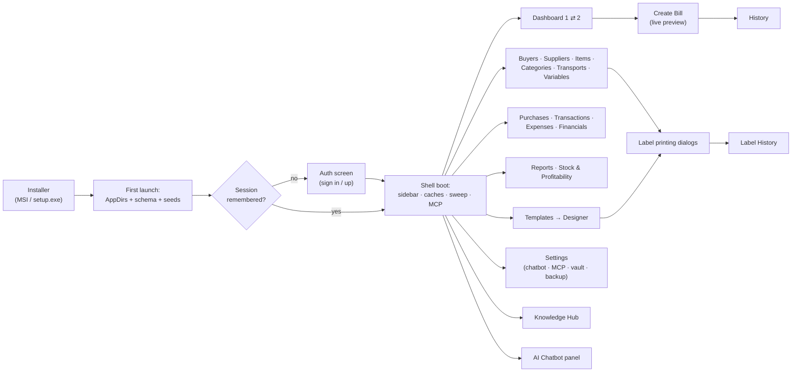
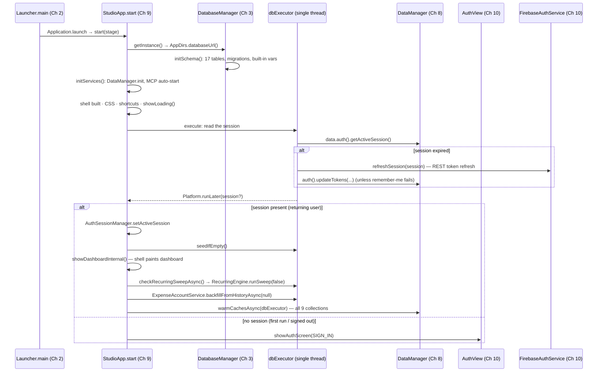
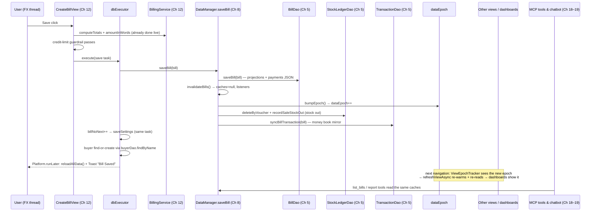

# Appendix A2 — End-to-End Runtime Walkthrough

> **Part 14 of InvoiceStudio: Zero to Finished Product**
> Files covered: none new — this appendix walks the *finished* app the way a
> user lives it: one continuous journey from a double-clicked installer to a
> printed label, naming the classes, methods, data and threads behind every
> screen. Everything here was verified against the repository; chapter
> references point at where each piece was built.
> Goal at the end: **for any click in InvoiceStudio, you can say what fires,
> what it touches, and which thread it happens on.**

---

## 1. How to read this walkthrough

Chapters 1–22 built the app piece by piece. This appendix re-assembles the
pieces into the order a person actually meets them. Every numbered stop below
is a screen or a transition; under each one you get:

- **What the user does** — the click, the typing, the wait.
- **What fires under the hood** — classes and methods, with the chapter that
  built them.
- **Data touched** — which tables and caches.
- **Threads** — the JavaFX Application Thread ("FX thread" from here on),
  the app's single-thread `dbExecutor`, or the shared `AppExecutors` pools.

Two diagrams anchor the journey — the **boot sequence** (§5) and the
**save-a-bill sequence** (§10). The threading map in §22 is the one-page
summary to keep beside you while reading everything else.

The journey, mapped:



---

## 2. Stop 0 — The double-click

**What the user does:** runs `InvoiceStudio-4.0.0-setup.exe` (Inno Setup, Ch
22) or the jpackage MSI, clicks through, and double-clicks the new desktop
shortcut.

**What fires:** the launcher's identity card. The installer ships a bundled
Java 21 runtime plus the shaded fat jar whose manifest names
`com.invoicestudio.Launcher` as `mainClass` (Ch 1's pom walkthrough, Ch 22's
packaging). `Launcher.main(String[])` is eleven lines of intent:

```java
public class Launcher {
    public static void main(String[] args) {
        Application.launch(StudioApp.class, args);
    }
}
```

Why the indirection exists: JavaFX requires a class that *does not* extend
`Application` to be the jar's main class, or the module system mis-derives
the JavaFX modules at startup (Ch 2 explains the whole story). `Launcher`
satisfies that rule and hands off immediately to `StudioApp`.

**Threads:** the JVM starts; JavaFX creates the FX thread and calls
`StudioApp.start(stage)` on it. Nothing else exists yet.

---

## 3. Stop 1 — First launch: the app finds (or builds) its data home

**What fires, in order:**

1. `StudioApp.initServices()` runs before any window exists. Its first line —
   `DatabaseManager.getInstance()` — triggers `AppDirs.databaseUrl()`, which
   resolves the per-user data directory: `%APPDATA%\InvoiceStudio` on
   Windows, the macOS/Linux equivalents elsewhere, overridable with
   `-Dinvoicestudio.data.dir` (Ch 2).
2. If a legacy database exists in the old working-directory location,
   `AppDirs.migrateLegacyDatabase(...)` copies it (and its side files) into
   the new home exactly once — the "old install keeps its books" guarantee.
3. `new DatabaseManager(dbUrl)` runs `initSchema()`: 17 tables created
   `CREATE TABLE IF NOT EXISTS`, converging migrations applied, the
   documented legacy purge, MCP-race hardening, and the `INSERT OR IGNORE`
   seeding of 16 built-in template variables (all Ch 3).
4. `DataManager.init(db)` builds the cache hub with its 15 DAO fields (Ch 8);
   `BackupRestoreService` and `PrintingService` are constructed.
5. **MCP auto-start** — `startMcpIfConfigured()` loads `McpConfig.load()`
   from the user's `mcp-server.json`; if `isAutoStart()` is set,
   `McpServer.start(cfg)` binds the loopback HTTP port now, before any login
   happens (Ch 18). Note the as-built order honestly: the tool server wakes
   up before the human does, because it serves *external* assistants that
   have no concept of the sign-in screen.

**Data touched:** the SQLite file itself — schema, migrations, built-in
variables. No business rows yet.

**Threads:** all of the above on the FX thread, deliberately kept cheap —
`initSchema` is DDL and `INSERT OR IGNORE`s, and the comment above
`initServices()` says the quiet part: *"Kept cheap: heavy DB work is
deferred."* The heavy reads come later, on the `dbExecutor`.

---

## 4. Stop 2 — The shell appears (loading first)

**What fires in `StudioApp.start(Stage)`:**

1. `rootPane` (StackPane) → `mainLayout` (BorderPane) →
   `sidebarController.buildSidebar()` fills the left slot (Ch 9).
2. `installChatbot()` adds the floating chatbot icon (Ch 19 wiring).
3. A 1440×900 `Scene` gets `AppShortcuts.installGlobalShortcuts(scene)` and
   the `/css/globalfile.css` stylesheet — the 3,774-line dark-gold theme
   (Ch 9).
4. The stage gets its title, minimum size (1024×640) and the
   `invoice-mark.png` icon; `new WindowStateManager().applyAndTrack(stage,
   1440, 900, 1024, 640)` restores the user's last window geometry with its
   off-screen guard, then `stage.show()` — the window is visible.
5. A global icon safety net: a `Window.getWindows()` listener applies
   `DialogHelper.applyAppIcon(s)` to every future window that has no icon of
   its own (Ch 9).
6. `showLoading()` paints a placeholder so the user sees something
   immediately.

**Then the boot hand-off** — the app builds an empty shell and does
everything else in the background. This is the master boot sequence:



The two branches are the app's two mornings, and they differ in one honest,
as-built detail: the *returning-user* path runs the recurring sweep and the
cache warm-up; the *fresh sign-in* path (§6) goes straight from seeding to
the dashboard, and the sweep rides the next launch. The sweep is a boot-time
courtesy, not a correctness requirement — Chapter 14's banner has the
"Create Due Now" button for the impatient case.

---

## 5. Stop 3 — Seeding: what a brand-new database receives

`DataManager.seedIfEmpty()` (Ch 8) runs on the `dbExecutor`, keyed to the
just-authenticated `AuthSessionManager.getCurrentUserId()` — the first act of
per-user partitioning (Ch 10's invariant). For a user with empty tables it
creates:

1. **Settings** — one default `Settings` row (via
   `settingsDao.hasNoSettingsForUser`).
2. **Starter templates** — `PresetTemplates.getAllPresets()` written through
   `TemplateDao` (the factories Ch 7 documented).
3. **The default category** — `cat_trouser` / "Trouser".
4. **The default item** — `item_pent` / "PENT", HSN 6203, ₹550 — the same
   flagship the reports' PENT guarantee leans on (Ch 14).
5. **Ledger repair** — `syncBillsToTransactions()` reconciles the bill ↔
   transaction books (Ch 8's choke-point discipline).

Two neighbours join in around this moment. The **expense-account backfill**
(`ExpenseAccountService.backfillFromHistoryAsync(null)`, Ch 13) seeds ledger
heads from existing voucher payees — idempotent, so it runs at every boot
and does nothing after the first time (Ch 14's test pins the idempotency).
And the **Knowledge Hub** self-seeds lazily: the first time
`KnowledgeRepository` loads, an empty local library falls back to
`KnowledgeSeed.buildAllArticles()` (Ch 20) and later merges shipped updates
by article id without clobbering user edits.

> **ISSUE (carried faithfully from Ch 3):** the `resources/seed/*.json`
> folder and `seed/custom.db` — 183 KB of demo data shipped in the jar — are
> **unused by application code**. Seeding happens in Java, as above. The
> book keeps the folder and the flag rather than quietly fixing the repo.

**Data touched:** settings, templates, categories, items, expense accounts —
all scoped to the new user id.

---

## 6. Stop 4 — The auth screen (when there is no session)

**What the user does:** meets the six-state sign-in machine —
sign-in, sign-up, forgot-password, check-email, Google, and the
logged-out variant (Ch 10's state machine).

**What fires:** `showAuthScreen(AuthView.AuthState.SIGN_IN)` clears the shell
and adds a fresh `AuthView`, constructed with the shell's callback:
`new AuthView(state, this::onAuthenticationSuccess)`. Every submit is async —
the button handler hands the REST call to `AppExecutors.io()` (Ch 10's async
submit pattern), so the FX thread never blocks on Firebase:

1. `FirebaseAuthService` speaks the REST flows — email sign-in/up, password
   reset, token refresh, and the Google loopback with its embedded HTML page
   on port 8085 (Ch 10).
2. On success, `handleSuccessfulLogin(session, rememberMe)` runs on the FX
   thread: it persists the session row through `DataManager.get().auth()`
   (`AuthDao`, id = 1) when remember-me is on — or *clears* the stored row
   when it is off — then calls `AuthSessionManager.setActiveSession(session)`
   and fires the callback.
3. `StudioApp.onAuthenticationSuccess()` refreshes the user pill, restores
   the main layout, and hands the same baton the boot path carries:
   `dbExecutor.execute(seedIfEmpty)` then `Platform.runLater(this::
   showDashboard)`.

**Data touched:** `auth_session` (one row), then the seeding stops of §5.
**Threads:** REST on `io()`, session bookkeeping on FX, DB on `dbExecutor`.
The rest of the app never learns Firebase exists — it only ever asks
`AuthSessionManager.getCurrentUserId()`.

---

## 7. Stop 5 — The shell settles: sidebar, caches, sweep, MCP

Between `showLoading()` and the first dashboard paint, four background
residents move in. Watching them is the best mental model of the app's
rhythm:

- **Caches warm** — `DataManager.warmCachesAsync(dbExecutor, …)` touches all
  nine cached collections (settings, bills, transactions, buyers, purchases,
  expenses, expense accounts, categories, transports) so the *first*
  navigation to every view paints instantly (Ch 8). Warming is read-only and
  never bumps the epoch.
- **The recurring sweep** — `checkRecurringSweepAsync()` runs
  `new RecurringEngine(data.getDb()).runSweep(false)` on the `dbExecutor`
  (Ch 12). If due invoices were created, a toast announces
  "Auto-created N due recurring invoice(s)" and the dashboard refreshes if
  it is the current view. Cache discipline applies to the engine too — Ch
  14's manual "Create Due Now" shows the full ordering: `invalidateBills()`
  → `refresh()` → toast.
- **Expense accounts backfill** (§5) — fire-and-forget on the io pool.
- **MCP is already up** (§3) — external assistants can already call
  `tools/list`; humans are only now reaching the dashboard.

It helps to see the whole opening as a timeline of *deliberate deferrals* —
cheap things first, heavy things later, all off the FX thread:

| Moment | Work | Where it runs | Why it is placed there |
|---|---|---|---|
| T+0 ms | `initServices()`: DB handle, `DataManager.init`, MCP auto-start | FX thread | schema DDL + JSON config read are milliseconds; the window must not wait on them twice |
| T+~100 ms | shell + sidebar + CSS built, `stage.show()`, loading placeholder | FX thread | first visible pixels — nothing user-visible is deferred behind data |
| T+~150 ms | session read from `auth_session` | `dbExecutor` | one-row read; the FX thread only *presents* the answer |
| T+~200 ms | token refresh (if expired) | `dbExecutor` → `FirebaseAuthService` | network on the io lane, orchestration on the DB lane — never the FX thread |
| T+~300 ms | dashboard built from empty-but-valid caches | FX thread | the user sees a real screen immediately |
| background | `seedIfEmpty`, sweep, backfill, 9-cache warm | `dbExecutor` / io | correctness work the user should never perceive |

Navigation from here is always the same three-line dance (Ch 9), visible in
`showDashboard()`:

```java
setView("dashboard", cached("dashboard",
        () -> new DashboardView(this),
        () -> ((DashboardView) viewCache.get("dashboard")).refresh()));
```

`cached(id, factory, refresher)` returns the cached view immediately; if
`ViewEpochTracker` says `dataEpoch` moved since that view was built, the
refresher re-reads data on the FX thread *after* `refreshViewAsync` re-warmed
the caches on the `dbExecutor` — with the "⟳ Refreshing…" pill and a queue so
a fast A→B click never leaves A stale.

---

## 8. Stop 6 — Dashboard 1 (`DashboardView`, Ch 14)

**What the user does:** lands here after sign-in. Month arrows `‹`/`›`,
maybe the recurring banner's **Create Due Now**, a glance at the four KPI
cards counting up.

**What fires:** `DashboardView.refresh()` is the single rendering path. It
stops the shared counter timeline, clears the content box, and assembles:
top bar → (conditional) recurring banner → KPI cards → hand-drawn chart + GST
card row → top-5 buyers + recent invoices row. Everything reads the
`DataManager` caches — `getSettings()`, `getAllBills()` — no SQL anywhere.

Details worth remembering on later reads:

- The KPI numbers animate through **one reused `Timeline`** (18 keyframes,
  550 ms, cubic ease-out) with a `setOnFinished` snap to the exact target —
  no stacked animations, no ₹99,999.83 (Ch 14).
- The month chart is six `Rectangle` bars, not a JavaFX chart — a 450 ms
  grow-in on the gold current-month bar only (Ch 14).
- Collected money uses the **PAID fallback**: a bill marked PAID with no
  payment rows still counts its grand total (Ch 14's subtlest definition).
- The GST card exports through `CsvService.exportGstSummary(bills)` — the
  shared exporter, not a local copy.

**Data touched:** bills cache (+ settings for currency and auto-recurring
state). **Threads:** all FX; the caches were warmed by §7.

## 9. Stop 7 — Dashboard 2 (`Dashboard2View`, Ch 14)

**What the user does:** clicks "Financial & Logistics (Dashboard 2) ↗",
scrolls with the wheel (it *glides*), flips Alpha CC/CS, Day/Week/Month/Year,
and Transactions⇄Bills.

**What fires:** `showDashboard2()` → the same `cached()` dance with
`Dashboard2View::refresh`. Inside the view:

- `installSmoothScrolling(scroll)` — an event-filter takeover: 320 px per
  notch, extending targets instead of queueing animations, 90–380 ms eased
  glides, and a parent-walk that *exempts* nested tables so they keep native
  scrolling (Ch 14's most copy-paste-able method).
- The two 12-month charts run `setAnimated(false)` **and**
  `setCache(true) + CacheHint.SPEED` — the glide moves a texture instead of
  re-rasterizing hundreds of nodes per frame (Ch 14).
- The parcel-period and recent-type toggles do **section-scoped swaps** —
  `card.getChildren().set(1, body)` — bumping the harness counters
  `parcelSwapCount` / `recentSwapCount` instead of rebuilding the page
  (Ch 14; Ch 21's `VisualFeaturesVerify` asserts the counters).

**Data touched:** transactions + bills caches. **Threads:** FX.

---

## 10. Stop 8 — Create Bill, with the live preview (`CreateBillView`, Ch 12)

**What the user does:** clicks **New Bill** (or Ctrl+N), picks a buyer from a
type-ahead search, adds line items, watches totals and the preview update,
hits **Save**.

**What fires while typing:**

- The buyer combo searches the buyers cache (no SQL per keystroke — Ch 11's
  law); custom fixed fields and logistics fields come from the settings and
  variables caches.
- Every edit recomputes totals *instantly* — `BillingService.computeTotals(
  items, disc, interState)` is O(items) on plain doubles, with
  `BillingService.amountInWords(totals.getGrandTotal())` for the words line
  (Ch 12).
- The *preview* deliberately lags: `previewDebounce` is a single reused
  `PauseTransition` of **150 ms**, restarted on every keystroke; when typing
  pauses, `BillPreviewPane` re-renders the template through `RenderContext`
  + `DesignObjectRenderer` (Ch 12/16). The user feels an editor that never
  hitches; the page updates a beat later.
- The credit-limit guardrail checks
  `BillingService.buyerOutstanding(app.getData().getAllBills(), name)`
  before saving over the limit (Ch 12; the sim found this missing — Ch 21).

**The save — the book's most important sequence.** `saveBill(false, false)`
collects the bill, then hands everything to the `dbExecutor`:



Three as-built details the sequence makes visible: the bill-number counter
bump and the buyer find-or-create ride the *same* background task as the
save (crash between them would desync — Ch 12's mistake table); the toast
appears only after `reloadAllData()` so it never lies; and if the user chose
**Print** or **PDF**, the follow-up work (preview zoom juggling into
`PrintingService.printTemplate`, or a `FileChooser` then a background PDF
export) happens on the FX thread and the `dbExecutor` respectively.

**Data touched:** bills (+ payments JSON), settings (`billNoNext`), buyers
(optional find-or-create), stock ledger, transactions. **Threads:** FX for
collection and toast, `dbExecutor` for everything durable.

## 11. Stop 9 — History (`HistoryView`, Ch 12)

**What the user does:** opens History, filters by date/status/buyer, takes a
payment, prints, shares on WhatsApp, exports CSV, or fires **Export PDFs**
for a filtered batch.

**What fires:** the table reads the bills cache (the DAO's
`ORDER BY date DESC, bill_no DESC` guarantees newest-first, which the
`.limit(15)` cards elsewhere rely on). Filters wrap a `FilteredList` —
typing changes a predicate, never a rebuild (Ch 11/12). Actions:

- **Payment dialog** appends a `BillPayment`, recomputes status
  (PAID/PARTIAL/UNPAID), saves through the hub — full invalidation, epoch,
  the works (Ch 12).
- **WhatsApp share** builds a message link — no data changes.
- **CSV** goes through `CsvService.exportBills` (Ch 13's state machine).
- **Bulk PDF** renders the filtered set on the `dbExecutor` with progress —
  the background pattern Ch 21's stress run later pushed to 118/118 pages.

**Data touched:** bills; transactions via the payment path. **Threads:** FX
for the table, `dbExecutor` for batch rendering.

---

## 12. Stop 10 — The master-data street (Ch 11)

Six views share one pattern; walk it once and you can maintain all of them.
**Buyers, Suppliers, Items, Categories, Transports, Variables** — plus the
**Settings** hub.

**What the user does:** opens **Buyers** (say). KPI cards on top, a search
box, a table, an edit form, CSV buttons.

**What fires under the hood, every time:**

- Data comes from the caches (`getAllBuyers()`), never SQL.
- KPI aggregates are **hoisted once per refresh** — the counts are computed
  before the table is built, not inside cell factories. Ch 11 states the law
  this encodes: *never touch the database from a cell factory* — and flags
  the one place the hoisting was skipped (Categories/Transports) as an
  OPTIONAL IMPROVEMENT carried into Appendix A3.
- Search wraps the rows in a `FilteredList`; the listener swaps predicates.
- The edit form is a dialog (`DialogHelper`-themed); saving goes through the
  hub wrapper → invalidation → epoch → the row updates on the next paint,
  with the refresh pill as the only visible trace (Ch 9).
- Buyer-specific extras: dynamic columns from `BuyerFieldDef` (Ch 6/11),
  the per-buyer statement dialog, CSV import/export with validators.

**ItemsView** adds the stock story: a stats engine over the stock ledger,
item analytics, and the entry points to label printing (§19). Its known
honesty marker — stats keyed by free-text description — is Ch 11's
`ISSUE:`.

**SettingsView** is the 11-tab hub (Ch 11): business profile, invoice
defaults, thresholds canvas, fonts, backup/restore (into
`BackupRestoreService`, Ch 13), shortcuts panel, plus the two AI tabs
hosting `ChatbotSettingsPanel` (Ch 19: providers, API Key Vault popup, key
probe, model picker) and `McpSettingsPanel` (Ch 18: token, auto-start,
approvals, audit). Saving writes through `saveSettings` → invalidation.

Three of the smaller siblings prove the pattern scales *down* without losing
its shape:

- **CategoriesView / TransportsView** are the registry twins — CRUD, protected
  defaults (Ch 4's guards surfaced as disabled delete arrows), and count KPIs
  whose scans were not hoisted out of the build path the way BuyersView's
  were (Ch 11's flagged OPTIONAL IMPROVEMENT, Appendix A3 item).
- **VariablesView** renders the scope-partitioned variable system from Ch 5/7:
  builtin variables are schema-protected (`VariableDao` refuses to delete
  them), customs are grouped by `VariableGrouper` for the settings pages, and
  the buyer-field overview ties into `BuyerFieldDef`'s dynamic columns.
- **SettingsFieldSupport** is the reason the settings hub is eleven tabs of
  consistent fields rather than eleven hand-rolled forms — the field builders
  enforce the theme and the validation decorations once (Ch 11).

**Data touched:** the respective master tables + settings.
**Threads:** FX for everything; `dbExecutor` inside the hub's save wrappers.

---

## 13. Stop 11 — Money beyond billing (Ch 13)

Four screens, one engine:

- **Purchases** — `CreatePurchaseView` (rows, item picker, below-cost
  nudge, supplier bill number) → `PurchaseService` →
  `DataManager.savePurchase` → `PurchaseBillDao`. `PurchasesView` adds pay +
  delete-reversal (a deleted purchase *un-does* its stock and money moves).
- **Transactions** — `TransactionsView` renders the two physical books
  (Alpha CC / Alpha CS) from the transactions cache with KPI cards; the
  rules engine enforces which fields each row type requires (Ch 13's field
  rules), and soft deletes remember who/why/when.
- **Expenses** — `ExpensesView` filters by account/category/period and saves
  account-aware vouchers; `ExpenseAccountsDialog` manages ledger heads with
  the usage rollup from `DataManager.expenseAccountUsage()` (Ch 13/14's
  tested contract).
- **Financials** — `FinancialsView` renders four tabs (daybook, P&L,
  receivables, stock summary) whose every number comes from the pure,
  unit-tested `FinancialService` — the view computes nothing (Ch 13).

**Data touched:** purchase_bills, transactions, expenses,
expense_accounts, stock_ledger. **Threads:** FX + `dbExecutor` saves.

## 14. Stop 12 — Reports & Stock (Ch 14)

**ReportsView** is a 133-line shell over the 1,266-line `ReportsBuilders`:
eight tabs (Outstanding & Aging, Buyer Statement & Ledger, Trouser Movement,
Sales Trends, Item Sales & Movement, Category Breakdown, GST/Tax Summary,
Transport Performance). The tab mechanics to remember: the whole shell
rebuilds on `refresh()` (epoch-driven, so rare) and restores the selected
tab index; search inside tabs is `FilteredList` predicates; the Outstanding
tab's **Statement ↗** button and double-click call
`owner.selectBuyerStatement(buyerId)` — which selects tab 1 and *sets the
combo value*, firing that tab's own loader. The GST tab reads the saved
`BillTotals` snapshots, never recomputes, and exports a genuine GSTR-1
summary CSV.

**StockAnalysisView** defaults its window to the Indian financial year
(April 1 — the `getMonthValue() >= 4` ternary) and renders three tabs whose
math is `FinancialService.stockSummary` / `itemProfitability`; the low-stock
watchlist prefers the live ledger balance over the denormalized
`currentStock` and only flags items with a reorder level (Ch 14).

**Data touched:** caches only. **Threads:** FX (cache-fed by design).

## 15. Stop 13 — Templates and the Designer (Ch 15)

**What the user does:** opens **Templates** (`TemplatesView`, gallery of
templates from the cache), clicks one, lands in the Designer.

**What fires:** `showTemplateDesigner(template)` — and here the shell breaks
its own caching rule *on purpose*:

```java
public void showTemplateDesigner(Template template) {
    // Designer is stateful per template → always a fresh instance.
    setView("designer", new TemplateDesigner(this, template));
}
```

Inside the 7,488-line view (Ch 15): the layered canvas (page → grid →
margins → elements → overlay), pan/zoom, adaptive snapping, coalesced
rulers, the twelve property editors, groups/components via
`CustomComponentManager`, and undo/redo through `DesignerState`'s JSON
snapshots capped at 50. Every interaction follows the chapter's thesis:
*mutate the model, then repaint surgically*. The two known typing costs
(text/SVG textareas trigger full `refreshCanvas()` per keystroke; arrow-key
nudging floods the undo stack) are Ch 15 `ISSUE:`s — and Appendix A3 items.

**Data touched:** the `Template` document; `CustomComponent`s on disk via
`AppDirs`; on save, `DataManager` template wrappers → invalidation.
**Threads:** FX (canvas work), `dbExecutor` for the save.

---

## 16. Stop 14 — The Knowledge Hub (Ch 20)

**What the user does:** opens the Hub from Help/Settings, browses the
category tree, searches, maybe edits an article.

**What fires:** `KnowledgeHubPanel` builds the tree from
`KnowledgeRepository`, which serves the four-tier ladder — shipped
`knowledge-hub.json` merged with the user's local file by the id-union rule
(local wins on conflicts, shipped *new* articles still arrive with updates).
Edits go `saveArticle → saveToFile → notifyChanged`, so every open panel and
the MCP knowledge tools see the change. The same articles feed the AI
assistant through `McpToolRegistry`'s knowledge CRUD (Ch 18) and
`GuideContent` (Ch 18).

**Data touched:** the user's knowledge JSON under `AppDirs` + the shipped
resource. **Threads:** FX; loads are local-file IO.

## 17. Stop 15 — The AI chatbot panel (Ch 19)

**What the user does:** clicks the floating chatbot icon
(`toggleChatbot()`), types "top 5 buyers by outstanding," maybe attaches a
photo, watches the pipeline bar.

**What fires:**

1. `ChatbotPanel` restores the transcript from `ChatTranscriptStore` (400
   turns, persisted under `AppDirs`).
2. The send hands off to `AppExecutors.chat()`; inside,
   `AiChatClient.send(cfg, history, userText, attachment)` runs the whole
   choreography of A1's Engine 5: `cfg.copyForSend()`, greeting
   interception (zero tokens), the light-router shortlist, the tool loop —
   `McpToolRegistry.call(name, args)`, mirrored into the MCP audit log —
   capped at `MAX_TOOL_ROUNDS = 6`, failover across
   `ModelCatalog.failoverCandidates()`, every step logged to
   `ChatbotLogManager` and metered into the bubble's meta row.
3. `ChatbotLogDialog` (the 🔍 window) and `ChatPipelineBar` render the log
   live; `ChatbotModelPickerDialog` + `ModelStatusDot` reflect
   `ModelStatusStore`'s learned red/green; `ChatbotSettingsPanel` manages
   keys in `ApiKeysVault`.

**Data touched:** the business books (read-mostly tools; destructive ones
wait in `PendingOperations`), `chatbot.json`, `api-vault.json`,
`model-status.json`, the transcript, the audit log. **Threads:** FX for
bubbles, `chat()` for sends, the registry's work inherits the caller's
thread (the chat pool) with DAO reads off-cache where needed.

## 18. Stop 16 — Settings deep cuts (Ch 11, 13, 18, 19)

Already visited in §12's street, but three tabs deserve their own stop
because they *change how the app behaves elsewhere*:

- **Backup/Restore** — `BackupRestoreService` writes/reads the six core
  entities to JSON (scope note: transactions/expenses/purchases/suppliers
  are outside its current coverage — Ch 13's `NOTE:`).
- **MCP** — flipping auto-start writes `McpConfig`; the token card shows the
  bearer secret; approvals + audit refreshers read `PendingOperations` and
  `McpAuditLog` (Ch 18).
- **Chatbot** — provider, model (live catalogue from `ModelCatalog`), key
  probe, vault. These preferences are exactly what `AiChatClient` reads on
  the next send (Ch 19).

---

## 19. Stop 17 — Label printing dialogs (Ch 15, 17)

**Entry points:** **ItemsView** (select items → bulk label print), the
**Designer's Barcode Mode** (stock dialog, strip diagram, rotate-90, strip
preview, bulk print), and the **Label History** view.

**What fires, in the bulk case:** `LabelBulkPrintDialog` (Ch 17) builds its
row model, remembers copies per row through `BulkPrintStateStore`, shows the
live preview via `LabelRenderUtil`, and spools on a background thread with
per-row progress. The pipeline under it is A1's Engine 2, thermal edition:
`LabelGeometryService` (strip math, slots, rotation) →
`LabelRenderUtil` over `DesignObjectRenderer` → `MonoImage` (1-bit
raster, 2× downsample, threshold) → `TsplCommandBuilder` (BITMAP/PRINT
grammar, run-lengths) → `TsplPrintService`'s *queued* variants →
`RawPrintTransport`/`JavaxRawPrintTransport` → the spooler → every print
row written to `LabelPrintHistoryDao`. The chapter's promise is the
contract here: *the strip row the user sees is byte-for-byte the page the
thermal head burns.*

**Strip preview:** `LabelStripPreviewDialog` draws the die-cut layout from
the same geometry service — one source of truth for both the eye and the
burner. `LabelHistoryView` then reads the ledger the orchestrator wrote.

**Data touched:** label history; nothing else (labels are derived views of
items/templates). **Threads:** FX for dialogs, background for spooling —
the synchronous `TsplPrintService.printLabels` blocks up to 30 s by
contract, which is exactly why the UI uses the queued variants (Ch 17).

## 20. Stop 18 — Closing the app

**What the user does:** closes the window.

**What fires — `StudioApp.stop()`, in order:**

```java
com.invoicestudio.mcp.McpServer.shutdown();   // port closes, pending ops die
com.invoicestudio.service.AppExecutors.shutdownAll();  // io/chat/cpu pools
dbExecutor.shutdownNow();                     // the SQLite lane drains/stops
```

The comment in the source explains the first line: the MCP server must never
outlive the app — its localhost port and its approval queue are meaningless
without the process that honors them. SQLite needs no shutdown ritual
(connections are opened per operation); the in-flight saves already rode the
single-thread executor, which is what makes "the books are consistent after a
crash" a matter of *where* work ran, not luck.

---

## 21. The threading map

| Thread / pool | Owned by | What runs there | Examples from this walkthrough |
|---|---|---|---|
| **JavaFX Application Thread** | the platform | every scene-graph mutation, every view construction, every `refresh()` data re-read | `start()` shell build, `DashboardView.refresh()`, preview paint, toasts |
| **`dbExecutor`** (single-threaded) | `StudioApp.getDbExecutor()` | *all* SQLite work, serialized: boot session read, seeds, cache warm, sweep, bill/purchase/expense saves, bulk PDF rendering | the save-bill task (§10), `warmCachesNow()` in `refreshViewAsync` |
| **`AppExecutors.io()`** | shared infra (Ch 2) | network + one-off IO | `AuthView` submits (§6), expense-account backfill |
| **`AppExecutors.chat()`** | shared infra | AI sends + the tool loop | `ChatbotPanel` → `AiChatClient.send` (§17) |
| **`AppExecutors.cpu()`** | shared infra | reserved for heavier CPU-bound jobs | available; not on any hot path today |
| **FX `Timeline` / `PauseTransition`** | FX animation frame | animations and debounces | KPI counters, `previewDebounce` (150 ms), smooth-scroll glide, ruler coalescing |

Three laws fall out of the table, and every chapter obeyed them:

1. **The FX thread never waits on disk or network.** Anything slow goes to a
   pool and comes back via `Platform.runLater` / `AppExecutors.runOnFx`.
2. **SQLite work is serialized.** One writer thread prevents `SQLITE_BUSY`
   storms and makes ordering predictable (Ch 9).
3. **Node construction is FX-only.** Background tasks compute; only the FX
   thread builds or touches nodes — the mistake every "Not on FX application
   thread" stack trace in this book's mistake-tables traces back to.

And one column the table cannot show — **the work no stop ever mentions
because the user never sees it**:

- `AppLog.debug/error` lines accumulating to the log file at every catch
  block you passed above (Ch 2's single funnel — the reason every
  troubleshooting hunt in Appendix A4 starts in one file).
- `dataEpoch` ticks: every save in this journey bumped it; every navigation
  compared against it; no user ever saw either happen.
- The MCP audit ring and disk channel growing with every chatbot tool call —
  even the ones that failed (Ch 18's answer to "what did the assistant do?").
- `ModelStatusStore` quietly learning that a provider turned red — so
  tomorrow's picker shows the dot before the user wastes a prompt.

---

## 22. Stop 19 — The chrome you stop noticing (a closing coda)

One layer remains — the one users feel most and notice least: the persistent
chrome. Each piece is one small class with one job (Ch 9):

- **Toasts** — `Toast.show(rootPane, title, message, error)`; every save,
  export and sweep in this walkthrough ends in one. The transition timeline
  animates in and out; the pane resolution finds the root from any child
  (Ch 9).
- **F1 help** — `toggleShortcutsHelp()` removes any existing
  `ShortcutsDialog` and adds a fresh one — the overlay is the renderer of
  `ShortcutCatalog`, the same registry the settings panel edits.
- **Shortcuts** — `AppShortcuts.installGlobalShortcuts(scene)` binds the
  user-rebindable registry from `ShortcutManager` (persisted, validated —
  "bare letter" bindings are rejected with `TOO_SIMPLE`). Ctrl+N opening a
  fresh bill form is the chapter's flagship example.
- **Window memory** — `WindowStateManager` debounces geometry writes (a
  resize burst is ≤1 registry write per pulse) and restores with an
  off-screen guard for unplugged monitors.
- **The user pill** — `UserProfilePill.refresh()` after session changes; its
  menu holds **Logout**, which is worth its own sequence because it touches
  every invariant at once:

```text
promptLogout() → LogoutDialog (confirm)
  └─ performLogout() on dbExecutor:
       data.auth().clearSession()          // the single auth row — gone
       AuthSessionManager.clear()          // the partition key — gone
       Platform.runLater:
         viewCache.clear()                 // every cached view — dropped
         viewEpochs.clear()                // all freshness bookkeeping — reset
         showAuthScreen(LOGGED_OUT)        // the six-state machine, logged-out variant
```

This is invariant 2 and 3 from Appendix A1 working as one gesture: no row can
be written after the session dies, and no cached view of the previous user's
data can survive into the next sign-in. The next sign-in then replays §4–§7
from the top.

---

## 23. Coverage self-check

**This walkthrough covered:** the installer hand-off (`Launcher` →
`StudioApp.start`); first-launch platform work (`AppDirs`, `DatabaseManager`,
MCP auto-start); the shell build and both boot branches, with the master
sequence diagram; seeding (`seedIfEmpty`, backfill, knowledge seed, and the
honest `seed/` issue); the auth screen end to end (`AuthView` →
`FirebaseAuthService` → `handleSuccessfulLogin` → `onAuthenticationSuccess`);
the shell settling (cache warm, recurring sweep, expense backfill); every
feature screen in journey order — Dashboard 1, Dashboard 2, Create Bill with
the full save-a-bill sequence diagram, History, the six master-data views +
Settings, Purchases, Transactions, Expenses, Financials, Reports, Stock,
Templates → Designer, Knowledge Hub, the chatbot panel, settings deep cuts,
the label-printing dialogs, and shutdown; and the six-lane threading map with
the three laws that follow from it.

**Verified against source while writing:** `Launcher.main`,
`StudioApp.start/stop/initServices/showAuthScreen/onAuthenticationSuccess/
checkRecurringSweepAsync/cached/refreshViewAsync/showDashboard/
showDashboardInternal/showTemplateDesigner`, `AppDirs.dataDir/
databaseUrl/migrateLegacyDatabase`, `DatabaseManager.getInstance/initCustom`,
`DataManager.init/warmCachesAsync/warmCachesNow/seedIfEmpty/saveBill/
invalidateBills/dataEpoch/onUserSwitched`, `AppExecutors.io/chat/cpu/
runOnFx/shutdownAll`, `AppFormatters`' `ThreadLocal` formatters,
`CreateBillView.previewDebounce/saveBill`, `BillingService.computeTotals/
amountInWords/buyerOutstanding`, `RecurringEngine.runSweep`,
`McpServer.start/shutdown`, `McpToolRegistry.call`,
`AiChatClient.send/ChatResult/MAX_TOOL_ROUNDS`,
`AuthView.handleSuccessfulLogin`, `KnowledgeSeed.buildAllArticles`,
`AppDirs`-level callback wiring — every name grep-checked, not remembered.

**Not re-covered here:** the internals of each screen's widgets (the owning
chapter's §5 does that better than a summary can), and the cross-cutting
engine diagrams (A1 owns those).

**Next: Appendix A3 — Consolidated Performance Roadmap.**
