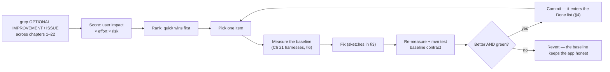

# Appendix A3 — Consolidated Performance Roadmap

> **Part 14 of InvoiceStudio: Zero to Finished Product**
> Files covered: none new — this appendix gathers **every** `OPTIONAL
> IMPROVEMENT` block and every performance-relevant `ISSUE:` marker from
> Chapters 1–22 into one ranked roadmap, expands the top items with fix
> sketches, lists the wins the app *already ships*, and shows how to measure
> each change with the harnesses Chapter 21 left you.
> Goal at the end: **a prioritized, effort-priced work list — and the
> discipline to check it against reality before and after every change.**

---

## 1. How this roadmap was built

Two greps over the finished book produced the raw material: every
`OPTIONAL IMPROVEMENT` block (59 of them across Chapters 1–22) and every
`ISSUE:`/`GAP:` marker (roughly 40 issues plus the gaps). Each candidate was
then scored on two axes:

- **User impact** — where the user would feel it: *launch* (startup),
  *scroll* (frame smoothness), *typing* (keystroke latency), *click*
  (navigation, save, report build), or *memory* (long sessions, leaks).
- **Effort** — Easy (minutes, one local change), Medium (a focused hour with
  tests), Hard (a design change).

Ranking follows one rule, stated by the project's own skill note (Ch 21):
*"Never optimise without a reproducer proving the need"* — so **quick wins
that touch what users feel come first**, deep structural work comes last,
and pure hygiene (dead fields, duplicated mappers) rides along at the
bottom. Correctness fixes that only cost milliseconds of developer time are
ranked with the quick wins too, because cheap truth is the cheapest win of
all.

A note on expectations, before the table: this app is already *fast* at its
target scale. A local SQLite file with thousands — not millions — of rows,
caches warmed at boot, and a single-writer executor make the common paths
sub-50 ms. The roadmap is what you reach for when the books grow (Ch 21's
merchant sim ran three months of a real business through it) or when you
want the polish that separates a library app from a consumer app.



---

## 2. The ranked roadmap

| # | Item | Where (file) | Ch | User impact | Effort | Risk |
|---|---|---|---|---|---|---|
| 1 | O(1) buyer lookup in the Transport report (replace per-transaction `stream().filter()`) | `ui/views/ReportsBuilders.java` · `buildTransportPerformanceReport` | 14 | click — report stays instant as books grow (5,000 tx × 500 buyers = 2.5M comparisons → 5,000 map hits) | Easy | Low |
| 2 | One `FilteredList` + one search listener in Stock Analysis (stop the per-rebuild listener leak) | `ui/views/StockAnalysisView.java` · `applySearchFilter` | 14 | memory + typing — refreshes stop hoarding lists; typing stops driving stale predicates | Easy | Low |
| 3 | Debounce the designer's text/SVG textarea repaints | `ui/views/TemplateDesigner.java` · property editors → `refreshCanvas()` | 15 | typing — full canvas rebuild per keystroke becomes one per pause (mirror of Ch 12's debounce) | Easy | Low |
| 4 | Real weekly parcels in Dashboard 2 (replace the `totalParcels / 8` placeholder) | `ui/views/Dashboard2View.java` · `createParcelBody` Week branch | 14 | click — the Week chart finally moves week to week (correctness + trust) | Easy | Low |
| 5 | Enable WAL mode for smoother concurrent reads | `db/DatabaseManager.java` · constructor, after `initSchema()` | 3 | launch/scroll — readers stop blocking the writer during warm/sweep | Easy | Low |
| 6 | `PendingOperations` hygiene: `AtomicLong` sequence + TTL expiry | `mcp/PendingOperations.java` | 18 | click — thread-safe queueing; stale approvals can no longer pile up forever | Easy | Low |
| 7 | Atomic bill numbering: number + increment in one SQLite statement | `db/BillDao.java` (+ `Settings` counter use in `CreateBillView`) | 4 | click — duplicate bill numbers impossible across processes/crash-retry | Easy | Low |
| 8 | Reuse one staging `Scene` across the bulk-print loop | `service/LabelPrintService.java` / `TsplPrintService` raster path | 17 | click — bulk label spooling stops paying scene-graph construction per label | Easy | Low |
| 9 | Return unmodifiable lists from `DataManager` cached getters (+ explicit copy for sorting) | `ui/DataManager.java` · `getAll*()` | 8 | memory/safety — the mutation hazard Ch 8 flagged becomes compile-time impossible | Easy | Medium — compiler/tests find mutating callers |
| 10 | LRU-cap the shell's view cache (evict beyond ~12 views) | `ui/StudioApp.java` · `viewCache` | 9 | memory — long sessions with every view visited stop climbing | Easy | Low |
| 11 | Debounce the Knowledge Hub search field | `ui/KnowledgeHubPanel.java` | 20 | typing — one rebuild per typing pause instead of per keystroke | Easy | Low |
| 12 | Hoist the Categories/Transports count scans out of the build path | `ui/views/CategoriesView.java`, `TransportsView.java` | 11 | click — view build stops re-scanning per KPI | Easy | Low |
| 13 | `nextPurchaseSequence` without a full-table scan | `ui/views/CreatePurchaseView.java` | 13 | click — purchase entry stays instant as the register grows | Easy | Low |
| 14 | Key the model catalogue cache by API key | `service/ModelCatalog.java` | 19 | click — switching keys shows the right model list immediately | Easy | Low |
| 15 | Async audit persistence (background the disk append) | `mcp/McpAuditLog.java` | 18 | click — tool calls stop waiting on a file open per line | Easy | Low |
| 16 | Reset the red-border style on each save attempt in the Hub editor | `ui/KnowledgeHubPanel.java` · `saveCurrentEdit` | 20 | click — the error state stops sticking after a later successful save | Easy | Low |
| 17 | Remove the `javafx-fxml` dependency | `pom.xml` | 1 | launch/build — a smaller jar and one less module resolution | Easy | Low |
| 18 | Deep-copy `points`/`pathData`/`svgSource` in `duplicateSelected()` | `ui/views/TemplateDesigner.java` | 15 | click — duplicates of custom paths stop coming out as blank boxes (correctness) | Easy | Low |
| 19 | Replace reflection-based `companyStateCode()` with the direct accessor | `ui/views/CreatePurchaseView.java` / `Settings` | 13 | click — removes a fragile lookup on the purchase path | Easy | Low |
| 20 | Atomic (write-temp-then-move) knowledge saves | `service/KnowledgeRepository.java` · `saveToLocalStorage` | 20 | memory — a crash can no longer truncate the user's knowledge library | Easy | Low |
| 21 | One packaging script shared by CI and humans (kill the jpackage-args duplication) | `packaging/build-windows-installer.ps1`, `.github/workflows/windows-installer.yml` | 22 | launch — installer builds stop drifting between local and CI | Medium | Low |
| 22 | Gate the release tag: pom↔`AppVersion` match + `mvn test` before packaging | `.github/workflows/windows-installer.yml` | 22 | launch — no untested installer can ship again | Easy | Low |
| 23 | Test-infra quartet: singleton-reset JUnit extension, `@TempDir` suite DBs, JUnit-tagged road tests, golden-frame pixel baselines | `src/test/*` | 21 | memory — developer time; suites stop fighting over singletons | Medium | Low |
| 24 | Extract the duplicated item row-mapper | `db/ItemDao.java` (+ `PurchaseBillDao` usage) | 4 | memory — hygiene; one mapper to fix when columns change | Easy | Low |
| 25 | Remove the dead `mapper` field in `DatabaseManager` | `db/DatabaseManager.java` | 3 | memory — hygiene | Easy | Low |
| 26 | `BillTotals` constructor honesty (drop or store `dueAmount`) | `model/BillTotals.java` | 6 | click — a misleading signature stops confusing readers (runtime unaffected) | Easy | Low |
| 27 | Stock ledger: wrap movement-append + recompute in ONE transaction | `db/StockLedgerDao.java` + `DataManager.saveBill` | 5 | click — balances cannot drift if the app dies mid-save | Medium | Medium |
| 28 | Preserve per-tab UI state in `ReportsView.refresh()` (surgical refresh) | `ui/views/ReportsView.java` + `ReportsBuilders` | 14 | click — a background data change stops erasing the user's search/buyer selection | Medium | Medium |
| 29 | Snapshot undo on gesture end (not per arrow-key tick) | `ui/views/TemplateDesigner.java` + `DesignerState` | 15 | typing — the 50-deep undo stack stops flooding during nudges | Medium | Low |
| 30 | Pre-build the first view during warm-up | `ui/StudioApp.java` · `warmCachesAsync` `onDone` | 9 | launch — even the first dashboard paint skips construction | Medium | Low |
| 31 | Debounce master-data search predicates for very large datasets | `ui/views/BuyersView.java` et al. | 11 | typing — predicate churn per keystroke smoothed on huge directories | Medium | Low |
| 32 | ExpensesView account/category combos: stop rebuilding on every open | `ui/views/ExpensesView.java` | 13 | click — dialog opens snappy with many accounts | Medium | Low |
| 33 | Proactive token refresh on a scheduler (before expiry, not on boot) | `service/FirebaseAuthService.java` + shell hook | 10 | click — no mid-session re-login surprise | Medium | Low |
| 34 | Move the MCP bearer token into the vault | `mcp/McpConfig.java` + `service/ApiKeysVault.java` | 18 | memory — plaintext posture improved (security, not speed) | Medium | Low |
| 35 | Typed MCP schemas (real `num`/`bool`/`arr` from the type helpers) | `mcp/McpToolRegistry.java` · `obj()` | 18 | click — external assistants stop over-guessing argument types | Medium | Low |
| 36 | Stop button for in-flight chatbot sends | `ui/ChatbotPanel.java` + `AiChatClient` | 19 | typing — the user regains control of a long tool loop | Medium | Low |
| 37 | jlink-trim the bundled runtime | `packaging/build-windows-installer.ps1` `$Common` | 22 | launch — smaller installer, fewer modules to resolve at start | Medium | Medium |
| 38 | `duplicateSelected`/undo safety net: generate `copy()` + null-checks for `TemplateElement` | `model/TemplateElement.java` | 7 | click — new element properties can no longer be dropped by undo/clipboard | Medium | Low |
| 39 | Per-collection locks (`ReentrantReadWriteLock`) if warm/read contention ever shows | `ui/DataManager.java` | 8 | scroll — only if profiling ever shows contention (today it will not) | Medium | Low |
| 40 | One-pass, Canvas-based preview renderer for 100+ line roll invoices | `ui/BillPreviewPane.java` / `DesignObjectRenderer` | 12 | scroll/typing — node count drops ~10× on extreme invoices | Hard | Medium |
| 41 | SSE token streaming for the big chat providers | `service/AiChatClient.java` | 19 | typing — first token arrives in ~1 s instead of full-answer time | Hard | Medium |
| 42 | Real multi-page PDF flow (live `pageNo`/`pageCount`) + apply `PageConfig.Margins` + searchable text layer | `service/PdfExportService.java` | 16 | click — feature completion more than speed | Hard | Medium |
| 43 | Derive label dots-per-mm from the driver, not the stock name | `service/TsplPrintService.java` | 17 | click — unknown printers stop falling back to name matching | Medium | Low |

Correctness items riding the same greps but with no runtime cost (kept in
the table above where cheap: #4, #16, #18, #19, #26) — plus the documented
`GAP:`s that are features, not perf: the Item Performance tab with no
visible tab (Ch 14), `resetToDefaults()` wired to nothing (Ch 20), pending
the day someone wants them.

### 2½ Reading the table as a sprint plan

The ranking is deliberately executable in batches, each batch shippable in
one sitting and verifiable with §6's harnesses:

1. **The report/dashboard batch (#1–#4).** Four Easy items, all in views
   Ch 14 built, all provable with `MerchantTour` timings and the swap
   counters. One afternoon; the two dashboards and the Reports view come
   out measurably calmer on grown books.
2. **The durability batch (#5–#8).** WAL, approval-queue hygiene, atomic
   numbering, one shared print scene — each touches one subsystem's edge,
   each has a test or harness that guards it today.
3. **The hygiene batch (#9–#20).** Unmodifiable caches, the LRU cap, and
   the correctness cheapies. Low glory, zero risk, and the compiler does
   half the verification for you.
4. **The structural batch (#21–#39).** Taken one per change, always behind
   a green `mvn test`, always with a before/after number.
5. **The hard tail (#40–#43).** Only when the reproducer exists — a real
   100-line invoice, a real streaming use case, a real unknown printer.

One rule makes the batches safe: **never two table items in one commit.**
The book's own history (the coalesced-ruler change verified by extending
`RulerVerify`) is the template — one behavior change, one extended
reproducer, one green suite.

---

## 3. The top ten, expanded

Each item below: the problem, why it matters, a fix sketch in the book's own
style (the full versions live in the source chapters), and what the user
would actually feel.

### 3.1 O(1) buyer lookup in the Transport Performance report (#1)

**Problem.** `buildTransportPerformanceReport` finds each transaction's
buyer with `buyers.stream().filter(by -> by.getId().equals(t.getBuyerId()))
.findFirst().orElse(null)` — a linear scan per transaction. That is
O(transactions × buyers): Ch 14 computes 2.5 million string comparisons at
5,000 × 500, all on the FX thread during the report build.

**Why it matters.** This is the difference between a report whose cost is
proportional to the *data* and one proportional to the *square* of the data.
The sim's three-month books already made the tab noticeably busy; a real
year of trading multiplies both axes.

```java
// Fix sketch (Ch 14) — build the map once, before the transaction loop
Map<String, Buyer> buyerById = buyers.stream()
        .collect(Collectors.toMap(Buyer::getId, b -> b));
// inside the loop:
Buyer b = buyerById.get(t.getBuyerId());
```

**What the user feels:** the Transport tab opens as fast in December as it
did in January — the click never grows with the books.

### 3.2 One `FilteredList` in Stock Analysis (#2)

**Problem.** `applySearchFilter()` re-wraps the stock table's items in a
fresh `FilteredList` and registers a *fresh* search-field listener on every
`rebuild()`. After ten refreshes, ten listener/list pairs exist; typing runs
every stale predicate (Ch 14's `ISSUE:`, verified against source).

**Why it matters.** Behavior stays correct today (the last listener wins),
but memory grows and every keystroke pays for dead predicates — a textbook
slow leak that no user will ever report and every profiler eventually finds.

```java
// Fix sketch (Ch 14) — one field, registered once in the constructor
private final FilteredList<FinancialService.StockSummaryRow> filteredStock =
        new FilteredList<>(FXCollections.emptyObservableList());
// constructor: searchField.textProperty().addListener((o, a, b) ->
//     filteredStock.setPredicate(r -> q(b).isEmpty()
//             || r.name().toLowerCase().contains(q(b))));
// rebuildStockTable: filteredStock.setAll(rows); stockTable.setItems(filteredStock);
```

**What the user feels:** nothing visible — which is the point. Refreshes
stop hoarding, and the search stays crisp no matter how often the view
rebuilds.

### 3.3 Debounce the designer's textarea repaints (#3)

**Problem.** The text and SVG property editors call the full
`refreshCanvas()` on every keystroke (Ch 15's `ISSUE:`). The designer's own
ruler already coalesces mid-gesture rebuilds with a ~120 ms
`PauseTransition` — the textareas just never got the same treatment.

**Why it matters.** A full canvas rebuild per character is the most
repeated heavy work in the whole app while typing; on a template with many
elements it is the difference between "typing into the title" and "watching
the canvas stutter."

```java
// Fix sketch (Ch 15) — mirror of Ch 12's CreateBillView debounce
private final PauseTransition textDebounce = new PauseTransition(Duration.millis(150));
// in the editor listener:
textDebounce.setOnFinished(e -> refreshCanvas());
textDebounce.playFromStart();   // restarted per keystroke; fires on pause
```

**What the user feels:** typing in a property field stays fluid; the canvas
catches up a beat later, exactly like the bill preview already behaves.

### 3.4 WAL mode for the database (#5)

**Problem.** The database runs in SQLite's default journal mode: readers
and the single writer contend on lockfiles. Ch 3 sketched the improvement
when discussing concurrent warm-reads during writes.

**Why it matters.** WAL (write-ahead logging) lets readers proceed while a
write commits. The boot sequence (A2, §5–§7) interleaves sweep writes with
cache-warm reads; WAL removes the tail latency where those collide, and it
helps every background export that reads while the user edits.

```java
// Fix sketch (Ch 3) — in DatabaseManager's constructor, after initSchema()
try (Statement st = getConnection().createStatement()) {
    st.execute("PRAGMA journal_mode=WAL");
}
```

**What the user feels:** nothing in single-user use — and everything the
day they run a bulk PDF export while typing a bill: no hitch when the two
lanes cross. (Trade-off noted in Ch 3: WAL adds `-wal`/`-shm` side files
beside the database — `AppDirs` already owns the directory.)

### 3.5 `PendingOperations` hygiene: atomic sequence + TTL (#6)

**Problem.** `PendingOperations.SEQ++` is a non-atomic increment on the
4-thread pool (Ch 18's marker), and pending operations never expire — only
approve/reject/stop removes them.

**Why it matters.** The approval queue is a *safety device*; a torn
sequence number or an unbounded queue of stale destructive proposals is
exactly the kind of quiet rot safety devices cannot afford.

```java
// Fix sketch (Ch 18)
private static final AtomicLong SEQ = new AtomicLong();
// expiry: on each sweep, drop ops older than, say, 24 h
pending.removeIf(op -> System.currentTimeMillis() - op.createdAt() > TTL_MS);
```

**What the user feels:** the approvals card in Settings shows only
decisions that still matter, and two AI clients approving simultaneously
can never race the counter.

### 3.6 Reuse one `Scene` across the bulk-print loop (#8)

**Problem.** The label raster path builds a staging scene-graph per label
as it renders each row to a 1-bit `MonoImage`. Ch 17 sketched reusing one
scene for the whole run.

**Why it matters.** Bulk printing is the app's most batch-shaped job (the
sim's stress pass rendered 118 invoices + multi-copy label rows); per-row
scene construction is pure overhead multiplied by every copy.

```java
// Fix sketch (Ch 17)
private static final ThreadLocal<javafx.scene.Group> STAGE =
        ThreadLocal.withInitial(javafx.scene.Group::new);
// render into STAGE.get(), snapshot, clear children — same nodes, next label
```

**What the user feels:** the bulk dialog's progress bar moves in a smooth
line instead of stepping where scene construction clusters — and big jobs
finish sooner on the same hardware.

### 3.7 Unmodifiable lists from the cache hub (#9)

**Problem.** `DataManager.getAllBills()` and friends return the *live*
cached list; nothing enforces read-only treatment (Ch 8's `ISSUE:` "enforced
only by convention"). One accidental `.sort()` on the returned list would
mutate global app state.

**Why it matters.** This is the one hazard in the cache design with a
silent failure mode. Ch 11's views already *copy before sorting* — the
convention works — but conventions do not compile.

```java
// Fix sketch (Ch 8)
public List<Bill> getAllBills() {
    synchronized (this) {
        if (billsCache == null) billsCache = billDao.getAllBills();
        return Collections.unmodifiableList(billsCache);
    }
}
// callers that must sort: List<Bill> copy = new ArrayList<>(app.getData().getAllBills());
```

**What the user feels:** nothing — today. The win is that the class of
"view sorted the shared cache and every other view now shows the wrong
order" bugs becomes unrepresentable.

### 3.8 LRU-cap the shell's view cache (#10)

**Problem.** `StudioApp.viewCache` holds every visited view for the whole
session — up to 17 live view graphs, "tens of MB worst case with big
tables" (Ch 9's own estimate), and Ch 9 sketched the LRU eviction.

**Why it matters.** Memory only grows in this design; a merchant who
visits every screen in one long day keeps every node graph alive. An
LRU cap bounds the worst case with about ten lines.

```java
// Fix sketch (Ch 9) — on insert, evict the least-recently-used beyond N
if (viewCache.size() >= MAX_CACHED_VIEWS) {
    viewCache.keySet().stream()
        .min(Comparator.comparingLong(lastUsed::get))
        .ifPresent(viewCache::remove);   // rebuilt fresh on next visit
}
```

**What the user feels:** nothing in a normal day; the app's memory just
stops creeping upward across marathon sessions.

### 3.9 Pre-build the first view during warm-up (#30)

**Problem.** The warm pass (A2, §7) fills the data caches, but the first
`DashboardView` is still *constructed* on the FX thread when navigation
arrives — Ch 9's sketched Medium improvement.

**Why it matters.** First impressions are made once. Construction is the
only remaining first-click cost that boot does not already hide.

```java
// Fix sketch (Ch 9) — inside warmCachesAsync's onDone, already on FX-safe ground
Platform.runLater(() -> showDashboardInternal());  // partially achieved today
```

**What the user feels:** the first dashboard appears with no construction
beat at all — the boot timeline's last visible step disappears.

### 3.10 Atomic bill numbering (#7)

**Problem.** The bill number comes from the settings counter, bumped
inside the save task (Ch 12) — safe within the single-writer executor, but
two *processes* (a laptop plus the shop PC pointing at a shared file) or a
crash between save and bump can allocate the same number twice. Ch 4
sketched the SQL-level fix.

**Why it matters.** Bill numbers are legal identifiers on invoices. The
sim found duplicate purchase numbers being accepted silently (Ch 21); the
sales side deserves the same armor.

```sql
-- Fix sketch (Ch 4): number + increment in one statement
UPDATE settings SET json_data = <re-serialized with billNoNext+1>
WHERE id = ? AND user_id = ?;
-- RETURNING/next-read yields the exact number this process owns
```

**What the user feels:** nothing — unless they run two installs against
one data file, in which case the invoice register never shows a
duplicated number again.

---

## 4. Already shipped — the wins the app applies today

Before reaching for the table above, credit what the codebase already does.
These shipped during the optimization pass (Ch 21's
`OPTIMIZATION_REPORT_2026-09-16.md` contract: *230/230 green → change →
green again*) and are load-bearing in A2's walkthrough:

- **`ThreadLocal`-cached formatters — `AppFormatters`.** Every
  `DecimalFormat` is a `ThreadLocal.withInitial(...)` slot
  (`plain2`, `grouped`, `inrFormat()`); views share one instance per build
  instead of re-parsing patterns per cell render (Ch 14).
- **Chart caching on Dashboard 2.** `setAnimated(false)` everywhere plus
  `setCache(true)` + `CacheHint.SPEED` — the smooth-scroll glide moves a
  texture instead of re-rasterizing hundreds of chart nodes per frame
  (Ch 14).
- **Section-scoped swaps.** Dashboard 2's parcel-period and recent-type
  toggles replace one card body (`getChildren().set(1, body)`) — scroll
  position and every other section stay put, with `parcelSwapCount` /
  `recentSwapCount` shipped so tests can *prove* a swap (Ch 14/21).
- **The 150 ms preview debounce in `CreateBillView`.** One reused
  `PauseTransition`; totals compute per keystroke (microseconds), only the
  renderer waits for the pause — "an editor that never hitches" (Ch 12).
- **Smooth scrolling.** `Dashboard2View.installSmoothScrolling`: extending
  glide targets, eased 90–380 ms glides, nested-table exemption — the
  single best feel-per-line-of-code in the app (Ch 14).
- **View caching + fade navigation.** `cached(id, factory, refresher)` —
  O(1) navigation, no construction on revisit, epoch-driven surgical
  refresh with the ⟳ pill (Ch 9).
- **Warm caches at boot.** `warmCachesAsync` touches all nine collections
  off the FX thread, so first paints are instant (Ch 8).
- **The single-thread `dbExecutor`.** All SQLite serialized — no
  `SQLITE_BUSY` storms, predictable ordering, FX never touches the database
  directly (Ch 9).
- **Debounced window persistence.** A resize burst is ≤1 registry write
  (Ch 9).
- **Coalesced designer ruler repaints.** The optimization pass's one
  behavior change — mid-gesture ruler rebuilds merged into a trailing-edge
  ~120 ms `PauseTransition`, verified by *extending* `RulerVerify` to flush
  before asserting (Ch 21).
- **Background saves and bulk rendering.** Bill saves, buyer find-or-create
  and the batch PDF export all ride the `dbExecutor`; the toast only
  appears after the data reload (Ch 12).
- **One-pass aggregation everywhere.** `ExpenseAnalytics.build()`,
  `FinancialService`, the dashboards — one loop, many buckets, no repeated
  scans (Ch 13/14).

The lesson the Done list teaches: almost every remaining item in §2 is the
*same three ideas* — debounce, cache, hoist — applied to one more place.

---

## 5. What not to do (the anti-roadmap)

Three tempting "optimizations" the book examined and rejected — kept here so
nobody re-litigates them with less information:

- **Patch caches on write** (insert the new bill into the cached list
  instead of invalidating). Rejected in Ch 8: patch code must replicate
  every DAO write rule and is where stale-ghost bugs breed; a local re-read
  is ~10 ms on a background thread.
- **Per-collection locks today.** Ch 8 again: at local-SQLite scale,
  warm-vs-read contention never shows; the `ReentrantReadWriteLock` item
  (#39) is deliberately ranked last-ish and conditioned on profiling.
- **Rebuild views per navigation instead of caching.** Rejected in Ch 9:
  every click would pay 50–300 ms of layout on big tables and reset scroll
  positions, to save memory that #10's LRU cap bounds more cheaply.

---

## 6. How to measure

The Prime Directive (Ch 21, from `.freebuff/skills/javafx-best-practices/
SKILL.md`): *"Never optimise without a reproducer (test, smoke run, or
profiler trace) proving the need."* In practice, that means a number before
and a number after — and the book left the instruments on the workbench.

**What to time, and how:**

| Metric | How to capture | Healthy at book-scale | Harness to reuse |
|---|---|---|---|
| Launch-to-dashboard ms | timestamp around the boot: log at `start()` entry and at first `DashboardView.refresh()` end | sub-second on the sim's hardware | `SmokeLauncher` (bootstrap point) + a two-line `AppLog` pair |
| Tab-switch ms (nav click → painted) | wrap `setView` in `System.nanoTime()` before/after, log per view id | O(1) revisits ≈ 0; first visit = construction only | `NavSmokeRunner`'s 47 steps (each step is a nav) via `scripts/nav_smoke_test.sh` |
| Keystroke → preview ms | time from the totals listener to `BillPreviewPane` repaint completion (log inside the debounce's `onFinished`) | ≤150 ms debounce + render | Ch 12's checkpoint + Ch 21's visual tests |
| Report build ms | time `ReportsBuilders.build…()` per tab | Transport report flat as books grow (see #1) | `MerchantTour`'s 10 timed stops over sim books |
| Scroll frame smoothness | `ZoomScrollVerify` / `SelectionZoomVerify` journeys + eyeball on Xvfb screenshots | glide, no steps | the two verify scripts |
| Bulk throughput | documents per minute across the batch run | sim baseline ≈ 49 docs/min | `MerchantBulkStress` + `scripts/bulk_verify_test.sh` |
| Label pipeline latency | per-label raster+spool ms | flat across a strip run | `scripts/tspl_verify_test.sh` (`TsplPipelineVerify`) |
| Whole-business survival | the simulated three months | CLEAN verdict, all counters green | `MerchantSimSeed` → `MERCHANT_SIM_REPORT.md`, audited with `merchant-sim/Q.java` |

**The method, borrowed from the project's own history** (Ch 21's
optimization report): write the baseline number down, make the change,
re-run `mvn test` (the baseline contract in Ch 21 was *230/230 → change →
green*; today's estate is 389 `@Test` methods), re-measure, and keep the
change only if **both** the number and the suite improved. `docs/
PERFORMANCE_OPTIMIZATION_GUIDE.md` remains the companion manual — its two
pillars (billing and the template designer) are exactly where items #3 and
#40 live — and its promise still binds: 60 FPS and sub-50 ms interactions
*without altering any visual output, millimeter precision, calculation
formula, or user workflow*, a promise only meaningful because
`WorkshopScenarioTest` and the pixel probes hold the formulas still.

Two practical cautions, both from the chapters: measure on the *packaged*
jar when the number will be quoted (`nav_smoke_test.sh` already builds and
runs the shaded jar, Ch 22), and remember the verify-harness isolation dirs
(`ls-verify/`, `cb-verify/`, `bulk-verify-run/`, `dash2-smoke/`) — a
measurement run must never write into a real user profile (Ch 21/22).

---

## 7. Coverage self-check

**This appendix covered:** the consolidation method (impact × effort ×
risk, quick wins first, the Prime Directive as ranking law); the single
ranked roadmap of 43 items gathered from all 59 `OPTIONAL IMPROVEMENT`
blocks and every perf-relevant `ISSUE:` marker across Chapters 1–22, each
with file, chapter, user-impact lane, effort and risk; the top ten items
expanded with problem, rationale, fix sketch and felt effect; the Done list
of twelve shipped wins with their chapters; the anti-roadmap of three
examined-and-rejected ideas; and the measurement section mapping each metric
to the Chapter 21 harness that already measures it.

**Deliberately not re-litigated:** correctness `GAP:`s that are features
(item Performance tab, `resetToDefaults`), packaging security posture
beyond item #34, and any rewrite of code the tests pin — those live in
their chapters and in Appendix A4's index.

**The one-sentence version:** the app is already fast because its
chapters debounced, cached and hoisted as they built; the roadmap applies
the same three ideas to the last few corners, one measured change at a
time.

**Next: Appendix A4 — Troubleshooting Guide · Glossary · Index.**
