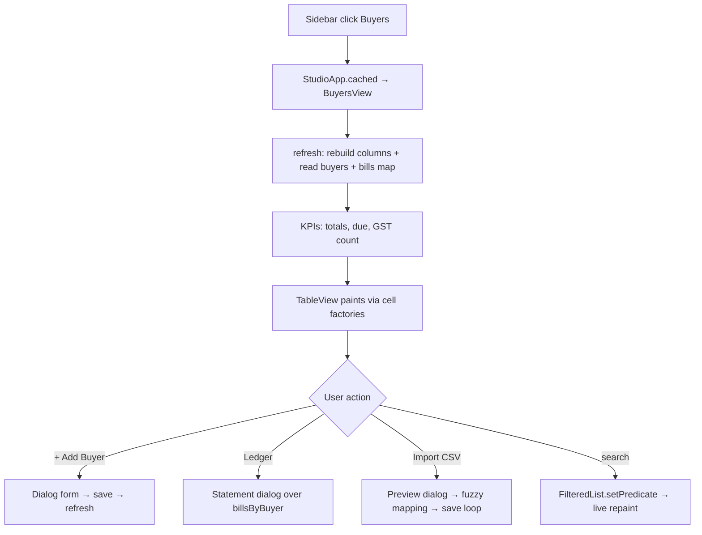

# Chapter 11 — Listing & Editing Data: The Master-Data Views

> **Part 6 of InvoiceStudio: Zero to Finished Product**
> Files covered in full this chapter: `ui/views/BuyersView.java`, `ui/views/SuppliersView.java`,
> `ui/views/ItemsView.java`, `ui/views/CategoriesView.java`, `ui/views/TransportsView.java`,
> `ui/views/VariablesView.java`, `ui/views/SettingsView.java`, `ui/views/SettingsFieldSupport.java`.
> Goal at the end: you can build any CRUD (Create-Read-Update-Delete) screen in this app's
> design language — search, KPI cards, tables with row actions, modal forms — and you will
> know the performance trap that once made the Buyers screen the slowest in the app.

---

## 1. Chapter goal

By the end of this chapter you will have built every "directory" screen of the app:

- **Buyers** — customers, with statements, CSV import/export and custom fields.
- **Suppliers** — sellers (sundry creditors), with a real double-entry ledger.
- **Items** — the product catalog plus a sales-report tab.
- **Categories** and **Transports** — the two small support directories.
- **Variables** — the custom placeholder system (fixed / table / barcode scopes).
- **Settings** — the app's control room: profile, bank, numbering, fonts, print calibration, backup.

Every one of these screens is built from the same five ingredients, so we will learn the
pattern **once** and then see how each screen extends it.

## 2. Story intro

Think of a shop's back office. There is one wall with the customer files (Buyers), one with
supplier files (Suppliers), a cabinet of product cards (Items), and so on. The shopkeeper does
not want a different procedure for every cabinet — they want the *same* ritual: open the
cabinet, search for a folder, read the summary card on the front, edit the folder in a form,
put it back. A good UI is that ritual made consistent.

That is exactly what these views are: one repeated "cabinet ritual" (top bar → KPI cards →
search → table → dialog form), specialised per directory. And one of them — Buyers — carries
a war story: it was once the slowest screen in the app for a reason that is *invisible* in
small demos and *fatal* at 10,000 records. We will dissect it, because the mistake it made is
the single most common JavaFX performance bug.

## 3. Concepts first

You have met most of these; the new ones for this chapter:

**TableView<T>** — JavaFX's data grid control. You give it (a) a list of items `ObservableList<T>`,
(b) a set of `TableColumn`s, each with a *cell value factory* that says which piece of the
object a column shows, and optionally (c) a *cell factory* that controls *how* the cell is
rendered (badge, button, avatar…). Two facts drive everything in this chapter:

1. Cell factories run **per visible cell, per update** — code inside them is on the hot path.
   Anything expensive there (a DB query!) runs hundreds of times per frame.
2. `setItems` replaces the whole backing list; typing in a search field usually re-filters it
   via a **FilteredList** (`new FilteredList<>(master, predicate)`), which is a live,
   re-filterable *view* of the master list — no copying.

**Dialog<T>** — a modal window whose purpose is to *produce a value*. You build controls,
then install a `setResultConverter(button -> value)` that turns the pressed button into the
result object. `showAndWait()` blocks until closed and returns `Optional<T>`. This is the
app's universal "form" pattern.

**FilteredList + predicate** — typing in the search box calls `setPredicate(...)`, and the
table updates automatically. No manual list rebuilding.

**A `record` inside a method** — Java records can be declared inside methods
(`record LedgerRow(String date, ...) {}` in SuppliersView). They are perfect for
dialog-local table rows.

**Vertical Box model** — every view is a `BorderPane` (top = toolbar, center = table) or a
`VBox` (title → KPIs → cards), styled by the global stylesheet classes you saw in Chapter 9
(`bg-app`, `card-pane`, `table-header-row`, `table-data-row`, `kpi-card`, …).

## 4. Files in this chapter

| File | Type | Purpose |
|---|---|---|
| `ui/views/BuyersView.java` | View (957 lines) | Customer directory: KPIs, dynamic columns, statements, CSV import/export, custom fields |
| `ui/views/SuppliersView.java` | View (877 lines) | Seller directory: validation, banking, double-entry ledger dialog |
| `ui/views/ItemsView.java` | View | Catalog + sales-report tab, item dialog, analytics |
| `ui/views/CategoriesView.java` | View | Category manager with live assigned-item counts |
| `ui/views/TransportsView.java` | View | Carrier directory with buyer-usage counts |
| `ui/views/VariablesView.java` | View | Custom variables: 3 scopes, built-in reference, buyer-field overview |
| `ui/views/SettingsView.java` | View (1414 lines) | Settings hub: profile, bank, billing prefs, custom fields, fonts, print calibration, thermal threshold, backup |
| `ui/views/SettingsFieldSupport.java` | Helper | Extracted stateless builders (expandable text area, slugify) |

## 5. Step-by-step build

### Step 1 — BuyersView: the pattern, plus the war story

The class skeleton is the shared pattern:

```java
public class BuyersView extends BorderPane {
    private final TableView<Buyer> table = new TableView<>();
    private FilteredList<Buyer> filteredBuyers;
    private final TextField searchField = new TextField();
    private final Label resultCountLbl = new Label("0 customers");

    // KPI Summary values
    private final Label statTotalBuyers = UiTheme.kpiValue("0");
    private final Label statTotalDue = UiTheme.kpiValue("₹0.00");
    private final Label statGstRegistered = UiTheme.kpiValue("0");

    /** Built once per refresh: buyer name (lower-case) → their bills. */
    private Map<String, List<Bill>> billsByBuyer = Map.of();
    private List<Buyer> allBuyers = List.of();

    public BuyersView(StudioApp app) {
        setPadding(new Insets(24));
        getStyleClass().add("bg-app");
        setTop(createTopBar());
        setCenter(createTableArea());
        refresh();
    }
```

* Block by block: fields first — the table, the filtered wrapper, the search box, three KPI
  labels. Note `Map.of()` / `List.of()`: immutable empty defaults so no field is ever null
  before the first `refresh()`.
* The constructor is just **top / center / refresh** — the same three beats every view beats.

The class's own doc comment is the war story:

```java
/**
 * PERFORMANCE FIX (this was the app's worst bottleneck):
 * The old build computed "bills of this buyer" with a full {@code getAllBills()}
 * DB scan INSIDE every table-cell renderer — hundreds of scans per frame.
 * Now: a single buyer→bills map is built once per refresh from the DataManager
 * cache and every cell / KPI reads from it.
 */
```

And the fix, in `refresh()`:

```java
public void refresh() {
    rebuildTableColumns();
    allBuyers = app.getData().buyers().getAllBuyers();

    // ONE pass over cached bills → buyer→bills map (was per-cell before!)
    List<Bill> allBills = app.getData().getAllBills();
    Map<String, List<Bill>> map = new HashMap<>();
    for (Bill bill : allBills) {
        String buyer = bill.getVariables().getOrDefault("buyer_name", "");
        if (!buyer.isBlank()) {
            map.computeIfAbsent(buyer.toLowerCase(), k -> new ArrayList<>()).add(bill);
        }
    }
    billsByBuyer = map;

    filteredBuyers = new FilteredList<>(FXCollections.observableArrayList(allBuyers), b -> true);
    table.setItems(filteredBuyers);
    applyFilter();
    updateSummaryStats(allBuyers, allBills);
}
```

**Why this matters (the deepest lesson in this chapter):** a `TableColumn`'s
`setCellValueFactory` runs for every row; a `setCellFactory` runs for every *visible* row
*every time the table repaints* (scroll, filter, hover-driven re-render). The old code did
`app.getData().getAllBills()` — a trip through the DAO — *inside* a cell factory. At 500
buyers and 2,000 bills that is a 2,000-record scan per cell, times ~30 visible cells, times
every repaint. The screen froze for seconds. The fix is the standard "denormalise once" move:
one O(n) pass builds a name→bills map; every cell is now a hash lookup, O(1).

> **OPTIONAL IMPROVEMENT:** keying by *name* is fragile — rename a buyer and their history
> detaches (the code acknowledges this by also matching case-insensitively). Bills store
> `buyer_name` in their variables map rather than a `buyerId` foreign key. A schema-level
> `buyer_id` column on `bills` would make the join exact. Cost: a migration + all bill writers
> setting the id. Difficulty: Medium. User-visible win: correct totals after renames.

**Dynamic columns** — custom buyer fields defined in Settings become table columns:

```java
Settings settings = app.getData().getSettings();
List<BuyerFieldDef> customDefs = settings != null && settings.getBuyerFields() != null ? settings.getBuyerFields() : List.of();
for (BuyerFieldDef def : customDefs) {
    TableColumn<Buyer, String> colCust = new TableColumn<>(def.getLabel());
    colCust.setCellValueFactory(d -> {
        Buyer b = d.getValue();
        String val = b != null && b.getCustom() != null ? b.getCustom().get(def.getKey()) : null;
        return new SimpleStringProperty(val != null && !val.isBlank() ? val : "—");
    });
    table.getColumns().add(colCust);
}
```

The value factory reads the buyer's `custom` map by the field's `key`. Because
`rebuildTableColumns()` runs on every `refresh()`, adding a field in Settings appears here on
the next visit.

**The name cell** — an avatar + two-line cell, showing how a cell factory replaces the whole
rendering:

```java
colName.setCellFactory(col -> new TableCell<>() {
    @Override protected void updateItem(Buyer b, boolean empty) {
        super.updateItem(b, empty);
        if (empty || b == null) { setGraphic(null); setText(null); return; }
        HBox box = new HBox(10);
        ...
        String initial = !b.getName().isBlank() ? b.getName().substring(0, 1).toUpperCase() : "C";
        Label avatar = new Label(initial);
        avatar.getStyleClass().add("avatar-circle");
        ...
        setGraphic(box);
    }
});
```

Note the rule every cell factory obeys: **set something in both branches** (graphic/text on
data, null on empty). Cells are recycled; forgetting the empty branch leaves stale pixels.

**Search across custom fields too:**

```java
filteredBuyers.setPredicate(b -> {
    if (q.isEmpty()) return true;
    boolean matchCore = name/phone/gst/state/code/address contains q...
    if (matchCore) return true;
    if (b.getCustom() != null) {
        for (String cv : b.getCustom().values())
            if (cv != null && cv.toLowerCase().contains(q)) return true;
    }
    return false;
});
```

**The form dialog** — `showBuyerFormDialog(existing)` builds a `Dialog<Buyer>`: a `GridPane`
of ~15 fields, an auto-fill listener (GSTIN → state code), the custom-field rows appended
dynamically, and the converter:

```java
dlg.setResultConverter(btn -> {
    if (btn == ButtonType.OK) {
        String id = existing != null ? existing.getId() : "byr_" + UUID.randomUUID()...;
        Buyer b = new Buyer(id, name, addr, gst, phone, state, stateCode);
        ...
        Map<String, String> customMap = new HashMap<>();
        if (existing != null && existing.getCustom() != null) customMap.putAll(existing.getCustom());
        for (Map.Entry<String, TextField> e : customInputs.entrySet())
            customMap.put(e.getKey(), e.getValue().getText().trim());
        b.setCustom(customMap);
        return b;
    }
    return null;
});
dlg.showAndWait().ifPresent(b -> {
    if (b.getName().isBlank()) { Toast...; return; }
    app.getData().buyers().saveBuyer(b);
    refresh();
});
```

Read the flow: converter builds the object, `showAndWait` returns it wrapped in `Optional`,
the consumer validates *again* (name blank), saves, refreshes, toasts. This
**convert → validate → save → refresh → toast** chain is the app's universal form epilogue.

**CSV import** — `showImportDialog()` is the most defensive code in the chapter: header
detection by fuzzy name matching (`name|customername|buyername`, `phone|mobile|contact`…),
positional fallbacks, a transport *find-or-create* with a per-import name→id cache, GSTIN→state
auto-derivation, merge-vs-update semantics from a checkbox, and a preview dialog before any
write. Every row save goes through the same `saveBuyer` as the manual form — one write path.

**Statement dialog** — `showStatementDialog(b)` renders a per-buyer ledger: a `TableView<Bill>`
with computed Paid/Balance columns, plus a summary bar (Total Billed / Paid / Due) summed from
the same `billsByBuyer` map. Note the paid-amount convention used everywhere in the app:

```java
double p = d.getValue().getPayments().stream().mapToDouble(BillPayment::getAmount).sum();
if (p == 0 && d.getValue().getStatus() == BillStatus.PAID) p = d.getValue().getTotals().getGrandTotal();
```

A `PAID` bill with no payment rows counts as fully paid — status is the source of truth when
payments are absent.

### Step 2 — SuppliersView: the mirror image with real validation

SuppliersView is BuyersView's purchase-side twin, but it differs in two instructive ways.

**A true double-entry balance.** The KPI and per-row "Balance / Payable" both funnel into:

```java
private double supplierBalance(Supplier s) {
    double bal = s.getOpeningBalance();
    for (PurchaseBill p : app.getData().getAllPurchases()) {
        if (s.getId() != null && s.getId().equals(p.getSupplierId())) {
            if (!p.isPaid()) bal += p.getAmountPayable() - p.getPaidAmount();
        }
    }
    return bal;
}
```

Doc comment: *positive = payable to the seller (Cr); negative = advance paid (Dr)*. Fully-paid
bills net to zero; the opening balance carries the pre-app history. The UI renders all three
states: `₹… Due` (red pill), `₹… Advance` (green pill), `✓ Settled`.

**Accountant-grade validation.** The form's converter is a wall of checks — and it teaches the
right reflex: validate with *specific* messages, never save half-clean data:

```java
String gst = gstF.getText().trim().toUpperCase();
if (!gst.isEmpty() && gst.length() != 15) { Alert... "GSTIN must be exactly 15 characters (got N)." ... return null; }
...
if (!ifsc.matches("[A-Z]{4}0[A-Z0-9]{6}")) { Alert... "IFSC format: 4 letters, '0', then 6 alphanumeric." ... return null; }
```

Returning `null` from the converter keeps the dialog open — the user fixes and retries. Also
note the GSTIN normalisation listener: it uppercases, strips non-alphanumerics, caps at 15
chars, and *re-sets its own text*, which re-triggers the listener with the clean value.

**The ledger dialog** — the chapter's best record trick:

```java
record LedgerRow(String date, String particulars, String type, double debit, double credit) {}
```

Opening balance first (as a Cr/Dr row), then every purchase bill sorted by date, each bill a
credit row and each of its payments a debit row, with a running balance. Bills paid-at-entry
(no payment rows) get a single settlement debit. This is a real account statement generated
from two data sources in ~40 lines.

### Step 3 — ItemsView: a catalog with a brain

ItemsView is a `VBox` (not BorderPane) with **two tabs**: Catalog and Sales Reports. Its
centrepiece is the aggregate engine:

```java
public static class ItemStat {
    public double totalQty = 0;
    public double totalAmount = 0;
    public int billCount = 0;
}

private void computeStats() {
    statsMap.clear();
    for (Bill b : allBills) {
        if (b.getStatus() == BillStatus.CANCELLED) continue;
        if (b.getItems() == null) continue;
        for (BillItem it : b.getItems()) {
            if (it.getDesc() == null || it.getDesc().trim().isEmpty()) continue;
            String key = it.getDesc().trim().toLowerCase();
            ItemStat st = statsMap.computeIfAbsent(key, k -> new ItemStat());
            st.totalQty += it.getQty();
            double itemTot = it.getQty() * it.getRate();
            if (it.getDiscPct() > 0) itemTot -= itemTot * (it.getDiscPct() / 100.0);
            st.totalAmount += itemTot;
            st.billCount += 1;
        }
    }
}
```

* **ISSUE (honest flag):** stats are keyed by lower-cased *description text*, and catalog rows
  join to stats the same way (`it.getName().trim().toLowerCase()`). Free-typed line items that
  differ by a space or typo ("Steel Rod", "steel rod.") silently split their stats. This is a
  deliberate simplicity trade-off — the fix is the same `item_id` on `BillItem` story as the
  buyer-rename issue above.
* Cancelled bills are excluded — money that never happened must not appear in reports.
* The analytics tab renders two "top 8" bar charts out of the same map (quantity and revenue),
  using `ProgressBar` nodes styled `gold-progress-bar` / `emerald-progress-bar` — no chart
  library needed for simple leaderboards.

The **item dialog** shows two small niceties: an *editable* ComboBox for units (pick PCS or
type your own), and — importantly for stock users — after every insert/update:

```java
app.getData().items().insert(it);
app.getData().stockLedger().recomputeItem(it.getId());
```

Editing an item's opening stock recomputes its stock-ledger row so the Stock view (Chapter 14)
never disagrees with the catalog.

### Step 4 — CategoriesView and TransportsView: the small ones

Both follow the identical mini-pattern: header + search + `TableView` + add/edit dialog +
delete confirmation. Their one distinctive idea is **live usage counts computed in the cell
value factory**:

```java
colCount.setCellValueFactory(d -> {
    String catId = d.getValue().getId();
    String catName = d.getValue().getName();
    long count = app.getData().getAllItems().stream()
        .filter(it -> catId.equalsIgnoreCase(it.getCategoryId()) || catName.equalsIgnoreCase(it.getCategoryName()))
        .count();
    return new SimpleIntegerProperty((int) count);
});
```

TransportsView does the mirror: how many buyers default to this carrier.

> **OPTIONAL IMPROVEMENT:** unlike BuyersView, these count scans *were not* hoisted out of the
> cell factory. With hundreds of categories the "Assigned Items" column triggers a full items
> scan per cell — the exact bug fixed in Step 1. Fix: compute a `Map<categoryId,Long>` once in
> `refresh()` (three lines), read it in the factory. Difficulty: Easy.

Delete is guarded by those counts: deleting a category with items warns
*"Deleting it will leave those items uncategorized"* — an informed delete, not a surprise.

### Step 5 — VariablesView: the placeholder system

VariablesView is where the app's text-substitution vocabulary is managed. Three scopes, shown
as a segmented pill bar:

```java
scopeFixedBtn = new Button("🔖  Bill Field (fixed)");
scopeFixedBtn.getStyleClass().addAll("btn-filter-pill", "active");
...
private void setScope(String scope) {
    currentScope = scope;
    // pill 'active' class shuffling ...
    boolean fixed = "fixed".equals(scope);
    boolean barcode = "barcode".equals(scope);
    if (defaultValueRow != null) { defaultValueRow.setVisible(fixed); defaultValueRow.setManaged(fixed); }
    if (choicesRow != null) { choicesRow.setVisible(barcode); choicesRow.setManaged(barcode); }
}
```

Note `setVisible` **and** `setManaged` — visible hides the node, managed removes it from
layout. Without `setManaged(false)` you would get an empty gap where the row was.

- **fixed** → one value per bill; the CreateBill form renders an input per fixed variable
  (`createCustomBillFieldsPane`, Chapter 12), optionally pre-filled with `defaultValue`.
- **table** → a per-line-item column; the Template Designer can add it as a table column.
- **barcode** → per-label values with a fixed `choices` list used by Bulk Label Print.

The built-in reference grid is a hardcoded `List<VarPair>` of 22 system variables
(`{{invoice_no}}`, `{{buyer_gstin}}`, `{{business_upi}}`…), plus a footer listing computed
totals (`{{subtotal}} {{cgst}} {{grand_total}} {{amount_in_words}}…`). The key input
auto-slugs from the label (listener compares against the current slug to avoid fighting manual
edits), and the add handler is one guard + one save + one toast — the pattern at its smallest.

### Step 6 — SettingsView: the control room (and a factory extraction)

SettingsView is the largest file of the chapter (1,414 lines) but is really **eleven tabs**
assembled in one place:

```java
tabPane.getTabs().addAll(
    createTab("Profile",   IconHelper.ICON_BUSINESS, buildProfileTabContent()),
    createTab("Bank",      IconHelper.ICON_BANK,     buildBankSection()),
    createTab("Billing",   IconHelper.ICON_BILLING,  buildBillingPrefsSection()),
    createTab("Fields",    IconHelper.ICON_FIELDS,   buildBuyerFieldsSection()),
    createTab("Fonts",     IconHelper.ICON_FONT,     buildCustomFontsSection()),
    createTab("Print",     IconHelper.ICON_PRINT,    buildPrintSection()),
    createTab("Knowledge", IconHelper.ICON_HELP,     new KnowledgeHubPanel()),
    createTab("Backup",    IconHelper.ICON_BACKUP,   buildBackupStorageSection()),
    createTab("Shortcuts", IconHelper.ICON_CODE,     new ShortcutsPanel()),
    createTab("Chatbot",   IconHelper.ICON_CHAT,     new ChatbotSettingsPanel(app, app.chatbotConfig())),
    createTab("MCP Server",IconHelper.ICON_MCP,      new McpSettingsPanel(McpConfig.load()))
);
```

This is the composition root for the app's subsystem settings — the panels from Chapters 9
(Shortcuts), 18 (MCP), 19 (Chatbot) and 20 (Knowledge) all plug in here. The `createTab`
helper wraps every tab in a themed ScrollPane *except* KnowledgeHubPanel, which manages its
own scrolling and must own the full viewport height.

The tabs worth studying:

**Live numbering preview.** The Billing tab combines prefix + next number + padding digits and
shows the composed bill number as you type, via listeners on all three inputs:

```java
String f = dig <= 1 ? p + num : String.format("%s%0" + dig + "d", p, num);
previewBadge.setText(f);
```

**Custom fonts.** Google-font names/URLs are parsed (specimen URL → family name), local
`.ttf/.otf` files are loaded with `Font.loadFont(fis, 14.0)` *immediately* (so the preview row
`-fx-font-family: '<name>'` renders live) and again on `reload()` (fonts don't survive app
restarts in the JVM registry — the file url is persisted and re-registered at load).

**Print calibration & the thermal threshold.** The Print tab has the mm offsets and a
`Canvas`-painted gray ramp with a gold cut-marker showing exactly which gray levels burn black
on a thermal printer at the current threshold — hardware tuning made visible.

**Backup & restore.** Export = `app.getBackupService().exportToFile(file)` (one JSON of
everything); Restore shows an **OVERWRITE ALL EXISTING DATA?** confirmation, then a precise
count toast (`Restored: N bills, N buyers…`) followed by `invalidateBills()` + `invalidateSettings()`
— Chapter 8's epoch system making every view refresh honestly.

**Save flow.** One `saveSettings()` copies every field into the `Settings` object, tolerant of
garbage (`try { parse } catch { keep old }`), then `app.getData().saveSettings(currentSettings)`.
The class doc even records a past bug: *expandable textareas no longer render with a white
background inside the dark theme* — theming bugs get documented where they were fixed.

**SettingsFieldSupport** — the extraction lesson. Two helpers (auto-expanding text area with an
Expand/Collapse toggle, and `slugify`) moved verbatim into a package-private final class:

```java
final class SettingsFieldSupport {
    private SettingsFieldSupport() {}
    static VBox createExpandableField(String labelText, TextArea ta, String prompt, int minRows, int maxRows) { ... }
    static String slugify(String s) { ... }
}
```

Why: `SettingsView` was carrying both stateful UI and reusable builders. Rule 5.2 role 3 (the
project's own skill note) says stateless builders belong in their own class; extraction keeps
the giant view from growing further and makes the helpers testable. The auto-expand listener
estimates wrapped lines (`ceil(len/50)`) and clamps `prefRowCount` between min and max.

## 6. How it works at runtime

Open the app and click **Buyers** in the sidebar:



The same skeleton plays for Suppliers/Items/Categories/Transports with their specialisations;
Settings swaps the table for a TabPane and the refresh for load-from-`SettingsDao`.

Data flow on every save is always: **dialog → DAO save → `refresh()`** — and because every
DAO write bumped the global data epoch (Chapter 8), *other* views also know they are stale the
next time you navigate to them.

## 7. How to change it

- **Add a column to a directory table:** edit that view's `buildTableColumns` /
  `rebuildTableColumns`. Add the `TableColumn`, give it a value factory, and — if custom —
  set both `setCellValueFactory` *and* a cell factory. Nothing else breaks; the view rebuilds
  columns on every refresh anyway.
- **Add a field to the buyer form:** add the control in `showBuyerFormDialog`, read it in the
  result converter, set it on the `Buyer`. If it should appear in the table, extend
  `rebuildTableColumns`; if it should export, extend `CsvService.exportBuyers`. Forgetting the
  CSV part is the classic miss — the field saves fine but never leaves the machine.
- **Change a validation rule (Suppliers):** the checks live in the converter; each is
  independent. Verify by typing an invalid value — the specific Alert must appear and the
  dialog must stay open.
- **Add a new Settings tab:** add one `createTab("Name", icon, node)` line in `buildTabs`.
  If your panel needs full-height scrolling like Knowledge, follow the `instanceof` special-case
  or it will double-scroll.

## 8. Performance & UX analysis

- **Done:** the buyers→bills hoisting. Cost: one extra map per refresh (negligible). Win: the
  worst freeze in the app gone. What the user notices: Buyers scrolls smoothly at thousands
  of records instead of seizing.
- **Done:** `FilteredList` for search — filtering is O(n) per keystroke with no list copying;
  tables repaint only the visible cells (virtualisation).
- **OPTIONAL IMPROVEMENT (Easy):** hoist the category/transport count scans (Step 4) the same
  way Buyers did. Same bug, two smaller screens.
- **OPTIONAL IMPROVEMENT (Medium):** debounce search predicates for very large datasets
  (`PauseTransition` ~150 ms, exactly as CreateBillView does for preview — Chapter 12). At
  5,000 buyers per-keystroke filtering is fine; at 50,000 it stutters.
- **Memory:** cell factories create new HBox/Label graphs per `updateItem` call in BuyersView's
  name cell. JavaFX reuses the *cell*, not your graphic. A `private final HBox` reused per cell
  instance (as the Actions columns already do) would cut allocations on scroll. Noticeable
  only on huge lists; Easy.

## 9. Common mistakes and fixes

| Mistake | Symptom | Fix |
|---|---|---|
| DB call inside a cell factory/value factory | Freezes that scale with data size | Hoist to `refresh()`, build a lookup map |
| Setting `setVisible(false)` without `setManaged(false)` | Empty gap where the control was | Do both (see `setScope`) |
| Forgetting the `empty` branch in `updateItem` | Stale content in recycled cells | Always null out graphic/text when empty |
| Result converter returns an object but nothing saves | Dialog closes, nothing happens | You forgot `showAndWait().ifPresent(... -> save + refresh)` |
| Cell factory with a plain `new TableCell()` and no override | Column renders `toString()` | Value factory alone is enough; cell factory is for *custom look* |
| Editing a `TextField` inside a `ComboBox` popup | Clicks "swallowed" | ComboBox skins consume releases — use a real Popup with buttons (the vault fix, Chapter 19) |

## 10. Checkpoint

Run `mvn javafx:run` and verify:

1. **Buyers:** add a buyer with a GSTIN — state code auto-fills; the table grows a custom-field
   column for every field you defined in Settings → Fields.
2. **Suppliers:** save a seller with an 8-character GSTIN — you must get the exact-length
   validation and the dialog stays open.
3. **Items:** switch to Sales Reports — top-8 bars match what you've billed; cancelled bills
   are excluded.
4. **Settings → Billing:** type in "Bill No Prefix" — the live preview badge recomposes instantly.

**Exercises.**
(a) Hoist the category count scan into a refresh-time map and prove the difference by logging
`System.nanoTime()` around a `table.refresh()` before/after with 500 categories.
(b) Add "Website" as a column to the supplier CSV export, then verify a round-trip
export→import keeps the value (it exercises the custom-column matching code).
(c) Add a new Settings tab "About" showing the app version from `pom.xml` constants.

## 11. Summary and coverage self-check

You now own the app's entire data-entry surface: six directory views + the settings hub, one
repeated pattern, and the performance law that keeps it fast — *never touch the database from
a cell factory.*

**Covered in full this chapter:** `BuyersView.java` (KPIs, dynamic columns, filter, form,
statement, CSV import/export) · `SuppliersView.java` (validation wall, double-entry balance,
ledger dialog, CSV) · `ItemsView.java` (catalog, stats engine, analytics, item dialog) ·
`CategoriesView.java` · `TransportsView.java` · `VariablesView.java` (scopes, built-ins,
buyer-field overview) · `SettingsView.java` (all 11 tabs, save flow, backup/restore, fonts,
threshold canvas) · `SettingsFieldSupport.java`.

**Markers:** `ISSUE:` Items stats keyed by free-text description (split-stats on typos);
supplier/buyer joins are name-based, rename-sensitive. `GAP:` none — all eight files read in
full.

**Next: Chapter 12 — Selling: Billing End-to-End** (BillingService, CreateBillView's line-item
engine, the debounced live preview, HistoryView's action surface, and the credit-limit guardrail).
