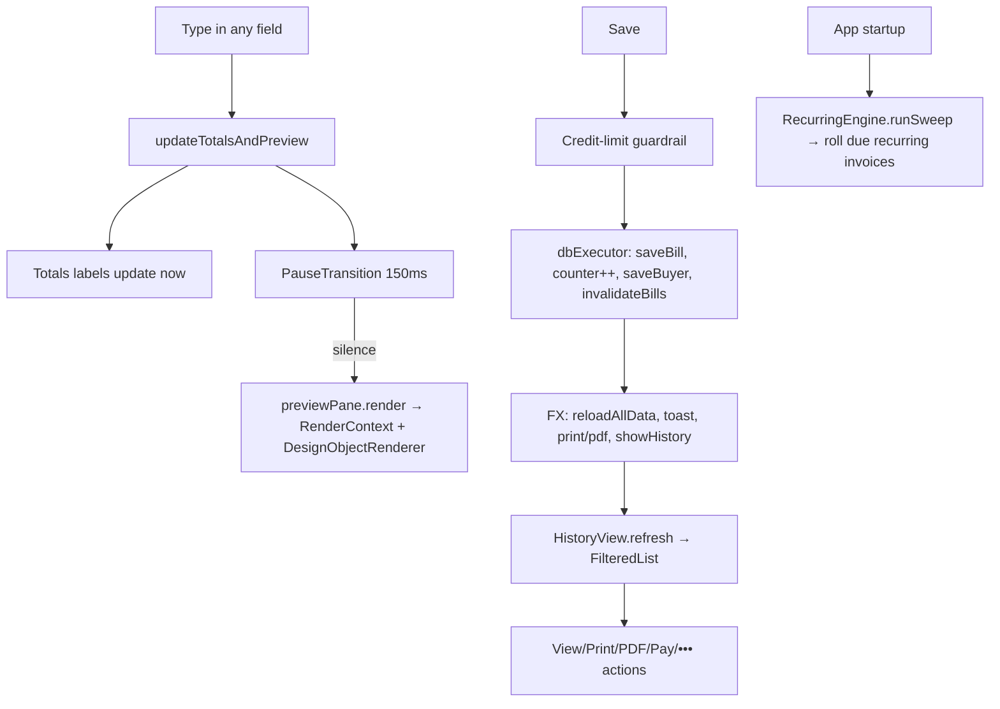

# Chapter 12 — Selling: Billing End-to-End

> **Part 7 of InvoiceStudio: Zero to Finished Product**
> Files covered in full this chapter: `service/BillingService.java`,
> `service/RecurringEngine.java`, `ui/views/CreateBillView.java`, `ui/views/LineItemsLayout.java`,
> `ui/BillPreviewPane.java`, `service/RenderContext.java`, `ui/views/HistoryView.java`.
> Goal at the end: you understand the full life of an invoice — number generation, live totals,
> the template-driven line-item grid, the debounced preview, the save pipeline with its
> credit-limit guardrail, and every action the History screen can perform on a saved bill.

---

## 1. Chapter goal

This is the chapter the whole app exists for. You will build:

- **BillingService** — pure, JavaFX-free business math: totals, GST split, numbering,
  amount-in-words, duplicate/convert/repeat factories, batch PDF export.
- **RecurringEngine** — the daily sweep that rolls recurring invoices forward.
- **CreateBillView** — the split-screen editor: form on the left, *live* document preview on
  the right, template-driven line-item columns, credit-limit guardrail.
- **LineItemsLayout + BillItemRow** — the editable grid whose columns come from the invoice
  template itself.
- **BillPreviewPane + RenderContext** — the render pipeline every output (screen, print, PDF)
  shares, including the `{{variable}}` substitution engine.
- **HistoryView** — the operations desk: preview/print/PDF/pay/edit/duplicate/convert/repeat/
  WhatsApp/receipt/mark-paid/cancel/delete, plus filtered CSV and bulk-PDF export.

## 2. Story intro

A billing screen is where software meets money, and money punishes sloppiness. Three problems
make this hard. **First**, numbers must be *right* — CGST/SGST vs IGST depends on whether
buyer and seller sit in different states, and a rounding rule mismatch of one paisa per
invoice becomes an accounting nightmare at scale. **Second**, the form must feel *instant* —
the user types a quantity and expects the grand total and the printed-page preview to move
*with* them, per keystroke, on a screen rendering an entire page of nodes. **Third**, the
*same* document must appear three ways — screen preview, printer, PDF — and if those three
paths disagree, the customer's copy differs from yours.

The app's answer to all three: put the math in one pure class, make the preview share the
same render pipeline as print and PDF, and *debounce* the expensive work so typing stays
buttery.

## 3. Concepts first

- **Pure function / service class** — `BillingService` is all `static` methods on data in,
  data out. No JavaFX, no DB, no fields. That makes it unit-testable (Chapter 21's
  `BillingServiceTest`) and usable from the background executor or MCP server.
- **GST (Indian tax), CGST/SGST/IGST** — an intra-state sale splits tax equally between
  Central (CGST) and State (SGST); an inter-state sale charges one integrated tax (IGST).
  `computeTotals(items, discountPct, interState)` takes the boolean.
- **Lakh/Crore numbering** — Indian format groups the *last three* digits, then pairs
  (1,23,45,678 not 12,345,678). `formatMoney` implements this by hand.
- **Debounce** — coalescing bursts of events into one delayed execution. JavaFX's
  `PauseTransition` is a timer you restart on every keystroke; its `onFinished` fires only
  when typing pauses. This is *the* technique behind "live preview without lag".
- **Record (BatchResult)** — a tiny immutable carrier class: `record BatchResult(int ok, int failed, List<String> failures)`.
- **Sweep pattern** — a job that runs "at most once per day", idempotent, guarded by a
  timestamp in a `meta` table, so it can run on every startup without double-creating bills.
- **Template-driven UI** — the line-item grid's columns are *data* (the template's
  `TableColumn` list), not hardcoded. Add a column in the designer and the billing form grows
  it on the next open.

## 4. Files in this chapter

| File | Type | Purpose |
|---|---|---|
| `service/BillingService.java` | Service | Totals, GST split, numbering, words, bill factories, batch export |
| `service/RecurringEngine.java` | Service | Daily recurring-invoice sweep |
| `ui/views/CreateBillView.java` | View (1342 lines) | Bill editor with live preview |
| `ui/views/LineItemsLayout.java` | Helper | Header strip + column widths shared by editor & template |
| `ui/BillPreviewPane.java` | UI | The on-screen "paper": template → JavaFX nodes, zoom, roll-height, stamps |
| `service/RenderContext.java` | Service | `{{variable}}` resolution engine shared by preview/PDF/labels |
| `ui/views/HistoryView.java` | View (722 lines) | Invoice list + every post-save action |

## 5. Step-by-step build

### Step 1 — BillingService: the money is a pure function

**Totals — the heart:**

```java
public static BillTotals computeTotals(List<BillItem> items, double discountPct, boolean interState) {
    for (BillItem it : items) {
        double gross = it.getGross();        // qty × rate
        double amt = it.getAmount();         // gross − line discount
        subtotal += gross;
        itemDiscounts += (gross - amt);
        gstTotal += amt * (it.getGst() / 100.0);
    }
    // global % discount applies AFTER per-line discounts, on the post-line-discount subtotal
    double globalDiscount = (subtotal - itemDiscounts) * (Math.max(0, discountPct) / 100.0);
    double discount = itemDiscounts + globalDiscount;
    double taxable = subtotal - discount;

    double cgst = !interState ? gstTotal / 2.0 : 0.0;
    double sgst = !interState ? gstTotal / 2.0 : 0.0;
    double igst = interState ? gstTotal : 0.0;

    double beforeRound = taxable + cgst + sgst + igst;
    double roundOff = Math.round((Math.round(beforeRound) - beforeRound) * 100.0) / 100.0;
    double grandTotal = Math.round(beforeRound + roundOff);
    ...
}
```

Read the order carefully; it encodes the accounting rules:
1. Per-line discount first (`BillItem.getAmount()`), then **global % discount on the
   already-discounted subtotal** — line and global discounts compose multiplicatively.
2. Tax is computed per line *before* the global discount is applied to the aggregate — the
   `gstTotal` is the sum of per-line tax on line-discounted amounts. (This ordering choice is
   deliberate; changing it changes every invoice.)
3. **CGST+SGST each get half** for intra-state; IGST takes all for inter-state. Never both.
4. **Round-off**: total is rounded to the nearest rupee for display on cash ledgers, with the
   difference stored separately as `roundOff` — so `taxable + taxes + roundOff = grandTotal`
   balances to the paisa.

**Indian money formatting, by hand:**

```java
public static String formatMoney(double amount, String currency) {
    // groups last 3, then pairs: 1234567 → "12,34,567"
    sb.append(s.substring(len - 3));
    int rem = len - 3;
    while (rem > 0) {
        int take = Math.min(2, rem);
        sb.insert(0, ",");
        sb.insert(0, s.substring(rem - take, rem));
        rem -= take;
    }
}
```

`String.format` with locale would give western grouping; the app ships its own so the format
is identical on every machine.

**Number-to-words** — `numberToWordsIndian` splits into Crore/Lakh/Thousand/Hundred
(×10,000,000 / ×100,000 / ×1,000 / ×1,000 — the Indian place-value system), two-digit and
three-digit helpers assemble the words, and `amountInWords` appends paise:
`"...Rupees and Twelve Paise Only"`.

**Bill factories** — `duplicateBill`, `convertToInvoice`, `repeatBill` all build on one
template: fresh id, `nextBillNo`, today's date, deep-copied variables, **new ids for every
line item**, totals recomputed from scratch (never trust copied totals), status reset to
UNPAID. `repeatBill` additionally keeps the cadence and dates the new bill at the next due
date (or today if overdue).

**Batch PDF** — `exportBatchPdf` loops bills through `PdfExportService` (Chapter 16),
collecting a per-bill `BatchResult` — success counting requires the file to *exist and be
non-empty*, a small honesty check that catches silent renderer failures.

**buyerOutstanding** — the credit-limit guardrail's data source: sum of
`grand − paid` over **UNPAID** bills of one buyer, case-insensitive name match, CANCELLED
excluded.

### Step 2 — RecurringEngine: the once-a-day sweep

```java
public SweepResult runSweep(boolean force) {
    if (!AuthSessionManager.isLoggedIn() || ...) return not-ran "User not authenticated";
    if (!settings.isAutoRecurring() && !force) return not-ran "Auto-recurring is disabled";
    String today = BillingService.todayISO();
    if (!force && today.equals(getMeta("last_sweep_date"))) return not-ran "Already ran today";
    ...
    setMeta("last_sweep_date", today);
    res.ran = true;
}
```

Guards in order: authenticated → feature-enabled → not-already-run-today. The `meta` table
(key, user_id, val with an upsert) stores the last sweep date *per user*, so two accounts on
one machine don't collide.

For each INVOICE with a cadence:
- **End date passed** → clear the repeat flags, record in `res.ended`. The chain dies
  gracefully, not with a stuck bill.
- **Not due** → skip.
- **`repeatSkipNext`** → advance the source bill's date to the due date and skip *this* cycle
  (the "skip one month" feature), recording in `res.skipped`.
- **Due** → `BillingService.repeatBill(...)`, take the next bill number, **increment and save
  the settings counter**, save the new bill, and **clear the repeat on the previous bill** so
  exactly one link of the chain is active. This last step is what makes the sweep idempotent —
  even if it ran twice on one day, the previous bill no longer repeats.

`StudioApp` calls `runSweep(false)` on startup (Chapter 9); the Dashboard surfaces
`isRepeatDue` bills as action items.

### Step 3 — RenderContext: the {{variable}} engine

Every rendered pixel of an invoice passes through this class. `buildValues()` flattens the
whole world into one `Map<String,String>`:

- business identity (name, GST, bank, UPI, **logo**),
- bill fields (`invoice_no`, `invoice_date`, `doc_type`),
- **all of the bill's variables map** — buyer fields, logistics, custom fixed variables,
- computed totals as strings, plus paid/due (with the same paid-convention as Chapter 11:
  a PAID bill with no payment rows counts as fully paid),
- page/copy metadata: `copy_label` cycles "Original for Recipient" → "Duplicate for
  Transporter" → "Triplicate for Supplier".

The resolver is one regex loop:

```java
private static final Pattern VAR_PATTERN = Pattern.compile("\\{\\{\\s*([a-zA-Z0-9_]+)\\s*\\}\\}");

public String resolveText(String raw) {
    Matcher m = VAR_PATTERN.matcher(raw);
    while (m.find()) {
        String replacement = values.get(m.group(1));
        if (replacement == null) replacement = bill == null ? "{{" + m.group(1) + "}}" : "";
        m.appendReplacement(sb, Matcher.quoteReplacement(replacement));
    }
}
```

Two behaviours worth noticing: unknown variables vanish on real bills (clean output) but
**stay as `{{name}}` in the designer preview** (`bill == null`) so you can see what you're
editing. And `Matcher.quoteReplacement` stops `$`/`\` in user text from corrupting the
substitution — a classic regex bug avoided.

`isTextBlank(el)` powers *hide-when-blank* elements: an element whose variables all resolve to
empty/zero disappears. `getQrPayload` builds UPI QR strings (`upi://pay?...` via
`BarcodeService.buildUpiPayload`) or custom text; `getBarcodePayload` resolves `{{invoice_no}}`
inside barcode data.

### Step 4 — BillPreviewPane: the on-screen paper

`BillPreviewPane` is a `StackPane` containing a scaled `Pane` ("the page"). Key decisions:

**The zoom bug fix, documented in place:**

```java
// Scale the CHILD (pagePane), not the Group: JavaFX excludes a node's OWN transforms
// from its layoutBounds, so scaling the Group made the StackPane lay out the page at
// unzoomed size while the visual grew beyond it... Scaling the child feeds the Group's
// layoutBounds so every container sizes/scrolls correctly at any zoom.
pagePane.setScaleX(this.zoom);
pagePane.setScaleY(this.zoom);
```

A one-comment masterclass: JavaFX's `layoutBounds` ignores a node's *own* scale, so scaling
the wrapper made scroll ranges wrong at zoom. Scaling the inner pane propagates correctly.
Also `updatePrefSize()` grows the wrapper by `mm × MM_PX × zoom`, and the ScrollPanes that
host it set `fitToHeight(false)` (Chapter 11 noted the same in HistoryView — forcing viewport
height makes the zoomed top unreachable).

**Roll (thermal) invoices:** if the template's page `isAutoHeight()`,
`calculateEffectiveHeight` computes where the table *ends* plus the shift every element below
it needs (`(itemCount − 1) × rowHeight`), and `rebuild()` pushes those elements down and
stretches the table height — a receipt that grows with its items, exactly like real roll paper.

**Element rendering:** elements sorted by `zIndex`, skipped when hidden or hide-when-blank,
positioned in px (`mm × 3.7795…`), rotated if needed, delegated to
`DesignObjectRenderer.render(...)` — the *same* renderer PDF uses. The **monochrome print
mode** branch copies each element (`el.copy()`) and forces black/white so photocopiers get
crisp output — preview shows exactly what will print.

**The table** — the largest private method — builds a header row + item rows as `HBox`es
styled inline (`-fx-background-color`, `-fx-border-width`), honoring per-column percent
widths, alignment, grid/rows/outline border styles, zebra rows, header colors, and `minRows`
(empty ruled rows fill the band so column dividers run the full height — mirrored in the PDF
export, Chapter 16).

**The status stamp** — a rotated, low-opacity `PAID`/`CANCELLED` label sized proportionally to
the page, added for settled/cancelled bills.

`createCleanPrintNode()` hands `PrintingService` a *fresh* render at zoom 1.0 — printing never
inherits your on-screen zoom.

### Step 5 — CreateBillView: the split-screen editor

Two constructors chain: the second adds an `initialItem` (the "Bill Item" shortcut from the
catalog, Chapter 11) by starting with one pre-filled row.

**The debounce — the chapter's centerpiece:**

```java
private final PauseTransition previewDebounce = new PauseTransition(Duration.millis(150));
...
private void updateTotalsAndPreview() {
    List<BillItem> items = itemRows.stream().map(BillItemRow::getItem).collect(Collectors.toList());
    ...
    BillTotals totals = BillingService.computeTotals(items, disc, interState);
    subtotalLbl.setText(...); ... amountInWordsLbl.setText(words);

    previewDebounce.setOnFinished(e -> {
        if (currentTemplate != null) {
            previewPane.render(currentTemplate, buildBillObject(totals, words), currentSettings, 0, 1);
        }
    });
    previewDebounce.playFromStart();
}
```

**Every** listener in the ~30-field form calls `updateTotalsAndPreview()`. The *labels*
(totals/words) update synchronously — they're cheap and the user watches those. The
*preview re-render* (a full page of nodes) waits 150 ms of silence. Type a long description:
the numbers tick per keystroke, the page repaints once when you pause. Without the debounce,
every keystroke rebuilds hundreds of nodes and the form visibly stutters.

**Line-item rows** — `BillItemRow extends HBox`, one per line, built to the *template's*
columns:

```java
for (TableColumn col : getActiveTableColumns()) {
    switch (k) {
        case "desc", "name", ... -> { getChildren().add(descField); getChildren().add(saveCatBtn); }
        case "hsn", "sac", ...    -> getChildren().add(hsnField);
        case "qty", "quantity"    -> getChildren().add(qtyField);
        ...
        default -> { TextField customTf = ...; customInputs.put(k, customTf); ... }
    }
}
if (!descRendered) { getChildren().add(1, descField); ... }  // fallback: desc first
```

The unknown-column default creates a free-text field wired into the item's `custom` map —
this is how *table-scope custom variables* (Chapter 11) reach the invoice. Each row also has
catalog-pick / save-to-catalog buttons and a delete. `LineItemsLayout` supplies the
matching header strip and the fixed pixel width per column type (sr 30, hsn 65, qty 50…), so
headers and editors line up; `updateItemDescMaxWidth` listens to container resizes to keep
the description from clipping.

**Inter-state detection** — `isInterStateSale()` is a three-level fallback: compare buyer vs
seller state *codes*; if either missing, compare state *names*; if both missing, fall back to
the Settings "inter-state" toggle. Tax mode is inferred, not asked.

**The buyer combo** is an editable, *searchable* ComboBox: a `FilteredList` behind it, a
`StringConverter` that maps typed text back to an existing buyer (or null), an editor listener
that filters by name/phone/GST/address/trade-name and pops the dropdown when focused, and an
`onAction` that fills the whole buyer block — including the buyer's default transport.

**The save pipeline — the most carefully threaded code in the view:**

```java
Toast.show(..., "Saving...", ...);                       // 1. instant feedback

if (bill.getStatus() == BillStatus.UNPAID) { ... }       // 2. credit-limit guardrail (below)

app.getDbExecutor().execute(() -> {                      // 3. DB work OFF the FX thread
    app.getData().saveBill(bill);
    if (isNew) { settings.setBillNoNext(+1); saveSettings(); }
    if (saveBuyer) { buyer find-or-create }
    app.getData().invalidateBills();
    Platform.runLater(() -> {                            // 4. back to FX thread
        app.reloadAllData();
        Toast.show(..., "Bill Saved", ...);
        if (printAfter) { zoom to 1.0 → print → restore zoom }
        if (pdfAfter)   { FileChooser → background PDF export }
        app.showHistory();
    });
});
```

The **credit-limit guardrail** — for UNPAID bills where the buyer has a `creditLimit > 0`:

```java
double currentDue = BillingService.buyerOutstanding(app.getData().getAllBills(), known.getName());
...
double afterThis = currentDue + thisDue;
if (afterThis > known.getCreditLimit()) {
    Alert warn = new Alert(WARNING, "...exceeds the credit limit of...", OK, new ButtonType("Save Anyway", LEFT));
    ...
    if (resp.isEmpty() || resp.get().getButtonData() == CANCEL_CLOSE) return;
}
```

The arithmetic even subtracts the *old* version of an edited bill from the outstanding total
so re-saving doesn't double-count. "Save Anyway" (a left-aligned extra button) is the
deliberate override — the app warns like an accountant, but the user is the boss.

Note also: the bill-number counter increments *only on new bills, inside the same background
task as the save* — no window where two saves can grab the same number in one app instance.

### Step 6 — HistoryView: the operations desk

The table + `FilteredList` pattern from Chapter 11, then the special parts:

**The status cell** renders a colored pill and re-decides the color *in* `updateItem`
(PAID→success, CANCELLED→danger, else warning) — another obey-both-branches cell.

**The Actions column** — four inline buttons (View / Print / PDF / Pay) plus a `MenuButton`
holding Edit, Duplicate, Convert to Tax Invoice, Repeat, WhatsApp, Receipt, Mark Paid,
Cancel, Delete. All are *row-scoped*: every handler pulls `getTableRow().getItem()` and nulls
are checked — cells outlive rows, this pattern prevents acting on the wrong bill.

**The preview dialog** is a mini-app: zoom in/out/reset/fit-width, the **copy selector**
(Original/Duplicate/Triplicate → `preview.render(..., idx, 1)` which changes `copy_label`),
and Print/PDF actions. Print success calls
`app.getData().bills().incrementPrintCount(bill.getId())` — the "Prints" column is real data.

**Payment dialog** (`showRecordPaymentDialog`) pre-fills the remaining due, takes
amount/date/method/reference, then:
auto-marks PAID when `totalPaid ≥ grand − 0.01` (the paisa tolerance again), saves, refreshes.

**WhatsApp share** — no API: compose a `wa.me/<phone>?text=<urlencoded message>` URL and open
it via `Desktop.browse` — the OS browser handles the rest; if unsupported, the toast *shows
the URL* so nothing is lost.

**Bulk PDF export** (`exportFilteredPdfs`) — picks a folder, snapshots the filtered list,
finds a bill template, then runs `BillingService.exportBatchPdf` **on `app.getDbExecutor()`**,
timing it and reporting `result.ok()`/`failed()` back on `Platform.runLater`. Rendering 300
invoices without freezing the UI is exactly this shape: heavy loop off-thread, toast on return.

## 6. How it works at runtime



One render pipeline, three destinations: `BillPreviewPane` (screen) and `PdfExportService`
(Chapter 16) both speak to `DesignObjectRenderer`/`RenderContext`; `PrintingService` prints a
clean re-render of the preview node. Preview can never silently disagree with print.

## 7. How to change it

- **Add a column key** (e.g. `mrp`): `LineItemsLayout.columnControlWidth` (width), the
  `switch` in `BillItemRow` (editor), `getItemColumnValue` in `BillPreviewPane` (preview),
  `PdfExportService`'s equivalent (print/PDF), and a table column in the designer. Missing the
  PDF spot shows a blank column on paper only — test all three surfaces.
- **Change GST composition order:** only `computeTotals` — but re-run `BillingServiceTest`
  immediately; several assertions pin the exact rupee values.
- **Add a variable to templates:** put it in `RenderContext.buildValues()` and (optionally)
  the built-ins list in `VariablesView`. It's usable as `{{key}}` everywhere instantly.
- **Change the debounce:** the `Duration.millis(150)` constant. Lower = livelier preview,
  more renders while typing; 150 ms is the sweet spot measured for page-size re-renders.
- **Add a History bulk action:** add a `MenuItem` to `moreBtn`, one handler pulling the row's
  bill, and call a `BillingService` static. Keep heavy work on the executor.

## 8. Performance & UX analysis

- **Debounced preview (done):** numbers stay live; the page re-render waits for typing
  pauses. What the user feels: an editor that never hitches, even with 40 line items on a
  roll template.
- **Totals-off-the-hot-path (done):** `computeTotals` is O(items) per keystroke on plain
  doubles — microseconds. The *renderer* is the expensive part, which is why only it is
  debounced.
- **Save off the FX thread (done):** DB write + counter bump + buyer find-or-create happen on
  `getDbExecutor()`; the toast appears instantly, navigation never blocks. This is Chapter 9's
  threading rules applied to money.
- **OPTIONAL IMPROVEMENT (Easy):** `buyerOutstanding` scans `getAllBills()` on every save.
  With 10k bills it's one extra pass — fine. If you ever add *per-keystroke* credit checks to
  the buyer combo, cache the outstanding map per refresh like BuyersView does.
- **OPTIONAL IMPROVEMENT (Medium):** the preview rebuild creates a full node graph per render.
  For very long roll invoices (100+ items) a `Canvas`-based renderer (like the label pipeline,
  Chapter 17) would cut nodes 10×; the cost is losing free text-field hit-testing, which
  previews don't need. Difficulty: Medium.
- **Memory:** `PauseTransition` is one object per view, restarted — no timer leak. Cell-local
  `HBox`/buttons in HistoryView's action column are created once per cell instance and reused
  across rows — correct reuse.

## 9. Common mistakes and fixes

| Mistake | Symptom | Fix |
|---|---|---|
| Rendering the preview in every keystroke listener | Typing lags, CPU spikes | Debounce with `PauseTransition.playFromStart()` |
| Copying totals in duplicate/repeat | Totals disagree after edits | Always recompute: `computeTotals(...)` |
| Scaling the preview Group instead of the child | Scroll range wrong at zoom; bottom padding vanishes | Scale `pagePane`; grow pref size by zoom (see comment) |
| `fitToHeight(true)` on the preview ScrollPane | Top unreachable when zoomed | Keep it false; let content size the scroll range |
| Tax on grand total instead of per-line | CGST ≠ sum of line taxes | Tax each line's amount, then aggregate |
| Forgetting `Matcher.quoteReplacement` | `$` in notes breaks rendering | Use it in every `appendReplacement` |
| Counter incremented on the FX thread or outside the save task | Duplicate bill numbers on crash/retry | Bump `billNoNext` inside the same background save |

## 10. Checkpoint

1. Create a bill with 3 items, a global 10% discount and an inter-state buyer → IGST only,
   grand total = taxable + IGST + round-off, words match the total.
2. Change the buyer to a same-state one → totals flip to CGST+SGST *without touching tax fields*.
3. Type a quantity and watch: numbers change instantly; the preview updates a beat later.
4. Save → the History table shows the new bill; its Print count is 0; preview shows the
   "Original for Recipient" copy label; switch copies and print — the printed sheet says the
   right label.
5. In Settings enable auto-recurring, set a bill to MONTHLY with yesterday's date, restart →
   a new bill for the next period exists and the old one's repeat is cleared.

**Exercises.** (a) Write a JUnit for `formatMoney` pinning 12345678.91 → ₹1,23,45,678.91.
(b) Add a `{{bill_count}}` variable (total bills) to `RenderContext`. (c) Add "Export
filtered to Excel-friendly CSV" — reuse `CsvService.exportBills` on the FilteredList snapshot.

## 11. Summary and coverage self-check

One pure math class, one idempotent sweep, one variable engine, one preview pane, one editor,
one operations desk — and every invoice in the app flows through exactly those six pieces.

**Covered in full this chapter:** `BillingService.java` (totals/GST/format/words/factories/
batch/buyerOutstanding) · `RecurringEngine.java` (guards, end/skip/roll, meta upsert) ·
`CreateBillView.java` (form, search-combo, logistics, custom fixed fields, item rows,
totals+debounce, guardrail, background save) · `LineItemsLayout.java` ·
`BillPreviewPane.java` (zoom fix, roll height, mono mode, table skin, stamp) ·
`RenderContext.java` (variable map, resolve, blank detection, QR/barcode payloads) ·
`HistoryView.java` (table, filters, all actions, payment dialog, WhatsApp, CSV, bulk PDF).

**Markers:** none new — behaviour verified against source; the paid-convention and
name-based buyer matching flags carry over from Chapter 11.

**Next: Chapter 13 — Buying & Money: Purchases, Transactions, Expenses** (CreatePurchaseView,
PurchasesView, TransactionsView, ExpensesView + dialogs, FinancialsView, CsvService,
BackupRestoreService).
