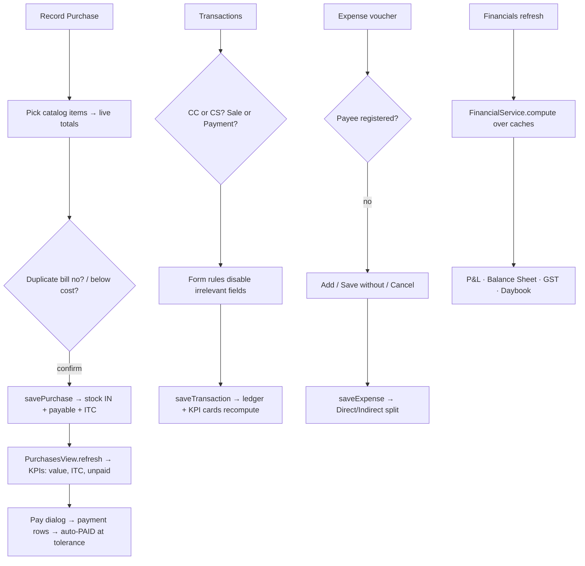

# Chapter 13 — Buying & Money: Purchases, Transactions, Expenses

> **Part 8 of InvoiceStudio: Zero to Finished Product**
> Files covered in full this chapter: `ui/views/CreatePurchaseView.java`,
> `service/PurchaseService.java`, `ui/views/PurchasesView.java`,
> `ui/views/TransactionsView.java`, `ui/views/ExpensesView.java`,
> `service/ExpenseAccountService.java`, `ui/views/FinancialsView.java`,
> `service/FinancialService.java`, `service/CsvService.java`,
> `service/BackupRestoreService.java`.
> Goal at the end: the money side of the business — inward stock and payables,
> the CC/CS cash-books ledger, the expense day-book with its account registry,
> Tally-style financial statements, and the CSV/backup plumbing under them.

---

## 1. Chapter goal

Sales were Chapter 12. Now the other half of the ledger:

- **CreatePurchaseView** — record a supplier's bill: stock IN at cost, Input Tax Credit,
  payable or paid-at-entry, with duplicate-bill and margin guardrails.
- **PurchasesView** — the inward register: ITC and due columns, a Pay dialog, delete-with-reversal.
- **TransactionsView** — the two-book cash ledger (CC credit book / CS cash book) with
  check-number tracking and business-rule-driven form state.
- **ExpensesView + ExpenseAccountService** — the expense day-book, the payee *account registry*
  with create-on-save and rename-propagation, direct vs indirect classification.
- **FinancialsView + FinancialService** — Trading/P&L, Balance Sheet, GST summary (GSTR-3B
  style), unified Daybook, plus stock summary and item profitability for Chapter 14.
- **CsvService + BackupRestoreService** — the import/export/backup backbone every view leans on.

## 2. Story intro

Every trader's books have two sides. Goods come *in* (purchases — and this app records them
"Tally F9" style: supplier's own bill number, stock increases, GST paid becomes Input Tax
Credit). Money moves in two physical books — the **credit book** (CC: sales and cheque
payments owed to you) and the **cash book** (CS: same-day cash). Money *leaks out* as
expenses, which accountants split into **direct** (freight, wages — they belong in the trading
account) and **indirect** (rent, salaries — they hit the P&L). And once a year (or month), all
of it must condense into statements a CA can read: P&L, Balance Sheet, GST return.

This chapter builds each of those artifacts as a screen, with one shared principle: the
*computation* lives in pure service classes (`PurchaseService`, `FinancialService`) that never
touch the database — so the statements are testable and the MCP server (Chapter 18) can
produce the same numbers.

## 3. Concepts first

- **Purchase voucher / inward supply** — a supplier's bill. Increases stock, creates a payable
  (unless paid at entry), and its GST becomes ITC (credit you offset against GST collected).
- **ITC (Input Tax Credit)** — GST you *paid* on purchases; `netTaxPayable = outputGST − ITC`.
- **CC / CS books** — the shopkeeper's two ledgers: Credit (goods + cheque payments, dues
  tracked) and Cash (paid on the spot). `Transaction.bookType` is `"CC"` or `"CS"`.
- **Direct vs indirect expense** — direct costs attach to the trading account (they reduce
  gross profit); indirect costs hit the P&L after gross profit. `Expense.isDirect(category)`
  makes the split data-driven.
- **Records as report rows** — `FinancialService.DaybookEntry`, `StockSummaryRow`,
  `ItemProfitRow`: immutable, pattern-matchable rows that flow straight into `TableView`s.
- **CSV escaping** — quote a cell iff it contains `"`/`,`/newline, doubling embedded quotes.
  Files start with a UTF-8 BOM (`\uFEFF`) so Excel opens them as UTF-8.
- **Guardrail dialogs** — confirmation Alerts that appear *before* money-affecting saves when a
  heuristic smells trouble (duplicate supplier bill no, price below usual cost). Same pattern
  as the credit-limit alert in Chapter 12.

## 4. Files in this chapter

| File | Type | Purpose |
|---|---|---|
| `ui/views/CreatePurchaseView.java` | View | Purchase entry with catalog-pick rows and live totals |
| `service/PurchaseService.java` | Service | Purchase totals (mirrors BillingService), numbering, GSTIN inter-state test |
| `ui/views/PurchasesView.java` | View | Inward register, KPIs, Pay dialog, delete reversal |
| `ui/views/TransactionsView.java` | View | CC/CS ledger, form with state-enforcement rules, CSV export |
| `ui/views/ExpensesView.java` | View | Expense vouchers, filters, account-aware save |
| `service/ExpenseAccountService.java` | Service | Payee registry: backfill, find-or-create, rename-propagation |
| `ui/views/FinancialsView.java` | View | P&L / Balance Sheet / GST / Daybook tabs |
| `service/FinancialService.java` | Service | All statement math + stock summary + item profitability |
| `service/CsvService.java` | Service | CSV parse/escape/export, GSTIN & phone validators |
| `service/BackupRestoreService.java` | Service | Whole-DB JSON backup & restore |

## 5. Step-by-step build

### Step 1 — PurchaseService: the mirror engine

`computePurchaseTotals` is **deliberately identical** to `BillingService.computeTotals`
(same discount order, same CGST/SGST-vs-IGST split, same rupee round-off) — the class doc says
so. Sharing *intent* without sharing *code* keeps the two engines free to diverge as purchase
rules appear (e.g. freight is added outside totals in `CreatePurchaseView`:
`payable = grandTotal + freight`).

Two small methods matter elsewhere:

```java
public static boolean isInterStateSupply(String gstin, String companyStateCode) {
    if (gstin == null || gstin.trim().length() < 2) return false;
    if (companyStateCode == null || companyStateCode.isBlank()) return false;
    return !gstin.trim().substring(0, 2).equals(companyStateCode.trim());
}
```

Inter-state is decided by comparing the supplier's GSTIN state-code prefix to the company's.
And `nextPurchaseBillNo(next, digits)` formats `PUR-0001`.

### Step 2 — CreatePurchaseView: stock IN with guardrails

The view is a `VBox` of cards: header form (supplier combo with GSTIN in the rows,
**supplier's own bill no**, read-only internal voucher, date, freight, "Mark as Paid" +
payment-mode combo enabled by a listener), the items card, the totals card.

**Item rows are catalog-first.** The description field is *not editable*:

```java
descField.setEditable(false);
descField.setOnMouseClicked(e -> pickCatalogItem(this));
descField.setTooltip(new Tooltip("Click to pick from catalog (stock-tracked)"));
```

That's the whole stock philosophy in one line: purchases only move stock when a line is
*linked to a catalog item* (`catalogItemId`). The save loop warns otherwise:

```java
if (it.getId() == null || it.getId().isBlank())
    Toast.show(..., "Line \"" + it.getDesc() + "\" is not linked to a catalog item; stock will not move for it...", false);
```

Each row shows a live **stock column** (`refreshStockDisplay()` reads the cached
`getStockBalances()` map, red when negative) and the picker dialog itself is a table of the
catalog with Cost and In-Stock columns; choosing one fills cost rate (falling back to selling
rate), GST, HSN, unit.

**Two guardrails before save:**

1. *Duplicate supplier bill no* — same number from the same supplier already recorded? Books
   hygiene says that's almost certainly a double entry; the dialog offers "Record it anyway?".
2. *Below usual purchase rate* — lines priced under the item's `purchaseRate` are listed and
   confirmed ("Save anyway?").

Both mirror the credit-limit guardrail: warn with *specific data*, let the human decide.

**The reflection surprise.** `companyStateCode()` walks the Settings object's *declared
fields by name* to find the state code / GSTIN:

```java
for (java.lang.reflect.Field f : st.getClass().getDeclaredFields()) {
    if (f.getName().toLowerCase().contains("statecode")) { f.setAccessible(true); ... }
}
```

> **ISSUE (honest flag):** reflection here is unnecessary and fragile — `Settings` exposes
> its `BusinessProfile` publicly, and Chapter 12's `isInterStateSale()` already reads
> `getBusiness().getStateCode()` directly. Reflection dodges compile-time checks (rename the
> field and this silently returns `""`, making all purchases intra-state), and adds no value.
> `OPTIONAL IMPROVEMENT` (Easy): replace the whole method with
> `String code = st.getBusiness().getStateCode();` falling back to the GSTIN prefix — the
> exact pattern Chapter 12 uses. Behaviour identical, safety restored.

**Save** builds the `PurchaseBill` (id, `PUR-xxxx` number via a max-sequence scan, supplier
snapshot fields, items, freight, totals, paid/mode/notes) and calls
`app.getData().savePurchase(bill)` — the DataManager (Chapter 8) routes this to the DAO and
bumps the stock ledger and payables. Editing reuses the same object (`this.editing`).

### Step 3 — PurchasesView: the inward register

The Chapter 11 pattern again, with purchase-specific KPIs computed in one pass:

```java
value += totals != null ? totals.getTaxable() : 0;
itc   += totals != null ? cgst + sgst + igst : 0;      // ITC = GST paid
if (!p.isPaid()) unpaid += Math.max(0, p.getAmountPayable() - p.getPaidAmount());
```

Columns: Voucher No (mono), Date, Supplier, **Supplier's Bill No**, Taxable, **ITC (GST)**,
Payable, Due, status pill (✓ Paid / Credit), actions (View / Pay / Edit / ✕).

**The Pay dialog** is Tally's F5 in miniature: pre-filled remaining due
(`amountPayable − paidAmount`), mode combo, reference, date; on OK the payment joins
`p.getPayments()`, and **`if (p.getPaidAmount() >= p.getAmountPayable() - 0.001) p.setPaid(true)`**
— the same paisa-tolerance auto-close as Chapter 12's receipts. Guarded: paying a fully-paid
bill toasts "Nothing Due" instead of opening the dialog.

**Delete reverses stock** — the confirmation text says it and
`app.getData().deletePurchase(id)` does it (the DataManager's purchase deletion writes negative
ledger rows; Chapter 8).

### Step 4 — TransactionsView: two books, strict rules

The ledger table carries the CC/CS badge, sale/payment badge, signed amounts
(`+ ₹` red for sales, `- ₹` green for payments — *this book's* colour convention), check
numbers, and linked bill numbers. KPI cards recompute from the **filtered** list on every
filter change (`updateKpiSummary()` inside `applyFilter()`), so the cards always describe what
you see.

The form is the interesting part — a small business-rules engine:

```java
Runnable updateFieldsState = () -> {
    boolean isPayment = rbPayment.isSelected();
    boolean isCc = rbCc.isSelected();
    qtyField.setDisable(isPayment);              // no pieces on payments
    if (isPayment) qtyField.setText("0");
    boolean checkEnabled = isPayment && isCc;    // checks only in the credit book
    checkField.setDisable(!checkEnabled);
    if (!checkEnabled) checkField.setText("");
    boolean reportingDisabled = isPayment || (!isPayment && isCc);
    reportingCheck.setDisable(reportingDisabled);
    if (reportingDisabled) reportingCheck.setSelected(!isPayment && isCc);
};
```

Radio groups can't be deselected (the listener re-selects the old toggle if `newVal == null`),
and every rule *clears* data it disables — so a saved record can never carry a check number
from a cash-book sale. The converter validates buyer-required, amount > 0, then enforces the
same rules on the data side (`checkNo` only when `isPayment && isCc`).

> **GAP (cosmetic):** the converter reads `!checkField.isDisable()` — the misspelled
> legacy alias `isDisable()` that JavaFX keeps for backwards compatibility. It compiles and
> works, but the modern spelling is `isDisabled()`. Flagged, not changed — faithfulness rule.

CSV export writes a fixed header + quoted fields with doubled inner quotes, matching
`CsvService` conventions (this one hand-rolls its own writer).

### Step 5 — ExpensesView + ExpenseAccountService: the day-book with a memory

KPIs split **Direct vs Indirect** via `Expense.isDirect(e.getCategory())` — the same split
FinancialService uses. Filters: search, type, **account** (from the registry, archived
excluded) and category (built from the data itself).

The save flow is the special part — `saveWithAccountCheck`:

```java
ExpenseAccount known = app.getData().expenseAccounts().findByName(payee);
if (known == null) {
    Alert ask = new Alert(CONFIRMATION,
        "Account '" + payee + "' is not added to your expense accounts.\n\nAdd it now? ...",
        YES, new ButtonType("Save without account", NO), CANCEL);
    ...
    if (res.get() == ButtonType.YES) ExpenseAccountService.findOrCreate(app.getData(), payee);
}
app.getData().saveExpense(e);
```

Three-way choice: register the payee, save without registering, or cancel. The registry then
pays off in three service methods:

- **`backfillFromHistoryAsync`** — one-time (meta-flag guarded, per user, exactly like
  RecurringEngine) sweep that creates accounts from every payee already on vouchers.
  Existing installs wake up with a populated registry.
- **`findOrCreate`** — the create-on-the-fly used above; blank names return null (payee optional).
- **`renameWithPropagation`** — renames the account **and rewrites `payee` on every voucher**
  carrying the old name, returning the count. Without propagation, renaming would orphan
  history; with it, reports stay continuous.

Threading follows the house rules: DB work on `AppExecutors.io()`, results hop back via
`AppExecutors.runOnFx(...)`, aggregation over the DataManager caches — zero extra DB reads.

### Step 6 — FinancialsView + FinancialService: the statements

`FinancialService` is pure: records in (`bills, purchases, expenses, suppliers, items,
stockBalances`), one `Financials` record out. Date filtering is plain ISO-string comparison
(`inRange`), matching how dates are stored everywhere.

**The Trading/P&L identity:**

```java
// GP = (Sales + Closing Stock) − (Opening Stock + Purchases + Direct Exp)
double grossProfit = (sales + closingStock) - (openingStock + purchasesValue + direct);
// NP = GP − Indirect Expenses
double netProfit = grossProfit - indirect;
```

Opening stock = `opening_stock × cost` per item; closing stock = live ledger balance × cost.
The view even prints the formula as a muted hint under the statement.

**Balance Sheet** — liabilities (Sundry Creditors, net GST payable, accumulated net profit as
capital) vs assets (Sundry Debtors, inventory, cash, excess ITC). The view computes the
difference and is *honest about its model*:

```java
Label note = diff == 0 ? new Label("✓ Balanced ...")
    : new Label(String.format("Difference: %s%.2f (capital account is derived from current-period profit; add opening capital in a future release to reconcile)", cur, diff));
```

A real accountant's balance sheet needs opening capital + retained earnings; this app derives
capital from current-period profit and *says so* instead of faking balance.

**GST tab** — GSTR-3B shape: Output GST − ITC = **NET TAX PAYABLE TO GOVT**, red when owed.

**Daybook** — `buildDaybook` emits one row per economic event: each non-cancelled bill a
"Sale" (inflow grand total), each with payments a "Receipt"; purchases a "Purchase" (outflow
payable) with per-payment "Payment" rows (and a single settlement row for paid-at-entry);
expenses as "Expense" rows; sorted by date then type.

**Stock summary & item profitability** (used by Chapter 14's StockAnalysisView and the MCP
server): `stockSummary` respects date filtering *properly* — transactions before `fromDate`
accumulate into period **opening** stock so `Closing = Opening + In − Out` strictly balances.
Cost priority is documented in place: catalog purchase rate → in-range average → historical
average → **0, never the selling rate** (an inflated cost would hide real profit).
`itemProfitability` computes per-item COGS from the same priority ladder and sorts by gross
profit.

### Step 7 — CsvService: the interchange format

Three layers, each small:

- **Validation** — `isValidGstin` (the full 15-char structural regex) and `isValidPhone`
  (Indian 10-digit / STD / 91-prefix patterns) — used by importers before trusting data.
- **Escaping/parsing** — `csvCell` quotes only when needed and doubles inner quotes;
  `parseCsv` is a proper state machine: quote toggling, `""` → `"`, BOM stripping, `\r`
  skipping, and a final flush for unterminated rows. It correctly handles the two classic
  failure cases: commas inside quoted fields, and newlines inside quoted fields.
- **Exporters** — `exportBuyers` (with dynamic custom-field columns and a transport-id→name
  lookup), `exportBills` (one row per bill with all tax columns), `exportGstSummary`
  (month-bucketed `TreeMap`, nine accumulators per month, TOTAL row), and `getSampleBuyerCsv`
  (the template users fill in for import). All files start with the UTF-8 BOM so Excel
  auto-detects encoding.

### Step 8 — BackupRestoreService: one JSON to move house

```java
public static class BackupData {
    public String version = "1.0";
    public String exportedAt = Instant.now().toString();
    public Settings settings;  public List<Template> templates;
    public List<Bill> bills;   public List<Buyer> buyers;
    public List<ItemRecord> items;  public List<VariableDef> variables;
}
```

Export: read everything through the DAOs, write with Jackson's indented mapper. Restore:
read, then `saveX` each entity — the DAOs' save is an **upsert**, so a restore into a
non-empty database *merges by id* rather than crashing on duplicates. (Chapter 11's restore
flow shows the overwrite-confirmation and count toast; note the backup covers the six core
entities — transactions, expenses, purchases and suppliers are not in `BackupData`, a
documented scope boundary to be aware of when relying on backups.)

## 6. How it works at runtime



Every arrow touches only cached lists — the statements rebuild instantly on any date change.

## 7. How to change it

- **Add a purchase guardrail:** add a validation loop in `savePurchase` before the Alert
  pattern (collect offending lines → `Alert` with "Save anyway?"). Keep it *before* any write.
- **Add a third book (e.g. "ONL" online):** extend the toggle buttons + `bookFilter` strings +
  the form's RadioButtons. The `Transaction` model stores a string, so no migration needed.
- **Add an expense category:** it lives in `Expense.CATEGORIES` — but check
  `Expense.isDirect`'s list too; a new category defaults to whichever side you forget.
- **Change statement semantics (e.g. cash-basis P&L):** only `FinancialService.compute`
  changes; the view re-renders whatever the record carries. Re-run `PurchaseAndFinancialsTest`
  — it pins the rupee values of a scenario.
- **Add a column to backups:** field on `BackupData` + one restore loop. Old backups restore
  fine (Jackson leaves the new field null) — *forward compatible*.

## 8. Performance & UX analysis

- **Done:** all statements compute from DataManager caches — no DB hits per tab, date-range
  changes are instant. `inRange` is a string compare (O(1) per row), and the daybook sorts
  once.
- **Done:** purchase rows read stock from the cached `getStockBalances()` map, not the ledger
  DAO — the Chapter 11 lesson applied from day one here.
- **OPTIONAL IMPROVEMENT (Easy):** `CreatePurchaseView.nextPurchaseSequence` scans all
  purchases for `PUR-` numbers per save; a settings counter (like `billNoNext`) would be O(1).
  The scan is a safety net against manual numbering, which is why it exists — keep it, but
  cache it in the DataManager if purchases reach the tens of thousands.
- **OPTIONAL IMPROVEMENT (Medium):** ExpensesView's account/category combos rebuild their
  item lists on every `refresh()`; with thousands of vouchers, deriving the category set
  could move to a 150 ms debounce. Today's sizes make this invisible.
- **UX note:** guardrails (duplicate bill no, below-cost, unregistered account) are the app's
  biggest UX win for data quality — they convert silent bookkeeping errors into one-click
  decisions with full context.

## 9. Common mistakes and fixes

| Mistake | Symptom | Fix |
|---|---|---|
| Free-typing purchase item descriptions | Stock never moves for those lines | Pick from catalog; heed the "stock will not move" toast |
| Forgetting freight in payable math | Payable ≠ grand total shown | `payable = grandTotal + freight` is applied at display & save |
| Renaming an expense account without propagation | Old vouchers keep the old payee; reports split | Always use `renameWithPropagation` |
| Treating `isDirect` categories as fixed | New categories land on the wrong statement side | Update `Expense.isDirect`'s classification together with `CATEGORIES` |
| Parsing CSV with `String.split(",")` | Breaks on quoted commas | Use `CsvService.parseCsv`'s state machine |
| Restoring a backup expecting a wipe | Old rows with other ids remain (upsert-merge) | Understand merge-by-id semantics before restore |

## 10. Checkpoint

1. Record a purchase for a supplier in another state → totals card title flips to
   "IGST (Inter-State Purchase)" and only IGST is non-zero.
2. Try to save the same supplier bill number twice → the "Possible Duplicate Purchase"
   confirmation appears, and cancelling returns without saving.
3. In Transactions, pick "CS Book" + "Sale" → Check Number is disabled and emptied; pick
   "CC Book" + "Payment" → it enables.
4. Save an expense with a brand-new payee, choosing "Add it now" → the account appears in
   the Accounts dialog and in the filter combo.
5. Open Financials → the P&L hint shows the GP formula; set a date range that excludes a
   bill → every tab, including the daybook, excludes it.

**Exercises.** (a) Replace the reflection in `companyStateCode()` with the direct accessor and
prove behaviour identical for both a state-code and GSTIN-only profile. (b) Add "Marketing" as
an indirect category end-to-end (dialog list + `isDirect` + a test). (c) Write a round-trip
test: `parseCsv(csvRow(list))` equals the original list for values containing commas, quotes
and newlines.

## 11. Summary and coverage self-check

Purchases mirror billing with cost-side semantics; transactions encode two physical books with
enforced field rules; expenses remember their payees; and one pure engine turns all of it into
statements, with CSV and backup as the doors in and out.

**Covered in full this chapter:** `CreatePurchaseView.java` (rows, picker, guardrails, save,
edit-population) · `PurchaseService.java` · `PurchasesView.java` (register, KPIs, pay,
delete-reversal) · `TransactionsView.java` (table, KPI cards, rules engine, CSV) ·
`ExpensesView.java` (filters, account-aware save) · `ExpenseAccountService.java` (backfill,
find-or-create, rename-propagation, meta flags) · `FinancialsView.java` (four tabs, ledger
rows) · `FinancialService.java` (compute, daybook, stockSummary, itemProfitability, inRange) ·
`CsvService.java` (validators, escape/parse state machine, exporters) ·
`BackupRestoreService.java`.

**Markers:** `ISSUE:` reflection-based `companyStateCode()` (fragile; direct accessor exists —
see improvement block). `GAP:` `isDisable()` legacy spelling in TransactionsView converter
(cosmetic). `NOTE:` `BackupData` covers six core entities; transactions/expenses/purchases/
suppliers are outside its current scope.

**Next: Chapter 14 — Reports & Dashboards** (DashboardView, Dashboard2View, ReportsView,
ReportsBuilders, StockAnalysisView, ExpenseAnalytics + report dialogs).
