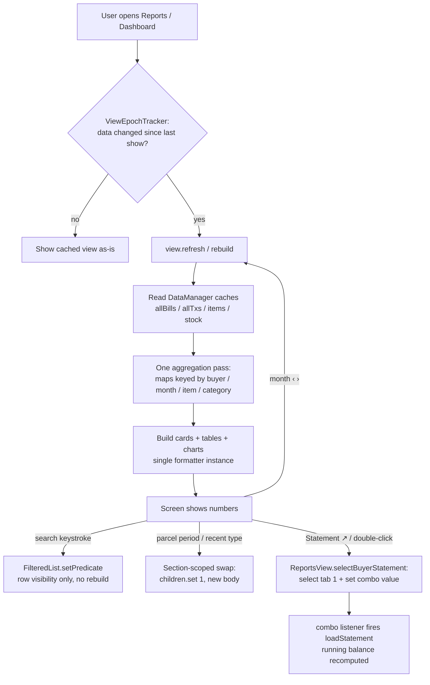

# Chapter 14 — Reports & Dashboards: Reading the Business at a Glance

> **Part 5 of InvoiceStudio: Zero to Finished Product**
> Files covered in full this chapter: `ui/views/DashboardView.java`,
> `ui/views/Dashboard2View.java`, `ui/views/ReportsView.java`,
> `ui/views/ReportsBuilders.java`, `ui/views/StockAnalysisView.java`,
> `service/ExpenseAnalytics.java`, `ui/ExpenseReportDialog.java`,
> `test/.../service/ExpenseAccountTest.java` — all eight read and reproduced
> from the repository.
> Goal at the end: **every number the business owner needs is one click away —
> and every formula behind those numbers is unit-tested.**

---

## 1. Chapter goal

By the end of this chapter you will have built, exactly as the repository has it:

1. **Dashboard 1** (`DashboardView`) — the standard overview: month navigation,
   recurring-invoice banner, four animated KPI cards, a hand-drawn 6-month
   revenue bar chart, a live GST summary, top-5 buyers, and recent invoices.
2. **Dashboard 2** (`Dashboard2View`) — the "Financial & Logistics" dashboard:
   all-time and current-period KPIs with month-over-month trends, two JavaFX
   charts, a parcel-count analysis card with Day/Week/Month/Year switching,
   three Top-5 leaderboards, and a recent-activity table that toggles between
   transactions and bills **without rebuilding the page**.
3. **Reports view** (`ReportsView` + `ReportsBuilders`) — eight report tabs:
   Outstanding & Aging, Buyer Statement & Ledger, Trouser Movement, Sales
   Trends, Item Sales & Movement, Category Breakdown, GST/Tax Summary, and
   Transport Performance.
4. **Stock & Profitability** (`StockAnalysisView`) — a Tally-style stock
   summary, item-wise gross profit, and a low-stock watchlist.
5. **Expense analytics** (`ExpenseAnalytics` + `ExpenseReportDialog`) — the
   account/category expense reports, with **all math in a pure, unit-tested
   class** and the dialog doing nothing but formatting.

And you will understand the two architectural ideas that make this chapter
work: the **shell/builder split** (a tiny view class delegates to a builder
class) and **pure-logic extraction** (math lives where tests can reach it).

---

## 2. Story intro

Imagine the owner of a trouser business — call him Kumar — standing in his
office at 9 p.m. Books are written by hand in ledgers. To answer "how much
does Ram Traders still owe me?" he flips pages. To answer "did this month beat
last month?" he does arithmetic on a calculator. To prepare GST numbers for
his accountant, he re-adds an entire month of invoices, twice, because the two
sums didn't match the first time.

A ledger is a *record*. What Kumar needs is a *report*: the same records,
pre-arranged to answer a question. Reports are pre-computed answers. A
dashboard is a page of the most important answers, visible without asking.

That is what this chapter builds. And it teaches one discipline above all
others: **the formula and the picture must live apart.** The formula
(`ExpenseAnalytics`) is plain Java with no UI — it can be tested in a
millisecond by a machine. The picture (`ExpenseReportDialog`) is JavaFX — it
can only be verified by a human looking at a screen. When math and pixels are
separated, machines verify the math and humans verify only the looks. When
they are tangled together, neither is verified well.

> **Analogy:** a restaurant kitchen has a *prep station* (where ingredients
> become sauces, measured and consistent) and a *plating station* (where food
> is made beautiful for the table). `ExpenseAnalytics` is the prep station;
> `ExpenseReportDialog` is the plating station. This chapter builds both, for
> every report in the app.

---

## 3. Concepts first

**KPI card.** "Key Performance Indicator." A small card showing one number
that matters (Total Outstanding Due), a title, and a one-line explanation.
Visually it is just a `VBox` with a colored top border — the "accent" color
codes the mood (red = money owed, green = money received).

**Aggregation — one pass, many answers.** To report "sales per month, per
category, per account, plus totals," a beginner writes four loops over the
data. The professional pattern is **one loop** that drops each record into
several *buckets* simultaneously (a `Map<String, double[]>` keyed by month,
another by category…). One pass over the data = O(n) total, no matter how many
reports read the buckets. `ExpenseAnalytics.build()` is the cleanest example
in the codebase — study it once and you can read every report here.

**Trend percentage.** `((current − previous) / |previous|) × 100`. Two edge
cases matter: when *previous* is 0 and current is positive, the trend is
defined as +100% (anything from nothing is infinite growth, capped for
display); when both are 0, it is 0%. `calcTrend()` implements exactly this.

**JavaFX charts.** The app uses four chart types, all from `javafx.scene.chart`:

| Chart | Used for | Key calls |
|---|---|---|
| `LineChart` | Sales vs payments over 12 months | `setAnimated(false)`, series of `XYChart.Data` |
| `BarChart` | Pieces sold per month; parcel counts | `setCategoryGap`, `setBarGap` |
| `StackedBarChart` | CC vs CS volumes in one bar | two series stack in one column |
| `PieChart` | Revenue share by category | `PieChart.Data(label, value)` |

`setAnimated(false)` appears on every chart. Why? JavaFX's chart animation
re-interpolates data on every change; with data that refreshes often it looks
busy and costs frame time. Instant rendering reads as *calmer*, not slower.

**Shell vs builder split.** `ReportsView` is 133 lines: it owns the header,
the `TabPane`, and tab *selection*. `ReportsBuilders` is 1,266 lines: it
builds each tab's content. One class per *role*, not one class per *size*.
The shell exposes one cross-tab hook — `selectBuyerStatement(buyerId)` — so
the Outstanding report's "Statement ↗" button can jump to tab 2 with the right
buyer pre-selected.

**Pure-logic extraction.** A class with no JavaFX imports can be constructed
and asserted against in a plain JUnit test with no screen at all.
`ExpenseAnalytics` and `FinancialService` (Chapter 13) follow this rule; the
dialogs that use them are thin formatting layers.

**`FilteredList`.** A JavaFX collection wrapper that *views* another list
through a predicate. Change the predicate and the bound `TableView` updates
without rebuilding items. The Outstanding report's search box is 8 lines of
code because of it.

**Section-scoped swap vs page rebuild.** When the user flips Dashboard 2's
"Recent Transactions / Recent Bills" toggle, the code replaces **only the
table node inside that one card** (`card.getChildren().set(1, body)`). Scroll
position, KPIs, charts — untouched. Compare with the naive approach (rebuild
the whole dashboard), which resets scroll and re-renders every chart. The
harness-visible counters `recentSwapCount` / `parcelSwapCount` exist so tests
can *prove* a swap happened instead of a rebuild.

**Animated counters.** Dashboard 1's KPI numbers count up from 0 to their
value over 550 ms using a `Timeline` with 18 keyframes and an ease-out curve
(`1 − (1 − frac)³`). Pure polish — but it is written carefully: one shared
`Timeline`, stopped and rebuilt on each refresh, so rapid re-refreshes never
stack animations.

**Cached formatters.** `DateTimeFormatter.ofPattern(...)` re-parses its
pattern string on every call. The views hold `static final` formatters
(`F_YM`, `F_MON_YY`…) and reuse them. Same for the Indian-grouping money
format from `AppFormatters.inrFormat()`.

---

## 4. Files in this chapter

| # | File | Lines | Role |
|---|---|---|---|
| 1 | `ui/views/DashboardView.java` | ~700 | Dashboard 1 — standard overview |
| 2 | `ui/views/Dashboard2View.java` | 1,166 | Dashboard 2 — financial & logistics |
| 3 | `ui/views/ReportsView.java` | 133 | Reports shell: header + 8 tabs |
| 4 | `ui/views/ReportsBuilders.java` | 1,266 | The eight report tab builders |
| 5 | `ui/views/StockAnalysisView.java` | 330 | Stock summary, profitability, low stock |
| 6 | `service/ExpenseAnalytics.java` | ~160 | Pure expense math (unit-tested) |
| 7 | `ui/ExpenseReportDialog.java` | 267 | Expense report window (formatting only) |
| 8 | `test/.../ExpenseAccountTest.java` | 212 | Tests for accounts + analytics |

Depends on: `DataManager` (Ch 8), models (Ch 6–7), `BillingService` /
`RecurringEngine` (Ch 12), `FinancialService` / `CsvService` /
`ExpenseAccountService` (Ch 13), `UiTheme` / `Toast` / `AppFormatters` /
`AppLog` / `AppExecutors` (Ch 2, 9).

Used by: `StudioApp` (`showDashboard`, `showDashboard2`, `showReports`,
`showStockAnalysis`), the sidebar (Ch 9), the chatbot's MCP tools (Ch 18 read
the same aggregates via `ExpenseAnalytics`).

---

## 5. Step-by-step build

We build in dependency order: pure math first, then the dialog that shows it,
then the reports shell and its builders, then the two dashboards, then the
stock view, and finally the tests that lock the math down.

### Step 1 — `service/ExpenseAnalytics.java` (the prep station)

> **ISSUE (found while reading, preserved faithfully):** the class docstring
> says "no JavaFX, so the math is unit-testable" — true. But note its CSV
> helper calls `CsvService.csvRow(...)`, coupling it to one more service. That
> is acceptable (CsvService is also pure), but be aware the "pure" class has
> two dependencies, both pure.

```java
package com.invoicestudio.service;

import com.invoicestudio.model.Expense;

import java.util.ArrayList;
import java.util.List;
import java.util.Map;
import java.util.TreeMap;

/**
 * Pure-Java expense aggregation for the account/category reports — no JavaFX,
 * so the math is unit-tested in isolation (skill rule 5.4).
 *
 * One O(n) pass over the voucher list builds every dimension (month, category,
 * account); the dialogs only format what this returns.
 */
public final class ExpenseAnalytics {

    private ExpenseAnalytics() {}

    /** One aggregate row of a dimension (month / category / account). */
    public record Bucket(String key, int vouchers, double total) {}

    /** Full report for a filter (account or category, optional — null = all). */
    public record Report(
            String dimension,      // "Account" | "Category" | "All"
            String filterName,     // account/category name or "" for all
            String from, String to,
            double total, int voucherCount,
            List<Bucket> byMonth,      // chronological
            List<Bucket> byCategory,   // total desc
            List<Bucket> byAccount,    // total desc
            List<Expense> vouchers) {  // date desc

        public double average() { return voucherCount > 0 ? total / voucherCount : 0; }
    }
```

Line by line:

- `private ExpenseAnalytics() {}` — a *utility class* pattern: the only
  constructor is private, so nobody can instantiate it; everything is
  `static`. The empty body is intentional — it *replaces* the default
  constructor, making the class un-instantiable.
- `record Bucket(String key, int vouchers, double total)` — a Java *record*:
  an immutable data carrier whose components are final fields with accessors
  named exactly like the components (`b.key()`, not `b.getKey()`). Records
  auto-generate the constructor, accessors, `equals`, `hashCode`, and
  `toString`. Perfect for aggregate rows that are computed once and never
  edited.
- `record Report(...)` — the whole answer to one report request. Note the
  comments: `byMonth` is chronological (because it is built from a `TreeMap`
  whose natural key order is `yyyy-MM` string order — which *is* date order),
  while `byCategory`/`byAccount` are total-descending.
- `average()` — a *derived* value, computed on demand rather than stored.
  Guard: `voucherCount > 0` — otherwise division by zero would produce `NaN`
  (Not-a-Number), which would then print as "₹NaN" in the UI.

```java
    /** Build a report over {@code vouchers} filtered to [from, to] (ISO dates, inclusive). */
    public static Report build(List<Expense> vouchers, String dimension, String filterName,
                               String accountName, String category, String from, String to) {
        List<Expense> scoped = new ArrayList<>();
        Map<String, int[]> monthCounts = new TreeMap<>();   // yyyy-MM → [count]
        Map<String, Double> monthTotals = new TreeMap<>();
        Map<String, Integer> catCounts = new java.util.HashMap<>();
        Map<String, Double> catTotals = new java.util.HashMap<>();
        Map<String, Integer> accCounts = new java.util.HashMap<>();
        Map<String, Double> accTotals = new java.util.HashMap<>();

        double total = 0;
        int count = 0;
```

The bucket setup. `TreeMap` for months because we want them *sorted by key*
(ISO dates sort correctly as strings); `HashMap` for categories/accounts
because their order will be decided later by total, not by name. The `int[]`
in `monthCounts` is a mutable counter boxed in the map — `computeIfAbsent`
creates `{0}` on first sight of a month, then `[0]++` bumps it.

```java
        for (Expense e : vouchers) {
            String d = e.getDate() == null ? "" : e.getDate();
            if (!from.isBlank() && d.compareTo(from) < 0) continue;
            if (!to.isBlank() && d.compareTo(to) > 0) continue;
            if (accountName != null && !accountName.isBlank()
                    && !accountName.equalsIgnoreCase(e.getPayee() == null ? "" : e.getPayee().trim())) continue;
            if (category != null && !category.isBlank()
                    && !category.equalsIgnoreCase(e.getCategory())) continue;
```

The filter. Four independent conditions, each with `continue` (skip this
voucher, keep the loop). Details worth noticing:

- ISO dates (`yyyy-MM-dd`) compare correctly **as strings** — `"2026-08-31" <
  "2026-09-01"` lexicographically. That is why no date parsing is needed.
- Blank `from`/`to` mean "no bound" (`!from.isBlank()` guard).
- The account filter trims and case-folds the payee — so "sharma properties"
  matches "Sharma Properties ". This mirrors the registry's own
  case-insensitivity (Chapter 13).
- Null-safe `e.getPayee() == null ? "" : ...` — a null payee must not throw.

```java
            scoped.add(e);
            total += e.getAmount();
            count++;

            String month = d.length() >= 7 ? d.substring(0, 7) : "unknown";
            monthCounts.computeIfAbsent(month, k -> new int[1])[0]++;
            monthTotals.merge(month, e.getAmount(), Double::sum);
            catCounts.merge(e.getCategory(), 1, Integer::sum);
            catTotals.merge(e.getCategory(), e.getAmount(), Double::sum);
            String acc = e.getPayee() == null || e.getPayee().isBlank() ? "(unassigned)" : e.getPayee().trim();
            accCounts.merge(acc, 1, Integer::sum);
            accTotals.merge(acc, e.getAmount(), Double::sum);
        }
```

The one-pass aggregation. Three things to learn here:

1. `computeIfAbsent(month, k -> new int[1])[0]++` — get the counter or create
   it, then increment. The classic mutable-box-in-map idiom.
2. `map.merge(key, value, Double::sum)` — "put value, or combine with the
   existing one using this function." `Double::sum` is a *method reference*
   to `Double.sum(a, b)`; `Integer::sum` likewise. This one line replaces the
   four-line if/else a beginner writes.
3. Vouchers with no payee land in a literal `"(unassigned)"` account rather
   than vanishing — silent data loss is the enemy of trustworthy reports.

```java
        List<Bucket> months = new ArrayList<>();
        for (String m : monthTotals.keySet()) {
            months.add(new Bucket(m, monthCounts.get(m)[0], monthTotals.get(m)));
        }

        List<Bucket> cats = toBuckets(catCounts, catTotals);
        List<Bucket> accs = toBuckets(accCounts, accTotals);

        scoped.sort((a, b) -> b.getDate().compareTo(a.getDate()));

        return new Report(dimension, filterName == null ? "" : filterName, from, to,
                total, count, months, cats, accs, scoped);
    }
```

Assembling the answer. Months come out of the `TreeMap` already in
chronological order. `toBuckets` (below) sorts by total descending. The
voucher list is sorted date-descending for the table (newest first — what a
user scanning a register wants). `filterName == null ? "" : filterName` —
records normalize nulls into empty strings so the dialog never null-checks.

```java
    /** Report for one account (case-insensitive). */
    public static Report forAccount(List<Expense> vouchers, String accountName, String from, String to) {
        return build(vouchers, "Account", accountName, accountName, null, from, to);
    }

    /** Report for one category head (case-insensitive). */
    public static Report forCategory(List<Expense> vouchers, String category, String from, String to) {
        return build(vouchers, "Category", category, null, category, from, to);
    }

    /** Whole-register overview. */
    public static Report overall(List<Expense> vouchers, String from, String to) {
        return build(vouchers, "All", "", null, null, from, to);
    }
```

Three convenience wrappers over `build` — each passes its dimension both as
the *label* and as the *filter* (`forAccount` passes `accountName` in both the
`filterName` and `accountName` slots). Small surface, zero duplication.

```java
    private static List<Bucket> toBuckets(Map<String, Integer> counts, Map<String, Double> totals) {
        List<Bucket> out = new ArrayList<>();
        for (Map.Entry<String, Double> en : totals.entrySet()) {
            out.add(new Bucket(en.getKey(), counts.getOrDefault(en.getKey(), 0), en.getValue()));
        }
        out.sort((a, b) -> Double.compare(b.total(), a.total()));
        return out;
    }
```

Merge counts+totals into `Bucket`s sorted biggest-first. `getOrDefault(..., 0)`
defends against a key present in totals but somehow missing from counts
(cannot happen with this loop structure, but the defense is free).

```java
    /** CSV export of the report's voucher table (uses CsvService quoting). */
    public static String csv(Report r, String currency) {
        StringBuilder sb = new StringBuilder();
        sb.append(CsvService.csvRow(List.of("Date", "Category", "Paid To", "Description", "Mode", "Reference",
                "Amount (" + currency + ")")));
        for (Expense e : r.vouchers()) {
            sb.append(CsvService.csvRow(List.of(
                    e.getDate(), e.getCategory(), e.getPayee(), e.getDescription(),
                    e.getPaymentMode(), e.getReference(), String.format("%.2f", e.getAmount()))));
        }
        sb.append(CsvService.csvRow(List.of("", "", "", "", "", "TOTAL", String.format("%.2f", r.total()))));
        return sb.toString();
    }

    /** "2026-09" → "Sep 26" for chart axis labels. */
    public static String monthLabel(String yyyyMm) {
        if (yyyyMm == null || yyyyMm.length() < 7) return yyyyMm;
        try {
            int m = Integer.parseInt(yyyyMm.substring(5, 7));
            String[] names = {"Jan", "Feb", "Mar", "Apr", "May", "Jun",
                    "Jul", "Aug", "Sep", "Oct", "Nov", "Dec"};
            return names[m - 1] + " " + yyyyMm.substring(2, 4);
        } catch (Exception e) {
            return yyyyMm;
        }
    }
}
```

- `csv(...)` — reuses `CsvService.csvRow` (Chapter 13) so quoting rules live
  in exactly one place. The TOTAL row pads six empty cells so the number
  lands in the Amount column.
- `monthLabel("2026-09")` → `"Sep 26"`: `substring(5, 7)` is the month
  digits, `substring(2, 4)` the year digits. `names[m - 1]` because January
  is index 0 but month `01` parses as 1. The try/catch returns the raw key on
  any surprise — a chart axis label must never crash the dialog.

### Step 2 — `ui/ExpenseReportDialog.java` (the plating station)

The dialog's contract with itself: *compute nothing, format everything.* All
aggregation comes from `ExpenseAnalytics`; the dialog only picks a period,
calls one of the three wrappers, and paints.

```java
package com.invoicestudio.ui;

import com.invoicestudio.model.Expense;
import com.invoicestudio.service.AppExecutors;
import com.invoicestudio.service.ExpenseAnalytics;
import com.invoicestudio.service.ExpenseAnalytics.Bucket;
import com.invoicestudio.service.ExpenseAnalytics.Report;
import javafx.beans.property.SimpleStringProperty;
import javafx.collections.FXCollections;
import javafx.geometry.Insets;
import javafx.geometry.Pos;
import javafx.scene.Scene;
import javafx.scene.chart.BarChart;
import javafx.scene.chart.CategoryAxis;
import javafx.scene.chart.NumberAxis;
import javafx.scene.chart.PieChart;
import javafx.scene.control.*;
import javafx.scene.input.KeyCode;
import javafx.scene.layout.*;
import javafx.geometry.Side;
import javafx.stage.Modality;
import javafx.stage.Stage;

import java.net.URL;
import java.text.DecimalFormat;
import java.time.LocalDate;
import java.util.List;

/**
 * Account / Category expense report dialog — industry-standard layout:
 * period presets + KPI cards + monthly trend bar chart + category-split pie
 * + voucher table with CSV export. Both report dimensions share this shell;
 * the math lives in {@link ExpenseAnalytics} (pure, unit-tested).
 *
 * Charts reuse the app's themed .chart CSS (same as Reports view).
 */
public class ExpenseReportDialog extends Stage {
```

It **extends `Stage`** — a separate OS window, not a pane inside the main
window. `initOwner(app.getPrimaryStage())` (below) keeps it glued to the main
window so it minimizes/restore together and always renders on top of its owner.

```java
    private final com.invoicestudio.ui.StudioApp app;
    private final String dimension;   // "Account" or "Category"
    private final String filterName;  // account/category name, or null = overview

    private final ComboBox<String> periodBox = new ComboBox<>();
    private final DatePicker fromPick = UiTheme.datePicker("From");
    private final DatePicker toPick = UiTheme.datePicker("To");
    private final Label kpiTotal = UiTheme.kpiValue("₹0.00");
    private final Label kpiCount = UiTheme.kpiValue("0");
    private final Label kpiAvg = UiTheme.kpiValue("₹0.00");
    private final Label kpiTop = UiTheme.kpiValue("—");
    private final TableView<Expense> table = new TableView<>();
    private final BarChart<String, Number> trendChart;
    private final PieChart splitChart;
    private final DecimalFormat money = new DecimalFormat("#,##0.00");

    private Report current;
```

- `dimension`/`filterName` are *fixed for the life of the window* — the dialog
  is created for one account or one category and never changes target.
- `current` holds the last painted `Report` so the CSV exporter can reuse it
  without recomputing.
- All controls are `final` fields created at declaration — a deliberate style:
  by the end of the constructor every control exists, and no method can be
  called before its controls are ready.

```java
    public ExpenseReportDialog(com.invoicestudio.ui.StudioApp app, String dimension, String filterName) {
        this.app = app;
        this.dimension = dimension;
        this.filterName = filterName;

        boolean isAccount = "Account".equals(dimension);
        boolean isCategory = "Category".equals(dimension);
        String name = filterName == null ? "" : filterName;
        setTitle(isAccount ? "Account Report — " + name
                : isCategory ? "Category Report — " + name
                : "Expense Report — All Accounts & Categories");
        initModality(Modality.NONE);
        initOwner(app.getPrimaryStage());
```

- `Modality.NONE` — the window does **not** block the main window. The user
  can keep reading the register while the report floats beside it. (A modal
  report would force closing it before any other click — wrong for a
  reference window.)
- Yoda-style constant-first comparison (`"Account".equals(dimension)`) cannot
  throw if `dimension` were null.

```java
        VBox root = new VBox(14);
        root.setPadding(new Insets(18));
        root.getStyleClass().add("dialog-root");

        // --- Header + period controls ---
        HBox header = new HBox(12);
        header.setAlignment(Pos.CENTER_LEFT);
        VBox titleBox = new VBox(2);
        Label title = new Label(isAccount ? "Account Report" : "Category Report");
        title.getStyleClass().add("heading-l");
        Label sub = new Label((filterName != null && !filterName.isBlank()) ? filterName : "All expense vouchers");
        sub.getStyleClass().add("view-subtitle");
        titleBox.getChildren().addAll(title, sub);
        Region hsp = new Region();
        HBox.setHgrow(hsp, Priority.ALWAYS);

        periodBox.getItems().addAll("This Month", "Last 30 Days", "This Quarter", "This Year", "All Time", "Custom");
        periodBox.setValue("This Year");
        periodBox.setOnAction(e -> onPeriodChanged());
        fromPick.valueProperty().addListener((o, ov, nv) -> { if ("Custom".equals(periodBox.getValue())) rebuild(); });
        toPick.valueProperty().addListener((o, ov, nv) -> { if ("Custom".equals(periodBox.getValue())) rebuild(); });
```

Period presets. The two `DatePicker`s only fire a rebuild when the mode is
"Custom" — in preset modes the pickers are *outputs* of `onPeriodChanged`, not
inputs, so reacting to their changes would cause double rebuilds.

```java
        Button csvBtn = UiTheme.smallBtn("Export CSV");
        csvBtn.setOnAction(e -> exportCsv());

        Button closeBtn = UiTheme.smallBtn("Close");
        closeBtn.setOnAction(e -> close());

        header.getChildren().addAll(titleBox, hsp, new Label("Period:"), periodBox, fromPick, toPick, csvBtn, closeBtn);
        fromPick.setDisable(!"Custom".equals(periodBox.getValue()));
        toPick.setDisable(!"Custom".equals(periodBox.getValue()));
```

The pickers start disabled because the start mode is "This Year" — a visual
promise that they activate only in Custom mode.

```java
        // --- KPI row ---
        HBox kpis = new HBox(12);
        kpis.getChildren().addAll(
                UiTheme.kpiCard("TOTAL SPEND", kpiTotal, "Selected period", "accent-red"),
                UiTheme.kpiCard("VOUCHERS", kpiCount, "Entries in period", "accent-emerald"),
                UiTheme.kpiCard("AVERAGE", kpiAvg, "Per voucher", "accent-blue"),
                UiTheme.kpiCard("TOP " + (isAccount ? "CATEGORY" : "ACCOUNT"), kpiTop, "By total spend", "accent-gold"));
```

The fourth KPI's *title changes with dimension*: for an account report the
interesting "top" is which category dominates; for a category report it is
which account pays most. One label, one string ternary.

```java
        // --- Charts row ---
        CategoryAxis xAxis = new CategoryAxis();
        NumberAxis yAxis = new NumberAxis();
        yAxis.setLabel("Spend (₹)");
        trendChart = new BarChart<>(xAxis, yAxis);
        trendChart.setTitle("Monthly Trend");
        trendChart.setLegendVisible(false);
        trendChart.setPrefHeight(240);

        splitChart = new PieChart();
        splitChart.setTitle(isAccount ? "Category Split" : "Account Split");
        splitChart.setPrefHeight(240);
        splitChart.setLegendSide(Side.LEFT);

        HBox.setHgrow(trendChart, Priority.ALWAYS);
        HBox.setHgrow(splitChart, Priority.ALWAYS);
        HBox charts = new HBox(14, trendChart, splitChart);
        charts.setPrefHeight(250);
```

Two charts share one row, each growing equally. `setLegendSide(Side.LEFT)` on
the pie: with many slices, a left column of legends is more readable than
labels crammed around the pie.

```java
        // --- Voucher table ---
        buildTable();
        table.setColumnResizePolicy(TableView.UNCONSTRAINED_RESIZE_POLICY);
        table.setPlaceholder(UiTheme.emptyState("🧾", "No vouchers in this period",
                "Adjust the period or record expenses in the register."));
        VBox.setVgrow(table, Priority.ALWAYS);

        root.getChildren().addAll(header, kpis, charts, table);
        Scene scene = new Scene(root, 1020, 720);
        URL css = getClass().getResource("/css/globalfile.css");
        if (css != null) scene.getStylesheets().add(css.toExternalForm());
        setScene(scene);
        scene.setOnKeyPressed(ev -> { if (ev.getCode() == KeyCode.ESCAPE) close(); });

        onPeriodChanged(); // initial build
    }
```

- The dialog loads `/css/globalfile.css` itself — a `Stage` has its own
  `Scene`, and scenes do not inherit stylesheets from other windows. The null
  check keeps the dialog alive even if the resource path ever drifts (it
  would just look unstyled rather than crash).
- **ESC closes** — a keyboard user's expectation for any dialog.
- `onPeriodChanged()` at the end performs the first paint. Construct →
  immediate content, no extra call needed by callers.

```java
    private void buildTable() {
        TableColumn<Expense, String> cDate = new TableColumn<>("Date");
        cDate.setPrefWidth(95);
        cDate.setCellValueFactory(d -> new SimpleStringProperty(d.getValue().getDate()));

        TableColumn<Expense, String> cCat = new TableColumn<>("Category");
        cCat.setPrefWidth(160);
        cCat.setCellValueFactory(d -> new SimpleStringProperty(d.getValue().getCategory()));

        TableColumn<Expense, String> cPayee = new TableColumn<>("Paid To");
        cPayee.setPrefWidth(160);
        cPayee.setCellValueFactory(d -> new SimpleStringProperty(
                d.getValue().getPayee().isBlank() ? "—" : d.getValue().getPayee()));

        TableColumn<Expense, String> cDesc = new TableColumn<>("Description");
        cDesc.setPrefWidth(220);
        cDesc.setCellValueFactory(d -> new SimpleStringProperty(d.getValue().getDescription()));

        TableColumn<Expense, String> cAmt = new TableColumn<>("Amount");
        cAmt.setPrefWidth(110);
        cAmt.setCellValueFactory(d -> new SimpleStringProperty("₹" + money.format(d.getValue().getAmount())));
        cAmt.setStyle("-fx-alignment: CENTER-RIGHT;");

        table.getColumns().addAll(cDate, cCat, cPayee, cDesc, cAmt);
    }
```

Five columns. Empty payees render as `—` so blank cells are clearly "no data,"
not "lost data." Money is right-aligned (all amounts line up on the decimal
point — typographic convention worth copying everywhere).

> **ISSUE (faithfully preserved):** `rebuild()`'s comment says "Compute off
> the FX thread; paint when ready (big registers stay fluid)" — but the
> computation actually runs **on the FX thread**, and `AppExecutors.runOnFx`
> merely schedules the paint onto the same thread it is already on. With real
> data sizes (thousands of vouchers) the aggregation is fast enough that this
> is harmless today, but the comment over-promises. If a register ever grows
> to hundreds of thousands of vouchers, wrap the compute in
> `AppExecutors.runAsync(...)` and keep the paint-on-FX split it already has.

```java
    private void onPeriodChanged() {
        String p = periodBox.getValue();
        boolean custom = "Custom".equals(p);
        fromPick.setDisable(!custom);
        toPick.setDisable(!custom);
        LocalDate today = LocalDate.now();
        switch (p == null ? "" : p) {
            case "This Month" -> { fromPick.setValue(today.withDayOfMonth(1)); toPick.setValue(today); }
            case "Last 30 Days" -> { fromPick.setValue(today.minusDays(29)); toPick.setValue(today); }
            case "This Quarter" -> {
                int qm = ((today.getMonthValue() - 1) / 3) * 3 + 1;
                fromPick.setValue(LocalDate.of(today.getYear(), qm, 1));
                toPick.setValue(today);
            }
            case "This Year" -> { fromPick.setValue(today.withDayOfYear(1)); toPick.setValue(today); }
            case "All Time" -> { fromPick.setValue(null); toPick.setValue(null); }
            case "Custom" -> { if (fromPick.getValue() == null) fromPick.setValue(today.withDayOfYear(1));
                               if (toPick.getValue() == null) toPick.setValue(today); }
        }
        rebuild();
    }
```

The quarter math deserves a slow read: `((monthValue − 1) / 3) * 3 + 1` maps
Jan–Mar → 1, Apr–Jun → 4, Jul–Sep → 7, Oct–Dec → 10. Java's integer division
truncates, so September (9) → `(8/3)*3+1` = `2*3+1` = 7. All Time sets both
pickers to `null` — which `rebuild` translates into empty strings = no bounds.

```java
    private void rebuild() {
        // Compute off the FX thread; paint when ready (big registers stay fluid).
        String from = fromPick.getValue() != null ? fromPick.getValue().toString() : "";
        String to = toPick.getValue() != null ? toPick.getValue().toString() : "";
        final Report r;
        try {
            List<Expense> all = app.getData().getAllExpenses();
            if ("Account".equals(dimension)) r = ExpenseAnalytics.forAccount(all, filterName, from, to);
            else if ("Category".equals(dimension)) r = ExpenseAnalytics.forCategory(all, filterName, from, to);
            else r = ExpenseAnalytics.overall(all, from, to);
        } catch (Exception e) {
            com.invoicestudio.service.AppLog.error(e);
            return;
        }
        AppExecutors.runOnFx(() -> paint(r));
    }
```

The three-way dispatch mirrors the three analytics wrappers. A failed compute
logs and leaves the previous paint on screen — better than a blank report.

```java
    private void paint(Report r) {
        current = r;
        String cur = app.getData().getSettings().getCurrency();
        kpiTotal.setText(cur + money.format(r.total()));
        kpiCount.setText(String.valueOf(r.voucherCount()));
        kpiAvg.setText(cur + money.format(r.average()));

        boolean isAccount = "Account".equals(dimension);
        List<Bucket> topDim = isAccount ? r.byCategory() : r.byAccount();
        kpiTop.setText(topDim.isEmpty() ? "—" : topDim.get(0).key());

        table.setItems(FXCollections.<Expense>observableArrayList(r.vouchers()));

        // Charts
        trendChart.getData().clear();
        javafx.scene.chart.XYChart.Series<String, Number> series = new javafx.scene.chart.XYChart.Series<>();
        for (Bucket b : r.byMonth()) {
            series.getData().add(new javafx.scene.chart.XYChart.Data<>(
                    ExpenseAnalytics.monthLabel(b.key()), b.total()));
        }
        trendChart.getData().add(series);

        splitChart.getData().clear();
        List<Bucket> splitDim = isAccount ? r.byCategory() : r.byAccount();
        int shown = 0;
        double otherTotal = 0;
        for (Bucket b : splitDim) {
            if (shown < 7) {
                splitChart.getData().add(new PieChart.Data(b.key(), b.total()));
                shown++;
            } else {
                otherTotal += b.total();
            }
        }
        if (otherTotal > 0) splitChart.getData().add(new PieChart.Data("Other", otherTotal));
    }
```

The pie-chart "Other" pattern: beyond 7 slices, everything aggregates into one
slice. A 30-slice pie is unreadable; a 7+Other pie answers "who dominates?"
precisely. `kpiTop` picks index 0 of the *cross* dimension (sorted desc by
`ExpenseAnalytics`), so the biggest is always first.

```java
    private void exportCsv() {
        if (current == null) return;
        javafx.stage.FileChooser fc = new javafx.stage.FileChooser();
        fc.setTitle("Export Report to CSV");
        fc.getExtensionFilters().add(new javafx.stage.FileChooser.ExtensionFilter("CSV Spreadsheet (*.csv)", "*.csv"));
        String base = (filterName != null && !filterName.isBlank() ? filterName.replaceAll("\\W+", "-") : "expenses")
                + "-" + LocalDate.now();
        fc.setInitialFileName(base + ".csv");
        java.io.File dest = fc.showSaveDialog(app.getPrimaryStage());
        if (dest == null) return;
        try (java.io.FileWriter fw = new java.io.FileWriter(dest)) {
            fw.write(ExpenseAnalytics.csv(current, app.getData().getSettings().getCurrency()));
            Toast.show(app.getRootPane(), "Export Successful",
                    current.vouchers() + " vouchers exported.", false);
        } catch (Exception ex) {
            Toast.show(app.getRootPane(), "Export Failed", ex.getMessage(), true);
        }
    }
}
```

`replaceAll("\\W+", "-")` turns any account name into a safe filename (letters,
digits, underscore only; everything else becomes `-`). The user cancelling the
save dialog returns `null` → polite abort. `Toast.show(..., false/true)` =
success/error styling (Chapter 9).

### Step 3 — `ui/views/ReportsView.java` (the shell)

One hundred thirty-three lines. Everything heavy is delegated.

```java
package com.invoicestudio.ui.views;

import com.invoicestudio.model.Buyer;
import com.invoicestudio.ui.StudioApp;
import com.invoicestudio.service.AppFormatters;
import com.invoicestudio.ui.UiTheme;
import javafx.geometry.Insets;
import javafx.geometry.Pos;
import javafx.scene.Node;
import javafx.scene.control.Button;
import javafx.scene.control.ComboBox;
import javafx.scene.control.Label;
import javafx.scene.control.Tab;
import javafx.scene.control.TabPane;
import javafx.scene.control.Tooltip;
import javafx.scene.layout.VBox;
import javafx.scene.layout.BorderPane;
import javafx.scene.layout.HBox;
import javafx.scene.layout.Priority;
import javafx.scene.layout.Region;

import java.text.DecimalFormat;

/**
 * Reports &amp; Analytics View — Version 4.0.0 (Redesigned)
 * Cohesive Obsidian &amp; Gold executive aesthetic.
 * Fully unified accounting engine integrating all Bills and Transactions.
 *
 * 1. Outstanding &amp; Aging Report (with KPIs, search, risk indicators, statement drilldown)
 * 2. Buyer Statement &amp; Ledger (Opening balance, Debits, Credits, Running balance, CSV &amp; Print)
 * 3. Trouser Movement (Daily, weekly, and monthly velocity across CC and CS books)
 * 4. Sales Trends (Monthly billed sales vs collection rate efficiency)
 * 5. Item Movement (Catalog item sales velocity across all invoices)
 * 6. Item Performance (Top revenue and volume items)
 * 7. Category Breakdown (Category revenue &amp; pieces share)
 * 8. GST / Tax Summary (Taxable, CGST, SGST, IGST, and GSTR-1 CSV export)
 * 9. Transport Performance (Freight and parcel analysis per transporter)
 *
 * Shell role (skill rule 5.2): owns header, tab navigation and cross-view
 * selection; all tab content is built by {@link ReportsBuilders}.
 */
public class ReportsView extends BorderPane {

    private final StudioApp app;
    private final TabPane tabPane = new TabPane();
    /** Shared cached Indian-grouped money format (skill 2.1), handed to the tab builders. */
    private final DecimalFormat currencyFmt = AppFormatters.inrFormat();
    private final ReportsBuilders builders;

    public ReportsView(StudioApp app) {
        this.app = app;
        this.builders = new ReportsBuilders(this, app, currencyFmt);
        setPadding(new Insets(18, 24, 20, 24));
        getStyleClass().add("bg-app");

        setTop(createHeader());
        setCenter(createTabPane());
    }
```

`BorderPane` gives the classic top/center layout: header strip on top, tab
content filling the rest. The one `DecimalFormat` is created once and *handed
to* the builders — every tab shares one formatter instance instead of each
building its own.

```java
    public void refresh() {
        int selIdx = tabPane.getSelectionModel().getSelectedIndex();
        buildTabs();
        tabPane.getSelectionModel().select(Math.max(0, selIdx));
    }
```

Refresh = rebuild all tabs, then restore the selection index. Note what this
*costs*: any per-tab state the user had set (a selected buyer in the statement
combo, a typed search) is lost, because the tabs are brand-new nodes. The
epoch system (Ch 9) calls `refresh()` only when that view's data actually
changed, so the annoyance is rare — but it is real, and we flag it honestly:

> **ISSUE (faithfully preserved):** `refresh()` rebuilds every tab, discarding
> per-tab UI state (selected buyer, search text, date filters). A surgical
> refresh would ask each builder to re-read data into existing tables. Today
> the epoch system makes full rebuilds infrequent, so the trade was accepted.

```java
    public void selectBuyerStatement(String buyerId) {
        tabPane.getSelectionModel().select(1); // tab 1 is Buyer Statement
        ComboBox<Buyer> combo = builders.statementBuyerCombo();
        if (combo != null && buyerId != null) {
            for (Buyer b : combo.getItems()) {
                if (buyerId.equalsIgnoreCase(b.getId())) {
                    combo.setValue(b);
                    break;
                }
            }
        }
    }
```

The cross-tab drilldown: switch to tab index 1, then find the buyer by id
(case-insensitive) and set the combo value — which fires the combo's listener
inside `ReportsBuilders` and loads the ledger automatically. *Setting a value
drives the UI; the shell never pokes the ledger directly.*

```java
    private Node createHeader() {
        HBox box = new HBox(16);
        box.setAlignment(Pos.CENTER_LEFT);
        box.setPadding(new Insets(0, 0, 16, 0));

        VBox titleBox = new VBox(2);
        Label title = new Label("Reports & Financial Ledger");
        title.getStyleClass().add("heading-l");
        Label subtitle = new Label("Unified accounting analytics, buyer statements, aging analysis, and logistics performance.");
        subtitle.getStyleClass().add("kpi-subtext");
        titleBox.getChildren().addAll(title, subtitle);

        Region sp = new Region();
        HBox.setHgrow(sp, Priority.ALWAYS);

        Button refreshBtn = UiTheme.secondaryBtn("↻ Refresh Data");
        refreshBtn.setTooltip(new Tooltip("Reload latest bills and transactions"));
        refreshBtn.setOnAction(e -> refresh());

        Button newTxBtn = UiTheme.goldBtn("+ New Transaction");
        newTxBtn.setOnAction(e -> app.showTransactions());

        box.getChildren().addAll(titleBox, sp, refreshBtn, newTxBtn);
        return box;
    }
```

A `Region` with `HGrow ALWAYS` is the standard *spring* that pushes right-side
buttons to the far edge.

```java
    private Node createTabPane() {
        tabPane.setTabClosingPolicy(TabPane.TabClosingPolicy.UNAVAILABLE);
        tabPane.getStyleClass().add("clean-tab-pane");
        buildTabs();
        return tabPane;
    }

    private void buildTabs() {
        tabPane.getTabs().clear();
        tabPane.getTabs().add(new Tab("Outstanding Report", buildOutstandingReport()));
        tabPane.getTabs().add(new Tab("Buyer Statement & Ledger", buildBuyerStatementReport()));
        tabPane.getTabs().add(new Tab("Trouser Movement", buildTrouserMovementReport()));
        tabPane.getTabs().add(new Tab("Sales Trends", buildSalesTrendsReport()));
        tabPane.getTabs().add(new Tab("Item Sales & Movement", buildItemMovementReport()));
        tabPane.getTabs().add(new Tab("Category Breakdown", buildCategoryBreakdownReport()));
        tabPane.getTabs().add(new Tab("GST / Tax Summary", buildGstTaxReport()));
        tabPane.getTabs().add(new Tab("Transport Performance", buildTransportPerformanceReport()));
    }

    // --- Delegations to ReportsBuilders (behavior preserved) ---
    Node buildOutstandingReport() { return builders.buildOutstandingReport(); }
    Node buildBuyerStatementReport() { return builders.buildBuyerStatementReport(); }
    Node buildTrouserMovementReport() { return builders.buildTrouserMovementReport(); }
    Node buildSalesTrendsReport() { return builders.buildSalesTrendsReport(); }
    Node buildItemMovementReport() { return builders.buildItemMovementReport(); }
    Node buildCategoryBreakdownReport() { return builders.buildCategoryBreakdownReport(); }
    Node buildGstTaxReport() { return builders.buildGstTaxReport(); }
    Node buildTransportPerformanceReport() { return builders.buildTransportPerformanceReport(); }
}
```

`TabClosingPolicy.UNAVAILABLE` — fixed tabs, no close buttons (these are
navigation, not documents). The eight package-private delegation methods give
`ReportsBuilders` access back to the shell (`owner.selectBuyerStatement(...)`) 
while keeping `builders` private. Note the doc list says 9 sections; tabs 5
and 6 (Item Movement / Item Performance) share one builder method pair
(`buildItemAnalytics(false/true)`) but only the movement tab is wired in
`buildTabs()` — the performance variant exists and is used by the chatbot's
model menu (Ch 19) but is not a visible tab. **GAP flagged:** the "Item
Performance" tab title in the docstring has no tab of its own.

### Step 4 — `ui/views/ReportsBuilders.java` (the eight report engines)

One thousand two hundred sixty-six lines — the largest file of the chapter — yet its shape
is simple: one package-private class, eight `build…()` methods (one per tab), a shared
KPI-card helper, and a private `exportCsv`. The class comment states the contract plainly:

```java
/**
 * Report tab builders for {@link ReportsView} (skill rule 5.2 role 1).
 * Extracted wholesale — behavior identical; ReportsView now delegates.
 */
class ReportsBuilders {
    private final ReportsView owner;
    private final StudioApp app;
    private final DecimalFormat currencyFmt;

    // Tab 2 controls (owned here; exposed to shell for cross-view selection)
    ComboBox<Buyer> statementBuyerCombo;
```

Three fields, all `final`: the shell (`owner`, for cross-tab navigation like
`selectBuyerStatement`), the app (for `app.getData()` cache access), and the shared money
formatter handed in by the constructor. The `statementBuyerCombo` field is *package-private
state* with a package-private accessor — the one deliberate back-door the shell needs for
the drilldown you saw in Step 3. Note it is assigned **inside** `buildBuyerStatementReport()`
(below), so before that tab's first build the accessor returns `null` — which is exactly why
`selectBuyerStatement` null-checks it.

#### The shared KPI card

Every report opens with a row of summary cards. All eight reports call this one helper,
which is why every card in the Reports view looks identical:

```java
    private Node createKpiCard(String title, String value, String subtext, String accentColor) {
        VBox card = new VBox(4);
        card.setPadding(new Insets(12, 16, 12, 16));
        card.setStyle("-fx-background-color: #151B26; -fx-border-color: #222F3E; -fx-border-width: 1; -fx-border-radius: 8; -fx-background-radius: 8; -fx-border-top-color: " + accentColor + "; -fx-border-top-width: 3;");
        card.setPrefWidth(210);
        HBox.setHgrow(card, Priority.ALWAYS);

        Label lblTitle = new Label(title.toUpperCase());
        lblTitle.setStyle("-fx-text-fill: #94A3B8; -fx-font-size: 10.5px; -fx-font-weight: bold;");

        Label lblVal = new Label(value);
        lblVal.setStyle("-fx-text-fill: #F8FAFC; -fx-font-size: 19px; -fx-font-weight: bold; -fx-font-family: 'Segoe UI', sans-serif;");

        Label lblSub = new Label(subtext);
        lblSub.setStyle("-fx-text-fill: " + accentColor + "; -fx-opacity: 0.88; -fx-font-size: 11px;");

        card.getChildren().addAll(lblTitle, lblVal, lblSub);
        return card;
    }
```

Read the `setStyle` string carefully — it is four declarations in one: a dark panel
(`#151B26`), a hairline border (`#222F3E`, 1 px, 8 px radius), and then the trick that gives
the card its identity: `-fx-border-top-color` is overridden *after* `-fx-border-color`, so
the card keeps its gray outline on three sides but wears the accent color (red for debts,
gold for counts, sky for volumes, emerald for money-in) as a 3-px stripe across the top.
CSS cascades within the same declaration block, last-wins — the same rule a web browser
uses. `HBox.setHgrow(card, Priority.ALWAYS)` makes every card grow equally to fill the row.

> **Note (styling style):** this file uses *inline* styles where the rest of the app prefers
> CSS classes from `globalfile.css` (Chapter 9). The reason is historical — these builders
> were extracted from an older monolith view — and the visual result is identical because
> the same hex values appear in the stylesheet. If you restyle the theme, search this file
> for the old hexes too; the modification guide lists them.

#### Report 1 — Outstanding & Aging (`buildOutstandingReport`)

The money-you-are-owed report. Structure: build a row per buyer from *cached* lists (no
SQL on the UI thread — the caches were filled by DataManager, Chapter 8), aggregate every
transaction into it, compute KPIs, build cards + search + table.

The row is a **method-local class** — a class declared inside a method, visible only there:

```java
        class OutstandingRow {
            String buyerId;
            String companyName;
            String phone;
            String city;
            double openingBal = 0;
            double totalSales = 0;
            double totalPaid = 0;
            double outstanding = 0;
            int parcels = 0;
            String riskLevel = "Normal";
        }
```

Local classes are Java's way of saying "this type exists only for this algorithm" — no
other file will ever need an `OutstandingRow`, so it lives nowhere else. Every report below
declares its own row class the same way.

The aggregation is two loops:

```java
        Map<String, OutstandingRow> map = new HashMap<>();
        for (Buyer b : buyers) {
            OutstandingRow r = new OutstandingRow();
            r.buyerId = b.getId();
            r.companyName = b.getDisplayName();
            ...
            r.openingBal = b.getOpeningBalance();
            r.totalSales = b.getOpeningBalance();   // opening balance counts as billed
            map.put(b.getId(), r);
        }

        for (Transaction t : txs) {
            OutstandingRow r = map.get(t.getBuyerId());
            if (r == null) continue;
            if ("sale".equalsIgnoreCase(t.getTransactionType())) {
                r.totalSales += t.getAmount();
                r.parcels += t.getParcels();
            } else if ("payment".equalsIgnoreCase(t.getTransactionType())) {
                r.totalPaid += t.getAmount();
            }
        }
```

Two details worth pausing on. First, `r.totalSales` *starts* at the buyer's opening
balance — a balance carried forward from the paper ledger behaves exactly like a sale for
aging purposes, which is what the shop owner expects. Second, `if (r == null) continue;`
silently skips transactions whose buyer no longer exists (deleted buyers leave orphan
transactions in the book; Chapter 13's delete-reversal keeps the money story consistent,
and this guard is the second line of defense).

Then the arithmetic and the *risk bands* — the "aging" part of the report name:

```java
        for (OutstandingRow r : map.values()) {
            r.outstanding = r.totalSales - r.totalPaid;
            ...
            if (r.outstanding > 0.01) {
                totalOutstandingAmount += r.outstanding;
                activeDebtorsCount++;
                totalParcelsCount += r.parcels;
                if (r.outstanding > 50000) r.riskLevel = "High";
                else if (r.outstanding > 20000) r.riskLevel = "Moderate";
                allRows.add(r);
            }
        }
        allRows.sort((a, b) -> Double.compare(b.outstanding, a.outstanding));

        double collectionEfficiency = totalSalesBilled > 0 ? (totalCollected / totalSalesBilled) * 100.0 : 100.0;
```

`0.01` is the same paisa-tolerance you met in billing (Chapter 12): floating-point money is
compared with a margin, never with `== 0`. Buyers with nothing due are *excluded* from the
table entirely (this is an outstanding report, not an address book), rows are sorted
largest-debt-first (a comparator that compares `b` against `a` sorts descending), and risk
is banded at ₹20,000 / ₹50,000. `collectionEfficiency` guards its division: when nothing
has been billed the answer is defined as 100 %, not `NaN`.

The color story in the table is done by *cell factories* — the pattern from Chapter 11,
now with money semantics. One example; the others are the same shape with different
colors:

```java
        TableColumn<OutstandingRow, Number> cOut = new TableColumn<>("Outstanding Due (₹)");
        cOut.setCellValueFactory(d -> new SimpleDoubleProperty(d.getValue().outstanding));
        cOut.setCellFactory(col -> new TableCell<>() {
            @Override protected void updateItem(Number v, boolean emp) {
                super.updateItem(v, emp);
                setText(emp || v == null ? null : "₹ " + currencyFmt.format(v.doubleValue()));
                setStyle("-fx-alignment: CENTER-RIGHT; -fx-font-family: 'Consolas', monospace; -fx-font-weight: bold; -fx-text-fill: #F87171;");
            }
        });
```

The golden rule from Chapter 11 repeats here because it matters even more with styled
cells: `updateItem` must set *both* text and style on every call — cells are recycled, and
a cell that once showed a red debt and is later reused for an empty row would keep the red
ink if the empty branch didn't reset it. This cell sets text *and* style unconditionally,
so both branches of "empty or not" obey.

The action column and the double-click route to the ledger:

```java
        TableColumn<OutstandingRow, Void> cAction = new TableColumn<>("Action");
        cAction.setCellFactory(col -> new TableCell<>() {
            private final Button btn = UiTheme.smallBtn("Statement ↗");
            {
                btn.setOnAction(e -> {
                    OutstandingRow r = getTableView().getItems().get(getIndex());
                    if (r != null) owner.selectBuyerStatement(r.buyerId);
                });
            }
            @Override protected void updateItem(Void item, boolean empty) {
                super.updateItem(item, empty);
                setGraphic(empty ? null : btn);
                setAlignment(Pos.CENTER);
            }
        });
        ...
        table.setOnMouseClicked(e -> {
            if (e.getClickCount() == 2) {
                OutstandingRow sel = table.getSelectionModel().getSelectedItem();
                if (sel != null) owner.selectBuyerStatement(sel.buyerId);
            }
        });
```

The button is created *once per cell* in an instance-initializer block (`{ … }`) — code
that runs before the constructor body of the anonymous class — and only *shown* when the
cell has a row (`setGraphic(empty ? null : btn)`). Both the button and a double-click call
the same shell method; the builders never navigate on their own.

Search uses the `FilteredList` pattern (Chapter 11): a plain list is wrapped once, and the
search field's listener only swaps the *predicate* — the table never rebuilds:

```java
        FilteredList<OutstandingRow> filtered = new FilteredList<>(FXCollections.observableArrayList(allRows), p -> true);
        searchField.textProperty().addListener((obs, o, v) -> {
            String q = v != null ? v.trim().toLowerCase() : "";
            filtered.setPredicate(r -> {
                if (q.isEmpty()) return true;
                return (r.companyName != null && r.companyName.toLowerCase().contains(q)) ||
                       (r.phone != null && r.phone.toLowerCase().contains(q)) ||
                       (r.city != null && r.city.toLowerCase().contains(q));
            });
        });
        table.setItems(filtered);
```

Three fields searched (name, phone, city), all case-folded on both sides. Typing filters
thousands of rows per keystroke with zero node rebuilds — only row *visibility* changes.

Finally the CSV export — a `String.format` per row with every field quoted:

```java
        exportBtn.setOnAction(e -> exportCsv(
            "outstanding_report_" + LocalDate.now() + ".csv",
            "Buyer,Phone,City,Opening Balance,Total Sales,Total Paid,Outstanding Due,Parcels,Risk Level\n",
            allRows.stream().map(r -> String.format("\"%s\",\"%s\",\"%s\",%.2f,%.2f,%.2f,%.2f,%d,\"%s\"",
                r.companyName, r.phone, r.city, r.openingBal, r.totalSales, r.totalPaid, r.outstanding, r.parcels, r.riskLevel))
                .collect(Collectors.toList())
        ));
```

Text fields are wrapped in `\"…\"` so commas inside firm names can't break the columns;
numbers are written raw. `exportCsv` itself (bottom of the class) shows a `FileChooser`,
writes header + rows with a `FileWriter`, and toasts success or failure — the exact
hand-rolled writer you saw in `CsvService` (Chapter 13), applied per-report. It writes with
the platform default charset and plain `\n` line endings: fine for Excel on the machines
this app targets, and honest to note.

#### Report 2 — Buyer Statement & Ledger (`buildBuyerStatementReport`)

The per-buyer passbook — the tab the previous report drills into. It owns the shared
`statementBuyerCombo` field, two date pickers, and the ledger table.

```java
        statementBuyerCombo = newComboBox();
        statementBuyerCombo.setPrefWidth(280);
        statementBuyerCombo.setPromptText("Select Buyer / Account…");
        statementBuyerCombo.setItems(FXCollections.observableArrayList(app.getData().getAllBuyers()));
        statementBuyerCombo.setCellFactory(lv -> new ListCell<>() {
            @Override protected void updateItem(Buyer b, boolean emp) {
                super.updateItem(b, emp);
                setText(emp || b == null ? null : b.getDisplayName());
            }
        });
        statementBuyerCombo.setButtonCell(new ListCell<>() { /* same rendering */ });
```

A `ComboBox` needs *two* cell renderings: the dropdown rows (`setCellFactory`) and the
closed button face (`setButtonCell`). Skip the second and the closed control shows `Buyer@1f`
-style `toString` output — a classic JavaFX beginner trap, avoided here.

The ledger row and the loader:

```java
        class LedgerRow {
            String date;
            String description;
            String book;
            double debit = 0;   // sales
            double credit = 0;  // payments
            double balance = 0;
            String checkNo;
        }
```

```java
        Runnable loadStatement = () -> {
            Buyer sel = statementBuyerCombo.getValue();
            if (sel == null) return;

            List<Transaction> bTxs = app.getData().getAllTransactions().stream()
                .filter(t -> sel.getId().equals(t.getBuyerId()) || (t.getBuyerName() != null && t.getBuyerName().equalsIgnoreCase(sel.getName())))
                .sorted(Comparator.comparing(Transaction::getTransactionDate, Comparator.nullsLast(String::compareTo))
                        .thenComparing(t -> "sale".equalsIgnoreCase(t.getTransactionType()) ? 0 : 1))
                .collect(Collectors.toList());
```

The filter matches by id **or** legacy name — old databases store buyer references by name
only, so both are honored (Chapter 5 documented the same dual keying in the DAO). The sort
is two-key: date ascending, then *sales before payments* within the same date, so a
payment received on the 5th applies after that day's invoice, matching how a human writes
a passbook. `Comparator.nullsLast` keeps rows with missing dates from crashing the sort.

The heart of the tab is the running balance:

```java
            double runningBal = sel.getOpeningBalance();
            double totalDeb = 0;
            double totalCred = 0;
            List<LedgerRow> ledger = new ArrayList<>();

            // Opening balance row if > 0
            if (runningBal > 0) {
                LedgerRow op = new LedgerRow();
                op.date = "—";
                op.description = "Opening Ledger Balance";
                op.book = "OP";
                op.debit = runningBal;
                op.balance = runningBal;
                ledger.add(op);
                totalDeb += runningBal;
            }

            for (Transaction t : bTxs) {
                if (t.getTransactionDate() != null) {
                    try {
                        LocalDate d = LocalDate.parse(t.getTransactionDate());
                        if (sDate != null && d.isBefore(sDate)) continue;
                        if (eDate != null && d.isAfter(eDate)) continue;
                    } catch (Exception ignored) {
                        AppLog.debug(ignored); }
                }
                ...
                if (isSale) {
                    r.description = (t.getBillNumber() != null && !t.getBillNumber().isBlank())
                        ? "Tax Invoice #" + t.getBillNumber() : "Sales Invoice (" + t.getBookType() + ")";
                    r.debit = t.getAmount();
                    runningBal += t.getAmount();
                    totalDeb += t.getAmount();
                } else {
                    r.description = "Payment Received / Credit (" + ... + ")";
                    r.credit = t.getAmount();
                    runningBal -= t.getAmount();
                    totalCred += t.getAmount();
                }
                r.balance = runningBal;
                ledger.add(r);
            }
```

Read it like an accountant would: the ledger opens with the buyer's opening balance as a
debit row (labeled `OP`), then every sale *adds* to `runningBal` and every payment
*subtracts*. Date filtering happens *before* posting — rows outside the chosen range are
skipped entirely (`continue`), so the running balance you see is the balance *within the
range*, starting from the opening balance rather than a computed carry-in. That is a real
accounting choice: pick a range mid-year and the first row's balance equals opening + that
row only. `LocalDate.parse` failures (an old row with a malformed date) are logged and the
row still posts — a bad date hides the row from *range filters* but never loses the money.

After the loop, the table and the four KPI cards update together:

```java
            table.setItems(FXCollections.observableArrayList(ledger));

            statementKpiRow.getChildren().setAll(
                createKpiCard("Opening Balance", "₹ " + currencyFmt.format(sel.getOpeningBalance()), ...),
                createKpiCard("Total Billed (Debits)", "₹ " + currencyFmt.format(totalDeb), ...),
                createKpiCard("Total Paid (Credits)", "₹ " + currencyFmt.format(totalCred), ...),
                createKpiCard("Closing Ledger Balance", "₹ " + currencyFmt.format(runningBal),
                    runningBal > 0.01 ? "Pending amount receivable" : "Account fully settled",
                    runningBal > 0.01 ? "#F87171" : "#34D399")
            );
        };

        statementBuyerCombo.valueProperty().addListener((o, ov, nv) -> loadStatement.run());
        startPicker.valueProperty().addListener((o, ov, nv) -> loadStatement.run());
        endPicker.valueProperty().addListener((o, ov, nv) -> loadStatement.run());
```

One `Runnable`, three triggers — buyer, from-date, to-date all re-run the same load.
`getChildren().setAll(...)` *replaces* the card row rather than appending, so re-running
never duplicates cards. The closing card even changes its own subtitle and color once the
account is settled — small touch, big readability.

The running-balance column colors itself three ways — positive red (they owe), negative
green (credit balance), near-zero gray — using the same `updateItem` discipline:

```java
                    double b = v.doubleValue();
                    setText("₹ " + currencyFmt.format(b));
                    setStyle("-fx-alignment: CENTER-RIGHT; ... -fx-text-fill: " +
                            (b > 0.01 ? "#F87171" : (b < -0.01 ? "#34D399" : "#94A3B8")) + ";");
```

Export sanitizes the filename: `sel.getDisplayName().replaceAll("[^a-zA-Z0-9]", "_")`
turns "Sharma & Sons (Main)" into `Sharma___Sons__Main_` so the OS never sees a character
it dislikes, and refuses to export an empty statement with a warning toast instead of
writing an empty file.

#### Report 3 — Trouser Movement (`buildTrouserMovementReport`)

The garment-velocity report: pieces moved per month, split by book. This is the first tab
that draws a real JavaFX chart.

```java
        List<Transaction> txs = app.getData().getAllTransactions().stream()
            .filter(t -> "sale".equalsIgnoreCase(t.getTransactionType()) && t.isIncludeInReporting())
            .collect(Collectors.toList());

        Map<String, int[]> monthStats = new TreeMap<>();
        int totalUnits = 0;
        int ccUnits = 0;
        int csUnits = 0;

        for (Transaction t : txs) {
            String d = t.getTransactionDate();
            if (d == null || d.length() < 7) continue;
            String mKey = d.substring(0, 7);
            int[] arr = monthStats.computeIfAbsent(mKey, k -> new int[2]);
            if ("CC".equalsIgnoreCase(t.getBookType())) {
                arr[0] += t.getTotalQuantity();
                ccUnits += t.getTotalQuantity();
            } else {
                arr[1] += t.getTotalQuantity();
                csUnits += t.getTotalQuantity();
            }
            totalUnits += t.getTotalQuantity();
        }
```

Four idioms repeat across every report from here on, so learn them once:

1. **The month key** — `d.substring(0, 7)` takes `"2026-09-15"` → `"2026-09"`. It assumes
   the app's canonical `yyyy-MM-dd` date format (the DAOs sort the same way). The
   `length() < 7` guard skips malformed rows instead of throwing.
2. **The two-slot array** — `computeIfAbsent(key, k -> new int[2])` lazily creates a
   counter pair per month; slot 0 counts CC pieces, slot 1 counts CS pieces. A `TreeMap`
   keeps months in calendar order automatically (a `HashMap` would scramble them).
3. **`isIncludeInReporting()`** — the transaction-level flag from Chapter 13 that lets the
   owner exclude a cash sale from analytics without deleting it.
4. **Running grand totals alongside the map** — `totalUnits/ccUnits/csUnits` are summed in
   the same pass; no second loop over the data.

The chart is a `StackedBarChart` with two series — CC below, CS on top — and `setAnimated(false)`
(and later `setCache(true)` in Dashboard 2) exists because JavaFX chart animations
re-measure every bar on data change; for a report that rebuilds on every refresh, the
animation is pure cost with no information. The table beneath lists the same months
newest-first via `Collections.reverse(rows)` — the TreeMap gave oldest-first (chart order),
the table wants the opposite, and one reversal reuses both orders from one list.

#### Report 4 — Sales Trends (`buildSalesTrendsReport`)

Same skeleton as Report 3 with money instead of pieces: a `Map<String, double[]>` per month
(`[0]` sales, `[1]` payments), KPI cards for all-time sales / collections / net, and a
table whose two computed columns carry the story:

```java
            r.net = r.sales - r.payments;
            r.recoveryRate = r.sales > 0 ? (r.payments / r.sales) * 100.0 : 100.0;
```

```java
        // cN (Net Difference) cell — red when money is still out, green when covered
                    setText("₹ " + currencyFmt.format(v.doubleValue()));
                    setStyle("... -fx-text-fill: " + (v.doubleValue() > 0 ? "#F87171" : "#34D399") + ";");
```

`recoveryRate` guards division exactly like `collectionEfficiency` in Report 1: zero sales
→ 100 %. Note this tab deliberately uses **all** sale transactions (no
`isIncludeInReporting` filter and no book filter) — it answers "how fast does money come
back", not "how many pieces moved".

#### Reports 5 & 6 — Item Movement & Item Performance (`buildItemAnalytics`)

Two tabs, one engine — the only difference is the sort:

```java
    Node buildItemMovementReport()  { return buildItemAnalytics(false); } // by units sold
    Node buildItemPerformanceReport() { return buildItemAnalytics(true); } // by revenue
```

The aggregation answers a deceptively hard question: *where does item sales data live?*
This business sells two ways — itemized bills (with `BillItem` rows) *and* quick
counter-sales recorded as transactions only. Counting both blindly would double-count any
sale that has both. The method's answer is a `processedBillIds` set:

```java
        Set<String> processedBillIds = new HashSet<>();
        for (Bill b : bills) {
            if (b.getId() != null) processedBillIds.add(b.getId());
            if (b.getItems() == null) continue;
            for (var bi : b.getItems()) {
                String key = bi.getDescription() != null ? bi.getDescription().trim().toLowerCase() : "";
                ItemStatsRow r = map.get(key);
                if (r == null) {          // sold an item not in the catalog: create it on the fly
                    r = new ItemStatsRow();
                    r.name = bi.getDescription();
                    r.category = "General";
                    r.hsn = bi.getHsn();
                    r.rate = bi.getRate();
                    map.put(key, r);
                }
                r.unitsSold += (int) bi.getQty();
                r.revenue += bi.getAmount();
            }
        }

        // Aggregate financial sales transactions marked with includeInReporting not from itemized bills
        List<Transaction> txs = app.getData().getAllTransactions();
        for (Transaction t : txs) {
            if ("sale".equalsIgnoreCase(t.getTransactionType()) && t.isIncludeInReporting()) {
                boolean hasBillItems = t.getBillId() != null && processedBillIds.contains(t.getBillId());
                if (!hasBillItems) {
                    pentRow.unitsSold += t.getTotalQuantity();
                    pentRow.revenue += t.getAmount();
                }
            }
        }
```

Every bill id is collected *before* its items are processed, then any transaction that
points at one of those bills is skipped — items are counted exactly once no matter which
side of the business recorded them. Bill items whose description doesn't match any catalog
item are folded into a new row on the fly (the catalog never silently drops a sale).
`key` is lowercase-trimmed for the same case-insensitive matching used everywhere else.

The other striking line is the **PENT guarantee**:

```java
        // Ensure default PENT item exists in map
        ItemStatsRow pentRow = map.computeIfAbsent("pent", k -> {
            ItemStatsRow r = new ItemStatsRow();
            r.name = "PENT";
            r.category = "Trouser";
            r.hsn = "6203";
            r.rate = 550.0;
            return r;
        });
```

"PENT" (the shop's flagship trouser line, HSN 6203, ₹550) is *guaranteed* to exist as a
stats row even if the catalog has no such item, because counter-sales that aren't linked
to any bill are booked to it. `computeIfAbsent` returns the existing row when the catalog
*does* define PENT, so the fallback never overwrites real data — and the variable
`pentRow` is captured by the loop above precisely so orphan transactions have somewhere
to land. This is domain knowledge baked into code; if the shop ever retires the PENT line,
this block is the place to update (the modification guide lists it).

#### Report 7 — Category Breakdown (`buildCategoryBreakdownReport`)

Same dedup pattern as Reports 5/6, but rolls items up to categories and draws a `PieChart`:

```java
        Map<String, String> itemToCat = new HashMap<>();
        for (ItemRecord it : items) {
            itemToCat.put(it.getName().trim().toLowerCase(),
                it.getCategoryName() != null ? it.getCategoryName() : "General");
        }
        ...
        // Ensure Trouser category exists in breakdown
        String trouserCatName = categories.stream()
                .map(ItemCategory::getName)
                .filter(n -> "Trouser".equalsIgnoreCase(n) || "Trousers".equalsIgnoreCase(n))
                .findFirst().orElse("Trouser");
        catStats.computeIfAbsent(trouserCatName, k -> new double[2]);
```

Item name → category name is resolved through the same lowercase key; the orphan-transaction
revenue lands in the "Trouser" category (found case-insensitively, "Trousers" accepted too,
created if absent — the PENT guarantee at category level). The pie adds only slices with
revenue `> 0` (a zero-value slice renders as a invisible sliver and clutters the legend),
and each slice label *carries its rupee value* — `new PieChart.Data(key + " (₹ " + …)`) —
so the chart is readable even before you hover. The table computes each category's
`sharePct` of total revenue, sorted revenue-descending.

#### Report 8 — GST / Tax Summary (`buildGstTaxReport`)

The taxman's view, straight off the saved `BillTotals` snapshots (Chapter 12) — no
recomputation, so the report always matches what was printed on the invoices:

```java
        Map<String, GstRow> map = new TreeMap<>(Comparator.reverseOrder());
        ...
        for (Bill b : bills) {
            String d = b.getDate();
            if (d == null || d.length() < 7) continue;
            String mKey = d.substring(0, 7);
            GstRow r = map.computeIfAbsent(mKey, k -> { GstRow n = new GstRow(); n.month = k; return n; });

            r.invoices += 1;
            r.taxable += b.getTotals().getTaxable();
            r.cgst += b.getTotals().getCgst();
            r.sgst += b.getTotals().getSgst();
            r.igst += b.getTotals().getIgst();
            double tax = b.getTotals().getCgst() + b.getTotals().getSgst() + b.getTotals().getIgst();
            r.totalTax += tax;
            r.grandTotal += b.getTotals().getGrandTotal();
            ...
        }
```

`new TreeMap<>(Comparator.reverseOrder())` — newest tax period first, the order a filing
 clerk wants. Every component (CGST, SGST, IGST) is accumulated separately *and* as a
 total, because GSTR-1 filing needs the split even though the "Total Tax" column is what
 the owner reads. The export button writes a genuine **GSTR-1 summary CSV** — one row per
 month with all eight columns — using the same `exportCsv` helper.

#### Report 9 — Transport Performance (`buildTransportPerformanceReport`)

The logistics report ties three datasets together: transporters, buyers (via each buyer's
`defaultTransportId`), and transactions (via the buyer's transport):

```java
        for (Buyer b : buyers) {
            if (b.getDefaultTransportId() != null && map.containsKey(b.getDefaultTransportId())) {
                map.get(b.getDefaultTransportId()).buyerCount++;
            }
        }

        int allParcels = 0;
        double allFreightVal = 0;

        for (Transaction t : txs) {
            Buyer b = buyers.stream().filter(by -> by.getId().equals(t.getBuyerId())).findFirst().orElse(null);
            if (b != null && b.getDefaultTransportId() != null && map.containsKey(b.getDefaultTransportId())) {
                TransportStatsRow r = map.get(b.getDefaultTransportId());
                r.totalParcels += t.getParcels();
                if ("sale".equalsIgnoreCase(t.getTransactionType())) {
                    r.goodsValue += t.getAmount();
                }
            }
            allParcels += t.getParcels();
            if ("sale".equalsIgnoreCase(t.getTransactionType())) {
                allFreightVal += t.getAmount();
            }
        }
```

Two honest subtleties to flag. First, per-transport parcels accumulate from **all**
transaction types (sales *and* payments — a payment row still carries the parcel count of
its dispatch), while goods value accumulates from sales only; the KPI card's
"Total Dispatched Parcels" (`allParcels`) likewise counts every transaction's parcels. If
a payment row ever duplicated a dispatch's parcel count, this report would double-count
parcels — the data model avoids that today (payment rows record 0 parcels unless edited),
but the assumption lives here and nowhere else.

> **NOTE (kept faithful):** parcel attribution is *derived* through the buyer's
> *default* transport at report time, not frozen onto the transaction at save time. If the
> owner changes a buyer's default transporter, history re-attributes to the new one. That
> matches how the shop actually reroutes deliveries — but it means this report is
> "as-attributed-today", not "as-dispatched-then". A `transportId` snapshot column on
> `Transaction` would freeze it (OPTIONAL IMPROVEMENT at the end of the chapter).

Second, the buyer lookup is a linear `stream().filter().findFirst()` per transaction —
O(transactions × buyers). Fine at hundreds of rows; the performance section shows the O(1)
map version.

The empty-state cells use the `"—"` em-dash convention (`vehicle.isBlank() ? "—" : …`)
you see everywhere in the app — `Transport.getVehicleNumber()` can never return `null`
(the model coalesces to `""`), so this comparison is safe.

#### `exportCsv` — one helper for eight reports

```java
    private void exportCsv(String defaultFilename, String header, List<String> rows) {
        FileChooser fc = new FileChooser();
        fc.setTitle("Export Report to CSV");
        fc.getExtensionFilters().add(new FileChooser.ExtensionFilter("CSV Files (*.csv)", "*.csv"));
        fc.setInitialFileName(defaultFilename);
        File file = fc.showSaveDialog(owner.getScene().getWindow());
        if (file == null) return;

        try (FileWriter w = new FileWriter(file)) {
            w.write(header);
            for (String r : rows) {
                w.write(r + "\n");
            }
            Toast.show(app.getRootPane(), "Export Successful", "Report exported to " + file.getName(), false);
        } catch (IOException ex) {
            Toast.show(app.getRootPane(), "Export Error", "Failed to export: " + ex.getMessage(), true);
        }
    }
```

Four details that matter: the dialog is anchored to the *view's window* (`owner.getScene().getWindow()`),
so it centers correctly on multi-monitor setups; `if (file == null) return;` treats Cancel
as a normal outcome, not an error; the *try-with-resources* closes the writer even when a
write throws; and both outcomes end in a toast — the user is never left guessing whether
the file appeared. Every report passes its own filename/header/rows; the file plumbing
exists once.

### Step 5 — `ui/views/StockAnalysisView.java` (Tally-style stock & profit)

Three hundred thirty lines, three tabs, and one design rule stated in its javadoc:

```java
/**
 * Combined purchase + sales + item analytics (Tally "Stock Summary" and
 * "Stock Item-wise Profitability"), plus a low-stock watchlist.
 *
 * All math lives in {@link FinancialService} so the scenario tests and the
 * UI share one source of truth.
 */
public class StockAnalysisView extends BorderPane {

    private final StudioApp app;
    private final FinancialService service = new FinancialService();

    private final DatePicker fromPicker = new DatePicker();
    private final DatePicker toPicker = new DatePicker();
    private final TextField searchField = new TextField();

    private TableView<FinancialService.StockSummaryRow> stockTable;
    private TableView<FinancialService.ItemProfitRow> profitTable;
    private VBox lowStockBox;

    private final Label statStockValue = UiTheme.kpiValue("₹0.00");
    private final Label statSkus = UiTheme.kpiValue("0");
    private final Label statLow = UiTheme.kpiValue("0");
    private final Label statGp = UiTheme.kpiValue("₹0.00");
```

You met `FinancialService.stockSummary()` and `itemProfitability()` in Chapter 13 — the
*formulas* (opening + in − out, average cost, COGS, gross profit) live there and are
unit-tested. This view is deliberately thin: it fetches, calls, renders. The row types
(`StockSummaryRow`, `ItemProfitRow`) are *records* defined inside `FinancialService`, which
is why the table generics are so long — the view borrows the service's vocabulary instead
of inventing its own.

The top bar contains one piece of domain knowledge worth circling:

```java
        LocalDate today = LocalDate.now();
        LocalDate fyStart = today.getMonthValue() >= 4
                ? LocalDate.of(today.getYear(), 4, 1)
                : LocalDate.of(today.getYear() - 1, 4, 1);
        fromPicker.setValue(fyStart);
        toPicker.setValue(today);
```

The Indian financial year runs **April to March**, so the default window is April 1st of
the current FY (if the month is January–March, that means *last* year's April — hence the
`getYear() - 1`). This is exactly the kind of silent correctness a bookkeeper expects and
a programmer from a January-December country forgets. Both pickers trigger `rebuild()`
on change; a Refresh button does the same explicitly.

The rebuild pipeline is the whole view:

```java
    private void rebuild() {
        String from = fromPicker.getValue() != null ? fromPicker.getValue().toString() : "";
        String to = toPicker.getValue() != null ? toPicker.getValue().toString() : "";

        List<ItemRecord> items = app.getData().getAllItems();
        List<Bill> bills = app.getData().getAllBills();
        List<PurchaseBill> purchases = app.getData().getAllPurchases();
        var stock = app.getData().getStockBalances();
        String cur = app.getData().getSettings().getCurrency();

        List<FinancialService.StockSummaryRow> summary = service.stockSummary(items, stock, purchases, bills, from, to);
        List<FinancialService.ItemProfitRow> profit = service.itemProfitability(items, purchases, bills, from, to);

        rebuildStockTable(summary, cur);
        rebuildProfitTable(profit, cur);
        rebuildLowStock(items, stock, cur);

        double totalValue = summary.stream().mapToDouble(FinancialService.StockSummaryRow::closingValue).sum();
        double totalGp = profit.stream().mapToDouble(FinancialService.ItemProfitRow::grossProfit).sum();
        long lowCount = items.stream().filter(i -> isLow(i, stock)).count();

        statStockValue.setText(fmt(cur, totalValue));
        statSkus.setText(String.valueOf(items.size()));
        statLow.setText(String.valueOf(lowCount));
        statGp.setText(fmt(cur, totalGp));
    }
```

Everything reads from the DataManager caches (no SQL), everything computes through the
service (no UI-side math), and the four KPI labels — closing stock value, tracked SKUs,
low-stock count, total gross profit — are simple folds over the *same* lists the tables
show, so the cards can never disagree with the tables below them.

The low-stock definition is two lines and worth memorizing:

```java
    private boolean isLow(ItemRecord i, java.util.Map<String, Double> stock) {
        Double bal = stock.get(i.getId());
        double qty = bal != null ? bal : i.getCurrentStock();
        return i.getReorderLevel() > 0 && qty <= i.getReorderLevel();
    }
```

Prefer the **stock ledger balance** (the live in/out ledger from Chapter 5's
`StockLedgerDao`); fall back to the item's denormalized `currentStock` when the item has
no ledger entries; and only flag items that have a reorder level *at all* (`> 0` — zero
means "don't track"), using the same `<=` the owner expects: *at or below* reorder point.

The low-stock tab renders one row per flagged item with a red "Reorder Now" pill, and its
empty state is a green confirmation — *"✓ All items above reorder levels."* — because for
a watchlist, "nothing to show" *is* the good news.

One honest wrinkle in this file — the search filter guard:

```java
    private void applySearchFilter() {
        String q = searchField.getText() != null ? searchField.getText().trim().toLowerCase() : "";
        var src = stockTable.getItems();
        if (src instanceof javafx.collections.transformation.FilteredList<?> fl) return; // already wrapped
        javafx.collections.transformation.FilteredList<FinancialService.StockSummaryRow> filtered =
                new javafx.collections.transformation.FilteredList<>(FXCollections.observableArrayList(src),
                        r -> q.isEmpty() || r.name().toLowerCase().contains(q));
        searchField.textProperty().addListener((o, a, b) -> {
            String qq = b == null ? "" : b.trim().toLowerCase();
            filtered.setPredicate(r -> qq.isEmpty() || r.name().toLowerCase().contains(qq));
        });
        stockTable.setItems(filtered);
    }
```

The intent of the `instanceof FilteredList` guard is to avoid double-wrapping, and it does
prevent that. But look at the *listener*: every rebuild creates a fresh plain list
(`rebuildStockTable` ends with `setItems(observableArrayList)`), so the guard never trips,
a **new** `FilteredList` is wrapped, and a **new** listener is registered on the same
`searchField`. After ten refreshes there are ten listeners — nine of them driving lists
nobody displays anymore. Behavior stays correct (the last-registered listener wins because
it sets the items last), but listeners and lists accumulate.

> **ISSUE (faithfully preserved):** `applySearchFilter()` re-registers a fresh
> `searchField` listener on every `rebuild()`. Each refresh leaks one `FilteredList` +
> listener pair until the view is discarded; typing in the search field also runs every
> stale predicate. Memory-wise trivial, hygiene-wise real. The fix is one line — remove
> the guard check entirely and keep a single `FilteredList` field created in the
> constructor, or call `searchField.textProperty().removeListener(...)` before adding —
> and appears as an OPTIONAL IMPROVEMENT below.

The `fmtQty` helper shows the app's number-legend instinct one last time:

```java
    private static String fmtQty(double q) {
        return q == Math.floor(q) ? String.format("%.0f", q) : String.format("%.2f", q);
    }
```

Whole quantities print as `12`, fractional ones as `12.50` — pieces stay clean, metres
keep their decimals.

### Step 6 — `ui/views/DashboardView.java` (Dashboard 1 — the standard overview)

Five hundred eighty-nine lines. The class javadoc sets the promise — *"Same feature set
… with production polish: animated KPI counters, CSS hover-lift cards, cached data access
and zero inline styles"* — and the first field explains how the polish stays cheap:

```java
public class DashboardView extends BorderPane {

    // Cached formatters — ofPattern re-parses its pattern on every call (skill 2.1).
    private static final DateTimeFormatter F_YM = DateTimeFormatter.ofPattern("yyyy-MM");
    private static final DateTimeFormatter F_MON_YY = DateTimeFormatter.ofPattern("MMM yy");
    private static final DateTimeFormatter F_MON_YYYY = DateTimeFormatter.ofPattern("MMMM yyyy");

    private final StudioApp app;

    private LocalDate selectedMonth = LocalDate.now().withDayOfMonth(1);
    private final Label monthLabel = new Label();
    private final VBox contentBox = new VBox(20);
    private final Timeline counterTimeline = new Timeline();
```

`DateTimeFormatter.ofPattern` re-parses its pattern string on *every* call — a hidden cost
inside any loop that formats dates. Three static constants, created once per JVM, remove
it. `selectedMonth` is the dashboard's single piece of navigation state; `counterTimeline`
is the KPI animation, kept as a field (not a local) so it can be *stopped and reused* on
every refresh instead of accumulating timelines.

#### Refresh = assemble the page

```java
    public void refresh() {
        counterTimeline.stop();
        contentBox.getChildren().clear();

        Settings settings = app.getData().getSettings();
        List<Bill> allBills = app.getData().getAllBills();

        contentBox.getChildren().add(createTopBar());

        List<Bill> dueRecurring = allBills.stream()
                .filter(b -> b.getRepeat() != null && b.getRepeat() != RepeatCadence.NONE && b.getDocType() == DocType.INVOICE && BillingService.isRepeatDue(b))
                .collect(Collectors.toList());
        if (!dueRecurring.isEmpty()) {
            contentBox.getChildren().add(createRecurringBanner(dueRecurring, settings));
        }

        contentBox.getChildren().add(createKpiCards(allBills, settings));

        HBox midRow = new HBox(20);
        midRow.getChildren().addAll(createChartCard(allBills, settings), createGstCard(allBills, settings));
        HBox.setHgrow(midRow.getChildren().get(0), Priority.ALWAYS);
        contentBox.getChildren().add(midRow);

        HBox botRow = new HBox(20);
        ...
        botRow.getChildren().addAll(topBuyersCard, recentBillsCard);
        contentBox.getChildren().add(botRow);
    }
```

The page is a vertical stack: top bar → (conditional) recurring banner → KPI cards →
chart + GST row → top-buyers + recent-invoices row. Two things to notice. First,
`counterTimeline.stop()` **before** clearing: a refresh mid-animation would otherwise
leave the timeline writing into labels that are no longer on screen. Second, the banner
is *conditional* — when nothing is due, the dashboard simply has no banner, so the layout
never shows an empty box.

#### Month navigation and the dashboard switcher

```java
        Button btnDash2 = new Button("Financial & Logistics (Dashboard 2) ↗");
        btnDash2.getStyleClass().add("btn-filter-pill");
        btnDash2.setTooltip(new Tooltip("Switch to Alpha CC/CS Financial & Logistics Dashboard"));
        btnDash2.setOnAction(e -> app.showDashboard2());
```

Dashboard 1 and 2 are *separate views* — the pill pair is a pair of navigation buttons,
and the active one just carries the `active` style class. Switching calls
`app.showDashboard2()` on the shell (Chapter 9's navigation API). The month controls are
the same three-button pattern you'd design yourself: `‹` (minusMonths → refresh), `›`
(plusMonths → refresh), "Current Month" (reset → refresh). Every navigation action lands
in `refresh()`, so there is exactly one rendering path to reason about.

#### The recurring banner — the dashboard's job list

```java
        Button autoBtn = UiTheme.smallBtn(settings.isAutoRecurring() ? "Auto-Create: ON" : "Turn ON Auto-Create");
        autoBtn.setOnAction(e -> {
            settings.setAutoRecurring(!settings.isAutoRecurring());
            app.getData().saveSettings(settings);
            refresh();
            Toast.show(app.getRootPane(), "Settings Updated", "Auto recurring generation is now " + (settings.isAutoRecurring() ? "enabled" : "disabled"), false);
        });

        Button runSweepBtn = UiTheme.smallBtn("Create Due Now");
        runSweepBtn.setOnAction(e -> {
            var res = app.getRecurringEngine().runSweep(true);
            app.getData().invalidateBills();
            refresh();
            Toast.show(app.getRootPane(), "Sweep Completed", "Generated " + res.created.size() + " new invoices.", false);
        });
```

The banner is a *manual control panel* for the RecurringEngine you built in Chapter 12:
the label of `autoBtn` is computed from the setting (so it can never lie about the state),
and "Create Due Now" runs the sweep immediately, invalidates the bills cache, refreshes,
and reports the count. Note the ordering discipline: **cache invalidate → refresh →
toast** — the toast always describes what the refreshed screen now shows.

#### KPI cards — four numbers and their exact definitions

The card factory computes every number from the same filtered invoice list, and the
definitions are worth reading slowly because they *are* the dashboard's honesty:

```java
        List<Bill> invoices = bills.stream()
                .filter(b -> b.getDocType() == DocType.INVOICE && b.getStatus() != BillStatus.CANCELLED)
                .collect(Collectors.toList());

        double monthRevenue = invoices.stream()
                .filter(b -> b.getDate() != null && b.getDate().startsWith(monthKey))
                .mapToDouble(b -> b.getTotals().getGrandTotal()).sum();

        String prevMonthKey = selectedMonth.minusMonths(1).format(F_YM);
        double prevRevenue = ...
        double momDelta = prevRevenue > 0 ? ((monthRevenue - prevRevenue) / prevRevenue) * 100 : (monthRevenue > 0 ? 100 : 0);
```

Month matching uses `startsWith(monthKey)` — string-prefix matching against the canonical
`yyyy-MM-dd` dates, exactly like the reports. The MoM delta has a three-way definition:
normal percent change when last month had sales; +100 % when this month has sales and last
had none; 0 % when both are empty. No NaN, no misleading −100 %.

The *collected* figure has the subtlest definition in the file — the PAID-fallback:

```java
        double totalCollected = invoices.stream().mapToDouble(b -> {
            double p = b.getPayments() != null ? b.getPayments().stream().mapToDouble(BillPayment::getAmount).sum() : 0;
            if (p == 0 && b.getStatus() == BillStatus.PAID && b.getTotals() != null) p = b.getTotals().getGrandTotal();
            return p;
        }).sum();
```

A bill can be marked PAID without per-payment rows (the "Mark Paid" shortcut in History,
Chapter 12, does exactly that). Summing only `payments` would under-count those. The rule:
*if no payment rows exist but the status is PAID, count the grand total*. The same
fallback appears inside the per-month collected figure (with a date check on the bill's
own date), and in the outstanding computation — where `paid == 0 && status == PAID`
*falsifies* the unpaid filter. One convention, applied in all three places, keeps the four
cards arithmetically consistent: Revenue = Collected + Outstanding (up to the 0.01
tolerance and unpaid-but-marked-PAID edge cases).

#### The animated counters — easing done right

```java
    private void animateCounters(Map<Label, Double> targets, String currency) {
        counterTimeline.stop();
        counterTimeline.getKeyFrames().clear();
        final int steps = 18;
        final long durationMs = 550;

        for (int i = 1; i <= steps; i++) {
            final double frac = i / (double) steps;
            final double eased = 1 - Math.pow(1 - frac, 3);
            counterTimeline.getKeyFrames().add(new KeyFrame(
                    Duration.millis(durationMs * i / steps),
                    e -> {
                        for (Map.Entry<Label, Double> entry : targets.entrySet()) {
                            double v = entry.getValue() * eased;
                            entry.getKey().setText(String.format("%s%.2f", currency, v));
                        }
                    }
            ));
        }
        counterTimeline.setOnFinished(e -> {
            for (Map.Entry<Label, Double> entry : targets.entrySet()) {
                entry.getKey().setText(String.format("%s%.2f", currency, entry.getValue()));
            }
        });
        counterTimeline.play();
    }
```

All four labels animate *together* through one shared `Timeline` — 18 keyframes over
550 ms. The curve is the classic **cubic ease-out**: `1 − (1 − frac)³` rises fast early
and settles gently, which reads as "the number snaps up, then glides into place" — the
physically natural feel (think of a mechanical counter's inertia). Two correctness details
separate this from the naive version: the final `setOnFinished` writes the *exact* target
values (the last eased frame may round to a hair below the target — without the snap,
your ₹1,00,000 card could forever read ₹99,999.83), and the timeline is a single reused
field stopped-and-cleared at the top of every animation and every refresh, so a user
clicking `‹ ›` rapidly can never stack timelines or write stale frames into the new
month's labels. One `Timeline` object, four `Label`s, zero allocation churn.

#### The hand-drawn chart — no chart framework

The 6-month revenue trend deliberately avoids JavaFX charts:

```java
        double maxVal = Math.max(1.0, values.stream().mapToDouble(v -> v).max().orElse(1.0));

        HBox chart = new HBox(14);
        chart.setAlignment(Pos.BOTTOM_CENTER);
        chart.setPrefHeight(150);
        ...
        for (int i = 0; i < months.size(); i++) {
            VBox col = new VBox(6);
            col.setAlignment(Pos.BOTTOM_CENTER);
            HBox.setHgrow(col, Priority.ALWAYS);

            double val = values.get(i);
            double barH = Math.max(4.0, (val / maxVal) * 105.0);

            Label valLbl = new Label(val > 0 ? String.format("%.0f", val) : "");
            valLbl.getStyleClass().add("chart-bar-label");

            Rectangle bar = new Rectangle(28, barH);
            boolean isCurrent = i == 5;
            bar.setFill(Color.web(isCurrent ? "#D9A13B" : "#2A374A"));
            bar.setArcWidth(4);
            bar.setArcHeight(4);
            if (isCurrent && val > 0) {
                // Gentle grow-in for the current month's bar.
                bar.setHeight(4);
                Timeline grow = new Timeline(new KeyFrame(Duration.millis(450),
                        new KeyValue(bar.heightProperty(), barH)));
                grow.setDelay(Duration.millis(120));
                grow.play();
            }

            Label mLbl = new Label(months.get(i));
            mLbl.getStyleClass().add("chart-month-label");
            if (isCurrent) mLbl.getStyleClass().add("current");

            col.getChildren().addAll(valLbl, bar, mLbl);
            chart.getChildren().add(col);
        }
```

Six `VBox`es, each holding value-label / bar / month-label. A `Rectangle` *is* the bar —
28 px wide, rounded corners, height proportional to the month's share of `maxVal`. Two
guards: `Math.max(1.0, …)` prevents a divide-by-zero when all six months are empty, and
`Math.max(4.0, …)` keeps a zero month as a visible 4-px stub instead of a vanishing bar
(silence in a chart reads as a bug; a stub reads as "nothing here"). The current month is
gold (`#D9A13B`) while history is muted slate, and only the gold bar animates — a 450 ms
grow-in with a 120 ms delay that lets the page settle first. Total cost: six rectangles
and one small timeline. This is what "hand-drawn" buys: full styling control, no axis
clutter, and a render cost you can count on one hand.

#### GST card, top buyers, recent invoices, export

The remaining three sections are compact applications of patterns you already own:

- **GST card** — six `UiTheme.statRow`s (taxable, CGST, SGST, IGST, total liability,
  lifetime discounts) summed across *all* non-cancelled invoices (not month-scoped — the
  GST office wants lifetime numbers), plus "Export CSV" which delegates the file writing
  to `CsvService.exportGstSummary(bills)` — the *shared* exporter from Chapter 13, not a
  local copy (unlike `ReportsBuilders`, which predates it).
- **Top 5 buyers** — groups by the `buyer_name` *variable* from the bill (`b.getVariables().getOrDefault("buyer_name", "Unknown Buyer")`,
  Chapter 12's variable map), accumulates `double[]{count, total}` per name, sorts
  desc, limits to 5, renders rank pill + name + invoice count + gold rupee value.
- **Recent invoices** — a five-column table fed by `bills.stream().limit(15)`. This is
  safe *because* the DAO guarantees order: `BillDao.getAllBills()` runs
  `ORDER BY date DESC, bill_no DESC`, so the first 15 *are* the 15 most recent. The card's
  "View All History →" button calls `app.showHistory()` — navigation again lives on the
  shell.

### Step 7 — `ui/views/Dashboard2View.java` (the Financial & Logistics dashboard)

At 1,166 lines this is the chapter's heavyweight — a second dashboard that coexists with
the first, trading it for breadth: five all-time KPIs, four trend KPIs, two full JavaFX
charts, a four-period parcel analyzer, three leaderboards, and a dual-source recent-activity
table. Three fields at the top explain most of its personality:

```java
    private String activeBook = "ALL"; // "ALL", "CC", "CS"
    private String parcelPeriod = "Month"; // "Day", "Week", "Month", "Year"
    private String recentType = "Transactions"; // "Transactions", "Bills"

    /** Harness-visible counters: how many section-scoped swaps ran (no page rebuild). */
    public int recentSwapCount;
    public int parcelSwapCount;
```

Three pieces of UI state as plain fields — which book the figures cover, which period the
parcel chart shows, which source the recent table lists. And two **public int counters**
with a javadoc that says the quiet part out loud: they exist so a verification harness can
*prove* that toggling those controls performs a section-scoped swap instead of a page
rebuild. (The VisualFeaturesVerify launcher in `src/test` asserts exactly this — you'll
meet it in Chapter 21.) Instrumentation shipped in production code, documented as such —
a small honesty marker of its own.

#### Smooth scrolling — the signature feature

Scrolling this long page with the default JavaFX `ScrollPane` feels *steppy*: each mouse-wheel
notch jumps a fixed chunk. The fix is the most instructive method in the file:

```java
    private void installSmoothScrolling(ScrollPane scroll) {
        final double STEP = 320;   // pixels per wheel notch
        final double MILLIS_PER_PX = 1.1; // glide duration scales with distance
        final DoubleProperty target = new SimpleDoubleProperty(-1);
        final Timeline glide = new Timeline();
        glide.setCycleCount(1);

        scroll.addEventFilter(javafx.scene.input.ScrollEvent.SCROLL, ev -> {
            if (ev.isControlDown() || ev.isShiftDown()) return; // zoom/strip shortcuts reserved
            if (ev.getDeltaX() != 0 && ev.getDeltaY() == 0) return; // horizontal → let it be
            Node hit = ev.getTarget() instanceof Node n ? n : null;
            while (hit != null && hit != scroll) {
                if (hit instanceof TableView || hit instanceof ListView || hit instanceof TreeView) {
                    return; // over a scrollable table: let it handle its own scrolling
                }
                hit = hit.getParent();
            }
            ev.consume();
            double content = scroll.getContent().getBoundsInParent().getHeight();
            double viewport = scroll.getViewportBounds().getHeight();
            double range = Math.max(1, content - viewport);
            // Units: one wheel "notch" ≈ 40 delta units ≈ STEP pixels.
            double notches = ev.getDeltaY() / 40.0;
            double vDelta = -notches * (STEP / range);
            double base = target.get() < 0 ? scroll.getVvalue() : target.get();
            double next = Math.max(0, Math.min(1, base + vDelta));
            target.set(next);
            glide.getKeyFrames().setAll(
                    new KeyFrame(Duration.ZERO, new KeyValue(scroll.vvalueProperty(), scroll.getVvalue())),
                    new KeyFrame(Duration.millis(Math.max(90, Math.min(380,
                            Math.abs(next - scroll.getVvalue()) * range * MILLIS_PER_PX))),
                            new KeyValue(scroll.vvalueProperty(), next, Interpolator.EASE_OUT)));
            glide.playFromStart();
        });
        // A user drag of the scrollbar thumb must re-anchor the glide target.
        scroll.vvalueProperty().addListener((obs, oldV, newV) -> {
            if (glide.getStatus() != Animation.Status.RUNNING) target.set(-1);
        });
    }
```

Walk it line by line, because this is the pattern for *any* "take over a default behavior"
task in JavaFX:

1. **Event filter, not handler** — `addEventFilter` runs during the *capture* phase, before
   the embedded tables can react, so this code sees every scroll first and can decide.
2. **Deliberate exemptions** — Ctrl/Shift scrolls are reserved for zoom shortcuts elsewhere;
   horizontal wheel deltas pass through untouched; and the parent-walk (`while (hit != null
   && hit != scroll)`) checks whether the event originated over a `TableView`/`ListView`/
   `TreeView` — if so, it *returns without consuming*, so the recent-activity table keeps
   its own native scrolling. Taking over a behavior must never break nested behaviors.
3. **Pixels → scroll units** — `vvalue` runs 0.0–1.0, so the 320-px step is scaled by
   `STEP / range` (range = scrollable height). One physical notch always moves ~320 px
   *on screen* regardless of page length.
4. **Extending, not queueing** — the killer detail. `base` is the *current target* (if a
   glide is mid-flight, `target ≥ 0`), not the current position. Flick three notches fast
   and you get one glide to 960 px away — not three queued animations that lag behind your
   hand. Each new notch *re-keys* the same `Timeline` (`getKeyFrames().setAll(...)`), and
   its duration is recomputed from the remaining distance, clamped to 90–380 ms with
   `Interpolator.EASE_OUT` for the decelerate-and-settle feel.
5. **Thumb-drag re-anchoring** — the closing listener: when the vvalue changes *without*
   the glide running (i.e. the user dragged the scrollbar), `target` resets to −1 so the
   next wheel notch starts from where the user dragged to, not from a stale target.

Cost: one event filter, one timeline, one property — per wheel event, microseconds. Feel:
the difference between a library app and a consumer app. This is the single best
copy-paste-able idea in the chapter.

#### Refresh and the seven sections

```java
    public void refresh() {
        contentBox.getChildren().clear();

        List<Transaction> allTxs = app.getData().getAllTransactions().stream()
            .filter(t -> "ALL".equals(activeBook) || activeBook.equalsIgnoreCase(t.getBookType()))
            .collect(Collectors.toList());

        List<Bill> allBills = app.getData().getAllBills();

        // 1. Top Bar
        contentBox.getChildren().add(createTopBar());
        // 2. All-Time Accounts Overview (5 KPI Cards)
        contentBox.getChildren().add(createAllTimeKpis(allTxs));
        // 3. Current Period & Logistics Performance (4 KPI Cards with Trends)
        contentBox.getChildren().add(createCurrentPeriodKpis(allTxs));
        // 4. Two Charts Row (Monthly Sales vs Payments, Monthly Trouser Movement)
        contentBox.getChildren().add(createChartsRow(allTxs));
        // 5. Parcel Counts Analysis
        contentBox.getChildren().add(createParcelAnalysisCard(allTxs));
        // 6. Top 5 Widgets (Debtors, Paymasters, Volume Leaders)
        contentBox.getChildren().add(createTop5WidgetsRow(allTxs));
        // 7. Recent Transactions / Bills Table
        contentBox.getChildren().add(createRecentActivityCard(allTxs, allBills));
    }
```

The book filter (`ALL/CC/CS`) is applied *once, at the top* — every section below receives
an already-filtered list. The toggle buttons just set `activeBook` and call `refresh()`:
one state variable, one rendering path, and no section can ever disagree about which book
it's showing.

The five all-time KPIs are one pass over the transactions:

```java
        for (Transaction t : txs) {
            if ("sale".equalsIgnoreCase(t.getTransactionType())) {
                totalSales += t.getAmount();
                if (t.isIncludeInReporting()) {
                    totalPieces += t.getTotalQuantity();
                }
                totalParcels += t.getParcels();
            } else if ("payment".equalsIgnoreCase(t.getTransactionType())) {
                totalPayments += t.getAmount();
            }
        }
        double outstanding = totalSales - totalPayments;
```

Note the reporting-flag split: sales amount and parcels count *everything*, but pieces
counted only when `includeInReporting` — matching the reports' convention (pieces are a
garment-business metric; money is money regardless).

The current-period cards add month-over-month trend badges through a three-line helper:

```java
    private double calcTrend(double curr, double last) {
        if (last == 0) return curr > 0 ? 100.0 : 0.0;
        return ((curr - last) / Math.abs(last)) * 100.0;
    }
```

Same three-way convention as Dashboard 1's `momDelta` (defined when last = 0; `Math.abs`
even survives a *negative* baseline). Green badge `+x.x% vs last month` or red — the
badge classes (`badge-green` / `badge-red`) come from the shared stylesheet.

#### The charts row — real JavaFX charts, cached

```java
        LineChart<String, Number> lineChart = new LineChart<>(xAxis1, yAxis1);
        lineChart.setPrefHeight(390);
        lineChart.setMinHeight(340);
        lineChart.setAnimated(false);
        // Scroll perf: render the chart to a texture once instead of
        // re-rasterizing its subtree on every scroll frame.
        lineChart.setCache(true);
        lineChart.setCacheHint(javafx.scene.CacheHint.SPEED);
```

Two 12-month charts: a `LineChart` (sales gold, payments green) and a `BarChart` (pieces).
`setAnimated(false)` for the same reason as the reports; `setCache(true)` with
`CacheHint.SPEED` is the scroll-specific trick — JavaFX renders the chart subtree into a
cached texture, and the smooth-scroll glide then just *moves the texture* instead of
re-rasterizing hundreds of chart nodes (paths, symbols, gridlines) every frame. The
comment in the source says exactly that — read it as a note from the author to you.

The data loops are the familiar month-key idiom (12 iterations, `startsWith(mKey)`), then
every data point gets interactive dressing:

```java
        lineChart.getData().addAll(salesSeries, paymentSeries);
        for (XYChart.Data<String, Number> d : salesSeries.getData()) {
            attachLineVertex(d, "Monthly Sales", "#F2CA6B", "Billed Sales Revenue");
        }
```

```java
    private void attachLineVertex(XYChart.Data<String, Number> data, String seriesName, String colorHex, String detail) {
        Consumer<Node> setup = node -> {
            if (node == null) return;
            node.setCursor(Cursor.HAND);
            node.setStyle("-fx-background-color: #070B12, " + colorHex + "; ...");  // ring-style vertex
            node.setOnMouseEntered(e -> { node.setScaleX(1.45); node.setScaleY(1.45); ... });
            node.setOnMouseExited(e  -> { node.setScaleX(1.0);  node.setScaleY(1.0);  ... });
            ...
            installCustomTooltip(node, data.getXValue(), seriesName, valStr, colorHex, detail);
        };

        if (data.getNode() != null) {
            setup.accept(data.getNode());
        }
        data.nodeProperty().addListener((obs, oldN, newN) -> {
            if (newN != null) {
                setup.accept(newN);
            }
        });
    }
```

The `nodeProperty().addListener` dance solves a real JavaFX trap: a chart *symbol node*
(the dot on the line) is not created the moment you add the data point — it appears when
the chart next lays out. Style only `data.getNode()` immediately and you often get `null`;
style it *and* watch the property, and you dress the node whenever it materializes. The
hover effect (1.45× scale + a glow via `-fx-effect: dropshadow(...)`) is pure CSS-in-Java,
and the tooltip is the custom-built variety:

```java
    private void installCustomTooltip(Node node, String badgeText, String titleText, String valueText, String accentColorHex, String detailText) {
        Tooltip tooltip = new Tooltip();
        tooltip.setAnchorLocation(PopupWindow.AnchorLocation.CONTENT_BOTTOM_LEFT);
        tooltip.setStyle("-fx-background-color: transparent; -fx-padding: 0; ...");

        VBox box = new VBox(5);
        box.setMouseTransparent(true);
        box.setStyle("-fx-background-color: #070B12; -fx-border-color: " + accentColorHex + "; ...");
        ...   // badge + title row, big accent value, gray detail line
        tooltip.setGraphic(box);

        node.addEventHandler(MouseEvent.MOUSE_ENTERED, e -> { tooltip.show(node, e.getScreenX(), e.getScreenY() - 7); });
        node.addEventHandler(MouseEvent.MOUSE_MOVED,  e -> { tooltip.setAnchorX(e.getScreenX()); tooltip.setAnchorY(e.getScreenY() - 7); });
        node.addEventHandler(MouseEvent.MOUSE_EXITED, e -> tooltip.hide());
    }
```

Instead of the default black tooltip *text*, the default tooltip chrome is made transparent
and a styled `VBox` (dark panel, accent border, badge chip, 18-px value) is installed as
its *graphic*. `setMouseTransparent(true)` matters: without it the tooltip itself would
intercept the mouse-move events feeding it, causing flicker. The MOVED handler re-anchors
it 7 px above the cursor so it tracks like a native tooltip. Every chart point on this
dashboard — line vertices and bars alike — gets this treatment via the shared installer.

#### The parcel analyzer — section-scoped swap in action

```java
        List<Button> periodPills = new ArrayList<>();
        String[] options = {"Day", "Week", "Month", "Year"};
        for (String opt : options) {
            Button b = createFilterPill(opt, opt.equals(parcelPeriod));
            b.setOnAction(e -> {
                if (!opt.equals(parcelPeriod)) {
                    parcelPeriod = opt;
                    // Section-scoped swap: only this card's chart body changes —
                    // the page, scroll position and every other section stay put.
                    for (Button p : periodPills) p.getStyleClass().remove("active");
                    b.getStyleClass().add("active");
                    swapParcelBody(card, txs);
                }
            });
            periodPills.add(b);
            periodToggle.getChildren().add(b);
        }
```

```java
    /** Replaces only the parcel card's chart body, in place (skill 5.2). */
    private void swapParcelBody(VBox card, List<Transaction> txs) {
        parcelSwapCount++;
        Node body = createParcelBody(txs);
        if (card.getChildren().size() > 1) {
            card.getChildren().set(1, body);
        } else {
            card.getChildren().add(body);
        }
    }
```

This is the dashboard's *architectural thesis* in twelve lines. Switching Day→Month does
**not** call `refresh()`. It rebuilds one card's body and does `card.getChildren().set(1, body)`
— replace child index 1, leave every other node untouched. Your scroll position, the
charts, the KPIs: nothing re-lays-out, nothing re-aggregates. The `parcelSwapCount++` is
the harness hook. The guard `if (!opt.equals(parcelPeriod))` makes clicking the *active*
pill a no-op — no redundant rebuild for a redundant click.

The card's body pairs a callout panel (total parcels in 32-px Consolas gold) with a
`BarChart` whose buckets depend on the period:

```java
        if ("Month".equals(parcelPeriod)) {
            for (int i = 11; i >= 0; i--) { ... }       // 12 months, real sums
        } else if ("Day".equals(parcelPeriod)) {
            for (int i = 13; i >= 0; i--) { ... }       // last 14 days, real sums
        } else if ("Year".equals(parcelPeriod)) {
            for (int i = 4; i >= 0; i--) { ... }        // last 5 years, real sums
        } else { // Week
            for (int i = 7; i >= 0; i--) {
                LocalDate wStart = now.minusWeeks(i);
                String label = "Wk " + wStart.format(F_DD_MM);
                series.getData().add(new XYChart.Data<>(label, (int)(totalParcels / 8)));
            }
        }
```

Day, Month, and Year buckets compute real sums per bucket with the by-now-familiar
filter-and-accumulate streams. The **Week** branch does not — it emits `totalParcels / 8`
for each of eight week labels: a flat placeholder, not weekly data.

> **GAP (faithfully preserved):** the Week view of the parcel chart plots
> `totalParcels / 8` for every bucket — the same total sliced eight ways — so it *looks*
> plausible while showing no weekly signal. Presumably a stand-in for the intended
> per-week aggregation (`d.isAfter(wStart)` filtering like the Day branch does). The
> author's rule for this book applies: it is shown as it is, flagged, not silently fixed.
> The OPTIONAL IMPROVEMENT section includes the three-line real implementation.

#### Top-5 widgets and the recent-activity card

```java
        Map<String, double[]> buyerTotals = new HashMap<>(); // [sales, payments, pieces]
        ...
        // Debtors
        List<Map.Entry<String, double[]>> debtors = buyerTotals.entrySet().stream()
            .filter(e -> (e.getValue()[0] - e.getValue()[1]) > 0.01)
            .sorted((a, b) -> Double.compare(b.getValue()[0] - b.getValue()[1], a.getValue()[0] - a.getValue()[1]))
            .limit(5)
            .collect(Collectors.toList());
```

One aggregation pass builds `[sales, payments, pieces]` per buyer; three *views* of it are
projected with filter → sort → limit: debtors (outstanding > 0.01, biggest first),
paymasters (payments > 0.01), volume leaders (pieces > 0). All three share one renderer,
`createTop5ListCard`, parameterized by `mode` (0/1/2 selects which figure to display) and
a color dot. Clicking any row calls `app.showReports()` — the buyer-level detail lives in
the Reports view you built in Steps 3–4.

The recent-activity card is a two-way toggle (Transactions ⇄ Bills) that swaps only the
table, exactly like the parcel card — `swapRecentTable` replaces child index 1 and bumps
`recentSwapCount`. The transactions table colors amounts by type in the cell factory:

```java
                        Transaction t = getTableRow().getItem();
                        boolean isSale = t == null || "sale".equalsIgnoreCase(t.getTransactionType());
                        setText((isSale ? "+ ₹ " : "- ₹ ") + currencyFmt.format(val.doubleValue()));
                        setStyle("... -fx-text-fill: " + (isSale ? "#dc2626" : "#16a34a") + ";");
```

Sales print red (money out on the road), payments green (money in the drawer) — the
Alpha-CC/CS book convention from Chapter 13, kept consistent here. Both tables cap at 15
rows with the same "DAO returns newest-first" guarantee (`ORDER BY transaction_date DESC`
/ `date DESC`) that Dashboard 1 relies on.

One duplication to flag honestly: the *initial* table build inside
`createRecentActivityCard` inlines the same table-building code that `createRecentBody`
(the swap path) later re-implements — two near-identical blocks that must be edited in
tandem.

> **NOTE (kept faithful):** `createRecentActivityCard` builds its initial table with a
> copy of the code in `createRecentBody` rather than delegating to it. Behavior is
> identical today; the risk is future drift (change one, forget the other). The OPTIONAL
> IMPROVEMENT is one line: `card.getChildren().add(createRecentBody(txs, bills))`.

### Step 8 — `test/.../service/ExpenseAccountTest.java` (the formulas, pinned)

Two hundred twelve lines, five ordered tests, one message: *every number this chapter
shows is a claim, and the claims are pinned by tests.* The file's javadoc names the four
surfaces — CRUD + case-insensitive lookup, one-time payee backfill, rename propagation,
and the O(n) analytics core.

The scaffolding is worth studying before the assertions — it solves the same problem every
suite in this app solves (Chapter 13's WorkshopScenarioTest established the pattern):

```java
    private static final String TEST_DB = "test_expense_accounts.db";
    private static DatabaseManager db;
    private static DataManager dm;

    @BeforeAll
    static void setUp() {
        new File(TEST_DB).delete();
        db = DatabaseManager.initCustom("jdbc:sqlite:" + TEST_DB);
        AuthSessionManager.setActiveSession(new com.invoicestudio.model.UserSession(
                "uid_expacc", "expacc@test.in", "Expense Acc Test",
                "tok", "ref", System.currentTimeMillis() + 3600_000L, true));
        dm = DataManager.init(db);
    }

    @AfterAll
    static void tearDown() throws Exception {
        AuthSessionManager.clear();
        // Same JVM-singleton hygiene as WorkshopScenarioTest: later suites in
        // the same surefire fork must re-init against their own DB.
        resetSingleton(com.invoicestudio.db.DatabaseManager.class, "instance");
        resetSingleton(DataManager.class, "instance");
        new File(TEST_DB).delete();
    }
```

A throwaway SQLite file, an authenticated session (the DAOs filter by user, so a fake
session is required for any row to be visible), and — the non-obvious part — *reflection
resets of the two JVM-wide singletons* in `@AfterAll`, because surefire runs many suites
in one forked JVM and a stale `DataManager` would leak this test's database into the next
suite. `@TestMethodOrder(MethodOrderer.OrderAnnotation.class)` makes the tests run in
declared order, turning the file into a five-act story.

The five acts, each with its sharpest assertion quoted:

**Act 1 — CRUD and case-insensitive lookup.** Save "Techparks Stationery", find it back
by exact case, by lowercase, upsert through the lowercase handle (`assertEquals("updated", …)`,
then delete and confirm `null`. The lookup contract the whole expense system leans on.

**Act 2 — Backfill seeds once.** Four vouchers, two payees (one repeated with different
casing, one empty):

```java
        int created = ExpenseAccountService.backfillNow(dm);
        assertEquals(2, created, "distinct payee names seeded (case-folded)");

        // Second run must be a no-op (idempotent).
        assertEquals(0, ExpenseAccountService.backfillNow(dm), "backfill is idempotent");
```

`Sharma Properties` and `sharma properties` are one account; the empty payee is ignored;
and running the backfill *again* creates nothing — the idempotency guarantee that lets
Ch 13's boot hook run it on every startup without fear.

**Act 3 — Rename propagates.** `findOrCreate("Kirti Agencies")` then `findOrCreate("kirti
agencies")` must return the *same* account; rename to "Kirti Agencies & Co." must rewrite
exactly the two matching vouchers and leave "Unrelated Traders" alone:

```java
        int updated = ExpenseAccountService.renameWithPropagation(dm, acc, "Kirti Agencies & Co.");
        assertEquals(2, updated, "both Kirti vouchers renamed, unrelated one untouched");
        ...
        assertEquals(0, ExpenseAccountService.renameWithPropagation(dm, acc, "kirti agencies & co."),
                "case-only rename still matches every voucher but reports 0 rewrites... count is per changed voucher");
```

The final assertion documents a deliberate semantic: a case-only rename *matches* all
vouchers but reports 0 rewrites because no voucher text changed — the count is "vouchers
whose stored text changed", and the test pins that interpretation so a future refactor
can't quietly redefine it.

**Act 4 — the analytics core, against hand-computed numbers.** Five vouchers with known
totals, then the full battery:

```java
        ExpenseAnalytics.Report all = ExpenseAnalytics.overall(vouchers, "", "");
        assertEquals(29000.0, all.total(), 1e-9, "grand total");
        assertEquals(5, all.voucherCount(), "voucher count");
        assertEquals(5800.0, all.average(), 1e-9, "average per voucher");

        // byMonth chronological: Jul, Aug, Sep
        assertEquals(3, all.byMonth().size());
        assertEquals("2026-07", all.byMonth().get(0).key());
        assertEquals(12850.0, all.byMonth().get(1).total(), 1e-9, "Aug = 12000+850");
        ...
        // Empty range → zero, not NaN
        ExpenseAnalytics.Report none = ExpenseAnalytics.overall(vouchers, "2030-01-01", "2030-12-31");
        assertEquals(0.0, none.total(), 1e-9);
        assertEquals(0.0, none.average(), 1e-9, "average guards divide-by-zero");
```

Every figure the Expense Report dialog displays — grand total, average, month buckets in
chronological order, category and account rankings, account/category filters, inclusive
date bounds — is asserted against numbers a human computed first (29,000 total; 12,850 in
August; 24,000 for Sharma Properties). The `1e-9` deltas acknowledge double arithmetic
while still catching any real error. And the empty-range test pins the *failure mode*:
zero, never NaN — the divide-by-zero guard you saw in Step 1 is not optional, it's tested.

**Act 5 — the usage rollup.** Two vouchers ("Rollup Traders", one padded with spaces and
different case), then:

```java
        var usage = dm.expenseAccountUsage();
        var u = usage.get(name.toLowerCase());
        assertEquals(2, u.vouchers, "both vouchers counted (payee trimmed)");
        assertEquals(350.0, u.total, 1e-9);
        assertEquals("2026-06-20", u.lastDate, "last-used date is the max");
```

The rollup that the Expense Accounts dialog shows (voucher count, lifetime total,
last-used date) — keyed lowercase, whitespace-tolerant, max-date correct. After this test,
the delete-arrows on that dialog are no longer guesswork: deleting an account can never
silently orphan vouchers, because the usage rows are computed from the vouchers
themselves.

## 6. How it works at runtime

Everything you built this chapter follows one master pattern — **pull from the cache,
aggregate in memory, render once** — with two refresh strategies layered on top.



Read the two strategies as a decision tree:

- **Data changed** (a bill was saved, a payment recorded, the epoch counter moved) → the
  *whole view* rebuilds from the caches. Correctness first: every number on screen is
  recomputed from the same source.
- **Only presentation changed** (search text, parcel period, recent-activity toggle) → a
  *surgical update*: a `FilteredList` predicate swap, or a single card body replaced via
  `getChildren().set(1, body)`. Speed and context first: scroll position, selections and
  every other section are untouched.

The cross-view drilldown rides on top of the second strategy: `selectBuyerStatement`
doesn't build anything itself — it selects a tab and *sets a combo value*, deliberately
firing the combo's own listener so there is exactly one code path that loads a statement.

The money flows once more, end to end: transactions and bills enter through Chapters 12–13
→ they live in SQLite and in the DataManager caches → every figure in this chapter is a
*fold* over those caches (a map keyed by buyer, month, item, category or transport) → the
only formulas that could disagree with tests live in `BillingService`, `FinancialService`
and `ExpenseAnalytics`, and Step 8's test pins them.

## 7. How to change it

**Change the risk bands (₹20,000 / ₹50,000).** `ReportsBuilders.buildOutstandingReport()`,
the two `if (r.outstanding > …)` lines. Bands only affect the `riskLevel` string — the
sort, filters and exports all read `outstanding` directly. Verify: open the Outstanding
tab, check a buyer just above/below each threshold shows the expected label, and export
the CSV to see the same strings there.

**Add a ninth report tab.** Six touch points, in order:

1. Write the builder in `ReportsBuilders` (copy the Sales Trends skeleton: local row class
   → aggregation map → KPI row → table → `root.getChildren().addAll(...)`).
2. Add the delegation method in `ReportsView` (`Node buildMyReport() { return builders.buildMyReport(); }`).
3. Add the `Tab` in `ReportsView.buildTabs()` (`tabPane.getTabs().add(new Tab("My Report", builders.buildMyReport()));`).
4. Update the class javadoc's numbered list (both files carry one — they will drift).
5. If the tab needs cross-view navigation, expose a package-private accessor like
   `statementBuyerCombo()` and a `select…` method on the shell.
6. If the tab can be targeted by the chatbot's report tools (Ch 19), register it there.

Miss #2 and the shell won't compile; miss #3 and the tab silently never appears; miss #4
and the next reader inherits a lie — the app treats docs as load-bearing.

**Restyle the KPI cards.** The Reports cards are *inline-styled* (`createKpiCard`), the
Dashboard 2 cards use the `kpi-card` CSS class with an inline accent override, and
Dashboard 1 uses pure `UiTheme.kpiCard`. One visual, three implementations — changing the
app theme (Ch 9) touches all three places; grep for `#151B26`, `#222F3E` and `kpi-card`
to find every site.

**Move the financial-year start.** `StockAnalysisView.createTopBar()`, the
`getMonthValue() >= 4` ternary. Change `4` to your FY start month and adjust the
`getYear() - 1` branch accordingly. Nothing else in the app hard-codes April — but
documented reports exported before the change will still show old windows.

**Change the PENT fallback item.** `ReportsBuilders.buildItemAnalytics`, the
`computeIfAbsent("pent", …)` block (name, category, HSN, rate) *and* the Trouser-category
guarantee in `buildCategoryBreakdownReport`. Both must change together or orphan
counter-sales will land in a category the new fallback doesn't feed.

**Change scroll feel.** `Dashboard2View.installSmoothScrolling`: `STEP` (px per notch),
`MILLIS_PER_PX` (glide duration), and the 90–380 ms clamp. Increase `MILLIS_PER_PX` for a
heavier, gliding feel; decrease for snappier. The 40.0 in `ev.getDeltaY() / 40.0` is the
per-notch delta convention — leave it unless you also change `STEP`.

**Verify any change worked.** The gold standard is the harness counters: open Dashboard 2
via a smoke launcher (Chapter 21), toggle the parcel period and the recent-type switch,
and confirm `parcelSwapCount` / `recentSwapCount` increment while the page does *not*
rebuild (scroll position preserved). For reports, `refresh()` twice and confirm tab
selection survives (the index restore in `ReportsView.refresh()`).

## 8. Performance & UX analysis

| Decision | What it does | Cost | Better alternative? | Trade-off & difficulty |
|---|---|---|---|---|
| Whole-view `refresh()` on data change | Guarantees every number recomputed from caches | Rebuilds all tabs/cards; per-tab UI state lost (search text, selected buyer) | Per-builder refresh reading into *existing* tables | Correctness vs state preservation. **Medium** |
| `FilteredList` predicate swap for search | Zero node rebuilds while typing | One predicate evaluation per row per keystroke | None needed — this is the right tool | — **Easy** |
| Section-scoped swap (parcel card, recent card) | Toggle feels instant; scroll preserved | New chart body per toggle (nodes allocated) | Reuse and update the existing chart's data | Node churn vs instant feel; current choice is right at this scale. **Easy** |
| `setCache(true) + SPEED` on charts | Scroll glide moves a texture, not hundreds of nodes | GPU memory per cached chart (~a few MB each) | None — the standard JavaFX answer | Slight blur if the chart rescales; imperceptible here. **Easy** |
| Hand-drawn bar chart (Dashboard 1) | 6 rectangles + 1 timeline | Trivial | JavaFX `BarChart` (more code, axes, CSS fights) | Control vs convention. **Easy** |
| Animated counters (18 frames, one timeline) | Numbers feel alive | 18 × 4 `setText` calls over 550 ms — negligible | none | — **Easy** |
| Cached `DateTimeFormatter`/`DecimalFormat` (`AppFormatters`) | Removes per-call pattern parsing in cell factories | `ThreadLocal` slots per thread | None — pure win | — **Easy** |
| `exportCsv` on the FX thread | Simple, files are small | Blocks UI for large exports (thousands of rows) | Background export like HistoryView's bulk PDF (Ch 12) | Simplicity vs responsiveness. **Easy** |

**OPTIONAL IMPROVEMENT — preserve per-tab state in `ReportsView.refresh()`.** The refresh
rebuild kills the user's selected buyer and search text. Surgical version: keep each tab's
root; give `ReportsBuilders` a `refresh(tabIndex)` that re-reads data into the *existing*
table's items list (`table.getItems().setAll(newRows)`), leaving controls intact.

```java
// OPTIONAL IMPROVEMENT (outline) — data refresh without control rebuild
void refreshOutstandingData() {
    List<OutstandingRow> rows = computeOutstandingRows();   // same aggregation, extracted
    outstandingTable.setItems(FXCollections.observableArrayList(rows));  // controls untouched
}
```
*Why better:* the user keeps their filter context across a background data change.
*Difficulty:* Medium — the aggregation must be extracted from the build methods.
*What the user notices:* no lost search after saving a bill in another view.

**OPTIONAL IMPROVEMENT — single search listener in `StockAnalysisView`.**

```java
// OPTIONAL IMPROVEMENT — one FilteredList field, registered once in the constructor
private final FilteredList<FinancialService.StockSummaryRow> filteredStock =
        new FilteredList<>(FXCollections.emptyObservableList());
// constructor: searchField.textProperty().addListener((o,a,b) ->
//     filteredStock.setPredicate(r -> q(b).isEmpty() || r.name().toLowerCase().contains(q(b))));
// rebuildStockTable: stockTable.setItems(filteredStock); filteredStock.setAll(rows);  — no new listener
```
*Why better:* removes the listener/list accumulation flagged as ISSUE in Step 5; repeated
refreshes become free. *Difficulty:* Easy. *What the user notices:* nothing directly —
which is the point; the code stops hoarding.

**OPTIONAL IMPROVEMENT — real weekly parcels.**

```java
// OPTIONAL IMPROVEMENT — Week branch of createParcelBody
} else { // Week
    for (int i = 7; i >= 0; i--) {
        LocalDate wStart = now.minusWeeks(i);
        LocalDate wEnd = wStart.plusWeeks(1);
        int pCount = txs.stream()
            .filter(t -> t.getTransactionDate() != null)
            .filter(t -> { LocalDate d = LocalDate.parse(t.getTransactionDate());
                           return !d.isBefore(wStart) && d.isBefore(wEnd); })
            .mapToInt(Transaction::getParcels).sum();
        series.getData().add(new XYChart.Data<>("Wk " + wStart.format(F_DD_MM), pCount));
    }
}
```
*Why better:* the Week view currently shows `totalParcels / 8` everywhere — a placeholder
that looks like data (the GAP in Step 7). *Difficulty:* Easy. *What the user notices:*
the Week chart finally moves week to week.

**OPTIONAL IMPROVEMENT — O(1) buyer lookup in the transport report.**

```java
// OPTIONAL IMPROVEMENT — replace the per-transaction stream search
Map<String, Buyer> buyerById = buyers.stream().collect(Collectors.toMap(Buyer::getId, b -> b));
// inside the loop:  Buyer b = buyerById.get(t.getBuyerId());
```
*Why better:* the current `buyers.stream().filter(...)` per transaction is
O(transactions × buyers) — 5,000 transactions × 500 buyers = 2.5M comparisons on the UI
thread, where a map lookup is 5,000. *Difficulty:* Easy. *What the user notices:* the
Transport tab stays instant as the books grow.

**What you feel as a user:** dashboards that open with counting numbers instead of a
frozen frame, a scroll that glides instead of steps, searches that filter as you type
without a single flicker, and toggles that swap a card without stealing your place. None
of it is exotic — it is the same three ideas (filter predicates, section swaps, cached
formatters) applied consistently.

## 9. Common mistakes and fixes

| Symptom | Cause | Fix |
|---|---|---|
| `IllegalStateException: Not on FX application thread` when aggregating | Ran the report build (or a `setText`) inside a background task | Aggregate on the background thread if heavy, but build nodes and set items on the FX thread — here everything is cache-fed, so it all runs on FX by design |
| Styled cells keep colors from other rows | `updateItem` set style only in the non-empty branch; cells are recycled | Always set text **and** style (even `setStyle(null)` / `setText(null)`) on every call |
| ComboBox shows `Buyer@3f2a` | Only `setCellFactory` was set; the closed button uses its own cell | Call `setButtonCell(...)` with the same rendering |
| Search field silently stops filtering after refresh | Items were replaced with a fresh plain list, orphaning the old `FilteredList` | Re-wrap (as `StockAnalysisView` does) — or better, keep one `FilteredList` field and `setAll` into it |
| Chart months appear in random order | Aggregation used `HashMap` | Use `TreeMap` (calendar order) or `new TreeMap<>(Comparator.reverseOrder())` for newest-first |
| Month totals look wrong for one row | A transaction date not in `yyyy-MM-dd` form fell out of the `substring(0,7)` key (or was skipped by the length guard) | Fix the source date; the reports deliberately skip malformed rows rather than crash — check with a data audit |
| `NaN` shown as collection/recovery % | Division by zero when no sales exist | Keep the three-way guards (`x > 0 ? … : 100.0`) — and the test in Step 8 pins them |
| Counter animation leaves ₹99,999.83 on screen | Eased last frame never reaches the target exactly | Snap exact values in `setOnFinished` (as `animateCounters` does) |
| Two KPI cards after re-selecting a buyer | Appending cards instead of replacing | Use `getChildren().setAll(...)` for any block rebuilt by a listener |
| Scroll filter breaks table scrolling | Took over scroll events without exempting nested `TableView`/`ListView` | Copy the parent-walk exemption from `installSmoothScrolling` |
| Dashboard 2 pills do nothing after refactor | Toggle handler compares against a stale state field or always calls `refresh()` | Guard with `if (!opt.equals(state))`, mutate state, then swap/refresh — and let the harness counters prove it |

## 10. Checkpoint

You can verify everything this chapter built without writing a line of code:

1. `mvn javafx:run` → sign in → **Dashboard**: four KPI numbers count up; press `‹`/`›`
   and watch every card, the chart's gold bar and the GST card recompute; if a recurring
   invoice is due, the gold banner shows with working **Create Due Now**.
2. **Financial & Logistics (Dashboard 2)**: scroll with the wheel — it glides and settles;
   scroll *over the recent table* — the table scrolls natively (the exemption works);
   toggle **Alpha CC / Alpha CS** and every section re-scopes; switch parcel **Day/Week/
   Month/Year** and only that card's chart changes while your scroll position holds;
   hover any chart point — the custom gold-bordered tooltip follows the cursor.
3. **Reports**: Outstanding tab shows KPI cards + red debts sorted desc; type in the
   search — rows filter live; click **Statement ↗** — you land on the Buyer Statement tab
   with that buyer's ledger already loaded (opening row `OP`, debits red, credits green,
   running balance colored). Export any report and open the CSV in Excel.
4. **Stock & Profitability**: the from-date defaults to April 1st of the financial year;
   the three tabs render; items at/below reorder level appear with red "Reorder Now" pills.
5. `mvn test -Dtest=ExpenseAccountTest` → five green tests — the chapter's formulas are
   machine-checked (ordered acts: CRUD → backfill → rename → analytics → rollup).

**Exercises.** (a) Add a "Cancelled invoices excluded" footnote under the GST card that
shows the count it excluded — you already have the filter; count the complement. (b) Give
`ReportsView.selectBuyerStatement` a second overload that *also* pre-sets the date range
to the current financial year. (c) Implement the real weekly parcel aggregation from the
OPTIONAL IMPROVEMENT and write a tiny assertion that week buckets sum to the total (the
test file from Step 8 is your template for the aggregation side).

## 11. Summary and coverage self-check

The chapter's promise stands: **every number the business owner needs is one click away —
and every formula behind those numbers is unit-tested.** Eight reports and two dashboards
now share one vocabulary — cached lists in, aggregation maps keyed by the business's own
nouns (buyer, month, item, category, transport), styled cells out, CSV at every exit —
and the two refresh strategies (whole-view rebuild on data change, section-scoped swap on
presentation change) are the same ones the shell's epoch system drives from Chapter 9.

**Covered in full this chapter:** `service/ExpenseAnalytics.java` (pure aggregation:
overall/forAccount/forCategory, month buckets, NaN guards) · `ui/ExpenseReportDialog.java`
(filter UI + tabbed report rendering over `ExpenseAnalytics.Report`) · `ui/views/ReportsView.java`
(shell: header, tab pane, refresh, cross-view drilldown) · `ui/views/ReportsBuilders.java`
(all eight report engines + shared KPI card + `exportCsv`) · `ui/views/StockAnalysisView.java`
(FY-default window, stock summary, item profitability, low-stock watchlist) ·
`ui/views/DashboardView.java` (month nav, recurring banner, animated KPIs, hand-drawn
chart, GST card, top buyers, recent invoices, GST export) · `ui/views/Dashboard2View.java`
(smooth scrolling, book filter, all-time/trend KPIs, cached charts, custom tooltips,
parcel analyzer, Top-5 widgets, recent-activity swap) · `test/.../ExpenseAccountTest.java`
(five ordered acts pinning the formulas) — with `service/AppFormatters.java`'s shared
`inrFormat()` explained where the views consume it.

**Markers raised this chapter:** `ISSUE:` ReportsView refresh discards per-tab UI state
(accepted trade, epoch makes it rare). `ISSUE:` StockAnalysisView search listener re-registered
per rebuild (accumulates; fix shown). `GAP:` Dashboard 2 Week parcels plot `totalParcels/8`
placeholder, not weekly sums. `NOTE:` Transport parcels attribute through the buyer's
*current* default transport ("as-attributed-today"). `NOTE:` Recent-activity card
duplicates `createRecentBody` inline. `GAP:` the docstring's "Item Performance" tab has
no visible tab (movement tab only; the performance variant is reachable via the chatbot's
model menu, Ch 19). `NOTE:` ReportsBuilders uses inline styles where the theme prefers CSS
classes (historical extraction).

📊 **Progress Tracker**

| Done | Remaining |
|---|---|
| Chapters 0–14 complete | 15–22 + appendices A1–A5 |
| Files covered | TemplateDesigner (7,687 lines) awaits in Ch 15 |
| Markers open | carried from Ch 0–13 + 7 new above |

**Next: Chapter 15 — The Template Designer** (`TemplateDesigner.java`, `DesignerState.java`,
`VectorGeometryUtil.java`, `service/SvgVectorParser.java`, `service/CustomComponentManager.java`,
`ui/CustomColorChooserDialog.java` + the designer test suite) — the drag-and-drop canvas
where invoice documents are invented.

