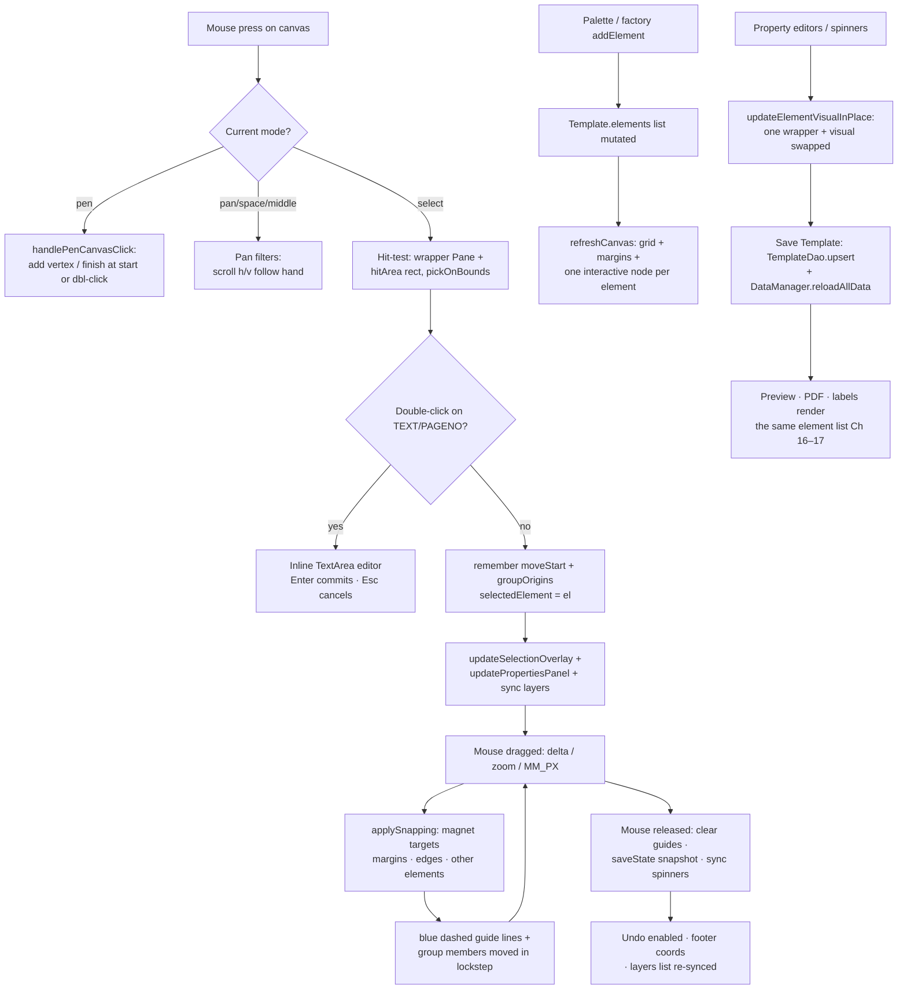

# Chapter 15 — The Template Designer: The Canvas Where Invoices Are Invented

> **Part 9 of InvoiceStudio: Zero to Finished Product**
> Files covered in full this chapter: `ui/views/TemplateDesigner.java` (all 7,687 lines —
> the largest file in the app), `ui/views/DesignerState.java`, `ui/views/VectorGeometryUtil.java`,
> `service/SvgVectorParser.java`, `service/CustomComponentManager.java`,
> `ui/CustomColorChooserDialog.java`, plus the designer test suite
> (`ui/TemplateDesignerEnhancementsTest.java`, `ui/TemplateDesignerVectorEnhancementsTest.java`,
> `service/TemplateDesignerV4Test.java`, `mcp/McpTemplateDesignTest.java`).
> Goal at the end: **you can click, drag, snap, curve, group, undo and save every pixel of an
> invoice — and understand every trick that makes a 7,687-line canvas editor feel calm.**

---

## 1. Chapter goal

By the end of this chapter you will have built, exactly as the repository has it:

1. **The designer shell** (`TemplateDesigner`) — a `BorderPane` with a two-row toolbar
   (title bar + grouped ribbon), a zoomable/pannable white "paper" flanked by live
   millimetre rulers, a footer with FIT/zoom controls and a live coordinate readout, and a
   two-tab sidebar (Properties + Layers) — the whole layout in one constructor.
2. **Element manipulation** — selection with an 8-handle gold overlay, a rotate stem with
   Shift-snapped 15° steps, group-aware dragging, magnetic snapping to neighbouring edges
   and margins with blue guide lines, 1 mm grid snapping, double-click inline text editing,
   and per-vertex cyan anchors for polygons and bezier paths.
3. **The element factory & palette** — Text, Table, 15 shape kinds, Image, SVG, Icon, QR,
   Barcode, Watermark, Divider, Freehand signature — plus pre-built component blocks
   (invoice header, totals, bank details…) and *your own saved* custom components.
4. **Property editors for every element type** — typography with 100–900 weights, line
   height/letter/word spacing, per-side individual borders, table columns with live
   reorder/relabel/rebind, gradients, dashes, caps and joins, shadows, clipping, data
   binding and visible conditions.
5. **Barcode (label) mode** — the same canvas becomes ONE die-cut label cell on thermal
   strip stock: a BarTender-style stock dialog with a live roll diagram, TSC TA210 presets,
   artwork rotation, strip preview and bulk print launchers.
6. **The support cast** — `DesignerState` (undo/redo/clipboard as whole-template JSON
   snapshots), `VectorGeometryUtil` (pure SVG-path maths), `SvgVectorParser` (real SVG
   files → JavaFX nodes *and* PDF-ready Java2D paths), `CustomComponentManager`
   (reusable element blocks persisted as JSON), and `CustomColorChooserDialog` (sliders,
   palette, hex field and a desktop eyedropper).
7. **The test suite** — four test files that pin the geometry, the parsers and the
   component round-trip without ever opening a window.

And you will understand the one architectural idea that keeps a file this large survivable:
**the canvas is a projection of the data.** There is exactly one source of truth — the
`Template` object's list of `TemplateElement`s (Chapter 7) — and every rectangle on screen
is rebuilt *from* it. Every interaction mutates the data first, then asks for a repaint.
That single rule is what makes undo, save, preview, PDF and printing all agree.

---

## 2. Story intro

Chapter 7 gave the app its language: `Template`, `TemplateElement`, `PageConfig`,
`LabelConfig` — a whole vocabulary of shapes and positions stored as data. Chapter 12
showed what that data *becomes*: `BillPreviewPane` renders it, `RenderContext` fills it,
the PDF pipeline prints it. But so far every template arrived from `PresetTemplates` —
built by us, frozen in code.

Kumar's invoice is not our invoice. His wants "GSTIN in red, totals boxed in gold, the
word ORIGINAL printed diagonally behind everything, and a column for batch numbers my
competitor doesn't have." No preset can anticipate that. What he needs is a workshop: a
page he can pick objects up on, push them around until they sit right, and save.

That workshop is the template designer, and it inherits a problem every drawing
application since MacPaint has faced: **the screen shows pixels, the data stores
millimetres, and the user's hand moves in screen points — at a zoom level that keeps
changing.** Every one of this chapter's 7,687 lines exists to translate honestly between
those three coordinate systems, or to make one of a dozen small interactions (select,
drag, snap, resize, rotate, undo) feel *obvious* — which, as this book keeps saying,
nothing ever is on first contact.

> **Analogy:** the designer is a *light table* in an animator's studio. The paper
> (`canvas`) sits still; drawings (`TemplateElement`s) are pinned on top of it in order;
> a ruler runs along the edge; and anything you pin can be lifted, moved, traced and
> re-pinned without harming the paper. The `Template` object is the *peg bar* — one
> canonical strip that every copy of the drawing (screen preview, PDF, thermal label)
> lines up against.

---

## 3. Concepts first

**Scene graph.** JavaFX keeps UI objects in a tree (a "scene graph"): a `Pane` holds
children, children hold children. The designer's canvas is a stack of `Pane`s added to
one parent in a deliberate order — grid at the bottom, then elements, guide lines, the
pen preview, the margin guides, and the selection overlay on top. Later children paint
over earlier ones, so "what's on top" is decided by *insertion order*, not coordinates.

**Hit-testing.** When you click, JavaFX walks the tree top-down asking each node "does
this point hit you?". Two knobs matter here: `setPickOnBounds(true)` makes a node hittable
across its whole rectangle (even where it's transparent), and `setMouseTransparent(true)`
makes a node *invisible to the mouse* so clicks fall through to whatever is underneath.
The designer uses both constantly: the element wrappers are pick-on-bounds with an almost
invisible "hit area" rectangle, while the grid, guides and margin layers are
mouse-transparent so they never steal a click.

**Screen px vs design mm vs zoom.** The model stores positions in **millimetres**
(`el.getX()`, `el.getW()`). The screen shows **pixels**. One millimetre at 96 DPI is
`MM_PX = 3.7795…` px, and the canvas is shown at `zoom` (0.3–4.0). So a drag delta in
screen px converts to mm by dividing by `zoom × MM_PX` — you will see that exact
expression dozens of times. Everything that must look the *same size on screen* at any
zoom (selection handles, borders, dashes, guide strokes) divides its design-space size by
zoom; everything that must look *part of the artwork* (elements themselves) does not.

**Canvas (the JavaFX node).** `javafx.scene.canvas.Canvas` is a *bitmap you draw on* with
a `GraphicsContext` — no children, no layout, just pixels. The designer paints its
background grid onto one canvas at **device resolution** (size × zoom) with an inverse
scale transform, so grid lines land exactly on screen pixels and stay hairline-sharp at
400% instead of turning into blurry stretched bands.

**Undo stack (snapshot style).** There are two classic designs: store *commands* and
reverse them, or store *whole-state snapshots*. This app chose snapshots: every
meaningful action serialises the whole `Template` to JSON and pushes the string onto a
stack capped at 50. Undo pops and re-parses. It costs memory (a template is a few KB of
JSON, so 50 snapshots is trivial) and buys something precious: *any* action becomes
undoable with one line — `saveState()` — no inverse-operation code, ever.

**Drag-and-drop protocol.** Every drag is four beats: **press** (remember start mouse
position + start geometry), **drag** (apply delta, clamp, snap), **release** (finalise,
`saveState()`), and optionally **commit UI** (sync spinners, refresh overlay). The
"remember start values" arrays (`double[] moveStart = new double[4]`) exist so each drag
is computed from the *original* position, never accumulated — accumulating deltas is the
classic bug that makes dragged objects drift.

**SVG paths.** An SVG path is a string like `M 10,30 L 50,30 C 90,60 50,90 10,30 Z` —
letters are commands (M=move, L=line, H/V=horizontal/vertical line, C/S/Q=beziers,
A=arc, Z=close), numbers are their arguments, lowercase means *relative* to the current
point. Two parsers exist in this chapter: `SvgVectorParser` (full XML documents →
drawable sub-shapes) and `VectorGeometryUtil.extractPointsFromSvgPath` (one path string →
the list of *vertex points* a user can grab and drag).

**Bezier curves / Catmull-Rom smoothing.** A cubic bezier `C cp1 cp2 end` bends a line
using two invisible control points. The pen tool's "Curve" mode and the "Convert to
Smooth Bezier" button generate control points with the Catmull-Rom trick: each segment's
control points are derived from the *neighbours* of its two endpoints, scaled by a
tension factor (`t / 3`). The result is a curve that passes through every anchor and
looks hand-drawn.

**Serialization via Jackson.** `ObjectMapper.writeValueAsString(obj)` → JSON string;
`readValue(json, Class)` → object back. The designer uses it for undo snapshots, the
clipboard, component storage, and deep copies (serialize an element, parse it back — a
genuine copy with no shared references).

**`FilteredList`.** A JavaFX wrapper that *views* another list through a predicate — the
same pattern as Chapter 11's search boxes and Chapter 12's buyer combo. The Layers panel
wraps its element list and swaps the predicate on each keystroke in the search field; the
ListView itself never learns the list changed size.

**Debounce / coalesce-then-refine.** A `PauseTransition` timer you restart on every event;
its `onFinished` fires only after a quiet gap. Chapter 12 used it for the live preview.
Here it smooths two gestures: ruler repaints during Ctrl+scroll zoom (one repaint 150 ms
after the last notch) and post-zoom scroll anchoring (corrections at 50 ms and 150 ms).

**Anchor generation.** A small integer bumped on every zoom/centre request; queued
corrections compare generations and skip themselves if a newer request superseded them —
a one-field guard against stale timers fighting each other.

---

## 4. Files in this chapter

| # | File | Type | Lines | Purpose |
|---|---|---|---|---|
| 1 | `ui/views/TemplateDesigner.java` | View | 7,687 | The whole designer: toolbar, canvas, rulers, selection, editors, label mode |
| 2 | `ui/views/DesignerState.java` | State | 107 | Undo/redo stacks + clipboard, plain data, no JavaFX |
| 3 | `ui/views/VectorGeometryUtil.java` | Utility | 386 | Pure geometry: hex colors, SVG-path vertices, bezier generation |
| 4 | `service/SvgVectorParser.java` | Service | 407 | SVG documents/paths → sub-shapes → JavaFX Group or Java2D |
| 5 | `service/CustomComponentManager.java` | Service | 138 | Save/load/instantiate reusable element blocks (JSON file) |
| 6 | `ui/CustomColorChooserDialog.java` | UI | 446 | Dark color chooser: sliders, palette, hex, screen eyedropper |
| 7 | `test/.../ui/TemplateDesignerEnhancementsTest.java` | Test | 141 | Icons, polygon generation, element props |
| 8 | `test/.../ui/TemplateDesignerVectorEnhancementsTest.java` | Test | 136 | Bezier paths, vertex extraction, SVG id-attribute guard |
| 9 | `test/.../service/TemplateDesignerV4Test.java` | Test | 585 | UnitConverter, SVG parse/render, custom components, serialization |
| 10 | `test/.../mcp/McpTemplateDesignTest.java` | Test | 364 | The designer's tool surface exposed to the AI assistant (Ch 18) |

Line counts verified with `wc -l`. Together with the tests: 10,515 lines.

Depends on: `Template` / `TemplateElement` / `PageConfig` / `LabelConfig` /
`ComponentPreset` / `PresetTemplates` (Ch 7), `TemplateDao` / `SettingsDao` /
`VariableDao` (Ch 4–5), `DataManager.reloadAllData()` (Ch 8), `UiTheme` classes /
`Toast` / `DialogHelper` / `IconHelper` / `StudioApp` (Ch 2, 9), `RenderContext` and
`BarcodeService` (Ch 12), and — forward — `DesignObjectRenderer` / `PdfExportService`
(Ch 16), `LabelGeometryService` / `LabelPresets` / `TsplPrintService` /
`LabelStripPreviewDialog` / `LabelBulkPrintDialog` (Ch 17).

Used by: `StudioApp.showTemplateDesigner(...)` and the Templates view (Ch 11), the
global `Ctrl+Shift+L` / `Ctrl+Shift+B` accelerators (Ch 9), the MCP design tools
(Ch 18), and everything in Chapters 16–17 that renders what this chapter lets you build.

---

## 5. Step-by-step build

We build in dependency order: the state class first (it has no UI), then the designer
itself in twelve passes grouped by concern, then the three helpers, then the tests that
lock the maths down.

### Step 1 — `ui/views/DesignerState.java` (the memory of the session)

107 lines, no JavaFX, one job: whole-template snapshots plus a one-element clipboard.

```java
// ui/views/DesignerState.java
final class DesignerState {

    private static final int MAX_UNDO_DEPTH = 50;

    final ObjectMapper mapper = new ObjectMapper();
    private final Stack<String> undoStack = new Stack<>();
    private final Stack<String> redoStack = new Stack<>();
    private TemplateElement clipboardElement;

    // ─── Undo / redo (whole-template JSON snapshots) ───────────────────────

    /** Pushes a snapshot unless it duplicates the current top; clears redo. */
    void saveState(Template template) {
        try {
            String json = mapper.writeValueAsString(template);
            if (!undoStack.isEmpty() && undoStack.peek().equals(json)) {
                return;
            }
            undoStack.push(json);
            if (undoStack.size() > MAX_UNDO_DEPTH) {
                undoStack.remove(0);
            }
            redoStack.clear();
        } catch (Exception e) {
            AppLog.error(e);
        }
    }
```

Line by line:

- The class is **package-private** (`final class`, no `public`). Only the designer and
  its sibling views in `ui.views` can even see it — a deliberate scope boundary: the
  session state of the designer is nobody else's business.
- `MAX_UNDO_DEPTH = 50` — the cap. `undoStack.remove(0)` evicts the *oldest* snapshot
  when the stack overflows, so undo history behaves like a sliding window.
- **Dedupe guard**: if the freshly serialized template equals the current top, the push
  is skipped. This is what makes repeated calls safe — and the designer calls
  `saveState()` a *lot* (release after a drag, spinner change, slider release…).
- `redoStack.clear()` — the moment you make a new edit, the redo branch is gone. Same
  rule as every editor you have ever used.
- The whole body is wrapped in `try/catch` with `AppLog.error(e)`: a serialization
  failure must never crash the canvas.

```java
    Template undo() {
        if (undoStack.size() <= 1) {
            return null;
        }
        try {
            String current = undoStack.pop();
            redoStack.push(current);
            String previous = undoStack.peek();
            return mapper.readValue(previous, Template.class);
        } catch (Exception e) {
            AppLog.error(e);
            return null;
        }
    }
```

`undo()` refuses to pop the *last* remaining snapshot (`size() <= 1`) — that bottom
entry is the freshly-opened template pushed by the constructor, and losing it would leave
the stack empty and the "current" state unanchored. Note the shape of the exchange: the
current state moves to the redo stack, and the *peeked* (not popped) previous state is
deserialized — it stays on the undo stack as the new floor.

The clipboard is the same trick at element size:

```java
    /** Deep-copies the element into the clipboard. */
    void copy(TemplateElement el) {
        if (el == null) return;
        try {
            clipboardElement = mapper.readValue(mapper.writeValueAsString(el), TemplateElement.class);
        } catch (Exception e) {
            AppLog.error(e);
        }
    }

    /** Deep-copies the clipboard element, or null when the clipboard is empty. */
    TemplateElement pasteSource() {
        if (clipboardElement == null) return null;
        try {
            return mapper.readValue(mapper.writeValueAsString(clipboardElement), TemplateElement.class);
        } catch (Exception e) {
            AppLog.error(e);
            return null;
        }
    }
```

`pasteSource()` copies *again* on the way out, so pasting twice gives two independent
elements rather than two references to one clipboard object. JSON round-trips are this
codebase's universal deep-copy idiom (Chapter 7's `copy()` uses the same technique).

> **NOTE (kept faithful):** the class javadoc says "Extracted verbatim from the original
> designer class; behavior is unchanged" and cites "skill rule 5.2 role 1" — the same
> extract-pure-logic-first discipline that produced `ExpenseAnalytics` in Chapter 14. The
> designer used to carry these stacks inline; the extraction exists so the stacks could
> be reasoned about (and, in principle, tested) without a JavaFX scene.

### Step 2 — `TemplateDesigner` skeleton: fields, constructor, session variables

The class opens with its identity: a `BorderPane` (top toolbar, centre split, bottom
footer) holding a tower of named layers.

```java
// ui/views/TemplateDesigner.java
public class TemplateDesigner extends BorderPane {

    private final StudioApp app;
    private final TemplateDao templateDao;
    private final SettingsDao settingsDao;
    private final VariableDao variableDao;

    // Session cache for template variables: loaded fresh once when opening the design page
    private final List<VariableDef> cachedTableScopeVariables = new ArrayList<>();
    private final Map<String, String> cachedVariableLabels = new HashMap<>();
    private final List<VariableDef> cachedAllVariables = new ArrayList<>();
    private final ObservableList<String> cachedColumnKeys = FXCollections.observableArrayList();
    private final List<Node> propBuffer = new ArrayList<>();
```

`propBuffer` is the answer to a subtle layout problem: the properties panel is rebuilt
constantly, and adding controls one-by-one to a live `VBox` fires a layout pass per node.
Instead, builders *buffer* nodes via `addPropertyNode(...)` / `addPropertyNodes(...)` and
the panel is swapped once with `propBox.getChildren().setAll(propBuffer)`.

Then the layer tower — read the comments; they are the best documentation in the file:

```java
    private final Pane canvasContainer = new Pane();
    private final Pane canvas = new Pane();
    private final Pane gridPane = new Pane();
    private final Pane elementsPane = new Pane();
    private final Pane guideLayer = new Pane();
    private final Pane penLayer = new Pane();
    /** Blue dashed printable-margin boundary + legend — kept ABOVE every
     *  element so objects can never cover the guides. */
    private final Pane marginLayer = new Pane();
    private final Pane selectionPane = new Pane();
    private final Pane rulerTop = new Pane();
    private final Pane rulerLeft = new Pane();
    private final Pane rulerCorner = new Pane();
    /** Plain wrapper Group: a Group's layoutBounds = union of its children's
     *  boundsInParent (transforms INCLUDED), so scaling canvasContainer makes
     *  the scaled size visible to layout — the StackPane/ScrollPane then centre
     *  and scroll by the real visual size. Scaling the Group ITSELF would hide
     *  the zoom from layout (Group.layoutBounds excludes its own transform),
     *  which is exactly what let the canvas drift off the reachable (positive)
     *  scroll range at high zoom, cutting off its left side. */
    private final Group scaleGroup = new Group(canvasContainer);
```

That comment is the designer's version of Chapter 12's `BillPreviewPane` zoom lesson:
*JavaFX excludes a node's own transform from its `layoutBounds`.* Scaling the inner
`canvasContainer` (a `Pane`) makes the zoomed size visible to the `StackPane` and
`ScrollPane` above it; scaling the wrapper `Group` would hide the zoom and the scroll
range would go wrong. The same discovery, made twice, in two files.

The interaction state follows:

```java
    private double zoom = 0.9;
    /** Incremented on every zoom/centre request; queued anchor corrections
     *  skip themselves when a newer request superseded them. */
    private int anchorGeneration = 0;
    private double renderedGridStepMm = -1;
    /** Coalescing timer for the ruler repaint during zoom gestures (skill rule
     *  6.1 "coalesce-then-refine"): one trailing-edge repaint ~150 ms after
     *  the last zoom change settles, instead of one full rebuild per wheel
     *  notch. */
    private PauseTransition rulerRepaintDebounce;
    private boolean rulerRepaintPending;
    /** Grey panning margin (px) around the scaled canvas inside the wrapper.
     *  At least half the viewport per side, so the scaled content ALWAYS
     *  overflows the viewport and horizontal/vertical scrolling never dead-ends
     *  — even for a small label cell on a wide monitor (the wrapper is laid out
     *  at exactly pref size; ScrollPane does NOT stretch it). */
    private static final double WRAPPER_MARGIN_MIN_PX = 260.0;
    private Canvas gridCanvasNode;
    private boolean snapToGrid = true;
    private boolean magnetSnapping = true;
    private boolean showGrid = true;
    private boolean isPanMode = false;
    private boolean isPenToolMode = false;
    private boolean penCurveMode = false;
    private boolean isSpaceDown = false;
    private boolean isUpdatingLayersSelection = false;
    private boolean shiftWithMargins = true;
    private boolean updatingProperties = false;
```

Every boolean guards a real trap: `isSpaceDown` (spacebar-pan), `isUpdatingLayersSelection`
(prevents the layers list's selection listener from re-entering while *code* is setting
the selection), `updatingProperties` (prevents spinner listeners from firing while the
panel is being *built from* the model), `shiftWithMargins` (the "move my elements when I
change the margin" preference).

The constructor assembles everything in one pass:

```java
    public TemplateDesigner(StudioApp app, Template template) {
        this.app = app;
        this.templateDao = new TemplateDao(app.getDb());
        this.settingsDao = new SettingsDao(app.getDb());
        this.variableDao = new VariableDao(app.getDb());
        loadSessionVariables();
        this.template = template != null ? template : PresetTemplates.buildClassic();
        if (this.template.isLabelMode()) {
            // Opened a saved label template: canvas must equal the label cell.
            this.template.labelOrNew().sanitize();
            syncPageFromLabelConfig();
        }

        getStyleClass().add("bg-app");
        canvas.getStyleClass().add("bill-sheet-canvas");
        guideLayer.setMouseTransparent(true);
        penLayer.setMouseTransparent(true);
        canvas.getChildren().addAll(gridPane, elementsPane, guideLayer, penLayer, marginLayer, selectionPane);
        gridPane.setMouseTransparent(true);
        marginLayer.setMouseTransparent(true);
        selectionPane.setPickOnBounds(false);

        canvasContainer.getChildren().addAll(rulerTop, rulerLeft, rulerCorner, canvas);

        setTop(createToolbar());

        SplitPane mainSplit = new SplitPane();
        mainSplit.getStyleClass().add("bg-transparent");
        Node canvasArea = createCanvasArea();
        Node sidebar = createSidebar();
        mainSplit.getItems().addAll(canvasArea, sidebar);
        mainSplit.setDividerPositions(0.68);
        SplitPane.setResizableWithParent(sidebar, false);
        setCenter(mainSplit);
        setBottom(createFooterBar());

        setupKeyboardShortcuts();
        saveState();
        refreshCanvas();
        // Sync the visual scale with the zoom field — the wrapper/layout above
        // already assume this zoom, so the painted content must match from
        // frame one (previously the scale stayed 1.0 until the first zoom).
        canvasContainer.setScaleX(zoom);
        canvasContainer.setScaleY(zoom);
        updatePropertiesPanel();
        refreshLayersList();
    }
```

Points worth pausing on:

- **Layer order is load-bearing.** `canvas` children read bottom-to-top: grid, elements,
  guides, pen, margin, selection. `marginLayer` is deliberately above the elements so a
  big table can never paint over the blue printable-boundary; `selectionPane` is last so
  handles sit over everything.
- `selectionPane.setPickOnBounds(false)` — the overlay must not become a giant invisible
  click sponge covering the page; only its actual handle shapes take hits.
- `saveState()` **before** `refreshCanvas()`: the undo stack gets its floor snapshot
  before the user can touch anything.
- A `null` template falls back to `PresetTemplates.buildClassic()` — the designer can
  never open onto nothing.
- Label-mode templates re-sanitize and mirror the stock into the page immediately
  (`syncPageFromLabelConfig`, Step 13) so the canvas equals the label cell from frame one.

`loadSessionVariables()` fills the caches used by every dropdown later: table-scope
variables, their labels, all variables, and the built-in column keys
(`sr, desc, hsn, qty, unit, rate, gst, disc, taxable, amount, batch_no, exp_date, mrp,
serial_no, part_no`) plus any custom ones. It reads the DB **once** per design session —
"cached keys, labels, and definitions in memory for instant O(1) lookups during the
design session", as its comment says — and fails soft (`catch (Exception e) { /* Fallback
gracefully on DB read error */ }`).

### Step 3 — The toolbar, footer and status readouts

`createToolbar()` returns a `VBox` of two rows. Row one is the dark title strip:

```java
        HBox topBar = new HBox(8);
        topBar.setAlignment(Pos.CENTER_LEFT);
        topBar.setPadding(new Insets(5, 10, 4, 10));
        topBar.setStyle("-fx-background-color: #0B1120; -fx-border-color: #1E293B; -fx-border-width: 0 0 1 0;");

        Button backBtn = createIconToolBtn(IconHelper.ICON_NAV_BACK, "Back", "Return to Templates Directory", () -> app.showTemplates());

        nameField.setText(template.getName());
        nameField.setPrefWidth(160);
        nameField.setMinWidth(100);
        nameField.setTooltip(new Tooltip("Template Name"));
        nameField.textProperty().addListener((obs, old, val) -> template.setName(val));
```

The name field writes **straight into the model** — no Save button needed for the name;
the golden `Save Template` button (later in the same row) persists everything at once.

Row two is the *ribbon*, five groups separated by `Separator`s:

1. **Insert & Content** — Text, Table, then four dropdown `MenuButton`s: Shapes
   (Rectangle, Rounded Card, Circle, Ellipse, H/V Line, Arrow, Star, Polygon, Arc,
   Custom SVG Path, Pen Tool, Divider, Freehand Signature, Watermark), Media
   (Image / SVG / Icon), Components (presets + your saved blocks), Code (UPI QR,
   Invoice Barcode). Every item routes into `addElement(ElementType.X)` (Step 11).
2. **Tools** — Select (V), Pan (H / Space), Pen (P), and the Curve/Straight toggle that
   flips `penCurveMode` and re-renders the pen preview live.
3. **Layout & Page** — Page settings, the three Barcode-mode-only buttons
   (Label Stock, Strip Preview, Bulk Print), and the Grid / Snap / Magnet checkboxes:
   ```java
   CheckBox magnetCb = new CheckBox("Magnet");
   magnetCb.setGraphic(IconHelper.getToolbarIcon(IconHelper.ICON_MAGNET));
   magnetCb.setContentDisplay(javafx.scene.control.ContentDisplay.LEFT);
   magnetCb.setSelected(true);
   magnetCb.setMinWidth(Region.USE_PREF_SIZE);
   magnetCb.setTooltip(new Tooltip("Snap object borders to align and collapse with other objects and margins"));
   magnetCb.selectedProperty().addListener((obs, old, val) -> magnetSnapping = val);
   ```
4. **Help** — the F1 shortcuts dialog.
5. **History** — Undo / Redo.

Two structural details make the ribbon honest under pressure:

```java
        // The ribbon (2nd row) is the widest row — in Barcode Mode it grows by
        // Label Stock / Strip Preview / Bulk Print. If it dictated the width of
        // this VBox, the BorderPane would widen the WHOLE top area past the
        // viewport and the right-aligned "Save Template" button ended up off
        // screen. Scrolling the ribbon horizontally keeps the top bar (with
        // Save) pinned to the real window width; excess tools scroll instead.
        ScrollPane ribbonScroll = new ScrollPane(ribbon);
        ribbonScroll.getStyleClass().add("ribbon-scroll");
        ribbonScroll.setHbarPolicy(ScrollPane.ScrollBarPolicy.AS_NEEDED);
        ribbonScroll.setVbarPolicy(ScrollPane.ScrollBarPolicy.NEVER);
        ribbonScroll.setFitToWidth(false);
        ribbonScroll.setFitToHeight(true);
        ribbonScroll.setPannable(false);
```

A horizontally-scrolling ribbon so the top bar (with Save) never gets pushed off-screen.

The shared button factories are small but opinionated:

```java
    /** Toolbar button with a crisp SVG glyph (CSS-recolorable) + label — replaces emoji text buttons. */
    private Button createIconToolBtn(String iconName, String text, String tooltip, Runnable action) {
        Button b = new Button(text);
        b.getStyleClass().addAll("button-sm", "button-secondary", "designer-icon-btn");
        b.setGraphic(IconHelper.getToolbarIcon(iconName));
        b.setContentDisplay(javafx.scene.control.ContentDisplay.LEFT);
        b.setMinWidth(Region.USE_PREF_SIZE);
        if (tooltip != null) b.setTooltip(new Tooltip(tooltip));
        if (action != null) b.setOnAction(e -> action.run());
        return b;
    }
```

Every tool button carries a `Tooltip` — by the end of the build the designer has ~60 of
them, which is why the F1 dialog (Step 12) can be generated from the same knowledge.

`createFooterBar()` builds the bottom strip: the page-format label, the coordinate label,
a spacer, then **FIT**, `−`, a 0.3–4.0 zoom `Slider`, `+`, and the zoom percentage label.
`updatePageFormatLabel()` prints `A4 (210 × 297 mm)` in bill mode and, in label mode:

```java
                pageFormatLabel.setText(String.format(Locale.US,
                        "LABEL %d × %d mm · %d across · strip %d mm",
                        (int) Math.round(cfg.getLabelWidth()),
                        (int) Math.round(cfg.getLabelHeight()),
                        cfg.getColumns(),
                        (int) Math.round(cfg.getStripWidth())));
```

`updateStatusBarCoords()` is the footer's live readout, and its priority order tells you
what the user cares about: the *selected element's* geometry (X/Y/W/H/Rot) when one is
selected, otherwise the cursor's mm position, otherwise a dashed placeholder.

### Step 4 — The canvas area: scroll, pan, zoom

`createCanvasArea()` builds the `ScrollPane` → `StackPane(centerWrapper)` →
`scaleGroup` → `canvasContainer` sandwich and installs **five** event filters. First,
pen-tool capture (a filter, not a handler, so clicks *over existing elements* still
reach the pen):

```java
        // Event filters for Pen Tool mode so clicks anywhere on canvas (even over existing elements) register reliably
        canvas.addEventFilter(MouseEvent.MOUSE_PRESSED, e -> {
            if (isPenToolMode) {
                if (e.getButton() == MouseButton.PRIMARY) {
                    handlePenCanvasClick(e);
                    e.consume();
                } else if (e.getButton() == MouseButton.SECONDARY) {
                    cancelPenTool();
                    e.consume();
                }
            }
        });
```

A `MOUSE_MOVED` filter tracks the cursor in mm for the footer readout; `MOUSE_EXITED`
resets it to `--`.

Deselect-on-empty-canvas is an *onMousePressed handler* (not a filter — it must lose to
element handlers):

```java
        // Deselect when clicking on empty canvas in Select mode
        canvas.setOnMousePressed(e -> {
            if (e.isPrimaryButtonDown() && !isPanMode && !isSpaceDown && !isPenToolMode) {
                if (activeInlineEditor != null) {
                    commitInlineTextEdit(true);
                }
                selectedElement = null;
                updateSelectionOverlay();
                updatePropertiesPanel();
                syncLayersListSelection();
            }
        });
```

Then panning — four ways to trigger it (middle-mouse, Space+drag, Pan tool drag, and
dragging the grey background), all sharing one state array:

```java
        // Pan handling via Middle Mouse, Space+LeftDrag, Pan Tool drag, or Background drag
        final double[] panStart = new double[4];
        final boolean[] isPanning = new boolean[1];

        canvasScrollPane.addEventFilter(MouseEvent.MOUSE_PRESSED, e -> {
            boolean middleBtn = e.getButton() == MouseButton.MIDDLE;
            boolean spaceDrag = isSpaceDown && e.getButton() == MouseButton.PRIMARY;
            boolean panToolDrag = isPanMode && e.getButton() == MouseButton.PRIMARY;
            boolean bgDrag = (e.getTarget() == centerWrapper) && e.getButton() == MouseButton.PRIMARY;

            if (middleBtn || spaceDrag || panToolDrag || bgDrag) {
                panStart[0] = e.getScreenX();
                panStart[1] = e.getScreenY();
                panStart[2] = canvasScrollPane.getHvalue();
                panStart[3] = canvasScrollPane.getVvalue();
                isPanning[0] = true;
                canvasScrollPane.setCursor(Cursor.CLOSED_HAND);
                canvas.setCursor(Cursor.CLOSED_HAND);
                e.consume();
            }
        });
```

The drag filter converts screen deltas into *normalized* scroll fractions
(`deltaH = dx / scrollableW`), inverted (`panStart[2] - deltaH`) so the content follows
the hand — the light-table pushed under your palm. A `MOUSE_RELEASED` filter ends the
pan, and a failsafe `setOnMouseMoved` resets any cursor that got stuck.

Finally, the zoom gesture:

```java
        // Zoom with Ctrl + Scroll Wheel
        canvasScrollPane.addEventFilter(ScrollEvent.SCROLL, e -> {
            if (e.isControlDown()) {
                if (e.getDeltaY() > 0) {
                    setZoom(zoom + 0.05);
                } else if (e.getDeltaY() < 0) {
                    setZoom(zoom - 0.05);
                }
                e.consume();
            }
        });
```

`setZoom` is the most commented method in the file. The abridged reality:

```java
    private void setZoom(double z) {
        double oldZoom = this.zoom;
        this.zoom = Math.max(0.3, Math.min(4.0, z));

        // Viewport anchor: remember which content point currently sits at the
        // centre of the viewport (in designer px, canvas-origin convention) so
        // it can be re-centred after the zoom. This keeps zooming "around the
        // view centre": the canvas can never silently drift off the left/top
        // edge. The capture MEASURES the real on-screen canvas position
        // (localToScene) — exact, no dependence on layout-bounds quirks or
        // possibly-stale laid-out wrapper sizes (mixing those was what dragged
        // every zoom step towards the centre: "zoom always comes to centre").
        double anchorX = Double.NaN, anchorY = Double.NaN;
        if (canvasScrollPane != null && centerWrapper != null && oldZoom > 0) {
            // The measured positions still reflect the scale CURRENTLY applied
            // to the canvas (the old zoom) — divide by exactly that, not by the
            // new zoom, otherwise the capture and the correction cancel each
            // other out and zooming stops re-anchoring altogether.
            double scaleApplied = canvasContainer.getScaleX() > 0 ? canvasContainer.getScaleX() : oldZoom;
            double[] centre = designerPointAtViewportCentre(scaleApplied);
            if (centre != null) {
                anchorX = centre[0];
                anchorY = centre[1];
            }
        }

        // Scale the CONTENT (canvasContainer), not the wrapper Group — see the
        // field comment on scaleGroup: this makes the scaled size participate
        // in layout so centring and scroll ranges are always correct.
        canvasContainer.setScaleX(zoom);
        canvasContainer.setScaleY(zoom);
        zoomLabel.setText((int) Math.round(zoom * 100) + "%");
        ...
        updateCenterWrapperSize();
        // Re-render the grid on EVERY zoom change: the canvas is drawn at device
        // resolution so its lines always stay exactly 1 device px (hairline-sharp,
        // never blurry or thick). The adaptive step additionally refines
        // 10 -> 5 -> 2 -> 1 mm as you zoom in, keeping cells a usable size.
        if (showGrid) {
            rebuildGridForZoom();
        } else {
            buildMarginGuides(); // keep guide hairline scale in sync with zoom
        }

        // Rebuild the selection overlay so handles/border/rotate-stem rescale
        // with the new zoom (they are 1/zoom design px — screen-constant).
        // An open inline editor is committed first: its geometry is designed
        // for the zoom it was opened at, and typing across a zoom change is
        // not a real workflow.
        if (activeInlineEditor != null) {
            commitInlineTextEdit(true);
        }
        updateSelectionOverlay();

        // Re-centre the anchored content point once the layout pulse has run.
        ...
        if (!Double.isNaN(anchorX)) {
            scheduleAnchorCorrection(anchorX, anchorY);
        }
    }
```

The choreography, in words: **capture** the content point under the viewport centre
(measured live with `localToScene`, divided by the *currently applied* scale — a classic
off-by-one-zoom trap the comment warns about), **scale** the content, **resize** the
wrapper, **repaint** grid and overlay, then **re-anchor** — twice, after layout settles:

```java
    private void scheduleAnchorCorrection(double ax, double ay) {
        final int generation = ++anchorGeneration;
        for (double delayMs : new double[]{50, 150}) {
            PauseTransition t = new PauseTransition(javafx.util.Duration.millis(delayMs));

            t.setOnFinished(e -> correctViewportAnchor(generation, ax, ay));
            t.play();
        }
    }
```

Two passes (50 ms, 150 ms) because "ScrollPane preserves the PIXEL scroll offset (not the
normalized h/v value) when the content is resized, so any value set before the layout
would be silently re-scaled and lost" — the method comment explains the whole war. Each
run of `correctViewportAnchor` re-derives the canvas position *absolutely* from live
measurements (never accumulates deltas), clamps to `0..1`, sets `Hvalue`/`Vvalue`, and
bails immediately if `generation != anchorGeneration`.

`fitToView()` — the FIT button and `Ctrl+0` — picks the largest zoom that still shows the
whole page with a 70 px breathing margin, then `centerView()` (which defers via
`Platform.runLater` and even attaches a one-shot width listener if the canvas isn't laid
out yet). `updateCenterWrapperSize()` sizes the wrapper to
`scaled page + rulers + per-side margins`, where the margins guarantee panning never
dead-ends:

```java
    /** Per-axis panning margin around the scaled canvas (never below the
     *  classic 260 px; grows to half the viewport so small canvases stay
     *  freely scrollable on wide windows). */
    private double wrapperMarginX() {
        if (canvasScrollPane != null) {
            Bounds vp = canvasScrollPane.getViewportBounds();
            if (vp != null && vp.getWidth() > 0) {
                return Math.max(WRAPPER_MARGIN_MIN_PX, vp.getWidth() / 2.0);
            }
        }
        return WRAPPER_MARGIN_MIN_PX;
    }
```

### Step 5 — Grid, margin guides, rulers: hairlines at every zoom

The adaptive grid step keeps cells a constant *on-screen* size:

```java
    /**
     * Adaptive background-grid step in millimetres, chosen from the zoom level:
     * up to 105% -> 10 mm, up to 205% -> 5 mm, up to 305% -> 2 mm, beyond -> 1 mm
     * (one step finer per +100% zoom, keeping on-screen cells roughly constant).
     */
    private double gridStepMm() {
        if (zoom <= 1.05) return 10.0;
        if (zoom <= 2.05) return 5.0;
        if (zoom <= 3.05) return 2.0;
        return 1.0;
    }
```

`rebuildGridForZoom()` swaps only the grid canvas (cheap), rebuilds the margin guides,
and — crucially — **coalesces** the ruler repaint:

```java
    /**
     * Coalesces ruler repaints: at most one repaint stays pending, always for
     * the latest zoom/page metrics. The current rulers remain on screen (valid
     * for the previous zoom) until the gesture settles, then a single repaint
     * swaps them for the exact new scale. {@link #flushPendingRulerRepaint()}
     * forces the swap immediately (used by tests and full re-renders).
     */
    private void scheduleRulerRepaint(double pageW, double pageH) {
        rulerRepaintPending = true;
        if (rulerRepaintDebounce == null) {
            rulerRepaintDebounce = new PauseTransition(Duration.millis(150));
            rulerRepaintDebounce.setOnFinished(e -> {
                if (!rulerRepaintPending) return;
                rulerRepaintPending = false;
                PageConfig pg = template.getPage();
                buildRulers(pg.getWidth() * MM_PX, pg.getHeight() * MM_PX);
            });
        }
        rulerRepaintDebounce.playFromStart();
    }

    /** Runs a pending coalesced ruler repaint NOW (no-op if none pending). */
    void flushPendingRulerRepaint() {
        if (rulerRepaintPending && rulerRepaintDebounce != null) {
            rulerRepaintDebounce.stop();
            rulerRepaintDebounce.getOnFinished().handle(null);
        }
    }
```

> **NOTE (kept faithful):** `flushPendingRulerRepaint()` is package-private on purpose —
> it is the test hook. It also fires the debounce's handler with a `null` event, which
> works only because that handler ignores its argument. A small, honest hack.

The grid itself is one Canvas painted at device resolution:

```java
    private void buildGridCanvas(double pageW, double pageH) {
        if (!showGrid) return;
        double stepMm = gridStepMm();
        renderedGridStepMm = stepMm;

        double deviceW = Math.max(1.0, Math.ceil(pageW * zoom));
        double deviceH = Math.max(1.0, Math.ceil(pageH * zoom));
        Canvas gridCanvas = new Canvas(deviceW, deviceH);
        if (Math.abs(zoom - 1.0) > 1e-9) {
            gridCanvas.getTransforms().add(new Scale(1.0 / zoom, 1.0 / zoom));
        }

        GraphicsContext gc = gridCanvas.getGraphicsContext2D();
        double stepPx = stepMm * MM_PX * zoom;   // cell size in device pixels
        gc.setLineWidth(1.0);                    // 1 device px — the thinnest possible
        Color minor = Color.web("#ececee");
        Color major = Color.web("#d9d9de");
        int i = 1;
        for (double x = stepPx; x < deviceW; x += stepPx) {
            gc.setStroke(i % 5 == 0 ? major : minor);
            double sx = Math.round(x) + 0.5;
            gc.strokeLine(sx, 0, sx, deviceH);
            i++;
        }
        ...
        gridCanvas.setMouseTransparent(true);
        gridCanvasNode = gridCanvas;
        gridPane.getChildren().add(0, gridCanvas);
    }
```

The two tricks: the canvas is `page × zoom` device px big with an inverse `1/zoom` scale
(so its *local* coordinates stay in design px), and each line is snapped with
`Math.round(x) + 0.5` — the +0.5 lands a 1-px stroke exactly on the pixel grid instead of
straddling two, which is the difference between crisp and fuzzy. Every 5th line is darker
for a sense of scale.

`buildMarginGuides()` draws the blue dashed printable boundary **and a legend** on
`marginLayer`, scaling stroke, dash pattern, padding *and* font size by `hair = 1.0 /
max(0.3, zoom)` so everything stays screen-constant. In label mode the legend appends the
stock's own L/R margins and column count.

The rulers are the crown jewel of this step. Their major step follows the canonical
1-2-5 progression, sized so labels stay ≥ 32 screen px apart:

```java
    private double rulerMajorStepMm() {
        double pxPerMm = MM_PX * zoom;
        for (double s : new double[]{1, 2, 5, 10, 20, 50, 100, 200, 500}) {
            if (s * pxPerMm >= 32) return s;
        }
        return 500;
    }

    private double rulerMinorStepMm(double major) {
        double pxPerMm = MM_PX * zoom;
        if (major / 10 * pxPerMm >= 3) return major / 10;
        if (major / 5 * pxPerMm >= 3) return major / 5;
        return major / 2;
    }
```

`buildRulerTicks(...)` then walks the ruler drawing a **three-tier** tick system (major /
mid / minor with lengths 10 / 6.5 / 4 local px), snapping each tick to whole device px
and deduplicating sub-pixel pile-ups:

```java
        for (long i = 0; ; i++) {
            double v = i * minorStep;
            if (v > totalMm + 1e-9) break;
            boolean isMajor = i % sub == 0;
            boolean isMid = !isMajor && midEvery > 0 && i % midEvery == 0;

            // Snap to whole device pixels (local = device / zoom) for crisp hairlines
            double snapped = Math.round(v * MM_PX * zoom) / zoom;
            if (snapped <= lastSnapped + 1e-9 && i > 0) continue; // dedupe sub-pixel pile-up
            lastSnapped = snapped;
```

Numbers appear **only on major ticks** ("the exact measure the long strip marks"), with a
clip guard: interior labels that would run past the page end are dropped; the *last*
major label is instead aligned flush with the edge so the page's exact size always stays
readable. Tick sizes grow as `base × max(1, zoom)` — zooming out keeps a readability
floor; zooming in, the 22 px ruler strip itself scales with the page, and the ticks grow
with it so they don't look lost inside it.

`refreshCanvas()` is the master repaint the whole class keeps calling: position the
canvas and rulers, rebuild grid + margins, clear `elementsPane` and re-create one
interactive node per visible element, then rebuild the selection overlay. Notice what it
*doesn't* do — it never touches your `Template`. Data first, picture second.

### Step 6 — Elements on canvas: hit-testing, rendering, moving

One method turns a `TemplateElement` into a live node:

```java
    private Node createInteractiveElementNode(TemplateElement el, RenderContext ctx) {
        double x = el.getX() * MM_PX;
        double y = el.getY() * MM_PX;
        double w = el.getW() * MM_PX;
        double h = el.getH() * MM_PX;

        Pane wrapper = new Pane();
        wrapper.setUserData(el);
        wrapper.setLayoutX(x);
        wrapper.setLayoutY(y);
        wrapper.setPrefSize(w, h);
        wrapper.setMinSize(w, h);
        wrapper.setMaxSize(w, h);
        wrapper.setRotate(el.getRotation());
        wrapper.setPickOnBounds(true);
        wrapper.setCursor(Cursor.DEFAULT);
        wrapper.setStyle("-fx-background-color: rgba(255, 255, 255, 0.005);");

        // Explicit geometric hitArea so tables and transparent shapes capture clicks reliably
        Rectangle hitArea = new Rectangle(w, h);
        hitArea.setFill(Color.web("#FFFFFF", 0.005));
        hitArea.setPickOnBounds(true);
        hitArea.setCursor(Cursor.DEFAULT);
        wrapper.getChildren().add(hitArea);

        Node visual = renderVisualElement(el, ctx, w, h);
        if (visual != null) {
            setRecursivelyMouseTransparent(visual);
            wrapper.getChildren().add(visual);
        }
```

The pattern: an invisible **wrapper** `Pane` positioned at mm × MM_PX, carrying the
element in `setUserData` (the trick that lets later code find "the node for this
element" by identity), containing (1) a nearly-transparent `hitArea` rectangle — 0.5%
opacity white, which exists purely so *clicks* land even over fully transparent shapes —
and (2) the **visual**, rendered by `renderVisualElement`:

```java
    private Node renderVisualElement(TemplateElement el, RenderContext ctx, double w, double h) {
        if (el.getType() == ElementType.TABLE) {
            return renderTableVisual(el, w, h);
        }
        return com.invoicestudio.service.DesignObjectRenderer.render(el, ctx, w, h);
    }
```

Tables get a bespoke canvas-side mock-up (`renderTableVisual`); everything else is
delegated to `DesignObjectRenderer` — the *same* renderer the PDF export will use in
Chapter 16, which is exactly why "what you see is what prints". The visual is then made
`setRecursivelyMouseTransparent(...)` so it can never swallow events; only the wrapper
and hitArea listen.

> **NOTE (kept faithful):** `renderTableVisual` fills the preview rows with hard-coded
> sample values (`"Sample Item " + r`, `"8471"`, `"1.00"`, `"PCS"`, `"500.00"`, `"18%"`,
> `"590.00"`) and numbers the `sr` column by row index. That is deliberate — the designer
> has no `Bill`, so the table shows a *shape* mock-up; real values arrive in the preview
> pane (Ch 12) and PDF (Ch 16). The mock keeps the designer honest about layout without
> pretending to know data.

The mock honors everything the user can style: border style (`grid` / `rows` / `outline` /
`none`), per-side outer borders via the "transparent color" trick, per-column percent
widths and alignment, header background/text, zebra striping, font scale
(`10.0 * el.tableFontScale()`), and a row count clamped to `1..25`.

The drag protocol lives on the wrapper:

```java
        // Element selection and moving (with synchronized multi-element group drag)
        final double[] moveStart = new double[4];
        final boolean[] isMoved = new boolean[1];
        final Map<TemplateElement, double[]> groupOrigins = new HashMap<>();

        wrapper.setOnMousePressed(e -> {
            if (isPanMode || isSpaceDown || e.getButton() == MouseButton.MIDDLE) return;
            if (e.getClickCount() == 2 && e.getButton() == MouseButton.PRIMARY && (el.getType() == ElementType.TEXT || el.getType() == ElementType.PAGENO)) {
                startInlineTextEdit(el);
                e.consume();
                return;
            }
            if (e.isPrimaryButtonDown()) {
                moveStart[0] = e.getScreenX();
                moveStart[1] = e.getScreenY();
                moveStart[2] = el.getX();
                moveStart[3] = el.getY();
                isMoved[0] = false;
                groupOrigins.clear();

                if (el.isGrouped()) {
                    for (TemplateElement sibling : template.getElements()) {
                        if (Objects.equals(sibling.getGroupId(), el.getGroupId())) {
                            groupOrigins.put(sibling, new double[]{sibling.getX(), sibling.getY()});
                        }
                    }
                } else {
                    groupOrigins.put(el, new double[]{el.getX(), el.getY()});
                }

                selectedElement = el;
                updateSelectionOverlay();
                updatePropertiesPanel();
                syncLayersListSelection();
                e.consume();
            }
        });
```

Press = remember (mouse, geometry, whole group's origins), select, repaint overlay and
properties. Double-click on TEXT/PAGENO opens the inline editor instead. Drag = convert
screen deltas to mm, snap, and move *every* group member:

```java
        wrapper.setOnMouseDragged(e -> {
            if (isPanMode || isSpaceDown || e.getButton() == MouseButton.MIDDLE) return;
            if (el.isLocked()) return;
            if (!e.isPrimaryButtonDown()) return;

            isMoved[0] = true;
            double dx = (e.getScreenX() - moveStart[0]) / zoom / MM_PX;
            double dy = (e.getScreenY() - moveStart[1]) / zoom / MM_PX;

            double newX = Math.max(0, moveStart[2] + dx);
            double newY = Math.max(0, moveStart[3] + dy);

            double[] snapped = applySnapping(el, newX, newY);
            double finalDx = snapped[0] - moveStart[2];
            double finalDy = snapped[1] - moveStart[3];

            for (Map.Entry<TemplateElement, double[]> entry : groupOrigins.entrySet()) {
                TemplateElement sibling = entry.getKey();
                double[] orig = entry.getValue();
                double nx = Math.max(0, orig[0] + finalDx);
                double ny = Math.max(0, orig[1] + finalDy);
                sibling.setX(nx);
                sibling.setY(ny);
                for (Node n : elementsPane.getChildren()) {
                    if (n.getUserData() == sibling) {
                        n.setLayoutX(nx * MM_PX);
                        n.setLayoutY(ny * MM_PX);
                        break;
                    }
                }
            }

            updateSelectionOverlayPos(el.getX() * MM_PX, el.getY() * MM_PX);
            e.consume();
        });
```

Read `/ zoom / MM_PX` twice — it is the chapter's leitmotif. Note the drag updates the
model *and* the node layout in lockstep; it does **not** rebuild the canvas. Release =
clear guides, and only `if (isMoved[0])` push an undo snapshot and sync the spinners —
a click without motion makes no history.

`updateElementVisualInPlace(el)` is the *surgical* refresh used by every property editor:
it finds the wrapper by `getUserData() == el`, repositions/resizes/rotates it, fixes the
hitArea, and swaps `children().set(1, newVisual)` — one node replaced, the rest of the
page untouched (the same section-scoped-swap discipline as Dashboard 2's cards, Ch 14).
`updateLiveElementVisual(...)` is its during-drag cousin; for TABLE elements it even
re-stretches each row's per-column widths from the percent values without re-rendering.

### Step 7 — The selection overlay: handles, rotation, snapping, inline editing

`updateSelectionOverlay()` clears `selectionPane` and, if an element is selected and
visible, builds the full kit: an invisible `moveHitArea` (so dragging *anywhere* inside
works), the gold dashed border, a rotate stem + dot, and 8 resize handles. The
zoom-constant trick appears everywhere:

```java
        // Selection Border: high-contrast gold dashed border. Stroke width and
        // dash lengths are divided by the zoom so the border reads as the same
        // hairline weight ON SCREEN at any zoom (2/5/4 px design space became
        // 8/20/16 px chunks at 400 %).
        double inv = 1.0 / Math.max(0.3, zoom);
        Rectangle border = new Rectangle(w, h);
        border.setFill(Color.TRANSPARENT);
        border.setStroke(Color.web("#D9A13B"));
        border.setStrokeWidth(2.0 * inv);
        border.getStrokeDashArray().addAll(5.0 * inv, 4.0 * inv);
```

and

```java
    /**
     * Selection-handle visual size in DESIGN px. The overlay lives inside the
     * zoom-scaled canvas container, so a fixed design px size would grow with
     * zoom (10 px handles became 40 px blobs at 400 %, swallowing small
     * elements). Dividing by the zoom keeps the handles a CONSTANT ~10 px ON
     * SCREEN at any zoom — they shrink as you zoom in and grow as you zoom out,
     * exactly like every professional design tool.
     */
    private double handleSizePx() {
        return Math.max(3.0, 10.0 / Math.max(0.3, zoom));
    }
```

`updateSelBoxGeometry(...)` repositions all 8 handles plus the rotate assembly; its
comment records two hard-won fixes: handles sit on the *true* corners "even when the
element extends past the page edge (clamping here used to leave them stranded mid-air)",
and the rotate stem length `22.0 / max(0.3, zoom)`.

Rotation is trigonometry plus a shift key:

```java
        handleRotate.setOnMouseDragged(e -> {
            if (el.isLocked()) return;
            double dx = e.getSceneX() - rotCenter[0];
            double dy = e.getSceneY() - rotCenter[1];
            double rad = Math.atan2(dy, dx);
            double deg = Math.toDegrees(rad) + 90.0;
            if (deg < 0) deg += 360.0;
            if (deg >= 360.0) deg -= 360.0;

            if (e.isShiftDown()) {
                deg = Math.round(deg / 15.0) * 15.0;
            } else {
                deg = Math.round(deg * 10.0) / 10.0;
            }

            el.setRotation(deg);
            selBox.setRotate(deg);
            for (Node n : elementsPane.getChildren()) {
                if (n.getUserData() == el) {
                    n.setRotate(deg);
                    break;
                }
            }
            syncGeoSpinnersIfPresent();
            e.consume();
        });
```

`atan2` gives the mouse angle; `+90°` converts "angle from centre" into "element
rotation"; Shift snaps to 15°, otherwise the angle is smoothed to a tenth of a degree.
The model, the overlay box, and the element node all rotate together.

Each of the 8 resize handles follows the same skeleton — SE (grow right+down, minimums
5 mm × 3 mm), E (width only), S (height only), and the *anchored* handles (W, N, NW, NE,
SW) which also move the element so the opposite edge stays put:

```java
        // 4. W Handle (Left-Center with Left-Side Scaling)
        handleW.setOnMouseDragged(e -> {
            if (el.isLocked()) return;
            double dx = (e.getScreenX() - resizeStart[0]) / zoom / MM_PX;
            double newW = Math.max(5.0, resizeStart[2] - dx);
            double newX = Math.max(0, resizeStart[4] + (resizeStart[2] - newW));
            if (snapToGrid) { newW = Math.round(newW); newX = Math.round(newX); }
            el.setW(newW); el.setX(newX);
            selBox.setLayoutX(newX * MM_PX);
            updateSelBoxGeometry(selBox, border, moveHitArea, handleNW, handleN, handleNE, handleE, handleSE, handleS, handleSW, handleW, rotateStem, handleRotate, newW * MM_PX, el.getH() * MM_PX);
            updateLiveElementVisual(el, newW, el.getH(), newX, el.getY());
            e.consume();
        });
```

Notice `resizeStart[4]`/`[5]` — the element's original X/Y ride along in the start
array so the anchored edge can be recomputed from scratch each frame. Every handler ends
with the same release triplet:
`updateElementVisualInPlace(selectedElement); saveState(); syncGeoSpinnersIfPresent();`
— one history entry per resize gesture, never per frame.

Magnetic snapping is `applySnapping`, called from every move drag:

```java
        if (magnetSnapping) {
            double snapThreshold = 1.5; // mm threshold for magnetic snapping
            double bestDistX = snapThreshold;
            double bestSnapX = newX;

            // Candidates for X
            List<Double> xTargets = new ArrayList<>();
            if (mg != null) {
                xTargets.add(mg.getLeft());
                xTargets.add(Math.max(0, pageW - mg.getRight() - el.getW()));
            }
            xTargets.add(0.0);
            xTargets.add(Math.max(0, pageW - el.getW()));

            for (TemplateElement other : template.getElements()) {
                if (other == el || other.isHidden()) continue;
                xTargets.add(other.getX());
                xTargets.add(other.getX() - el.getW());
                xTargets.add(other.getX() + other.getW());
                xTargets.add(other.getX() + other.getW() - el.getW());
            }
            ...
```

Four candidate families per axis: the margins (plus their "other side" positions), the
page edges, and every other element's left/right edge (plus its aligned-flush
counterpart). The nearest candidate within 1.5 mm wins; grid snapping (`Math.round`)
applies **only if magnet didn't** (`if (snapToGrid && snappedGuideX < 0)`) — magnet beats
grid, which is what your hand expects. When a magnet snap fires, a dashed `#38BDF8`
guide line is drawn the full height/width of the page on `guideLayer` — the visual
explanation of *why* the object just jumped.

Finally, the inline text editor — double-click any TEXT/PAGENO element and a `TextArea`
appears *exactly on top of it*, on the selection pane:

```java
        // Same 1.3 pt→px factor the canvas renderer uses for TEXT elements, so
        // the text fills the editor exactly like the rendered element behind it.
        double fontSize = el.getFontSize() > 0 ? el.getFontSize() * 1.3 : 14.0;
        ...
        editor.applyCss();
        javafx.scene.Node content = editor.lookup(".content");
        if (content != null) {
            content.setStyle("-fx-padding: 0; -fx-background-color: transparent; "
                    + "-fx-background-radius: 0; -fx-background-insets: 0;");
        }
```

Three fights with the toolkit are documented in place: the TextArea skin's inner
`.content` region carries its own opaque background and padding (zeroed by the lookup
above); `selectAll()` can scroll the caret viewport so the first line hides (fixed with
`setScrollTop(0)`); and the editor's border/padding are divided by zoom so the frame
doesn't fatten at 400%. Enter commits (`commitInlineTextEdit(true)`), Shift+Enter makes a
newline, Escape cancels, focus loss commits, and committing writes `el.setText(...)`,
refreshes the single element in place, and pushes one undo snapshot.

The render context the canvas draws with is also built here-adjacent:

```java
    /**
     * Render context for the DESIGN CANVAS. Beyond the standard sample
     * values, every user-defined variable is resolved to its FIRST possible
     * value (fallback: its default value) so the canvas shows real content —
     * a barcode/size variable renders "28" instead of the raw
     * {@code {{size}}} placeholder. The element MODEL still stores the
     * {@code {{key}}} placeholder (inline editing and Bulk Print keep
     * working); only the painted preview resolves it.
     */
    private RenderContext newDesignerRenderContext() {
        RenderContext ctx = new RenderContext(null, settingsDao.getSettings(), 0, 1, 1);
        try {
            for (VariableDef v : variableDao.getAllVariables()) {
                if (v == null || v.getKey() == null || v.getKey().isBlank()) continue;
                List<String> choices = v.choicesList();
                if (!choices.isEmpty()) {
                    ctx.getValues().putIfAbsent(v.getKey(), choices.get(0));
                } else if (!v.getDefaultValue().isBlank()) {
                    ctx.getValues().putIfAbsent(v.getKey(), v.getDefaultValue());
                }
            }
        } catch (Exception ignored) {
            AppLog.debug(ignored);
            // Variable source unavailable — canvas falls back to {{key}} text.
        }
        return ctx;
    }
```

This composes exactly with Chapter 12's rule — unknown variables stay visible as
`{{name}}` when the bill is `null` — and then improves on it: *defined* variables show
their first choice, so a label canvas reads like a real product label.

### Step 8 — VectorGeometryUtil and the pen tool: drawing with points

`VectorGeometryUtil` is pure, static, and directly unit-tested. Its SVG path tokenizer
is compiled once ("never allocate Pattern in a render path"):

```java
// ui/views/VectorGeometryUtil.java
final class VectorGeometryUtil {

    /** Compiled once (skill rule 3.1 — never allocate Pattern in a render path). */
    private static final Pattern SVG_TOKEN =
            Pattern.compile("([a-zA-Z])|([-+]?[0-9]*\\.?[0-9]+(?:[eE][-+]?[0-9]+)?)");
```

`extractPointsFromSvgPath(d)` walks that token stream command-by-command — `M/m`, `L/l`,
`H/h`, `V/v`, `C/c`, `S/Q`, `s/q`, `Z/z` — recording only *vertex* points (for `C` it
skips the first four control numbers and records the endpoint):

```java
                    case 'C' -> {
                        if (i + 5 < tokens.size()) {
                            i += 4;
                            curX = Double.parseDouble(tokens.get(i++));
                            curY = Double.parseDouble(tokens.get(i++));
                            pts.add(new Point2D(curX, curY));
                        }
                    }
```

Everything is wrapped in a best-effort try/catch: "a bad path must never break canvas
rendering." `parseElementVertices(el)` is the dispatcher — PATH/SVG elements parse their
path data *unless* they also carry custom points:

```java
        boolean hasCustomPoints = el.getPoints() != null && !el.getPoints().isBlank()
                && !"0,0 20,40 40,0".equals(el.getPoints().trim());
```

> **NOTE (kept faithful):** `"0,0 20,40 40,0"` is the default points string that
> `addElement(ElementType.POLYGON)` writes in Step 11's factory. The comparison exists so
> a freshly created polygon's *default* triangle doesn't override richer PATH data.
> A magic string coupling two files — it works, and now you know where both ends live.

`generateSmoothBezierPath(pts, tension, closed)` is the Catmull-Rom→Bezier converter:
tension clamped to `0.05..1.5`, `factor = t / 3.0`, and for each segment the control
points are `curr + factor × (next − prev)` and `next − factor × (nextNext − curr)`, with
phantom points *reflected* at the open ends (so open curves don't kink at the tips).
One and two-point inputs get exact `M` / `M … L …` strings — the tests pin those.

`syncVerticesToElement(el, curPts, curved, tension)` writes the points back and, when
curved, regenerates the bezier — upgrading the element to `PATH` (or rewriting
`svgSource` for SVG types), closing it unless it's a POLYLINE/FREEHAND.

The color helpers (`colorToHex` / `hexToColor`, both null-and-"transparent"-safe), the
column-key labeler, and the image decoders (`decodeFxImage` handles `data:image` base64,
`classpath:` and file paths; `loadResourceAsBase64` returns a PNG data-URI) round the
class out — the designer reaches all of them through tiny delegating wrappers.

On top of this maths sits the **pen tool**. Clicking in pen mode adds a snapped mm
vertex; double-clicking or clicking within 5 mm of the start finishes:

```java
        // Check if clicked close to start point (within 5mm) to close polygon
        if (penPoints.size() >= 3) {
            Point2D startPt = penPoints.get(0);
            double dist = Math.hypot(ptX - startPt.getX(), ptY - startPt.getY());
            if (dist <= 5.0) {
                finishPenPath();
                return;
            }
        }
```

`renderPenPreview(...)` draws either a live bezier (a dashed blue `SVGPath` scaled by
`MM_PX`) or a dashed polyline plus a lighter "rubber band" to the cursor, with anchor
circles — the start one turns green and fattens when the shape is closeable.
`finishPenPath()` computes the bounding box, converts points to *relative* coordinates,
and creates the element:

```java
        TemplateElement el = new TemplateElement();
        el.setId(UUID.randomUUID().toString());
        el.setName((penCurveMode ? "Curved Vector " : "Custom Vector ") + (template.getElements().size() + 1));
        el.setX(minX);
        el.setY(minY);
        el.setW(w);
        el.setH(h);
        el.setPoints(ptsBuilder.toString());
        el.setBg("#3B82F6");
        el.setFillType("solid");
        el.setBorderColor("#1E40AF");
        el.setBorderWidth(0.5);
        el.setStrokeEnabled(true);

        if (penCurveMode) {
            el.setType(ElementType.PATH);
            String curveD = generateSmoothBezierPath(relPts, 0.5, true);
            el.setPathData(curveD);
        } else {
            el.setType(ElementType.POLYGON);
        }
```

Selection then grows **per-vertex anchors** (`addVertexAnchorHandles`): a cyan circle on
every vertex, draggable with the element's *rotation compensated out* of the mouse delta:

```java
                double rad = Math.toRadians(-el.getRotation());
                double screenDx = (e.getScreenX() - startPos[0]) / zoom / MM_PX;
                double screenDy = (e.getScreenY() - startPos[1]) / zoom / MM_PX;

                double localDx = screenDx * Math.cos(rad) - screenDy * Math.sin(rad);
                double localDy = screenDx * Math.sin(rad) + screenDy * Math.cos(rad);
```

Dragging a vertex past the old bounding box grows `W`/`H` to fit, then
`syncVerticesToElement` writes the geometry back and the single element re-renders. The
properties panel gains a "Vector Curves & Anchor Points" pane with the
Sharp↔Smooth toggle, a tension slider, and add/remove-vertex buttons.

`TemplateDesigner` keeps thin `public static` wrappers
(`parseElementVertices`, `extractPointsFromSvgPath`, `generateSmoothBezierPath`)
"Kept for the existing unit tests; logic now lives in {@link VectorGeometryUtil}" — a
nice closing of the loop between refactor and test.

### Step 9 — The property editors: one panel, twelve personalities

`updatePropertiesPanel()` is the dispatcher. It resets the guard flag, clears the
`propBuffer`, nulls the geometry-spinner references, and then either builds the
**Page & Margin** panel (nothing selected) or the per-element panel:

```java
            // Specific Type Editors
            if (el.getType() == ElementType.TEXT || el.getType() == ElementType.PAGENO) {
                buildTextProperties(el);
            } else if (el.getType() == ElementType.RECT) {
                buildRectProperties(el);
            } else if (el.getType() == ElementType.LINE) {
                buildLineProperties(el);
            } else if (el.getType() == ElementType.IMAGE) {
                buildImageProperties(el);
            } else if (el.getType() == ElementType.QRCODE) {
                buildQrProperties(el);
            } else if (el.getType() == ElementType.BARCODE) {
                buildBarcodeProperties(el);
            } else if (el.getType() == ElementType.TABLE) {
                buildTableProperties(el);
            } else if (isShapeType(el.getType())) {
                buildShapeProperties(el);
            } else if (el.getType() == ElementType.SVG) {
                buildSvgProperties(el);
            } else if (el.getType() == ElementType.ICON) {
                buildIconProperties(el);
            } else if (el.getType() == ElementType.WATERMARK) {
                buildWatermarkProperties(el);
            }

            // Universal Effects, Transforms, and Data Binding
            buildEffectsAndTransformsProperties(el);
            buildDataBindingProperties(el);
```

Every panel starts the same way — a header row (type badge, save-as-component, duplicate,
up/down, delete), a friendly Name field, and the **Position & Size** grid with a unit
combo (MM/PT/CM/IN/PX via `UnitConverter`, Chapter 7) whose spinners write
`UnitConverter.toMm(v, unit)` straight into the model. The spinners are made
keyboard-honest by `configureNumberSpinner` (select-all on focus, commit typed text on
focus-loss and Enter), and every listener is fenced by the two flags
(`!updatingProperties && !updatingGeo[0]`) so *building* the panel never mutates the
model it was built from.

**Text / PAGENO** gets the fullest panel. The variable inserter is a grouped combo:

```java
        // 1. Direct Dropdown & + Add Button directly in property view.
        //    Items are GROUPED by category (Invoice, Buyer, Totals, ...) with
        //    disabled section-header rows — headers are styled via .var-group-header
        //    and cannot be selected with the mouse; the + Add guard also skips
        //    them for keyboard navigation.
        ComboBox<VariableGrouper.Row> varCombo = new ComboBox<>();
```

headers are `setDisable(true)` ListCells (unclickable, and the `+ Add` guard skips
them), values show `"Label  {{key}}"`, and insertion goes through
`insertVariableIntoTarget(ta, "{{" + key + "}}", el)` — a caret-aware splice that
replaces the selection if there is one. A second button opens the full searchable
picker (Step 10). Then: font family combo (7 built-ins + any custom fonts from
Settings), size spinner (5–72 pt), the B / I / U / S toggles, a 100–900 weight combo
whose listener keeps the Bold toggle and `el.setBold(num >= 700)` in sync, alignment
buttons, color pickers with an 8-chip quick palette, a background color with a
"Transparent" checkbox, and a "Typography & Spacing" pane (line-height presets Auto /
Tight / Normal / Relaxed / Double plus a raw spinner, letter spacing, word spacing, and
a text-case combo feeding `el.setTextTransform`).

**RECT** gets fill color + transparent toggle and the two-mode border editor: a unified
border (color/width/radius), or "Individual Border Controls (Per-Side)" which builds
four TitledPanes, each with Active / Width / Color / Style (solid/dashed/dotted) writing
`el.setBorderTopWidth(...)`-style setters. **LINE** is direction + color + thickness.
**IMAGE** shows a thumbnail (business logo, file, or the app's light/dark logos), a
"Use Company Logo from Settings" checkbox, a file browser that embeds the image as a
base64 data-URI:

```java
                    byte[] bytes = Files.readAllBytes(f.toPath());
                    String mime = f.getName().toLowerCase().endsWith(".png") ? "image/png" : "image/jpeg";
                    String base64 = "data:" + mime + ";base64," + Base64.getEncoder().encodeToString(bytes);
                    el.setSrc(base64);
```

(Embedded images travel *inside the template JSON* — which is why a template is portable
across machines), plus an Object Fit combo (`contain` / `cover` / `fill`) and a size
hint. **QR** picks its data source (`upi_amount` / `upi` / `custom` + custom payload);
**BARCODE** edits the payload (with the `{{invoice_no}}` prompt), the symbology combo
fed from `BarcodeService.FORMATS` (tooltip: mismatched digit counts fall back to Code
128), and a show-text checkbox.

**TABLE** is a panel unto itself: header/row/zebra colors, row height, font size, border
type combo (Grid / Rows Only / Outline / None), border color and mm width ("~0.26mm =
1px on screen"), T/B/L/R side checkboxes, zebra toggle — and the **columns manager**.
Each column row carries a label field, an editable key combo showing friendly labels
("Description (desc)") backed by `columnKeyToLabel`, a width-percent spinner, an align
combo, ▲/▼ movers and a ✕ remover; below sit `+ Add Column` (the picker dialog, Step 10)
and the two presets:

```java
        Button presetSimple = createToolbarBtn("Simple (5)", "Reset to 5-column simple invoice table", () -> {
            List<TableColumn> sc = new ArrayList<>();
            sc.add(new TableColumn("sr", "Sr", 8, "center"));
            sc.add(new TableColumn("desc", "Description", 48, "left"));
            sc.add(new TableColumn("qty", "Qty", 12, "right"));
            sc.add(new TableColumn("rate", "Rate", 16, "right"));
            sc.add(new TableColumn("amount", "Amount", 16, "right"));
            el.setColumns(sc);
            saveState();
            updateElementVisualInPlace(el);
            updatePropertiesPanel();
        });
```

> **NOTE (kept faithful):** `columnKeyToLabel` exists *twice* — a private version here in
> the designer (used by the column key combo) and the parameterised
> `VectorGeometryUtil.columnKeyToLabel(key, cachedVariableLabels)`. They agree on every
> mapping; the duplication is historical (the util was extracted later). If you ever add
> a column key, check both.

**Shapes** (the `isShapeType` family: CIRCLE, ELLIPSE, POLYLINE, POLYGON, ARC, PATH,
STAR, ARROW, DIVIDER, FREEHAND) get Fill & Gradients (solid / linear / radial / none,
with start/end colors and an angle spinner — the fill-type combo's listener rebuilds the
options box via a `Runnable updateFillUi`), Stroke & Outline (enable, color, width, dash
pattern `5,5` / `2,2` / `6,3,2,3`, cap BUTT/ROUND/SQUARE, join MITER/ROUND/BEVEL), a
**Geometry Parameters** pane per type (circle radius auto-syncs W/H = 2r; ellipse rx/ry;
star points/inner/outer radius; arrow head length/width/style; arc start/length/type;
divider orientation/style; a raw `d` textarea for PATH; a sides-spinner with preset
chips "3 △ 4 ◇ 5 ⬠ 6 ⬡ 8 ⯃" and a points field for POLYGON, generated by
`generateRegularPolygonPoints`), and — for point-editable types — the curve/anchor pane
from Step 8.

**SVG** offers file loading (embedded as `svgSource`), a raw-XML textarea, a color tint,
and the curve pane. **ICON** is a 22-glyph combo + color. **WATERMARK** is text,
opacity slider (2–50%), angle slider (−90..90) and color.

Universal **Effects & Transforms** (opacity, rotation — wired to `geoRotSpin` so the
rotate handle and the spinner agree — scale X/Y, flips, drop shadow with blur/offsets,
and "Clip to Container" with a shape combo and its own help dialog) and universal
**Data Binding & Conditions** close every panel: a binding path field and a
visible-condition field, plus a hover-tooltip syntax guide that documents the whole
`{{variable}}` / `buyer.name` / `invoice.balance > 0` vocabulary in one text block.

Two shared factories make all of this consistent: `configureNumberSpinner` (above) and
`createColorPickerButton` — a swatch + hex-labelled button that opens
`CustomColorChooserDialog` (Step 15) and a second "eyedropper" button that jumps straight
to the screen picker:

```java
        dropperBtn.setOnAction(e -> {
            Window win = getScene() != null ? getScene().getWindow() : app.getPrimaryStage();
            CustomColorChooserDialog.pickColorFromScreen(win, pickedColor -> {
                String hex = CustomColorChooserDialog.colorToHex(pickedColor);
                btn.setText(hex.toUpperCase());
                swatch.setStyle(String.format("-fx-background-color: %s; -fx-border-color: #475569; -fx-border-width: 1.5; -fx-background-radius: 4; -fx-border-radius: 4;", hex));
                onColorSelected.accept(hex);
            });
        });
```

### Step 10 — Pickers: table columns, variables, and the comprehensive list

`showColumnPickerDialog(el)` builds a catalog of `ColumnOption` records
(`record ColumnOption(String key, String label, String group, double defaultWidth,
String defaultAlign)` with a `toString()` of `"label  (key)"`) in three groups — **Core**
(the ten GST-standard columns), **Common** (batch_no, exp_date, mrp, serial_no,
part_no), and **Your Custom** (table-scope variables from the session cache). Already-used
keys are shown but disabled ("✓ Added", 45% opacity), the search field drives a
`FilteredList`, and OK stays disabled until a usable row is picked. Confirmation adds a
`TableColumn` with the option's default width and alignment, saves state, and refreshes
the one element.

`showVariablePicker(target, el)` is the "Browse & Search All Variables" stage: grouped
rows via `VariableGrouper.group(...)`, the filter field **re-groups** on every keystroke
(`rows.setAll(VariableGrouper.groupFiltered(vars, v)))` — so headers of empty groups
vanish while typing), rows render as name + `{{key}}` pill + type badge, and double-click
inserts. The variable universe comes from `getComprehensiveVariablesList()`: a
`LinkedHashMap` (insertion-ordered, deduplicated by key) of ~50 built-ins across
INVOICE / PAGING / BUYER / BUSINESS / BANK / TOTALS / LOGISTICS, plus every custom buyer
field from Settings ("BUYER CUSTOM"), plus the session-cached user variables
(`map.putIfAbsent(uv.getKey(), uv)` — built-ins win collisions).

### Step 11 — Components, groups, layers, and the element factory

The Components menu has three sections:

```java
    private void rebuildComponentsMenu() {
        compMenu.getItems().clear();

        MenuItem headerPreset = new MenuItem("── Built-in Presets ──");
        headerPreset.setDisable(true);
        compMenu.getItems().add(headerPreset);

        for (ComponentPreset.PresetType type : ComponentPreset.PresetType.values()) {
            MenuItem item = new MenuItem(type.getIcon() + "  " + type.getTitle());
            item.setOnAction(e -> addComponent(type));
            compMenu.getItems().add(item);
        }

        compMenu.getItems().add(new SeparatorMenuItem());

        MenuItem headerCustom = new MenuItem("── Saved Custom Components ──");
        headerCustom.setDisable(true);
        compMenu.getItems().add(headerCustom);

        List<CustomComponent> customList = CustomComponentManager.loadComponents();
```

`addComponent(type)` computes a smart drop point (5 mm below the lowest existing element
— but only when the sheet is reasonably empty, `maxY < 220`), instantiates the preset at
x=15, selects the first new element, and toasts the count. `addCustomComponent(cc)` is
the same flow over `CustomComponentManager.instantiateComponent(...)`.

`saveSelectionAsComponent()` gathers the selection (a group's members if the selection is
grouped, otherwise the selected element or the multi-selection in Layers), asks for a
name/description in a dialog, and calls `CustomComponentManager.saveComponent(...)` —
covered in Step 15 — then rebuilds the menu so the new block appears immediately.

Groups and layers operations are short and all follow the
mutate → saveState → refreshCanvas → refreshLayersList → updatePropertiesPanel rhythm:
`groupSelected` (multi-select in Layers, or the single selection; a `TextInputDialog`
names it; all members share one fresh `groupId` + name), `ungroupSelected` (clears
group id/name for every affected member), `toggleAllVisibility` (hide-all iff *any* is
visible), `moveLayer(±1)` (a `Collections.swap` in the element list — z-order *is* list
order, for canvas, preview and PDF alike), `deleteSelected`, and
`syncLayersListSelection` / `refreshLayersList` (the guard-flag dance that keeps the
`ListView` selection and the canvas selection from re-triggering each other).

The layers list itself is a `FilteredList`-backed `ListView` of card cells: a colored
type badge from `getTypeGlyph`/`getTypeBadgeBg` (TXT/TBL/IMG/SHP/LIN/SVG/QR/BAR/ICO/WM/
SIG), the display name (dimmed when hidden), a group indicator, and per-row 👁/🚫 and
🔒/🔓 toggles. The search field swaps the predicate over name, type and group name in one
predicate.

The element **factory** gives every palette item sensible birth dimensions and colors:

```java
    private void addElement(ElementType type) {
        TemplateElement el = new TemplateElement();
        el.setId("el_" + UUID.randomUUID().toString().replace("-", "").substring(0, 8));
        el.setType(type);
        el.setX(20);
        el.setY(20);
        el.setW(40);
        el.setH(10);

        switch (type) {
            case TEXT: el.setText("New text"); break;
            case RECT: el.setW(60); el.setH(30); el.setBg("#f4f1ea"); el.setBorderColor("#1a1a1a"); el.setBorderWidth(0.5); break;
            case CIRCLE: el.setW(30); el.setH(30); el.setRadius(15); el.setBg("#e0e7ff"); el.setBorderColor("#4f46e5"); el.setBorderWidth(0.5); break;
            ...
            case TABLE:
                el.setW(190); el.setH(30);
                el.setColumns(PresetTemplates.defaultItemColumns());
                break;
            default: break;
        }

        template.getElements().add(el);
        selectedElement = el;
        saveState();
        refreshCanvas();
        updatePropertiesPanel();
        refreshLayersList();
    }
```

`addRoundedRect()` and `addLine(dir)` are bespoke factory variants (a pre-rounded card;
H/V lines with 1 mm thickness). `duplicateSelected()` builds a copy with a fresh id and
+5 mm offset — but it copies a **subset** of fields:

> **ISSUE (faithfully preserved):** `duplicateSelected()` hand-copies text, color, bg,
> border color/width, font size/weight/italic, align, header colors, row height, zebra
> and the column list — but **not** `points`, `pathData`, `svgSource`, gradients, shadow,
> opacity or scale. Duplicating a PATH, POLYGON, FREEHAND or SVG element therefore
> yields a default-shaped ghost with the right bounding box. The general fix already
> exists on the model (`TemplateElement.copy()`, the JSON deep-copy used everywhere else
> — though Chapter 7 flagged that it omits `binding`/`visibleCondition`); the button
> simply never switched to it.

### Step 12 — Page & margin dialogs: moving the world politely

`showPageSettingsDialog()` is the modal for paper size, dimensions, auto-height roll and
margins, with preset chips (Standard 8 / Compact 5 / Wide 12 / Zero 0 mm) and the
"Shift elements when margins change" checkbox. Its OK handler does the polite thing:

```java
                    shiftWithMargins = shiftCb.isSelected();
                    double oldLeft = template.getPage().getMargin().getLeft();
                    double oldTop = template.getPage().getMargin().getTop();
                    double deltaX = newLeft - oldLeft;
                    double deltaY = newTop - oldTop;
                    ...
                    if (shiftWithMargins) {
                        for (TemplateElement el : template.getElements()) {
                            if (!el.isLocked()) {
                                double nx = Math.round(Math.max(0, Math.min(template.getPage().getWidth() - el.getW(), el.getX() + deltaX)) * 10.0) / 10.0;
                                double ny = Math.round(Math.max(0, Math.min(template.getPage().getHeight() - el.getH(), el.getY() + deltaY)) * 10.0) / 10.0;
                                el.setX(nx);
                                el.setY(ny);
                            }
                        }
                    }

                    refreshCanvas();
                    centerView(); // page dimensions changed — keep canvas centred
                    updatePropertiesPanel();
                    saveState();
```

Locked elements stay put; everything else rides the margin delta, clamped to the page.
In label mode the L/R margins are mirrored into the stock config so "the canvas blue
line, strip preview & print agree".

The sidebar's always-visible **Page & Margin** panel (nothing selected) re-exposes the
same controls inline: dimension spinners, size combo, auto-height checkbox, four margin
spinners with preset chips, an "Align All Elements to Margins" button
(`alignElementsToMargins` shifts the unlocked content block to the margins and refits
wide TABLE/LINE/RECT elements to the printable width), and the "Open Full Page Dialog"
button. The inline `updateMargin(side, val, shift)` saves state *before* mutating
(so undo returns both the margin and the shifted elements) and mirrors L/R into the
label stock in label mode.

### Step 13 — Barcode (label) mode: one cell of a physical roll

Toggling Barcode Mode (`Ctrl+Shift+L` or the toolbar pill) swaps the designer's whole
frame of reference. Leaving restores the bill page you came from; entering remembers the
old page and seeds a label config:

```java
            template.setMode("label");
            preLabelPageW = template.getPage().getWidth();
            preLabelPageH = template.getPage().getHeight();
            ...
            LabelConfig cfg = template.labelOrNew();
            // First entry: seed the label cell from the current canvas when it
            // already looks like a label, else fall back to a common 50×25 tag.
            if (cfg.getLabelWidth() <= 0 || cfg.getLabelHeight() <= 0) {
                cfg.setLabelWidth(Math.max(20, Math.min(120, template.getPage().getWidth())));
                cfg.setLabelHeight(Math.max(15, Math.min(120, template.getPage().getHeight())));
            }
            cfg.sanitize();

            if (template.getElements().isEmpty()) {
                TemplateElement item = new TemplateElement();
                ...
                item.setText("{{item_name}}");
                ...
                TemplateElement code = new TemplateElement();
                ...
                code.setBarcodeData("{{barcode}}");
                template.getElements().add(code);
            }
```

A blank label wakes up with an `{{item_name}}` text line and a `{{barcode}}` element —
a working starting point, not a void. `syncPageFromLabelConfig()` then makes the canvas
*equal the label cell* (page = label size, `PageSizeName.CUSTOM`, stock L/R margins
mirrored into the page margins, top/bottom zeroed) so the blue printable boundary and the
footer legend react live. In this mode the toolbar hides "Page" (it opened the same
dialog as Label Stock anyway) and shows Label Stock / Strip Preview / Bulk Print —
visibility via `setVisible` **and** `setManaged` so no phantom gap remains.

`showLabelSettingsDialog()` is the chapter's most opinionated piece of UI — a
"stock-first" dialog (BarTender-style: describe the *physical roll*, the canvas follows).
It opens with a live strip diagram on the left and grouped `SettingsCard`s on the right
(a small dark-card helper class: gold small-caps header + 2-column grid). The
**orientation** combo renders rich rows — a monospace angle chip ("0°"…"270°"), the
title ("Prints as designed", "Rotates 90° clockwise at print", …) and a one-line
explanation per row:

```java
        final String[] orientLabels = {
                "Prints as designed",
                "Rotates 90° clockwise at print",
                "Rotates 180° at print",
                "Rotates 270° clockwise at print"};
```

The **stock type** combo renders SVG mini-glyphs (three die-cut labels vs one continuous
strip) with index-based selection preserved. The TSC **TA210 preset** combo fills the
spinners as *suggestions* ("never hard bindings"), highlights the matching preset when
you hand-edit back onto one, and validates custom dimensions against the hardware
envelope, with a special advisory for suspicious feed gaps:

```java
            } else if (match == null && tmp.getGapY() > 0 && tmp.getGapY() < LabelPresets.GAP_MIN_TYPICAL) {
                presetWarn.setText(String.format(java.util.Locale.US,
                        "Feed gap %.1f mm is below the typical 2 mm die-cut gap — check your roll.",
                        tmp.getGapY()));
```

The heart is the `upd` runnable that recomputes everything on any spinner change: design
size from physical size + orientation (`LabelGeometryService.designWidthFor/...`),
auto-fit of the liner width, the ✓/⚠ fits line, the feed-pitch explanation (in dots, via
`TsplPrintService.dotsPerMm` — "If one record feeds several labels (first has content,
the rest blank), this pitch is bigger than the roll's real pitch"), the artwork caption,
and `drawStripDiagram(...)` — the liner, numbered die-cut labels, the dashed gap-sensor
line, and a second row "peeking" below the pitch to show the roll continues.

The dialog's **Rotate Design 90°** button bakes the artwork rotation into the design:

```java
    private void rotateLabelDesign90() {
        if (!template.isLabelMode()) return;
        LabelConfig cfg = template.labelOrNew();
        cfg.sanitize();
        double designW = cfg.getLabelWidth();
        double designH = cfg.getLabelHeight();
        if (template.getElements() != null) {
            for (TemplateElement el : template.getElements()) {
                if (el == null) continue;
                double[] geo = LabelGeometryService.rotateElement90CW(
                        el.getX(), el.getY(), el.getW(), el.getH(), designH);
                el.setX(geo[0]);
                el.setY(geo[1]);
                el.setW(geo[2]);
                el.setH(geo[3]);
                el.setRotation(LabelGeometryService.rotateElementRotation90CW(el.getRotation()));
            }
        }
        cfg.setLabelWidth(designH);
        cfg.setLabelHeight(designW);
        cfg.setOrientation("0");
```

Every element moves and spins with the canvas; afterwards the canvas, the strip preview,
the bulk print preview and the printed label all show the *same* picture — WYSIWYG,
no mental rotation required.

`showStripPreviewDialog()` and `showBulkPrintDialog()` hand off to the Chapter 17
dialogs. The latter computes its own columns: only variables the template *actually
uses* (via `collectTemplatePlaceholders()` — a regex sweep over every element's text,
barcode data and QR custom payload, minus the bill-pipeline keys) get a column, and any
undefined placeholder still gets one "so a run is never blocked".
`buildSampleLabelValues()` produces a cross-product of choice values (columns × 5 rows)
so the strip preview shows variety.

### Step 14 — Save, undo wiring, keyboard shortcuts, help

The persistence path is four lines long:

```java
    private void saveTemplate() {
        template.setUpdatedAt(Instant.now().toString());
        templateDao.saveTemplate(template);
        app.reloadAllData();
        Toast.show(app.getRootPane(), "Template Saved", "\"" + template.getName() + "\" saved successfully.", false);
    }
```

Stamp `updatedAt`, upsert through the DAO (Chapter 5), refresh the app-wide caches
(Chapter 8), toast. Undo/redo wrap `DesignerState` and, when a snapshot comes back,
**replace the whole `template` reference**, clear the selection (the old selection
object belongs to the old world), resync the name field, and repaint everything:

```java
    private void undo() {
        Template previous = designerState.undo();
        if (previous == null) {
            Toast.show(app.getRootPane(), "Undo", "Nothing to undo.", false);
            return;
        }
        this.template = previous;
        this.selectedElement = null;
        nameField.setText(template.getName());
        refreshCanvas();
        updatePropertiesPanel();
        refreshLayersList();
        Toast.show(app.getRootPane(), "Undo", "Action undone.", false);
    }
```

Copy/paste delegate to `DesignerState` and paste re-ids, offsets by +5 mm, and selects
the pasted element.

Keyboard input is a scene-level **filter** pair, installed once and re-installed if the
node changes scene:

```java
    private final EventHandler<KeyEvent> sceneKeyFilter = this::handleGlobalKeyPress;
    private final EventHandler<KeyEvent> sceneKeyReleaseFilter = this::handleGlobalKeyRelease;

    private void setupKeyboardShortcuts() {
        setFocusTraversable(true);
        setOnMouseClicked(e -> requestFocus());

        sceneProperty().addListener((obs, oldS, newS) -> {
            if (oldS != null) {
                oldS.removeEventFilter(KeyEvent.KEY_PRESSED, sceneKeyFilter);
                oldS.removeEventFilter(KeyEvent.KEY_RELEASED, sceneKeyReleaseFilter);
            }
            if (newS != null) {
                newS.addEventFilter(KeyEvent.KEY_PRESSED, sceneKeyFilter);
                newS.addEventFilter(KeyEvent.KEY_RELEASED, sceneKeyReleaseFilter);
            }
        });
    }
```

`handleGlobalKeyPress` runs a strict priority ladder:

1. **Ctrl+S** — saves, always, even inside a text field (deliberately *before* the
   typing guard: saving from anywhere is a feature).
2. **Space** (only when not typing) — latches `isSpaceDown`, cursor becomes an open
   hand; the release filter un-latches it.
3. `if (isTextInput) return;` — `isInputFieldActive` walks the event target *and* the
   focus owner up the parent chain looking for any `TextInputControl` or `Spinner`,
   which is what makes Delete, arrow keys and letters safe while typing in the
   properties panel.
4. Tool switches **V / H / P** (letters without Ctrl), Barcode-mode accelerators
   **Ctrl+Shift+L / B** ("consumed here so the global accelerators in StudioApp don't
   double-fire while designing"), **Ctrl+Z / Ctrl+Shift+Z / Ctrl+Y**, **Ctrl+C / V / D
   / G / Shift+G**, **Delete / Backspace**, **Ctrl+0** (fit), **Ctrl+= / −** (zoom),
   **Escape** (cancel pen, else deselect), and finally **arrow-key nudging**:

```java
        } else if (selectedElement != null && !selectedElement.isLocked()) {
            double step = e.isShiftDown() ? 5.0 : 1.0;
            if (e.getCode() == KeyCode.LEFT) {
                selectedElement.setX(Math.max(0, selectedElement.getX() - step));
                updateElementVisualInPlace(selectedElement);
                updateSelectionOverlay();
                syncGeoSpinnersIfPresent();
                saveState();
                e.consume();
            }
```

> **ISSUE (faithfully preserved):** every arrow-key nudge calls `saveState()` — one
> whole-template JSON snapshot *per keystroke*. Hold an arrow key for a second and
> dozens of 1 mm micro-moves flood the 50-deep undo stack, evicting the real history.
> The slider code got this right (snapshot on mouse-release only); the arrows did not.
> The fix (snapshot on key-release, or coalesce) is an OPTIONAL IMPROVEMENT below.

The F1 help dialog (`showShortcutsHelpDialog`) renders the full shortcut table from a
`String[][]` — including Ctrl+Shift+L/B, double-click editing, Enter/Shift+Enter
semantics, V/H/P, zoom bounds "30% – 400%", the adaptive grid note, Ctrl+S/Z/Y/C/V/D/G,
Delete, and arrow nudging — followed by a "Designer Features & Capabilities (v4.0)"
box. Keeping this table in code (not a resource) means a new shortcut added in
`handleGlobalKeyPress` has a visible place to be documented two methods away.

### Step 15 — `service/SvgVectorParser.java` (real SVG files in, real paths out)

This service turns either a full `<svg>…</svg>` document *or* a bare path string into
`ParsedSvg { minX, minY, width, height, hasViewBox, shapes }`, where each
`SvgSubShape` carries pathData, fill, stroke, stroke-width and fill-rule.

```java
    public static boolean isValidPathData(String d) {
        if (d == null || d.isBlank()) return false;
        String trimmed = d.trim();
        char first = Character.toUpperCase(trimmed.charAt(0));
        if ("MLHVCSQTAZ".indexOf(first) < 0) return false;
        if (first != 'Z') {
            String rest = trimmed.substring(1).trim();
            if (rest.isEmpty()) return false;
            char next = rest.charAt(0);
            return Character.isDigit(next) || next == '-' || next == '+' || next == '.';
        }
        return true;
    }
```

That little guard is the fix for a real production bug: Illustrator SVGs are full of
`id="Capa_1"` / `id="XMLID_36_"` attributes, and an earlier regex-based fallback happily
parsed those *id strings* as path data. Now a path must start with a command letter
**and** be followed by a number-ish character.

The main `parseSvg` is defensive by construction: it strips `<!DOCTYPE…>` ("to prevent
DTD parsing failures from external DTDs"), disables external-DTD/entity features on the
parser (three `factory.setFeature(...)` calls — an XML-bomb/XXE hardening), reads the
viewBox or width/height, and walks the element tree converting every shape kind to path
data — rects become `M x y h w v h h -w Z`, circles and ellipses become the classic
two-arc trick, polygons/polylines via `pointsToPath`, lines become `M … L …` with a
forced visible stroke:

```java
                    case "circle" -> {
                        double cx = parseDouble(el.getAttribute("cx"), 0);
                        double cy = parseDouble(el.getAttribute("cy"), 0);
                        double r = parseDouble(el.getAttribute("r"), 0);
                        if (r > 0) {
                            String d = String.format(Locale.US,
                                    "M %.2f %.2f m -%.2f, 0 a %.2f,%.2f 0 1,0 %.2f,0 a %.2f,%.2f 0 1,0 -%.2f,0",
                                    cx, cy, r, r, r, (r * 2), r, r, (r * 2));
                            result.shapes.add(new SvgSubShape(d, fill, stroke, strokeW, fillRule));
                        }
                    }
```

`<g>` recurses; `style="fill:…; stroke:…"` attributes win over XML attributes; and if
the XML parser *still* fails, the regex fallback (now guarded by `isValidPathData`)
salvages the `d="…"` attributes.

Two renderers consume a `ParsedSvg`. `renderToJavaFx(el, w, h)` builds a `Group` of
`SVGPath`s (filling with the shape's color, else the element's effective fill; honoring
`evenodd`; scaling by `targetW / parsed.width` with a translate for non-zero viewBox
origins) and falls back to a placeholder triangle when nothing parsed.
`renderToGraphics2D(g2, el, x, y, w, h)` is the *PDF* twin — it translates/scales the
Java2D context, converts each sub-shape via `PdfExportService.parseSvgPathToAwt(...)`
(Chapter 16), fills/strokes with `BasicStroke`, and restores the original transform.
One parser, two targets — the same honesty rule as the designer canvas.

### Step 16 — `service/CustomComponentManager.java` (your own sticker sheet)

Custom components are the user's answer to `ComponentPreset`: a selection of elements
saved to `AppDirs.dataDir()/custom_components.json` (Chapter 2's data home) and
re-instantiable forever. `saveComponent` normalizes the geometry before storing:

```java
        // Calculate bounding box to normalize coordinates
        double minX = Double.MAX_VALUE;
        double minY = Double.MAX_VALUE;
        double maxX = Double.MIN_VALUE;
        double maxY = Double.MIN_VALUE;

        for (TemplateElement el : sourceElements) {
            minX = Math.min(minX, el.getX());
            minY = Math.min(minY, el.getY());
            maxX = Math.max(maxX, el.getX() + el.getW());
            maxY = Math.max(maxY, el.getY() + el.getH());
        }

        double width = Math.max(10.0, maxX - minX);
        double height = Math.max(10.0, maxY - minY);
```

> **ISSUE (faithfully preserved):** `maxX`/`maxY` start at `Double.MIN_VALUE` — which in
> Java is the smallest **positive** double (~4.9E-324), not negative infinity. For any
> all-negative coordinate set, `Math.max` never lifts `maxX` above ~0, so the computed
> width/height go negative and fall back to the `Math.max(10.0, …)` clamp. With normal
> on-page coordinates (all positive) the bug is invisible; it is a latent trap, not a
> live one. The designer's own `finishPenPath()` gets this right with
> `-Double.MAX_VALUE`.

Each stored element is deep-copied via JSON and re-based so the component's origin is
(0,0); the component gets an id `comp_custom_XXXXXXXX`, the computed width/height, and
the file is rewritten pretty-printed (all methods `synchronized` — file-level
read-modify-write). `instantiate(comp, x, y)` is the mirror: fresh `el_` ids, positions
offset by the target, one shared `groupId` + `grp_` id, `groupName`, and
`componentType = comp.getName()` — which is exactly the state that makes the designer's
group-drag (Step 6) move the whole freshly-dropped block as one.

The test suite pins this contract hard; see Step 17.

### Step 17 — `ui/CustomColorChooserDialog.java` (color, picked honestly)

JavaFX's stock `ColorPicker` never matched the app's dark theme, so the designer ships
its own modal: preview swatch + hex field + eyedropper, four sliders (R/G/B plus
Opacity 0–100), a 20-swatch quick palette, and Cancel / Use Color. The wiring is guarded
by one boolean:

```java
    private void setColor(Color c, boolean updateSliders) {
        if (c == null) c = Color.BLACK;
        this.currentColor = c;

        previewRect.setFill(c);

        updatingInternally = true;
        try {
            hexField.setText(colorToHex(c));

            if (updateSliders) {
                redSlider.setValue(Math.round(c.getRed() * 255));
                ...
            }
            ...
        } finally {
            updatingInternally = false;
        }
    }
```

`updatingInternally` breaks the loop that would otherwise make sliders, hex field and
preview fight each other forever (every control's listener calls `setColor`, which sets
the controls…). `colorToHex` even emits 8-digit `#RRGGBBAA` when opacity < 0.999 — and
the hex field accepts both 7- and 9-character input.

The window-management story is the class's subtitle: "rock-solid window focus retention
on Windows OS". Closing restores focus to the owner explicitly:

```java
    private void closeAndRestoreFocus() {
        close();
        if (ownerWindow != null) {
            ownerWindow.requestFocus();
            if (ownerWindow instanceof Stage s) {
                s.toFront();
            }
        }
    }
```

The eyedropper is the exotic part — a transparent full-screen overlay plus an AWT
`Robot`:

```java
            Stage pickerStage = new Stage(StageStyle.TRANSPARENT);
            ...
            Pane overlay = new Pane();
            overlay.setStyle("-fx-background-color: rgba(0, 0, 0, 0.005);");
            overlay.setCursor(Cursor.CROSSHAIR);
```

> **NOTE (kept faithful):** `rgba(0, 0, 0, 0.005)` is a half-percent black. That is not
> a styling decision — a completely transparent fill can be skipped by the render
> engine, so the overlay paints a *just barely* non-transparent veil to guarantee the
> crosshair overlay receives mouse events across every screen. The overlay spans the
> union bounds of all `Screen`s; the floating loupe (swatch + hex + RGB, ESC hint) is
> `setMouseTransparent(true)` and flips sides near the screen edges; pixel reads use
> `MouseInfo.getPointerInfo().getLocation()` through `awtRobot.getPixelColor(...)`.

Click commits the color through the same `Consumer<Color>` callback used by the
designer's inline dropper buttons; Escape closes. Everything static —
`show(...)`, `createColorButton(...)`, `updateButtonVisual(...)` — exists so other
dialogs reuse the chooser without instantiating the stage themselves.

### Step 18 — The tests: geometry you can trust with your eyes closed

Four JUnit files cover the designer's testable surface. They never open a window
(except to bootstrap the FX toolkit once) — everything they touch is pure.

**`ui/TemplateDesignerEnhancementsTest`** (141 lines) pins the icon factory, the
polygon generator and the element's table/rotation properties. Its sharpest assertions
are the *bounds* check on generated vertices:

```java
// src/test/java/com/invoicestudio/ui/TemplateDesignerEnhancementsTest.java
            String[] tokens = pointsStr.trim().split("\\s+");
            assertEquals(sides, tokens.length, "Number of generated vertices must match sides for " + sides + "-gon");
            ...
                assertTrue(x >= -0.1 && x <= wMm + 0.1, "Vertex X " + x + " must stay within [0, " + wMm + "]");
```

and the icon contract — every menu icon is a `StackPane` of exactly 18×18 px containing
a `Group` with a non-blank `SVGPath` — plus a round-trip of `setRotation` /
`setBorderStyle` / `setRowHeight` / `setTableBorderWidth` on a TABLE element. (Note the
test carries its own `generateTestPolygonPoints` twin of the designer's generator and
asserts against it — a deliberate "two implementations must agree" check.)

**`ui/TemplateDesignerVectorEnhancementsTest`** (136 lines) tests the bezier and vertex
plumbing through the designer's static wrappers. The sharpest three:

```java
// src/test/java/com/invoicestudio/ui/TemplateDesignerVectorEnhancementsTest.java
        assertTrue(path.startsWith("M 0.00,0.00"), "Path should start with M 0.00,0.00");
        assertTrue(path.contains("C "), "Path should contain cubic Bezier 'C' commands");
        assertTrue(path.endsWith("Z"), "Closed path should end with 'Z'");
```

```java
        List<Point2D> pts = TemplateDesigner.extractPointsFromSvgPath(svgD);
        assertEquals(3, pts.size(), "Should extract start point, line endpoint, and curve endpoint");
```

and the Illustrator-id guard:

```java
        assertFalse(com.invoicestudio.service.SvgVectorParser.isValidPathData("Capa_1"));
        ...
        var parsed = com.invoicestudio.service.SvgVectorParser.parseSvg(illustratorSvg, 100, 100);
        assertEquals(1, parsed.shapes.size(), "Should only extract the real path, not id attributes");
```

Plus the exact edge-case strings: `generateSmoothBezierPath(null, …) == ""`, a single
point renders `"M 15.00,25.00"`, and a pair renders `"M 0.00,0.00 L 20.00,20.00 Z"`
(closed) / without `Z` (open).

**`service/TemplateDesignerV4Test`** (585 lines) is the big one: `UnitConverter` maths
(`assertEquals(96.0, UnitConverter.mmToPx(25.4), 0.001)` — the 96-DPI identity behind
`MM_PX`), component preset generation (every element gets id/type/size/componentType),
a 4-element star/arrow/path/watermark JSON round-trip with gradients and bindings,
**real PDF exports** of vector shapes and component assemblies into `@TempDir`
(asserting the file exists and exceeds a size floor — a "contains actual drawing
commands" honesty check), `DesignObjectRenderer.applyTextTransform` /
`applyTypographyTracking`, `SvgVectorParser` (three shapes from one document, a
3-children JavaFX `Group`, and a Java2D render that must not throw), and the custom
component lifecycle:

```java
// src/test/java/com/invoicestudio/service/TemplateDesignerV4Test.java
        // Verify normalized relative coordinates (origin at 0,0)
        assertEquals(0.0, saved.getElements().get(0).getX(), 0.001);
        assertEquals(10.0, saved.getElements().get(1).getX(), 0.001);
        ...
        assertNotEquals("orig_1", instBg.getId(), "Must generate fresh ID");
        ...
        assertEquals(instBg.getGroupId(), instText.getGroupId(), "Group elements must share groupId");
```

**`mcp/McpTemplateDesignTest`** (364 lines) covers the *AI-assistant* surface of the
designer — `get_template_design_guide` must document every element type and binding
vocabulary, and a fully-styled template (gradients, letterSpacing, logo, columns…) must
round-trip losslessly through `create_template` / `get_template`. It belongs to this
chapter because it is the designer's contract with the outside world; the MCP mechanics
themselves are Chapter 18's business.

> **NOTE (kept faithful):** four *manual* verification harnesses also live under
> `src/test/java` (`RulerVerify`, `ZoomScrollVerify`, `SelectionZoomVerify`,
> `LabelStockDialogVerify`) — plain `main`-style JavaFX programs that launch a real
> stage, find the `TemplateDesigner` node by class name and print pass/fail lines for a
> human to eyeball. They are not JUnit and are not run by `mvn test`; they document the
> zoom-anchoring and ruler work empirically. `TemplateTableMinRowsTest` /
> `TemplatePreviewDpiTest` pin the *rendered* (Chapter 16) side of table properties.

---

## 6. How it works at runtime

Two loops run forever while you design. The **interaction loop** is press → decide →
drag → commit; the **element lifecycle** is factory → canvas → property edits → save.



The subtle part the diagram can't show: **the data is always changed first.** Every
handler path above ends in a model mutation followed by a *targeted* repaint — full
`refreshCanvas()` for structural changes (add, delete, undo, page size), surgical
`updateElementVisualInPlace` for cosmetic ones (color, font, column tweak). Undo is just
"replace the model with an older JSON snapshot and do a full repaint" — which is why it
can never drift out of sync with what's on screen.

---

## 7. How to change it

**Add a new element type.** Six touch points, in order:

1. Add the enum constant in `model/ElementType` and any fields to `TemplateElement`
   (Chapter 7) — Jackson stores unknown-but-declared fields automatically.
2. Teach the **PDF/renderer** switch in `DesignObjectRenderer` (Chapter 16) — without
   this the element shows on canvas but prints as nothing.
3. Add a **factory case** in `addElement`'s switch (birth size/colors) — miss it and
   your type is born as a 40×10 invisible sliver.
4. Add a **palette item** (`createStyledMenuItem` in `createToolbar`) wired to
   `addElement(...)`.
5. Add a **property editor branch** in `updatePropertiesPanel` (`buildXxxProperties`)
   — miss it and the element works but can only be moved, never styled.
6. Add a **layer badge** to `getTypeGlyph` / `getTypeBadgeBg`, a line to the F1
   features list, and (if it has variables) to `getComprehensiveVariablesList`.

**Change snap behavior.** `applySnapping`: the magnet threshold is the literal
`double snapThreshold = 1.5; // mm`; the candidate lists decide *what* magnetizes (add
`xTargets.add(other.getX() + other.getW() / 2 - el.getW() / 2);` for center-to-center
snapping); the priority rule "magnet beats grid" is the
`if (snapToGrid && snappedGuideX < 0)` guard. Removing the guard makes the two fight
(grid wins, guides lie). The pen tool snaps independently in `handlePenCanvasClick`
(`Math.round` on mm) — change one, decide about the other.

**Change default page size.** Two places: the preset constructors in
`PresetTemplates`/`PageConfig` (Chapter 7) and the fallback `"A4 (210 × 297 mm)"`
string in `updatePageFormatLabel` (cosmetic). The Page dialog and sidebar spinners
always start from the template's actual `PageConfig`, so nothing else hardcodes size.

**Change zoom limits.** Three synchronized places: `setZoom`'s clamp
(`Math.max(0.3, Math.min(4.0, z))`), the footer slider's range
(`new Slider(0.3, 4.0, zoom)`), and every `Math.max(0.3, zoom)` divisor used for
screen-constant sizes (grep `0.3` — missing one makes handles/borders mis-scale below
the new floor). The `gridStepMm` breakpoints (1.05 / 2.05 / 3.05) are independent
taste knobs.

**Add a keyboard shortcut.** Exactly two edits: a branch in `handleGlobalKeyPress`
(respect the `isTextInput` guard unless the key must work while typing, like Ctrl+S),
and a row in `showShortcutsHelpDialog`'s `shortcuts` table. Miss the second and the
feature ships invisible — this file treats docs as load-bearing.

**Change undo depth / behavior.** `DesignerState.MAX_UNDO_DEPTH` (50). Bumping it costs
memory linearly (whole-template JSON per snapshot). The dedupe-and-clear rules in
`saveState` are what keep slider drags from becoming a thousand entries — if you add
new high-frequency edit sources (like the arrow keys, see the ISSUE in Step 14), give
them release-time snapshots.

**Add a table column key.** Three synchronized lists: the built-in `keys` list in
`loadSessionVariables`, the `columnKeyToLabel` switch — in *both* `TemplateDesigner`
and `VectorGeometryUtil` (see the NOTE in Step 9) — and, if it should render a real
value in bills, the renderer's column switch (Chapters 12/16). The Column Picker
catalog in `showColumnPickerDialog` is display-only and reads the session cache.

**Add a label-stock preset.** `LabelPresets.TA210` (Chapter 17) is the data; the dialog
reads it in three loops (combo cell, match-back on hand edits, hardware validation).
Adding a preset needs no designer change — but keep `spec()` unique-looking, the combo
displays it verbatim.

---

## 8. Performance & UX analysis

| Decision | What it does | Cost | Better alternative? | Trade-off & difficulty |
|---|---|---|---|---|
| Whole-canvas `refreshCanvas()` for structural changes | One repaint path, zero stale-node bugs | Rebuilds every element node (allocation churn on big templates) | Pool and update-in-place everywhere | Simplicity vs churn; surgical path already exists for edits. **Medium** |
| Snapshot undo (whole-template JSON, depth 50) | Any action undoable with one `saveState()` call | Serialize+store a few KB per action; arrow keys spam it (see ISSUE) | Command-pattern undo | Memory+simplicity vs precision; snapshot is right at this scale. **Easy** |
| Device-resolution grid canvas + `+0.5` snap | Hairline-sharp grid at any zoom | One bitmap rebuild per zoom change | Vector `Line`s (hundreds of nodes, blurry) | Bitmap beats nodes here. **Easy** |
| Coalesced ruler repaint (150 ms trailing edge) | Zoom gestures never stall on node churn | Rulers stale up to 150 ms mid-gesture | Live repaint (the jank this replaced) | Correctness during gesture vs after. **Easy** |
| Two-pass anchored re-centring (50/150 ms, generation-guarded) | Zoom keeps the centre point stable; survives scrollbar changes | Two extra layout probes per zoom | `Platform.runLater` once (loses to late layout) | Determinism vs speed. **Medium** |
| `propBuffer` + `setAll` for the properties panel | One layout pass per panel rebuild | Whole panel rebuilt per selection change | Diff-update existing controls | Far more code for little gain. **Easy** |
| Wrapper+hitArea per element (0.5% fill) | Reliable clicks on transparent shapes/tables | ~2 extra nodes per element | Bounds-based manual hit-testing (manual = buggy) | Few nodes vs correctness. **Easy** |
| Tables mocked with sample values on canvas | Designer shows the *shape* with no bill | Cannot preview real data in designer | Mini "sample bill" render context | Honest mock vs fake data; mock is deliberate. **Easy** |
| JSON deep-copies everywhere (clipboard, components, undo) | One idiom, no shared-reference bugs | ~µs per copy, negligible | Manual field copies (see `duplicateSelected`) | The manual copy is the buggy one. **Easy** |

**OPTIONAL IMPROVEMENT — debounce the text-driven full repaints.** Every keystroke in
the Text element's content area (and the SVG textarea) calls `refreshCanvas()` — a full
canvas rebuild per character. CreateBillView solved the same problem in Chapter 12 with
a 150 ms `PauseTransition`; the designer's label-mode templates are exactly where the
 stutter is felt (small canvas, big fonts, frequent edits).

```java
// OPTIONAL IMPROVEMENT — coalesce canvas rebuilds while typing (mirror of Ch 12)
private final PauseTransition editDebounce = new PauseTransition(Duration.millis(150));
private void refreshCanvasDebounced() {
    editDebounce.setOnFinished(e -> refreshCanvas());
    editDebounce.playFromStart();
}
// buildTextProperties:  ta.textProperty().addListener((obs, o, v) -> { el.setText(v); refreshCanvasDebounced(); });
```
*Why better:* keystroke latency stays flat regardless of template size; the final state
is identical because the timer always fires last. *Difficulty:* Easy — one field, one
method, swap ~8 listener call sites. *What the user notices:* typing long `{{…}}`
variable-rich text no longer trails the keyboard on label-sized canvases.

**OPTIONAL IMPROVEMENT — snapshot undo on gesture end, not per keystroke.** The arrow
keys push a whole-template snapshot per nudge (ISSUE in Step 14). Keep the live
repaint, move the snapshot:

```java
// OPTIONAL IMPROVEMENT — one undo entry per nudging burst
private final PauseTransition nudgeDebounce = new PauseTransition(Duration.millis(400));
// in handleGlobalKeyPress arrow branch: drop saveState(); instead →
// nudgeDebounce.setOnFinished(e -> saveState()); nudgeDebounce.playFromStart();
```
*Why better:* holding an arrow key yields *one* undo entry for the whole glide, so 50
snapshots of real history stop being evicted by 50 entries of "moved 1 mm". *Difficulty:*
Easy. *What the user notices:* Ctrl+Z after adjusting a label by arrows returns to where
the adjustment *started*, instead of undoing 1 mm at a time.

**OPTIONAL IMPROVEMENT — make `duplicateSelected()` use the model's deep copy.**

```java
// OPTIONAL IMPROVEMENT — duplication that preserves everything
TemplateElement copy = selectedElement.copy();          // JSON deep copy (Ch 7)
copy.setId("el_" + UUID.randomUUID().toString().replace("-", "").substring(0, 8));
copy.setX(copy.getX() + 5); copy.setY(copy.getY() + 5);
// caveat (Ch 7 GAP): copy() drops binding/visibleCondition — re-set them:
copy.setBinding(selectedElement.getBinding());
copy.setVisibleCondition(selectedElement.getVisibleCondition());
```
*Why better:* PATH/POLYGON/FREEHAND/SVG duplicates keep their geometry; gradients,
shadows and opacity survive. The two-line caveat is cheaper than the 20-line hand-copy
that misses things. *Difficulty:* Easy. *What the user notices:* duplicating a custom
vector no longer produces an empty rectangle ghost.

**OPTIONAL IMPROVEMENT — reuse the wrapper's visual instead of re-rendering on every
property tick.** `updateElementVisualInPlace` builds a fresh `RenderContext` and a fresh
visual node per change; during slider drags (opacity, rotation) that is dozens of
re-renders per second. A cheap variant: keep `ctx` per canvas build, and for pure
transform properties (opacity/rotation/scale) skip `renderVisualElement` entirely and
just call `wrapper.setOpacity/setRotate/setScale*` (the node already carries them via
`applyEffectsAndTransforms`).

```java
// OPTIONAL IMPROVEMENT (outline) — transform-only fast path
if (onlyTransformChanged(el, lastRenderedState)) {
    wrapper.setRotate(el.getRotation());
    wrapper.setOpacity(el.getOpacity());
    return;   // no re-render, no new nodes
}
```
*Why better:* sliders feel analog instead of sampled; allocation churn drops during
drags. *Difficulty:* Medium (needs a "what changed" tracker or per-property listeners).
*What the user notices:* rotation and opacity sliders track the mouse 1:1 on large
templates.

**What you feel as a user:** handles that stay thumb-sized at 400%, a grid that sharpens
instead of blurring as you zoom, guides that explain every snap, an undo that behaves
like the editor you're used to — and none of the underlying machinery (device-px snapping,
1/zoom sizing, generation counters, snapshot dedupe) is visible anywhere. That invisibility
is the craft.

---

## 9. Common mistakes and fixes

| Symptom | Cause | Fix |
|---|---|---|
| Canvas won't scroll far enough at high zoom / page edge unreachable | Wrapper sized without panning margins, or zoom applied to the wrapper `Group` instead of the content | Keep `updateCenterWrapperSize()` + `wrapperMarginX/Y` intact; scale `canvasContainer`, never `scaleGroup` (see Step 2's field comment) |
| Handles/borders/dashes become giant blobs at 400% | A new overlay node used fixed design-px sizes | Divide by zoom (`handleSizePx`, `inv` pattern) and rebuild the overlay on zoom (already in `setZoom`) |
| Clicks on a transparent shape do nothing | The visual is mouse-transparent but the wrapper wasn't pick-on-bounds / hitArea missing | Keep `wrapper.setPickOnBounds(true)` + the 0.5%-alpha `hitArea` rectangle (Step 6) |
| Grid looks thick and blurry when zoomed | Grid drawn at 1× size and stretched by the zoom transform, or lines not snapped | Rebuild per zoom at device resolution with `Math.round(x) + 0.5` (Step 5) |
| Magnet snap fights the grid / guides lie | Broke the `if (snapToGrid && snappedGuideX < 0)` priority guard | Restore the guard: magnet wins when it fired; grid only fills the gaps |
| Ctrl+Z does nothing after opening a template | Undo requires ≥ 2 snapshots; the constructor pushes the floor once — but some early mutation replaced the top with an identical JSON (dedupe) | This is correct behavior; verify your edit actually changed the model (name field writes directly — typing the same name is a no-op) |
| Typed numbers in X/Y/W/H spinners don't apply | Bypassed `configureNumberSpinner` (no focus-loss/Enter commit) or the `updatingProperties` guard was removed | Keep both; the guard prevents panel *builds* from writing back to the model |
| Duplicate of a custom path comes out as a blank box | `duplicateSelected()` doesn't copy `points`/`pathData`/`svgSource` | Use the OPTIONAL IMPROVEMENT (deep copy via `el.copy()`) or extend the hand-copy |
| Text box shows a fat white frame in inline editing | The TextArea skin's `.content` padding/background | Keep the `editor.applyCss(); lookup(".content")` zeroing block in `startInlineTextEdit` |
| Arrow keys move elements while typing in a property field | `isInputFieldActive` guard removed or a new control isn't a `TextInputControl`/`Spinner` | Extend `isInputFieldActive`'s parent walk, or make the control focus-traversable text input |
| Label mode shows a page the size of the invoice | `syncPageFromLabelConfig` not called after stock changes / opening | Call it after every `LabelConfig` mutation (the code base does this in 5 places — mirror them) |
| One record prints 2–3 labels, rest blank | Feed pitch (label height + gap) exceeds the roll's real pitch | Not a designer bug — fix Label Height / Feed Gap in the Label Stock dialog; the amber pitch note in Step 13 computes the exact dots |

---

## 10. Checkpoint

You can verify everything this chapter built without writing a line of code:

1. `mvn javafx:run` → sign in → **Templates → New / Edit**. The designer opens at 90%
   zoom: rulers top and left, blue dashed margin boundary with its legend, the footer
   reading `A4 (210 × 297 mm)`.
2. **Add & move**: insert a Text element; drag it — blue guide lines appear as it
   magnetizes to margins and neighbours; release — Ctrl+Z/Ctrl+Y walk the history;
   double-click it — the inline editor appears exactly on the element; Enter commits.
3. **Handles**: select a Table; resize from SE, then from W (the right edge stays put);
   grab the rotate dot with Shift held — rotation snaps in 15° steps; watch the footer
   readout track X/Y/W/H/Rot live.
4. **Zoom story**: Ctrl+scroll to 400% — grid refines to 1 mm, handles stay ~10 px,
   ruler numbers reveal finer divisions, the canvas never drifts; press Ctrl+0 — FIT
   re-centres the page.
5. **Vector pen**: press P, click 4 vertices, click back near the start — a polygon is
   born with cyan vertex anchors; drag one anchor — the shape follows; toggle
   "Convert to Smooth Bezier Curves" and sweep the tension slider.
6. **Barcode Mode**: Ctrl+Shift+L — the canvas shrinks to the label cell with seeded
   `{{item_name}}`/`{{barcode}}` elements; open **Label Stock**, switch a TA210 preset,
   watch the strip diagram, feed-pitch note and ✓/⚠ lines update live; **Strip Preview**
   and **Bulk Print** open their (Chapter 17) windows.
7. `mvn test -Dtest=TemplateDesignerV4Test,TemplateDesignerEnhancementsTest,TemplateDesignerVectorEnhancementsTest`
   → all green: unit conversion, bezier strings, vertex extraction, SVG id-guard,
   component round-trip, PDF smoke exports.

**Exercises.** (a) Add "Center to center" magnet snapping for X in `applySnapping`
(the candidate expression is given in §7) and prove it with a two-element template.
(b) Give the arrow-key nudge the release-time `saveState()` from the OPTIONAL
IMPROVEMENT and count undo entries before/after (the toast history is your counter).
(c) Add a new element type: the "PAID" stamp idea is taken by WATERMARK — instead add
`ElementType.STARS_LINE` that renders N stars in a row, walking the full checklist from
§7: enum value, factory case, palette item, property editor branch, layer badge,
renderer case — then verify the MCP design guide test still passes (it lists every
type).

---

## 11. Summary and coverage self-check

The chapter's promise stands: **you can click, drag, snap, curve, group, undo and save
every pixel of an invoice.** The designer is one `Template` object projected onto a
layered canvas; every interaction is "mutate the model, then repaint surgically";
undo is JSON snapshots capped at 50; the heavy maths (SVG paths, bezier smoothing,
unit conversion, color hex) lives in pure, unit-tested helpers; and the same element
list this chapter edits is what Chapters 16–17 render to screen, PDF and thermal paper.

**Covered in full this chapter:** `ui/views/TemplateDesigner.java` (7,687 lines —
constructor & layer stack, session variable caches, toolbar/ribbon/footer, pan/zoom/
anchor machinery, adaptive grid & device-px snapping, coalesced rulers, margin guides,
interactive element nodes & table mock, group-aware dragging, snapping & guide lines,
inline text editor, selection overlay with 8 handles + rotate + per-vertex anchors,
pen tool, twelve property editors, column/variable pickers, comprehensive variable
list, components & groups, element factory, page & margin dialogs, Barcode Mode with
stock dialog / strip diagram / rotate-90 / strip preview / bulk print, save & undo
wiring, keyboard shortcuts & F1 help) · `ui/views/DesignerState.java` (snapshot
undo/redo + clipboard) · `ui/views/VectorGeometryUtil.java` (colors, SVG-path vertices,
Catmull-Rom beziers, image decoders) · `service/SvgVectorParser.java` (document →
sub-shapes → JavaFX & Java2D, `isValidPathData` id-guard) ·
`service/CustomComponentManager.java` (normalize/save/load/instantiate/delete) ·
`ui/CustomColorChooserDialog.java` (sliders/palette/hex/eyedropper/focus retention) ·
`test/.../TemplateDesignerEnhancementsTest.java` ·
`test/.../TemplateDesignerVectorEnhancementsTest.java` ·
`test/.../TemplateDesignerV4Test.java` · `test/.../McpTemplateDesignTest.java` — with
`UnitConverter`, `ComponentPreset`, `LabelPresets`, `LabelGeometryService`,
`TsplPrintService` (dots), `LabelStripPreviewDialog`, `LabelBulkPrintDialog` and
`DesignObjectRenderer` explained at their call sites (their full coverage belongs to
Chapters 7, 16 and 17).

**Markers raised this chapter:** `NOTE:` `DesignerState` extracted verbatim from the
designer; its javadoc cites the extraction rule. `NOTE:` `flushPendingRulerRepaint()`
fires its debounce handler with a `null` event (test hook; handler ignores the event).
`NOTE:` table canvas mock hard-codes sample cell values (by design — no bill in the
designer). `NOTE:` `columnKeyToLabel` duplicated between `TemplateDesigner` and
`VectorGeometryUtil` (historical; keep both in sync). `NOTE:` `parseElementVertices`
treats the magic default-points string `"0,0 20,40 40,0"` as "not custom" (couples the
util to the factory's POLYGON defaults). `NOTE:` the screen eyedropper's overlay is
`rgba(0,0,0,0.005)` — a hit-testing veil, not a visual choice. `NOTE:` Ctrl+S works
even while typing (deliberate, ordered before the typing guard). `NOTE:` four manual
`*Verify` harness programs exist under `src/test/java` (not JUnit; they eyeball
zoom/ruler/label-dialog behavior). `NOTE:` `McpTemplateDesignTest` is the designer's
MCP surface — mechanics in Chapter 18. `ISSUE:` `duplicateSelected()` drops
`points`/`pathData`/`svgSource`/gradients/shadow (fix sketched). `ISSUE:`
`CustomComponentManager` initializes `maxX`/`maxY` with `Double.MIN_VALUE` (smallest
*positive* double) — latent bounding-box bug masked by the 10 mm clamp. `ISSUE:`
arrow-key nudging snapshots undo per keystroke, flooding the 50-deep stack (fix
sketched). `ISSUE:` text/SVG property textareas trigger a full `refreshCanvas()` per
keystroke (no debounce; fix sketched).

📊 **Progress Tracker**

| Done | Remaining |
|---|---|
| Chapters 0–15 complete | 16–22 + appendices A1–A5 |
| Files covered | Rendering & PDF export (`DesignObjectRenderer`, `RenderContext`, `PdfExportService`, `PdfTextDraw`, `TemplatePreviewService`, `BarcodeService`) |
| Markers open | carried from Ch 0–14 + 13 new above |

**Next: Chapter 16 — Rendering & PDF Export** (DesignObjectRenderer, RenderContext, PdfExportService, PdfTextDraw, TemplatePreviewService, BarcodeService, preview dialog).
