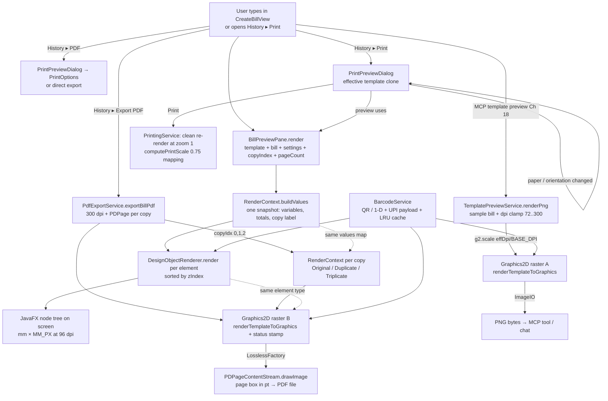

# Chapter 16 — Rendering & PDF Export: One Drawing Engine, Many Papers

> **Part 10 of InvoiceStudio: Zero to Finished Product**
> Files covered in full this chapter: `service/DesignObjectRenderer.java`,
> `service/RenderContext.java`, `service/PdfExportService.java`,
> `service/PdfTextDraw.java`, `service/TemplatePreviewService.java`,
> `service/BarcodeService.java`, `ui/PrintPreviewDialog.java`,
> `test/.../service/PageMarginTest.java`, `test/.../service/TemplatePreviewDpiTest.java`,
> `test/.../service/TemplateTableMinRowsTest.java`,
> `test/.../service/PrintServiceLogicTest.java`,
> `test/.../service/TemplateV3FeaturesTest.java` — all twelve read and
> reproduced from the repository.
> Goal at the end: **the same template renders identically to the screen, to a
> PNG preview, to a printed page and to a PDF — and the tests can prove the
> bottom of the page is never lost.**

---

## 1. Chapter goal

By the end of this chapter you will have built, exactly as the repository has it:

1. **RenderContext** — the value engine: a template full of `{{variables}}`
   plus a bill plus settings becomes one immutable map of resolved strings,
   shared by every renderer in the app.
2. **DesignObjectRenderer** — the JavaFX engine: each `TemplateElement` of
   Chapter 7 becomes a live scene-graph node (shapes, text, images, QR and
   barcodes, watermarks, icons) with effects, flips, clips and z-ordering.
3. **BarcodeService** — ZXing-powered Code-128 / EAN / ITF / UPC / QR
   generation with an LRU cache and the `upi://pay?` payload builder.
4. **PdfExportService** — the PDFBox pipeline: mm coordinates → 300-dpi
   raster page → exact-size PDF page, with copies ("Original for Recipient"…),
   auto-height thermal rolls, monochrome mode, the PAID/CANCELLED stamp, and
   the full item-table renderer with `minRows` void filling.
5. **PdfTextDraw** — the low-level text primitives (cell text, wrapped text,
   the status stamp) extracted so tests and the renderer share one truth.
6. **TemplatePreviewService** — the headless PNG previewer that reuses the
   *exact* PDF engine (what the AI sees is what the printer gets) and the
   DPI-scaling fix it pins.
7. **PrintPreviewDialog** — the app-styled print window whose chosen paper,
   orientation and copies fully determine the output — the printer driver
   can never shrink your A4 bill to a postcard.

And you will understand the chapter's one big architectural bet: **two
drawing engines (JavaFX scene graph, Java2D `Graphics2D`), one data model and
one value engine** — so screen preview, PNG preview, print and PDF can never
quietly disagree.

---

## 2. Story intro

Think of the last wedding invitation you saw. Someone designs it once — on a
computer, at some comfortable size — and then it exists as: a card stock
print, a WhatsApp image, a framed keepsake, maybe a small pocket version.
Nobody redraws the invitation for each surface. One *design*; many *papers*.

An invoice lives the same life. Kumar designs his bill in the Template
Designer (Chapter 15). Then the same design must appear:

- on the screen, next to the billing form, re-rendered as he types
  (`BillPreviewPane`, Chapter 12);
- as a PNG thumbnail, rendered on demand by the AI assistant's template
  tools (Chapter 18);
- on paper, through the operating system's printer; and
- as a PDF file, sent over WhatsApp to a buyer at 11 p.m.

The naive solution is four renderers. The professional solution — the one in
this repository — is **one coordinate system, one variable engine, one image
supplier for codes, and two thin "brushes"**: a JavaFX brush for anything
that lives on screen, and a Java2D brush for anything that becomes pixels on
paper. The PDF file itself is produced by PDFBox, whose job is reduced to
"wrap this exact-size page image in a page and save it."

> **Analogy:** a plotter driver and a screen driver both speak to the same
> CAD file. The *file* is the truth; the *drivers* are dialects.
> `RenderContext` + `TemplateElement` are the file. `DesignObjectRenderer`
> and `PdfExportService` are the two dialects. This chapter builds both
> dialects and the shared vocabulary underneath them.

The stakes are higher than they look. If the screen preview and the printed
page disagree, the user finds out *after* printing 200 copies. If the PDF and
the print disagree, the buyer's copy differs from the filed copy. The whole
chapter is organized to make disagreement impossible by construction — and
then, because trust needs evidence, the last step pins the pipeline with
tests that literally read pixels.

---

## 3. Concepts first

**Coordinate systems — the chapter's central puzzle.** The same rectangle is
stored, displayed, and printed in four units:

| Unit | Where | Value for 1 mm | Used by |
|---|---|---|---|
| Millimeters | the model (`TemplateElement.getX()`…) | 1 | everything stores mm |
| Screen px | JavaFX scene graph | `MM_PX = 3.7795…` (96 dpi) | `DesignObjectRenderer` |
| Raster px | PDF page image | `PX_PER_MM = 300/25.4 ≈ 11.811` | `PdfExportService` |
| Points | the PDF page box | `MM_TO_PT = 72/25.4 ≈ 2.8346` | the final PDF |

A **point (pt)** is the PDF's native unit: 1/72 of an inch, inherited from
typography. JavaFX screens run at a nominal 96 dpi, so screen pixels and
printer points differ by exactly `72/96 = 0.75` — a constant the codebase
tests explicitly (`TemplateV3FeaturesTest.testPrintingCoordinateScalingFactor`,
quoted in Step 10). Every renderer in this chapter is a *multiplication table*
between these units; the model never stores any unit but mm.

**Graphics contexts.** A *graphics context* is the object you draw *with*.
JavaFX uses a **retained-mode** scene graph: you build `Node` objects, hand
them to the scene, and the toolkit decides when and how to paint them — you
can re-render every frame for free, animate, hit-test clicks. Java2D
(`Graphics2D`) is **immediate-mode**: a `drawLine` call paints *now*, onto a
bitmap, and remembers nothing. The PDF pipeline needs a finished bitmap, so
it uses `Graphics2D` onto a `BufferedImage`; the screen preview needs
liveness and event handling, so it builds nodes. Same element, two idioms —
that is why this chapter has two engines and why both must be edited together
(Section 7 makes that checklist explicit).

**Painter's algorithm.** With immediate mode there is no z-axis: whoever
draws last covers whoever drew first. The classic solution is the painter's
algorithm — sort shapes back-to-front and draw in that order. Both engines
sort elements by `zIndex` before painting, so a gold band with `zIndex: 5`
sits *under* the text with `zIndex: 9` on every surface.

**PDF internals, briefly.** A PDF file is a tree of objects: a catalog, a
page tree, and for each page a *content stream* of drawing operators in
points, plus resources (fonts, images). PDFBox models this as `PDDocument`
→ `PDPage` (sized by a `PDRectangle`) → `PDPageContentStream`. This
application draws each page's *content* as a single pre-rendered image:

- render the template into a `BufferedImage` at 300 dpi (Java2D — all the
  power of `Graphics2D`, gradients, transforms, images);
- `LosslessFactory.createFromImage(doc, bi)` wraps the bitmap as a
  lossless (PNG-style) image XObject;
- a one-op content stream draws that image stretched over the page box.

The trade-offs (no selectable text, larger files, pixel-perfect fidelity) are
analyzed in Section 8, and the native-text alternative is sketched as an
OPTIONAL IMPROVEMENT.

**1-pass vs 2-pass layout.** A fixed A4 template is a 1-pass render: sort,
draw. A thermal roll receipt is not — the page *grows with its items*. The
pipeline therefore runs a **planning pass** first:
`calculateEffectiveHeight` finds the TABLE element, computes the height the
item rows will need, and derives the *shift* every element below the table
must move down by; then the **drawing pass** applies `y += shift` to those
elements as it paints. Plan, then paint — the same two phases a browser's
layout engine runs before painting a page.

**Abstraction over destinations.** Chapter 12 met `RenderContext` as "the
`{{variable}}` engine." Here we see its full role: it is the *contract*
between data and pixels. Both engines receive a `RenderContext` and ask it
only questions like `resolveText("{{buyer_name}}")`, `isTextBlank(el)`,
`getQrPayload(el)`. Neither engine ever reads the bill directly for text —
so the *same* resolution rules (blank handling, sample values for the
designer, UPI payloads) hold on screen and on paper.

**Immutability and defensive copies.** A `RenderContext` is built once per
page/copy and its `values` map never changes again — one snapshot of the
document, shared read-only. When the **monochrome print** setting needs to
recolor an element, the code does *not* mutate the template every viewer
shares: `renderSingleElement` calls `el.copy()` (Chapter 7's field-by-field
clone) and edits the copy. Shared model, private edits.

**ZXing and the BitMatrix.** ZXing ("Zebra Crossing") is Google's barcode
library. Its `encode(...)` returns a `BitMatrix` — a boolean grid of modules.
`MatrixToImageWriter` turns the grid into a `BufferedImage`. QR codes carry
*structured payloads* (here: the `upi://pay?` URL scheme that Indian payment
apps scan); 1-D barcodes carry short opaque strings. Error-correction level
M lets a QR survive ~15% damage (a crease, a glare) and still scan.

**LRU cache.** `BarcodeService` caches generated `Image`s in a
`LinkedHashMap` constructed with *access order* and an overridden
`removeEldestEntry` — the three-line idiom for a least-recently-used cache:
every `get` re-orders the map, and once it exceeds 150 entries the eldest is
evicted. Barcode rendering is CPU work per pixel; the cache makes re-renders
of an unchanged preview free.

**Font metrics.** Text on a canvas is positioned by *metrics*, not vibes:
`FontMetrics.getAscent()` is the height above the baseline, `getHeight()` is
ascent + descent, `stringWidth(...)` measures a string in the current font.
`PdfTextDraw.drawCellText` vertically centers text with
`(h − fm.getHeight())/2 + fm.getAscent()` — the formula to internalize; you
will see it twice more in this codebase.

---

## 4. Files in this chapter

| # | File | Lines | Role |
|---|---|---|---|
| 1 | `service/RenderContext.java` | 188 | `{{variable}}` engine; the data→pixels contract |
| 2 | `service/DesignObjectRenderer.java` | 737 | TemplateElement → JavaFX node (screen engine) |
| 3 | `service/BarcodeService.java` | 224 | ZXing QR/1-D codes, UPI payload, LRU caches |
| 4 | `service/PdfTextDraw.java` | 141 | Cell text, wrapped text, PAID/CANCELLED stamp |
| 5 | `service/PdfExportService.java` | 1,311 | PDFBox pipeline + the Graphics2D element engine |
| 6 | `service/TemplatePreviewService.java` | 152 | Headless PNG preview at any dpi (reuses PDF engine) |
| 7 | `ui/PrintPreviewDialog.java` | 447 | App-styled print window: preview + options → PrintOptions |
| 8 | `test/.../PageMarginTest.java` | 78 | Margin defaults + a real PDF export smoke test |
| 9 | `test/.../TemplatePreviewDpiTest.java` | 95 | Pins the preview DPI scaling fix (pixel probes) |
| 10 | `test/.../TemplateTableMinRowsTest.java` | 118 | Pins `minRows` void-filling (pixel probes) |
| 11 | `test/.../PrintServiceLogicTest.java` | 145 | Print scale math, paper resolution, clone isolation |
| 12 | `test/.../TemplateV3FeaturesTest.java` | 189 | Borders model round-trip + PDF smoke + 0.75 scale |

Depends on: `TemplateElement` / `Template` / `PageConfig` / `ElementType`
(Ch 7), `Bill` / `BillTotals` / `BillPayment` / `BillStatus` (Ch 6),
`Settings` / `BusinessProfile` (Ch 6), `BillingService` (Ch 12: totals,
`amountInWords`, `todayISO`, `exportBatchPdf`), `PresetTemplates` (Ch 7),
`SvgVectorParser` (Ch 15), `AppLog` (Ch 2), `UiTheme` / `DialogHelper`
(Ch 9), `PrintingService` (Ch 12 print path), `BillPreviewPane` (Ch 12).

Used by: `BillPreviewPane` and `CreateBillView` (Ch 12 screen preview),
`HistoryView` (PDF export + print, Ch 12), `BillingService.exportBatchPdf`
(bulk PDF), `McpToolRegistry` (Ch 18: the template preview tool calls
`TemplatePreviewService.renderPng`), the Template Designer (Ch 15), and
Chapter 17's label pipeline, which reuses the barcode plumbing.

---

## 5. Step-by-step build

We build in dependency order: the value engine first (both brushes need it),
then the shared barcode supplier, then the two brushes (JavaFX engine, then
the PDF pipeline in three passes), then the headless preview that reuses the
PDF brush, then the print window, and finally the five test suites that pin
everything down.

### Step 1 — `service/RenderContext.java` (the value engine and the contract)

One class, three jobs: freeze a document snapshot into a variable map,
substitute `{{variables}}`, and answer the two "special content" questions
(QR payload, barcode payload).

```java
public class RenderContext {
    private final Map<String, String> values = new HashMap<>();
    private final Bill bill;
    private final Settings settings;
    private final int pageNo;
    private final int pageCount;
    private final String copyLabel;

    private static final String[] COPY_LABELS = {
        "Original for Recipient",
        "Duplicate for Transporter",
        "Triplicate for Supplier"
    };

    private static final Pattern VAR_PATTERN = Pattern.compile("\\{\\{\\s*([a-zA-Z0-9_]+)\\s*\\}\\}");

    public RenderContext(Bill bill, Settings settings, int copyIndex, int pageNo, int pageCount) {
        this.bill = bill;
        this.settings = settings != null ? settings : new Settings();
        this.pageNo = pageNo;
        this.pageCount = pageCount;
        this.copyLabel = COPY_LABELS[Math.abs(copyIndex) % COPY_LABELS.length];
        buildValues();
    }
```

Five things to learn before the code even starts filling the map:

- The `values` map is `final` and filled exactly once, in the constructor.
  A render is a *snapshot*: if the bill changes mid-render (it cannot — but
  if a future refactor made that possible), every element of one page still
  saw one consistent world.
- `COPY_LABELS` — Indian tax invoices circulate in three simultaneous copies,
  each legally distinct. `copyIndex % length` cycles them; `Math.abs`
  guards a negative index; copy 4 politely reads "Original for Recipient"
  again.
- `VAR_PATTERN` allows optional whitespace inside the braces (`{{ buyer_name
  }}` works), but only `[a-zA-Z0-9_]` in the key — a typo like
  `{{buyer-name}}` can never resolve, by design (and Section 9 shows what
  the user sees when that happens).
- `settings != null ? settings : new Settings()` — a *null object* fallback:
  a missing settings sheet behaves as an empty business profile instead of a
  `NullPointerException` in a print run.
- `pageNo`/`pageCount` are part of the contract because the screen preview
  can *show* `Page 1 of 1` placeholders — the PDF pipeline (Step 5) always
  passes `1, 1`, one page per copy.

```java
    private void buildValues() {
        BusinessProfile b = settings.getBusiness();
        values.put("invoice_no", bill != null ? bill.getBillNo() : "INV-0001");
        values.put("invoice_date", bill != null ? bill.getDate() : BillingService.todayISO());
        values.put("business_name", b.getName());
        ...
        values.put("page_no", String.valueOf(pageNo));
        values.put("page_count", String.valueOf(pageCount));
        values.put("copy_label", copyLabel);
        values.put("doc_type", bill != null && bill.getDocType() != null ? bill.getDocType().getTitle() : "TAX INVOICE");
```

The built-ins. Every key the preset templates use is minted here — business
identity, bank details (`bank_name`, `bank_account`, `bank_ifsc`,
`bank_upi`), then page furniture. Two deliberate asymmetries, kept faithful:

> **NOTE (kept faithful):** `grand_total`, `paid_amount` and `due_amount`
> are formatted `"%s%.2f"` with the currency symbol *baked into the string*,
> while `subtotal`, `cgst`, `sgst`, `igst`, `taxable` and `round_off` are
> bare `%.2f` numbers. Templates therefore write "₹" themselves for the
> small totals but must *not* for `{{grand_total}}`. It works because both
> sides of the convention live in the same preset templates — but a custom
> template that assumes the opposite gets "₹₹1,234.00"-style surprises only
> in the totals row.

```java
        // Buyer & variable values
        if (bill != null && bill.getVariables() != null) {
            for (Map.Entry<String, String> e : bill.getVariables().entrySet()) {
                if (e.getValue() != null && !e.getValue().isBlank()) {
                    values.put(e.getKey(), e.getValue());
                }
            }
        }
```

The bill's *own* variables (buyer name, PO number, transport details — the
per-template custom fields from Chapter 12) are merged on top. Blank values
are skipped, which matters twice: it keeps `{{po_no}}` from printing the
string "null", and it lets the sample-value pass below fill the gaps.

```java
        if (bill == null) {
            // Sample values for Template Designer preview
            values.putIfAbsent("buyer_name", "Acme Enterprises Ltd");
            ...
            values.putIfAbsent("e_way_bill", "241019283746");
            values.putIfAbsent("due_date", BillingService.todayISO());
        }
```

The **designer mode**. With no bill at all, the context fills buyer, vehicle
and e-way-bill fields with believable sample data — so a template being
designed in Chapter 15 previews as a *real-looking invoice*, not a wall of
`{{buyer_name}}`. `putIfAbsent` (not `put`) means a real bill variable
already present always wins.

```java
    public String resolveText(String raw) {
        if (raw == null) return "";
        Matcher m = VAR_PATTERN.matcher(raw);
        StringBuilder sb = new StringBuilder();
        while (m.find()) {
            String key = m.group(1);
            String replacement = values.get(key);
            if (replacement == null) {
                replacement = bill == null ? "{{" + key + "}}" : "";
            }
            m.appendReplacement(sb, Matcher.quoteReplacement(replacement));
        }
        m.appendTail(sb);
        return sb.toString();
    }
```

The substitution loop, and its most subtle decision: an *unknown* variable
stays visible (`{{typo_key}}`) when there is no bill — the designer shows the
author their mistake — but becomes an empty string once a real bill is
rendering (a paper document must never ship a template bug). Also note
`Matcher.quoteReplacement`: a resolved value containing a literal `$` or
`\` (a bank reference, an address) must be inserted *literally*, and without
quoting, `appendReplacement` would treat those as regex group references.

```java
    public boolean isTextBlank(TemplateElement el) {
        if (el.getText() == null) return true;
        String raw = el.getText();
        Matcher m = VAR_PATTERN.matcher(raw);
        boolean hasVars = false;
        boolean allBlank = true;
        while (m.find()) {
            hasVars = true;
            String key = m.group(1);
            String val = values.getOrDefault(key, "").trim();
            if (!val.isEmpty() && !val.equals("0") && !val.equals("0.00") && !val.equals("₹0.00") && !val.equals("₹0")) {
                allBlank = false;
            }
        }
        if (!hasVars) {
            return raw.trim().isEmpty();
        }
        return allBlank;
    }
```

`isTextBlank` powers the template's *hide-when-blank* property (Step 5 uses
it to skip elements entirely). The definition is "every variable in this
text resolves to empty, 0, 0.00, ₹0.00 or ₹0" — so a totals block whose GST
is 0 vanishes on paper, while `Subtotal: {{subtotal}}` with a real subtotal
stays. Literal-only text is blank exactly when it trims empty.

```java
    public String getQrPayload(TemplateElement el) {
        String src = el.getQrSource();
        if ("custom".equalsIgnoreCase(src)) {
            String c = resolveText(el.getQrCustom());
            return !c.isBlank() ? c : "InvoiceStudio";
        }
        String upi = settings.getBusiness().getUpi();
        String name = settings.getBusiness().getName();
        double amt = 0;
        if ("upi_amount".equalsIgnoreCase(el.getQrSource() != null ? el.getQrSource() : "")) {
            if (bill != null && bill.getTotals() != null) {
                amt = bill.getTotals().getGrandTotal();
            }
        }
        return BarcodeService.buildUpiPayload(upi, name, amt, bill != null ? bill.getBillNo() : "");
    }

    public String getBarcodePayload(TemplateElement el) {
        String data = el.getBarcodeData();
        if (data == null || data.isBlank()) data = "{{invoice_no}}";
        return resolveText(data);
    }
```

The two content questions. A QR element either carries custom text
(variables allowed, resolved here) or is a *payment QR*: the business's UPI
ID + name + (optionally, for `upi_amount`) the grand total, handed to
`BarcodeService.buildUpiPayload` (Step 3). A barcode element's data is
itself a `{{variable}}` template — defaulting to the invoice number — so
`{{invoice_no}}` resolves per document. Both engines call exactly these
methods; there is no second payload-building code path to drift.

> **NOTE (kept faithful):** the middle branch re-reads `el.getQrSource()`
> through a defensive ternary instead of reusing the local `src` captured at
> the top — behaviorally identical, just twice the lookups.

### Step 2 — `service/DesignObjectRenderer.java` (the screen engine)

Seven hundred thirty-seven lines, one public dispatcher and one shared
finisher. The class is pure static functions: it *builds nodes*, it never
keeps state — thread-safe by construction, and safe to call from the
designer, the preview pane, or a test.

```java
public class DesignObjectRenderer {

    public static final double MM_PX = 3.7795275591; // 96 DPI screen pixels per mm

    public static Node render(TemplateElement el, RenderContext ctx, double w, double h) {
        if (el == null) return new Pane();

        Node node = switch (el.getType()) {
            case RECT -> renderRectangle(el, w, h);
            case CIRCLE -> renderCircle(el, w, h);
            case ELLIPSE -> renderEllipse(el, w, h);
            case LINE -> renderLine(el, w, h);
            case POLYLINE -> renderPolyline(el, w, h);
            case POLYGON -> renderPolygon(el, w, h);
            case ARC -> renderArc(el, w, h);
            case PATH, SVG -> renderPath(el, w, h);
            case STAR -> renderStar(el, w, h);
            case ARROW -> renderArrow(el, w, h);
            case DIVIDER -> renderDivider(el, w, h);
            case FREEHAND -> renderFreehand(el, w, h);
            case WATERMARK -> renderWatermark(el, ctx, w, h);
            case TEXT, PAGENO -> renderText(el, ctx, w, h);
            case IMAGE -> renderImage(el, ctx, w, h);
            case QRCODE -> renderQrCode(el, ctx, w, h);
            case BARCODE -> renderBarcode(el, ctx, w, h);
            case ICON -> renderIcon(el, w, h);
            default -> renderRectangle(el, w, h);
        };

        if (node != null) {
            applyEffectsAndTransforms(node, el, w, h);
        }
        return node != null ? node : new Pane();
    }
```

The dispatcher. Every one of the `ElementType` values from Chapter 7 gets a
factory; note the two aliases — `PATH, SVG` share a renderer, and
`TEXT, PAGENO` share one because a page number is just text whose content is
`{{page_no}}`. `w` and `h` arrive *already multiplied to pixels* by the
caller (the preview pane multiplies by `MM_PX`; the geometry lives in the
caller because only the caller knows the zoom). Every node then passes
through `applyEffectsAndTransforms` so shadow/blur/opacity/rotation/flip/
clip behave identically for all nineteen types — the "finisher" pattern:
per-type factory, universal post-processing.

**Shapes and the individual-borders branch.** The rectangle is the deepest
shape because invoices are mostly rectangles with per-side rules:

```java
    private static Node renderRectangle(TemplateElement el, double w, double h) {
        if (el.isIndividualBorders()) {
            Region reg = new Region();
            ...
            String topS = el.getEffectiveSideStyle("top");
            ...
            reg.setStyle(String.format(java.util.Locale.US,
                    "-fx-background-color: %s; -fx-background-radius: %.1f; "
                    + "-fx-border-width: %.2f %.2f %.2f %.2f; "
                    + "-fx-border-color: %s %s %s %s; "
                    + "-fx-border-style: %s %s %s %s; "
                    + "-fx-border-radius: %.1f;",
                    bg, r, topW, rightW, bottomW, leftW,
                    topC, rightC, bottomC, leftC,
                    topS, rightS, bottomS, leftS, r));
            return reg;
        } else {
            Rectangle r = new Rectangle(w, h);
            r.setFill(buildPaint(el, w, h));
            applyStroke(r, el);

            double cornerR = el.getBorderRadius() > 0 ? el.getBorderRadius() * MM_PX : 0;
            if (cornerR > 0) {
                r.setArcWidth(cornerR * 2);
                r.setArcHeight(cornerR * 2);
            }
            return r;
        }
    }
```

With *individual borders* enabled (the Chapter 7 v3 model: per-side width,
color, style, active flag), the renderer stops using an `Rectangle` shape
and builds a styled `Region` instead — because JavaFX CSS can express
"2px dashed green top, 0.5px dotted red bottom" on a region in one style
string, and hand-building four `Line`s would fight the background and the
rounded corners. `getEffectiveSideWidth/Color/Style` (Ch 7) fall back to the
base border when a side isn't individually set — the same fallback the
JSON round-trip test pins. Note `Locale.US` in the `String.format`: in some
locales a formatted `%.2f` prints `0,50` with a comma, and CSS `0,50` is
garbage — every style string in this file formats through `Locale.US`.

**Text.** The workhorse — variables, typography, alignment, and the one
special case:

```java
    private static Node renderText(TemplateElement el, RenderContext ctx, double w, double h) {
        String raw = el.getText() != null ? el.getText() : "";
        String resolved = ctx != null ? ctx.resolveText(raw) : raw;
        resolved = applyTextTransform(resolved, el.getTextTransform(), el.isUppercase());

        String tracked = applyTypographyTracking(resolved, el.getLetterSpacing(), el.getWordSpacing());
        Label lbl = new Label(tracked);
        lbl.setPrefSize(w, h);
        lbl.setMinSize(w, h);
        lbl.setWrapText(true);

        double fontSizePx = el.getFontSize() * 1.333;
        double lhMult = el.getLineHeight() > 0 ? el.getLineHeight() : 1.25;
        // JavaFX default line spacing is 0 (which corresponds to ~1.20x native font leading).
        // Extra spacing in px: (lhMult - 1.20) * fontSizePx + (el.getLineSpacing() * 1.333)
        double effectiveLineSpacing = (lhMult - 1.20) * fontSizePx + (el.getLineSpacing() * 1.333);
        lbl.setLineSpacing(Math.max(-fontSizePx * 0.4, effectiveLineSpacing));
```

Three typographic ideas in seven lines. First, `fontSize * 1.333` converts
the CSS-style pt size the designer stores into screen px (96/72 = 1.333… —
the reciprocal of the print scale factor from the concepts table). Second,
JavaFX's `lineSpacing` is *extra* pixels beyond the font's native leading
(~1.20×), so the CSS-style multiplier is translated:
`(mult − 1.20) × fontSizePx + extra pt`, clamped so a wild multiplier can
not collapse lines into each other (the `Math.max(-fontSizePx * 0.4, …)`
floor). Third, transform before tracking: uppercasing first means the
letter-spacing sees the final characters.

Letter spacing deserves its own look because JavaFX has no CSS letter
spacing that works reliably on `Label` — so the renderer *splices real
Unicode space characters* into the string:

```java
    public static String applyTypographyTracking(String text, double letterSpacing, double wordSpacing) {
        if (text == null || text.isEmpty()) return "";
        if (letterSpacing <= 0.05 && wordSpacing <= 0.05) return text;

        String letterSpacer = "";
        if (letterSpacing >= 16.0) {
            letterSpacer = "\u2003"; // Em space
        } else if (letterSpacing >= 10.0) {
            letterSpacer = "\u2002"; // En space
        } else if (letterSpacing >= 6.0) {
            letterSpacer = "\u2004"; // 1/3 em
        } else if (letterSpacing >= 3.5) {
            letterSpacer = "\u2005"; // 1/4 em
        } else if (letterSpacing >= 1.8) {
            letterSpacer = "\u2009"; // Thin space
        } else if (letterSpacing >= 0.4) {
            letterSpacer = "\u200A"; // Hair space
        }
```

A ladder of Unicode spaces — hair, thin, quarter-em, third-em, en, em —
chosen by requested width. Below the ladder, no splicing at all (a zero
spacer must not appear in copied text). The splicing loop (just below this
excerpt) walks each line, inserting the spacer between characters and the
word spacer after spaces — never after a line's last character, and never
inside a run of spaces. It is `public static` because the PDF engine
(Step 6) applies the *same transform to the same resolved string* before
drawing — one typography rule, two brushes.

The rest of `renderText` builds the inline style (color, family, weight —
with the legacy `isBold()` folded into a numeric weight so old templates
keep rendering — italic, background, border), maps `align`/`vAlign` onto
JavaFX's nine `Pos` values, and handles strikethrough specially:

```java
        if (el.isStrikethrough()) {
            StackPane sp = new StackPane();
            ...
            Line strikeLine = new Line(0, 0, Math.max(10, w - 8), 0);
            strikeLine.setStroke(parseColorSafe(colorHex, Color.BLACK));
            strikeLine.setStrokeWidth(Math.max(1.0, el.getFontSize() * 0.08));
            sp.getChildren().addAll(lbl, strikeLine);
            StackPane.setAlignment(strikeLine, Pos.CENTER);
            return sp;
        }
```

A real line through the middle — because a font's built-in strikethrough
sits high and thin at invoice sizes, and "CANCELLED" over the totals must
read across the room. The line thickness scales with the font size (8% of
the point size), so 8 pt body text and 36 pt headings get proportionate
strikes.

**Gradients — `buildPaint`.** Both fill styles the designer offers:

```java
    private static Paint buildPaint(TemplateElement el, double w, double h) {
        String type = el.getFillType().toLowerCase();
        if ("none".equals(type) || "transparent".equals(type)) {
            return Color.TRANSPARENT;
        }
        if ("linear".equals(type)) {
            Color start = parseColorSafe(el.getGradientStartColor(), Color.web("#4f46e5"));
            Color end = parseColorSafe(el.getGradientEndColor(), Color.web("#06b6d4"));
            double rad = Math.toRadians(el.getGradientAngle());
            double sx = 0.5 - 0.5 * Math.cos(rad);
            double sy = 0.5 - 0.5 * Math.sin(rad);
            double ex = 0.5 + 0.5 * Math.cos(rad);
            double ey = 0.5 + 0.5 * Math.sin(rad);
            return new LinearGradient(sx, sy, ex, ey, true, CycleMethod.NO_CYCLE,
                    new Stop(0, start), new Stop(1, end));
        }
        if ("radial".equals(type)) {
            ...
            return new RadialGradient(0, 0, 0.5, 0.5, 0.5, true, CycleMethod.NO_CYCLE,
                    new Stop(0, start), new Stop(1, end));
        }
        String bg = el.getBg();
        if (bg != null && !bg.isBlank() && !"transparent".equalsIgnoreCase(bg)) {
            return parseColorSafe(bg, Color.TRANSPARENT);
        }
        return Color.TRANSPARENT;
    }
```

The linear gradient's direction math: a center-relative unit vector from
the angle, so `0°` fades left→right, `90°` top→bottom. Proportional
coordinates (`proportional = true`) mean the gradient survives resizing —
no pixel math to redo. Keep this method's *shape* in mind: `"none" →
"linear" → "radial" → solid bg → transparent`. The PDF brush (Step 6)
implements the same idea with one branch fewer — flagged there.

**Images and codes.** `renderImage` decodes the element's `src` through
`decodeFxImage` (below) or, when `useBusinessLogo` is set, pulls the
business profile's stored logo; a missing image falls back to a bundled
icon rather than a blank hole. The two code elements are thin clients of
Step 3:

```java
    private static Node renderQrCode(TemplateElement el, RenderContext ctx, double w, double h) {
        String payload = ctx != null ? ctx.getQrPayload(el) : "InvoiceStudio-QR";
        int size = (int) Math.min(w, h);
        Image qrImg = BarcodeService.generateQrFxImage(payload, Math.max(20, size * 2));
        ImageView iv = new ImageView(qrImg);
        iv.setFitWidth(size);
        iv.setFitHeight(size);
        iv.setPreserveRatio(true);
        StackPane sp = new StackPane(iv);
        sp.setPrefSize(w, h);
        sp.setAlignment(Pos.CENTER);
        return sp;
    }
```

> **NOTE (kept faithful):** the QR is generated at **double** the display
> size (`size * 2`) and then fitted down — deliberate supersampling so the
> modules stay crisp when the preview zooms, at the cost of a larger cached
> image. The PDF engine does the same trick with its own supplier.

**The finisher.** Every node ends here — one place where effects, opacity,
rotation, flips and clipping are universal:

```java
    public static void applyEffectsAndTransforms(Node node, TemplateElement el, double w, double h) {
        if (node == null || el == null) return;

        if (el.isShadowEnabled()) {
            DropShadow ds = new DropShadow();
            ds.setBlurType(BlurType.GAUSSIAN);
            ds.setColor(parseColorSafe(el.getShadowColor(), Color.BLACK).deriveColor(0, 1, 1, el.getShadowOpacity()));
            ds.setRadius(el.getShadowBlur());
            ds.setOffsetX(el.getShadowOffsetX());
            ds.setOffsetY(el.getShadowOffsetY());
            node.setEffect(ds);
        } else if (el.isBlurEnabled()) {
            node.setEffect(new GaussianBlur(el.getBlurRadius()));
        }

        if (el.getOpacity() < 1.0 && el.getOpacity() >= 0.0) {
            node.setOpacity(el.getOpacity());
        }

        if (el.getRotation() != 0) {
            node.setRotate(el.getRotation());
        }

        if (el.isFlipHorizontal()) {
            node.setScaleX(-el.getScaleX());
        } else if (el.getScaleX() != 1.0) {
            node.setScaleX(el.getScaleX());
        }
        ...
```

Two details worth internalizing. A flip *is* a scale of −1 — so the code
composes the user's scale with the flip sign instead of needing a separate
transform slot. And `deriveColor(0, 1, 1, opacity)` changes only the alpha
channel of the shadow color — hue/saturation/brightness untouched — letting
one color field carry both the tint and the strength of the shadow. The
clip branch (below the excerpt) builds a `Circle`, `Rectangle` or rounded
`Rectangle` in the element's *own* coordinate space and `setClip`s it — the
same three shapes the PDF engine clips with in Step 6.

**The survivors' corner.** `parsePoints` accepts the designer's
comma/space-separated coordinate lists, scales them by `MM_PX`, and — if
the string is empty or too short to draw — substitutes a default triangle
so a half-typed polygon still shows *something* editable instead of
nothing. `parseColorSafe` wraps `Color.web` in a try/catch with a fallback:
a template with a typo'd color (`#g0ld`) renders in the fallback color
rather than crashing a 500-invoice batch. `decodeFxImage` accepts three
`src` shapes — `data:image` URLs (Base64 after the first comma, the format
the designer's uploads use), `file:`/`http(s):` URLs, and bare Base64 —
and returns `null` (never throws) on anything else.

### Step 3 — `service/BarcodeService.java` (one image supplier, two engines)

Every QR and barcode on screen *and* on paper comes from this one class.
Two API pairs exist because the two engines need different image types:
`BufferedImage` (Java2D, for the PDF raster) and `javafx.scene.image.Image`
(for the scene graph) — with `SwingFXUtils.toFXImage` bridging them.

```java
public class BarcodeService {

    /** Symbology list shown in the designer combo. */
    public static final String[] FORMATS = {
            "CODE_128", "EAN_13", "EAN_8", "CODE_39", "ITF", "UPC_A", "QR_CODE"
    };

    private static final int MAX_CACHE_SIZE = 150;

    private static final Map<String, Image> QR_FX_CACHE = new LinkedHashMap<>(MAX_CACHE_SIZE, 0.75f, true) {
        @Override
        protected boolean removeEldestEntry(Map.Entry<String, Image> eldest) {
            return size() > MAX_CACHE_SIZE;
        }
    };
```

The LRU cache from the concepts section, in the flesh: `true` as the third
`LinkedHashMap` constructor argument switches the map into *access order*
mode (gets count as uses), and `removeEldestEntry` evicts once the map
holds more than 150 images. The cache is guarded with `synchronized`
blocks on every access — the preview can re-render on a background thread
while the UI thread paints.

```java
    public static BufferedImage generateQrBufferedImage(String payload, int size) {
        if (payload == null || payload.isBlank()) payload = "InvoiceStudio";
        try {
            QRCodeWriter qrCodeWriter = new QRCodeWriter();
            Map<EncodeHintType, Object> hints = new HashMap<>();
            hints.put(EncodeHintType.ERROR_CORRECTION, ErrorCorrectionLevel.M);
            hints.put(EncodeHintType.MARGIN, 1);
            hints.put(EncodeHintType.CHARACTER_SET, "UTF-8");

            BitMatrix bitMatrix = qrCodeWriter.encode(payload, BarcodeFormat.QR_CODE, size, size, hints);
            return MatrixToImageWriter.toBufferedImage(bitMatrix);
        } catch (Exception e) {
            com.invoicestudio.service.AppLog.error(e);
            return createFallbackImage(size, size, "QR Error");
        }
    }
```

QR generation, with the three hints that matter in practice: **error
correction M** (≈15% of the codewords are recoverable — a creased receipt
still scans), **margin 1** module of quiet zone (scanners need white space
around the code), **UTF-8** (the buyer's name may be in any script). The
catch is not decorative: an over-long payload or an encoding failure must
degrade to a grey "QR Error" placeholder, never abort a render pass.

The 1-D side is the bigger story, because real symbologies have real
rules — and a mis-typed size code must never block a 500-label print run
(Chapter 17 depends on exactly that):

```java
    public static BufferedImage generateBarcodeBufferedImage(String payload, int width, int height,
                                                             boolean showText, String format) {
        String clean = (payload != null ? payload : "INV-0001").replaceAll("[^\\x20-\\x7e]", "").trim();
        if (clean.isBlank()) clean = "INV";
        String fmt = format != null ? format.trim().toUpperCase() : "CODE_128";
        try {
            BitMatrix bitMatrix;
            int barHeight = showText ? Math.max(10, height - 16) : height;
            switch (fmt) {
                case "EAN_13" -> {
                    String digits = clean.replaceAll("[^0-9]", "");
                    bitMatrix = digits.length() == 13
                            ? new EAN13Writer().encode(digits, BarcodeFormat.EAN_13, width, barHeight)
                            : new Code128Writer().encode(clean, BarcodeFormat.CODE_128, width, barHeight);
                }
                case "EAN_8" -> {
                    ...
                }
                case "UPC_A" -> {
                    ...
                }
                case "ITF" -> {
                    String digits = clean.replaceAll("[^0-9]", "");
                    if (digits.length() % 2 != 0) digits = digits + "0";
                    bitMatrix = digits.isEmpty()
                            ? new Code128Writer().encode(clean, BarcodeFormat.CODE_128, width, barHeight)
                            : new ITFWriter().encode(digits, BarcodeFormat.ITF, width, barHeight);
                }
                case "CODE_39" -> {
                    bitMatrix = new Code39Writer().encode(clean, BarcodeFormat.CODE_39, width, barHeight);
                }
                case "QR_CODE", "QRCODE", "QR" -> {
                    int side = Math.min(width, height);
                    bitMatrix = new QRCodeWriter().encode(clean, BarcodeFormat.QR_CODE, side, side,
                            Map.of(EncodeHintType.MARGIN, 1, EncodeHintType.CHARACTER_SET, "UTF-8"));
                }
                default -> {
                    bitMatrix = new Code128Writer().encode(clean, BarcodeFormat.CODE_128, width, barHeight);
                }
            }
```

Read the pattern: *sanitize* (strip everything outside printable ASCII),
*validate per symbology* (EAN-13 needs exactly 13 digits; UPC-A twelve;
EAN-8 eight; ITF wants an even digit count, so a single stray digit is
padded with a trailing zero rather than rejected), and *fall back to Code
128* on mismatch — Code 128 encodes arbitrary ASCII, so it is the universal
donor. The label under the bars (when `showText`) is composited by hand:
the bars are drawn onto a white canvas, then a `Monospaced` 11 pt string is
centered underneath — monospaced so the human-eye check against a packing
slip lines up.

And the UPI payload — the string that makes the QR a *payment* QR:

```java
    public static String buildUpiPayload(String upiId, String merchantName, double amount, String invoiceNo) {
        if (upiId == null || upiId.isBlank()) return "";
        try {
            StringBuilder sb = new StringBuilder("upi://pay?");
            sb.append("pa=").append(URLEncoder.encode(upiId.trim(), StandardCharsets.UTF_8));
            if (merchantName != null && !merchantName.isBlank()) {
                sb.append("&pn=").append(URLEncoder.encode(merchantName.trim(), StandardCharsets.UTF_8));
            }
            if (amount > 0) {
                sb.append(String.format(java.util.Locale.US, "&am=%.2f", amount));
            }
            sb.append("&cu=INR");
            if (invoiceNo != null && !invoiceNo.isBlank()) {
                sb.append("&tn=").append(URLEncoder.encode(invoiceNo.trim(), StandardCharsets.UTF_8));
            }
            return sb.toString();
        } catch (Exception e) {
            return "upi://pay?pa=" + upiId;
        }
    }
```

This is the `upi://pay` URL scheme every Indian payment app understands:
`pa` (payee address = UPI ID), `pn` (payee name), `am` (amount — only when
positive; a QR without an amount lets the buyer type it), `cu=INR`, `tn`
(transaction note = the invoice number, so the payment reconciles against
the bill). Every parameter is URL-encoded because names contain spaces and
ampersands — an unencoded `&` in "Sharma & Sons" would truncate the payload
mid-parameter and the buyer's app would show a blank payee. `Locale.US`
keeps the decimal point a dot in every locale.

### Step 4 — `service/PdfTextDraw.java` (the last mile of text)

A 141-line, package-private utility class extracted *verbatim* from
`PdfExportService` (its javadoc says so) so both the renderer and future
tests can reach text primitives without the 1,300-line class. Note the
duplicate constant and its honest comment:

```java
/**
 * Low-level text drawing and status-stamp rendering for PDF export
 * (skill rule 5.2 role 5: pure renderers). Extracted verbatim from
 * {@link PdfExportService}; behavior unchanged.
 */
final class PdfTextDraw {

    private PdfTextDraw() {}

    /** DPI shared with {@link PdfExportService} (kept identical by contract). */
    static final double DPI = 300.0;

    static void drawCellText(Graphics2D g2, String text, double x, double y, double w, double h, String align) {
        if (text == null || text.isBlank()) return;
        FontMetrics fm = g2.getFontMetrics();
        int strW = fm.stringWidth(text);
        int textY = (int) Math.round(y + ((h - fm.getHeight()) / 2.0) + fm.getAscent());
        ...
        g2.drawString(text, textX, textY);
    }
```

`drawCellText` is the table's unit of work: one string, one cell, one
alignment. The vertical centering is the FontMetrics formula from the
concepts section — center the full line box, then drop by the ascent
because `drawString`'s y is the *baseline*, not the top. Horizontal
alignment uses `stringWidth` (left / center / right arithmetic in the elided
middle).

```java
    static void drawWrappedText(Graphics2D g2, String text, double x, double y, double w, double h,
                                String align, String vAlign, double lineHeightMult, double lineSpacingPt, double wordSpacingPt) {
        if (text == null || text.isEmpty()) return;
        FontMetrics fm = g2.getFontMetrics();
        double multSpacing = fm.getHeight() * (lineHeightMult > 0 ? lineHeightMult : 1.25);
        double ptSpacingPx = lineSpacingPt * (DPI / 72.0);
        double lineSpacing = Math.max(fm.getHeight() * 0.75, multSpacing + ptSpacingPx);
        ...
        for (String raw : rawLines) {
            String[] words = raw.split(" ");
            StringBuilder sb = new StringBuilder();
            for (String word : words) {
                if (sb.length() == 0) {
                    sb.append(word);
                } else if (fm.stringWidth(sb + " " + word) + (wordSpacingPx > 0 ? wordSpacingPx : 0) <= w) {
                    sb.append(" ").append(word);
                } else {
                    lines.add(sb.toString());
                    sb = new StringBuilder(word);
                }
            }
            if (sb.length() > 0) lines.add(sb.toString());
        }
```

Greedy word wrap — the classic first-fit algorithm: keep appending words
while the measured line fits the box width; the first word that does not
fits starts a new line. (It is "greedy" because it never re-balances a
broken line; good enough for invoices, and exactly what every email client
did for twenty years.) The line-spacing floor `fm.getHeight() * 0.75`
guarantees a wild `lineHeight` can never make lines overlap. The elided
second half implements vertical alignment (middle/bottom shift the start
by the total text height) and, when `wordSpacingPt` is set, draws *word by
word* with the extra space added after each — the Java2D equivalent of the
Unicode-space trick from Step 2, used because a raster canvas has no
shaping engine to fool.

```java
    /** Big translucent PAID / CANCELLED stamp across the rendered page image. */
    static void renderStatusStamp(Graphics2D g2, BillStatus status, int imgW, int imgH) {
        boolean isPaid = (status == BillStatus.PAID);
        String label = isPaid ? "PAID" : "CANCELLED";
        Color stampColor = isPaid ? new Color(14, 122, 79, 70) : new Color(192, 38, 38, 70);

        AffineTransform orig = g2.getTransform();
        g2.translate(imgW / 2.0, imgH * 0.44);
        g2.rotate(Math.toRadians(-22));

        Font font = new Font("Arial", Font.BOLD, (int) (imgW * 0.09));
        ...
        g2.drawRoundRect(-boxW / 2, -boxH / 2, boxW, boxH, (int) (imgW * 0.015), (int) (imgW * 0.015));

        g2.drawString(label, -strW / 2, fm.getAscent() - boxH / 2 + padY);

        g2.setTransform(orig);
    }
```

The stamp: a 9%-of-page-width bold word in a translucent rounded box
(alpha 70 of 255 ≈ 27% opacity — readable, but the invoice underneath
stays legible), rotated −22° around a point 44% down the page, drawn in
*stamp-local* coordinates (the box is centered on the origin after the
translate+rotate), then the saved transform restored. The save/restore
pair (`AffineTransform orig = g2.getTransform()` … `setTransform(orig)`)
is the immediate-mode version of the try-with-resources discipline: every
method that bends the coordinate space must put it back.

### Step 5 — `service/PdfExportService.java`, part 1: the pipeline

The 1,311-line class in three passes. First the constants and the two
public entry points:

```java
public class PdfExportService {

    private static final double DPI = 300.0;
    private static final double PX_PER_MM = DPI / 25.4; // ~11.811 px/mm
    private static final double MM_TO_PT = 72.0 / 25.4; // ~2.8346 pt/mm

    public static void exportBillPdf(Bill bill, Template template, Settings settings, File dest, int copies) throws IOException {
        if (template == null) template = PresetTemplates.buildClassic();
        if (settings == null) settings = new Settings();
        int totalCopies = Math.max(1, copies);

        double widthMm = template.getPage() != null ? template.getPage().getWidth() : 210.0;
        double heightMm = template.getPage() != null ? template.getPage().getHeight() : 297.0;

        if (template.getPage() != null && template.getPage().isAutoHeight()) {
            int itemCount = bill != null && bill.getItems() != null ? bill.getItems().size() : 1;
            heightMm = calculateEffectiveHeight(template, itemCount);
        }

        float ptW = (float) (widthMm * MM_TO_PT);
        float ptH = (float) (heightMm * MM_TO_PT);

        int imgW = (int) Math.max(100, Math.round(widthMm * PX_PER_MM));
        int imgH = (int) Math.max(100, Math.round(heightMm * PX_PER_MM));

        try (PDDocument doc = new PDDocument()) {
            for (int copyIdx = 0; copyIdx < totalCopies; copyIdx++) {
                PDPage page = new PDPage(new PDRectangle(ptW, ptH));
                doc.addPage(page);

                BufferedImage bi = new BufferedImage(imgW, imgH, BufferedImage.TYPE_INT_RGB);
                Graphics2D g2 = bi.createGraphics();
                setupGraphicsHints(g2);

                // White background
                g2.setColor(Color.WHITE);
                g2.fillRect(0, 0, imgW, imgH);

                RenderContext ctx = new RenderContext(bill, settings, copyIdx, 1, 1);
                renderTemplateToGraphics(g2, template, bill, settings, ctx, imgW, imgH);

                g2.dispose();

                PDImageXObject pdImage = LosslessFactory.createFromImage(doc, bi);
                try (PDPageContentStream cs = new PDPageContentStream(doc, page, PDPageContentStream.AppendMode.OVERWRITE, true, true)) {
                    cs.drawImage(pdImage, 0, 0, ptW, ptH);
                }
            }

            if (dest.getParentFile() != null && !dest.getParentFile().exists()) {
                dest.getParentFile().mkdirs();
            }
            doc.save(dest);
        }
    }
```

This is the whole PDF architecture in one method — read it as five moves:

1. **Defaults and page math.** Null template → the classic preset; missing
   page config → A4. An auto-height (thermal roll) template gets its height
   *computed from the bill's item count* — the planning pass.
2. **Two sizes at once.** `ptW/ptH` is the PDF page box (points — what a
   PDF viewer reports as "210 × 297 mm"); `imgW/imgH` is the raster drawn
   at 300 dpi. The image is later stretched over the page box, and the
   *ratio* is exactly `PX_PER_MM / MM_TO_PT = DPI/72` — no distortion, the
   stretch is a pure unit change.
3. **Per copy, one page.** Copies are pages in one document (that is how
   triplicates print), and each page gets a *fresh* `RenderContext` with
   `copyIdx` — which is where "Original for Recipient / Duplicate for
   Transporter / Triplicate for Supplier" changes per page. Note the
   `1, 1` for pageNo/pageCount: one template page per copy.

   > **NOTE (kept faithful):** `pageNo`/`pageCount` are hard-coded to `1` —
   > a long bill is *one tall page* (or a print-driver scale-down), never a
   > numbered multi-page flow. The `{{page_no}}` variable is therefore only
   > meaningful on multi-copy or future multi-page exports. Section 8
   > sketches the real multi-page path.
4. **The raster.** `TYPE_INT_RGB` (opaque — the PDF page has no alpha), the
   white fill (an image with black background would print a black page),
   the quality hints (Step 5's `setupGraphicsHints`), the render, and
   `dispose()` to release native handles before the big object is encoded.
5. **Lossless wrapping.** `LosslessFactory` keeps text edge-crisp (a JPEG
   factory would ring artifacts around every glyph); `AppendMode.OVERWRITE`
   with the two `true` flags (compress, close-underlying) is the boilerplate
   PDFBox expects. Then `doc.save`.

`exportReceiptPdf` follows the same skeleton for a fixed A5 payment receipt
(148 × 210 mm) with a synthesized default payment when the caller passes
null — `receiptNo = "RCP-" + billNo` — and delegates the drawing to
`renderReceiptToGraphics` (covered in part 3). One entry point, one shape;
only the paper and the painter differ.

```java
    private static void setupGraphicsHints(Graphics2D g2) {
        g2.setRenderingHint(RenderingHints.KEY_ANTIALIASING, RenderingHints.VALUE_ANTIALIAS_ON);
        g2.setRenderingHint(RenderingHints.KEY_TEXT_ANTIALIASING, RenderingHints.VALUE_TEXT_ANTIALIAS_ON);
        g2.setRenderingHint(RenderingHints.KEY_RENDERING, RenderingHints.VALUE_RENDER_QUALITY);
        g2.setRenderingHint(RenderingHints.KEY_INTERPOLATION, RenderingHints.VALUE_INTERPOLATION_BICUBIC);
        g2.setRenderingHint(RenderingHints.KEY_FRACTIONALMETRICS, RenderingHints.VALUE_FRACTIONALMETRICS_ON);
    }
```

Five hints, all "quality": anti-aliased shapes and text (no jaggies on
diagonals), the quality render pipeline, bicubic interpolation for scaled
images (the smoothest of the three Java2D choices), and fractional metrics
(text measured in sub-pixels — without it, widths snap to whole pixels and
centering visibly jitters). `TemplatePreviewService.applyHints` duplicates
this list on purpose; Section 9 lists the trap of *partially* copying it.

Now the planning pass and the drawing pass:

```java
    /** Effective page height for auto-height (thermal roll) templates. Public: reused by the MCP template preview. */
    public static double calculateEffectiveHeight(Template template, int itemCount) {
        double maxBottom = 0;
        double tableY = 0;
        double rowHeight = 7.0;
        boolean hasTable = false;

        for (TemplateElement el : template.getElements()) {
            if (el.getType() == ElementType.TABLE) {
                hasTable = true;
                tableY = el.getY();
                rowHeight = el.getRowHeight() > 0 ? el.getRowHeight() : 7.0;
                double h = 7.0 + (Math.max(1, itemCount) * rowHeight);
                maxBottom = Math.max(maxBottom, tableY + h);
            } else {
                maxBottom = Math.max(maxBottom, el.getY() + el.getH());
            }
        }
        if (hasTable) {
            double shift = Math.max(0, (itemCount - 1) * rowHeight);
            for (TemplateElement el : template.getElements()) {
                if (el.getType() != ElementType.TABLE && el.getY() > tableY + 2) {
                    maxBottom = Math.max(maxBottom, el.getY() + shift + el.getH());
                }
            }
        }
        return Math.max(80.0, maxBottom + 12.0);
    }
```

The two-pass layout from the concepts section, in mm (not pixels — this
runs before any unit conversion). Pass one: the table's *projected* height
is `header 7mm + itemCount × rowHeight`; every other element contributes
its own bottom. Pass two: if a table exists, every element *below it*
(the `+ 2` mm tolerance absorbs float noise) contributes `bottom + shift`,
because the drawing pass will push those elements down by
`(itemCount − 1) × rowHeight`. The result gets a 12 mm tail of breathing
room and an 80 mm floor (a receipt shorter than 80 mm would not feed
through most roll printers' sensors). The method is `public` on purpose —
`BillPreviewPane` (Ch 12) calls it to size the live roll preview, and
`TemplatePreviewService` calls it for PNG previews: one height truth
everywhere.

```java
    /** Draws a whole template onto a Graphics2D surface. Public: reused by the MCP template preview (headless PNG). */
    public static void renderTemplateToGraphics(Graphics2D g2, Template template, Bill bill, Settings settings,
                                                RenderContext ctx, int imgW, int imgH) {
        List<TemplateElement> elements = new ArrayList<>(template.getElements());
        elements.sort((a, b) -> Integer.compare(a.getZIndex(), b.getZIndex()));

        double offXMm = settings != null ? settings.getPrintOffsetX() : 0;
        double offYMm = settings != null ? settings.getPrintOffsetY() : 0;

        boolean isRoll = template.getPage() != null && template.getPage().isAutoHeight();
        double tableY = 0;
        double shift = 0;
        int itemCount = bill != null && bill.getItems() != null ? bill.getItems().size() : 1;

        if (isRoll) {
            for (TemplateElement el : elements) {
                if (el.getType() == ElementType.TABLE) {
                    tableY = el.getY();
                    double rh = el.getRowHeight() > 0 ? el.getRowHeight() : 7.0;
                    shift = Math.max(0, (itemCount - 1) * rh);
                    break;
                }
            }
        }

        for (TemplateElement el : elements) {
            if (el.isHidden()) continue;
            if (el.isHideWhenBlank() && ctx.isTextBlank(el)) continue;

            double elY = el.getY();
            if (isRoll && shift > 0 && el.getType() != ElementType.TABLE && elY > tableY + 2) {
                elY += shift;
            }

            double x = (el.getX() + offXMm) * PX_PER_MM;
            double y = (elY + offYMm) * PX_PER_MM;
            double w = el.getW() * PX_PER_MM;
            double h = el.getH() * PX_PER_MM;

            if (el.getType() == ElementType.TABLE && isRoll) {
                double rh = el.getRowHeight() > 0 ? el.getRowHeight() : 7.0;
                h = (7.0 + (Math.max(1, itemCount) * rh)) * PX_PER_MM;
            }

            renderSingleElement(g2, el, ctx, bill, settings, x, y, w, h);
        }

        // Status Watermark Stamp (PAID / CANCELLED)
        if (bill != null && (bill.getStatus() == BillStatus.PAID || bill.getStatus() == BillStatus.CANCELLED)) {
            renderStatusStamp(g2, bill.getStatus(), imgW, imgH);
        }
    }
```

The drawing pass — and the method whose signature everything else shares
(preview PNG, print node, this PDF: all call *this*). Line by line:

- `new ArrayList<>(template.getElements())` then sort: the copy is a
  **defensive copy** — the template's stored order must not be reordered
  under the designer's feet. Ties in `zIndex` keep insertion order
  (`Integer.compare` is a stable sort's comparator), so "first added paints
  first" is the documented tie-break.
- Offsets come from `Settings.printOffsetX/Y` — the global nudge the
  business sets once to make their printer hit the form margins.

  > **GAP (faithfully preserved):** `PageConfig.Margins` — the per-template
  > page margins the designer edits and `PageMarginTest` pins — is *not
  > applied by any renderer*. The only runtime shift is
  > `Settings.printOffsetX/Y`; the template's margins function as designer
  > guidance (snap guides, and the MCP tool echoes them) rather than a
  > transform. If you change a template's margins and expect the output to
  > move, nothing happens — set the *global* print offset in Settings, or
  > apply the margin in this method as the OPTIONAL IMPROVEMENT in
  > Section 8 sketches.
- `isHidden` / `isHideWhenBlank` — the two skip flags, the second decided
  by `ctx.isTextBlank` (Step 1). Note this is the *only* place blankness is
  consulted: hiding is a whole-element decision made before painting.
- The roll shift: only non-table elements *below the table* move, and the
  table itself gets its height *stretched* to the projected row count —
  the same numbers `calculateEffectiveHeight` used, recomputed here so the
  two passes can never disagree.
- The stamp is painted **last**, over everything — a status stamp that a
  background rect could cover would be worthless.

### Step 6 — `service/PdfExportService.java`, part 2: `renderSingleElement`, the second engine

One method mirrors Step 2's dispatcher — same `switch`, same effect
discipline, immediate-mode edition. The preamble is the part to study:

```java
    private static void renderSingleElement(Graphics2D g2, TemplateElement el, RenderContext ctx,
                                             Bill bill, Settings settings, double x, double y, double w, double h) {
        boolean isMono = settings != null && settings.isMonochromePrint();
        if (isMono) {
            TemplateElement mono = el.copy();
            if (mono.getType() == ElementType.TEXT || mono.getType() == ElementType.PAGENO) {
                mono.setColor("#000000");
                if (mono.getBg() != null && !mono.getBg().isBlank() && !"transparent".equalsIgnoreCase(mono.getBg())) {
                    mono.setBg("#ffffff");
                }
            } else if (mono.getType() == ElementType.RECT) {
                if (mono.getBg() != null && !mono.getBg().isBlank() && !"transparent".equalsIgnoreCase(mono.getBg())) {
                    mono.setBg("#ffffff");
                }
                mono.setBorderColor("#000000");
                if (mono.getBorderWidth() <= 0) mono.setBorderWidth(0.5);
            } else if (mono.getType() == ElementType.LINE || mono.getType() == ElementType.DIVIDER) {
                mono.setColor("#000000");
                mono.setBorderColor("#000000");
            }
            el = mono;
        }

        AffineTransform origTx = g2.getTransform();
        Composite origComp = g2.getComposite();
        Shape origClip = g2.getClip();
```

Monochrome mode is a **photocopier's best friend**: businesses print on
letterhead or photocopy invoices, and light-gold text that looks elegant on
screen photocopies into invisible smear. The renderer does not hack the
`Graphics2D` paint; it *recolors the design* — via `el.copy()` (the
defensive-copy discipline from the concepts section: shared template,
private edits) — black text, white fills, black borders, and a guaranteed
0.5 mm border so a white-on-white box still shows its outline. Then three
saves: transform, composite, clip. Every branch below may bend any of the
three; the epilogue restores all three:

```java
        g2.setClip(origClip);
        g2.setComposite(origComp);
        g2.setTransform(origTx);
    }
```

The transform branches show the immediate-mode idioms:

```java
        if (el.getRotation() != 0) {
            g2.rotate(Math.toRadians(el.getRotation()), x + w / 2.0, y + h / 2.0);
        }

        if (el.isFlipHorizontal() || el.isFlipVertical() || el.getScaleX() != 1.0 || el.getScaleY() != 1.0) {
            double sx = el.isFlipHorizontal() ? -el.getScaleX() : el.getScaleX();
            double sy = el.isFlipVertical() ? -el.getScaleY() : el.getScaleY();
            g2.translate(x + w / 2.0, y + h / 2.0);
            g2.scale(sx, sy);
            g2.translate(-(x + w / 2.0), -(y + h / 2.0));
        }
```

`rotate` takes a pivot — rotation happens around the element's *center*
(matching JavaFX's `setRotate`). The flip has no pivot parameter, so the
code performs the translate-to-pivot → scale → translate-back sandwich —
the standard composition when an API only scales about the origin. Same
sign trick as Step 2: flip = negative scale.

The `switch` itself covers all nineteen element types with direct
`java.awt.geom` twins of the JavaFX shapes (`Rectangle2D`, `Ellipse2D`,
`Line2D`, `Path2D`, `Arc2D` — with `"round"` mapping to `Arc2D.PIE`, the
Awt name for the filled pie slice JavaFX calls `ArcType.ROUND`). Rather
than repeat all 500 lines, here are the three branches with the most to
teach — **TEXT** (typography), **QRCODE/BARCODE** (shared supplier), and
the **stamping-free** nature of the rest:

```java
            case TEXT, PAGENO -> {
                // Background & Border
                if (el.getBg() != null && !el.getBg().isBlank() && !"transparent".equalsIgnoreCase(el.getBg())) {
                    g2.setColor(parseColor(el.getBg(), Color.WHITE));
                    ...
                    g2.fill(new Rectangle2D.Double(x, y, w, h));
                }
                ...
                String text = ctx.resolveText(el.getText());
                text = DesignObjectRenderer.applyTextTransform(text, el.getTextTransform(), el.isUppercase());

                int fontStyle = Font.PLAIN;
                if (el.getFontWeight() >= 700 || el.isBold()) fontStyle |= Font.BOLD;
                if (el.isItalic()) fontStyle |= Font.ITALIC;

                String fontName = el.getFontFamily() != null ? el.getFontFamily() : "SansSerif";
                int fontSizePx = (int) Math.max(8, Math.round(el.getFontSize() * (DPI / 72.0)));
                Font font = new Font(fontName, fontStyle, fontSizePx);
                Map<java.awt.font.TextAttribute, Object> attr = new HashMap<>();
                if (el.getLetterSpacing() != 0) {
                    attr.put(java.awt.font.TextAttribute.TRACKING, el.getLetterSpacing() / 10.0);
                }
                ...
                if (!attr.isEmpty()) {
                    font = font.deriveFont(attr);
                }
                g2.setFont(font);
                g2.setColor(parseColor(el.getColor(), Color.BLACK));

                drawWrappedText(g2, text, x, y, w, h, el.getAlign(), el.getVAlign(), el.getLineHeight(), el.getLineSpacing(), el.getWordSpacing());
            }
```

The text branch is where the two engines *converge on shared code*:
`ctx.resolveText` and `DesignObjectRenderer.applyTextTransform` are called
directly — the PDF engine borrows the screen engine's static transforms
publicly on purpose (one typography contract). The differences are the
medium's: Java2D has real letter tracking (`TextAttribute.TRACKING`,
normalized as `letterSpacing / 10.0`), real underline/strikethrough
attributes (no hand-drawn strike line needed here), and a weight ladder
mapping the designer's 100–900 weights onto `TextAttribute.WEIGHT_*`
constants in the elided block. `fontSize * (DPI / 72.0)` is the pt→px
conversion at 300 dpi — the same `1.333` idea from Step 2, at a different
dpi.

```java
            case QRCODE -> {
                String payload = ctx.getQrPayload(el);
                int qrSize = (int) Math.min(w, h);
                BufferedImage qr = BarcodeService.generateQrBufferedImage(payload, qrSize);
                if (qr != null) {
                    g2.drawImage(qr, (int) Math.round(x + (w - qrSize) / 2.0), (int) Math.round(y + (h - qrSize) / 2.0), qrSize, qrSize, null);
                }
            }
            case BARCODE -> {
                String payload = ctx.getBarcodePayload(el);
                BufferedImage bar = BarcodeService.generateBarcodeBufferedImage(payload, (int) Math.round(w), (int) Math.round(h), el.isBarcodeShowText(), el.getBarcodeFormat());
                if (bar != null) {
                    g2.drawImage(bar, (int) Math.round(x), (int) Math.round(y), (int) Math.round(w), (int) Math.round(h), null);
                }
            }
```

No `ImageView`, no StackPane — the payload question goes to the same
`RenderContext` methods as Step 2, the pixels come from the same
`BarcodeService` (the `BufferedImage` pair this time), and the QR is
centered in its box by hand. Note the BARCODE branch stretches the image
to fill the element box (`w × h`) while the QR preserves a square — a
1-D barcode *wants* to fill its width (scanners read long bars better),
and the designer sets the box with that in mind.

`buildPaint2D` is the PDF twin of Step 2's `buildPaint`, with two
differences worth flagging honestly:

> **GAP (faithfully preserved):** the Graphics2D paint builder has a
> `"linear"` branch and a solid-`bg` branch but **no `"radial"` branch** —
> a radial-gradient element falls through to `el.getBg()` (usually blank)
> and prints unfilled, while the same element shows its radial gradient on
> screen. The linear branch also guards a degenerate zero-length axis
> (`Point2D.distance < 0.1` → nudge the end point 1 px) because
> `LinearGradientPaint` throws on coincident endpoints — the JavaFX version
> needed no such guard.

The geometry helpers are faithful ports with shared names:
`createStar2D`/`createArrow2D` re-derive the same vertex lists as Step 2's
`renderStar`/`renderArrow` (outer/inner radius alternating around the
center, the seven-point arrow polygon), `parsePoints2D` mirrors
`parsePoints` with `PX_PER_MM`, and `buildStroke2D` (public — the print
path reuses it) maps cap/join/dash strings onto `BasicStroke` constants,
dashes scaled by `PX_PER_MM`.

One helper deserves its own paragraph because it is a *tiny SVG engine*:

```java
    public static Path2D.Double parseSvgPathToAwt(String d, double offsetX, double offsetY, double scale) {
        Path2D.Double p = new Path2D.Double();
        if (d == null || d.isBlank()) return p;
        try {
            java.util.regex.Matcher m = java.util.regex.Pattern.compile("([a-zA-Z])|([-+]?[0-9]*\\.?[0-9]+(?:[eE][-+]?[0-9]+)?)").matcher(d);
            List<String> tokens = new ArrayList<>();
            while (m.find()) {
                tokens.add(m.group());
            }
            char cmd = 'M';
            int i = 0;
            double curX = 0, curY = 0;
            while (i < tokens.size()) {
                String tok = tokens.get(i);
                if (Character.isLetter(tok.charAt(0))) {
                    cmd = tok.charAt(0);
                    i++;
                }
                switch (cmd) {
                    case 'M' -> { ... p.moveTo(offsetX + curX, offsetY + curY); }
                    case 'm' -> { ... }
                    case 'L' -> { ... p.lineTo(...); }
                    ...
                    case 'C' -> { ... p.curveTo(...); }
                    case 'Q' -> { ... p.quadTo(...); }
                    case 'Z', 'z' -> {
                        p.closePath();
                    }
                    default -> i++;
                }
            }
        } catch (Exception ignored) {
            AppLog.debug(ignored); }
        return p;
    }
```

A tokenizer (letters and numbers, scientific notation allowed) plus a
command interpreter for the SVG path mini-language: `M/m` absolute/relative
move, `L/l` lines, `H/h`/`V/v` single-axis lines, `C` cubic and `Q`
quadratic Béziers, `Z` close. Lowercase letters accumulate into
`curX/curY` (relative), uppercase overwrite them (absolute); every
coordinate passes through `scale` and lands at `offsetX/offsetY` — which is
how a template's path data, authored in mm units, is scaled to the 300-dpi
canvas.

> **ISSUE (faithfully preserved):** the interpreter has **no case for `A`
> (elliptical arc)** or `S` (smooth cubic) — those commands hit
> `default -> i++`, which *consumes one token* (the letter was already
> consumed) and then treats the arc's first parameter as the next command
> context. A template path using `A` renders garbage rather than the arc,
> silently. The full SVG vector path is delegated to `SvgVectorParser`
> (Ch 15) before this parser is ever consulted — the `PATH, SVG` branch
> checks for `<svg` content — but a raw `d="...A..."` string on a PATH
> element reaches this code. The faithful fix is an `A` case decomposing
> into `curveTo`s, or at least skipping the arc's 7 parameters.

### Step 7 — `service/PdfExportService.java`, part 3: the table, the receipt, the helpers

The table is the largest single renderer — every GST invoice's centerpiece.
Open with the monochrome-aware palette and the four border skins:

```java
    private static void renderTableToGraphics(Graphics2D g2, TemplateElement el, Bill bill, Settings settings,
                                              double x, double y, double w, double h) {
        List<TableColumn> cols = el.getColumns();
        if (cols == null || cols.isEmpty()) cols = PresetTemplates.defaultItemColumns();

        boolean isMono = settings != null && settings.isMonochromePrint();
        Color headerBg = isMono ? Color.WHITE : parseColor(el.getHeaderBg(), new Color(239, 233, 219));
        ...
        // Border skin: grid = all cell lines, rows = horizontal only,
        // outline = outer frame only, none = no borders at all
        String bStyle = el.getBorderStyle(); // grid, rows, outline, none
        boolean drawOuter = !"none".equals(bStyle);
        boolean innerLines = "grid".equals(bStyle) || "rows".equals(bStyle);
        boolean gridLines = "grid".equals(bStyle);
```

Four booleans derived from one string — `drawOuter`, `innerLines`,
`gridLines` — so the drawing code below never asks "what skin is this?"
again. Column widths are **percentages** (`(c.getWidth() / 100.0) * w`),
so a table stretches with its box; missing columns fall back to the
preset's default item columns instead of rendering nothing. Fonts scale by
`el.tableFontScale()` (Ch 7's helper that keeps legacy 7.5 pt templates at
scale 1 while making the designer's font-size property live), and cell
padding is a constant `4 * (DPI / 96.0)` px on each side — every text cell
calls `PdfTextDraw.drawCellText` with the inset box.

Then the two Indian-invoice behaviors the tests pin. First, the **empty
bill sample row**:

```java
        List<BillItem> items = bill != null && bill.getItems() != null ? bill.getItems() : new ArrayList<>();
        if (items.isEmpty()) {
            BillItem sample = new BillItem();
            sample.setDesc("Sample Item");
            sample.setQty(1);
            sample.setRate(100);
            sample.setGst(18);
            items = List.of(sample);
        }
```

A table with no items draws one believable row — the PDF for a zero-item
bill (a receipt-style doc, a test export) still shows a functional grid.

Second, **`minRows` — the "continuous column line" requirement**:

```java
        // minRows: Indian GST layouts need the item grid to fill a fixed band —
        // render at least N data rows (borders only when empty) so the column
        // dividers run the full height instead of stopping after 1-2 items.
        int minRows = el.getMinRows();
        int rowsToDraw = Math.max(items.size(), minRows);

        for (int i = 0; i < rowsToDraw; i++) {
            BillItem item = i < items.size() ? items.get(i) : null;
            boolean isEven = (i % 2 == 0);
            ...
            if (item == null) { // filler row: grid only, no text
                double fillerColX = x;
                for (int ci = 0; ci < cols.size() - 1; ci++) {
                    fillerColX += (cols.get(ci).getWidth() / 100.0) * w;
                    if (gridLines) {
                        g2.setColor(borderColor);
                        g2.draw(new Line2D.Double(fillerColX, curY, fillerColX, curY + rowHeightPx));
                    }
                }
                curY += rowHeightPx;
                continue;
            }
```

A bill with 1 item but `minRows: 9` draws 9 rows — the first with data,
eight *filler rows* that draw the grid and nothing else. And the **void
filler** extends the dividers even further, through whatever declared
height the rows did not consume:

```java
        // Void filler: when the element declares more height than the drawn
        // rows consume, extend the column dividers + bottom border through the
        // remainder so the grid is continuous down to the summary bar.
        double bottomY = curY;
        if (minRows > 0 && y + h > curY + 0.5) {
            g2.setColor(rowBgColor);
            g2.fill(new Rectangle2D.Double(x, curY, w, y + h - curY));
            if (gridLines) {
                g2.setColor(borderColor);
                double colLineX = x;
                for (int ci = 0; ci < cols.size() - 1; ci++) {
                    colLineX += (cols.get(ci).getWidth() / 100.0) * w;
                    g2.draw(new Line2D.Double(colLineX, curY, colLineX, y + h));
                }
            }
            if (innerLines) {
                g2.setColor(borderColor);
                g2.draw(new Line2D.Double(x, y + h, x + w, y + h));
            }
            bottomY = y + h;
        }

        // Outer border — drawn per enabled side
        if (drawOuter) {
            g2.setColor(borderColor);
            g2.setStroke(borderStroke);
            if (el.isBorderTop())    g2.draw(new Line2D.Double(x, y, x + w, y));
            if (el.isBorderBottom()) g2.draw(new Line2D.Double(x, y, x + w, bottomY));
            if (el.isBorderLeft())   g2.draw(new Line2D.Double(x, y, x, bottomY));
            if (el.isBorderRight())  g2.draw(new Line2D.Double(x + w, y, x + w, bottomY));
        }
```

`bottomY` is the subtle part: without the void filler the bottom border
draws right after the last row (`curY`); with it, the sides and bottom
stretch to the declared band (`y + h`). The side flags (`isBorderTop`…)
come from the Chapter 7 table model — the outer frame is four independent
decisions, exactly like a rectangle's individual borders.

The per-cell value function is the *third column-mapping switch* in the
app (the editor grid and the screen preview each have theirs — Section 7
lists all three):

```java
    private static String getTableColumnValue(String key, BillItem item, int index, String cur) {
        if (key == null) return "";
        double qty = item.getQty();
        double rate = item.getRate();
        double disc = item.getDiscPct();
        double gst = item.getGst();
        double taxable = (qty * rate) * (1.0 - disc / 100.0);
        double total = taxable * (1.0 + gst / 100.0);

        return switch (key.toLowerCase().trim()) {
            case "sr", "index", "#", "s_no", "sno" -> String.valueOf(index);
            case "desc", "name", "description", "item_name" -> item.getDesc() != null ? item.getDesc() : "";
            case "hsn", "sac", "hsn_sac" -> item.getHsn() != null ? item.getHsn() : "";
            case "qty", "quantity" -> String.format("%.2f", qty);
            case "unit" -> item.getUnit() != null ? item.getUnit() : "PCS";
            case "rate", "price", "unit_price" -> String.format("%.2f", rate);
            case "disc", "discount", "disc_pct" -> disc > 0 ? String.format("%.1f%%", disc) : "0%";
            case "taxable", "taxable_value" -> String.format("%.2f", taxable);
            case "gst", "gst_rate", "tax" -> String.format("%.0f%%", gst);
            case "amount", "total", "total_amount" -> String.format("%.2f", total);
            default -> item.getCustomField(key);
        };
    }
```

Three things: the *aliases* (every name a template author has ever tried
for "quantity"), the *computed* taxable/amount columns (line math redone
here — consistent with `BillingService.computeTotals` because both use
`qty × rate × (1 − disc%) × (1 + gst%)`), and the `default` that routes
unknown keys to the item's custom fields — the extension point that makes
template-specific columns (Chapter 12's template-driven grid) work on
paper.

Finally the **payment receipt painter** — a hand-composed A5 document with
no template at all (receipts are a fixed legal-ish format; the app gives
them a signature look — gold gradient banner, cream "RECEIVED WITH THANKS
FROM" card, AMOUNT RECEIVED / BALANCE DUE boxes, the amount in words via
`BillingService.amountInWords`, payment method/reference/notes block, and
the UPI QR in the bottom corner when the business has a UPI ID):

```java
        // UPI QR Code on bottom right if UPI configured
        if (biz.getUpi() != null && !biz.getUpi().isBlank()) {
            String upiPayload = BarcodeService.buildUpiPayload(biz.getUpi(), biz.getName(), due > 0 ? due : paidAmt, bill != null ? bill.getBillNo() : "");
            BufferedImage qr = BarcodeService.generateQrBufferedImage(upiPayload, (int) (26 * mm));
            ...
        }

        // Signature Line on bottom left
        double sigY = imgH - 16 * mm;
        g2.setColor(Color.BLACK);
        g2.setStroke(new BasicStroke(0.8f));
        g2.draw(new Line2D.Double(11 * mm, sigY, 55 * mm, sigY));
        g2.setFont(new Font("SansSerif", Font.PLAIN, (int) (7 * (DPI / 72.0))));
        g2.drawString("Authorized Signatory", (int) (11 * mm), (int) (sigY + 4 * mm));
```

Note the payload's amount choice: `due > 0 ? due : paidAmt` — the QR asks
for the *balance* when one remains, otherwise the amount received, so a
partially-paid invoice's receipt QR requests exactly the remainder.
Everything is positioned in `mm` multiples multiplied out through
`PX_PER_MM` (`double mm = PX_PER_MM;`) — even the "hand-composed" painter
thinks in millimeters.

The closing utilities: `decodeBase64Image` (the Java2D twin of Step 2's
`decodeFxImage`, tolerant of the data-URL comma) and `parseColor` — the
Awt color parser, which handles `#RGB` short form by *doubling each digit*
(`#1a → #11aa…`), `rgb(...)` function form by stripping non-digits, and
falls back silently on anything else:

```java
    public static Color parseColor(String hex, Color fallback) {
        if (hex == null || hex.isBlank()) return fallback;
        try {
            if (hex.startsWith("#")) {
                if (hex.length() == 4) { // #RGB
                    char r = hex.charAt(1);
                    char g = hex.charAt(2);
                    char b = hex.charAt(3);
                    hex = "#" + r + r + g + g + b + b;
                }
                return Color.decode(hex);
            } else if (hex.startsWith("rgb")) {
                ...
            }
            return fallback;
        } catch (Exception e) {
            return fallback;
        }
    }
```

### Step 8 — `service/TemplatePreviewService.java` (the headless preview and the DPI lesson)

One hundred fifty-two lines with one job: render any template to PNG bytes
*without a screen*, using the exact PDF engine — the javadoc's "what the AI
sees is what the printer gets." Its real content is a bug fix, kept as a
lesson:

```java
    /**
     * Reference DPI the shared Java2D renderer ({@link PdfExportService}) draws
     * at — every mm coordinate is multiplied by {@code PX_PER_MM = 300/25.4}.
     * Previews at any other DPI must scale the graphics context to match, or
     * elements land on a smaller canvas and the page gets cropped (~60% lost
     * at 150 dpi).
     */
    public static final double BASE_DPI = 300.0;

    public static byte[] renderPng(Template template, Settings settings, double dpi) throws Exception {
        if (template == null) throw new IllegalArgumentException("template is required");
        double effDpi = Math.max(MIN_DPI, Math.min(MAX_DPI, dpi > 0 ? dpi : DEFAULT_DPI));
        if (settings == null) settings = new Settings();

        Bill sample = sampleBill();

        double widthMm = template.getPage() != null ? template.getPage().getWidth() : 210.0;
        double heightMm = template.getPage() != null ? template.getPage().getHeight() : 297.0;
        if (template.getPage() != null && template.getPage().isAutoHeight()) {
            int itemCount = sample.getItems() != null ? sample.getItems().size() : 1;
            heightMm = PdfExportService.calculateEffectiveHeight(template, itemCount);
        }

        // Canvas at the REQUESTED dpi...
        int imgW = (int) Math.max(100, Math.round(widthMm * effDpi / 25.4));
        int imgH = (int) Math.max(100, Math.round(heightMm * effDpi / 25.4));

        BufferedImage bi = new BufferedImage(imgW, imgH, BufferedImage.TYPE_INT_RGB);
        Graphics2D g2 = bi.createGraphics();
        applyHints(g2);
        g2.setColor(Color.WHITE);
        g2.fillRect(0, 0, imgW, imgH);

        // ...but the renderer draws in 300-dpi coordinates — scale the context
        // so the full page fits the canvas at every dpi (150 dpi previews are
        // now complete, not cropped).
        g2.scale(effDpi / BASE_DPI, effDpi / BASE_DPI);

        int baseW = (int) Math.max(100, Math.round(widthMm * BASE_DPI / 25.4));
        int baseH = (int) Math.max(100, Math.round(heightMm * BASE_DPI / 25.4));

        RenderContext ctx = new RenderContext(sample, settings, 0, 1, 1);
        PdfExportService.renderTemplateToGraphics(g2, template, sample, settings, ctx, baseW, baseH);
        g2.dispose();

        ByteArrayOutputStream out = new ByteArrayOutputStream(64 * 1024);
        ImageIO.write(bi, "png", out);
        return out.toByteArray();
    }
```

The bug, preserved in comments and pinned by Step 10's test: the shared
renderer draws at a *fixed* 300 dpi (every mm multiplied by `PX_PER_MM`).
The first preview implementation made a 150-dpi canvas (half the pixels)
and called the same renderer — which then painted elements at full
300-dpi coordinates onto it. Everything below y ≈ 148 mm of the A4 page
landed *outside the canvas*: the bottom ~50% of the preview was blank, and
the bottom-of-page marker elements were gone entirely. The fix is the single
line `g2.scale(effDpi / BASE_DPI, ...)`: build the canvas at the requested
resolution, but *tell the painter the canvas is still in 300-dpi
coordinates* — Java2D's transform absorbs the difference. This is the
standard "device transform vs world transform" pattern from every 2-D
toolkit: the renderer speaks *world* coordinates (300-dpi mm), the canvas
speaks *device* pixels, and one scale bridges them.

Two more design decisions to notice:

- **The sample bill.** `sampleBill()` builds a full believable invoice —
  `INV-2026-014`, Acme Enterprises, a shirt/jeans/cap basket with a line
  discount, a simplified GST split, a UPI payment — so bound elements (the
  item table, totals, the paid stamp, the UPI QR) render with lifelike
  data. Combined with Step 1's designer-mode sample *variables*, any
  template previews as a finished invoice rather than a form of blanks.
- `effectivePageSize` reports the page size a render will *actually* use
  (auto-height rolls differ from the stored page) — but:

  > **NOTE (kept faithful):** `effectivePageSize` computes with
  > `SAMPLE_ITEM_COUNT = 3` (the sample bill's item count), not the real
  > bill's count — correct for its only caller (the MCP preview, which
  > previews the *sample*), and a trap if you ever call it expecting a
  > specific bill's page size. The real per-bill height lives in
  > `PdfExportService.calculateEffectiveHeight(template, bill.getItems().size())`.

### Step 9 — `ui/PrintPreviewDialog.java` (the print window)

The last mile to paper is a *conversation with the operating system's
printers* — and historically the place where Java apps lost control of
layout, because the native print dialog lets the driver's default paper
form (sometimes a 100 × 140 mm custom form some installer set years ago)
silently rescale your document. This app replaces that dialog with its own;
the class javadoc states the contract:

```java
/**
 * Modern, app-styled print window (Chrome-like): live bill preview on the
 * left, print options on the right.
 * <p>
 * Replaces the native Windows print dialog. The returned {@link PrintOptions}
 * fully determine the final page layout, so the printer driver's default
 * paper form can never shrink an A4 bill down to a small custom form.
 */
public class PrintPreviewDialog {

    /** Builds a fresh preview node for the given (possibly size-overridden) template. */
    public interface PreviewFactory {
        Node createPreview(Template effectiveTemplate);
    }
```

`PreviewFactory` is the seam that keeps this dialog generic: the caller
(the print flows in Chapter 12) supplies "given this effective template,
build me a preview node" — usually `bill -> billPreviewPane.render(...)`.
The dialog never learns how a bill renders; it only knows how to *frame*
one. The window is `APPLICATION_MODAL` (print-or-cancel; no half-decided
states behind it), and the first preview render is deferred:

```java
        // Initial preview render once layout passes are known
        Platform.runLater(this::refreshPreview);
```

— because `applyFitZoom` needs the viewport's measured width, which does
not exist until the scene has gone through a layout pass.

**The effective template — an immutable clone.** When the user changes
paper or orientation in the dialog, the preview must show it *without*
touching the real template:

```java
    /** Template clone with the chosen paper size / orientation applied (for the preview only). */
    private Template buildEffectiveTemplate() {
        Template base = baseTemplate;
        if (base == null) return null;

        PageConfig page = base.getPage() != null ? base.getPage() : new PageConfig();
        PageConfig.Margins m = page.getMargin();
        PageConfig.Margins marginCopy = new PageConfig.Margins(m.getTop(), m.getRight(), m.getBottom(), m.getLeft());
        PageConfig eff = new PageConfig(
                page.getSizeName(), page.getWidth(), page.getHeight(),
                page.getOrientation(), marginCopy);
        eff.setAutoHeight(page.isAutoHeight());
        ...
        Template copy = new Template(base.getId(), base.getName(), eff, base.getElements());
        copy.setPrintOffsetX(base.getPrintOffsetX());
        copy.setPrintOffsetY(base.getPrintOffsetY());
        return copy;
    }
```

A fresh `PageConfig` with a *fresh `Margins`* — because a shallow copy
would alias the margins object and the first preview resize would
permanently rewrite the user's template. `PrintServiceLogicTest`
(Step 10) pins exactly this: change the copy's width and margins, assert
the base still reads 210 × 297 / 8 mm. Orientation logic distinguishes
*standard* sizes (A4/A5/Letter/Legal — always normalized to
width ≤ height in portrait) from custom ones (kept as authored), and
`rotateSizeName` exists because `PageSizeName` has no separate landscape
constant — "landscape" stays in the `orientation` string.

> **NOTE (kept faithful):** the copy dutifully carries
> `base.getPrintOffsetX/Y()` — but the renderers (Step 5) read print
> offsets from `Settings`, not from the template, so these two fields ride
> along unused on the preview path. Harmless today; worth remembering when
> wiring per-template nudges.

**The fit-to-width zoom.**

```java
    private void applyFitZoom() {
        if (!(currentPreview instanceof com.invoicestudio.ui.BillPreviewPane pane)) return;
        Template eff = buildEffectiveTemplate();
        double widthMm = eff != null && eff.getPage() != null ? eff.getPage().getWidth() : 210.0;
        double avail = previewScroll.getViewportBounds().getWidth() - 48;
        double pagePx = widthMm * MM_PX;
        if (avail > 40 && pagePx > 0) {
            double z = Math.max(0.2, Math.min(2.0, avail / pagePx));
            pane.setZoom(z);
        }
    }
```

Zoom = available viewport width (minus 48 px of breathing room) ÷ page
width in screen px, clamped to [0.2, 2.0]. The listener registered in
Step 9's `buildPreviewArea` (`viewportBoundsProperty()...`) re-applies it
on every window resize — the preview stays page-fit like a PDF reader. The
`instanceof BillPreviewPane` guard is honest scope-management: a custom
factory that returns some other node deliberately opts out of auto-zoom rather
than crashing.

**The options panel** (elided but summarized faithfully): a printer combo
built from `Printer.getAllPrinters()`, default-first, with a `✓` and a
`default-printer-cell` style on the default; a paper combo whose items are
**deduplicated by rounded mm dimensions** — `loadPapersForPrinter` keys
each driver paper by `min(w,h) × max(w,h)` so a printer offering the same
sheet portrait and landscape shows one entry — and which *always appends
the template's own paper* resolved through the `PrintingServiceStatic`
indirection (`PrintingService.resolvePaper`, Ch 12), selecting it by name;
a copies spinner (1–99); the portrait/landscape `ToggleGroup` seeded from
the template's own orientation; a live summary line built by
`updateSummary()`:

```java
        summaryLabel.setText(String.format("%s · %s · %d cop%s at 100%% size",
                orient, PrintOptions.paperSizeText(paper.paper), copies, copies == 1 ? "y" : "ies"));
```

— note the promise baked into the text: "**at 100% size**." That is the
dialog's whole reason to exist: `PrintOptions` carries the exact printer,
paper, orientation and copies, and `PrintingService` (Ch 12) prints the
bill at its designed size (the `computePrintScale` math that Step 10's
tests pin), rather than letting the driver rescale. **Print** builds the
`PrintOptions` and closes; **Cancel** nulls the result; `showAndWait()`
returns `Optional.ofNullable(result)` — the three-state API (print /
cancel / no-printer warning) folded into one Optional.

### Step 10 — the tests: five suites that pin the pipeline

The render pipeline's tests are of two kinds — *smoke* tests (a real PDF
comes out, non-empty) and *pixel-probe* tests (render to PNG, read actual
pixel colors at computed coordinates). The pixel probes are the interesting
invention: they turn "the bottom of the page is visible" from an opinion
into a `assertTrue` on `img.getRGB(...)`.

**`PageMarginTest` — margins never null, export really runs.** Four tests:
defaults are 8 mm on all sides; custom margins construct and mutate;
*every preset template* has non-null page and non-negative margins (a
preset that ships with a null margin would NPE the export loop); and the
smoke test builds a real PDF through the real pipeline:

```java
    @Test
    void testPdfExportWithMargins(@TempDir Path tempDir) throws IOException {
        Template template = PresetTemplates.buildClassic();
        template.getPage().getMargin().setTop(15.0);
        ...
        PdfExportService.exportBillPdf(bill, template, settings, pdfOut, 1);

        assertTrue(pdfOut.exists(), "PDF should be generated");
        assertTrue(pdfOut.length() > 500, "PDF should contain valid content");
    }
```

The `> 500 bytes` assertion is a PDFBOX reality check: a valid PDF with one
embedded 300-dpi image is *always* kilobytes; 500 bytes catches the
"file created but empty" failure mode (a half-written document, a missing
content stream) without depending on exact sizes.

**`TemplatePreviewDpiTest` — the DPI fix, pinned in pixels.** The fixture
is a template with one dark band at the very bottom of the page (y 280–290
mm) — the *last thing to be cropped* if scaling is wrong:

```java
    private static Template bottomMarkerTemplate() {
        Template t = new Template();
        ...
        // Solid band at the very bottom of the page: mm y 280..290
        TemplateElement band = new TemplateElement();
        band.setType(com.invoicestudio.model.ElementType.RECT);
        band.setName("Bottom Marker");
        band.setX(10); band.setY(280); band.setW(190); band.setH(10);
        band.setBg("#101010");
        t.getElements().add(band);
        return t;
    }

    private static boolean isDark(BufferedImage img, int x, int y) {
        int rgb = img.getRGB(x, y);
        int r = (rgb >> 16) & 0xFF, g = (rgb >> 8) & 0xFF, b = rgb & 0xFF;
        return r + g + b < 200;
    }
```

Then the four assertions that define "correct" — the sharp one last:

```java
    @Test
    void testAllDpisRenderSameContentCoverage() throws Exception {
        Template t = bottomMarkerTemplate();
        // The band's top edge (y=280mm) must appear at the same FRACTION of
        // page height at any dpi — proving uniform scaling, not cropping.
        for (double dpi : new double[]{72, 100, 150, 200, 300}) {
            BufferedImage img = render(t, dpi);
            int probe = (int) Math.round(284.0 * dpi / 25.4);
            assertTrue(isDark(img, img.getWidth() / 2, probe),
                    "band must render at " + dpi + " dpi too");
        }
    }
```

Five resolutions, one physical point (284 mm down the page) probed at each
resolution's own pixel coordinate — the mm→px conversion
`mm × dpi / 25.4` appears in the test exactly as it does in the renderer,
so the test would catch any future change to either side. Note the
`isDark` threshold: `r+g+b < 200` means "decidedly not the white page" —
robust to antialiasing on the band's edge because it probes the band's
*interior*.

**`TemplateTableMinRowsTest` — the continuous column line, pinned.** Same
pixel-probe technique, one clever tolerance wrapper:

```java
    /** Scans a small window around the mm point — grid lines are 1px and antialiased. */
    private static boolean hasDarkPixelNear(BufferedImage img, double mmX, double mmY, int tolPx) {
        ...
        if (r + g + b < 740) return true; // anything detectably darker than the white page
    }

    /** First column divider: tableX + tableW × colWidth_0/100 = 10 + 190×0.06 = 21.4 mm. */
    private static final double DIVIDER_X = 10 + 190.0 * 0.06;

    @Test
    void testVoidBelowLastItemIsBlankWithoutMinRows() throws Exception {
        BufferedImage img = render(tableTemplate(0));
        // One item ends ~y=75; probing y=100 in the void must find NO line
        assertFalse(hasDarkPixelNear(img, DIVIDER_X, 100, 3),
                "without minRows the grid stops after the last item (baseline)");
    }

    @Test
    void testMinRowsExtendsColumnDividerThroughTheBand() throws Exception {
        ...
        assertTrue(hasDarkPixelNear(img, DIVIDER_X, 100, 4),
                "column divider must run through the void with minRows=9");
```

The test *computes where the divider must be* from the template's own
numbers (`tableX + tableW × 6%`) — the same formula `renderTableToGraphics`
uses — and the negative test first proves the baseline: with `minRows: 0`
the void really is blank, so the positive test's dark pixels can only come
from the filler rows. A looser darkness threshold (`< 740` ≈ any
non-white) and the ±tolerance window accommodate antialiased 1-px lines.
The suite ends at the model layer: `setMinRows(-5)` clamps to 0 (the
Chapter 7 setter's `Math.max(0, ...)`), pinning the invariant the renderer
relies on.

**`PrintServiceLogicTest` — the print scale math, headless.** The print
path's geometry is extracted into `PrintingService` precisely so it can be
tested without a printer — and these tests read like a geometry textbook:

```java
    @Test
    void testBaseScaleMaps96DpiPixelsToTruePhysicalSize() {
        // A4 preview node at 96 DPI screen pixels
        double a4PxW = 210.0 * 3.7795275591; // 794 px
        double a4PxH = 297.0 * 3.7795275591; // 1123 px

        // A4 printable area with hardware-minimum margins (~571 x 818 pt)
        double printableW = Paper.A4.getWidth() - 24;
        double printableH = Paper.A4.getHeight() - 24;

        double scale = PrintingService.computePrintScale(a4PxW, a4PxH, printableW, printableH);

        // 794 px * 0.75 = 595.5 pt = a true 210 mm A4. The ~4% hardware-margin
        // overflow is tolerated (unprintable strip anyway) so the bill prints
        // at exactly the same size as the PDF export.
        assertEquals(PrintingService.BASE_SCALE, scale, 0.0001,
                "A4 on A4 must print at exact 100% size, matching the PDF output");
    }
```

Three scenarios define the scale contract: A4 design on A4 paper → exactly
`BASE_SCALE` (0.75 — the 96-dpi→72-pt factor; the ~4% overflow into the
hardware's unprintable strip is *deliberately tolerated* so print matches
PDF); A4 on A5 → shrink to fit so *no content is lost*; a 3,000-px-tall
roll → shrink by height. Plus degenerate inputs fall back to base scale,
`resolvePaper` maps size names (and falls back to A4 when a custom size
has no printer to match forms against), the calibration sheet is built in
true 96-dpi px (it is a *physical ruler* — its 10 mm grid must print 10 mm
apart), `PrintOptions` normalizes nulls/zero copies, and the
clone-isolation test mirroring `buildEffectiveTemplate` that we quoted in
Step 9.

**`TemplateV3FeaturesTest` — borders, round-trip, PDF smoke, and the 0.75.**
Three surfaces in one file: the individual-borders model (per-side width/
color/style with base-border fallbacks — quoted in Chapter 7), a JSON
round-trip proving Jackson serializes every border field and returns it
intact, the PDF smoke export with a fully-styled individual-borders rect
(each side a different color/style, right side deactivated), and the
closing test that pins the number this whole chapter leans on:

```java
    @Test
    void testPrintingCoordinateScalingFactor() {
        // JavaFX screen rendering is 96 DPI (~3.78 px/mm).
        // Standard printer coordinate space is 72 pt/inch.
        // Screen to printer scale factor is exactly 72.0 / 96.0 = 0.75.
        double screenDpi = 96.0;
        double printerDpi = 72.0;
        double scaleFactor = printerDpi / screenDpi;

        assertEquals(0.75, scaleFactor, 0.0001, "Scale factor from 96 DPI screen pixels to 72 pt printer coordinates must be 0.75");

        // A4 dimension: 210mm x 297mm
        // In 96 DPI screen pixels: 210 * 3.7795275591 = 793.7 px, 297 * 3.7795275591 = 1122.5 px
        // Scaled by 0.75: 793.7 * 0.75 = 595.275 pt (Standard A4 width in pt)
        // 1122.5 * 0.75 = 841.89 pt (Standard A4 height in pt)
        ...
        assertEquals(595.275, scaledWidthPt, 0.1, "Scaled width matches standard A4 points");
        assertEquals(841.89, scaledHeightPt, 0.1, "Scaled height matches standard A4 points");
    }
```

`595.275 × 841.89 pt` *is* A4 in PDF points — the same numbers the PDF
pipeline computes independently via `MM_TO_PT`. Two code paths, one
physical size, one test proving they meet.

---

## 6. How it works at runtime

Two engines, one contract. Every arrow below passes through the same three
inputs — `Template` + `Bill` + `Settings` — and the same value engine:



Follow one export, end to end: History ▸ **PDF** collects the bill, the
bill's template and the settings; `PdfExportService.exportBillPdf` computes
the page in points and the raster in 300-dpi pixels (planning pass first if
the page is auto-height); for each copy it builds a **fresh
`RenderContext`** — same map of variables, different `copy_label` — then
`renderTemplateToGraphics` sorts elements by `zIndex`, skips hidden and
hide-when-blank, applies the settings' print offsets, and hands each
element to `renderSingleElement`, which asks `BarcodeService` for code
images and `PdfTextDraw` for text. The finished bitmap is wrapped by
`LosslessFactory` and stretched over the page box. The screen path draws
the *same* element list through `DesignObjectRenderer` into nodes; the MCP
preview path draws it through the *same* `renderTemplateToGraphics` into a
PNG. Three surfaces, one renderer, one variable engine — and the print
dialog's clone guarantees that what the user approved on the preview is
bit-for-bit the geometry `PrintingService` prints.

---

## 7. How to change it

**Add a new element type end-to-end (say, a SIGNATURE scribble box).** Nine
touch points, in order:

1. `model/ElementType.java` (Ch 7) — add the enum constant (and its string
   form); check `fromUnknown`'s fallback behavior for old JSON.
2. `model/TemplateElement.java` (Ch 7) — add any new properties +
   `copy()` clones them (miss this and monochrome mode edits the original).
3. `service/DesignObjectRenderer.java` — a `case SIGNATURE ->
   renderSignature(...)` factory.
4. `service/PdfExportService.renderSingleElement` — the matching `case`
   with Awt geometry. *Miss this and the element prints as nothing* — the
   switch's `default` silently drops unknown types on paper while showing
   them on screen.
5. `ui/BillPreviewPane` (Ch 12) — usually free (it delegates to
   `DesignObjectRenderer`), but check its table/status special cases.
6. Template Designer palette + property editor (Ch 15) — otherwise the
   element can exist but can never be *inserted*.
7. Preset templates — only if a preset should include it.
8. MCP surface (Ch 18) — element lists in tool schemas.
9. Tests — extend `TemplateV3FeaturesTest` (round-trip) and add a pixel
   probe to the preview suite.

**Change page margins.** Edit them in the Template Designer's page panel
(Ch 15) — `PageConfig.Margins` — and know what will *not* happen: the
renderers do not read margins (the GAP in Step 5). Runtime shift = global
`Settings.printOffsetX/Y` (SettingsView). To make margins real, apply them
in `renderTemplateToGraphics` (the improvement below), and update
`PageMarginTest` + the designer's guide rendering (Ch 15) together — three
files minimum, or the guides, the model, and the paper disagree.

**Add a new `{{variable}}` (e.g. `{{due_days}}`).** One mandatory place —
`RenderContext.buildValues()` — and it works everywhere instantly (screen,
PDF, preview, labels). Also update the variables catalog UI (Ch 12's
`VariablesView` list) so authors can discover it, and decide its
blank-behavior: `isTextBlank` treats empty-string values as blank, so a
hide-when-blank element bound to your variable vanishes when it is unset —
which is either exactly right or a support ticket.

**Change PDF resolution.** `PdfExportService.DPI` and
`PdfTextDraw.DPI` must change *together* (the latter's comment says "kept
identical by contract" — a duplicated constant with no compile-time link),
and `TemplatePreviewService.BASE_DPI` must follow, or every preview crops
exactly as the DPI bug did. Three constants, two files; `PX_PER_MM` and
`MM_TO_PT` derive from `DPI` automatically.

**Change the copy labels.** `RenderContext.COPY_LABELS` — the array drives
`copy_label` for every surface. Add a fourth ("Quadruple for Bank") and
copies 4, 8… pick it up automatically via the modulo.

**Add a table column key.** *Four* switches must agree:
`getTableColumnValue` (PDF), `BillPreviewPane.getItemColumnValue` (screen,
Ch 12), `LineItemsLayout`/`BillItemRow` (editor, Ch 12), and the designer's
column editor (Ch 15). Chapter 12's warning is worth repeating: missing the
PDF spot shows a blank column *only on paper* — test all three surfaces.

**Add a barcode symbology.** `BarcodeService.FORMATS` (the designer combo
reads it), the `switch` in `generateBarcodeBufferedImage` (with its
validation + Code-128 fallback rule), and `TemplateElement.barcodeFormat`
validation if any. The fallback rule is the invariant to preserve: an
invalid payload must degrade, never throw — Chapter 17's label runs depend
on it.

**Change the PAID/CANCELLED stamp.** `PdfTextDraw.renderStatusStamp` (the
paint) and `renderTemplateToGraphics`'s closing `if` (the *policy*: which
statuses stamp). The screen preview has its own stamp painter (Ch 12);
change both or the screen and the paper disagree — Section 9 row 9.

**Verify any change worked.** The cheapest full-pipeline check is
`TemplatePreviewService.renderPng` in a test — real renderer, no screen,
pixel probes — exactly what `TemplatePreviewDpiTest` and
`TemplateTableMinRowsTest` do. Copy their harness (`bottomMarkerTemplate`
→ `render` → `isDark`) before inventing a new one.

---

## 8. Performance & UX analysis

| Decision | What it does | Cost | Better alternative? | Trade-off & difficulty |
|---|---|---|---|---|
| Raster-per-page PDF (`LosslessFactory`) | Pixel-perfect fidelity; one code path for all 19 element types | No selectable/searchable text; ~0.3–1 MB per page at 300 dpi | Native PDFBox text/shape ops (improvement below) | Fidelity + simplicity vs file size + text layer. Deliberate; **Medium** to change |
| 300 dpi raster | Prints crisp on laser printers | 4× the pixels (and encode time) of 150 dpi | DPI as an export option | Quality vs speed/size; **Easy** |
| LRU code cache (150, synchronized) | Re-renders of unchanged previews skip ZXing work | A few MB of images worst case | None — right tool | — **Easy** |
| QR supersampled ×2 then fitted | Crisp modules at any zoom | Larger cache entries | Generate at device scale | Sharpness vs memory; **Easy** |
| Fresh `RenderContext` per copy/page | Copy labels + page furniture correct per page | Values map rebuilt per page (microseconds) | Cache across copies | Correctness trumps; **Easy** |
| `el.copy()` for monochrome | Template stays shared and unmutated | One allocation per element per page | Precompute a mono template per export | Safety vs micro-CPU; current choice is right |
| Defensive sort copy per render (`new ArrayList<>` + sort) | Template order never disturbed | O(n log n) per render, n ≈ dozens | Cache the z-sorted list on `Template`, invalidate on edit | Micro-cost today; **Easy** but premature now |
| `PrintPreviewDialog` re-renders preview on paper/orientation change | Preview always truthful | Full node-tree rebuild per toggle | Patch zoom only when only paper *name* changed | Simplicity; toggles are rare; **Easy** |
| `Platform.runLater(this::refreshPreview)` | First paint after layout, so fit-zoom measures real viewport | One extra pulse | Render eagerly and re-fit twice | Correctness of zoom; **Easy** |
| `ByteArrayOutputStream(64 * 1024)` for PNG | Grows ~0 times for typical previews | — | — | — **Easy** |

**OPTIONAL IMPROVEMENT — a real text layer under the image.** The PDF's one
big concession is that its text is pixels. PDFBox can add invisible-text
(or visible-text) operators on top of the raster so PDFs become
searchable, copy-pasteable and much smaller:

```java
// OPTIONAL IMPROVEMENT (outline) — searchable PDF text on top of the raster
try (PDPageContentStream cs = new PDPageContentStream(doc, page, AppendMode.OVERWRITE, true, true)) {
    cs.drawImage(pdImage, 0, 0, ptW, ptH);          // what you have today
    // then, per text element, in PDF pt coordinates:
    cs.beginText();
    cs.setFont(new PDType1Font(Standard14Fonts.FontName.HELVETICA), ptSize);
    cs.setTextMatrix(Matrix.getTranslateInstance(xPt, pageH - yPt)); // PDF y grows upward!
    cs.showText(resolvedText);
    cs.endText();
}
```
*Why better:* buyers can Ctrl+F their invoice number; file size drops for
text-heavy templates (text ops are bytes, pixels are kilobytes). *Cost:*
font embedding for non-Latin scripts (the ₹ glyph, Devanagari buyers), and
a second coordinate flip — PDF text y runs *upward*. *Difficulty:* Medium.
*What the user notices:* their accountant's PDF reader finally searches.

**OPTIONAL IMPROVEMENT — apply `PageConfig.Margins` at render time** (the
Step 5 GAP):

```java
// OPTIONAL IMPROVEMENT (outline) — in renderTemplateToGraphics, after offsets:
PageConfig.Margins m = template.getPage() != null ? template.getPage().getMargin() : null;
double offXMm = (settings != null ? settings.getPrintOffsetX() : 0) + (m != null ? m.getLeft() : 0);
double offYMm = (settings != null ? settings.getPrintOffsetY() : 0) + (m != null ? m.getTop() : 0);
```
*Why better:* margins become what every DTP user expects — the template's
content box — instead of designer-only guidance. *Cost:* every existing
template's output shifts once (migration = subtract the old assumption);
preset templates (Ch 7) must be re-audited against the new origin.
*Difficulty:* Easy to code, Medium to migrate. *What the user notices:*
margin edits finally move the printout.

**OPTIONAL IMPROVEMENT — real multi-page flow (pageNo/pageCount live).**
Long item lists currently render one tall page (or shrink to fit on
paper). A paging variant of `renderTemplateToGraphics` could split the
table's rows across N pages, footer elements repeating on each:

```java
// OPTIONAL IMPROVEMENT (outline) — pass 0: decide pages
int rowsFirstPage = rowsThatFit(firstPageHeight, template);
int rowsPerPage  = rowsThatFit(nextPageHeight, template);
int pages = (int) Math.ceil(1 + (items.size() - rowsFirstPage) / (double) rowsPerPage);
// then per page: subList view of items, ctx = new RenderContext(bill, settings,
//               copyIdx, pageIdx + 1, pages), stamp + footers on every page
```
*Why better:* `{{page_no}}`/`{{page_count}}` (already in the contract!)
become truthful; 60-line invoices stop shrinking to 4 pt type. *Cost:* the
two-pass planner grows a third pass, and `calculateEffectiveHeight`'s
contract changes for roll templates (rolls should stay unpaged).
*Difficulty:* Medium-Hard. *What the user notices:* multi-page invoices
that look typeset.

**OPTIONAL IMPROVEMENT — single identity for the duplicated DPI constants.**
`PdfTextDraw.DPI` exists only because the extraction was verbatim. Fold it:

```java
// OPTIONAL IMPROVEMENT — PdfTextDraw reads the shared constant
static final double DPI = PdfExportService.PDF_DPI;   // one constant, two users
// (or move the constant to a small RenderUnits class both engines import)
```
*Why better:* "kept identical by contract" stops being a comment and
becomes the compiler's job; changing resolution is one constant, not two.
*Difficulty:* Trivial. *What the user notices:* nothing today, a prevented
future bug.

**What you feel as a user:** a preview that is *the* document — zoom the
print window and the paper shape follows; a PDF whose "PAID" stamp, UPI QR
and copy label are exactly what the screen showed; photocopies that stay
black-and-crisp because monochrome mode recolored the design, not just the
printer; and receipts that grow down the roll without a torn-off void.

---

## 9. Common mistakes and fixes

| Symptom | Cause | Fix |
|---|---|---|
| PNG preview at 150 dpi loses the bottom ~half of the page | Renderer draws in 300-dpi coordinates onto a smaller canvas; the `g2.scale(effDpi / BASE_DPI, …)` line is missing | Scale the context — and copy `TemplatePreviewDpiTest`'s bottom-marker probe so the regression is pinned |
| PDF text cannot be selected or searched | The page is a 300-dpi raster by design (`LosslessFactory`) | Expected today; see the text-layer OPTIONAL IMPROVEMENT in Section 8 |
| `{{buyer_name}}` prints literally on screen but as blank on the PDF | `resolveText` keeps unknown keys visible only when `bill == null` (designer mode); with a bill, unknown keys resolve to `""` | Fix the key spelling; remember keys are `[a-zA-Z0-9_]+` — `{{buyer-name}}` never resolves |
| Element renders on screen but not on paper (or vice versa) | New type added to only one engine's `switch` | Section 7's checklist — the PDF switch's missing `case` silently drops the element |
| Table's column dividers stop after the last item | `minRows` is 0, so the grid is exactly as tall as the data | Set `minRows` on the table element (designer property); `TemplateTableMinRowsTest` shows the expected pixels |
| Barcode prints as Code 128 though EAN_13 was chosen | Payload had ≠13 digits; the service's documented fallback kicked in | Feed 13 digits (12 + check digit), or accept Code 128 — the rule exists so a print run never blocks |
| Gray "QR Error" square in the corner | `BarcodeService` caught an encode failure (payload too big / invalid) and drew `createFallbackImage` | Check `AppLog`; shorten the payload; verify the UPI ID is set (an empty UPI yields an empty payload upstream) |
| Every copy says "Original for Recipient" | Copy index not passed (all copies render with `copyIdx = 0`) | Pass the loop index — `exportBillPdf` does; custom callers must too |
| Totals row shows "₹₹1,234.00" | Template prepends ₹ to `{{grand_total}}`, which already carries the currency (Step 1 NOTE) | Prepend ₹ only to the bare variables (`subtotal`, `cgst`, …) |
| Rotated element pivots around its corner on paper | Custom paint path rotated before translating, or used the wrong pivot | Copy `renderSingleElement`: `rotate(theta, x + w/2, y + h/2)`; flips use the translate→scale→translate-back sandwich |
| Radial-gradient band prints empty | `buildPaint2D` has no `"radial"` branch (Step 6 GAP) — screen shows it, paper doesn't | Use a linear gradient for print-critical art, or add the radial branch (Awt: `RadialGradientPaint`) |
| Print preview ignores `setZoom` | The preview node isn't a `BillPreviewPane` (`applyFitZoom`'s `instanceof` guard opted out) | Return a `BillPreviewPane` from your `PreviewFactory`, or implement zoom for your node type |
| Changing a template's page margins moves nothing | Renderers read `Settings.printOffsetX/Y`, not `PageConfig.Margins` (Step 5 GAP) | Nudge the global print offset — or implement the margin improvement and audit presets |

---

## 10. Checkpoint

You can verify everything this chapter built without writing a line of code:

1. `mvn javafx:run` → sign in → create a bill: the preview (Ch 12) repaints
   as you type; set the bill **PAID** via a payment and the translucent
   rotated PAID stamp appears across the preview — the same stamp
   `renderStatusStamp` paints into PDFs.
2. History ▸ **PDF** on any bill, open the file: the page box reads 210 ×
   297 mm (A4), text edges are crisp at 400% zoom (300-dpi raster), and a
   3-copy export produces 3 pages labeled Original / Duplicate /
   Triplicate.
3. History ▸ **Print**: the app's own dialog opens — switch paper size and
   orientation and watch the preview re-fit to the new page shape (the
   `buildEffectiveTemplate` clone at work); the summary line reads
   "Portrait · A4 · 1 copy at 100% size"; Cancel leaves nothing printed.
4. Settings ▸ toggle **Monochrome print** and re-export: every gold band
   prints white, all text black — and the original template on screen is
   untouched (the `el.copy()` discipline).
5. Turn on the AI assistant (Ch 18) and ask it to preview a template: the
   PNG it shows comes from `TemplatePreviewService` — the same engine, and
   the bottom of the page is *there* (the DPI fix).
6. `mvn test -Dtest=PageMarginTest,TemplatePreviewDpiTest,TemplateTableMinRowsTest,PrintServiceLogicTest,TemplateV3FeaturesTest`
   — five suites, all green: margins, DPI scaling, min-rows pixels, print
   scale math, border round-trip and the 0.75 factor, all machine-checked.

**Exercises.** (a) Write a pixel-probe test (copy the
`TemplatePreviewDpiTest` harness) asserting the payment-receipt painter
puts the "PAYMENT RECEIPT" title inside the top third of the A5 page —
you will need `exportReceiptPdf`'s geometry and one exported PNG.
(b) Add `"Quadruple for Bank"` to `COPY_LABELS` and extend `PageMarginTest`
with an export at `copies = 4` (assert nothing crashes; PDFBox page count
== 4). (c) Implement the margin OPTIONAL IMPROVEMENT behind a settings
flag, and write a probe test proving an element at y = 8 mm with a top
margin of 8 mm renders 16 mm down the page — then audit one preset
template and record what shifted.

---

## 11. Summary and coverage self-check

The chapter's promise stands: **one drawing engine per surface, one data
model and one value engine above them all.** `RenderContext` freezes a
document into variables; `DesignObjectRenderer` and `PdfExportService`
paint the same nineteen element types onto a scene graph and onto 300-dpi
pixels; `BarcodeService` feeds codes to both; `PdfTextDraw` owns the last
mile of text; `TemplatePreviewService` proves the PDF engine headless; and
`PrintPreviewDialog` hands `PrintingService` a decision the printer driver
cannot override. Five test suites — two of them reading actual pixels —
pin the three historic bugs of this pipeline: cropped previews, broken
column lines, and the 96→72 dpi lie.

**Covered in full this chapter:** `service/RenderContext.java` (variable
map, copy labels, resolveText/isTextBlank, QR + barcode payloads) ·
`service/DesignObjectRenderer.java` (19-type dispatcher, individual
borders, typography tracking, buildPaint, effects/transform finisher,
color/points/image safety) · `service/BarcodeService.java` (7 symbologies,
sanitizing, per-format fallback, LRU caches, UPI payload) ·
`service/PdfTextDraw.java` (cell text, greedy wrap, status stamp) ·
`service/PdfExportService.java` (exportBillPdf/exportReceiptPdf,
calculateEffectiveHeight two-pass planner, renderTemplateToGraphics,
renderSingleElement with monochrome + transforms + clip, buildPaint2D,
SVG path interpreter, table renderer with minRows/void filler/side
borders, getTableColumnValue, receipt painter, parseColor) ·
`service/TemplatePreviewService.java` (renderPng with the DPI scale fix,
sample bill, effectivePageSize) · `ui/PrintPreviewDialog.java`
(PreviewFactory, effective-template clone, fit zoom, printers/papers,
PrintOptions) · `test/.../PageMarginTest.java`,
`test/.../TemplatePreviewDpiTest.java`,
`test/.../TemplateTableMinRowsTest.java`,
`test/.../PrintServiceLogicTest.java`,
`test/.../TemplateV3FeaturesTest.java` (smoke + pixel probes + geometry).

**Markers raised this chapter:** `GAP:` PageConfig.Margins never applied by
any renderer (runtime shift = Settings print offsets; margins are designer
guidance). `NOTE:` Template-level printOffsetX/Y copied by
PrintPreviewDialog but unread by renderers. `NOTE:` grand_total /
paid_amount / due_amount bake in the currency symbol; the other totals do
not. `NOTE:` pageNo/pageCount hard-coded 1/1 in PDF export; copy_label
cycles modulo 3. `GAP:` buildPaint2D lacks a radial-gradient branch (radial
fills print unfilled). `ISSUE:` parseSvgPathToAwt has no `A`/`S` cases;
`default -> i++` mis-parses paths using elliptical arcs. `NOTE:`
PdfTextDraw.DPI duplicates PdfExportService.DPI "kept identical by
contract". `NOTE:` renderQrCode supersamples at 2× for crispness. `NOTE:`
effectivePageSize uses the sample bill's 3 items, not a real bill's.

📊 **Progress Tracker**

| Done | Remaining |
|---|---|
| Chapters 0–16 complete | 17–22 + appendices A1–A5 |
| Files covered | Ch 17: label services (7), MonoImage, transports, bulk dialog, strip preview, label history |
| Markers open | carried from Ch 0–15 + 9 new above |

**Next: Chapter 17 — Label Printing & the TSPL Thermal Pipeline** (Label services (7), MonoImage, transports, bulk dialog, strip preview, label history).
