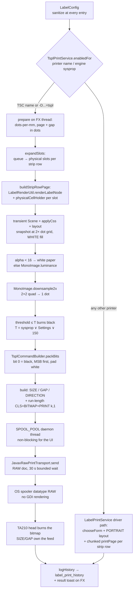
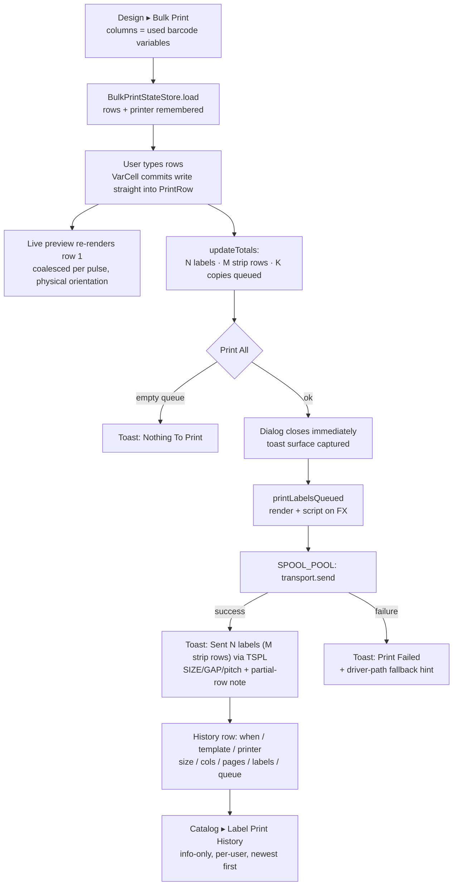

# Chapter 17 — Label Printing & the TSPL Thermal Pipeline

> **Part 10 of InvoiceStudio: Zero to Finished Product**
> Files covered in full this chapter: `service/LabelGeometryService.java`,
> `service/LabelPresets.java`, `service/LabelRenderUtil.java`,
> `service/MonoImage.java`, `service/TsplCommandBuilder.java`,
> `service/TsplPrintService.java`, `service/RawPrintTransport.java`,
> `service/JavaxRawPrintTransport.java`, `service/PrintingService.java`,
> `service/BulkPrintStateStore.java`, `model/LabelConfig.java`,
> `model/LabelPrintHistory.java`, `model/UnitConverter.java`,
> `db/LabelPrintHistoryDao.java` (the Chapter 5 DAO, revisited where it
> carries this chapter's weight), `ui/LabelBulkPrintDialog.java`,
> `ui/LabelStripPreviewDialog.java`, `ui/views/LabelHistoryView.java`,
> `test/.../service/TsplCommandBuilderTest.java`,
> `test/.../service/LabelPrintLogicTest.java`,
> `test/.../service/LabelPresetsTest.java`, `test/TsplPipelineVerify.java`
> (with `TsplVerifyLauncher`), `test/LabelStockDialogVerify.java` (with
> `LabelStockLauncher`) — all read and reproduced from the repository, with
> `service/PrintOptions.java` (introduced in Chapter 16) re-quoted at its
> consumer and `test/.../service/PrintServiceLogicTest.java` cross-referenced.
> Goal at the end: **the strip row the user sees is byte-for-byte the page the
> thermal head burns — one selected label feeds exactly one label — and the
> whole pipeline is provable without owning a printer.**

---

## 1. Chapter goal

By the end of this chapter you will have built, exactly as the repository has it:

1. **LabelConfig** — the stock sheet: strip width, columns, label cell, gaps,
   margins, corner radius, artwork orientation, stock type — persisted inside
   the template JSON from Chapter 7, self-repairing through `sanitize()`.
2. **LabelGeometryService** — pure, headless strip math: how many labels fit
   across the liner, where each column starts, how a print queue expands into
   physical slots, what a 90° design rotation does to every element.
3. **LabelPresets** — seventeen TSC TA210 die-cut presets, each validated
   against the printer's official media envelope, with the `[W×H] | L/R: …`
   display contract the stock dialog renders.
4. **LabelRenderUtil** — one label design rendered into a JavaFX node with a
   given variable set, shared by the strip preview, the bulk print popup and
   the real print path so all three are pixel-identical.
5. **MonoImage + TsplCommandBuilder** — the conversion chain from color
   snapshot to 1-bit dots to a legal TSPL/TSPL2 script: `SIZE`, `GAP`,
   `DIRECTION`, `CLS`, `BITMAP`, `PRINT` — with run-length compression so a
   100-copy queue downloads one bitmap, not one hundred.
6. **RawPrintTransport + JavaxRawPrintTransport** — the strategy seam and its
   JDK `javax.print` implementation that spools RAW bytes past the GDI driver,
   bounded by a 30-second spooler wait.
7. **TsplPrintService** — the native pipeline: TSC-name routing, dots-per-mm
   detection, the 2× supersampled rasterizer with its alpha-to-paper rule,
   the non-blocking queued spool, and the AUTODETECT calibration job.
8. **PrintingService + LabelPrintService** — the driver-path engine (the
   0.75 px→pt mapping from Chapter 16) and the orchestrator that routes TSC
   printers to TSPL, matches driver forms transposition-safely, and logs every
   run to `label_print_history`.
9. **LabelBulkPrintDialog** — the keyboard-first print grid (949 lines): one
   editable column per barcode variable, a fill-all Copies spinner, session
   memory, a live WYSIWYG preview, and the Test Print / Print All / Calibrate
   button row.
10. **LabelStripPreviewDialog + LabelHistoryView** — the "how the roll looks"
    preview with die-cut gaps and rounded corners, and the info-only history
    catalog backed by the Chapter 5 DAO.
11. **The test wall** — three JUnit suites (`TsplCommandBuilderTest`,
    `LabelPrintLogicTest`, `LabelPresetsTest`) and two hardware-less runtime
    harnesses (`TsplPipelineVerify`, `LabelStockDialogVerify`) that prove the
    pipeline down to the polarity of individual bits.

And you will understand the chapter's one big bet: **the printer is never
allowed to re-interpret the job.** Either we speak the printer's own language
(TSPL) and declare `SIZE`/`GAP`/`PRINT` ourselves, or — for every other
printer — we leave the OS driver alone and hand it exactly the node the user
approved. The historical bugs this chapter's comments still remember
("selected one, printed many", "prints in a different orientation than the
preview", "prints black, objects white") are all the same bug wearing
different hats: *something between the user and the head changed the picture.*
The architecture removes that something.

---

## 2. Story intro

Imagine a typewriter that understands no English at all — only its own
command language: *move to column 12, strike these keys, advance two lines.*
If you type a letter to it in English, it will guess, smudge, and feed you
blank paper. The only way to get perfect output is to write to it in its own
tongue.

A thermal label printer is exactly that typewriter. The TSC TA210 on Kumar's
shelf — the workhorse that prints his trouser size tags — does not understand
"print this page." It understands a compact language called **TSPL/TSPL2**:
`SIZE 432 dot,200 dot` declares the label shape, `GAP 24 dot,0 dot` tells the
feed motor where the die-cut gap is, `BITMAP 0,0,54,200,0,…` pushes the raw
1-bit image, and `PRINT 1,1` burns exactly one label. Nothing more, nothing
less.

For years, desktop printing hid this language behind a **driver** — a
translator that converts pretty pages into device commands. And translators
improvise. The driver had its own opinion about the loaded stock; when that
opinion disagreed with Kumar's roll, printing one selected label produced
four labels (one printed, three blank), or the strip came out rotated, or the
page came out *black with white content-shaped holes*. Every one of those
symptoms is the translator guessing. The fix in this repository is not a
better guess — it is bypassing the translator: **we** write the TSPL, **we**
declare the stock in dots, and the bytes we build are the bytes the head
burns.

> **Analogy:** a label printer is a typewriter that only understands its own
> commands. The old path hired a translator (the GDI driver) and hoped. The
> new path learns the language (TSPL), sends the original text (RAW bytes),
> and keeps a tutor on call (the AUTODETECT calibration job) for when the
> printer's memory of the paper drifts from the paper actually loaded.

The stakes are physical. A mis-fed label run wastes die-cut stock; a wrong
barcode on a trouser tag mislabels a whole carton; a frozen UI after clicking
Print feels like a crashed app. So this chapter pairs every physical claim
with a machine check: the TSPL script is asserted byte-for-byte in JUnit, the
"one label = one feed" contract is replayed through a fake transport, and the
stock dialog's round-trip is verified on the real designer under a headless
toolkit.

---

## 3. Concepts first

**Thermal printing.** A thermal print head is a row of tiny resistive
heaters — *dots* — that darken heat-sensitive paper on contact. There is no
ink, no ribbon (in direct-thermal mode), no toner: the head either **burns a
dot black** or **leaves it white**. That is why every concept in this chapter
is binary, and why a label design that relies on subtle gray gradients must
be *reduced* to black-and-white before it can exist on paper at all.

**Dots vs mm.** Screens measure in millimeters and pixels; print heads measure
in dots. The TA210's head is 203 dpi — 203 dots per inch ≈ **8 dots per mm**.
The 300-dpi TA310 sibling ≈ 12 dots per mm. The code stores stock geometry in
mm (the model's rule from Chapter 16: *the model never stores any unit but
mm*) and converts to dots only at the last moment, in
`TsplPrintService.prepare()`:

```java
int dpm = dotsPerMm(name);
double[] pageSize = LabelGeometryService.pageSizeMm(cfg);
int widthDots = Math.max(1, (int) Math.round(pageSize[0] * dpm));
int heightDots = Math.max(1, (int) Math.round(pageSize[1] * dpm));
int gapDots = Math.max(0, (int) Math.round(cfg.getGapY() * dpm));
```

Declaring `SIZE` in *dots* (not mm) is deliberate — the TSPL builder's
javadoc notes that "dot units avoid all mm→dots rounding drift between the
declared stock and the bitmap."

**1-bit rasters and bit polarity.** The `BITMAP` command's payload is a
packed 1-bit image: each byte holds 8 dots, most-significant bit first, each
row padded to a byte boundary. The polarity is the single most surprising
fact in the whole pipeline, so the builder documents it like a contract:

> bit 0 = black dot (burned), bit 1 = white dot (empty)

A *white* row is `0xFF` (all bits set); burning ink **clears** bits. Sending
ink as set bits inverts the whole label — "a black page with white content"
is the documented symptom of getting this backwards. `packBits()` implements
it, and two tests pin it byte-for-byte.

**From color to one bit: supersample, downsample, threshold.** Anti-aliased
screen edges are gray; a thermal head has no gray. The pipeline's answer is
three steps: (1) snapshot the label at **2× the dot grid**, (2) average each
2×2 pixel quad down to one dot (`MonoImage.downsample2x` — a *box filter*,
the simplest anti-alias-aware resampler), (3) cut to black/white with a
threshold (`dots[i] <= threshold` burns). The default threshold is 150 —
slightly above mid-gray "so hairlines and small text survive the thermal
print." A more famous alternative exists — **dithering**, specifically
**Floyd–Steinberg error diffusion**, which pushes each pixel's quantization
error onto its unvisited neighbors so gray areas become *patterns* of dots
instead of hard cuts — but for barcodes a hard cut is usually *better*: error
diffusion can fuzz module edges just enough to hurt scanability. The
repository chose threshold-on-downsample and keeps dithering as a clearly
marked optional improvement (Section 8).

**Alpha is not gray.** A snapshot pixel can be transparent, and `ARGB 0` has
RGB 0,0,0 — the *darkest possible* value. Read naively, every unstyled gap in
the label burns black. The rasterizer therefore has an explicit rule:
`alpha < 16 → 255 (white paper)`. The javadoc remembers the bug it fixed:
unstyled holders "would rasterize as ARGB 0, read as 'darkest black' and burn
giant black blocks with white content-shaped holes (the reported 'prints
black, objects white')."

**Raw vs driver printing.** On Windows, normal printing goes through GDI: the
spooler renders your page into device commands using the *driver's* paper
form. That translation is exactly what a label printer must not receive. The
alternative is a **RAW passthrough**: the JDK's `javax.print` API can submit
byte-array "AUTOSENSE" documents that Windows spools with datatype RAW via
`StartDocPrinter` — the TSC driver passes them untouched to the port monitor.
The printer receives our script verbatim. The trade-off: we now own size,
gap, copies and orientation — which is the point.

**Print service discovery.** `Printer.getAllPrinters()` (JavaFX) powers the
UI's printer combo; `PrintServiceLookup.lookupPrintServices(null, null)`
(javax.print) powers the RAW transport. They are two windows onto the same OS
spooler, matched *by name* — which is why `JavaxRawPrintTransport.resolve()`
insists on exact-then-case-insensitive name matching and **never** silently
redirects a named label job to the default printer.

**The strategy seam.** `RawPrintTransport` is a one-method interface
(`send(printerName, jobName, data)`). The production implementation is
JDK-based; the test harness swaps in a `FakeTransport` that captures bytes.
This is the *strategy pattern* (Chapter 16's PreviewFactory played the same
role): the pipeline depends on an interface, so hardware-less tests can prove
the full pipeline by intercepting the one object that touches hardware.

**Run-length compression.** Five identical labels do not need five bitmaps —
the printer can repeat its own buffer. `TsplCommandBuilder.runLengths()`
groups consecutive identical pages and emits `PRINT 5,1` instead of five
`PRINT 1,1`s. One bitmap download, one command — a 100-copy queue of one
design costs the spooler what one label costs.

**The WYSIWYG contract.** The strip preview, the bulk popup preview and both
print paths all build their pages with the same two calls —
`LabelRenderUtil.renderLabelNode` + `LabelRenderUtil.physicalCellHolder` —
and the TSPL rasterizer snapshots exactly that page node. "What you see is
what prints" here is not a slogan; it is a shared code path.

**Strip vocabulary.** One printed page = **one strip row**: the full liner
width across the head, one label height along the feed. `columns` labels sit
across it, separated by `gapX`; the feed-direction gap `gapY` is advanced by
the printer's gap sensor and *never printed*. Multi-across stock ("4-across")
fills slots left → right; a short queue leaves the last row's remaining
die-cuts blank — physics, not a bug, and the toast says so.

---

## 4. Files in this chapter

| # | File | Lines | Role |
|---|---|---|---|
| 1 | `model/LabelConfig.java` | 140 | Stock geometry inside the template JSON + `sanitize()` |
| 2 | `model/UnitConverter.java` | 105 | mm ⇄ px ⇄ pt ⇄ cm ⇄ inch — the unit bridge |
| 3 | `service/LabelGeometryService.java` | 310 | Pure strip math: columns, offsets, slots, rotation, validation |
| 4 | `service/LabelPresets.java` | 103 | 17 TA210 die-cut presets + envelope validation |
| 5 | `service/LabelRenderUtil.java` | 129 | One label → node; the physical cell holder |
| 6 | `service/MonoImage.java` | 70 | Luminance, 2× downsample, threshold — the testable raster core |
| 7 | `service/TsplCommandBuilder.java` | 220 | Pure TSPL script builder + bit packing + run lengths |
| 8 | `service/RawPrintTransport.java` | 18 | The transport seam (interface + `Result` record) |
| 9 | `service/JavaxRawPrintTransport.java` | 122 | JDK `javax.print` RAW spooler, 30 s bounded |
| 10 | `service/TsplPrintService.java` | 464 | Native pipeline: routing, dpm, prepare, rasterize, queued spool |
| 11 | `service/PrintingService.java` | 353 | Driver-path engine (preview dialog, 0.75 scale, calibration sheet) |
| 12 | `service/BulkPrintStateStore.java` | 83 | Per-template bulk-dialog session memory (JSON file) |
| 13 | `model/LabelPrintHistory.java` | 71 | One recorded print run |
| 14 | `db/LabelPrintHistoryDao.java` | 127 | History CRUD (Chapter 5 pattern, revisited) |
| 15 | `ui/LabelBulkPrintDialog.java` | 949 | The keyboard-first bulk print grid + live preview |
| 16 | `ui/LabelStripPreviewDialog.java` | 157 | The roll preview with die-cut gaps |
| 17 | `ui/views/LabelHistoryView.java` | 210 | Catalog ▸ Label Print History |
| 18 | `test/.../TsplCommandBuilderTest.java` | 304 | Script builder, bit packing, thresholds |
| 19 | `test/.../LabelPrintLogicTest.java` | 610 | Geometry, slots, rotation, forms, DAO, JSON |
| 20 | `test/.../LabelPresetsTest.java` | 62 | Envelope + display contract of the 17 presets |
| 21 | `test/TsplPipelineVerify.java` (+ launcher 14) | 349 | Hardware-less end-to-end TSPL verification harness |
| 22 | `test/LabelStockDialogVerify.java` (+ launcher 5) | 551 | Real-designer Label Stock dialog regression harness |

Line counts verified with `wc -l`. Together: ~5,900 lines.

Depends on: `Template` / `TemplateElement` / `ElementType` / `Settings` (Ch
6–7), `RenderContext` + `DesignObjectRenderer` + `BarcodeService` (Ch 16 —
labels are just bill templates rendered into tiny canvases), `VariableDao` +
`VariableDef` (Ch 4, barcode-scope variables), `LabelPrintHistoryDao` /
`DatabaseManager` (Ch 3, 5), `UiTheme` / `Toast` / `DialogHelper` /
`AppLog` / `AppExecutors` / `AppDirs` (Ch 2, 9), and the Template Designer's
Barcode Mode (Ch 15) which feeds every dialog here.

Used by: the designer's **Strip Preview** and **Bulk Print** toolbar actions
(Ch 15), Catalog ▸ Label Print History (Ch 11's navigation shell), the
Settings barcode-threshold knob, and the support system properties
(`invoicestudio.print.engine`, `invoicestudio.tspl.*`) documented in Step 9.

---

## 5. Step-by-step build

We build in dependency order: the stock model first, then the pure math and
presets, then the renderer, then the 1-bit + TSPL conversion chain, then the
transports and the two print services, then the dialogs, and finally the test
wall that pins every claim.

### Step 1 — `model/LabelConfig.java` (the stock sheet)

Barcode Mode reuses the whole template machinery of Chapters 7 and 16 — the
only new idea is the *stock*: the physical paper the design will be tiled
onto. The class opens with an ASCII diagram worth memorizing, because every
service in this chapter speaks it:

```java
/**
 * Label / barcode stock configuration for templates saved in
 * {@code mode = "label"} (Barcode Mode — thermal label printers like the
 * TSC TA210).
 *
 * <p>Mental model (matches die-cut label stock on a roll/strip):</p>
 * <pre>
 *  ←marginL→[ label ][ gapX ][ label ]←marginR→   ← strip (liner) width
 *            ↑ labelHeight, feed gap = gapY (handled by the printer's
 *              gap sensor; included here for sheet layout + preview)
 * </pre>
 *
 * <p>The designer canvas is ALWAYS one label cell ({@code labelWidth} x
 * {@code labelHeight} mm); printing tiles the design across the columns of
 * the strip and substitutes variables per slot from the Bulk Print queue.</p>
 *
 * <p>All existing templates (no {@code labelConfig} in JSON) keep working:
 * Jackson leaves this field null and {@link Template#labelOrNew()} falls back
 * to a default instance. Same trick for {@code mode}: null/absent = "bill".</p>
 */
@JsonIgnoreProperties(ignoreUnknown = true)
public class LabelConfig {
```

The defaults describe the most common commercial roll — a 100 mm liner, one
50 × 25 mm label across, 3 mm gaps, 2 mm corner radius:

```java
    /** Total liner/strip width in mm (the full web the printer prints across). */
    private double stripWidth = 100.0;

    /** How many die-cut labels sit across the strip (1 = standard roll labels). */
    private int columns = 1;

    /** Single label cell width in mm (canvas size in Barcode Mode). */
    private double labelWidth = 50.0;

    /** Single label cell height in mm (canvas height in Barcode Mode). */
    private double labelHeight = 25.0;

    /** Horizontal gap between label columns in mm. */
    private double gapX = 3.0;
```

Two fields deserve a slow read. `orientation` is a *string* ("0"/"90"/"180"/
"270") — artwork rotation applied at print time, so a label designed upright
can print sideways for a vertical dispenser without re-designing it.
`stockType` records "gap" (die-cut roll) or "continuous" (receipt-style):

```java
    /**
     * Extra rotation applied to the artwork at print time — one of
     * "0", "90", "180", "270". Lets a label designed one way print rotated
     * (e.g. sideways on a vertical dispenser) without re-designing it.
     */
    private String orientation = "0";
```

```java
    /**
     * Print style: "gap" (die-cut roll, printer advances via gap sensor) or
     * "continuous" (receipt-style stock). Purely informational for the driver
     * dialog; kept so shops can record their stock per template.
     */
    private String stockType = "gap";
```

> **ISSUE (faithfully preserved):** that doc comment says `stockType` is
> "purely informational for the driver dialog" — it used to be. The TSPL
> pipeline (Step 7) now reads it to choose between `GAP n,n` and `GAP 0,0`,
> so it is *behavioral*: `continuous` stock really does suppress the gap
> command. The comment drifted behind the feature. The book shows both
> statements as they are; `TsplCommandBuilderTest` pins the behavior, so the
> comment is the stale side of that pair.

The last member is the class's immune system. `sanitize()` is called at every
entry point (both print services, both dialogs, the designer) so a
hand-edited or ancient JSON can never crash the renderer:

```java
    /** Clamps negatives / nonsense values so a bad JSON can never crash the renderer. */
    public void sanitize() {
        if (stripWidth <= 0) stripWidth = 100.0;
        if (columns < 1) columns = 1;
        if (columns > 8) columns = 8;
        if (labelWidth <= 0) labelWidth = 50.0;
        if (labelHeight <= 0) labelHeight = 25.0;
        if (gapX < 0) gapX = 0;
        if (gapY < 0) gapY = 0;
        if (cornerRadius < 0) cornerRadius = 0;
        if (marginL < 0) marginL = 0;
        if (marginR < 0) marginR = 0;
        if (orientation == null) orientation = "0";
        if (!List.of("0", "90", "180", "270").contains(orientation)) orientation = "0";
        if (stockType == null || stockType.isBlank()) stockType = "gap";
    }
```

Note the *repair*, not rejection: `columns > 8` clamps to 8 rather than
throwing, and an unknown orientation resets to "0". A template that fails to
render is a support ticket; a template that silently heals is a footnote.

### Step 2 — `model/UnitConverter.java` (the unit bridge)

Where Chapter 16 had three hard-coded constants (`MM_PX`, `PX_PER_MM`,
`MM_TO_PT`), the model side keeps one honest general-purpose converter. It is
small, pure, and worth reading once because every dialog spinner in the label
stock UI can accept any unit through it:

```java
public class UnitConverter {

    public static final double DEFAULT_SCREEN_DPI = 96.0;
    public static final double DEFAULT_PRINT_DPI = 300.0;
    public static final double MM_PER_INCH = 25.4;
    public static final double PT_PER_INCH = 72.0;

    public enum Unit {
        MM("mm", "Millimeters"),
        PX("px", "Pixels (Screen 96 DPI)"),
        PT("pt", "Points (1/72 in)"),
        CM("cm", "Centimeters"),
        IN("in", "Inches"),
        INCH("in", "Inches");
```

```java
    public static double mmToPx(double mm, double dpi) {
        return mm * (dpi / MM_PER_INCH);
    }

    public static double pxToMm(double px, double dpi) {
        if (dpi <= 0) dpi = DEFAULT_SCREEN_DPI;
        return px * (MM_PER_INCH / dpi);
    }

    public static double mmToPt(double mm) {
        return mm * (PT_PER_INCH / MM_PER_INCH);
    }
```

The interesting rows are the `toMm` / `fromMm` switch expressions — one
`switch` over the enum replaces the eight-method multiplication table a
beginner would write, and `fromMm` is the literal inverse so a spinner that
displays inches can round-trip a value stored in mm without drift beyond one
formatting round:

```java
    public static double toMm(double value, Unit unit, double dpi) {
        if (unit == null) unit = Unit.MM;
        return switch (unit) {
            case MM -> value;
            case CM -> value * 10.0;
            case IN, INCH -> value * MM_PER_INCH;
            case PT -> ptToMm(value);
            case PX -> pxToMm(value, dpi);
        };
    }
```

> **NOTE (kept faithful):** the enum declares *both* `IN` and `INCH` mapped
> to the code `"in"` — a user-friendly alias. `fromCode` matches in
> declaration order, so `IN` wins; nothing breaks, but any future code that
> iterates `Unit.values()` (a settings menu, say) will list "Inches" twice.

### Step 3 — `service/LabelGeometryService.java` (pure strip math)

This class is the chapter's arithmetic heart, and its javadoc is the layout
model in four lines of ASCII: labels across the strip, gaps between them,
margins at the ends, one row per printed page. "All methods are static and
side-effect free so the whole geometry can be unit-tested headlessly" — the
same pure-logic-extraction discipline Chapter 14 applied to `ExpenseAnalytics`.

```java
/**
 * Pure (no JavaFX / no DB) math for Barcode-Mode label printing.
 * <p>
 * Layout model (matches die-cut label strips fed to thermal printers like
 * the TSC TA210):
 * <pre>
 *  |←mL→| label 1 |←gapX→| label 2 |←gapX→| label 3 |→mR|   strip = page.width
 *  |--------------- labelHeight ---------------|          page.height
 * </pre>
 * One printed page = ONE strip row carrying up to {@code columns} labels
 * (slots filled left → right from the print queue). Feed-direction gap
 * (gapY) is advanced by the printer's gap sensor, never printed.
 */
public final class LabelGeometryService {
```

Two little classes carry the data. `PrintLine` is one row of the bulk grid (a
variable-value map plus copies); `LabelSlot` is one physical label the
printer will output — page index, column index, the x offset in mm, and the
values to render there:

```java
    /** One row of the Bulk Print popup: variable values + how many copies. */
    public static class PrintLine {
        /** Variable key → value for this line (all barcode variables expected). */
        public final Map<String, String> values;
        public int copies;

        public PrintLine(Map<String, String> values, int copies) {
            this.values = values != null ? values : new LinkedHashMap<>();
            this.copies = Math.max(0, copies);
        }
    }
```

The orientation pair is the first "aha": for 90°/270° print orientations the
*design's height becomes the physical width* — the artwork is spun at print,
so the strip must reserve the transposed rectangle:

```java
    /**
     * Physical label width on the strip. For 90/270 print orientation the
     * design is rotated, so the design's height becomes the physical width.
     */
    public static double physicalCellWidth(LabelConfig c) {
        return ("90".equals(c.getOrientation()) || "270".equals(c.getOrientation()))
                ? c.getLabelHeight() : c.getLabelWidth();
    }
```

`requiredStripWidth` is the sum the stock dialog checks live — margins plus
columns plus the gaps *between* them (there is no trailing gap):

```java
    /** Exact liner width needed for the current columns/gaps/margins config. */
    public static double requiredStripWidth(LabelConfig c) {
        double cellW = physicalCellWidth(c);
        return c.getMarginL() + c.getMarginR()
                + (double) c.getColumns() * cellW
                + (double) Math.max(0, c.getColumns() - 1) * c.getGapX();
    }
```

`columnOffsets` decides where each column starts, and it contains a small
act of mercy: if the stock has slack (the liner is wider than strictly
needed), the labels are **centered** rather than glued to the left margin, so
a slightly-too-wide stock still prints symmetrically:

```java
    public static double[] columnOffsets(LabelConfig c) {
        double cellW = physicalCellWidth(c);
        double content = requiredStripWidth(c);
        double slack = c.getStripWidth() - content;
        double lead = c.getMarginL() + Math.max(0, slack) / 2.0; // center when slack
        double[] xs = new double[c.getColumns()];
        double x = lead;
        for (int i = 0; i < c.getColumns(); i++) {
            xs[i] = round2(x);
            x += cellW + c.getGapX();
        }
        return xs;
    }
```

The queue → slots expansion is where "20 of size S" becomes twenty physical
labels. `expandSlots` walks the print lines, filling each strip row left →
right and rolling to a new page when the columns run out — and a queue of 41
labels on 2-across stock simply ends its 21st page after one filled slot:

```java
    public static List<LabelSlot> expandSlots(List<PrintLine> lines, LabelConfig c) {
        List<LabelSlot> slots = new ArrayList<>();
        if (lines == null || lines.isEmpty() || c.getColumns() < 1) return slots;

        double[] xs = columnOffsets(c);
        int labels = totalLabels(lines);
        int pages = totalPages(lines, c);

        int page = 0, col = 0;
        for (PrintLine line : lines) {
            for (int k = 0; k < line.copies; k++) {
                if (page >= pages) return slots; // safety
                slots.add(new LabelSlot(page, col, xs[col], line.values));
                col++;
                if (col == c.getColumns()) { col = 0; page++; }
            }
        }
        return slots;
    }
```

The 90° design-space converter is one formula with a test suite of its own
(Step 18): rotating a rectangle clockwise about the canvas maps
`(x, y, w, h) → (H − y − h, x, h, w)`:

```java
    public static double[] rotateElement90CW(double x, double y, double w, double h,
                                             double canvasHeightMm) {
        return new double[]{
                round2(canvasHeightMm - y - h),
                round2(x),
                round2(h),
                round2(w)
        };
    }
```

`summarize` and `linesToJson` produce the history's human row ("(A · 19 · S)
× 20; …") and its machine row — a deliberately dependency-free JSON writer
("kept free of Jackson deps for testability") that quotes only the two
characters JSON actually cares about:

```java
    private static String quote(String s) {
        String safe = s == null ? "" : s.replace("\\", "\\\\").replace("\"", "\\\"");
        return "\"" + safe + "\"";
    }
```

Finally `validate(Template)` is the warning list the stock dialog shows:
strip overflow, the TA210 head limit, and a missing barcode element:

```java
        // Official TA210 datasheet: 4-inch head, 108 mm (4.25") at 203 dpi.
        // (Early app builds wrongly claimed 2-inch / 54 mm and scared users
        // printing perfectly valid 77 mm liners — fixed to match hardware.)
        if (c.getStripWidth() > TsplCommandBuilder.TA210_MAX_PRINT_MM) {
            warn.add(String.format(java.util.Locale.US,
                    "Strip width %.1f mm exceeds the TSC TA210 print head (108 mm, 4-inch) — "
                            + "trim margins/columns or use a wider printer.", c.getStripWidth()));
        }
```

The comment is a small piece of product archaeology: a previous constant
scared real users; the datasheet settled it; the test suite (Step 18) keeps
the correction from regressing.

### Step 4 — `service/LabelPresets.java` (the TA210 catalog)

The stock dialog's gold-rectangle selector is fed by this catalog: seventeen
die-cut sizes, each a *physical* dimension with suggested margins and gaps,
all inside the TA210's official envelope (media width 25.4–118 mm, length up
to 2794 mm, 108 mm print head, 203 dpi):

```java
    /** One selectable label-stock preset. */
    public record Preset(String name, String note,
                         double w, double h,
                         double marginLR, double rowGap, double colGap) {

        /** The exact display format requested:
         *  {@code [W×H]  |  L/R: xmm  |  Row Gap: ymm  |  Col Gap: zmm} */
        public String spec() {
            String col = colGap > 0 ? compact(colGap) + "mm" : "—";
            return "[" + compact(w) + "×" + compact(h) + "]  |  L/R: " + compact(marginLR)
                    + "mm  |  Row Gap: " + compact(rowGap) + "mm  |  Col Gap: " + col;
        }

        /** 50.0 → "50", 1.5 → "1.5" — compact dims for the selector text. */
        private String compact(double v) {
            String s = String.format(Locale.US, "%.4f", v);
            if (s.contains(".")) {
                s = s.replaceAll("0+$", "").replaceAll("\\.$", "");
            }
            return s;
        }
    }
```

`compact` is a tiny lesson in display formatting: format with four decimals,
then strip trailing zeros *and* a trailing bare dot — so 25.4 stays "25.4",
50 becomes "50", and nothing ever shows "50.0000". The list itself is data:

```java
    /** The 17 TA210 presets, in the agreed order (largest heights first). */
    public static final List<Preset> TA210 = List.of(
        new Preset("108 × 2794", "Max width × max length (continuous)", 108, 2794, 1.0, 2.0, 0),
        new Preset("108 × 150", "Standard 4×6 shipping", 108, 150, 1.0, 2.0, 3.0),
        new Preset("100 × 150", "Standard shipping label", 100, 150, 1.0, 2.0, 3.0),
        new Preset("75 × 50", "3″×2″ barcode label", 75, 50, 1.0, 1.5, 2.0),
        new Preset("50 × 25", "", 50, 25, 1.0, 1.5, 2.0),
        new Preset("40 × 60", "Vertical orientation", 40, 60, 1.0, 1.0, 1.5),
        new Preset("25.4 × 10", "Minimum supported size", 25.4, 10, 0.5, 0.5, 1.0)
        // … 10 more between 32 × 20 and 108 × 100 — full list in the source
    );
```

And the guardrail that keeps hand-typed sizes honest — returning `null` for
"printable" and a human sentence for the first violated constraint:

```java
    public static String validate(double w, double h) {
        if (w < MEDIA_WIDTH_MIN || w > MEDIA_WIDTH_MAX) {
            return String.format(Locale.US,
                    "Width %.1f mm outside TA210 media range %.1f–%g mm", w, MEDIA_WIDTH_MIN, MEDIA_WIDTH_MAX);
        }
        if (h < LENGTH_MIN || h > LENGTH_MAX) {
            return String.format(Locale.US,
                    "Length %.1f mm outside TA210 range %g–%g mm", h, LENGTH_MIN, LENGTH_MAX);
        }
        if (w > PRINT_WIDTH_MAX) {
            return String.format(Locale.US,
                    "Width %.1f mm exceeds the %g mm print head — outer %.1f mm would not print",
                    w, PRINT_WIDTH_MAX, w - PRINT_WIDTH_MAX);
        }
        return null;
    }
```

Notice the third check is *separate* from the first on purpose: a 112 mm
label is inside the media envelope (the liner exists) but outside the print
head (the outer 4 mm would stay white) — two different failures that deserve
two different explanations.

### Step 5 — `service/LabelRenderUtil.java` (one label → node)

This 129-line utility is the reason the strip preview, the bulk popup preview
and the printed label can never disagree. It has exactly two jobs. First,
render one design into a node at 96-dpi screen pixels, substituting
variables through the Chapter 16 machinery:

```java
public final class LabelRenderUtil {

    public static final double MM_PX = 3.7795275591; // 96 DPI

    private static final DateTimeFormatter DATE_FMT = DateTimeFormatter.ofPattern("dd-MM-yyyy");
    private static final DateTimeFormatter TIME_FMT = DateTimeFormatter.ofPattern("HH:mm");

    private LabelRenderUtil() {}
```

```java
        RenderContext ctx = new RenderContext(null, settings != null ? settings : new Settings(), 0, 1, 1);
        if (values != null && !values.isEmpty()) {
            ctx.getValues().putAll(values);
        }
        // Label conveniences — handy for "Packed on" / batch labels.
        LocalDateTime now = LocalDateTime.now();
        ctx.getValues().putIfAbsent("label_date", now.format(DATE_FMT));
        ctx.getValues().putIfAbsent("label_time", now.format(TIME_FMT));
        ctx.getValues().putIfAbsent("invoice_date", now.format(DATE_FMT));
```

A `RenderContext` with `bill = null` is *designer mode* (Chapter 16):
unknown variables stay visible instead of resolving blank — exactly right
for a label preview. Three `putIfAbsent` conveniences give every label free
access to `{{label_date}}` and `{{label_time}}` for "Packed on" stamps
without the bulk grid needing a column for them.

```java
        List<TemplateElement> els = template.getElements();
        // Paint in list order (list order == z order in the designer).
        for (int i = 0; i < els.size(); i++) {
            TemplateElement el = els.get(i);
            if (el == null || el.isHidden()) continue;
            Node node = DesignObjectRenderer.render(el, ctx,
                    el.getW() * MM_PX, el.getH() * MM_PX);
            if (node == null) continue;
            node.setLayoutX(el.getX() * MM_PX);
            node.setLayoutY(el.getY() * MM_PX);
            node.setRotate(el.getRotation());
            node.setMouseTransparent(true);
            cell.getChildren().add(node);
        }
        return cell;
```

`setMouseTransparent(true)` matters more than it looks: these nodes are
stamping masters, not widgets — and when a *print* path snapshots a page
built this way, mouse event machinery is pure overhead.

Second job: place that artwork into its **physical die-cut cell** — the
holder geometry every viewer shares:

```java
    /**
     * Places one label artwork node into its PHYSICAL die-cut cell — the
     * single geometry every viewer (strip preview, bulk popup preview and
     * the real print path) must share so all three are pixel-identical.
     * ...
     * The clip lives on the UNROTATED holder, so even rotated artwork is
     * clipped to the physical cell shape exactly as the printer's die-cut
     * would.
     */
    public static Pane physicalCellHolder(Pane artwork, double designWmm, double designHmm,
                                          double cellWmm, double cellHmm,
                                          double angleDeg, boolean clip, double radiusPx) {
        double cellWpx = cellWmm * MM_PX;
        double cellHpx = cellHmm * MM_PX;
        double artWpx = designWmm * MM_PX;
        double artHpx = designHmm * MM_PX;

        Pane holder = new Pane();
        holder.setPrefSize(cellWpx, cellHpx);
        holder.setMinSize(cellWpx, cellHpx);
        holder.setMaxSize(cellWpx, cellHpx);

        if (angleDeg != 0) {
            artwork.getTransforms().add(new Rotate(angleDeg, artWpx / 2.0, artHpx / 2.0));
        }
        artwork.setLayoutX((cellWpx - artWpx) / 2.0);
        artwork.setLayoutY((cellHpx - artHpx) / 2.0);
        holder.getChildren().add(artwork);
```

Artwork is centered in the physical cell and, for legacy 90/270
orientations, spun about its own centre. Rotating about the *center* (not
the corner) is what keeps a 90° label visually where the die-cut expects it.

### Step 6 — `service/MonoImage.java` (color → one bit, testably)

Seventy lines, no JavaFX, no I/O — the pure core of rasterization. The
pipeline snapshots at 2× the dot density; this class does the rest:

```java
/**
 * Pure grayscale → 1-bit conversion for TSPL BITMAP payloads (no JavaFX —
 * the snapshot that produces the gray buffer lives in
 * {@link TsplPrintService}; this class is the testable core).
 * <p>
 * Thermal 203-dpi heads look ragged when anti-aliased edges are thresholded
 * directly, so the pipeline snapshots at 2× the dot density and this class
 * box-downsamples 2×2 pixels into one dot before the black cut.
 */
public final class MonoImage {

    /** Default black cut on the 0–255 downsampled gray. Slightly above the
     *  mid-grey so hairlines and small text survive the thermal print. */
    public static final int DEFAULT_THRESHOLD = 150;
```

The three stages, in order of the pipeline:

```java
    public static int luminance(int argb) {
        int r = (argb >> 16) & 0xFF, g = (argb >> 8) & 0xFF, b = argb & 0xFF;
        return (r * 299 + g * 587 + b * 114) / 1000;
    }
```

*Luminance* — the human-eye weighting of color into brightness (green counts
most, blue least — the integer Rec. 601 formula). A red "SALE" badge and a
green "PAID" badge at the same lightness burn the same gray, which is what a
monochrome head will make of them anyway.

```java
    public static int[] downsample2x(int[] gray, int pxW, int pxH) {
        int w = Math.max(1, pxW / 2), h = Math.max(1, pxH / 2);
        int[] out = new int[w * h];
        if (gray == null) return out;
        for (int y = 0; y < h; y++) {
            int y0 = y * 2, y1 = Math.min(y0 + 1, pxH - 1);
            for (int x = 0; x < w; x++) {
                int x0 = x * 2, x1 = Math.min(x0 + 1, pxW - 1);
                int sum = gray[y0 * pxW + x0] + gray[y0 * pxW + x1]
                        + gray[y1 * pxW + x0] + gray[y1 * pxW + x1];
                out[y * w + x] = sum / 4;
            }
        }
        return out;
    }
```

The box filter: each dot is the *average* of its 2×2 pixel quad. The
`Math.min(...)` clamps are insurance for odd-sized buffers — a one-pixel
black sliver averaged with three white neighbors becomes gray 64, which the
threshold then treats on its merits instead of being a jagged surprise.

```java
    public static boolean[] threshold(int[] dots, int widthDots, int heightDots, int threshold) {
        boolean[] black = new boolean[Math.max(0, widthDots) * Math.max(0, heightDots)];
        if (dots == null) return black;
        for (int i = 0; i < black.length && i < dots.length; i++) {
            black[i] = dots[i] <= threshold;
        }
        return black;
    }
```

> **ISSUE (faithfully preserved):** the javadoc of `threshold` says
> "@param threshold 0–255, ≥ burns black" — but the code burns when
> `dots[i] <= threshold` (darker-or-equal burns), which is also what the
> test `testThresholdBurnsDarkDots` pins (`dots = {10, 200, 150, 249}` at
> threshold 150 → black, white, black, white). The intended semantics are
> unambiguous from the code and tests: *values at or below the threshold are
> ink*. The `≥` in the doc is the typo; everything downstream agrees on
> `≤`.

Why a hard threshold rather than Floyd–Steinberg dithering? Section 3
sketched the reasoning; Section 8 turns it into a fully costed optional
improvement with the standard error-diffusion kernel, so the decision stays
visible and reversible.

### Step 7 — `service/TsplCommandBuilder.java` (the language)

The builder's 47-line javadoc is the best TSPL tutorial in the codebase — it
cites the official manual page for every command, records the bit polarity
"additionally verified on real hardware and independent TSPL rasterizers,"
and states the *reason the class exists*: the driver path lets the spooler
decide paper size and feed length, so "any mismatch between our strip row and
the driver stock makes a gap-sensor printer feed EXTRA blank labels (or
rotate the page)."

The script's anatomy, one method per line-group:

```java
    private static String sensorLine(LabelConfig cfg, int gapDots) {
        if ("continuous".equalsIgnoreCase(cfg.getStockType())) {
            return "GAP 0,0"; // manual: continuous label
        }
        // "gap" (and anything unknown) — die-cut roll, gap sensor pitch.
        return "GAP " + Math.max(0, gapDots) + " dot,0 dot";
    }
```

This is the line that makes `stockType` behavioral (the Step 1 ISSUE):
continuous stock must *not* declare a gap, or the printer waits for a die-cut
that never comes.

```java
    public static String header(LabelConfig cfg, int stripWidthDots, int rowHeightDots,
                                int gapDots, int direction) {
        StringBuilder sb = new StringBuilder();
        sb.append("SIZE ").append(Math.max(1, stripWidthDots)).append(" dot,")
          .append(Math.max(1, rowHeightDots)).append(" dot\r\n");
        sb.append(sensorLine(cfg, gapDots)).append("\r\n");
        sb.append("DIRECTION ").append(direction == 0 ? 0 : 1).append("\r\n");
        return sb.toString();
    }
```

`DIRECTION 1` means image y=0 is the leading edge — "text reads upright
after tearing," per the manual citation. The clamps (`Math.max(1, …)`)
guarantee the printer never receives a zero- or negative-dimension command,
which some firmwares treat as an error rather than a no-op.

The run-length compressor is the file's algorithmic gem — pure, nine lines,
and the reason a 100-copy queue costs one bitmap:

```java
    /**
     * Groups consecutive identical pages into single {@code PRINT k,1}
     * commands — the printer repeats its buffer, so a 100-copy queue
     * becomes ONE bitmap download and one PRINT, not 100 round-trips.
     * Pure and unit tested.
     *
     * @return run lengths in page order, e.g. pages [A,A,B,A] → [2,1,1]
     */
    public static int[] runLengths(List<TsplPage> pages) {
        int n = pages == null ? 0 : pages.size();
        int[] runs = new int[n];
        int out = 0;
        int i = 0;
        while (i < n) {
            int j = i + 1;
            while (j < n && samePage(pages.get(i), pages.get(j))) j++;
            runs[out++] = j - i;
            i = j;
        }
        return Arrays.copyOf(runs, out);
    }
```

`samePage` compares width, height and `Arrays.equals` of the packed bytes —
bit-exact identity, so two label designs that differ by one dot never merge.

`build` assembles the full script — header, then per *run* one
`CLS` (clear image buffer) + `BITMAP` command line + raw payload + `PRINT`:

```java
        ByteArrayOutputStream out = new ByteArrayOutputStream(64 * 1024);
        out.writeBytes(header(cfg, stripWidthDots, rowHeightDots, gapDots, direction)
                .getBytes(StandardCharsets.ISO_8859_1));

        int[] runs = runLengths(pages);
        int idx = 0;
        for (int run : runs) {
            TsplPage p = pages.get(idx);
            idx += run;
            out.writeBytes("CLS\r\n".getBytes(StandardCharsets.ISO_8859_1));
            out.writeBytes(bitmapCommand(p.widthBytes(), p.heightDots())
                    .getBytes(StandardCharsets.ISO_8859_1));
            out.writeBytes(p.mono());
            out.writeBytes("\r\n".getBytes(StandardCharsets.ISO_8859_1));
            out.writeBytes(("PRINT " + run + ",1\r\n").getBytes(StandardCharsets.ISO_8859_1));
        }
        return out.toByteArray();
```

Three details carry real weight. `ISO_8859_1` (not UTF-8) — TSPL is a
byte-oriented protocol and multi-byte encoding would corrupt the CRLF
framing. The payload follows the final comma of the BITMAP line *directly*,
terminated by CRLF — the manual's hex example is cited in the javadoc for
exactly this. And `PRINT m[,n]` is "m sets × n copies each," so `PRINT 5,1`
is five *feeds* of one set — the quantity semantics the whole one-label-one-
feed contract rests on.

Then the bit packer — the polarity contract in code:

```java
    public static byte[] packBits(boolean[] black, int widthDots, int heightDots) {
        int widthBytes = (widthDots + 7) / 8;
        byte[] out = new byte[widthBytes * Math.max(0, heightDots)];
        if (black == null) return out;
        // White paper encodes as 1-bits: start every byte fully white, then
        // CLEAR the bits where ink burns (bit 0 = black dot on TSC heads).
        // Padding dots beyond widthDots stay white (1) — they only ever sit
        // in the unused tail of a row's last byte.
        java.util.Arrays.fill(out, (byte) 0xFF);
        for (int y = 0; y < heightDots; y++) {
            int rowBase = y * widthBytes;
            for (int x = 0; x < widthDots; x++) {
                if (black[y * widthDots + x]) {
                    int idx = rowBase + (x >> 3);
                    out[idx] &= (byte) ~(0x80 >> (x & 7));
                }
            }
        }
        return out;
    }
```

The idioms are worth decoding once: `x >> 3` is "which byte" (divide by 8),
`0x80 >> (x & 7)` is "which bit within the byte" (MSB first), `&= ~bit`
clears exactly that bit. The fill-then-clear structure makes the polarity
impossible to get wrong: white is the *default*, ink is the *exception*.

> **ISSUE (faithfully preserved):** the null path contradicts the polarity.
> `if (black == null) return out;` exits *before* the `Arrays.fill(0xFF)`,
> returning all-zero bytes — and zero bits mean **burned black** on a TSC
> head, so a null grid encodes as a fully black label. (Compare
> `testPackBitsNullSafe`, which asserts the zeros, against
> `testPackBitsEmptyGridIsAllWhite`, which asserts an *empty* grid packs to
> `0xFF`.) In production this cannot fire — `MonoImage.threshold` always
> returns a non-null array — but the contract is a trap for future callers.
> Moving the null check below the fill (or throwing) would make the two
> degenerate cases agree.

One more public constant closes the file — the head-width truth that Step 3's
validator and Step 9's success message both consult:

```java
    /**
     * TSC TA210 max print area across the head, in mm — official datasheet:
     * 108 mm (4.25″) on the 203-dpi TA210 (the 300-dpi TA310 sibling: 104 mm).
     * It is a 4-inch desktop printer, so a 77 mm two-up liner prints full-width.
     */
    public static final double TA210_MAX_PRINT_MM = 108.0;
```

### Step 8 — `service/RawPrintTransport.java` + `JavaxRawPrintTransport.java` (the postal service)

Eighteen lines define the seam the whole native pipeline hangs on:

```java
/**
 * Sends raw print bytes straight into the OS spooler for one named
 * printer — the passthrough TSC drivers accept as TSPL/TSPL2 scripts
 * (datatype RAW, no GDI rendering, no driver stock interference).
 */
public interface RawPrintTransport {

    /** Outcome of one RAW spool attempt. */
    record Result(boolean success, String message) {}

    /**
     * Spools {@code data} to {@code printerName} as a RAW job.
     * Implementations must be silent (no dialogs) and thread-safe.
     */
    Result send(String printerName, String jobName, byte[] data);
}
```

The contract's two adjectives — *silent* and *thread-safe* — encode hard
lessons: a spooler call can happen from a background pool (Step 9), and a
native print dialog popping mid-batch would be worse than a failure.

The JDK implementation is where "no external dependencies" pays off — the
same `javax.print` API every Java install ships:

```java
public final class JavaxRawPrintTransport implements RawPrintTransport {

    /** Max seconds to wait for the spooler's completed/failed event. */
    public static final int SPOOL_WAIT_SECONDS = 30;

    private static final DocFlavor RAW = DocFlavor.BYTE_ARRAY.AUTOSENSE;

    @Override
    public Result send(String printerName, String jobName, byte[] data) {
        if (data == null || data.length == 0) {
            return new Result(false, "Refusing to send an empty print job.");
        }
        PrintService svc = resolve(printerName);
        if (svc == null) {
            return new Result(false, "Printer \"" + printerName
                    + "\" was not found in the system print services.");
        }
        if (!svc.isDocFlavorSupported(RAW)) {
            return new Result(false, "Printer \"" + printerName
                    + "\" (" + svc.getClass().getSimpleName()
                    + ") does not accept raw data — TSPL direct printing needs the TSC driver.");
        }
```

Three early refusals, three precise messages: empty job, unknown printer,
wrong driver kind. The third one is a kindness — "TSPL direct printing needs
the TSC driver" tells a shop exactly what to install, not just that the call
failed.

Then the bounded wait. A `CountDownLatch` waits for the spooler's
completed/failed/canceled event — but only up to 30 seconds, because a
*paused* spooler (paper out, queue paused) must not freeze a background
thread forever:

```java
        try {
            boolean finished = done.await(SPOOL_WAIT_SECONDS, TimeUnit.SECONDS);
            if (failure.get() != null) {
                return new Result(false, failure.get());
            }
            if (!finished) {
                // Spooler accepted the bytes but is busy (paper out, paused).
                return new Result(true, "Spooled to \"" + printerName
                        + "\" — still printing or waiting (check the printer).");
            }
            return new Result(true, "Spooled to \"" + printerName + "\".");
        } catch (InterruptedException ie) {
            Thread.currentThread().interrupt();
            return new Result(false, "Interrupted while waiting for the print spooler.");
        }
```

Read the timeout branch twice: timing out is reported as **success with a
caveat** — the bytes are accepted and will print when the printer recovers.
Failing the job because the queue was paused would be a lie in the other
direction. The listener also deliberately ignores
`printJobRequiresAttention` ("e.g. out of paper — keep waiting; the spooler
resumes it").

And the resolver's safety rule, quoted in full because it is a policy:

```java
    /**
     * Finds the spooler service by exact name, then case-insensitive.
     * Returns null when the name is unknown — NEVER silently redirects a
     * named label job to the default printer (physical media could end up
     * on the wrong device).
     */
    private static PrintService resolve(String printerName) {
        if (printerName == null || printerName.isBlank()) {
            return PrintServiceLookup.lookupDefaultPrintService();
        }
        PrintService loose = null;
        for (PrintService s : PrintServiceLookup.lookupPrintServices(null, null)) {
            String n = s.getName();
            if (n.equals(printerName)) return s;
            if (loose == null && n.equalsIgnoreCase(printerName)) loose = s;
        }
        return loose;
    }
```

A missing printer is an *error*; a misdirected label run is a *wrong physical
object in the world*. The code knows the difference.

### Step 9 — `service/TsplPrintService.java` (the native pipeline)

This is the conductor. Its javadoc states the WYSIWYG contract and the
routing rule, and names the historical bug that justified the whole class:
"the historical 'selected one, printed many' bug was the GDI driver guessing
the stock."

**Routing.** Two name-based predicates decide everything:

```java
    /** Name-based dot density (the RAW spooler only ever knows the name). */
    public static int dotsPerMm(String printerName) {
        String prop = System.getProperty("invoicestudio.tspl.dotsPerMm");
        if (prop != null) {
            try { return Math.max(4, Integer.parseInt(prop.trim())); } catch (Exception ignored) {
            AppLog.debug(ignored); }
        }
        String name = printerName != null ? printerName.toLowerCase(Locale.ROOT) : "";
        boolean dpi300 = name.contains("ta300") || name.contains("ta310") || name.contains("12 dot");
        return dpi300 ? 12 : 8;
    }
```

```java
    public static boolean enabledFor(String printerName) {
        String engine = System.getProperty("invoicestudio.print.engine", "auto");
        if ("driver".equalsIgnoreCase(engine)) return false;
        if ("tspl".equalsIgnoreCase(engine)) return true;
        String name = printerName != null ? printerName.toLowerCase(Locale.ROOT) : "";
        return name.contains("tsc") || name.contains("ta210") || name.contains("ta200")
                || name.contains("ta300") || name.contains("ta310");
    }
```

Auto-routing keys off the printer *name* because "the RAW spooler only ever
knows the name." Two support hatches ride along as system properties:
`-Dinvoicestudio.print.engine=tspl|driver` forces or disables the native
path, and `-Dinvoicestudio.tspl.dotsPerMm` overrides density (clamped to ≥ 4
so a typo can't ask for a 1-dot-per-meter head).

**The spool pool.** One daemon thread, created with a named factory:

```java
    /**
     * Background spooler pool. The RAW transport waits up to
     * {@link JavaxRawPrintTransport#SPOOL_WAIT_SECONDS} for the spooler to
     * accept/finish the job — waiting on the FX Application Thread froze the
     * whole app until the job completed ("app stops after printing"), so the
     * UI now only renders + builds the script on FX and hands the blocking
     * spool to this daemon pool.
     */
    private static final ExecutorService SPOOL_POOL = Executors.newSingleThreadExecutor(r -> {
        Thread t = new Thread(r, "invoicestudio-tspl-spool");
        t.setDaemon(true);
        return t;
    });
```

The quoted bug — "app stops after printing" — is the reason `printLabelsQueued`
exists at all. Single-threaded on purpose: two RAW jobs to one label printer
would interleave at the spooler anyway, and serializing here makes every job
ordered and observable.

**The synchronous run** is short because everything funnels through
`prepare`:

```java
    public static LabelPrintService.PrintResult printLabelsNamed(Template template, Settings settings,
                                                                 List<LabelGeometryService.PrintLine> lines,
                                                                 List<String> variableOrder,
                                                                 String printerName, boolean silentHistory) {
        PreparedJob job = prepare(template, settings, lines, variableOrder, printerName);
        if (job.error != null) return job.error;

        RawPrintTransport.Result sent = transport.send(job.printerName,
                "Labels — " + job.template.getName(), job.script);
        if (!sent.success()) {
            return new LabelPrintService.PrintResult(false, 0, job.labels,
                    sent.message() + " — falling back is available by printing with a non-TSC printer selected.");
        }

        if (!silentHistory) {
            LabelPrintService.logHistory(job.template, job.printerName, lines, variableOrder,
                    job.pages.size(), job.labels);
        }
        return successResult(job);
    }
```

Even the failure message is a recovery path: it tells the user how to get
their labels *today* (select a non-TSC printer → driver path) before anyone
debugs the spooler.

**The queued run** — the UI-facing one — splits the work by thread:

```java
        LabelPrintService.PrintResult queued = new LabelPrintService.PrintResult(true,
                job.pages.size(), job.labels,
                String.format(Locale.US,
                        "Rendering done — sending %d label%s to %s… (the script is spooling in the background)",
                        job.labels, job.labels == 1 ? "" : "s", job.printerName));

        Runnable finish = () -> {
            RawPrintTransport.Result sent = transport.send(job.printerName,
                    "Labels — " + job.template.getName(), job.script);
            ...
            if (onDone != null) {
                if (Platform.isFxApplicationThread()) onDone.accept(finalResult);
                else Platform.runLater(() -> onDone.accept(finalResult));
            }
        };

        if (Platform.isFxApplicationThread()) {
            SPOOL_POOL.execute(finish);
        } else {
            finish.run();
        }
        return queued;
```

Render + script build happen on the calling (FX) thread — they *must*, since
they touch the scene graph — and the potentially 30-second spool moves to the
daemon pool. The callback hops back to FX with an explicit
`Platform.isFxApplicationThread()` check, which makes the same code correct
from tests and CLIs (where it degrades to synchronous).

**The prepare stage** — validation, geometry, rendering, rasterization,
script build — ends with a diagnostic hatch worth knowing about:

```java
        // Support knob: -Dinvoicestudio.tspl.dump=/path/job.tspl writes the
        // exact RAW bytes this job spools, so "what are we actually sending"
        // is always auditable (SIZE/GAP/PRINT header + the 1-bit payload).
        String dumpPath = System.getProperty("invoicestudio.tspl.dump");
        if (dumpPath != null && !dumpPath.isBlank()) {
            try {
                java.nio.file.Files.write(java.nio.file.Path.of(dumpPath), script);
            } catch (Exception ignored) {
            AppLog.debug(ignored);
                // diagnostics must never break the print
            }
        }
```

**The rasterizer** is where screen pixels become dots — and where the two
bugs documented in the code (blank text, black blocks) were fixed:

```java
    private static TsplCommandBuilder.TsplPage rasterize(Pane pageNode, int widthDots, int heightDots,
                                                         int dpm, Settings settings) {
        int ssDpm = dpm * 2;                       // supersample factor
        int pxW = widthDots * 2, pxH = heightDots * 2;

        // The page node is never attached to a Scene. Without a Scene the
        // user-agent stylesheet never loads, Controls (Label/Text) never get
        // their skin and print BLANK (self-drawing nodes like ImageView are
        // unaffected — the bug used to hide text but keep barcodes). A
        // transient one-off Scene gives the node the real live-scene CSS +
        // layout passes, then we detach again.
        javafx.scene.Group cssRoot = new javafx.scene.Group(pageNode);
        javafx.scene.Scene cssScene = new javafx.scene.Scene(cssRoot);
        pageNode.applyCss();
        pageNode.layout();

        SnapshotParameters sp = new SnapshotParameters();
        sp.setFill(javafx.scene.paint.Color.WHITE); // transparent → paper, never ink
        double factor = (double) ssDpm / LabelRenderUtil.MM_PX;
        sp.setTransform(Transform.scale(factor, factor));

        WritableImage img;
        try {
            img = pageNode.snapshot(sp, new WritableImage(pxW, pxH));
        } finally {
            cssRoot.getChildren().clear(); // detach — node is reusable
        }
```

Two JavaFX subtleties, both learned the hard way and written down where the
next reader will trip. A node needs a *Scene* for CSS/skins — so a transient
one is created and discarded (`finally` detaches so the node stays reusable).
And the snapshot's fill is white, not null — the alpha-to-paper rule that
prevents the inverted-label bug:

```java
        int[] gray = new int[pxW * pxH];
        int threshold = effectiveThreshold(settings);

        for (int y = 0; y < pxH; y++) {
            int sy = Math.min(y, actH - 1);
            for (int x = 0; x < pxW; x++) {
                int sx = Math.min(x, actW - 1);
                int argb = pr.getArgb(sx, sy);
                // alpha < 16 (≈6% opaque) → white paper; else grayscale
                gray[y * pxW + x] = (argb >>> 24) < 16 ? 255 : MonoImage.luminance(argb);
            }
        }
        int[] dots = MonoImage.downsample2x(gray, pxW, pxH);
        boolean[] black = MonoImage.threshold(dots, widthDots, heightDots, threshold);
        return new TsplCommandBuilder.TsplPage(
                TsplCommandBuilder.packBits(black, widthDots, heightDots),
                TsplCommandBuilder.widthBytes(widthDots), heightDots);
    }
```

The threshold knob resolution order — sysprop, then Settings, then the 150
default, then clamped to 0–255 — lives in `effectiveThreshold`, and
`testEffectiveThresholdPrefersSyspropThenSettings` pins all four rungs.

**The success message** is a support technician in string form. It reports
the full print plan (SIZE/GAP/sensor/threshold), the feed pitch so it can be
checked against a ruler, diagnoses partial rows (more in a moment), and
warns when the strip exceeds the head:

```java
    static void appendPartialRowNote(PreparedJob job, StringBuilder msg) {
        int columns = Math.max(1, job.cfg().getColumns());
        int pages = Math.max(1, job.pages.size());
        int lastRowFill = job.labels - (pages - 1) * columns;
        if (lastRowFill >= columns || lastRowFill <= 0) return; // full or impossible
        int blanks = columns - lastRowFill;
        msg.append(String.format(Locale.US,
                " NOTE: the last strip row fills %d of %d slots — the other %d die-cut label%s feed out "
                        + "blank (multi-across stock wastes them on small queues). Single-column roll? Set Columns = 1 "
                        + "in Label Stock. Blank labels even on full rows? Run Calibrate Stock Sensor.",
                lastRowFill, columns, blanks, blanks == 1 ? "" : "s"));
    }
```

That arithmetic answers the shop's most confusing day: print one record on
4-across stock and three *physical* labels feed out blank. They are
die-cuts on the same fed row — physics, not a misfeed — and the message
distinguishes that from the genuine misfeed case ("blank labels even on full
rows?") in one breath.

**Calibration.** The final piece is the printer's own self-measurement job:

```java
    public static LabelPrintService.PrintResult calibrateSensorQueued(Printer printer,
                                                                      Consumer<LabelPrintService.PrintResult> onDone) {
        String printerName = printer != null ? printer.getName() : null;
        String name = printerName != null && !printerName.isBlank()
                ? printerName : "(default printer)";
        String script = TsplCommandBuilder.calibrationScript();
```

which is exactly one command line — `"AUTODETECT\r\n"` — in its own spool
job, because the manual forbids sharing a script with `GAP`/`BLINE`. This is
the documented cure for a printer whose learned pitch no longer matches the
loaded roll.

### Step 10 — `service/PrintingService.java` (the driver path)

Every non-TSC printer — and every forced `engine=driver` run — goes through
the engine Chapter 16 already met at its edges: `PrintPreviewDialog`,
`PrintOptions`, and the "A4 bills printing at 100×140 mm" root-cause note.
The class is quoted here where it *differs* from the label path or carries
new weight.

```java
public class PrintingService {

    /**
     * Screen pixels are 96 DPI (3.78 px/mm); JavaFX printer coordinates are
     * 72 pt/inch. Ratio 72 / 96 = 0.75 maps screen pixels to 100% physical
     * size. The node is additionally shrunk only when it cannot physically
     * fit the printable area (e.g. continuous thermal rolls).
     */
    public static final double BASE_SCALE = 0.75;
```

`printTemplate` opens the modern preview window (the user's chosen paper,
orientation and copies are final), and falls back to the native dialog on
any UI failure — re-asserting the layout *after* the dialog closes, because
"the native dialog resets it to the driver's default form — the historical
source of wrong print sizes":

```java
    public static boolean printTemplate(Node node, Template template, Window owner, int copies, String jobName) {
        // 1) Modern print window with live preview + explicit options
        try {
            PrintPreviewDialog.PreviewFactory factory = buildPreviewFactory(node);
            PrintPreviewDialog dlg = new PrintPreviewDialog(
                    owner, template, factory, copies, jobName,
                    "Print" + (jobName != null && !jobName.isBlank() ? " — " + jobName : ""));
            Optional<PrintOptions> chosen = dlg.showAndWait();
            if (chosen.isEmpty()) return false;
            return printWithOptions(node, template, chosen.get());
        } catch (Throwable dialogFailure) {
            // Headless/test environments or unexpected UI failure:
            // fall back to the native dialog, but re-assert the layout AFTER
            // it closes so the driver's default form can never win.
            return printWithNativeDialog(node, template, owner, copies, jobName);
        }
    }
```

`PrintOptions` (introduced in Chapter 16) is the sealed envelope of user
decisions the pipeline trusts — printer, paper, orientation, copies, job
name — normalized in its constructor (`copies = Math.max(1, copies)`,
null paper → A4) so no downstream method re-litigates them.

The scale function is the driver path's whole geometry policy — print at
*true size*, shrink only on genuine mismatch, tolerate the ~6% that falls
into every printer's unprintable strip:

```java
    public static double computePrintScale(double sourceW, double sourceH, double printableW, double printableH) {
        if (sourceW <= 0 || sourceH <= 0) return BASE_SCALE;
        double fitX = printableW / sourceW;
        double fitY = printableH / sourceH;
        double scale = BASE_SCALE;
        double slackLimit = BASE_SCALE / 1.06; // tolerate ~6% hardware-margin overflow
        if (fitX < slackLimit || fitY < slackLimit) {
            scale = Math.min(BASE_SCALE, Math.min(fitX, fitY));
        }
        return scale;
    }
```

The label pipeline borrows this unchanged (Step 11): a strip row that fits
its form prints at exactly 0.75; one that doesn't shrinks just enough.

The file also carries the **calibration sheet** — a true-size printed ruler
(10 mm grid, crop marks, current offsets) the owner prints once to set
`printOffsetX/Y`. It matters here because it is built in the *same* 96-dpi
pixel space, so the 0.75 mapping reproduces millimeters honestly — the same
trick the label pipeline relies on to make `MM_PX` a safe interchange unit.
`testCalibrationSheetIsBuiltAt96DpiPixels` pins the sheet's exact pixel size.

### Step 11 — `service/LabelPrintService.java` (the orchestrator)

The orchestrator owns three jobs: **form matching** for the driver path,
**routing** between paths, and **history logging** for both.

Its purest piece is `chooseForm` — "PURE, unit tested" — which matches the
strip page against the driver's supported forms. Every form is scored in its
native registration *and* transposed, because thermal drivers register the
same physical stock both ways:

```java
    public static FormChoice chooseForm(double[][] nativeForms, double pageW, double pageH) {
        List<FormChoice> cands = new ArrayList<>();
        if (nativeForms != null) {
            for (int i = 0; i < nativeForms.length; i++) {
                if (nativeForms[i] == null || nativeForms[i].length < 2) continue;
                double pw = nativeForms[i][0];
                double ph = nativeForms[i][1];
                if (pw <= 0 || ph <= 0) continue;
                double scoreNative = Math.abs(pw - pageW) + Math.abs(ph - pageH);
                double scoreTransposed = Math.abs(ph - pageW) + Math.abs(pw - pageH);
                boolean transposed = scoreTransposed < scoreNative; // native wins ties
                cands.add(new FormChoice(i, transposed,
                        transposed ? ph : pw, transposed ? pw : ph));
            }
        }
        if (cands.isEmpty()) return null;

        // 1) near-exact match on both dimensions
        FormChoice best = cands.stream()
                .min(Comparator.comparingDouble(c -> c.drift(pageW, pageH)))
                .orElse(null);
        if (best != null && best.drift(pageW, pageH) <= 12.0) {
            return best;
        }
        // 2) smallest form that still contains the strip page
        FormChoice fit = cands.stream()
                .filter(c -> c.contains(pageW, pageH))
                .min(Comparator.comparingDouble(c -> c.waste(pageW, pageH)))
                .orElse(null);
        if (fit != null) {
            return fit;
        }
        // 3) closest existing form — page is scaled to it, feed stays short
        return best;
    }
```

The three-tier selection is a checklist of past support tickets: near-exact
within 12 mm total drift; else the smallest *containing* form (true size,
least blank feed); else the closest that exists — the javadoc's warning is
explicit: "never a blind A4 fallback: sending an A4 page to a gap-sensor
label printer makes it feed a full A4 worth of blank labels per printed
page."

The main entry point then routes. Note the order: validate → route → only
then touch the driver:

```java
        Printer target = printer != null ? printer : Printer.getDefaultPrinter();
        if (target == null) {
            return new PrintResult(false, 0, 0, "No printer installed.");
        }

        // TSC printers (TA210 …) speak TSPL/TSPL2 natively: a RAW script
        // declares its own SIZE/GAP/PRINT, so the spooler can never feed
        // extra labels, scale the row or rotate it (see TsplPrintService).
        if (TsplPrintService.enabledFor(target)) {
            return TsplPrintService.printLabels(template, settings, lines, variableOrder,
                    target, silentHistory);
        }
```

The driver path's orientation contract is stated once and enforced
structurally — the job is **always** sent with a PORTRAIT `PageLayout`, so
"the JavaFX print engine can never rotate the artwork." When the *form* is
registered transposed, we rotate the page node ourselves, with one explicit
Affine instead of a Rotate+Translate pair ("removes any concatenation-order
ambiguity"):

```java
    private static Node rotatedSheet(Pane page, double pageHpx) {
        Affine rot90cw = new Affine();
        rot90cw.setMxx(0); rot90cw.setMxy(-1); rot90cw.setTx(pageHpx);
        rot90cw.setMyx(1); rot90cw.setMyy(0); rot90cw.setTy(0);
        Group g = new Group(page);
        g.getTransforms().add(rot90cw);
        return g;
    }
```

The matrix is the pure-math rotation from Step 3 in matrix clothing:
`(x, y) → (H − y, x)`.

The page builder is four lines of geometry per slot — the *same* two calls
as every preview:

```java
        for (LabelGeometryService.LabelSlot slot : slots) {
            // Identical geometry to the strip preview: the shared
            // physicalCellHolder centres the design node inside the physical
            // die-cut cell and spins it for legacy 90/270 orientations.
            double designWmm = cfg.getLabelWidth();
            double designHmm = cfg.getLabelHeight();
            Pane art = LabelRenderUtil.renderLabelNode(template, slot.values, designWmm, designHmm, settings);
            Pane cell = LabelRenderUtil.physicalCellHolder(art, designWmm, designHmm,
                    cellWmm, cellHmm, angle, false, 0);
            cell.setLayoutX(slot.xMm * LabelRenderUtil.MM_PX);
            cell.setLayoutY(0); // one row per page; the sensor advances the feed gap
            page.getChildren().add(cell);
        }
```

The non-blocking UI path (`printLabelsQueued` → `printLabelsChunked`) is
the driver path's answer to the frozen-UI era: JavaFX `PrinterJob` work must
run on the FX thread, so the job is **chunked** — one strip row per UI pulse
via `Platform.runLater`, with input events flowing between pulses:

```java
        javafx.application.Platform.runLater(new Runnable() {
            @Override public void run() {
                if (queue.isEmpty()) {
                    finishGeneric(null, job, silentHistory, template, target, lines, variableOrder,
                            totalRows, labels, onDone);
                    return;
                }
                try {
                    Map.Entry<Integer, List<LabelGeometryService.LabelSlot>> e = queue.poll();
                    Pane pageNode = buildStripRowPage(template, settings, e.getValue(),
                            cfg, pageWpx, pageHpx, cellWmm, cellHmm, angle);
                    ...
                    if (job.printPage(form.layout(), printGroup)) {
                        printedRows[0]++;
                    } else {
                        finishGeneric(new PrintResult(false, printedRows[0], printedRows[0] * cfg.getColumns(),
                                "Printer stopped at page " + (e.getKey() + 1) + " of " + totalRows + "."),
                                job, silentHistory, template, target, lines, variableOrder,
                                printedRows[0], labels, onDone);
                        return;
                    }
                } catch (Exception ex) { ... }
                // Next strip row on the following UI pulse — input events flow in between.
                javafx.application.Platform.runLater(this);
            }
        });
```

The `int[] printedRows = {0}` one-element array is the classic
effectively-final counter for an anonymous inner class. History logging runs
on `AppExecutors.io()` ("history logging runs on the I/O executor"), and the
callback is delivered on FX.

The chapter's last shared piece is also its smallest — the history writer:

```java
    /** Appends the run to label_print_history — failures never block printing. */
    static void logHistory(Template template, String printerName,
                                   List<LabelGeometryService.PrintLine> lines,
                                   List<String> variableOrder, int pages, int labels) {
        try {
            LabelConfig cfg = template.labelOrNew();
            LabelPrintHistory h = new LabelPrintHistory();
            h.setTemplateId(template.getId());
            h.setTemplateName(template.getName());
            h.setPrinterName(printerName != null ? printerName : "");
            h.setLabelWidth(LabelGeometryService.physicalCellWidth(cfg));
            h.setLabelHeight(LabelGeometryService.physicalCellHeight(cfg));
            h.setColumns(cfg.getColumns());
            h.setPages(pages);
            h.setLabels(labels);
            h.setTotalCopies(labels);
            h.setSummary(LabelGeometryService.summarize(lines, variableOrder));
            h.setLinesJson(LabelGeometryService.linesToJson(lines, variableOrder));
            new LabelPrintHistoryDao(DatabaseManager.getInstance()).insert(h);
        } catch (Throwable t) {
            com.invoicestudio.service.AppLog.error(t);
        }
    }
```

> **NOTE (kept faithful):** `totalCopies` and `labels` are always set to the
> same value — the model carries both columns (`labels` = total physical
> labels, `totalCopies` = "sum of copies across all print lines", which by
> construction is the same number). The history view displays `labels` only.
> The second column is redundant today; it survives as schema history.

### Step 12 — `model/LabelPrintHistory.java` + `db/LabelPrintHistoryDao.java` (the ledger)

The record is flat and stringly-typed like every model in the book — id,
template id/name snapshot, printer name, physical size, columns, pages,
labels, `totalCopies`, the human `summary`, the machine `linesJson`, user,
`createdAt` (an `Instant` string). The javadoc sets expectations:

```java
/**
 * One Bulk Label Print run, recorded for the "Label Print History" catalog
 * view (when / what / how much — pure info, never used by billing).
 */
@JsonIgnoreProperties(ignoreUnknown = true)
public class LabelPrintHistory {
```

The DAO is the Chapter 5 pattern applied to a single table, with two rules
worth quoting because they are *policy*, not plumbing. First — writes never
block or fail the printer:

```java
    /** Appends one print run. Never throws — history must not block printing. */
    public void insert(LabelPrintHistory h) {
```

A print run that succeeded but failed to be logged is still a successful
print run. Second — rows are partitioned per user like every table in the
app (the `getEffectiveUserId()` filter you met in Chapter 5):

```java
        String sql = "SELECT * FROM label_print_history WHERE user_id = ? ORDER BY created_at DESC LIMIT 1000";
```

Newest-first and capped at 1,000 — an audit trail that stays a *view*, not a
performance hazard. The DAO's full CRUD behavior (insert with a stable
`lph_`-prefixed id, user-partitioned list/delete/clear) is pinned by
`testHistoryInsertListDeleteClear` in Step 18.

### Step 13 — `service/BulkPrintStateStore.java` (the session memory)

The bulk dialog's quiet superpower: reopen it a week later and last week's
rows are sitting there. The store is a single JSON file keyed by template id,
guarded by one lock, and *allowed to fail*:

```java
/**
 * Remembers the last-used bulk-print dialog state per template (skill rule:
 * seamless UX — a repeat print session should never start from a blank grid).
 *
 * <p>Storage: {@code AppDirs.dataDir()/bulk-print-state.json}, one entry per
 * template id holding the exact rows the user left behind (variable values +
 * per-row copies) and the selected printer. Written whenever a bulk dialog
 * closes; read when the next one opens. All failures degrade silently — the
 * dialog simply starts empty, never blocking a print run on a preference file.</p>
 */
public final class BulkPrintStateStore {

    /** One remembered print line. */
    public record Row(Map<String, String> values, int copies) {
        public Row {
            values = values == null ? Map.of() : values;
            copies = Math.max(1, copies);
        }
    }
```

Record *compact constructors* normalize on the way in — a null map becomes
`Map.of()`, copies clamp to ≥ 1 — so every reader can trust the shape. The
`load`/`save` pair wraps everything in `synchronized (LOCK)` (the dialog
closes on FX; nothing else writes) and swallows exceptions into `AppLog.debug`
with the comment "corrupt/missing file → blank dialog, never block printing."

### Step 14 — `ui/LabelBulkPrintDialog.java` (the keyboard-first grid)

At 949 lines this is the chapter's biggest file, but its design fits in one
sentence from the javadoc: "every cell writes its value DIRECTLY into the row
model when it commits — committing NEVER navigates and NEVER creates rows."
That sentence is a scar: "the old version auto-added a row on every commit —
a single mouse click or focus loss at the bottom appended a blank print
line."

**The row model.** Plain JavaFX properties in a map, created lazily:

```java
    /** Observable row model backing the table. */
    public static class PrintRow {
        public final Map<String, StringProperty> values = new LinkedHashMap<>();
        public final IntegerProperty copies = new SimpleIntegerProperty(1);

        public StringProperty prop(String key) {
            return values.computeIfAbsent(key, k -> new SimpleStringProperty(""));
        }
        public String get(String key) {
            StringProperty p = values.get(key);
            return p != null && p.get() != null ? p.get() : "";
        }
        public boolean hasAnyValue() {
            for (StringProperty p : values.values()) {
                if (p.get() != null && !p.get().isBlank()) return true;
            }
            return false;
        }
        public int getCopies() { return Math.max(1, copies.get()); }
    }
```

`hasAnyValue` is the load-bearing method: it decides whether Enter on the
last row may spawn a new one (no empty-row breeding), whether a row joins the
print queue, and whether a session is worth persisting.

**The columns** are generated from the template's *used* barcode variables
(the designer's `showBulkPrintDialog()` filtered them in Step 15 of Ch 15's
story — only variables the label actually references get a column):

```java
        for (VariableDef var : barcodeVars) {
            final String key = var.getKey();
            final String header = (var.getLabel() != null && !var.getLabel().isBlank())
                    ? var.getLabel() : key;
            final List<String> choices = var.choicesList();

            TableColumn<PrintRow, String> col = new TableColumn<>(header + "  {{" + key + "}}");
            col.setMinWidth(120);
            col.setCellValueFactory(param -> param.getValue().prop(key));
            col.setUserData(key); // VarCell reads the variable key back from here
            col.setCellFactory(tc -> new VarCell(choices));
            table.getColumns().add(col);
        }
```

The header carries the raw `{{key}}` so a shop can see exactly what feeds the
label; `setUserData(key)` smuggles the variable key into the cell without a
parallel data structure.

**The fill-all spinner** sits in the Copies column *header* — one control
that overrides every row, with a re-entrancy guard so programmatic
synchronization doesn't loop back into `applyFillAll`:

```java
        // Buttons, arrows and committed typing all funnel through here.
        sp.valueProperty().addListener((obs, o, n) -> {
            if (n != null && !fillSyncing) applyFillAll(n);
        });
```

**The variable cell** is the dialog's soul. An editable combo per cell:
popup picks and focus loss commit without navigating; type-to-filter narrows
the quick-picks on real keystrokes only (a `setting` flag keeps programmatic
`updateItem` text from re-triggering the filter); and the Enter contract is
consumed at the capture phase so "there is exactly ONE commit and ONE
navigation per Enter press":

```java
            combo.addEventFilter(KeyEvent.KEY_PRESSED, e -> {
                if (e.getCode() == KeyCode.DOWN && !combo.isShowing()
                        && !choices.isEmpty()) {
                    combo.show();
                    e.consume();
                    return;
                }
                if (e.getCode() == KeyCode.ENTER) {
                    if (combo.isShowing()) {
                        // Pick the highlighted choice (defaults to the first).
                        int idx = combo.getSelectionModel().getSelectedIndex();
                        if (idx < 0) idx = 0;
                        List<String> options = combo.getItems();
                        if (options != null && !options.isEmpty()) {
                            setting = true;
                            combo.getEditor().setText(options.get(Math.min(idx, options.size() - 1)));
                            setting = false;
                        }
                        combo.hide();
                    }
                    writeValue();
                    moveDownFrom(VarCell.this);
                    e.consume();
                }
            });
```

The commit itself is worth quoting because it shows the "write directly into
the model" rule in its entirety — no TableView edit machinery in sight:

```java
        private void writeValue() {
            if (!(getTableRow() != null && getTableRow().getItem() instanceof PrintRow row)) return;
            Object ud = getTableColumn() != null ? getTableColumn().getUserData() : null;
            if (!(ud instanceof String key)) return;
            String text = combo.getEditor().getText();
            String clean = text != null ? text.trim() : "";
            String current = row.get(key);
            if (!Objects.equals(current, clean)) {
                row.prop(key).set(clean);
                updateTotals();
            }
        }
```

**Navigation with breeding rules.** `moveDownFrom` implements the Enter
model: down one row, except that Enter in the Copies column continues on the
*next row's first column*, and a new row is appended only when we are on the
last row *and* it already carries a value:

```java
    private void moveDownFrom(PrintRow current, TableColumn<PrintRow, ?> col) {
        int idx = rows.indexOf(current);
        if (idx < 0 || col == null) return;
        int next = idx + 1;
        boolean toFirstColumn = false;
        if (next >= rows.size()) {
            if (!current.hasAnyValue()) {
                // Last row is still empty — no new row; park on its first column.
                next = idx;
                toFirstColumn = true;
            } else {
                addRow();
                toFirstColumn = true; // a new row always starts at the first column
            }
        } else if (isLastColumn(col)) {
            // Enter in the Copies column: continue on the NEXT row's first
            // column — never straight down into an empty Copies box.
            toFirstColumn = true;
        }
        final int target = Math.min(next, rows.size() - 1);
        final TableColumn<PrintRow, ?> targetCol = toFirstColumn
                ? table.getColumns().get(0) : col;
        Platform.runLater(() -> {
            table.getSelectionModel().clearAndSelect(target, targetCol);
            table.edit(target, targetCol);
            table.scrollTo(target);
        });
    }
```

**Session restore** honors the state store but re-validates it against the
current template — if any remembered key is no longer a column, the whole
restore is abandoned ("template variables changed → start fresh"), the
fill-all spinner syncs only when all rows agree (with the `fillSyncing`
guard), and *no trailing empty row* is auto-added. The mirror `persistState`
runs on `setOnHidden` — printing, testing or plain closing all save — and
"an empty tail row is not a session."

**The live preview.** One row (the first) drives a 160-px card. Property
listeners are attached/detached as a pair-record so a swapped first row
releases them cleanly, and bursts of keystrokes coalesce into one re-render
per UI pulse:

```java
    /** Coalesces bursts of property changes into one re-render per pulse. */
    private void schedulePreviewRefresh() {
        if (previewScheduled) return;
        previewScheduled = true;
        Platform.runLater(() -> {
            previewScheduled = false;
            refreshPreview();
        });
    }
```

The render is the shared geometry chain — `renderLabelNode` +
`physicalCellHolder` in the *physical* orientation, scaled to fit — "so this
card is pixel-faithful to what comes out of the printer." Blank variables
fall back to the variable's first possible value (or the key itself) so the
barcode is never rendered empty during typing.

**The print buttons.** Test Print takes the first row's values (or an empty
map) as a single copy; Print All collects lines, closes the dialog
*immediately* ("the job spools in the background; the toast confirms
delivery so the user is never left watching the dialog") after capturing the
toast surface, because "scene detaches on close":

```java
        // Capture the toast surface before closing (scene detaches on close).
        javafx.scene.layout.Pane toastRoot = this.getScene() != null && this.getScene().getRoot() instanceof javafx.scene.layout.Pane pr
                ? pr : null;
        // Close immediately on Print — the job spools in the background; the
        // toast confirms delivery so the user is never left watching the dialog.
        close();
        LabelPrintService.printLabelsQueued(template, settings, lines, variableOrder(), p, false,
                res -> {
                    Toast.show(toastRoot,
                            res.success() ? "Labels Sent" : "Print Failed",
                            res.message(), !res.success());
                });
```

All three spooling actions (test / all / calibrate) route through
`setSpooling`, which disables the buttons and renames them ("Spooling…",
"Sending…") so a queue can never be printed twice. Calibrate Sensor refuses
politely on non-TSC printers — "Stock-sensor calibration speaks the TSC TSPL
language (AUTODETECT)" — before spending any spooler time.

**Keyboard map.** The accelerators table from the javadoc, implemented in
one method: Ctrl+Enter prints, Insert/Alt+N add a row, Ctrl+Delete removes,
F4 closes, and the raw-typed Enter handler navigates only when the event
target is the cell/row itself (an open editor handles its own Enter — "there
is exactly ONE navigation path per Enter press").

### Step 15 — `ui/LabelStripPreviewDialog.java` (the roll, drawn)

One modal window answers "what will the roll actually look like?" — five
rows of labels with die-cut gaps, rounded corners and per-slot sample
values, on a dark "printer bed":

```java
        // ── The strip itself, on a dark "printer bed" ──
        Pane strip = new Pane();
        double stripWpx = (pageWmm + pad * 2) * LabelRenderUtil.MM_PX;
        double stripHpx = (stripHmm + pad * 2) * LabelRenderUtil.MM_PX;
        strip.setStyle("-fx-background-color: #2A3342; -fx-background-radius: 4;");

        // Liner sheet
        Rectangle liner = new Rectangle(pad * LabelRenderUtil.MM_PX, pad * LabelRenderUtil.MM_PX,
                pageWmm * LabelRenderUtil.MM_PX, stripHmm * LabelRenderUtil.MM_PX);
        liner.setFill(Color.web("#e9e5db"));
```

Each tile draws the die-cut outline and then — the important part — the
*shared* cell geometry:

```java
                // Label artwork with a per-slot sample value set. The shared
                // physicalCellHolder centres the design node inside the
                // physical die-cut cell (and spins it for legacy 90/270
                // orientations) — the EXACT geometry the print path uses, so
                // this preview and the printed output can never diverge.
                Map<String, String> values = sampleValues != null && !sampleValues.isEmpty()
                        ? sampleValues.get(tileIndex % sampleValues.size())
                        : new LinkedHashMap<>();
                Pane art = LabelRenderUtil.renderLabelNode(template, values,
                        cfg.getLabelWidth(), cfg.getLabelHeight(), settings);
                Pane cell = LabelRenderUtil.physicalCellHolder(art,
                        cfg.getLabelWidth(), cfg.getLabelHeight(), cellWmm, cellHmm,
                        angle, true, r);
```

The header line is a live spec sheet (strip width, columns, label size,
gaps, corner radius, orientation) that appends `"⚠ labels overflow the
strip!"` when `fitsStrip` fails — the geometry service talking to the user.
The footer translates the feed pitch into plain language: "Gaps between
labels are die-cut waste — the printer's gap sensor advances by 28.0 mm per
row."

> **NOTE (kept faithful):** the die-cut outline's corner radius is computed
> as `cfg.getCornerRadius() * LabelRenderUtil.MM_PX * 2` — doubled relative
> to the strict mm→px conversion. On screen the rounded corners read more
> clearly this way; the printed cut is still governed by the stock, not the
> preview. The factor is a visual choice with no comment in the source.

### Step 16 — `ui/views/LabelHistoryView.java` (the ledger on screen)

A Catalog page in the app's table-card style: header with a count and Clear
History (confirm-dialog guarded), then one row per run — when, template,
printer, label size, columns, pages, labels (green pill), and the full print
queue summary with a tooltip:

```java
            Label labels = cell(String.valueOf(h.getLabels()), 70);
            labels.getStyleClass().add("pill-success");
            row.getChildren().add(labels);

            Label summary = cell(h.getSummary(), 0);
            summary.setMaxWidth(Double.MAX_VALUE);
            HBox.setHgrow(summary, Priority.ALWAYS);
            summary.setWrapText(true);
            summary.setTextAlignment(TextAlignment.LEFT);
            summary.setTooltip(new Tooltip(summary.getText()));
```

The empty state teaches the feature ("Open a template, switch on Barcode
Mode and run a Bulk Print — runs will be logged here."), the per-row 🗑 calls
`dao.delete(h.getId())`, and the timestamp parser has a two-stage fallback —
first the `LocalDateTime` prefix (chopped to 23 chars to survive nanosecond
precision), then `Instant.parse` — and finally the raw string, because a
history row must never fail to display.

### Step 17 — the test wall, part 1: `TsplCommandBuilderTest.java`

Three hundred four lines that treat the TSPL manual as a specification. The
sharpest assertions, quoted:

The calibration job must be *alone* — the manual says AUTODETECT cannot share
a script with GAP/BLINE, so the test asserts the absence, not just the
presence:

```java
        byte[] script = TsplCommandBuilder.calibrationScript();
        assertEquals("AUTODETECT\r\n", new String(script, StandardCharsets.ISO_8859_1));
        assertFalse(new String(script, StandardCharsets.ISO_8859_1).contains("GAP"),
                "calibration job must never carry GAP (manual: don't combine with GAP/BLINE)");
        assertFalse(new String(script, StandardCharsets.ISO_8859_1).contains("PRINT"),
                "calibration prints nothing — no PRINT command");
```

The header grammar — exact lines, CRLF discipline, no bare LF:

```java
        String h = TsplCommandBuilder.header(gapStock(), 432, 200, 24, 1);
        String[] lines = h.split("\r\n", -1);
        assertEquals("SIZE 432 dot,200 dot", lines[0]);
        assertEquals("GAP 24 dot,0 dot", lines[1]);
        assertEquals("DIRECTION 1", lines[2]);
        assertTrue(h.endsWith("\r\n"), "header must be CRLF terminated");
        assertFalse(h.contains("\n\n"), "no bare LF line endings");
```

Binary framing — the payload's byte-exact position between the BITMAP comma
and the CRLF before PRINT:

```java
        int payloadStart = ascii.indexOf("BITMAP 0,0,2,16,0,") + "BITMAP 0,0,2,16,0,".length();
        int printIdx = ascii.lastIndexOf("PRINT 1,1\r\n");
        assertEquals(32 + 2, printIdx - payloadStart,
                "payload is raw binary followed by CRLF");
        assertArrayEquals(p.mono(), java.util.Arrays.copyOfRange(script, payloadStart, payloadStart + 32));
```

Polarity, byte by byte — dots 0 and 8 of a 9-dot row burn (clear the MSB),
everything else stays white:

```java
        assertEquals((byte) 0x7F, packed[0], "row 1: leftmost dot black = MSB cleared");
        assertEquals((byte) 0x7F, packed[1], "row 1: 9th dot black = MSB cleared");
        assertEquals((byte) 0xFF, packed[2], "row 2 first byte: all white = all bits set");
        assertEquals((byte) 0x7F, packed[3], "row 2: 9th dot black");
```

Padding dots must stay white "so the thermal head never burns the byte
tail":

```java
        boolean[] black = new boolean[9];
        black[8] = true; // last real dot black
        byte[] packed = TsplCommandBuilder.packBits(black, 9, 1);
        assertEquals(2, packed.length);
        assertEquals((byte) 0xFF, packed[0], "dots 0–7 white");
        assertEquals((byte) 0x7F, packed[1], "dot 8 black, 7 padding dots white");
```

And the Settings-backed threshold ladder, including the out-of-range sysprop
being ignored:

```java
            System.setProperty("invoicestudio.tspl.threshold", "120");
            assertEquals(120, TsplPrintService.effectiveThreshold(s), "sysprop overrides settings");

            System.setProperty("invoicestudio.tspl.threshold", "999");
            assertEquals(190, TsplPrintService.effectiveThreshold(s), "out-of-range sysprop ignored");
```

### Step 18 — the test wall, part 2: `LabelPrintLogicTest.java` + `LabelPresetsTest.java`

Six hundred ten lines pinning the geometry and the persistence. The
highlights:

Multi-column strip math with hand-computed offsets:

```java
        // 2 + 2 + 3*30 + 2*4 = 102
        assertEquals(102.0, LabelGeometryService.requiredStripWidth(c), 0.001);
        c.setStripWidth(102);
        assertTrue(LabelGeometryService.fitsStrip(c));

        double[] xs = LabelGeometryService.columnOffsets(c);
        assertEquals(3, xs.length);
        assertEquals(2.0, xs[0], 0.001);
        assertEquals(36.0, xs[1], 0.001); // 2 + 30 + 4
        assertEquals(70.0, xs[2], 0.001); // 36 + 30 + 4
```

The physical/design transposition round-trip — typed from the shop's real
roll:

```java
        // User's real roll: 75 x 36 physical, artwork rotated 90° at print
        // → canvas designs a 36 x 75 portrait cell (the config they run today).
        assertEquals(36.0, LabelGeometryService.designWidthFor(75, 36, "90"), 0.001);
        assertEquals(75.0, LabelGeometryService.designHeightFor(75, 36, "90"), 0.001);
        ...
        // Round-trip: physical → design → physical is the identity
```

The 108 mm regression — a user with a 77 mm liner was once told their
printer couldn't print it:

```java
    @Test
    void testValidateAcceptsReal77mmLinerOnTa210() {
        // Regression: the app used to falsely claim the TA210 (2-inch / 54 mm)
        // cannot print the user's 77 mm liner. Official datasheet: 4-inch,
        // 108 mm — 77 mm must NOT warn about the head.
```

Queue expansion, slot by slot ("Page 0: A, A · page 1: A, B") with centered
slack ("2 mm slack centered → 1 mm lead"), and the JSON/summary pair the
history stores.

Form matching — the transposed registration detected and the native
tie-break honored:

```java
    @Test
    void testChooseFormTransposedRegistration() {
        // Driver form registered SWAPPED (28.6 wide × 101.6 feed): the best
        // frame for the 102 × 28.6 strip page is the transposed one, and the
        // choice must say so — print then rotates the page node itself and
        // keeps the PageLayout portrait (JavaFX never rotates).
        double[][] forms = {{210.0, 297.0}, {28.6, 101.6}};
        LabelPrintService.FormChoice c = LabelPrintService.chooseForm(forms, 102.0, 28.6);
        assertNotNull(c);
        assertEquals(1, c.paperIndex());
        assertTrue(c.transposed(), "swapped registration must be detected");
```

The 90° design rotation, verified three ways: full canvas stays full, a
corner lands where geometry says, and two rotations compose to 180 with
element rotations wrapping at 360. Plus the whole-template version asserting
every element lands inside the rotated bounds.

And the DAO ledger: insert twice with a stable id → still one row; user
partitioning under the fake session (`"test_suite_user"`); delete/clear
counts. The legacy-JSON test closes the backward-compatibility loop: a
pre-barcode-mode template loads, stays a bill, and gets a safe default label
config.

`LabelPresetsTest` pins the catalog in 62 lines: seventeen presets, every
one inside the hardware envelope, the exact display contract
(`"[50×25]  |  L/R: 1mm  |  Row Gap: 1.5mm  |  Col Gap: 2mm"`), the em-dash
for zero col gap, and the validator explaining the print-head clip for a
118 mm media width:

```java
    @Test
    void validatorExplainsPrintHeadClip() {
        String err = LabelPresets.validate(118, 50);
        assertNotNull(err);
        assertTrue(err.contains("108"), "clip message mentions the print-head width: " + err);
    }
```

### Step 19 — the test wall, part 3: the runtime harnesses

Two programs run the *real* pipeline — FX toolkit, real renderer, real
snapshot — without owning a printer, via the transport seam.

`TsplPipelineVerify` (+ `TsplVerifyLauncher`, a 14-line bootstrap so
`java -cp` can start it) captures everything the pipeline tries to spool:

```java
    /** Captures everything the pipeline tries to spool. */
    static final class FakeTransport implements RawPrintTransport {
        String printerName;
        String jobName;
        byte[] data;
        boolean fail;

        @Override
        public Result send(String printerName, String jobName, byte[] data) {
            this.printerName = printerName;
            this.jobName = jobName;
            this.data = data;
            return fail ? new Result(false, "injected failure")
                        : new Result(true, "captured by harness");
        }
    }
```

Then it replays the entire history of this chapter's bugs as checks —
routing (TSC names go native; Zebra and PDF printers don't; the sysprops
override), dots per mm (TA210 = 8, TA310 = 12), one label = one feed:

```java
        check(script.startsWith("SIZE 432 dot,200 dot\r\n"), "SIZE = strip row in dots (54×25mm @8/mm)");
        check(script.contains("\r\nGAP 24 dot,0 dot\r\n"), "GAP = feed gap in dots (3mm @8/mm)");
        check(script.contains("\r\nDIRECTION 1\r\n"), "DIRECTION 1 = preview-upright print");
        check(script.contains("CLS\r\nBITMAP 0,0,54,200,0,"), "one BITMAP sized 54×200 dots");
        check(script.endsWith("PRINT 1,1\r\n"), "exactly ONE label fed (PRINT 1,1)");
        check(count(script, "PRINT ") == 1, "no hidden extra feeds (1 PRINT total)");
```

ink presence *and* polarity ("paper encodes as set bits"), copies compressing
to `PRINT 5,1` with one BITMAP, two different rows producing two different
payloads in order, the 4-across single-record scenario diagnosed in the
toast, the calibration job as standalone AUTODETECT, and a transport failure
surfacing instead of being swallowed. It even exports the rendered strip row
as a PNG "for eyeball WYSIWYG check."

> **GAP (faithfully preserved):** the harness is anchored to one machine's
> paths and sizes in places — the PNG export writes to a hard-coded
> `/home/z/my-project/download/ui-screenshots/` directory, and the
> two-payload diff skips `p1 + 10800 + 2` bytes, hard-coding the 54 × 200
> payload size instead of deriving it. Both live only in this test harness
> (never in shipped code) and both would fail loudly rather than pass
> wrongly — but they are environment-coupled, and a ported checkout should
> expect to touch them.

`LabelStockDialogVerify` (+ `LabelStockLauncher`) is the other harness: a
full `StudioApp` subclass that drives the *real designer* — navigates
Catalog → Templates → Designer, enters Barcode Mode through the designer's
own shortcut method, seeds "the user's real 77 mm roll config (design 35×75,
artwork 90°)," then opens the Label Stock dialog and asserts what a shop
sees:

```java
            if (!spinnersContain(dlgRoot, 75.0)) failures.add("physical width spinner 75.0 not found (design 35×75 @90°)");
            else passed.add("physical width 75.0 shown for design 35×75 @ 90° (BarTender-style)");
```

Its five scenarios (documented in the javadoc) are a support-department's
greatest hits: physical stock numbers displayed for a rotated design; the
strip diagram actually drawing; the OK-button round-trip rewriting the exact
same config ("no silent swaps of width/height/orientation"); physical edits
mapping back to design space while preserving the manual paper width; and
auto-fit snapping the liner to labels+gaps+margins (61.0 mm) — plus the
preset selector filling five spinners, a hand edit clearing the preset
highlight, and Cancel provably leaking nothing. It works through reflection
into the designer's private methods (`enterBarcodeModeFromShortcut`,
`showLabelSettingsDialog`) — the same acceptance-harness pattern Chapter 15's
verify programs used.

One suite from Chapter 16 deserves a cross-reference here rather than
re-quoting: `PrintServiceLogicTest` pins `PrintingService.computePrintScale`
(the 0.75 true-size mapping with its 6% slack), `resolvePaper`, the
calibration sheet's 96-dpi pixel size, and `PrintOptions` normalization —
the driver-path contract this chapter's label pipeline borrows in Step 11.

---

## 6. How it works at runtime

Two flows explain everything. The first is the native TSPL pipeline — the
one a TSC TA210 takes, from stock config to burned dots:



The second flow is the bulk print queue as the user experiences it — where
the data comes from, where it pauses, and what the user sees at each beat:



Three invariants ride across both diagrams. **One renderer** — every arrow
that produces pixels goes through `LabelRenderUtil` + the Chapter 16
renderer, so preview and print cannot diverge. **One decision point** —
`enabledFor` is the only router; both paths end in the same history writer.
**One blocking boundary** — the only waits that can take seconds happen
behind the SPOOL_POOL or the chunked pulse loop, never on the FX thread.

---

## 7. How to change it

**Add a new stock preset.** One place: `LabelPresets.TA210` — append a
`new Preset(name, note, w, h, marginLR, rowGap, colGap)` in the agreed
largest-heights-first order. No designer change is needed (Chapter 15's
dialog reads this list verbatim and matches back by size). Two rules: the
preset must satisfy `LabelPresets.validate` (or `LabelPresetsTest` fails its
envelope loop), and the `spec()` string must stay unique-looking because the
combo displays it verbatim. Update `LabelPresetsTest.seventeenPresetsExist`
if the count changes — it is a contract test on purpose.

**Change the dither threshold.** Three rungs, in resolution order:
`-Dinvoicestudio.tspl.threshold=` (support override, range-checked),
Settings ▸ barcode threshold (clamped 0–255 in the setter), and
`MonoImage.DEFAULT_THRESHOLD = 150`. Raising it thickens strokes (more gray
counts as ink); lowering it loses hairlines. After changing, re-run
`TsplCommandBuilderTest.testEffectiveThresholdPrefersSyspropThenSettings`
and print the calibration-ish test label (Test Print button) — the toast
echoes the effective threshold so the change is observable from the couch.

**Add a new printer transport.** The seam is `RawPrintTransport` —
implement `send`, then either call `TsplPrintService.setTransport(...)`
(replaceable at runtime, the seam tests use) or replace the default in the
`transport` field's initializer. Examples that make sense: a CUPS-backend
transport for Linux (`lp -d printer -o raw`), a file-writer transport that
dumps `.tspl` jobs to a watched folder for virtual printers, or an
IPP-over-USB direct transport that skips the spooler entirely. The contract
is two words — silent and thread-safe — plus the `Result(success, message)`
shape, and the message *is* UI text (toasts append their own fallback hint
to it).

**Change gap handling.** Four cooperating places: `LabelConfig.gapY` (the
model), `sensorLine` in `TsplCommandBuilder` (the GAP command, including the
`continuous` → `GAP 0,0` rule), `feedPitchMm` in `LabelGeometryService`
(preview + toast text), and `TsplPrintService.prepare`'s `gapDots`
conversion. Missing the builder's `sensorLine` changes what the printer
feeds; missing the toast copy just makes the diagnostics lie. The tests that
keep you honest: `testHeaderUsesDotUnitsAndCrLf`,
`testHeaderContinuousStockIsGapZeroZero`, `testPageAndFeedPitch`.

**Support a new printer family.** If it speaks TSPL, add its name tokens to
`enabledFor` and its density to `dotsPerMm` (300-dpi siblings → 12). If it
speaks *another* dialect (ZPL for Zebra is the classic), the honest answer
is a sibling builder + a widened `enabledFor` contract — do not push ZPL
bytes through `TsplCommandBuilder`; the run-length and polarity semantics
differ. Note that `enabledFor` already deliberately *excludes* Zebra, so a
ZPL path would extend rather than flip that decision.

**Change bit polarity (don't).** If a future printer treats set bits as ink,
the single toggle is `packBits`' fill-then-clear structure — but change the
javadoc, the manual citations, *and* three test suites in the same commit
(`testPackBitsMsbFirst`, `testPackBitsEmptyGridIsAllWhite`,
`TsplPipelineVerify`'s polarity check). Every layer from luminance to
history assumes the TSC convention.

**Add a variable column to the bulk grid.** No dialog change needed if the
variable is *used on the label* (the designer's placeholder sweep picks it
up and `showBulkPrintDialog` creates the column). To make a *defined but
unused* variable appear, change the filter in `TemplateDesigner.showBulkPrintDialog`
(Ch 15) — but remember why the filter exists: "defining other barcode
variables in the Variables page must not flood the print grid with empty
columns." `label_date`/`label_time` need no column at all (Step 5's
`putIfAbsent` conveniences).

**Change the strip preview's look.** Row count is `PREVIEW_ROWS = 5`; the
dark bed is `#2A3342`; the liner color `#e9e5db`; the fit cap is
`860 × 520` px. The die-cut corner doubling (Step 15 NOTE) lives in the
`r` computation — change it together with the stock dialog's diagram (Ch 15)
or the two previews will disagree with each other.

**Add a new history column.** Model (`LabelPrintHistory`), DAO (`insert` +
`fromResultSet`), the `label_print_history` schema (Ch 3/5 migration),
`logHistory` in `LabelPrintService`, and a header+cell pair in
`LabelHistoryView` — five files, in that order. Miss `fromResultSet` and the
new field silently reads zero/null (the DAO reads by name); miss the view
and the data is written but never seen.

**Verify any change worked.** The cheap circuit is:
`mvn test -Dtest=TsplCommandBuilderTest,LabelPrintLogicTest,LabelPresetsTest`
for the pure layers, then `TsplVerifyLauncher` under a headless FX toolkit
for the pipeline (it needs a display — Xvfb on a server), then
`LabelStockLauncher` for the designer round-trip, then
`-Dinvoicestudio.tspl.dump=/tmp/job.tspl` with one Test Print and *read the
script* — SIZE/GAP/PRINT in ASCII, and the payload checkable in a hex
viewer. The dump knob exists precisely because "what are we actually
sending" should never be a matter of faith.

---

## 8. Performance & UX analysis

| Decision | What it does | Cost | Better alternative? | Trade-off & difficulty |
|---|---|---|---|---|
| Native TSPL for TSC printers | The app owns SIZE/GAP/PRINT; driver can't guess | Script builder + transport code to maintain (~700 lines) | Trust GDI drivers (the historical bugs) | Correctness wins; the driver path stays for everything else. **Medium** to extend |
| 2× supersample + box downsample + threshold | Clean 203-dpi edges from anti-aliased snapshots | 4× pixels per page (a 54×200-dot row = 43,200 gray samples) | Direct 1× snapshot threshold, or error-diffusion dithering (improvement below) | Edge quality vs CPU; supersample is the right default for barcodes. **Easy** |
| Run-length `PRINT k,1` compression | 100 identical labels = one bitmap download | `Arrays.equals` per page pair (microseconds) | None — free win | — **Easy** |
| One strip row per printed page | Matches die-cut pitch; gap sensor advances the feed | Many small pages for big queues | Multi-row pages would fight the gap sensor | Physics-friendly; **Easy** |
| Transient Scene per rasterized page | CSS/skins load so text isn't blank | Scene allocation per strip row | Cache one Scene and reattach nodes | Allocation churn vs complexity; page counts are small. **Easy** |
| Single-threaded SPOOL_POOL | Jobs are ordered; one blocking wait ever | Serializes concurrent print runs | Per-printer pools | Label printers are serial devices anyway; simplicity wins. **Easy** |
| 30 s bounded spool wait | UI never freezes on a paused queue | Success-with-caveat when the queue is busy | Unbounded wait (the old freeze) | Honest timeout vs certainty; right call. **Easy** |
| Chunked driver printing (one row per pulse) | App stays responsive on non-TSC printers | Slower wall-clock than a tight loop | Background thread (illegal for PrinterJob) | Responsiveness vs speed; the constraint forces it. **Easy** |
| PORTRAIT-always + self-rotation | JavaFX can never re-rotate the artwork | One Affine to reason about | Landscape layouts (the old bug) | Determinism; **Easy** |
| Bulk grid writes straight into the row model | No TableView edit-machine surprises; zero phantom rows | Custom key handling per cell type | TableView `commitEdit` dance | Control vs framework; the scars justify it. **Medium** |
| Session memory per template | Repeat runs start where the last ended | One small JSON file write per close | None | Pure UX win with silent failure. **Easy** |
| History capped at 1,000 rows, info-only | Catalog stays fast; no billing coupling | Old runs scroll out of the view | Full pagination | Simplicity; the DB retains everything written. **Easy** |

**OPTIONAL IMPROVEMENT — Floyd–Steinberg dithering for photographic/gradient
labels.** The pipeline's threshold is ideal for barcodes and text but throws
away gray structure (a logo's shading becomes hard blotches). The standard
error-diffusion pass slots into `MonoImage` as a fourth stage and would be
selected per-template (a "dither" toggle in Label Stock), leaving barcodes
on hard threshold:

```java
// OPTIONAL IMPROVEMENT — error diffusion next to MonoImage.threshold
public static boolean[] floydSteinberg(int[] dots, int widthDots, int heightDots) {
    float[] buf = new float[dots.length];
    for (int i = 0; i < dots.length; i++) buf[i] = dots[i];
    boolean[] black = new boolean[dots.length];
    for (int y = 0; y < heightDots; y++) {
        for (int x = 0; x < widthDots; x++) {
            int i = y * widthDots + x;
            float old = buf[i];
            boolean b = old < 128;            // quantize
            black[i] = b;
            float err = old - (b ? 0f : 255f);
            if (x + 1 < widthDots)            buf[i + 1]           += err * 7f / 16f;
            if (y + 1 < heightDots) {
                if (x > 0)                    buf[i + widthDots - 1] += err * 3f / 16f;
                                              buf[i + widthDots]     += err * 5f / 16f;
                if (x + 1 < widthDots)        buf[i + widthDots + 1] += err * 1f / 16f;
            }
        }
    }
    return black;
}
```
*Why better:* grays become dot *patterns* — photographic logos and gradient
banners survive thermal printing. *Cost:* doubles the rasterizer's per-dot
work (still trivial at 203 dpi), and dithered barcodes can scan worse —
hence per-template opt-in, never a global flip. *Difficulty:* Easy (the
kernel is 20 lines and `TsplPipelineVerify` already prints a strip-row PNG
for eyeballing). *What the user notices:* their full-color logo stops
printing as a Rorschach blot.

**OPTIONAL IMPROVEMENT — reuse one Scene across the print loop.** Each
strip row currently builds and detaches its own transient Scene. A single
reusable staging Scene (attach → `applyCss`/`layout` → snapshot → detach →
next page) removes an allocation-and-CSS-pass per row:

```java
// OPTIONAL IMPROVEMENT — one staging scene for the whole run
private static final ThreadLocal<javafx.scene.Group> STAGE = ThreadLocal.withInitial(javafx.scene.Group::new);
// prepare(): per page — stage.getChildren().setAll(pageNode); stage.applyCss(); ...
```
*Why better:* large multi-row queues rasterize measurably faster (CSS pass
is O(nodes)). *Cost:* careful detachment so unrelated pages never inherit
stale styles — the current throwaway Scene is bulletproof by being
disposable. *Difficulty:* Medium. *What the user notices:* the
"Rendering…" beat before the toast shortens on 100-row runs.

**OPTIONAL IMPROVEMENT — derive dots-per-mm from the driver, not the name.**
`dotsPerMm` reads tea leaves from printer names. The `javax.print` attributes
of the resolved `PrintService` can expose the printer's resolution:

```java
// OPTIONAL IMPROVEMENT — query the real resolution before falling back to names
PrinterResolution[] res = (PrinterResolution[]) svc.getSupportedAttributeValues(
        PrinterResolution.class, DocFlavor.BYTE_ARRAY.AUTOSENSE, null);
int dpm = (res != null && res.length > 0) ? (int) Math.round(res[0].getCrossFeedResolution(1000) / 25.4) : 8;
```
*Why better:* an off-brand 203-dpi TSPL printer (or a 203-dpi "TSC-compatible")
stops needing a sysprop. *Cost:* attribute support varies wildly across
drivers; the name heuristic must stay as the fallback — making this a
*primary-with-fallback*, not a replacement. *Difficulty:* Medium.
*What the user notices:* a non-TSC TSPL printer just works.

**OPTIONAL IMPROVEMENT — a live preview for every row (or a row-scoped
peek).** The popup previews row 1 only; a user on row 40 types blind. A
hover/selection-driven preview (reuse `attachPreviewRow` with the selected
row instead of a fixed first) costs the listeners already built:

```java
// OPTIONAL IMPROVEMENT — preview follows selection
table.getSelectionModel().selectedItemProperty().addListener((o, ov, nv) -> {
    if (nv != null && nv.hasAnyValue()) attachPreviewTo(nv);
});
```
*Why better:* the 160-px card becomes a spot-checker for any line, not just
the first. *Cost:* more re-renders (coalescing already bounds them); listeners
swap per selection. *Difficulty:* Easy. *What the user notices:* the preview
tracks the row they are editing.

**What you feel as a user:** the print dialog closes the instant you click
Print All, the toast arrives when the spooler (not the UI) has actually
settled, one selected label feeds exactly one label — every time — and the
message under the toast explains the feed pitch, the partial row, and the
calibration cure before you have to ask.

---

## 9. Common mistakes and fixes

| Symptom | Cause | Fix |
|---|---|---|
| Printer feeds extra blank labels around the printed ones | The printer's learned pitch no longer matches the loaded roll (stock was switched) | Press **Calibrate Sensor** (AUTODETECT), then measure label + gap with a ruler and set Label Height + Feed Gap in Label Stock to match |
| One record on multi-across stock produced 3 blank labels with it | Physics, not a bug — the other die-cuts on the fed row pass the head empty | The toast says "fills 1 of 4 slots"; set **Columns = 1** for single-column rolls, or accept the blanks on small queues |
| Label prints as a black page with white content-shaped holes | Ink encoded as *set* bits (bit 1 = black) — the TSC polarity is the opposite | Use `packBits` (fill `0xFF`, clear where ink burns); check any hand-rolled script against `testPackBitsMsbFirst` |
| Text prints blank but the barcode prints fine | Page node was snapshotted without a Scene, so Label/Text skins never loaded | Keep the transient-Scene + `applyCss()` + `layout()` sequence in `rasterize` (Step 9); ImageView-style nodes hide the bug |
| Right side of the strip is clipped | Strip width exceeds the TA210's 108 mm head | `validate`/`successResult` both warn; trim margins/columns or use a wider-head printer |
| Printout rotated 90° vs the preview | A landscape `PageLayout` let JavaFX rotate the artwork | Always send PORTRAIT and rotate the node yourself (`rotatedSheet`); never let the engine choose |
| Gray, fuzzy, or broken barcodes | Threshold mismatch — too low loses strokes, too high bloats them | Raise/lower the barcode threshold in Settings (or the sysprop); the toast echoes the effective value used |
| RAW job refused: "does not accept raw data" | The installed driver isn't a passthrough TSC driver | Install the TSC driver for the printer; or print via a non-TSC printer to fall back to the driver path |
| Job named `X` printed on the default printer instead | Someone bypassed `resolve()`'s no-redirect rule | Never silently redirect a *named* label job; return the not-found error and let the user choose |
| Bulk grid grows a phantom empty row while typing | The pre-fix behavior (auto-row on every commit) re-introduced by an edit | Only `moveDownFrom` on a *valued* last row may `addRow()`; restore the guard and re-run the dialog checks |
| Last session's rows didn't come back | The template's variables changed — restore deliberately starts fresh | Expected (`restoreLastState`'s key check); re-type or re-add the variable to recover the shape |
| History view shows the template's *old* name after a rename | History rows are snapshots at print time (that's the point of an audit log) | Not a bug; filter by `templateId` if you need lineage |

---

## 10. Checkpoint

You can verify everything this chapter built without writing a line of code:

1. `mvn javafx:run` → sign in → Templates ▸ Designer ▸ switch on **Barcode
   Mode** (Ctrl+Shift+L). **Label Stock** shows the TA210 preset selector
   with the `[W×H] | L/R: …` format; pick **75 × 50** and watch the live
   strip diagram, the feed-pitch note and the ✓/⚠ envelope line update;
   type a 200 mm width and read the "outside TA210 media range" sentence.
2. **Strip Preview**: five rows on the dark printer bed, die-cut rounded
   corners, per-slot sample values, and the header line stating strip
   width/columns/gaps — with "⚠ labels overflow the strip!" appearing the
   moment your numbers stop fitting.
3. **Bulk Print**: type two rows with different sizes; the live preview
   re-renders row 1 in the *physical* orientation as you type; the footer
   totals read "N labels · M strip rows · K copies queued"; set the header
   Copies spinner to 10 and every row follows. **Test Print (1)** spools one
   label with buttons disabled and renamed "Spooling…" meanwhile.
4. **Print All** with a TSC printer selected: the dialog closes instantly
   and the toast reports the full plan — "Sent N labels (M strip rows) to
   … via TSPL [SIZE …×… dots, GAP … dots, gap sensor, threshold 150]" plus
   the feed pitch and (on partial rows) the blanks diagnosis. Reopen Bulk
   Print: your rows and printer are remembered.
5. **Catalog ▸ Label Print History**: the run appears newest-first with
   template, printer, size, columns, pages, labels and the "(A · 19 · S)
   × 20" queue summary; 🗑 deletes one row; **Clear History** asks first.
6. Support knobs: rerun with `-Dinvoicestudio.print.engine=driver` (routing
   flips), `-Dinvoicestudio.tspl.dump=/tmp/job.tspl` (read the RAW script in
   a text editor — ASCII commands, binary payload), and
   `-Dinvoicestudio.tspl.threshold=120`.
7. `mvn test -Dtest=TsplCommandBuilderTest,LabelPrintLogicTest,LabelPresetsTest`
   → all green (bit polarity, script grammar, geometry, forms, DAO,
   presets). Under a display (Xvfb counts): run `TsplVerifyLauncher` →
   "TSPL PIPELINE VERIFY: SUCCESS" with the routing/one-feed/polarity/
   calibration checks, and `LabelStockLauncher` → "LABEL STOCK VERIFY:
   SUCCESS" with the designer round-trip checks.

**Exercises.** (a) Implement `floydSteinberg` in `MonoImage` per the
OPTIONAL IMPROVEMENT and add a JUnit test proving a vertical gray ramp
(255→0) produces *both* colors with density increasing monotonically
downward — then eyeball the difference through `TsplPipelineVerify`'s PNG
export. (b) Add a 30 × 20 mm preset and extend `LabelPresetsTest` to assert
it fills the spinners correctly in the stock dialog contract format — no
designer change should be required, and that absence is the point. (c) Write
a `FilePrintTransport implements RawPrintTransport` that writes each job as
`<timestamp>-<printer>.tspl` into a folder, register it with
`TsplPrintService.setTransport` in a test, and assert two queued runs
produce two files whose `PRINT` lines match the queue's run-length
expectations.

---

## 11. Summary and coverage self-check

The chapter's promise stands: **the strip row the user sees is byte-for-byte
the page the thermal head burns.** One stock model (`LabelConfig`) feeds one
pure geometry (`LabelGeometryService`), one renderer (`LabelRenderUtil` over
Chapter 16's engine) feeds both previews and both print paths, one bit
packer with documented polarity feeds one TSPL builder, one transport seam
puts the bytes on the spooler, and one orchestrator routes, matches forms,
and writes the history ledger. The driver path survives for every non-TSC
printer with the same WYSIWYG discipline; the test wall — three JUnit
suites and two hardware-less harnesses — replays every historical bug as a
check that cannot quietly come back.

**Covered in full this chapter:** `model/LabelConfig.java` (stock geometry +
`sanitize`) · `model/UnitConverter.java` (mm/px/pt/cm/in bridge) ·
`service/LabelGeometryService.java` (strip math, slots, rotation, JSON,
validation) · `service/LabelPresets.java` (17 TA210 presets + envelope) ·
`service/LabelRenderUtil.java` (label node + physical cell holder) ·
`service/MonoImage.java` (luminance, 2× downsample, threshold) ·
`service/TsplCommandBuilder.java` (header/BITMAP/PRINT grammar, run-lengths,
bit packing, calibration, head constant) · `service/RawPrintTransport.java` +
`service/JavaxRawPrintTransport.java` (the seam and the JDK RAW spooler) ·
`service/TsplPrintService.java` (routing, dpm, prepare, rasterize, queued
spool, AUTODETECT, diagnostics) · `service/PrintingService.java` (preview
dialog flow, 0.75 scale, native-dialog re-assert, calibration sheet) ·
`service/BulkPrintStateStore.java` (session memory) ·
`model/LabelPrintHistory.java` + `db/LabelPrintHistoryDao.java` (the ledger,
Chapter 5 pattern revisited) · `ui/LabelBulkPrintDialog.java` (row model,
VarCell/CopiesCell, fill-all, restore/persist, live preview, spooling UX,
keyboard map) · `ui/LabelStripPreviewDialog.java` ·
`ui/views/LabelHistoryView.java` · `test/.../TsplCommandBuilderTest.java` ·
`test/.../LabelPrintLogicTest.java` · `test/.../LabelPresetsTest.java` ·
`test/TsplPipelineVerify.java` (+ `TsplVerifyLauncher`) ·
`test/LabelStockDialogVerify.java` (+ `LabelStockLauncher`) — with
`service/PrintOptions.java` re-quoted at its consumer and
`test/.../PrintServiceLogicTest.java` cross-referenced from Chapter 16.

**Markers raised this chapter:** `ISSUE:` `LabelConfig.stockType`'s javadoc
calls it "purely informational" while `TsplCommandBuilder.sensorLine` makes
it behavioral (`continuous` → `GAP 0,0`). `ISSUE:` `MonoImage.threshold`'s
javadoc says "≥ burns black" but the code (and tests) burn on `≤` the
threshold. `ISSUE:` `TsplCommandBuilder.packBits`'s null path returns
all-zero bytes *before* the white fill — which encodes as fully black under
TSC polarity (unreachable in production; a contract trap). `GAP:`
`TsplPipelineVerify` hard-codes the PNG export path and the 10,800-byte
payload skip in its diff (harness-only, loud when wrong). `NOTE:`
`LabelPrintHistory.totalCopies` always equals `labels` (redundant schema
column). `NOTE:` `UnitConverter.Unit` declares `IN` and `INCH` sharing the
code `"in"`. `NOTE:` the strip preview doubles the die-cut corner radius in
pixels (visual choice, uncommented). `NOTE:` the driver path's failure
results approximate labels printed as `rows × columns` (over-counts a
partial last row). `NOTE:` `LabelPrintService.finishGeneric` carries a
vestigial empty `formDesc` in its success message. `NOTE:` synchronous
`TsplPrintService.printLabels` blocks up to 30 s by contract — the UI must
(and does) use the queued variants.

📊 **Progress Tracker**

| Done | Remaining |
|---|---|
| Chapters 0–17 complete | 18–22 + appendices A1–A5 |
| Files covered | The MCP server: all 11 `mcp/` files, the audit log, the approval queue |
| Markers open | carried from Ch 0–16 + 10 new above |

**Next: Chapter 18 — The MCP Server: The App as an AI Tool Server** (all 11 mcp/ files, audit log, approvals).
