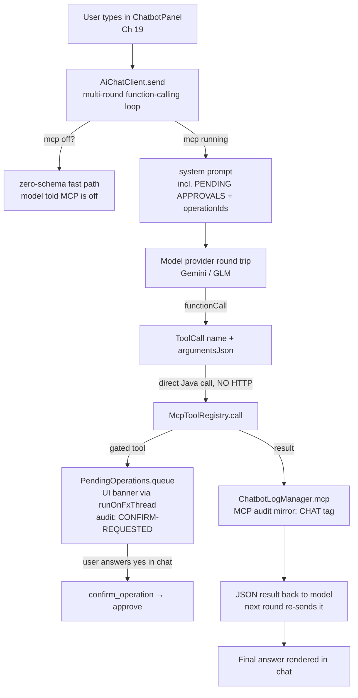

# Chapter 18 — The MCP Server: The App as an AI Tool Server

> **Part 11 of InvoiceStudio: Zero to Finished Product**
> Files covered in full this chapter: `mcp/McpServer.java`,
> `mcp/McpToolRegistry.java`, `mcp/McpConfig.java`, `mcp/McpSettingsPanel.java`,
> `mcp/McpArgs.java`, `mcp/McpEnsure.java`, `mcp/McpProjections.java`,
> `mcp/McpAuditLog.java`, `mcp/PendingOperations.java`,
> `mcp/McpImageResult.java`, `mcp/GuideContent.java`,
> `test/.../mcp/McpServerTest.java`, `test/.../mcp/McpEnsureHardeningTest.java`,
> `test/.../mcp/McpKnowledgeToolsTest.java`,
> `test/.../mcp/McpSurfaceExtensionTest.java`,
> `test/.../mcp/McpTemplateDesignTest.java`,
> `test/.../mcp/McpTransportCrudTest.java`,
> `test/.../service/AiChatFullSurfaceStubTest.java`,
> `test/.../service/AiChatLiveMcpTest.java` — all nineteen read and
> reproduced from the repository.
> Goal at the end: **an AI assistant anywhere on the machine can list,
> create, pay, report, design and print against InvoiceStudio's real books —
> and not one destructive change happens without the owner's explicit
> approval.**

---

## 1. Chapter goal

By the end of this chapter you will have built, exactly as the repository
has it:

1. **McpServer** — an embedded HTTP server bound to `127.0.0.1` only, speaking
   JSON-RPC 2.0 over the Model Context Protocol: `initialize`, `tools/list`,
   `tools/call`, bearer-token auth with a constant-time comparison, native
   image content blocks for template previews, and a lifecycle that starts
   and stops from the Settings tab and dies with the app.
2. **McpToolRegistry** — the largest class in the book (2,516 lines):
   **77 registered tools**, each with a JSON schema, a description and a
   safety classification, covering every corner of the app — buyers,
   suppliers, items, categories, transports, invoices, payments, purchases,
   expenses, expense accounts, stock, profitability, financial statements,
   daybook, templates, variables, PDF export, keyboard shortcuts, label
   printing, the Knowledge Hub, backup, identity and the server itself.
3. **McpEnsure** — the check-then-create layer that makes every create path
   *idempotent* (repeat-safe) and *race-safe*: missing dependencies are
   auto-created and reported in an `autoCreated` array, failures roll back,
   and a database unique index backstops the worst case.
4. **PendingOperations** — the approval gate: update and delete tools never
   execute directly; they queue a pending operation with a human-readable
   summary and wait for the owner to click Approve (or for the AI to call
   `confirm_operation` after the human says yes in chat).
5. **McpAuditLog** — a two-channel trail (an in-memory ring of 200 entries
   for the Settings tab, plus an append-only `mcp-audit.log` on disk) so the
   owner can always answer "what exactly did the AI do to my books?"
6. **McpProjections + McpArgs** — the read-model renderers and the
   argument-parsers extracted out of the registry so both stay testable.
7. **McpSettingsPanel** — the Settings → MCP Server tab: start/stop, port,
   auto-start, token regenerate/copy, one-click client configs for Cursor,
   VS Code and Claude Desktop, the pending-confirmation banner and the
   activity log.
8. **Six MCP test suites plus the two chat-loop suites** — real-HTTP
   protocol tests, hardening tests that fire eight threads at the same
   missing category, template round-trip tests that pin pixel output, and
   the stub-model harness that drives *all 77 tools* through the production
   chat loop.

And you will understand the one architectural fact that everything else
hangs on: **the tool registry has two front doors.** External AI clients
(Cursor, Claude, any MCP client) knock on the HTTP endpoint; the app's own
chatbot (Chapter 19) calls `McpToolRegistry.call(...)` directly as a plain
Java method. One registry, one safety model, two transports.

---

## 2. Story intro

For sixteen chapters the app has been a building with exactly one entrance:
the person at the keyboard. Every invoice, every payment, every template
tweak happened because a human clicked a button. That is a safe way to run a
business — and also a limiting one, because the person at the keyboard has
to *be* there for anything to happen.

Now imagine the same building installing a **reception desk**. Behind the
counter stands a clerk with a printed catalogue of every service the
building offers: "create a buyer", "record a payment", "give me the stock
report", "render this template as a picture". Anyone who walks up — a
delivery partner, an accountant's assistant, a phone call from the owner's
car — can point at a service in the catalogue and ask for it. The clerk does
three things before lifting a finger: checks the visitor's *badge* (the
bearer token), looks up the service's *card* (the JSON schema describing
what arguments it takes), and — for anything that alters existing records —
slides the request into a *tray marked "waiting for the owner's
signature"* instead of acting on it.

That desk is the MCP server. **MCP** stands for *Model Context Protocol*, an
open standard that lets AI assistants discover and invoke tools the same way
a browser discovers and calls web APIs. The catalogue is `tools/list`; the
service request is `tools/call`; the badge check is the Authorization
header. The clerk's ledger — every request, every approval, every refusal —
is the audit log. And the *same* clerk serves a second kind of visitor who
doesn't walk in at all: the app's built-in assistant (Chapter 19) simply
leans over the counter from inside the building and calls the registry
directly, no HTTP involved.

The beauty of the arrangement is that nothing new is invented. The desk
doesn't keep its own books — it calls the exact same `DataManager` (Chapter
8) and DAOs (Chapters 4–5) the UI calls, runs the exact same
`BillingService.computeTotals` (Chapter 12), renders previews through the
exact same engine as PDF export (Chapter 16). An AI that asks InvoiceStudio
for something receives precisely what a human clicking buttons would have
gotten — including the GST math, the stock movements, and the guard rails.

---

## 3. Concepts first

**MCP — Model Context Protocol.** A protocol (an agreed message format)
that standardizes how an AI client talks to a *tool server*. The client
sends JSON over HTTP, the server answers JSON. Three methods matter:
`initialize` (handshake — "who are you, what protocol version do you
speak"), `tools/list` ("give me your full catalogue with argument schemas"),
and `tools/call` ("run service X with these arguments"). InvoiceStudio
implements `PROTOCOL_VERSION = "2024-11-05"`. Because the protocol is
public, the app's books become usable from Cursor, VS Code, Claude Desktop
or any MCP-aware client without writing a line of client-specific code.

**JSON-RPC 2.0.** The wire format under MCP. Every request is a JSON object
`{"jsonrpc":"2.0", "id":1, "method":"tools/call", "params":{...}}` and every
response carries the same `id` back plus either a `result` or an `error`
object with a numeric `code`. The code numbers are conventional:
`-32601` method not found, `-32700` parse error, `-32603` internal error.
InvoiceStudio adds application codes `-32001` (unauthorized), `-32002`
(validation) and `-32003` (tool failure). Note the subtlety the tests pin:
protocol errors like unknown methods get real HTTP error statuses where
natural, but a *tool that fails validation* still returns HTTP 200 with a
JSON-RPC error body — the transport succeeded; the *request* failed.

**Embedded HTTP server.** Java ships with `com.sun.net.httpserver.HttpServer`
in the JDK itself — no web framework, no dependency. You create it on an
address, register a *context* (a URL path mapped to a handler), give it a
thread pool, and it serves. InvoiceStudio creates one on
`127.0.0.1:7800` (configurable) with a fixed pool of 4 threads and a single
context, `/mcp`. **Binding to 127.0.0.1 is the security keystone**: that
address is the machine's *loopback* — visible only to software running on
the same computer. The app's external network interfaces are never opened;
nothing outside the machine can even connect.

**Bearer tokens.** An *access token* the client must present on every
request: `Authorization: Bearer <token>`. It is not a username or password —
it is a single opaque secret generated once (24 random bytes, Base64-URL
encoded to 32 characters via `SecureRandom`) and stored in
`mcp-server.json` in the per-user app data directory. The comparison is
done with a *constant-time* algorithm (more in Step 4) so a theoretical
timing attack can't discover the token byte by byte.

**Tool schemas.** Each tool advertises a JSON Schema describing its
arguments — names, types, human-readable descriptions. AI clients show
these to the model, which is how a language model "knows" that
`create_bill` takes `items` as an array of lines. The schema is
documentation *and* contract at once.

**Idempotency and check-then-create.** *Idempotent* means "safe to repeat":
calling it twice leaves the same state as calling it once. This matters
enormously for AI callers, because models retry, hallucinate duplicates,
and re-issue near-identical requests. The registry's create tools follow a
**check-then-create** discipline: look for the entity by id and/or
case-insensitive name first; if found, return it unchanged with
`existed=true`; if missing, create it *and list what you created* in an
`autoCreated` array — never silently link to something that wasn't there
before. The class `McpEnsure` implements this for categories, buyers,
suppliers, items, transports, templates and variables.

**Race safety and striped locks.** The HTTP pool has 4 threads, so two
calls can hit the same missing category simultaneously. The classic
check-then-act race ("neither found it → both create it") is prevented two
ways: a **striped lock** — an array of 64 plain lock objects, each request
locking the one its key hashes to, so unrelated keys proceed in parallel
while identical keys serialize — and a **database UNIQUE index** on
`categories(user_id, name)` as the final backstop. A thread that loses the
race re-reads the winner's row and reports `matchedBy: "race"`.

**Compensation (rollback of auto-created dependencies).** If
`create_bill` auto-creates a buyer and then the bill itself fails to save,
the buyer must not dangle. The create flows track every auto-creation in a
`List<McpEnsure.Tracked>` and call `McpEnsure.rollback(...)` on failure —
*sagas in miniature*: a multi-step write with compensating deletes.

**Approval workflows.** Tools are classified at registration with two
booleans: `mutates` (writes anything) and `destructive` (modifies or
removes existing records). Read tools and pure-additive creates run
immediately. Destructive tools never run on request — `confirmable()`
queues a `PendingOp` (id, tool, summary, detail, args, and the actual
`Runnable`) and returns `requiresConfirmation: true`. The operation
executes only when the owner clicks Approve in Settings → MCP Server, or
the AI relays a `confirm_operation` call *after* the human agreed in chat.

**Audit logs.** An *append-only* record of operations. InvoiceStudio writes
two copies: a bounded in-memory `ArrayDeque` (newest 200 entries, shown
live in the Settings tab) and a disk file `mcp-audit.log` (one timestamped
line per event, appended forever). Both are *best effort* — a failed disk
write is swallowed because the audit trail must never break the business
operation it is watching.

**Read-model projections.** The registry's list tools don't return raw
models; `McpProjections` renders them into flat maps of display-ready
fields (a bill summary with its paid-so-far, a supplier with its live
payable balance). This keeps token-hungry AI responses small and stops
internal model churn from leaking into a public surface.

---

## 4. Files in this chapter

| # | File | Lines | Role |
|---|---|---|---|
| 1 | `mcp/McpConfig.java` | 75 | Persisted server config: port, auto-start, bearer token |
| 2 | `mcp/McpAuditLog.java` | 62 | Two-channel append-only audit trail (memory + disk) |
| 3 | `mcp/PendingOperations.java` | 121 | Approval queue for destructive operations |
| 4 | `mcp/McpServer.java` | 306 | Embedded HTTP JSON-RPC endpoint (initialize / tools/list / tools/call) |
| 5 | `mcp/McpArgs.java` | 76 | Lenient argument parsers — "parse at the edge, trust inside" |
| 6 | `mcp/McpImageResult.java` | 33 | Image + metadata tool result (native MCP image block) |
| 7 | `mcp/GuideContent.java` | 38 | Loads APP_GUIDE / MCP_SERVER / TEMPLATE_DESIGN docs from resources |
| 8 | `mcp/McpEnsure.java` | 381 | Check-then-create, striped locks, rollback compensation |
| 9 | `mcp/McpToolRegistry.java` | 2,516 | 77 tools: catalogue, dispatch, creators, gates, projections |
| 10 | `mcp/McpProjections.java` | 233 | Read-model renderers + report builders (extracted from registry) |
| 11 | `mcp/McpSettingsPanel.java` | 337 | Settings tab: start/stop, token, client configs, approvals, audit |
| 12 | `test/.../mcp/McpServerTest.java` | 539 | Real-HTTP protocol + auth + business flow end-to-end |
| 13 | `test/.../mcp/McpEnsureHardeningTest.java` | 607 | Idempotency both branches, races, rollback, DB backstop |
| 14 | `test/.../mcp/McpKnowledgeToolsTest.java` | 369 | Knowledge CRUD, pay_bill, update_variable, prompt bridge |
| 15 | `test/.../mcp/McpSurfaceExtensionTest.java` | 257 | Shortcuts, batch PDF export, label state, account lifecycle |
| 16 | `test/.../mcp/McpTemplateDesignTest.java` | 364 | Design guide, lossless round-trip, PNG previews, warnings |
| 17 | `test/.../mcp/McpTransportCrudTest.java` | 173 | Transport update + delete with buyer-reference guard |
| 18 | `test/.../service/AiChatFullSurfaceStubTest.java` | 744 | All 77 tools through the real chat loop (stub model) |
| 19 | `test/.../service/AiChatLiveMcpTest.java` | 388 | Opt-in live-model rounds that must execute real MCP tools |

Depends on: `DataManager` (Ch 8 — the one data engine both front doors
share), the DAOs (Ch 4–5), `BillingService` / `PurchaseService` (Ch 12–13:
totals, batch PDF export), `FinancialService` / `ExpenseAnalytics` (Ch 14),
`TemplatePreviewService` (Ch 16: `renderPng` — Chapter 16 forward-referenced
exactly this call), `LabelPrintService` + `BulkPrintStateStore` (Ch 17),
`KnowledgeRepository` (Ch 20 preview), `ShortcutManager` (Ch 9),
`AuthSessionManager` (Ch 10), `AppDirs` / `AppLog` (Ch 2), `UiTheme` /
`Toast` (Ch 9).

Used by: `AiChatClient` and `ChatbotPanel` (Ch 19 — the direct-call second
front door), `StudioApp` (auto-start at launch, `shutdown()` at close),
and any external MCP client the owner pairs via the copied config JSON.

---

## 5. Step-by-step build

We build in dependency order: configuration first (everything reads it),
then the two quiet ledgers (audit log, pending queue), then the HTTP
endpoint, then the parsing helpers and small value types, then the
check-then-create layer, and finally the big registry — organized by tool
family — with its settings panel and the eight suites that pin it all down.

### Step 1 — `mcp/McpConfig.java` (a small persistent settings sheet)

```java
public final class McpConfig {

    private static final String FILE_NAME = "mcp-server.json";
    private static final ObjectMapper MAPPER = new ObjectMapper().enable(SerializationFeature.INDENT_OUTPUT);

    private int port = 7800;
    private boolean autoStart = false;
    private boolean requireToken = true;
    private String token = "";

    public static McpConfig load() {
        try {
            File f = file();
            if (f.exists()) {
                return MAPPER.readValue(f, McpConfig.class);
            }
        } catch (Exception ignored) {
            AppLog.debug(ignored);
            // fall through to defaults
        }
        McpConfig cfg = new McpConfig();
        cfg.save();
        return cfg;
    }
```

Four fields, persisted as pretty-printed JSON next to the rest of the
app's data (`AppDirs.dataDir()`, Chapter 2). Three decisions worth naming:

- **Fail-soft defaults.** A corrupted `mcp-server.json` doesn't stop the
  app: the exception is logged, defaults are used, and the defaults are
  written back so the file heals itself on next load.
- **The port setter is a clamp**, not a pass-through:
  `this.port = Math.max(1024, Math.min(65535, port))` — ports below 1024
  are privileged on Unix, so the UI can never persist an unbindable value.
- **`requireToken` defaults to true.** The permissive path is the opt-in,
  never the default — the exact inverse of how security bugs happen.

```java
    /** Generates a new 32-character URL-safe random token. */
    public static String generateToken() {
        byte[] raw = new byte[24];
        new SecureRandom().nextBytes(raw);
        return Base64.getUrlEncoder().withoutPadding().encodeToString(raw);
    }
```

24 bytes of `SecureRandom` entropy → 32 Base64-URL characters. URL-safe
encoding matters because the token ends up inside copied JSON config
snippets and HTTP headers where `+` and `/` would need escaping.

> **NOTE (kept faithful):** the token is stored in *plaintext* in
> `mcp-server.json` inside the user's own app-data directory. For a
> localhost-only server this is a reasonable trade (the file is already
> as private as the user's home directory), but it is worth knowing the
> secret is on disk — Section 8 sketches a vault-backed alternative.

### Step 2 — `mcp/McpAuditLog.java` (the ledger behind the counter)

```java
public final class McpAuditLog {

    private static final int MEMORY_LIMIT = 200;
    private static final Object LOCK = new Object();
    private static final Deque<String> ENTRIES = new ArrayDeque<>(MEMORY_LIMIT);

    private McpAuditLog() {}

    public static void log(String line) {
        String stamped = Instant.now() + "  " + line;
        synchronized (LOCK) {
            ENTRIES.addLast(stamped);
            while (ENTRIES.size() > MEMORY_LIMIT) ENTRIES.removeFirst();
        }
        appendToDisk(stamped);
    }
```

One static class, two channels, one method:

- **Memory channel** — a synchronized `ArrayDeque` used as a ring: add to
  the tail, drop from the head once 200 lines pile up. The Settings tab
  reads `recent()`, which snapshots the deque under the same lock, so a
  UI refresh can never iterate while an HTTP thread appends.
- **Disk channel** — `appendToDisk` opens `mcp-audit.log` in
  CREATE + APPEND mode and writes one timestamped line. Failures
  (`IOException | SecurityException`) are deliberately swallowed: the
  comment says it outright — *"audit-to-disk is best effort; the in-memory
  copy is authoritative for the UI"*. A full disk must not stop an
  approved payment from executing.

The line vocabulary is a tiny domain language you will meet again in the
tests: `[SERVER] started/stopped`, `[AUTH] rejected request`, `[TOOL] name args`,
`[TOOL-ERROR]`, `[CONFIRM-REQUESTED]`, `[CONFIRMED]`, `[REJECTED]`, and —
from the chatbot track in Chapter 19 — `[CHAT]` / `[CHAT-ERROR]`.

> **NOTE (kept faithful):** every single log line re-opens the file and
> appends. That is one `Files.write` syscall per event — simple and
> crash-safe (no buffered writer can lose lines it never held), at the
> cost of I/O on the hot path. See Section 8 for the async alternative.

### Step 3 — `mcp/PendingOperations.java` (the signature tray)

```java
    /** Flow: an AI calls a mutating tool → the call does NOT execute; instead a
     * {@link PendingOp} is stored and a confirmation banner appears in the
     * Settings → MCP Server tab showing exactly what will happen. The user
     * clicks Approve (or the AI calls {@code confirm_operation} with the token)
     * → the operation executes. Reject/Deny/expire → discarded. */
```

A `PendingOp` bundles everything needed to *explain* and *later execute*
one dangerous request:

```java
    public static final class PendingOp {
        private final String id;
        private final String tool;
        private final String summary;
        private final String detail;
        private final Map<String, Object> args;
        private final Runnable action;
        private final Instant createdAt = Instant.now();
        ...
        /** Executes the queued action. */
        public void approve() { action.run(); }
    }
```

The elegant part is the `Runnable action`: the *entire* body of the
dangerous operation is captured as a lambda at request time and executed
only on approval. There is no replay, no re-parsing, no drift between what
was shown to the owner and what runs — the very lambda whose summary the
owner read is the code that runs.

Queueing and resolving:

```java
    public static String queue(String tool, String summary, String detail,
                               Map<String, Object> args, Runnable action) {
        String id = "op_" + Long.toHexString(System.currentTimeMillis()) + "_" + (SEQ++);
        PendingOp op = new PendingOp(id, tool, summary, detail, args, action);
        PENDING.put(id, op);
        McpAuditLog.log("[CONFIRM-REQUESTED] " + tool + " — " + summary + " (id=" + id + ")");
        McpServer.runOnFxThread(() -> {
            synchronized (UI_LOCK) {
                if (listener != null) listener.onPendingChanged();
            }
        });
        return id;
    }

    /** Approves and executes. Returns false if unknown/expired. */
    public static boolean approve(String id) {
        PendingOp op = PENDING.remove(id);
        if (op == null) return false;
        McpAuditLog.log("[CONFIRMED] " + op.getTool() + " (id=" + id + ") — executing");
        op.approve();
        notifyUi();
        return true;
    }
```

`PENDING` is a `ConcurrentHashMap`, so the approve/reject calls can come
from the JavaFX thread *or* an HTTP worker thread without corruption.
`approve` removes *first*, then executes — an operation can therefore be
approved exactly once; a second `confirm_operation` with the same id gets
`false`. `reject` removes without running. `McpServer.stop()` calls
`clearAll()`: un-approved operations die with the server (Order 30 of
`McpServerTest` pins this — "stop must discard unapproved ops").

> **NOTE (kept faithful):** `SEQ++` on a plain `static long` is not
> atomic, and `queue()` runs on the 4-thread HTTP pool. Two simultaneous
> queues could in principle mint the same id (the timestamp prefix makes
> it vanishingly unlikely). The `ConcurrentHashMap.put` would then
> silently overwrite one op. Section 8 sketches the one-line fix.
>
> **GAP (faithfully preserved):** pending operations never *expire*.
> There is no TTL: an op queued and forgotten lives until approved,
> rejected, or the server stops. The UI banner keeps it visible, so this
> is a tidiness gap rather than a safety one — but a stale
> "delete buyer op_x" from yesterday can still be approved tomorrow.

### Step 4 — `mcp/McpServer.java` (the reception desk itself)

Static, final, private constructor — the whole server is one stateful
utility class. The fields tell the lifecycle story:

```java
public final class McpServer {

    public static final String SERVER_NAME = "InvoiceStudio MCP";
    public static final String PROTOCOL_VERSION = "2024-11-05";

    private static final ObjectMapper MAPPER = new ObjectMapper();
    private static final AtomicBoolean RUNNING = new AtomicBoolean(false);
    private static final List<Consumer<String>> STATUS_LISTENERS = new CopyOnWriteArrayList<>();

    private static volatile HttpServer server;
    private static volatile int boundPort = -1;
    private static volatile String boundToken = "";
```

`volatile` on every field the handler threads read, `AtomicBoolean` for the
running flag, `CopyOnWriteArrayList` for listeners (UI subscriptions may
change while notifications fire). `start` is `synchronized` so double
clicks can't bind twice:

```java
    /** Starts the server on the configured port. Returns an error message on failure, null on success. */
    public static synchronized String start(McpConfig config) {
        if (RUNNING.get()) stop();
        try {
            HttpServer http = HttpServer.create(new InetSocketAddress("127.0.0.1", config.getPort()), 0);
            http.createContext("/mcp", exchange -> handle(exchange, config));
            http.setExecutor(Executors.newFixedThreadPool(4));
            http.start();

            server = http;
            boundPort = config.getPort();
            boundToken = config.getToken();
            RUNNING.set(true);
            McpAuditLog.log("[SERVER] started on http://127.0.0.1:" + boundPort + "/mcp");
            notifyStatus();
            return null;
        } catch (Exception e) {
            McpAuditLog.log("[SERVER] start FAILED on port " + config.getPort() + ": " + e.getMessage());
            return e.getMessage() != null ? e.getMessage() : e.getClass().getSimpleName();
        }
    }
```

Five things to learn here:

- **`new InetSocketAddress("127.0.0.1", port)`** — the loopback-only bind.
  This one constructor argument is the entire network perimeter.
- **One context.** Every request under `/mcp` goes to the same `handle`
  lambda; there is no routing table because JSON-RPC routes by *method
  name inside the body*, not by URL.
- **A fixed pool of 4.** Small on purpose: the handlers call into SQLite
  via `DataManager`, and the app's other write paths are single-threaded
  FX. Four concurrent tool calls is generous; four hundred would be a
  denial of service against the app's own database.
- **Errors return a message string, not an exception** — the caller (UI
  button or auto-start) shows it as a Toast or stderr line; the app never
  crashes because port 7800 was taken.
- **Start is restart.** `if (RUNNING.get()) stop();` means "apply new
  config" and "start" are the same operation.

`stop()` and the app-close hook:

```java
    /** Stops the server and discards any un-approved pending operations. */
    public static synchronized void stop() {
        HttpServer http = server;
        server = null;
        RUNNING.set(false);
        boundPort = -1;
        if (http != null) {
            http.stop(0);
        }
        PendingOperations.clearAll();
        McpAuditLog.log("[SERVER] stopped");
        notifyStatus();
    }

    /** Called from StudioApp.stop() — guarantees the server dies with the app. */
    public static void shutdown() {
        if (RUNNING.get()) stop();
    }
```

`StudioApp.startMcpIfConfigured()` (shown in Section 6) reads the config at
launch and calls `start` when `autoStart` is set; `StudioApp.stop()` calls
`shutdown()`. The server therefore *cannot* outlive the app — the
reception desk closes when the building closes, by construction.

Now the request handler — the heart of the chapter:

```java
    private static void handle(HttpExchange exchange, McpConfig config) throws IOException {
        try {
            if (!"POST".equalsIgnoreCase(exchange.getRequestMethod())) {
                sendJson(exchange, 405, MAPPER.writeValueAsString(Map.of("error", "POST only")));
                return;
            }

            // ---- Auth ----
            if (config.isRequireToken()) {
                String auth = exchange.getRequestHeaders().getFirst("Authorization");
                String expected = "Bearer " + config.getToken();
                if (auth == null || !constantTimeEquals(auth, expected) || config.getToken().isBlank()) {
                    McpAuditLog.log("[AUTH] rejected request (bad or missing bearer token)");
                    sendJson(exchange, 401, rpcError(null, -32001, "Unauthorized: missing or invalid bearer token"));
                    return;
                }
            }
```

The auth gate is one `if` with three failure conditions joined: no header,
wrong token, or a blank configured token. The third condition closes a
classic hole — if the owner generated no token but left "require token"
on, *every* request must fail rather than comparing against `""` and
letting an empty header through.

Constant-time comparison — the why, because it is the only place in the
book that needs it:

```java
    private static boolean constantTimeEquals(String a, String b) {
        if (a == null || b == null || a.length() != b.length()) return false;
        int diff = 0;
        for (int i = 0; i < a.length(); i++) diff |= a.charAt(i) ^ b.charAt(i);
        return diff == 0;
    }
```

`String.equals` returns `false` at the *first* differing character — which
means the time it takes leaks how many leading characters matched. Over
millions of requests, an attacker on the same machine could measure that
leak and reconstruct the token one byte at a time. XOR-ing every character
into one accumulator makes the loop's duration depend only on the length,
never the content. On a loopback-only server this is defense in depth, and
it costs five lines.

Method dispatch:

```java
            Object id = req.get("id");
            String method = req.get("method") != null ? String.valueOf(req.get("method")) : "";
            Map<String, Object> params = castMap(req.get("params"));

            Object result;
            switch (method) {
                case "initialize" -> {
                    Map<String, Object> info = new LinkedHashMap<>();
                    info.put("protocolVersion", PROTOCOL_VERSION);
                    info.put("capabilities", Map.of("tools", Map.of("listChanged", false)));
                    info.put("serverInfo", Map.of("name", SERVER_NAME, "version", appVersion()));
                    result = info;
                }
                case "notifications/initialized", "ping" -> result = Map.of();
                case "tools/list" -> {
                    List<Map<String, Object>> tools = new java.util.ArrayList<>();
                    for (McpToolRegistry.ToolDef t : McpToolRegistry.tools()) {
                        Map<String, Object> tm = new LinkedHashMap<>();
                        tm.put("name", t.name);
                        tm.put("description", (t.destructive ? "[CONFIRMATION REQUIRED] " : "")
                                + (t.mutates ? "[WRITES] " : "") + t.description);
                        tm.put("inputSchema", t.inputSchema);
                        tools.add(tm);
                    }
                    result = Map.of("tools", tools);
                }
```

`tools/list` is where the safety model becomes *legible to the AI*: every
destructive tool's description is prefixed `[CONFIRMATION REQUIRED]` and
every writing tool's with `[WRITES]`. A language model reading the
catalogue literally sees the warning before it ever sees the tool — the
registry's classification doubles as prompt engineering. (`"listChanged":
false` in the capabilities is honest: the catalogue is static for the
lifetime of the JVM, so clients should not expect change notifications.)

`tools/call` — execute, wrap, audit:

```java
                case "tools/call" -> {
                    String name = String.valueOf(params.getOrDefault("name", ""));
                    Map<String, Object> args = castMap(params.get("arguments"));
                    McpAuditLog.log("[TOOL] " + name + " " + abbreviate(args));
                    try {
                        Object out = McpToolRegistry.call(name, args);
                        if (out instanceof McpImageResult img) {
                            // Native MCP image content block (vision clients see the PNG) + text meta.
                            Map<String, Object> imageBlock = Map.of(
                                    "type", "image",
                                    "data", img.base64(),
                                    "mimeType", img.getMimeType());
                            String metaJson = img.getMeta() != null
                                    ? MAPPER.writerWithDefaultPrettyPrinter().writeValueAsString(img.getMeta())
                                    : "{}";
                            Map<String, Object> textBlock = Map.of("type", "text", "text", metaJson);
                            result = Map.of("content", List.of(imageBlock, textBlock));
                        } else {
                            result = Map.of("content", List.of(Map.of("type", "text", "text",
                                    out instanceof String s ? s : MAPPER.writerWithDefaultPrettyPrinter()
                                            .writeValueAsString(out))));
                        }
                    } catch (IllegalArgumentException e) {
                        McpAuditLog.log("[TOOL-ERROR] " + name + ": " + e.getMessage());
                        sendJson(exchange, 200, rpcError(id, -32002, e.getMessage()));
                        return;
                    } catch (Exception e) {
                        McpAuditLog.log("[TOOL-ERROR] " + name + ": " + e);
                        sendJson(exchange, 200, rpcError(id, -32003, "Tool failed: " + e.getMessage()));
                        return;
                    }
                }
```

The whole registry is one method call away — `McpToolRegistry.call(name,
args)`. The wrapping rules implement MCP's *content blocks*: text results
become one `{type:"text"}` block; an `McpImageResult` (Step 6) becomes an
`{type:"image"}` block with Base64 data *plus* a text block of metadata,
so vision-capable clients see the actual PNG while text-only clients still
get the page size and warnings. Errors keep the id (so the client can
correlate) and split by exception type: `IllegalArgumentException` is the
registry's validation voice (code `-32002`, the raw message shown to the
model); anything else is a server-side failure (code `-32003`).

> **NOTE (kept faithful):** unknown methods return HTTP 200 with the
> JSON-RPC error `-32601` ("Method not found"), while auth failures return
> HTTP 401 and body-parse failures return HTTP 400 — the transport layer
> reports transport problems, the protocol layer reports protocol
> problems, and the tests pin all three.

One more piece of plumbing, and it explains how the UI stays live without
JavaFX leaking into tests:

```java
    /** Runs on the FX thread; silently no-ops when no JavaFX toolkit exists (tests/headless). */
    static void runOnFxThread(Runnable r) {
        try {
            Platform.runLater(r);
        } catch (IllegalStateException noToolkit) {
            // headless JVM (unit tests) — UI notifications are not applicable
        }
    }
```

`PendingOperations` and `McpServer` both notify listeners through this
helper. In the app it hops to the JavaFX thread; in the test JVM there is
no toolkit, `Platform.runLater` throws `IllegalStateException`, and the
catch swallows it. That single try/catch is why the entire MCP stack —
HTTP server included — runs unmodified under `mvn test`.

### Step 5 — `mcp/McpArgs.java` (parse at the edge, trust inside)

```java
/**
 * Argument-parsing helpers for MCP tool handlers (skill rule 4.3: parse at
 * the edge, trust inside). Extracted verbatim from {@link McpToolRegistry}.
 */
final class McpArgs {

    private McpArgs() {}

    static String str(Map<String, Object> m, String key) {
        if (m == null) return "";
        Object v = m.get(key);
        return v != null ? String.valueOf(v) : "";
    }

    static double dbl(Map<String, Object> m, String key, double def) {
        if (m == null) return def;
        Object v = m.get(key);
        if (v instanceof Number n) return n.doubleValue();
        try {
            return v != null ? Double.parseDouble(String.valueOf(v)) : def;
        } catch (NumberFormatException e) {
            return def;
        }
    }
```

JSON clients are messy: a model may send `"qty": 4` or `"qty": "4"`, or
omit the field entirely. `McpArgs` absorbs all of it: `str` stringifies
anything or returns `""`; `dbl` accepts a native number or a parseable
string and falls back to the default otherwise; `intVal` truncates a
double; `boolVal` accepts real booleans and `"true"`. The *handlers*
therefore never see a raw `Object` again — inside the registry every value
has already been coerced or defaulted. That is the meaning of the skill
rule in the header comment: untrusted input is converted exactly once, at
the boundary; the interior deals only in typed values.

Two more residents round the class out. `matches(query, fields...)` is the
case-insensitive *contains* filter behind every `list_*` tool's `query`
argument (a blank query matches everything, which is why omitting it lists
all rows). And `parseMethod(mode)` maps human payment words to the
`PaymentMethod` enum — including the generous synonyms an AI might type:

```java
    static PaymentMethod parseMethod(String mode) {
        if (mode == null) return PaymentMethod.CASH;
        return switch (mode.trim().toLowerCase(Locale.ROOT)) {
            case "upi" -> PaymentMethod.UPI;
            case "bank", "bank transfer", "neft", "rtgs", "imps" -> PaymentMethod.BANK_TRANSFER;
            case "cheque", "check" -> PaymentMethod.CHEQUE;
            case "card" -> PaymentMethod.CARD;
            default -> PaymentMethod.CASH;
        };
    }
```

### Step 6 — `mcp/McpImageResult.java` + `mcp/GuideContent.java` (two small load-bearing types)

```java
/**
 * A tool result that carries a binary image alongside structured metadata.
 *
 * <p>When a tool returns this type, the MCP server emits a native
 * {@code {type:"image", data, mimeType}} content block (so vision-capable
 * AI clients can see the picture directly) followed by a text block with
 * the metadata map (page size, warnings, element count, ...).</p>
 */
public final class McpImageResult {

    private final String mimeType;
    private final byte[] data;
    private final Map<String, Object> meta;

    public McpImageResult(String mimeType, byte[] data, Map<String, Object> meta) {
        this.mimeType = mimeType != null ? mimeType : "image/png";
        this.data = data != null ? data : new byte[0];
        this.meta = meta;
    }

    /** Base64 of the raw bytes (the value placed in the image content block). */
    public String base64() {
        return java.util.Base64.getEncoder().encodeToString(data);
    }
}
```

Thirty-three lines, one job: be the *return type* that tells the HTTP layer
"this result is a picture, wrap it as an image block". Without this type
the server would have to sniff every result; with it, `instanceof` in
`handle` decides. Today exactly one tool returns it —
`render_template_preview` (Step 12) — but the type is deliberately generic
for future visual outputs.

`GuideContent` is the knowledge feeder:

```java
/** Loads the embedded docs (APP_GUIDE.md / MCP_SERVER.md) from app resources. */
public final class GuideContent {

    private static final String GUIDE = "/docs/APP_GUIDE.md";
    private static final String MCP_DOCS = "/docs/MCP_SERVER.md";
    private static final String TEMPLATE_DESIGN = "/docs/TEMPLATE_DESIGN_GUIDE.md";

    /** Full application manual (what the app is, every feature, how to use it). */
    public static String appGuide() {
        return read(GUIDE);
    }

    private static String read(String resource) {
        try (InputStream in = GuideContent.class.getResourceAsStream(resource)) {
            if (in == null) return "Documentation resource missing: " + resource;
            return new String(in.readAllBytes(), StandardCharsets.UTF_8);
        } catch (Exception e) {
            return "Failed to load " + resource + ": " + e.getMessage();
        }
    }
}
```

Three markdown manuals ship *inside the jar* and are served as tool
results: `get_app_guide` (the full manual), `get_mcp_docs` (protocol +
safety model), `get_template_design_guide` (the design vocabulary). The
failure mode is telling: a missing resource returns the sentence
"Documentation resource missing: …" *as the tool result*, so an AI client
sees a readable explanation rather than an error code. Even the failure is
documentation.

### Step 7 — `mcp/McpEnsure.java` (check-then-create, races, rollback)

This is the class that makes AI-driven writes trustworthy. Its header
javadoc is essentially the design document:

```java
/**
 * Fast existence-lookup + check-then-create layer backing every MCP create path.
 *
 * <p><b>Contract (mirrors MCP_SERVER.md §"Check-then-create"):</b> before an
 * entity that references another entity by value/id is inserted, the reference
 * is resolved here; a missing dependency is auto-created with sane defaults and
 * reported to the caller via the tool response's {@code autoCreated} array.</p>
 *
 * <p><b>Race safety (Task 2):</b> the MCP server dispatches on a 4-thread
 * pool, so two calls can create the same missing dependency concurrently.
 * Every ensure*() takes a striped lock keyed by (type, normalized lookup)
 * around the check-then-insert window, and a DB-level UNIQUE index on
 * categories(user_id, name) backstops the path that matters most
 * (item → category). A loser of a race re-reads the winner's row and returns
 * it ({@code created=false, matchedBy="race"}).</p>
 */
```

The result type is a tiny immutable record-like class that the registry
shapes into JSON:

```java
    /** Result of one ensure call — shaped into the tool response by the registry. */
    public static final class Outcome {
        public final String id;
        public final String name;
        public final boolean created;
        public final String matchedBy; // "id" | "name" | "race" | null when created
        ...
        public java.util.Map<String, Object> asMap(String type) {
            java.util.Map<String, Object> m = new java.util.LinkedHashMap<>();
            m.put("type", type);
            m.put("id", id);
            m.put("name", name);
            if (matchedBy != null) m.put("matchedBy", matchedBy);
            return m;
        }
    }
```

Every `ensure` returns an `Outcome` that answers four questions: what is
its `id`, what is its `name`, did we just `create` it, and if not, how did
we match it (`"id"`, `"name"`, or `"race"`). The registry copies these
straight into the `autoCreated` array — so an AI that hears "category
'Cotton' auto-created" can verify it, and one that hears
`matchedBy: "race"` knows another concurrent call got there first.

The striped locks:

```java
    private static final Object[] LOCKS = new Object[64];
    static {
        for (int i = 0; i < LOCKS.length; i++) LOCKS[i] = new Object();
    }

    private static Object lockFor(String key) {
        return LOCKS[(key.hashCode() & 0x7fffffff) % LOCKS.length];
    }
```

Why 64 plain objects instead of one big lock? A single lock would
serialize *all* auto-creations — a buyer create in one thread would wait
behind a category create in another. Striping gives 64 independent locks;
identical keys (`"category|cotton"`) hash to the same stripe and
serialize, while unrelated keys usually don't collide. The
`& 0x7fffffff` masks off the sign bit so negative hash codes still land
inside the array.

And the pattern itself, once, in full — `ensureCategory`:

```java
    public static Outcome ensureCategory(DataManager dm, String idArg, String nameArg) {
        String id = safe(idArg);
        String name = safe(nameArg);
        if (id.isEmpty() && name.isEmpty()) return null;

        ItemCategory existing = findCategory(dm, id, name);
        if (existing != null) {
            boolean byId = id.isEmpty() || (existing.getId() != null && existing.getId().equalsIgnoreCase(id));
            return new Outcome(existing.getId(), existing.getName(), false, byId ? "id" : "name");
        }

        String key = "category|" + (name.isEmpty() ? id : name).toLowerCase(Locale.ROOT);
        synchronized (lockFor(key)) {
            existing = findCategory(dm, id, name); // double-checked inside lock
            if (existing != null) {
                return new Outcome(existing.getId(), existing.getName(), false, "race");
            }
            ItemCategory c = new ItemCategory();
            c.setId(id.isEmpty() ? newId("cat_", 10) : sanitizeId(id, "cat_", 10));
            c.setName(name.isEmpty() ? sanitizeId(id, "", 40) : name);
            dm.saveCategory(c);
            return new Outcome(c.getId(), c.getName(), true, null);
        }
    }
```

Read it as a five-act play: (1) nothing requested → return `null`, the
registry treats that as "no dependency"; (2) fast path — look it up
unsynchronized and return `matchedBy` id/name if found (this is the 99%
case and touches nothing mutable); (3) take the *striped* lock and
**re-check inside** (double-checked locking — the classic pattern, safe
here because the map read is effectively atomic); (4) still missing →
create with defaults; (5) if a caller *supplied* an id for the missing
entity, that id is used — which is exactly what kills the dangling
`categoryId` bug: a ghost id becomes a real row rather than a broken
reference.

The defaults the created rows receive match what the desktop UI would
have written — the javadoc says so: *"auto-created dependencies receive
the same field defaults the desktop UI uses (empty strings for contact
fields, 0 for money/stock, generated prefixed ids matching each model's
convention: cat_ / byr_ / sup_ / it_ / trn_)."* The id sanitiser is the
last line of defense:

```java
    /** Accepts caller-supplied ids only when they are safe; otherwise generates a fresh one. */
    private static String sanitizeId(String raw, String prefix, int hexChars) {
        String id = raw.trim();
        if (id.matches("[A-Za-z0-9_.-]{1,64}")) return id;
        return newId(prefix, hexChars);
    }
```

A model-supplied id survives only if it is ≤ 64 chars of letters, digits,
underscore, dot or dash; anything exotic (or too long) is replaced by a
generated id. The database never sees a JSON-injected weird value.

Finally, compensation — the undo half of the contract:

```java
    /** One tracked auto-creation, for rollback if the primary insert fails. */
    public record Tracked(String type, String id) {}

    /** Deletes only the dependencies this call auto-created. Never throws. */
    public static void rollback(DataManager dm, List<Tracked> created) {
        if (created == null) return;
        for (Tracked t : created) {
            try {
                switch (t.type()) {
                    case "category" -> dm.deleteCategory(t.id());
                    case "buyer" -> dm.buyers().deleteBuyer(t.id());
                    case "supplier" -> dm.suppliers().deleteSupplier(t.id());
                    case "item" -> dm.items().deleteItem(t.id());
                    default -> { }
                }
            } catch (Exception ignored) {
            AppLog.debug(ignored);
                // compensation is best-effort; the original error is propagated
            }
        }
    }
```

Only *this call's* creations are deleted — never entities that already
existed (the create flows add to the `Tracked` list only when
`outcome.created`). And compensation "never throws": if a rollback delete
fails, the original exception from the primary insert still wins, so the
caller learns the real reason the operation failed.

> **NOTE (kept faithful):** the odd indentation of the
> `AppLog.debug(ignored); }` line inside `rollback` is in the source — a
> leftover of the verbatim extraction from `McpToolRegistry`. It compiles
> and behaves correctly; it just reads a little crooked.

The five `find*` lookups are deliberately cheap: they scan `DataManager`'s
in-memory caches (Chapter 8) or do one indexed id lookup on the small
directory tables — "Lookups run on every tool call, so they never trigger
cache invalidation or extra I/O beyond one SELECT at worst."

### Step 8 — `mcp/McpToolRegistry.java`, part 1: the catalogue and its safety classes

The largest file in the book. Its opening javadoc *is* the safety model,
and the whole class hangs off two nested ideas — a `ToolDef` and a static
catalogue:

```java
/**
 * The MCP tool surface: every capability of the InvoiceStudio UI exposed as
 * a typed tool with a JSON schema.
 *
 * <p>Safety model (mirrors MCP_SERVER.md):</p>
 * <ul>
 *   <li>Read tools execute immediately.</li>
 *   <li>Create tools execute immediately (they only add records).</li>
 *   <li>Update/delete tools never run directly — they queue a
 *       {@link PendingOperations.PendingOp} and return
 *       {@code requiresConfirmation}; execution happens only after the user
 *       approves in Settings → MCP Server (or via {@code confirm_operation}).</li>
 * </ul>
 */
public final class McpToolRegistry {

    /** JSON schema of one tool (sent in tools/list). */
    public static final class ToolDef {
        public final String name;
        public final String description;
        public final Map<String, Object> inputSchema;
        public final boolean mutates;
        public final boolean destructive;

        ToolDef(String name, String description, Map<String, Object> inputSchema,
                boolean mutates, boolean destructive) {
            ...
        }
    }

    private static final ObjectMapper MAPPER = new ObjectMapper();
    private static final FinancialService FIN = new FinancialService();

    private McpToolRegistry() {}

    private static final List<ToolDef> TOOLS = buildTools();

    public static List<ToolDef> tools() {
        return TOOLS;
    }
```

The catalogue is built **once**, in a static initializer, and served
read-only forever. `mutates` and `destructive` are the two booleans the
entire safety model rests on: `tools/list` turns them into the
`[WRITES]` / `[CONFIRMATION REQUIRED]` prefixes; `confirmable()` (Step 14)
turns the second one into the actual gate.

Registration reads like a typed DSL — this is the buyers family:

```java
        // --- Buyers ---
        t.add(new ToolDef("list_buyers", "List all buyers/customers (Sundry Debtors).",
                obj(
                        "query", str("Optional search text matched against name, phone, GSTIN, city"),
                        "limit", num("Max rows (default 100)")), false, false));
        t.add(new ToolDef("create_buyer", "Create a buyer/customer. Check-then-create: the default transport (transportId and/or transportName) is resolved first and AUTO-CREATED if missing — listed in response.autoCreated. Idempotent by name: if a buyer with the same name already exists it is returned unchanged (existed=true) instead of duplicated; use update_buyer to change it.",
                obj(
                        "name", str("Buyer/firm name (required)"),
                        "phone", str("Phone"),
                        "gst", str("15-char GSTIN"),
                        ...
                        "transportId", str("Default transport id"),
                        "transportName", str("Default transport name (auto-created if missing)")), true, false));
        t.add(new ToolDef("update_buyer", "Update an existing buyer: ... Requires user confirmation.",
                obj("id", str("Buyer id"),
                        ...), true, true));
        t.add(new ToolDef("delete_buyer", "Delete a buyer permanently. Requires user confirmation.",
                obj("id", str("Buyer id")), true, true));
```

Notice how much contract lives in the description strings: "Idempotent by
name… returned unchanged (existed=true) instead of duplicated; use
update_buyer to change it." These sentences are how a language model
learns *not* to retry a create as an update — the description is doing
the work a human would do by reading the manual. `create_buyer` is
`mutates=true, destructive=false` (it only adds); both `update_buyer` and
`delete_buyer` are `true, true` (they change or remove existing records).

The schema builder and its four "type hint" helpers:

```java
    private static Map<String, Object> obj(Object... kv) {
        Map<String, Object> props = new LinkedHashMap<>();
        Map<String, Object> schema = new LinkedHashMap<>();
        schema.put("type", "object");
        for (int i = 0; i + 1 < kv.length; i += 2) {
            String key = String.valueOf(kv[i]);
            String desc = String.valueOf(kv[i + 1]);
            Map<String, Object> p = new LinkedHashMap<>();
            p.put("type", key.equals("items") ? "array" : key.equals("limit") ? "integer" : "string");
            p.put("description", desc);
            props.put(key, p);
        }
        schema.put("properties", props);
        return schema;
    }

    private static String str(String s) { return s; }
    private static String num(String s) { return s; }
    private static String bool(String s) { return s; }
    private static String arr(String s) { return s; }
```

> **ISSUE (faithfully preserved):** `obj()` types every property as
> `"string"` unless the *key* happens to be named `items` or `limit` —
> the `num(...)`, `bool(...)` and `arr(...)` wrappers are identity
> functions that carry no type information. So `rate` is declared
> `"type":"string"` in the schema even though it is documented as a
> number. Nothing breaks at runtime — `McpArgs.dbl` happily parses a JSON
> string `"850"` or a real number — and strict-schema clients tolerate it,
> but the schemas *under-describe* the surface. Section 8 sketches the
> typed fix; until then, the descriptions (which are accurate) carry the
> contract.

The catalogue spans every feature the app has. The full 77-tool families,
as registered:

| Family | Tools | mutates / destructive mix |
|---|---|---|
| Discovery | `get_app_guide`, `get_mcp_docs`, `get_settings` | all read-only |
| Buyers | `list_buyers`, `create_buyer`, `update_buyer`, `delete_buyer` | 1 read, 1 create, 2 gated |
| Suppliers | `list_suppliers`, `create_supplier`, `update_supplier`, `delete_supplier` | 1 read, 1 create, 2 gated |
| Items | `list_items`, `create_item`, `update_item`, `delete_item` | 1 read, 1 create, 2 gated |
| Masters | `list_categories`, `create_category`, `update_category`, `delete_category`, `list_transports`, `create_transport`, `update_transport`, `delete_transport`, `list_templates`, `list_variables` | mixed |
| Template design | `get_template_design_guide`, `render_template_preview`, `get_template`, `create_template`, `update_template`, `duplicate_template`, `delete_template`, `create_variable`, `update_variable`, `delete_variable` | mostly read; 3 gated |
| Sales | `list_bills`, `get_bill`, `create_bill`, `update_bill_status`, `delete_bill`, `pay_bill` | 2 read, 2 create, 2 gated |
| Purchases | `list_purchases`, `create_purchase`, `pay_purchase`, `delete_purchase` | 1 read, 2 create, 1 gated |
| Expenses | `list_expenses`, `record_expense`, `delete_expense` | 2 read/create, 1 gated |
| Expense accounts | `list_expense_accounts`, `create_expense_account`, `rename_expense_account`, `expense_account_report`, `update_expense_account`, `delete_expense_account` | 3 read/create, 3 gated |
| Transactions | `list_transactions` | read-only |
| Reports | `stock_report`, `profitability_report`, `financial_summary`, `daybook` | all read-only |
| Export | `export_bills_pdf` | read-only (writes files, not records) |
| Shortcuts | `list_shortcuts`, `rebind_shortcut`, `reset_shortcut` | 1 read, 2 gated |
| Labels | `get_label_print_state`, `print_labels`, `list_label_prints` | read + print |
| Knowledge | `list_knowledge`, `get_knowledge`, `create_knowledge`, `update_knowledge`, `append_knowledge`, `delete_knowledge` | 3 read/create, 3 gated |
| Backup & identity | `create_backup`, `whoami` | create-only / read |
| System | `server_status`, `audit_log`, `confirm_operation` | read × 2, gated × 1 |

### Step 9 — `mcp/McpToolRegistry.java`, part 2: dispatch and the billing tools

Every tool registered above has exactly one dispatch line in `call(...)`:

```java
    /** Executes a tool call and returns the JSON/text result payload. */
    public static Object call(String name, Map<String, Object> args) throws Exception {
        DataManager dm = DataManager.get();
        switch (name == null ? "" : name) {
            // Discovery
            case "get_app_guide": return GuideContent.appGuide();
            case "get_mcp_docs": return GuideContent.mcpDocs();
            case "get_settings": return settingsMap(dm.getSettings());

            // Buyers
            case "list_buyers": return buyersMap(dm, str(args, "query"), intVal(args, "limit", 100));
            case "create_buyer": return createBuyer(dm, args);
            case "update_buyer": return confirmable("update_buyer", args, () -> {
                Buyer b = requireBuyer(dm, str(args, "id"));
                if (args.containsKey("name") && !str(args, "name").isBlank()) b.setName(str(args, "name").trim());
                ...
                // Default transport assignment — check-then-create, no dangling ids.
                McpEnsure.Outcome tr = McpEnsure.ensureTransport(dm,
                        strOr(args, "transportId", ""), strOr(args, "transportName", ""));
                if (tr != null) b.setDefaultTransportId(tr.id);
                dm.buyers().saveBuyer(b);
            });
            case "delete_buyer": return confirmable("delete_buyer", args, () -> dm.buyers().deleteBuyer(str(args, "id")));
```

Three lines of this excerpt carry the whole chapter's philosophy:

- `DataManager.get()` — the *same* JVM-wide engine the UI uses (Chapter
  8). There is no second data layer for AI; whatever the UI cached, the AI
  sees, and vice versa.
- `confirmable("update_buyer", args, () -> { ... })` — the dangerous work
  is *already written* as a lambda; the gate decides whether it runs now
  (never) or later (on approval).
- `requireBuyer(dm, ...)` — existence checked inside the action, so a
  queued op whose target vanished in the meantime fails loudly *at
  approval* instead of silently doing nothing. The hardening tests pin
  this exact timing ("approval of an unknown item id must fail loudly,
  not silently").

**create_bill** — the flagship create tool, and the fullest expression of
check-then-create + rollback:

```java
    @SuppressWarnings("unchecked")
    private static Map<String, Object> createBill(DataManager dm, Map<String, Object> args) throws Exception {
        Settings st = dm.getSettings();
        Bill bill = new Bill();
        bill.setId("bill_mcp_" + UUID.randomUUID().toString().substring(0, 8));
        String nextNo = st.getBillNoPrefix() + String.format("%0" + Math.max(1, st.getBillNoDigits()) + "d", st.getBillNoNext());
        bill.setBillNo(nextNo);
        bill.setDate(strOr(args, "date", LocalDate.now().toString()));
```

The invoice number is minted from the *same* settings fields the UI's New
Bill flow uses (prefix + zero-padded counter, Chapter 12). Then the
compensation scaffolding goes up *before* any dependency is touched:

```java
        // Check-then-create: resolve the buyer reference; auto-create when unknown.
        // ANY failure from here until the bill is verified-persisted must roll
        // back everything this call auto-created (no half-done state).
        List<McpEnsure.Tracked> created = McpEnsure.track();
        List<Map<String, Object>> autoCreated = new ArrayList<>();
        try {
        ...
        McpEnsure.Outcome buyerRef = McpEnsure.ensureBuyer(dm, buyerId, buyerName);
        if (buyerRef != null) {
            buyer = dm.buyers().getBuyerById(buyerRef.id);
            if (buyerRef.created) {
                created.add(new McpEnsure.Tracked("buyer", buyerRef.id));
                autoCreated.add(buyerRef.asMap("buyer"));
            }
        }
        if (buyer != null) {
            bill.setBuyerName(buyer.getName());
            buyerName = buyer.getName();
        } else {
            bill.setBuyerName(buyerName.isBlank() ? "Walk-in Customer" : buyerName.trim());
        }
```

An unknown buyer becomes a real buyer *and* an honest `autoCreated`
entry; a blank buyer becomes the UI's own "Walk-in Customer". The
inter-state GST decision is copied from the billing engine's rules
(Chapter 12): the buyer's effective state code versus the company's.

Line items resolve against the catalog with the same discipline, plus
catalog-fill from the line itself:

```java
            String itemId = str(line, "itemId");
            if (itemId != null && !itemId.isBlank()) {
                // Check-then-create: an unknown catalog id is auto-created from this
                // line's own data, so no invoice line can reference a phantom item.
                McpEnsure.Outcome lineItem = McpEnsure.ensureItemForLine(dm, itemId, str(line, "desc"),
                        line.containsKey("rate") ? dbl(line, "rate", 0.0) : null,
                        line.containsKey("gst") ? dbl(line, "gst", 0.0) : null);
                if (lineItem != null) {
                    ItemRecord cat = dm.items().getItemById(lineItem.id);
                    if (cat != null) {
                        bi.setId(cat.getId());
                        bi.setDesc(cat.getName());
                        if (!line.containsKey("rate")) bi.setRate(cat.getRate());
                        if (!line.containsKey("gst")) bi.setGst(cat.getGst());
                    }
                    if (lineItem.created) {
                        created.add(new McpEnsure.Tracked("item", lineItem.id));
                        autoCreated.add(lineItem.asMap("item"));
                    }
                }
            }
```

An `itemId` the catalog has never heard of is created *from the line's own
desc/rate/gst*, and the line inherits the catalog's rate and GST when the
line didn't specify them — the same defaults the New Bill screen applies.

Totals come from the real engine, the "paid now" path writes a real
payment, and — crucially — the save is **verified**:

```java
        bill.setTotals(BillingService.computeTotals(items, bill.getDiscountPct(), interState));
        ...
        dm.saveBill(bill);
        // DAOs swallow SQL failures, so verify the write actually landed before
        // declaring success — otherwise auto-created deps would dangle.
        if (dm.bills().getBillById(bill.getId()) == null) {
            throw new IllegalArgumentException(
                    "Invoice save failed; auto-created dependencies were rolled back (nothing half-done).");
        }

        // Bump the invoice counter only when the generated number was used
        if (nextNo.equals(bill.getBillNo())) {
            st.setBillNoNext(st.getBillNoNext() + 1);
            dm.saveSettings(st);
        }
```

> **NOTE (kept faithful):** the read-back verification exists because the
> DAO layer (Chapter 5) catches and logs `SQLException`s internally. A
> failed INSERT would otherwise look like success. The registry verifies
> every primary insert (bill, purchase, item) the same way before
> returning `ok: true`.

And the catch that gives the flow its all-or-nothing character:

```java
        } catch (Exception e) {
            McpEnsure.rollback(dm, created);
            throw e;
        }
```

**pay_bill** — receipts, additive and therefore *not* gated:

```java
    /**
     * Buyer receipt against a SALES invoice — the MCP counterpart of the
     * Record Payment dialog in History (payments list grows, PAID status +
     * paidAt are set automatically once the grand total is covered). Same
     * semantics as {@link #payPurchase}: partial payments allowed, additive
     * (non-destructive), so no confirmation gate.
     */
```

The math mirrors the dialog: remaining balance = grand total − sum of
payments; the requested amount is clamped (`amount = Math.min(amount,
remaining)`) so an overpayment can never be recorded; when the running
total covers the grand total the status flips to PAID and `paidAt` is
stamped. `pay_purchase` is its supplier-side twin, down to the
`pb.getPaidAmount() + 0.005 >= pb.getAmountPayable()` cent-tolerance
settle check.

> **ISSUE (faithfully preserved):** `payPurchase`'s unknown-id error reads
> `throw new IllegalArgumentException("Purchase bill not found: "
> + str(args, "put an id from list_purchases"))` — the helper *text* was
> passed as the map **key**, so instead of printing the caller's id it
> looks up a key named "put an id from list_purchases", finds nothing, and
> appends an empty string. The error still fires (the `pb == null` guard
> is real); the message just never tells you *which* id was wrong —
> compare with `requireBill`'s `"Bill not found: " + str(args, "id")`,
> which does.

**record_expense** and the rest of the money family behave the same way:
create-only tools run immediately (`record_expense` validates
`amount > 0`, defaults the date to today, and reports whether the head
routed to the Trading Account or P&L via `Expense.isDirect` — Chapter 13's
direct/indirect rule), destructive ones go through the gate.

### Step 10 — `mcp/McpToolRegistry.java`, part 3: the guarded masters

The master-data tools are where the *guards* live. Three are worth
quoting because each teaches a different guarding technique.

**Category delete — the empty-check guard:**

```java
            case "delete_category": return confirmable("delete_category", args, () -> {
                String id = str(args, "id");
                if ("cat_trouser".equalsIgnoreCase(id) || "cat_trousers".equalsIgnoreCase(id))
                    throw new IllegalArgumentException("The default category '" + id + "' is protected and cannot be deleted.");
                ItemCategory cat = requireCategory(dm, id);
                int assigned = dm.items().countItemsInCategory(id);
                if (assigned > 0)
                    throw new IllegalArgumentException("Category '" + cat.getName() + "' still has " + assigned
                            + " item(s) assigned. Move them first with update_item { id, categoryId/categoryName }, then delete the empty category.");
                dm.deleteCategory(id);
            });
```

Two guards in one action: a *protected default* (the trouser category the
seed data relies on) and a *referential guard* whose error message is a
tiny tutorial — it tells the model exactly which tool and which arguments
to use to fix the situation. Errors that teach are worth ten errors that
merely refuse.

**Transport delete — the guard with an escape hatch:**

```java
            case "delete_transport": return confirmable("delete_transport", args, () -> {
                String id = str(args, "id");
                com.invoicestudio.model.Transport tr = requireTransport(dm, id);
                // Buyers carry defaultTransportId — refuse while references exist
                // so no buyer is left pointing at a deleted transport.
                java.util.List<com.invoicestudio.model.Buyer> referencing = new java.util.ArrayList<>();
                for (com.invoicestudio.model.Buyer b : dm.getAllBuyers()) {
                    if (id.equals(b.getDefaultTransportId())) referencing.add(b);
                }
                if (!referencing.isEmpty() && !"true".equalsIgnoreCase(strOr(args, "force", ""))) {
                    throw new IllegalArgumentException("Transport '" + tr.getName() + "' is the default transport of "
                            + referencing.size() + " buyer(s). Reassign them first with update_buyer { id, transportName/transportId }, "
                            + "or call delete_transport again with force:true to clear their default transport automatically.");
                }
                if (!referencing.isEmpty()) {
                    for (com.invoicestudio.model.Buyer b : referencing) {
                        b.setDefaultTransportId("");
                        dm.buyers().saveBuyer(b);
                    }
                }
                dm.deleteTransport(id);
            });
```

The `force:true` pattern: refuse first with a full explanation, but allow
an explicit second attempt that *clears the references on the referring
buyers* and proceeds — so the caller never ends up with a dangling
`defaultTransportId`, but also never gets stuck. `McpTransportCrudTest`
asserts both halves, including that the *summary text* shown for
confirmation differs (`"(refused while buyers still reference it…)"` vs
`"…and CLEAR the default-transport assignment"`).

**Category rename — the cascade:**

```java
                cat.setName(trimmed);
                dm.saveCategory(cat);
                // items carry category_name denormalized — cascade the rename
                dm.items().updateCategoryNameForCategory(cat.getId(), trimmed);
```

Items store the category *name* denormalized (Chapter 4's trade-off), so
a rename must fan out to every item — the registry does the fan-out in
the same gated action and the duplicate-name clash is checked before
anything is written.

The item family adds one more rule the hardening tests enshrine:
**`create_item` never updates.** Calling `create_item` with an existing
name returns the existing row plus a `note` that points at
`update_item` — the AI's old failed workaround ("re-create it under the
new category") is a documented no-op. The *only* way to move an item is
`update_item { categoryId / categoryName }`, which runs `ensureCategory`
so the target category is auto-created when missing.

### Step 11 — `mcp/McpToolRegistry.java`, part 4: reports via `McpProjections`

The read-only reports delegate to the extracted projections class:

```java
final class McpProjections {

    private static final FinancialService FIN = new FinancialService();

    private McpProjections() {}

    // ─── List projections ──────────────────────────────────────────────────

    static List<Map<String, Object>> buyersMap(DataManager dm, String query, int limit) {
        return dm.getAllBuyers().stream()
                .filter(b -> McpArgs.matches(query, b.getName(), b.getPhone(), b.getGst(), b.getCity()))
                .limit(limit)
                .map(b -> mapOf("id", b.getId(), "name", b.getName(), "phone", b.getPhone(),
                        "gst", b.getGst(), "state", b.getState(), "stateCode", b.getEffectiveStateCode(),
                        "city", b.getCity(), "creditLimit", b.getCreditLimit()))
                .collect(java.util.stream.Collectors.toList());
    }
```

Filter → limit → project: the same shape as every list tool. The
projections go beyond blind copying — `suppliersMap` *computes* a live
`payableBalance` (opening balance plus every unpaid purchase bill's
outstanding), `itemsMap` joins the catalog with `dm.getStockBalances()` so
each row carries live stock, and `billSummary` derives `paid` from the
payments list with a fallback for legacy PAID bills:

```java
    static Map<String, Object> billSummary(Bill b) {
        double paid = b.getPayments().stream().mapToDouble(BillPayment::getAmount).sum();
        if (paid == 0 && b.getStatus() == BillStatus.PAID) paid = b.getTotals().getGrandTotal();
        return mapOf("id", b.getId(), "billNo", b.getBillNo(), "date", b.getDate(),
                "buyer", b.getBuyerName(), "grandTotal", b.getTotals().getGrandTotal(),
                "paid", PurchaseService.round2(paid),
                "status", b.getStatus().name());
    }
```

The report builders reuse Chapter 14's pure engines rather than
reimplementing them — this is the "formula lives where tests can reach
it" principle paying off a second time:

```java
    static Map<String, Object> financialSummary(DataManager dm, Map<String, Object> args) {
        String from = McpArgs.strOr(args, "from", LocalDate.now().getMonthValue() >= 4
                ? LocalDate.now().getYear() + "-04-01"
                : (LocalDate.now().getYear() - 1) + "-04-01");
        String to = McpArgs.strOr(args, "to", LocalDate.now().toString());
        FinancialService.Financials f = FIN.compute(dm.getAllBills(), dm.getAllPurchases(), dm.getAllExpenses(),
                dm.getAllSuppliers(), dm.getAllItems(), dm.getStockBalances(), from, to);
        return mapOf(
                "period", mapOf("from", from, "to", to),
                "trading", mapOf("salesRevenue", f.salesRevenue(), "openingStock", f.openingStockValue(),
                        "purchases", f.purchasesValue(), "directExpenses", f.directExpenses(),
                        "closingStock", f.closingStockValue(), "grossProfit", f.grossProfit()),
                "profitAndLoss", mapOf("grossProfit", f.grossProfit(),
                        "indirectExpenses", f.indirectExpenses(), "netProfit", f.netProfit()),
                "balanceSheet", mapOf("sundryDebtors", f.sundryDebtors(), "sundryCreditors", f.sundryCreditors(),
                        "cashInHand", f.cashInHand(), "inventoryValue", f.inventoryValue(),
                        "gstPayable", f.gstPayable(), "totalAssets", f.totalAssets(),
                        "totalLiabilities", f.totalLiabilities()),
                "gst", mapOf("outputGst", f.outputGst(), "inputCredit", f.inputCredit(),
                        "netTaxPayable", f.netTaxPayable()));
    }
```

The Indian financial-year default (April 1) is computed the same way
`StockAnalysisView` does it (Chapter 14). `stock_report` likewise wraps
`FIN.stockSummary` and adds a `lowStock` list by comparing closing qty to
each item's reorder level; `profitability_report` wraps
`FIN.itemProfitability`; `daybook` maps `FIN.buildDaybook` rows into
JSON. The registry stays a dispatcher; the math stays in the tested
service.

### Step 12 — `mcp/McpToolRegistry.java`, part 5: the template design studio

This family is how an AI *designs print templates* without ever opening
the Template Designer (Chapter 15). `render_template_preview` is its
crown jewel — it renders through the *real* print engine (Chapter 16's
`TemplatePreviewService`, which Chapter 16 forward-referenced):

```java
    /**
     * render_template_preview — renders a saved template OR an unsaved draft
     * to a PNG using the real print engine (PdfExportService + RenderContext
     * with a realistic sample bill), returning a native MCP image content
     * block plus structured meta (page size, warnings for out-of-bounds
     * elements and unresolved bindings) so the AI can self-correct a design
     * without ever touching the database.
     */
    private static Object renderTemplatePreview(DataManager dm, Map<String, Object> args) throws Exception {
        Map<String, Object> draft = null;
        if (args.get("draft") instanceof Map<?, ?> d) draft = (Map<String, Object>) d;

        Template t;
        String mode;
        if (draft != null) {
            mode = "draft";
            t = new Template();
            t.setId("draft");
            t.setName(strOr(draft, "name", "Draft"));
            t.setPage(pageFor(strOr(draft, "pageSize", "A4"), null));
            t.setElements(new ArrayList<>());
            if (draft.get("elements") instanceof List<?> els) t.setElements(elementsFrom(els));
        } else {
            mode = "saved";
            t = requireTemplate(dm, str(args, "id"));
        }

        double dpi = dbl(args, "dpi", com.invoicestudio.service.TemplatePreviewService.DEFAULT_DPI);
        byte[] png = com.invoicestudio.service.TemplatePreviewService.renderPng(t, dm.getSettings(), dpi);
        double[] page = com.invoicestudio.service.TemplatePreviewService.effectivePageSize(t, dm.getSettings());
```

**Draft mode is the design loop**: pass an unsaved `{name, pageSize,
elements}` object and get the PNG back with `mode: "draft"` — nothing is
persisted, so an AI can iterate render → read warnings → fix → re-render
indefinitely without polluting the template list (the test asserts the
template count is unchanged afterwards). The DPI is clamped 72–300
exactly like the preview service's own clamp.

The value-add is `designWarnings` — a machine-checkable design review:

```java
    /** Out-of-bounds + unresolved-binding detection for a template at its effective page size. */
    private static List<String> designWarnings(DataManager dm, Template t, double widthMm, double heightMm) {
        ...
        // Known binding keys: fixed RenderContext keys + custom variables.
        java.util.Set<String> known = new java.util.HashSet<>();
        try {
            com.invoicestudio.service.RenderContext probe = new com.invoicestudio.service.RenderContext(null, null, 0, 1, 1);
            known.addAll(probe.getValues().keySet());
        } catch (Exception ignored) {
            AppLog.debug(ignored);
            // fall through to custom variables only
        }
        ...
        for (var e : t.getElements()) {
            if (e.isHidden()) continue;
            if (e.getX() < -margin || e.getY() < -margin
                    || e.getX() + e.getW() > widthMm + margin
                    || e.getY() + e.getH() > heightMm + margin) {
                warnings.add("Element '" + (...) + "' (" + e.getType() + ") is outside the page: x=" + fmt(e.getX()) + ...
                        + " vs page " + fmt(widthMm) + "x" + fmt(heightMm) + " mm — move or resize it");
            }
            ...
            for (String key : used) {
                if (!key.isBlank() && !known.contains(key)) {
                    warnings.add("Element '" + (...) + "' references unknown variable {{" + key + "}} — check list_variables or create it");
                }
            }
        }
        return warnings;
    }
```

The known-binding set is built by *instantiating a probe `RenderContext`
with null bill and settings* and stealing its key set — clever: the fixed
`{{variable}}` vocabulary is wherever `RenderContext.buildValues` says it
is (Chapters 12/16), plus the custom `VariableDef`s. Two warning classes:
geometry (element outside the page, with a 0.5 mm rounding tolerance) and
bindings (any `{{key}}` in text, binding or barcode data that isn't
known). Both messages are phrased as instructions.

Element parsing is lossless in both directions. `elementFull` serializes
*every* property the model supports (all ~90 of them — position, all four
individual border widths/colors/styles, gradients, stroke dashes, table
styling, shape geometry, effects, `visibleCondition`); `elementsFrom`
parses the same vocabulary back, and degrades unknown types loudly:

```java
            String type = strOr(m, "type", "TEXT").trim().toUpperCase(Locale.ROOT);
            try {
                e.setType(com.invoicestudio.model.ElementType.valueOf(type));
            } catch (IllegalArgumentException ex) {
                e.setType(com.invoicestudio.model.ElementType.TEXT);
                warnings.add("Element '" + strOr(m, "name", "unnamed") + "': unknown type '" + type
                        + "' downgraded to TEXT");
            }
```

Downgraded to TEXT — never silently dropped, always reported. The
thermal-page handling lives in `pageFor`:

```java
                com.invoicestudio.model.PageSizeName size = com.invoicestudio.model.PageSizeName.valueOf(s);
                pc.setSizeName(size);
                // Keep the page geometry in sync with the named size (thermal rolls get auto-height).
                pc.setWidth(size.getDefaultWidth());
                pc.setHeight(size.getDefaultHeight());
                pc.setAutoHeight(size == com.invoicestudio.model.PageSizeName.THERMAL_58
                        || size == com.invoicestudio.model.PageSizeName.THERMAL_80);
                if (pc.isAutoHeight() && pc.getMargin().getLeft() > 3) {
                    pc.setMargin(new com.invoicestudio.model.PageConfig.Margins(3, 2, 3, 2));
                }
```

A named size carries its real width/height, thermal rolls set auto-height
and get narrow 3/2 mm margins. (`McpTemplateDesignTest` pins the bug this
fixed: a `THERMAL_80` draft must render 80 mm wide, "not A4's 210mm".)

> **NOTE (kept faithful):** `create_template`'s response has an
> `"elements"` key carrying a *count* (an integer), while `get_template`'s
> `"elements"` is the *full element list*. Same key, two shapes — the
> tests pin each (`assertEquals(2, ((Number) created.get("elements")).intValue())`
> vs `assertEquals(6, els.size(), "all elements must round-trip")`), so
> the convention is deliberate, but a client that assumed one shape for
> both would trip.

### Step 13 — `mcp/McpToolRegistry.java`, part 6: knowledge, identity, labels, shortcuts

**Knowledge Hub tools** (Chapter 20's repository, exposed early so the
assistant can read the app's own documentation before acting):

```java
    private static Object knowledgeCreate(Map<String, Object> args) {
        String path = str(args, "path");
        String title = str(args, "title");
        String markdown = str(args, "markdown");
        if (path == null || path.isBlank()) throw new IllegalArgumentException("path is required");
        if (title == null || title.isBlank()) throw new IllegalArgumentException("title is required");
        if (markdown == null || markdown.isBlank()) throw new IllegalArgumentException("markdown is required");
        // Idempotent by (path, title) — never stack duplicate chapters when a
        // create retried or the same note already exists.
        for (com.invoicestudio.model.KnowledgeArticle a : knowledge().getAllArticles()) {
            if (a.title().equalsIgnoreCase(title.trim())
                    && a.path() != null && a.path().equalsIgnoreCase(path.trim())) {
                return mapOf("ok", true, "id", a.id(), "existed", true, "matchedBy", "path+title", ...);
            }
        }
        ...
    }
```

Every idempotency pattern from `McpEnsure` reappears here, hand-rolled
against `KnowledgeRepository`: create is idempotent by (path, title);
`append_knowledge` has its own retry guard —

```java
        // Idempotent guard: appending the exact tail block twice must not
        // duplicate it (retries happen).
        if (current.stripTrailing().endsWith(block.strip())) {
            return; // already appended — nothing to do
        }
```

— and the three mutations are *fail-fast before the gate*:

```java
            // Fail fast BEFORE the gate (like rebind_shortcut): an unknown id
            // must error immediately, never queue a dead pending operation.
            case "update_knowledge": {
                requireKnowledgeArticle(str(args, "id"));
                return confirmable("update_knowledge", args, () -> knowledgeUpdate(args));
            }
```

This is the refinement of the gate we saw in Step 9: *validation* errors
(unknown id) throw at call time so nothing useless is queued; *business*
errors (category still has items) fire at approval. The knowledge tools
pick fail-fast because the check is cheap and pure.

**whoami** answers "whose books am I touching" without leaking secrets:

```java
        m.put("authModel", "You (the AI client) authenticate to THIS server with the MCP bearer token "
                + "shown in Settings → MCP Server. The app itself is logged in to Firebase with the "
                + "account above; every MCP operation is scoped to that account's data. "
                + "The Firebase password/token never leaves the app.");
```

`McpKnowledgeToolsTest` asserts the response contains `userId` and the
auth-model explanation but **not** `idToken`/`refreshToken` — the
two-login model (Firebase identity vs MCP bearer token) made explicit in
a tool result.

**Label tools** bridge Chapter 17's pipeline: `get_label_print_state`
reads `BulkPrintStateStore` (the remembered queue per template),
`list_label_prints` maps `LabelPrintHistoryDao` rows, and `print_labels`
refuses bill-mode templates ("is not in Barcode Mode — switch it in the
Template Designer first"), infers `variableOrder` from the template's
element bindings when omitted, and calls the real
`LabelPrintService.printLabelsQueued` — the same TSPL spool path as the
Bulk Label Print window. One faithful detail:

```java
        try {
            r = LabelPrintService.printLabelsQueued(t, dm.getSettings(), lines, variableOrder,
                    printer, test, null);
        } catch (Exception | LinkageError e) {
            return mapOf("ok", false, "error", "Printing failed: " + e.getMessage(),
                    "pages", 0, "labels", 0);
        }
```

`catch (Exception | LinkageError e)` — catching `LinkageError` is
deliberate: if JavaFX printing classes are unavailable (headless run),
the tool answers "Printing failed: …" instead of crashing a worker thread
with an `Error`.

**Shortcut tools** wrap `ShortcutManager` (Chapter 9's registry) with the
dialog's exact validation — `rebind_shortcut` validates the combination at
*call* time (fail fast: unknown action, plain-letter combo) and queues the
bind for approval. The `describeOpForTest` summary even quotes the
shortcut's human label.

### Step 14 — the confirmation wrapper and the human-readable summaries

```java
    private static Map<String, Object> confirmable(String tool, Map<String, Object> args, Runnable action) {
        String summary = describeOp(tool, args);
        String detail = "Tool: " + tool + "\nArguments: " + safeJson(args)
                + "\n\nThis operation modifies or removes existing records. "
                + "Approve in Settings → MCP Server, or call confirm_operation.";
        String id = PendingOperations.queue(tool, summary, detail, args, action);
        Map<String, Object> res = new LinkedHashMap<>();
        res.put("requiresConfirmation", true);
        res.put("operationId", id);
        res.put("summary", summary);
        res.put("message", "Waiting for user approval in Settings → MCP Server. "
                + "Explain this to the user and ask them to approve (or to tell you to cancel). "
                + "Nothing has been changed yet.");
        return res;
    }
```

Every gated tool returns this same envelope — the AI never has to guess
the protocol: *nothing has been changed yet; explain this to the user;
wait for approval.* The `summary` is per-tool crafted in the big
`describeOpForTest` switch, and its craft matters: the tests assert on
these strings ("confirm summary must surface the category move"; "the
summary must warn that the body is replaced"; "reset-all summary must say
it resets every shortcut"). A sample of the voice:

```java
            case "delete_bill": return "Delete invoice " + str(args, "id") + " (stock rows reversed)";
            case "update_knowledge": return "Update Knowledge Hub article " + str(args, "id")
                    + (args.containsKey("title") ? " (title → " + str(args, "title") + ")" : "")
                    + (args.containsKey("markdown") ? " — body REPLACED" : "");
```

Field-by-field change lists ("name → X, phone → Y, ASSIGN default
transport → Z") are built for buyer/supplier/item/transport updates, so
the owner approves a *diff*, not a blob. And the method is
package-visible *for tests*:

```java
    /** Package-visible bridge so MCP tests can assert the confirmation summary text. */
    static String describeOpForTest(String tool, Map<String, Object> args) {
```

`describeOp` delegates to it — production behavior and test seam in one
function. `McpTransportCrudTest` calls it directly to pin the plain-vs-
force summaries.

### Step 15 — `mcp/McpSettingsPanel.java` (the owner's side of the desk)

The Settings tab is a five-card VBox, styled entirely through `UiTheme`
(Chapter 9's rule: no inline colors). The status card:

```java
    private VBox buildStatusSection() {
        VBox card = UiTheme.card(16);
        Label title = new Label("AI ACCESS SERVER (MCP)");
        title.getStyleClass().add("card-title");

        Label desc = new Label("Lets AI assistants (Claude, Cursor, any MCP client) use every InvoiceStudio "
                + "feature — billing, purchases, stock, expenses, financials — exactly like a veteran operator. "
                + "Runs on this machine only and stops when the app closes.");
        desc.getStyleClass().add("muted-label");
        desc.setWrapText(true);
        ...
        startBtn.setOnAction(e -> {
            persistConfig();
            String err = McpServer.start(config);
            if (err != null) {
                Toast.show(this, "MCP server failed to start: " + err);
            }
            refreshStatus();
        });
```

Start persists port + auto-start first (`persistConfig` re-clamps a
non-numeric port by restoring the config value), then starts, then toasts
on failure. The token card explains the **two separate logins** in
plain language ("Your Firebase password never leaves the app… The MCP
token … grants access only while the app is running, and only as the
signed-in user") and offers one-click copies of ready-to-paste client
configs:

```java
    /** Ready-to-paste MCP client config for the running (or configured) server. */
    private String clientConfigJson(String client) {
        String url = McpServer.isRunning() ? McpServer.endpointUrl()
                : "http://127.0.0.1:" + config.getPort() + "/mcp";
        if (client.startsWith("Claude")) {
            return "// claude_desktop_config.json — note: Claude Desktop speaks stdio;\n"
                    + "// use an HTTP bridge such as `npx mcp-remote" + url + " --header \"Authorization:Bearer "
                    + config.getToken() + "\"`\n" + clientConfigJson("other");
        }
        return "{\n"
                + "  \"mcpServers\": {\n"
                + "    \"invoicestudio\": {\n"
                + "      \"url\": \"" + url + "\",\n"
                + "      \"headers\": {\n"
                + "        \"Authorization\": \"Bearer " + config.getToken() + "\"\n"
                + "      }\n"
                + "    }\n"
                + "  }\n"
                + "}\n";
    }
```

The Claude branch is worth reading twice: Claude Desktop natively speaks
MCP over *stdio* (subprocess pipes), not HTTP, so the copied comment
instructs the owner to bridge with `mcp-remote` — honest about a
protocol gap the app doesn't try to paper over.

The pending card renders each queued operation with its summary, detail
and Approve/Reject buttons; the audit card lists `McpAuditLog.recent()`
newest-first. The wiring that makes the banner appear *while the AI is
mid-conversation*:

```java
        PendingOperations.setUiListener(this::refreshPending);
```

One line in the constructor — `queue()`'s `runOnFxThread` callback lands
here, `refreshPending()` rebuilds the cards. The owner sees the request
the moment it is queued, from any thread.

### Step 16 — the eight test suites (the proof)

**`McpServerTest` — real HTTP, real business flow.** It boots a real
server on port 7899 with token `test-token-123`, a real SQLite file, and
speaks JSON-RPC with Java's `HttpClient`. The helpers are the protocol in
miniature (`rpc` builds the envelope; `callTool` digs the text block out
and parses it). Sharpest assertions:

```java
        Map<String, Object> res = callTool("create_bill", Map.of(
                "buyerId", buyerId,
                "items", List.of(Map.of("itemId", itemId, "qty", 4.0)),
                "paid", true, "paymentMode", "UPI"));

        assertEquals(Boolean.TRUE, res.get("ok"));
        // 4 × 850 = 3400 taxable; intra-state 28% → CGST 476 + SGST 476; grand 4352
        assertEquals(4352.0, ((Number) res.get("grandTotal")).doubleValue(), 0.01);
```

— the *exact GST arithmetic* from the HTTP path; and the confirmation
flow:

```java
        Map<String, Object> res = callTool("update_bill_status",
                Map.of("id", billId, "status", "CANCELLED"));
        assertEquals(Boolean.TRUE, res.get("requiresConfirmation"));
        String opId = (String) res.get("operationId");
        assertNotNull(opId);

        // bill unchanged until approved
        assertEquals(BillStatus.PAID, dm.bills().getBillById(billId).getStatus());
```

— plus 401s for missing/wrong tokens, `-32601` for unknown methods,
`[CONFIRMATION REQUIRED]` in `delete_bill`'s advertised description, the
auto-created "Cotton" category being reused across two items, supplier
payable math (1500 opening + 7780 due = 9280), the stock ledger dance
(cancel restores stock, purchase adds), and the audit trail containing
`[TOOL]` and `[CONFIRMED]`/`[REJECTED]` lines.

**`McpEnsureHardeningTest` — the trust machine.** Both branches of every
create (exists → `existed=true`, nothing created; missing →
`autoCreated` visible and linked), the dangling-id fix itself:

```java
    @Test
    void itemWithDanglingCategoryIdCreatesTheCategoryInstead() throws Exception {
        // THE reported bug: categoryId that does not exist used to be written
        // verbatim → dangling reference. Now the category is created WITH that id.
        Map<String, Object> res = tool("create_item", Map.of(
                "name", "HARD Item GhostCat", "categoryId", "cat_ghost_77"));

        assertEquals(Boolean.TRUE, res.get("ok"));
        assertNotNull(dm.categories().getCategoryById("cat_ghost_77"),
                "referenced category id must exist after the call");
```

— and the race test, eight threads at once:

```java
    @Test
    void concurrentItemCreatesShareOneCategory() throws Exception {
        int threads = 8;
        ...
        assertEquals(1, countRows("categories", "LOWER(name) = 'hard race category'"),
                "8 concurrent creates must yield exactly ONE category row");
    }

    @Test
    void uniqueIndexBackstopsCategoryDuplicates() {
        // the migration must have installed a hard DB-level guard
        assertThrows(Exception.class, () -> {
            try (Connection c = DriverManager.getConnection("jdbc:sqlite:" + TEST_DB);
                 PreparedStatement ps = c.prepareStatement(
                         "INSERT INTO categories (id, user_id, name, created_at, updated_at) VALUES ('cat_dup_x', 'uid_ensure_test', 'HARD RACE CATEGORY', 't', 't')")) {
                ps.executeUpdate();
            }
        }, "second category with same (user_id, case-insensitive name) must violate the unique index");
    }
```

Note what this test does *not* use: `McpToolRegistry`. It opens a raw
`DriverManager` connection and executes the duplicate INSERT by hand,
asserting the SQLite constraint fires *below* the Java layer — the striped
locks are belt, the UNIQUE index is braces.

The suite also pins rollback ("auto-created buyer must be rolled back when the
bill save fails"), the update_item category-move feature (with its
"move category" summary), approval-time failure semantics
("failed op must be consumed, nothing half-done left pending"), and the
buyer default-transport assignment cascade.

**`McpKnowledgeToolsTest`** — swaps the `KnowledgeRepository` singleton
for a temp-file instance via reflection (so the bundled knowledge JSON
and the developer source tree are never touched), then proves the full
knowledge CRUD: idempotent create by (path, title); the gate + summary
("body REPLACED"); append keeps the original and lands the block at the
END; the retry-append dedupe ("retrying the same append must not
duplicate the block"); the listener notifications that drive the live UI;
`pay_bill`'s clamp ("second payment must be clamped to remaining 2000");
`update_variable`'s builtin guard; and a lovely bridge test that proves
the *chatbot's system prompt* carries pending approval ids:

```java
        String with = AiChatClientPromptBridge.systemPromptForTest(false);
        assertTrue(with.contains("PENDING APPROVALS"), "pending ops must be listed");
        assertTrue(with.contains(opId), "the exact operationId must be in the prompt");
        ...
        PendingOperations.reject(opId);
        String after = AiChatClientPromptBridge.systemPromptForTest(false);
        assertFalse(after.contains(opId), "handled operations must vanish from the prompt");
```

**`McpSurfaceExtensionTest`** — shortcut rebind validation ("plain letter
→ TOO_SIMPLE rejection"; "binding must not change before approval";
approval applies it), batch PDF export through the real engine (2 bills →
2 PDF files on disk, `failed=0`), label print state round-trip, the
Barcode-Mode refusal, and expense-account rename propagation + the
in-use delete guard ("execution must refuse while vouchers reference the
name").

**`McpTemplateDesignTest`** — the design-guide content check (all 23
element types must be documented), the lossless styling round-trip:

```java
        Map<String, Object> backTitle = byName(els, "Title Band");
        assertEquals("TEXT", backTitle.get("type"));
        assertEquals("Georgia", backTitle.get("fontFamily"), "fontFamily must survive the round-trip");
        ...
        Map<String, Object> backTable = byName(els, "Items");
        assertEquals("grid", backTable.get("borderStyle"));
        ...
        List<Map<String, Object>> cols = (List<Map<String, Object>>) backTable.get("columns");
        assertEquals(3, cols.size(), "table columns must round-trip");
```

— PNG magic-byte probes on the preview payload, draft-mode warnings with
persistence checks, and the thermal-geometry test quoted in Step 12.

**`McpTransportCrudTest`** — the six CRUD/guard/force scenarios including
the summary-text assertions via `describeOpForTest`.

**`AiChatFullSurfaceStubTest` (Ch 19 preview)** — a scripted stub model
plays the AI while *everything between* the message and the tool result is
production code. Its `everyRegisteredToolExecutesThroughTheChatLoop` test
drives all 77 tools through the real loop, auto-answering "yes" when a
gated tool queues:

```java
     * True when the tool result is a REAL confirmation gate ...
     * the real registry; if the tool queued a confirmation, the harness
     * answers "yes" (exactly like a user) and the confirm_operation flow ...
```

plus the router shortlist escalation, the tool-round safety stop, and the
precedence rule that a pending confirmation beats a literal "hi".

**`AiChatLiveMcpTest` (Ch 19 preview)** — the opt-in live test
(`-Dlive.gemini=true` or `-Dlive.glm=true`; skipped otherwise) where a
real model *must* execute an MCP tool and answer from its JSON result.
Its `setUp` is itself a lesson in the dual-track: the chat loop only runs
tool rounds when the MCP server is up, so the suite tries three ports and
starts the server itself:

```java
        // The tool loop only runs when the MCP server is UP (send() has an
        // MCP-off fast path). Without this the live tool round silently took
        // the zero-schema branch and the model said "MCP is off".
        for (int port : new int[]{17821, 18345, 19157}) {
            McpConfig mc = new McpConfig();
            mc.setPort(port);
            mc.setRequireToken(false);
            if (McpServer.start(mc) == null) break;
        }
```

---

## 6. How it works at runtime

One registry, two front doors. First the external track — an AI client
(Cursor, VS Code, an HTTP MCP client) talking to the embedded server:

```mermaid
flowchart TD
    A[External AI client<br/>Cursor / VS Code / mcp-remote] -- POST /mcp + Bearer token --> H[McpServer.handle<br/>127.0.0.1 only · 4-thread pool]
    H -- constantTimeEquals fails --> R401[401 + rpcError -32001<br/>audit: AUTH rejected]
    H -- JSON-RPC parse --> D{method?}
    D -- initialize --> I[serverInfo + protocolVersion<br/>capabilities tools listChanged=false]
    D -- tools/list --> L[ToolDef catalogue<br/>[WRITES] / [CONFIRMATION REQUIRED] prefixes + inputSchema]
    D -- tools/call --> V{validate}
    V -- IllegalArgumentException --> E32002[HTTP 200 + rpcError -32002<br/>audit: TOOL-ERROR]
    V -- gate: destructive? --> G[confirmable → PendingOperations.queue<br/>returns requiresConfirmation + operationId<br/>NOTHING executed yet]
    G -- owner clicks Approve in Settings tab<br/>or AI calls confirm_operation --> X[PendingOp.action.run<br/>audit: CONFIRMED]
    G -- reject / server stop --> Z[discarded · audit: REJECTED / clearAll]
    V -- read or create --> RG[McpToolRegistry.call<br/>McpArgs parse → McpEnsure find-or-create]
    RG --> DM[DataManager Ch 8<br/>DAOs Ch 4-5 · BillingService Ch 12 · FinancialService Ch 14]
    DM --> RES[result map]
    RES -- McpImageResult? --> IMG[image content block base64 PNG + text meta]
    RES -- plain map --> TXT[text content block pretty JSON]
    IMG --> OUT[HTTP 200 · audit: TOOL]
    TXT --> OUT
```

And the in-app track — the chatbot (Chapter 19) leaning over the counter,
no HTTP anywhere:



Two things to notice about the second diagram. First, the chatbot calls
`McpToolRegistry.call(...)` **directly** — same dispatch, same gate, same
`DataManager`, zero network. It mirrors every execution into the MCP audit
trail by hand (`[CHAT]` / `[CHAT-ERROR]` lines), because without that
mirror the Settings tab and `mcp-audit.log` would never see what the
assistant did to the books. Second, the system prompt is *dynamic*: the
pending operations — with their exact `operationId`s — are injected into
the prompt, which is how the model can offer to relay a
`confirm_operation` call the moment the human says "yes, do it"
(`McpKnowledgeToolsTest` proves the ids are present and vanish once
handled).

Follow one destructive call end to end, HTTP track: an AI decides to
cancel invoice `bill_mcp_1a2b` → `tools/call update_bill_status` →
`McpServer.handle` checks the bearer token (constant-time), audits
`[TOOL] update_bill_status {id:…, status:CANCELLED}` → `call` matches the
case, `confirmable` builds the summary "Change invoice bill_mcp_1a2b
status → CANCELLED", `PendingOperations.queue` stores the lambda, audits
`[CONFIRM-REQUESTED]`, and the FX thread lights up the Settings banner →
the tool returns `requiresConfirmation: true` with the operationId → the
client explains to its human → the human clicks **Approve** →
`op.approve()` runs the lambda: `requireBill` re-validates, the status is
set, `dm.saveBill(bill)` writes through the same DAO the History view
uses → the stock ledger, dashboards and reports all see the change
because there is only ever one copy of the data. Nothing about this flow
is special to AI — it is the UI's own machinery, borrowed.

Startup and shutdown, for completeness: `StudioApp.initServices` calls
`startMcpIfConfigured()`, which loads `McpConfig` and starts the server
only when `autoStart` was ticked:

```java
    /** Auto-start the MCP (AI access) server when the user enabled it in Settings. */
    private void startMcpIfConfigured() {
        try {
            com.invoicestudio.mcp.McpConfig cfg = com.invoicestudio.mcp.McpConfig.load();
            if (cfg.isAutoStart()) {
                String err = com.invoicestudio.mcp.McpServer.start(cfg);
                if (err != null) System.err.println("MCP auto-start failed: " + err);
            }
        } catch (Exception e) {
            System.err.println("MCP auto-start error: " + e.getMessage());
        }
    }
```

and `StudioApp.stop()` calls `McpServer.shutdown()`. Off by default,
opt-in, dies with the app.

---

## 7. How to change it

**Add a new MCP tool end-to-end (say, `archive_buyer`).** Six touch
points, in order:

1. **Catalogue entry** — `McpToolRegistry.buildTools()`: a `ToolDef` with
   a description that states the contract ("Check-then-create…",
   "Requires user confirmation." if gated) and an `obj(...)` schema. Pick
   the booleans honestly: pure add → `true, false`; touches existing
   records → `true, true`; read → `false, false`. The second boolean is
   the gate.
2. **Dispatch case** — `McpToolRegistry.call(...)`: one `case` line. For
   a gated tool, validate cheap preconditions *before* `confirmable(...)`
   (fail fast, like `update_knowledge`/`rebind_shortcut`) and put the
   real work in the lambda (re-validate inside — queued ops execute
   later, and the world may have changed).
3. **Implementation method** — follow the house patterns: `requireX(dm,
   id)` for existence with a teaching error message; `McpArgs` helpers
   for parsing; `mapOf` for the response; read-back verification if you
   insert something an auto-created dependency points at.
4. **Confirmation summary** — a `case` in `describeOpForTest` (skip it
   only if the `default` "Modify tool name (id …)" sentence is truly
   enough). Field-by-field `changes` lists are the house style.
5. **Idempotency** — if the tool creates anything, resolve existing rows
   first (`McpEnsure.ensureX` / a name search) and return `existed=true`
   rather than duplicating. If it creates a *dependency*, track it with
   `McpEnsure.Tracked` and roll back on failure.
6. **Tests** — extend (or add) a suite in `test/.../mcp/`: both
   idempotency branches, the gate behavior (`requiresConfirmation` →
   unchanged data → approve → changed; reject → unchanged), and a
   `describeOpForTest` string assertion. The stub harness
   (`AiChatFullSurfaceStubTest`) will pick your tool up automatically on
   its next run — its "every registered tool" loop iterates
   `McpToolRegistry.tools()`.

What breaks if you skip a step: missing catalogue entry → the tool is
callable but invisible (tools/list omits it, so no client can discover
it); missing dispatch case → `Unknown tool` error despite the catalogue
promising it; missing summary case → the owner approves a vague blob;
missing idempotency → a retried call duplicates real business data.

> **GAP (faithfully preserved):** the catalogue and the dispatch switch
> are two parallel hand-maintained lists. Nothing at compile time forces
> them to agree — a name in one but not the other fails only at runtime.
> The test suites are the safety net: `McpServerTest.toolsListExposesFullSurface`
> checks advertised tools work, and the stub suite executes every
> registered tool through the loop. When you add a tool, run both.

**Change the port.** Settings → MCP Server field (clamped to 1024–65535
by the setter) → **Start Server** (start is restart, so the new port
applies) → re-copy the client config (the copied JSON embeds the URL).
`McpServerTest` shows the programmatic path (`config.setPort(7899)`).
What breaks: a stale client config pointing at the old URL — the client,
not the app, is the thing you must update.

**Enable / disable / auto-start.** The Start/Stop buttons call
`McpServer.start/stop`; the auto-start checkbox persists into
`mcp-server.json` and is honored by `StudioApp.startMcpIfConfigured()`.
Disabling the server also disables the *chatbot's* tool rounds —
`AiChatClient` checks `McpServer.isRunning()` and takes a zero-schema
fast path (the live test's comment: *"the model said 'MCP is off'"*).
That coupling is deliberate: one switch, both front doors.

**Tighten or relax auth.** `requireToken` checkbox (persisted instantly);
Regenerate mints a new token — every paired client breaks until updated,
which is exactly what you want after copying a token into something
suspicious. To go further, gate by client allow-list or per-tool
permissions: `handle` is the single choke point where such a check
belongs (see Section 8).

**Make a currently-instant tool destructive (or vice versa).** Flip the
`ToolDef`'s `destructive` boolean *and* wrap (or unwrap) the dispatch
lambda in `confirmable(...)` — they must move together. The catalogue
prefix (`[CONFIRMATION REQUIRED]`) and the gate are two views of the same
bit; updating only one means the AI is promised a gate it doesn't get, or
silently gated when it was promised immediacy.

**Add a read-model field to a list tool.** One place — the `mapOf(...)`
in the matching `McpProjections` projection (or the inline projection in
`call` for the small ones). Every client gets it on the next `tools/call`;
no schema change is needed because list results are plain JSON, not
schema-validated.

**Change where the audit log lives.** `McpAuditLog.AppDirsAccess.path()`
is the single indirection point (its whole reason to exist is so tests
can run without the real app-data dir). The 200-entry memory window is
`MEMORY_LIMIT`; raising it costs a few KB and more Settings-tab labels.

**Add an expiry to pending operations.** `PendingOp.createdAt` is already
recorded but never consulted — filter `pending()` by age, and sweep
expired ids inside `queue()`/`approve()`. Update
`McpServerTest.stopKillsEndpointAndPendingOps` to cover the new rule.

---

## 8. Performance & UX analysis

| Decision | What it does | Cost | Better alternative? | Trade-off & difficulty |
|---|---|---|---|---|
| Embedded `HttpServer`, 4 fixed threads | Zero dependencies; bounded concurrency against SQLite | Long renders queue behind other calls | Cached/virtual thread pool (Java 21) | Simplicity wins; virtual threads are a one-liner now. **Easy** |
| Loopback-only bind (`127.0.0.1`) | Whole security model in one line | Remote machines can never connect | Token + bind-to-all + TLS | Deliberate: a desktop app serves its own machine. **Medium** to change safely |
| Constant-time token compare | Immune to timing side channels | A few microseconds per request | None — right tool | — **Easy** |
| Static catalogue built once | `tools/list` is a copy loop, no rebuild | Catalogue frozen for JVM lifetime | `listChanged` notifications require invalidation machinery | Honest capability flag instead. **Medium** |
| Check-then-create at tool layer (not DB transactions) | Works with DAOs that swallow SQL errors; returns readable `autoCreated` | Multi-statement, non-atomic windows | Real SQL transactions through the DAO layer | DAO layer would need transaction support first. **Hard**; striped locks + UNIQUE index + rollback compensate today |
| Read-back verification after inserts | DAOs swallow SQL failures, so trust requires proof | One extra indexed SELECT per create | Transactions would make it unnecessary | Cheap insurance. **Easy** |
| Per-log-line disk append (`Files.write` APPEND) | Crash-safe, no lost lines | One syscall per event on the hot path | Async writer / `BufferedWriter` + flush window | Throughput irrelevant at human call rates. **Easy** |
| In-memory audit ring of 200 | Settings tab instant, bounded memory | Older lines live only on disk | Load tail from file on demand | — **Easy** |
| Pending ops in `ConcurrentHashMap`, no TTL | Approve/reject from any thread; exactly-once semantics | Ops can linger forever (GAP above) | TTL sweep + createdAt (already stored) | — **Easy** |
| `describeOpForTest` switch builds human diffs | Owner approves a change list, not raw JSON | ~120 lines of hand-written summaries | Reflect over field diffs generically | Hand-written wording is *better UX*; generic is cheaper. Deliberate |
| Full `elementFull`/`elementsFrom` (~90 props each) | Lossless design round-trip over MCP | Two big parallel property lists to keep in sync | Drive both from one property-metadata table | Metadata table is the real fix (also fixes drift). **Medium** |
| Draft-mode preview, nothing persisted | AI design loops cost zero records | One PNG render per iteration (~100–300 ms at 150 dpi) | Cache PNGs by element-hash | Already fast enough for a chat loop. **Easy** |

**OPTIONAL IMPROVEMENT — typed schemas from the type-hint helpers.** The
Step 8 ISSUE in one sketch: make the helpers carry the type they name.

```java
// OPTIONAL IMPROVEMENT (outline) — schema DSL with real types
private record Prop(String type, String desc) {
    static Prop str(String d) { return new Prop("string", d); }
    static Prop num(String d) { return new Prop("number", d); }
    static Prop bool(String d) { return new Prop("boolean", d); }
    static Prop arr(String d) { return new Prop("array", d); }
    static Prop intg(String d) { return new Prop("integer", d); }
}
// obj() then emits p.put("type", prop.type()) — and "required" lists,
// which the current builder cannot express at all.
```

*Why better:* strict-schema clients validate before sending; the model
stops guessing that `rate` is a string. *Cost:* every one of the 77
catalogue entries keeps compiling unchanged (the signatures match), but
the emitted schema changes shape, so one pass over `McpServerTest` and the
stub suite is needed. *Difficulty:* Easy. *What the user notices:*
nothing — what their AI client notices is fewer malformed arguments.

**OPTIONAL IMPROVEMENT — pending-operation hygiene (AtomicLong + TTL).**
Two one-liners close the Step 3 notes:

```java
// OPTIONAL IMPROVEMENT (outline) — PendingOperations
private static final AtomicLong SEQ = new AtomicLong();          // was: static long SEQ
String id = "op_" + Long.toHexString(System.currentTimeMillis()) + "_" + SEQ.incrementAndGet();

private static final Duration TTL = Duration.ofHours(24);
public static List<PendingOp> pending() {                        // sweep on read
    Instant cutoff = Instant.now().minus(TTL);
    PENDING.values().removeIf(op -> op.getCreatedAt().isBefore(cutoff));
    return List.copyOf(PENDING.values());
}
```

*Why better:* no theoretical id collision from the 4-thread pool, and the
signature tray self-cleans instead of offering yesterday's deletes for
approval. *Cost:* an expired op's AI caller gets the existing
"Unknown or already-handled operationId" answer — already a handled
error path. *Difficulty:* Trivial. *What the user notices:* the pending
list stops accumulating fossils.

**OPTIONAL IMPROVEMENT — async audit persistence.** Take the disk write
off the request path without losing crash-safety guarantees beyond a
process crash:

```java
// OPTIONAL IMPROVEMENT (outline) — McpAuditLog
private static final ExecutorService DISK = Executors.newSingleThreadExecutor(r -> {
    Thread t = new Thread(r, "mcp-audit"); t.setDaemon(true); return t;
});
public static void log(String line) {
    String stamped = Instant.now() + "  " + line;
    synchronized (LOCK) { ENTRIES.addLast(stamped);
        while (ENTRIES.size() > MEMORY_LIMIT) ENTRIES.removeFirst(); }
    DISK.submit(() -> appendToDisk(stamped));   // caller no longer waits on I/O
}
```

*Why better:* a slow disk (antivirus scan, network home dir) can no
longer stall a tool call; ordering is preserved by the single writer
thread. *Cost:* lines written just before a hard crash can be lost (the
in-memory copy already was volatile, so the UI contract is unchanged).
*Difficulty:* Easy. *What the user notices:* nothing today; on a machine
with a sleepy disk, snappier tool rounds.

**OPTIONAL IMPROVEMENT — move the token into the vault.** The app
already owns `ApiKeysVault` (Chapter 19's encrypted key store). Storing
the MCP bearer token there instead of plaintext JSON:

```java
// OPTIONAL IMPROVEMENT (outline) — McpConfig
public String getToken() {
    String v = ApiKeysVault.get("mcp.bearer");   // encrypted at rest
    return v != null ? v : "";
}
```

*Why better:* `mcp-server.json` stops being a plaintext secret; backup/
sync tools that copy the app-data dir stop copying the token. *Cost:*
load order (vault before config), and a migration for existing installs
(generate-or-import on first vault read). *Difficulty:* Easy-Medium.
*What the user notices:* one less secret sitting in a JSON file.

**What you feel as a user:** a Settings tab where starting the AI
endpoint is one gold button; an approval banner that appears the instant
an assistant wants to change something, describing the change in words
you'd use yourself; an activity log that reads like a story of the
session (`[TOOL] create_bill … → [CONFIRM-REQUESTED] … → [CONFIRMED]
… executing`); and the quiet confidence that the assistant and the
desktop app can never disagree about what your books contain.

---

## 9. Common mistakes and fixes

| Symptom | Cause | Fix |
|---|---|---|
| Every request returns 401 "missing or invalid bearer token" | Client sends no/`Authorization` header, an old token after Regenerate, or the configured token is blank | Re-copy the token (Settings → Copy Token); update the client config; the blank-token case intentionally fails closed |
| `curl http://127.0.0.1:7800/mcp` returns 405 | The endpoint is POST-only (JSON-RPC has no GET) | `curl -X POST -H "Authorization: Bearer …" -d '{"jsonrpc":"2.0","id":1,"method":"tools/list"}'` |
| A different app already owns port 7800 and Start fails | Default port taken | Change the port in Settings (1024–65535) and Start again — start is restart; then re-copy the client config |
| `create_item` with an existing name "didn't update the category" | `create_item` is idempotent by name and *never* updates (by design) | Use `update_item { id, categoryId/categoryName }` — the response `note` says exactly this |
| `tools/call create_bill` fails "items[] is required" | The `items` argument missing or sent as an object instead of an array | Send at least one line: `[{desc, qty, rate?}]`; `itemId` alone works only when the catalog knows it |
| Client created an unwanted "Cotton" category | The model referenced a category name that didn't exist; check-then-create auto-created it | Expected behavior — it's in `autoCreated`; delete the empty category or move items with `update_item` |
| Tool returns `requiresConfirmation` and nothing happens | Destructive ops execute only on approval | Approve in Settings → MCP Server, or have the AI call `confirm_operation {operationId, approve:true}` after the human agrees |
| `confirm_operation` returns `ok:false "Unknown or already-handled operationId"` | The op was already approved/rejected, or died with a server stop | Re-issue the original tool call; ids are single-use by design |
| Chatbot says "MCP is off" though books are fine | The MCP server isn't running, so the chat loop took its zero-schema fast path | Start it in Settings → MCP Server (or tick auto-start) — one switch controls both front doors |
| A queued delete failed with "still has N item(s) assigned" at approval time | Guards fire when the op *executes*, not when it queued | Do what the error says (move items with `update_item`), then re-issue the delete |
| Settings tab shows pending ops but "Nothing to update" error on approve | The gated lambda validated at execution and found no changed fields | Pass at least one field (transport updates require name/phone/vehicleNumber) |
| `render_template_preview` returns a text blob, not an image | You're on the chatbot track, where the image result is serialized/truncated by the loop's 4,000-char cap | Use a real MCP client for vision output; or read the meta and render in the app (see Ch 19's handling) |
| Audit log file grows forever | It's append-only by design | It's one line per MCP event — rotate `mcp-audit.log` manually if it bothers you (the app never reads it back) |

---

## 10. Checkpoint

You can verify everything this chapter built without writing a line of
code:

1. Settings → **MCP Server** → Start Server: the pill flips to
   "● RUNNING", the endpoint label shows `http://127.0.0.1:7800/mcp`,
   and `mcp-audit.log` gains a `[SERVER] started` line. Stop it and the
   pending list empties (Order 30 behavior).
2. Click **Copy Cursor / VS Code Config**, paste into `.cursor/mcp.json`,
   and ask your editor's AI "list my buyers": it should call
   `tools/list` then `tools/call list_buyers` — and every step appears
   in the ACTIVITY LOG card with a `[TOOL]` line.
3. Ask the AI to **cancel an invoice**: it gets
   `requiresConfirmation`, the PENDING CONFIRMATIONS card pops a banner
   reading "Change invoice … status → CANCELLED", and the invoice is
   untouched until you press Approve — then History shows CANCELLED and
   the stock ledger has the sale's units back.
4. Ask it to **design a template**: "render a draft thermal receipt with
   a QR" — the preview PNG comes back (vision clients show it) with
   `mode: draft` meta; add an element at x=205 on A4 and the warnings
   list names it as "outside the page"; nothing was saved to the
   template list.
5. Sign in as a different Firebase account and call `whoami`: the tool
   reports the new session's user and explains the two-login model —
   proof that every MCP operation is scoped to whoever is signed in,
   never to the token holder's identity.
6. `mvn test -Dtest=McpServerTest,McpEnsureHardeningTest,McpKnowledgeToolsTest,McpSurfaceExtensionTest,McpTemplateDesignTest,McpTransportCrudTest`
   — six suites, all green: protocol + auth + GST math over real HTTP,
   idempotency/races/rollback, knowledge + receipts + prompt bridge,
   surface extensions, design round-trips + PNG probes, transport
   guards. (The two chat-loop suites are Chapter 19's guests, but
   `AiChatFullSurfaceStubTest` runs headless too and drives all 77
   tools.)

**Exercises.** (a) Add an `unpay_bill` tool (reverse the last payment)
end-to-end following Section 7's six steps — catalogue, dispatch,
summary, gate (`true, true`), and a test asserting the payment list
shrinks and `fullySettled` flips back. (b) Implement the TTL improvement
from Section 8 and extend `McpServerTest.stopKillsEndpointAndPendingOps`
to prove a one-day-old op is swept. (c) Write a `McpImageResult` round-
trip test in the style of `McpTemplateDesignTest` that asserts the HTTP
`tools/call` response's first content block has `"type":"image"` and
that its Base64 decodes to bytes starting `89 50 4E 47` — pinning the
server's image wrapping, not just the registry's.

---

## 11. Summary and coverage self-check

The chapter's promise stands: **the app's entire capability surface is
available to machines, under the same guard rails humans use.**
`McpServer` speaks the protocol over a loopback-only, token-gated HTTP
endpoint; `McpToolRegistry` classifies 77 tools and funnels every
dangerous one through `PendingOperations` with human-readable diffs;
`McpEnsure` makes creates idempotent, race-safe and compensating;
`McpAuditLog` records everything twice (memory ring + disk); the Settings
panel gives the owner the desk's front (token, approvals, activity); and
eight test suites pin the whole machine — including two that drive it
through the production chat loop. The registry's second front door — the
in-app chatbot calling `call(...)` directly — is the hinge on which
Chapter 19 turns.

**Covered in full this chapter:** `mcp/McpConfig.java` (persistence,
clamp, token generation) · `mcp/McpAuditLog.java` (ring + append-only
disk channel) · `mcp/PendingOperations.java` (PendingOp, queue/approve/
reject, exactly-once, UI listener) · `mcp/McpServer.java` (lifecycle,
auth + constant-time compare, initialize/tools/list/tools/call, image
blocks, error codes, headless-safe FX notifications) · `mcp/McpArgs.java`
(str/strOr/dbl/intVal/boolVal/matches/parseMethod/mapOf) ·
`mcp/McpImageResult.java` · `mcp/GuideContent.java` · `mcp/McpEnsure.java`
(Outcome, striped locks, ensureCategory/Buyer/Supplier/Item/Transport,
finders, Tracked + rollback, sanitizeId) · `mcp/McpToolRegistry.java`
(ToolDef, 77-tool catalogue, dispatch, confirmable + describeOpForTest,
createBuyer/Supplier/Item/Bill/Purchase, payBill/payPurchase, guarded
master deletes, cascades, knowledge CRUD, template studio with draft
preview + designWarnings + pageFor + lossless element parse, export,
shortcuts, labels, whoami, backup, system tools) · `mcp/McpProjections.java`
(list projections, bill summary/full, reports) · `mcp/McpSettingsPanel.java`
(five cards, client config JSON, pending + audit refreshers) ·
`test/.../mcp/McpServerTest.java`, `McpEnsureHardeningTest.java`,
`McpKnowledgeToolsTest.java`, `McpSurfaceExtensionTest.java`,
`McpTemplateDesignTest.java`, `McpTransportCrudTest.java` ·
`test/.../service/AiChatFullSurfaceStubTest.java`,
`AiChatLiveMcpTest.java` (MCP-facing halves; the loop internals are
Chapter 19's).

**Markers raised this chapter:** `NOTE:` MCP bearer token stored in
plaintext in `mcp-server.json` (localhost trade-off; vault improvement
sketched). `NOTE:` audit disk append re-opens the file per line
(best-effort, crash-safe). `NOTE:` `PendingOperations.SEQ++` is
non-atomic on the 4-thread pool. `GAP:` pending operations never expire —
no TTL; only approve/reject/stop removes them. `NOTE:` crooked
`AppLog.debug(ignored); }` indentation in `McpEnsure.rollback` preserved
verbatim. `ISSUE:` `obj()` schema builder types every property as string
except `items`/`limit` — `num/bool/arr` helpers are identity functions,
so numeric/boolean properties are under-declared (lenient `McpArgs`
parsing compensates). `NOTE:` `create_template`'s `elements` key carries
a count while `get_template`'s carries the full list. `NOTE:` DAOs
swallow SQL failures — the registry verifies inserts by read-back before
returning ok. `NOTE:` the in-app chatbot track serializes image results
through Jackson and truncates at the loop's 4,000-char cap; native image
blocks exist only on the HTTP track (Chapter 19 detail). `NOTE:`
`printLabels` catches `LinkageError` deliberately (headless JavaFX
absence). `ISSUE:` `payPurchase`'s unknown-id error passes the helper
text as the map key, so the offending id never prints
(`str(args, "put an id from list_purchases")` looks up a key that cannot
exist). `GAP:` catalogue + dispatch switch are parallel hand-maintained
lists with no compile-time agreement check (two suites backstop it).

📊 **Progress Tracker**

| Done | Remaining |
|---|---|
| Chapters 0–18 complete | 19–22 + appendices A1–A5 |
| Files covered | Ch 19: the AI assistant (AiChatClient, ChatbotConfig, ApiKeysVault, ModelCatalog, ModelStatusStore, ChatTranscriptStore, ChatbotLogManager, ChatbotPanel, ChatbotSettingsPanel, ui/chat sub-package) |
| Markers open | carried from Ch 0–17 + 12 new above |

**Next: Chapter 19 — The AI Assistant** (AiChatClient, ChatbotConfig, vault, ModelCatalog, ModelStatusStore, transcript store, log manager, ChatbotPanel, settings panel, chat sub-package).
