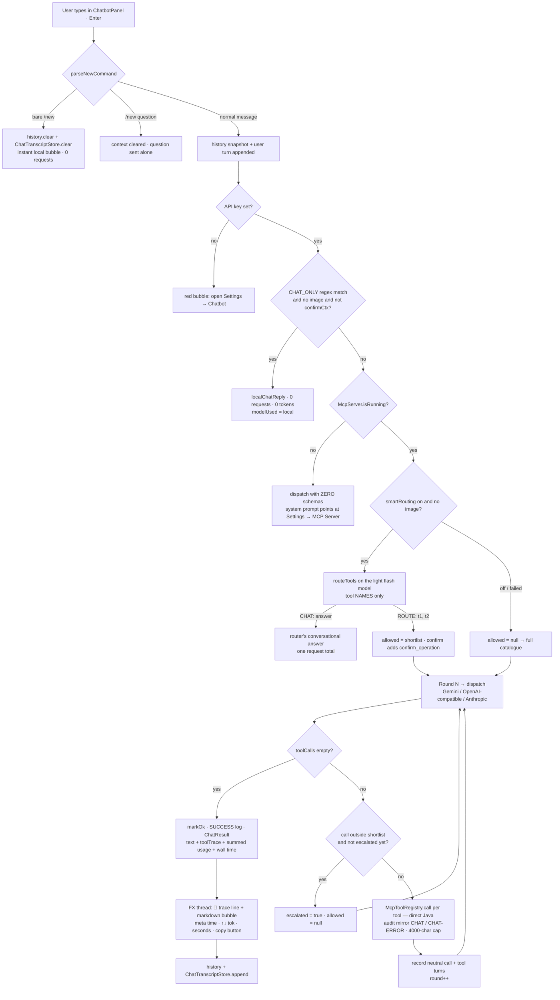
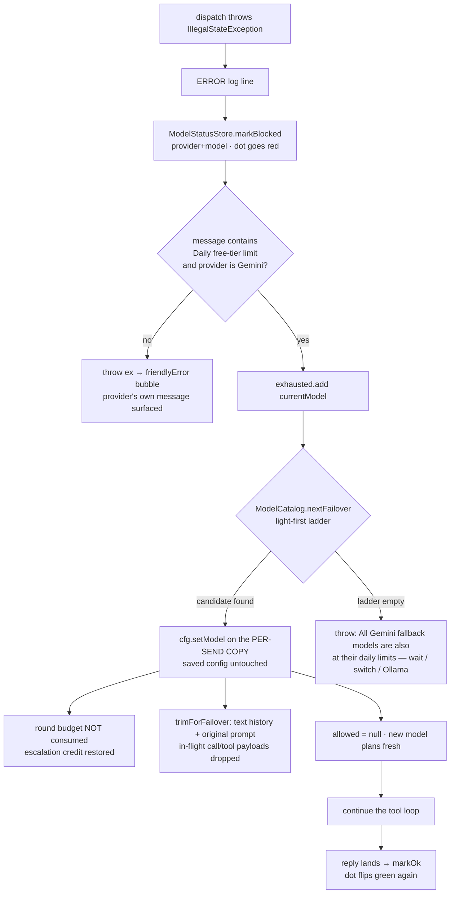

# Chapter 19 — The AI Assistant: The Receptionist Who Knows Every Department

> **Part 12 of InvoiceStudio: Zero to Finished Product**
> Files covered in full this chapter: `service/AiChatClient.java`,
> `service/ChatbotConfig.java`, `service/ApiKeysVault.java`,
> `service/ModelCatalog.java`, `service/ModelStatusStore.java`,
> `service/ChatTranscriptStore.java`, `service/ChatbotLogManager.java`,
> `ui/ChatbotPanel.java`, `ui/ChatbotSettingsPanel.java`,
> `ui/chat/ChatMarkdownRenderer.java`, `ui/chat/ChatPipelineBar.java`,
> `ui/chat/ChatbotLogDialog.java`, `ui/chat/ChatbotModelPickerDialog.java`,
> `ui/CopyButtonFactory.java`, `ui/ModelStatusDot.java`, plus the eighteen
> chatbot test suites: `test/.../service/AiChatClientPayloadTest.java`,
> `AiChatUsageMetaTest.java`, `AiChatOptimizerTest.java`,
> `AiChatOptimizationPassTest.java`, `AiChatUserJourneyStubTest.java`,
> `AiChatFullSurfaceStubTest.java`, `AiChatLiveMcpTest.java`,
> `ChatbotConfigTest.java`, `ApiKeysVaultTest.java`, `ModelCatalogTest.java`,
> `ModelStatusStoreTest.java`, `ChatTranscriptStoreTest.java`,
> `ChatbotLogManagerTest.java`, `ui/ChatbotNewCommandTest.java`,
> `CopyButtonFactoryTest.java`, `ui/chat/ChatbotLogFilterTest.java`,
> `ChatbotModelPickerDialogTest.java`, `ChatMarkdownRendererTest.java` —
> all thirty-three read and reproduced from the repository.
> Goal at the end: **asking in plain language — "list my top buyers", "pay that
> bill", "cancel invoice 12" — produces a real answer from the real books, with
> every request, tool execution and token logged, metered and fail-safed.**

---

## 1. Chapter goal

By the end of this chapter you will have built, exactly as the repository
has it:

1. **AiChatClient** — the chatbot's engine (1,338 lines): talks to Gemini,
   OpenAI, Anthropic, OpenRouter, Groq, Ollama, Mistral, DeepSeek and Z.ai
   GLM over plain `java.net.http.HttpClient` (zero new dependencies), gives
   the model the app's full 77-tool MCP surface through native function
   calling, runs a bounded tool loop, shortlists tools with a cheap "router"
   pass, fails over across models when a daily quota empties, and meters
   every token the provider reports.
2. **The local shortcuts** — greetings, thanks and pure smalltalk are
   answered *inside the app* by a regex and a table of canned replies: zero
   requests, zero tokens, instant — at any position in the chat — while
   confirmation contexts ("yes", "approve it") deliberately bypass the
   shortcut so approvals are never eaten.
3. **The settings layer** — `ChatbotConfig` (per-user `chatbot.json` with
   listener notification and a per-send copy that keeps quota failover from
   silently changing the user's saved model) and `ApiKeysVault`
   (`api-vault.json`: every provider key saved once under a name, auto-filled
   when you switch providers, masked for display).
4. **The model services** — `ModelCatalog` (live Gemini / Z.ai GLM catalogue
   fetch with chat-capability filtering and a light-first failover ladder)
   and `ModelStatusStore` (red/green per-model dots *learned from real
   usage*, because no provider exposes a balance API).
5. **The conversation memory** — `ChatTranscriptStore`, which survives panel
   close and app restart; only the trash button or a `/new` reset empties it.
6. **The observability layer** — `ChatbotLogManager` (a thread-safe,
   FX-thread-delivering event bus with eleven log levels), the
   `ChatbotLogDialog` terminal window (turn dividers, filter chips,
   pin-aware auto-scroll), and the `ChatPipelineBar` (a live "assistant at
   work" strip fed by the same events).
7. **The UI** — `ChatbotPanel` (the chat overlay: header with a live model
   chip, suggestion chips, image attachments, markdown bubbles with copy
   buttons and token meta rows, the `/new` context-reset command),
   `ChatbotSettingsPanel` (five cards including the API Key Vault),
   `ChatMarkdownRenderer` (Markdown + tables → native JavaFX),
   `ChatbotModelPickerDialog` + `ModelStatusDot` + `CopyButtonFactory`.
8. **Eighteen test suites** — payload shapes, optimizer logic, a scripted
   Gemini simulator driving the *real* send loop end-to-end, the full
   77-tool surface through that loop, opt-in live-model rounds, and unit
   tests for every store, manager and renderer.

And you will understand the one architectural fact Chapter 18 left
hanging: the MCP tool registry has two front doors. External clients knock
on the HTTP endpoint; the chatbot **calls `McpToolRegistry.call(...)`
directly as a plain Java method** — same dispatch, same confirmation gate,
same `DataManager`, no network — and then mirrors every execution into the
MCP audit trail by hand.

---

## 2. Story intro

Picture a growing trading firm hiring a **receptionist**. The owner does
not want a receptionist who only takes messages — he wants one who *knows
every department*: where the stock register lives, who owes money, how to
raise an invoice, and when a request is dangerous enough that the owner
must sign it personally.

Our receptionist is not a person; it is a **large language model** rented
over the internet. But the hiring problems are identical:

- **Which agency do we hire from?** There are many — Google's Gemini,
  OpenAI, Anthropic, Z.ai's GLM, and more — each with its own phone
  number, its own paperwork (an *API key*), and its own price list. The
  app lets the owner pick any of nine, and keep a drawer of keys
  (`ApiKeysVault`) so switching agencies is a dropdown pick.
- **What does the receptionist actually know?** Nothing about *your*
  business. A model is brilliant at language and blind to your books. The
  fix is Chapter 18's invention turned around: the model is handed the
  catalogue of 77 MCP tools and *asks for the data it needs*, and the app
  executes the ask locally and hands the real answer back.
- **How do we stop the phone bill exploding?** Every word exchanged costs
  *tokens*. So the assistant plans before it dials: greetings are answered
  at the desk without a call, a tiny "router" model shortlists which
  departments a question needs, and if one agency's daily quota runs dry
  the call fails over down a ladder of lighter models instead of dying.
- **How do we know what the receptionist did?** Every ring, every
  department visit, every rupee of token spend is written to a live
  execution log the owner can open at any time.

This chapter hires the receptionist — engine, contracts, telephone
manners, memory and the desk itself — and wires it to the building you
have spent eighteen chapters constructing.

> **Analogy:** Chapter 18 built the *building's service counter* (MCP) and
> taught outside visitors (Cursor, Claude Desktop) to use it. Chapter 19
> hires the *in-house receptionist* who leans over that same counter from
> inside — no phone line to the counter needed, because she works here.

---

## 3. Concepts first

**Large language model (LLM).** A model that reads text and predicts
continuations — which, at chat scale, means it answers questions. Two
facts shape this whole chapter. First, a model *cannot see your database*;
it only knows what is in the conversation plus what it is told. Second,
models can be given **tools** (see below), which is how blindness becomes
sight. The app never "trains" anything — it talks to hosted models over
HTTPS.

**API key.** A secret string that identifies *you* to a model provider and
bills your account: `AIza…` for Gemini, `sk-…` for OpenAI, and so on. Keys
are credentials — anyone holding yours spends your quota. The app stores
them in plain per-user JSON files in the app data directory
(`AppDirs`, Chapter 2), which its own Javadoc states honestly:

> **NOTE (kept faithful):** `ApiKeysVault`'s doc says the posture out
> loud — *"plain local file, never leaves this machine except to call the
> chosen provider directly"*. The name "vault" promises encryption the
> file does not have (the same trade-off the MCP bearer token has; the
> improvement sketch in Chapter 18 applies here unchanged). We keep the
> code as it is and the honesty with it.

**HTTP client from Java.** The JDK ships `java.net.http.HttpClient` — an
HTTP/1.1 and HTTP/2 client with timeouts and a request/response API. Every
provider call in this chapter is one `HttpRequest` with a JSON body and
one `HttpResponse<String>`. No provider SDK, no new Maven dependency — the
REST contracts are hand-verified against each provider's docs and encoded
in the class Javadoc.

**JSON with Jackson's tree model.** The client builds requests with
`ObjectNode`/`ArrayNode` (mutable JSON trees) and parses responses with
`readTree(...)` into `JsonNode`, navigating with `.path(...)` (which
returns a "missing node" instead of throwing). The three providers use
different shapes for the same ideas — `contents[].parts[]` (Gemini),
`messages[]` (OpenAI-compatible), `content[]` blocks (Anthropic) — so the
tree model's shapelessness is a feature, not a compromise.

**Request/response vs streaming.** Each send is one complete HTTP request
followed by one complete answer. The fashionable alternative is *token
streaming* (the provider pushes words as it generates them, over Server-
Sent Events), which makes replies *feel* faster. InvoiceStudio deliberately
does request/response everywhere, and manufactures liveness with the
pipeline bar and the busy-label progress line instead — one reason of the
three it gives up (uniform usage blocks, uniform error handling, one code
path across nine providers) per feature it would gain.

**Tool calling (function calling).** The provider request carries tool
declarations (name, description, JSON schema). The model may answer with
a *structured "call this tool with these arguments"* instead of text. The
app executes the tool **locally** — `McpToolRegistry.call(name, args)`,
the exact method the HTTP server dispatches to (Chapter 18) — and sends
the JSON result back for the next round. The loop repeats until the model
answers with text, bounded by `maxToolCalls`.

**The neutral turn format.** Inside the loop, tool exchanges are recorded
as two provider-neutral turn roles: `"call"` (the model's requests, as a
JSON array of `{name, args, id, tSig}`) and `"tool"` (the results, as
`{name, id, result}`). Why not store provider-shaped turns? Because each
provider re-emits them differently, and the renderers own that mapping:

| Stored role | Gemini re-emits as | OpenAI-compatible | Anthropic |
|---|---|---|---|
| `call` | `model` content with `functionCall` parts (+ `thoughtSignature`) | assistant message with `tool_calls[]` and `content: null` | assistant `tool_use` blocks |
| `tool` | `user` content with `functionResponse` parts | `role:"tool"` messages with `tool_call_id` | `user` message with `tool_result` blocks |

**Tokens and quota.** Providers bill and meter in *tokens* (~¾ of a word).
Every response carries a **usage block** — Gemini `usageMetadata.promptTokenCount`/
`candidatesTokenCount`, OpenAI-compatible `usage.prompt_tokens`/`completion_tokens`,
Anthropic `usage.input_tokens`/`output_tokens`. Free tiers are real but
small (Gemini free tier: 20 requests *per day per model* — live-verified),
which is why the client sums usage across every request of a send, shows it
on every bubble, and fails over when a daily bucket empties.

**Failover.** When a request fails with a hard quota wall, the client
switches to the next model in `ModelCatalog.failoverCandidates()` — a
light-first ladder of flash-family models — on a **per-send copy** of the
config, without consuming a tool round, and without replaying the dead
model's tool payloads into the new one. The user's saved model choice is
never touched.

**Fail-open.** An optimization must never cost correctness. When the router
errors, or its answer is unparseable, the client *falls open* to the full
tool catalogue rather than guessing wrong.

**Model catalogues.** The pickers fetch the provider's live model list —
`GET /v1beta/models` (Gemini), `GET /api/paas/v4/models` (Z.ai GLM) — and
filter to chat-capable text models: must support `generateContent`; not
TTS, image, embedding, live-audio, robotics, video, music, or Gemma (which
cannot do function calling). Cached 10 minutes.

**Learned model status.** No provider exposes a "remaining balance" API,
so red/green dots are *learned*: a real failure with a quota/balance/access
wall marks the model red (`ModelStatusStore.markBlocked`), a real success
marks it green (`markOk`), and red entries age out after 26 hours because
daily buckets reset.

**Markdown rendering, native.** The assistant is instructed (in its system
prompt) to answer with GitHub-Flavored Markdown — tables especially.
`ChatMarkdownRenderer` parses that text and builds *real JavaFX nodes*:
tables become `GridPane` cards with header rows and zebra striping, bold
and inline code become styled `Text` fragments in a `TextFlow`, code
blocks get dark containers with a Copy button.

**FX threading for async replies.** The send runs on
`AppExecutors.chat()` — a dedicated 3-thread pool (Chapter 9) so a slow
provider can never wedge file IO or other chat traffic. Results come back
through `Task.setOnSucceeded` + `AppExecutors.runOnFx`; log events are
delivered to listeners via `Platform.runLater` when the emitter is not on
the FX thread. Everything that touches a node happens on the FX
application thread; everything that waits on the network happens off it.

**The system prompt.** The model's standing instructions: who it is, what
the business is, that read tools are safe, that `requiresConfirmation`
results must be relayed to the human and confirmed with `confirm_operation`,
and that data belongs in Markdown tables. It is *dynamic*: pending approval
operations — with their exact `operationId`s — are appended, so a one-word
"yes" resolves in exactly one tool round.

---

## 4. Files in this chapter

| # | File | Lines | Role |
|---|---|---|---|
| 1 | `service/ChatbotConfig.java` | 158 | Persisted chatbot settings + change listeners + per-send copy |
| 2 | `service/ApiKeysVault.java` | 156 | Named API-key store, provider auto-fill, masking |
| 3 | `service/ModelCatalog.java` | 190 | Live Gemini/GLM catalogue, chat filter, failover ladder |
| 4 | `service/ModelStatusStore.java` | 130 | Learned red/green per-model status (persisted) |
| 5 | `service/AiChatClient.java` | 1,338 | The engine: 9 providers, router, tool loop, failover, usage |
| 6 | `service/ChatbotLogManager.java` | 174 | Thread-safe log ring + FX-thread event bus (11 levels) |
| 7 | `service/ChatTranscriptStore.java` | 100 | Persistent conversation transcript (400-turn cap) |
| 8 | `ui/ChatbotPanel.java` | 856 | The chat overlay: header, bubbles, `/new`, send pipeline |
| 9 | `ui/ChatbotSettingsPanel.java` | 609 | Settings → Chatbot: five cards incl. the API Key Vault |
| 10 | `ui/chat/ChatMarkdownRenderer.java` | 579 | Markdown + GFM tables → native JavaFX nodes |
| 11 | `ui/chat/ChatPipelineBar.java` | 224 | Animated "assistant at work" strip (2 animations, log-fed) |
| 12 | `ui/chat/ChatbotLogDialog.java` | 394 | Live execution-log terminal with chips + pin-aware scroll |
| 13 | `ui/chat/ChatbotModelPickerDialog.java` | 286 | Modal model picker: search, context chips, status dots |
| 14 | `ui/CopyButtonFactory.java` | 75 | Shared copy-to-clipboard button with check flip |
| 15 | `ui/ModelStatusDot.java` | 46 | Green/red/absent dot for learned model status |
| 16 | `test/.../service/AiChatClientPayloadTest.java` | 162 | Gemini payload wrappers, role merging, provider table |
| 17 | `test/.../service/AiChatUsageMetaTest.java` | 203 | Token meter: verbatim, summed, absent-usage honesty |
| 18 | `test/.../service/AiChatOptimizerTest.java` | 87 | Router parser, fail-open, history window, confirm context |
| 19 | `test/.../service/AiChatOptimizationPassTest.java` | 277 | Zero-schema semantics, MCP-off prompt, live failover rules |
| 20 | `test/.../service/AiChatUserJourneyStubTest.java` | 448 | Six checklist scenarios against a scripted Gemini stub |
| 21 | `test/.../service/AiChatFullSurfaceStubTest.java` | 743 | All 77 tools through the real chat loop + router/round probes |
| 22 | `test/.../service/AiChatLiveMcpTest.java` | 387 | Opt-in live Gemini/GLM rounds (loop internals; MCP halves in Ch 18) |
| 23 | `test/.../service/ChatbotConfigTest.java` | 82 | Defaults, clamps, JSON round-trip, no-key fail-fast |
| 24 | `test/.../service/ApiKeysVaultTest.java` | 132 | Vault roundtrip, idempotent re-save, mask, corrupt tolerance |
| 25 | `test/.../service/ModelCatalogTest.java` | 52 | Chat-capability filter, failover ordering |
| 26 | `test/.../service/ModelStatusStoreTest.java` | 105 | Red/green lifecycle, scoping, persistence, aging |
| 27 | `test/.../service/ChatTranscriptStoreTest.java` | 93 | Transcript roundtrip, role validation, 400-turn cap |
| 28 | `test/.../service/ChatbotLogManagerTest.java` | 114 | Entries, listeners, clear, broken-listener isolation |
| 29 | `test/.../ui/ChatbotNewCommandTest.java` | 41 | `/new` parser: bare, with question, non-commands |
| 30 | `test/.../ui/CopyButtonFactoryTest.java` | 90 | Full value onto clipboard, check flip, null safety |
| 31 | `test/.../ui/chat/ChatbotLogFilterTest.java` | 89 | Filter predicate: chips, dividers always visible, fail-open |
| 32 | `test/.../ui/chat/ChatbotModelPickerDialogTest.java` | 70 | Search predicate + dialog construction |
| 33 | `test/.../ui/chat/ChatMarkdownRendererTest.java` | 155 | Table → GridPane, bold cells, inline tokens, lists |

Depends on: `McpToolRegistry` / `McpServer` / `PendingOperations` /
`McpAuditLog` (Ch 18 — the tool surface, the gate, the audit mirror),
`DataManager` (Ch 8 — the one data engine behind every tool),
`AppExecutors` (Ch 2/9 — the dedicated chat pool),
`AppDirs`/`AppLog` (Ch 2), `StudioApp` shell + `IconHelper` + `Toast` +
`DialogHelper` (Ch 9), `KnowledgeRepository` (Ch 20 — read by knowledge
tools), `ChatbotLogManager` (this chapter, emitted by the engine).

Used by: `StudioApp` (floating icon, `toggleChatbot`, `chatbotConfig()`,
`setChatbotConfig`), `SettingsView` (the Chatbot tab), and every model the
owner configures.

---

## 5. Step-by-step build

We build in dependency order: persisted settings and the vault first, then
the catalogue and status services the pickers share, then the engine in
five passes (pipeline, router, tool loop, provider renderers, shared
plumbing), then the log manager the engine emits into, then the UI that
rides on all of it, and finally the eighteen suites that pin everything.

### Step 1 — `service/ChatbotConfig.java` (the settings sheet)

One small Jackson-mapped bean, persisted as `chatbot.json` next to the
MCP server's `mcp-server.json` (Ch 18). The provider ids are string
constants — nine of them:

```java
    /** Provider ids — see {@link AiChatClient#defaultModel(String)}. */
    public static final String GEMINI = "gemini";
    public static final String OPENAI = "openai";
    public static final String ANTHROPIC = "anthropic";
    public static final String OPENROUTER = "openrouter";
    public static final String GROQ = "groq";
    public static final String OLLAMA = "ollama";
    public static final String MISTRAL = "mistral";
    public static final String DEEPSEEK = "deepseek";
    /** Z.ai GLM — OpenAI-compatible endpoint, free flash tier by default. */
    public static final String GLM = "glm";
    public static final String CUSTOM = "custom";
```

The fields, with their defaults, tell you the product's whole philosophy:

```java
    /** How many past messages accompany each request (context window control).
     *  12 keeps answers contextual while every extra message costs input tokens
     *  on EVERY request — the settings spinner default matches this. */
    private int historyMessages = 12;
    /** Smart tool routing: a cheap first pass decides if tools are needed at
     *  all, so chat-only messages never carry the full tool schemas. */
    private boolean smartRouting = true;
    /**
     * Maximum number of model↔tool round-trips allowed per single send.
     * Capped in both directions (1–20) by the getter. Default matches the
     * previous hard-coded {@code MAX_TOOL_ROUNDS = 6}.
     */
    private int maxToolCalls = 6;
```

History costs input tokens on *every* request, so the default is a modest
12; smart routing is on because it saves tokens by default; the round cap
defaults to the old hard-coded 6 but is now a setting (1–20).

Two design points deserve their code. First, change notification — the
chat panel's header and the Settings tab both react to saves without
polling:

```java
    private static final java.util.List<java.util.function.Consumer<ChatbotConfig>> LISTENERS =
            new java.util.concurrent.CopyOnWriteArrayList<>();

    public static void addChangeListener(java.util.function.Consumer<ChatbotConfig> listener) {
        if (listener != null && !LISTENERS.contains(listener)) {
            LISTENERS.add(listener);
        }
    }
```

`save()` writes the file and then calls `notifyChanged()` — every listener
is invoked inside its own try/catch so one broken UI can never break the
save. Second, the copy that keeps failover honest:

```java
    /**
     * Shallow copy for a single send. {@link AiChatClient} mutates the model
     * id on daily-quota failover; running that on the SHARED persisted
     * instance silently changed the user's saved model (the header chip and
     * Settings then showed — and later persisted — a model they never
     * picked). Each send now works on its own copy, so Settings and the
     * chat header always stay in sync with what the user actually chose.
     */
    public ChatbotConfig copyForSend() {
        ChatbotConfig c = new ChatbotConfig();
        c.showIcon = showIcon;
        c.provider = provider;
        c.model = model;
        c.apiKey = apiKey;
        c.endpoint = endpoint;
        c.historyMessages = historyMessages;
        c.smartRouting = smartRouting;
        c.maxToolCalls = maxToolCalls;
        return c;
    }
```

That Javadoc is a bug report turned into documentation: quota failover
used to `setModel` the *shared* instance, and the model chip and Settings
silently drifted to a model the user never picked. The fix is one shallow
copy per send.

Finally, the clamps live in the **getters**, not the setters:

```java
    public int getHistoryMessages() { return Math.max(4, Math.min(80, historyMessages)); }
```
```java
    /** Max model↔tool round-trips per send (1–20). */
    public int getMaxToolCalls() { return Math.max(1, Math.min(20, maxToolCalls)); }
```

> **NOTE (kept faithful):** clamping in the getter means a hand-edited
> `chatbot.json` with `"historyMessages": 500` is silently corrected at
> read time, and the setter stays a dumb assignment. The tests pin the
> clamp (0 → 4, 500 → 80).

### Step 2 — `service/ApiKeysVault.java` (the key ring)

Re-pasting an API key every time you switch providers is exactly the kind
of friction that stops people switching. The vault stores each key once,
under a memorable label, tagged with its provider:

```java
    /** One saved key. {@code provider} is the provider id it was saved for. */
    public record VaultEntry(String id, String label, String provider, String key, String createdAt) {}
```

`add` is idempotent the MCP way (Chapter 18's check-then-create): saving
the *same* key for the *same* provider again just refreshes its label —
no duplicate rows:

```java
    public static VaultEntry add(String label, String provider, String key) {
        List<VaultEntry> entries = new ArrayList<>(list());
        String trimmedKey = key == null ? "" : key.trim();
        String cleanLabel = label == null || label.isBlank() ? defaultLabel(provider) : label.trim();
        String cleanProvider = provider == null || provider.isBlank() ? ChatbotConfig.GEMINI : provider.trim();

        VaultEntry existing = null;
        for (VaultEntry e : entries) {
            if (cleanProvider.equals(e.provider()) && trimmedKey.equals(e.key())) {
                existing = e;
                break;
            }
        }
        VaultEntry entry;
        if (existing != null) {
            entry = new VaultEntry(existing.id(), cleanLabel, existing.provider(), existing.key(), existing.createdAt());
            entries.set(entries.indexOf(existing), entry);
        } else {
            entry = new VaultEntry(java.util.UUID.randomUUID().toString(),
                    cleanLabel, cleanProvider, trimmedKey, Instant.now().toString());
            entries.add(entry);
        }
        persist(entries);
        return entry;
    }
```

The class is read-through: `list()` re-reads the file on every call — no
cached state, so concurrent panels always agree. `findForProvider`
returns the first saved key for a provider (the auto-fill hook), and
`mask` is the display rule:

```java
    public static String mask(String key) {
        if (key == null || key.isBlank()) return "—";
        String k = key.trim();
        if (k.length() <= 9) return "•••••";
        return k.substring(0, 5) + "••••" + k.substring(k.length() - 4);
    }
```

First 5 and last 4 visible; short keys collapse to dots so a short *test*
key never shows itself fully either. Persisted changes fire the
`LISTENERS` list — the Settings vault card refreshes itself.

### Step 3 — `service/ModelCatalog.java` (the live catalogue + the ladder)

Both model pickers (the Settings "Browse…" dialog and the chat header's
model chip) list models fetched *live from the provider* — no stale
hard-coded list. For Gemini, that is a paged `GET /v1beta/models` with a
strict chat-capability filter:

```java
    /** Parses + filters one raw model entry; null when not chat-capable. */
    static ModelInfo parse(ObjectMapper M, JsonNode m) {
        String id = m.path("name").asText(""); // "models/gemini-x"
        if (id.startsWith("models/")) id = id.substring("models/".length());
        if (id.isEmpty()) return null;

        boolean canGenerate = false;
        for (JsonNode g : m.path("supportedGenerationMethods")) {
            if ("generateContent".equals(g.asText())) { canGenerate = true; break; }
        }
        if (!canGenerate) return null;

        String lower = id.toLowerCase();
        if (lower.contains("tts") || lower.contains("image") || lower.contains("embed")
                || lower.contains("live") || lower.contains("audio") || lower.contains("transcribe")
                || lower.contains("robotics") || lower.contains("veo") || lower.contains("lyria")
                || lower.contains("nano-banana") || lower.contains("computer-use")
                || lower.contains("antigravity") || lower.contains("deep-research")
                || lower.startsWith("gemma")) {
            return null;
        }
        return new ModelInfo(id, m.path("displayName").asText(id),
                m.path("description").asText(""), m.path("inputTokenLimit").asLong(0));
    }
```

Why exclude Gemma by prefix? The class Javadoc answers: *"Gemma cannot do
function calling, which the assistant requires."* A model without tools
would answer everything with confident guesses — the one failure mode
this chapter exists to prevent. Results are cached for 10 minutes
(`TTL_MS`), per provider (`cache` / `glmCache`).

The second half of the class is the failover ladder — the ordered list
the quota-failure path walks:

```java
    /**
     * Ordered failover candidates for the assistant (fast flash models first).
     * LIGHT models lead the ladder: when the daily bucket of the primary
     * model empties, we drop to the lightest tier with remaining quota —
     * never UP to a scarcer/pro model. All candidates are flash-family
     * models that keep full function-calling support.
     */
    public static List<String> failoverCandidates() {
        return List.of(
                "gemini-flash-lite-latest", "gemini-flash-latest", "gemini-3.8-flash",
                "gemini-3.7-flash", "gemini-3.6-flash", "gemini-3.5-flash",
                "gemini-2.5-flash", "gemini-2.5-flash-lite", "gemini-3.5-flash-lite",
                "gemini-3.1-flash-lite");
    }

    /** Next untried candidate after {@code current} (never returns current). */
    public static String nextFailover(String current, java.util.Set<String> exhausted) {
        for (String cand : failoverCandidates()) {
            if (!cand.equals(current) && !exhausted.contains(cand)) return cand;
        }
        return null;
    }
```

The design rules are in the comment: light models first (never burn a
scarcer pro quota), all function-calling capable, and `nextFailover`
returns `null` when everything is exhausted — an honest failure, not a
silent retry.

> **NOTE (kept faithful):** the caches are single statics, *not keyed by
> API key*. If two different keys are used within the 10-minute TTL, the
> second key sees the first key's catalogue (harmless — catalogues are
> key-scoped only by what the key can access). An improvement sketch
> appears in Section 8.

### Step 4 — `service/ModelStatusStore.java` (the red/green memory)

There is no public "remaining balance" API on any provider, so the
pickers' red/green dots are **learned from real usage**:

```java
    /** Learned usability of one provider+model pair. */
    public enum State { OK, BLOCKED }

    public record Entry(String provider, String model, State state,
                        String reason, String since) {}
```

`AiChatClient` calls `markBlocked(provider, model, reason)` when a request
dies on a model-specific wall (daily quota, Z.ai balance, 402/403/404
access errors) and `markOk(provider, model)` when a real request
succeeds. Status persists in `model-status.json`; mutations run under a
single monitor:

```java
    private static void update(String provider, String model, State state, String reason) {
        if (provider == null || provider.isBlank() || model == null || model.isBlank()) return;
        synchronized (LOCK) {
            Map<String, Map<String, Entry>> all = load();
            Map<String, Entry> perProvider = all.computeIfAbsent(provider, p -> new ConcurrentHashMap<>());
            perProvider.put(model, new Entry(provider, model, state, reason, Instant.now().toString()));
            persist(all);
        }
    }
```

Reads apply the aging rule:

```java
    public static Entry get(String provider, String model) {
        if (provider == null || model == null) return null;
        synchronized (LOCK) {
            Entry e = load().getOrDefault(provider, Map.of()).get(model);
            if (e != null && e.state() == State.BLOCKED) {
                try {
                    if (Duration.between(Instant.parse(e.since()), Instant.now()).compareTo(RED_TTL) > 0) {
                        return null; // aged out — treat as unknown
                    }
                } catch (Exception ignored) {
                    return null; // corrupt timestamp — fail open
                }
            }
            return e;
        }
    }
```

`RED_TTL` is 26 hours — Gemini daily buckets refill at midnight Pacific,
so a stale "no balance" memory must not block a model forever. GREEN has
no TTL (every success refreshes it). A later success *always wins*: the
test `successFlipsRedBackToGreen` pins the flip.

### Step 5 — `service/AiChatClient.java`, part 1: records and the send pipeline

The engine's Javadoc is the REST contract sheet — worth reading in full
because it is the *proof* the wire shapes were verified, not guessed:

```java
/**
 * The chatbot's AI engine: talks to Gemini, OpenAI or Anthropic-compatible
 * chat APIs over plain {@link HttpClient} (no new dependencies) and gives the
 * model the app's full MCP tool surface through native function calling.
 *
 * <p>REST contracts (verified against official docs, no guessing):</p>
 * <ul>
 *   <li><b>Gemini</b> — {@code POST /v1beta/models/{model}:generateContent?key=…};
 *       {@code contents[].parts[]} with {@code text} / {@code inline_data}
 *       (base64) / {@code functionCall} / {@code functionResponse}; tools as
 *       {@code functionDeclarations} with an {@code parameters} schema.</li>
 *   <li><b>OpenAI</b> — {@code POST /v1/chat/completions}, Bearer key;
 *       {@code messages[]} with {@code content[].image_url} (data URIs for
 *       attachments); tools as {@code tools[].function}; calls come back as
 *       {@code tool_calls[]}, results are sent as {@code role:"tool"}.</li>
 *   <li><b>Anthropic</b> — {@code POST /v1/messages}, {@code x-api-key} +
 *       {@code anthropic-version}; images as {@code source.type=base64};
 *       tools as {@code tools[].input_schema}; calls back as
 *       {@code tool_use} blocks, results as {@code tool_result}.</li>
 * </ul>
 */
```

The public records define the whole surface the UI knows about:

```java
    /** One chat attachment: raw image bytes + mime type. */
    public record ImagePart(String mimeType, byte[] data) {}

    /** One turn of chat as the app stores it. */
    public record ChatTurn(String role, String text, ImagePart image) {
        public static ChatTurn user(String t) { return new ChatTurn("user", t, null); }
        public static ChatTurn userImage(String t, ImagePart img) { return new ChatTurn("user", t, img); }
        public static ChatTurn assistant(String t) { return new ChatTurn("assistant", t, null); }
    }

    /**
     * Result of one full send: the assistant's text + what tools it ran.
     *
     * <p>Token counts are the SUM over every provider request of the send
     * (router pass + each tool round), parsed from the provider's own usage
     * block — they show next to each reply so users can see what a question
     * really costs. {@code -1} means the provider did not report usage.</p>
     */
    public record ChatResult(String text, List<String> toolTrace,
                             long promptTokens, long completionTokens,
                             long totalTokens, long elapsedMs, String modelUsed) {
        /** Back-compatible constructor: no usage metadata. */
        public ChatResult(String text, List<String> toolTrace) {
            this(text, toolTrace, -1, -1, -1, -1, "");
        }
    }
```

And the deprecated constant that used to *be* the cap:

```java
    /**
     * Hard cap on model↔tool round trips per send (safety + cost bound).
     * @deprecated Replaced by {@link ChatbotConfig#getMaxToolCalls()} — this constant
     *             is kept only for Javadoc reference; the live value comes from settings.
     */
    @SuppressWarnings("unused")
    private static final int MAX_TOOL_ROUNDS = 6;
```

> **NOTE (kept faithful):** the constant is dead but deliberately kept —
> it anchors the "default matches the previous hard-coded 6" story in the
> config's Javadoc. The live cap is `cfg.getMaxToolCalls()`.

Now the send pipeline itself. The opening beats are: fail fast without a
key, take the per-send copy, append the user turn, open the log's turn
divider:

```java
    public ChatResult send(ChatbotConfig cfg, List<ChatTurn> history,
                           String userText, ImagePart attachment) throws Exception {
        long t0 = System.currentTimeMillis();
        // Ollama runs locally and needs no key; every cloud provider does.
        if (cfg.getApiKey().isBlank() && !ChatbotConfig.OLLAMA.equals(cfg.getProvider())) {
            throw new IllegalStateException("No API key configured — open Settings → Chatbot and save your key.");
        }
        // Per-send config copy: quota failover switches the model INSIDE this
        // send. Mutating the shared persisted instance made the model chip and
        // Settings silently drift to a model the user never picked (they are
        // the same object) — the copy keeps the user's choice untouched.
        cfg = cfg.copyForSend();
        List<ChatTurn> turns = new ArrayList<>(history);
        turns.add(new ChatTurn("user", userText == null ? "" : userText, attachment));

        Usage usage = new Usage();
        // USER level = the log's turn separator: every new message opens a
        // clearly visible block in the execution log, so reading it top-down
        // tells exactly which request each step belongs to.
        ChatbotLogManager.user("New message: \"" + shorten(userText, 80) + "\"",
                attachment != null ? "Image attached (" + attachment.mimeType() + ", " + attachment.data().length + " bytes)" : null);
```

Two fast paths follow. First, **MCP off** — when the tool server is
stopped the assistant has no business-data tools at all, so it dispatches
with *zero* schemas and a system prompt that points at Settings → MCP
Server (the chat always replies, instantly, with actionable guidance):

```java
        boolean mcpOff = !com.invoicestudio.mcp.McpServer.isRunning();
        if (mcpOff) {
            ChatbotLogManager.warn("MCP server is OFF — replying without business-data tools",
                    "If the user asks for live data the model will direct them to Settings → MCP Server");
            ProviderResponse resp = dispatch(cfg, turns, java.util.Set.of(), true);
            usage.add(resp.promptTokens(), resp.completionTokens());
            logUsage(usage, "MCP-off reply");
            ChatbotLogManager.success("Completed (MCP off — conversational reply)", resp.text());
            return result(resp.text(), List.of(), usage, t0, activeModel(cfg));
        }
```

Second, **confirmation context** — is this message an approval flow? The
detection is three signals in one static method:

```java
    /** Confirmation responses when an operation or prompt requires user approval or answer. */
    private static final java.util.regex.Pattern CONFIRMATION_WORDS = java.util.regex.Pattern.compile(
            "(?is)^\\s*(y|yes|yeah|yep|sure|ok(ay)?|confirm(ed)?|approve(d)?|proceed|go\\s*ahead|do\\s*it|please\\s*do|"
            + "yes\\s*(please|do|confirm|proceed|approve)|reject|deny|cancel|no)\\s*[!.?]*\\s*$");

    static boolean isConfirmationContext(List<ChatTurn> turns, String userText) {
        if (turns == null || turns.isEmpty()) return false;
        String trimmed = userText == null ? "" : userText.trim();
        if (CONFIRMATION_WORDS.matcher(trimmed).matches()) {
            return true;
        }
        if (!com.invoicestudio.mcp.PendingOperations.pending().isEmpty()) {
            return true;
        }
        for (int i = turns.size() - 1; i >= 0; i--) {
            ChatTurn t = turns.get(i);
            if ("assistant".equals(t.role())) {
                String txt = t.text() == null ? "" : t.text().toLowerCase();
                if (txt.contains("confirm") || txt.contains("approve") || txt.contains("operationid")
                        || txt.contains("proceed") || txt.contains("pending") || txt.contains("waiting for")) {
                    return true;
                }
                break;
            }
        }
        return false;
    }
```

Yes-words, *or* queued pending operations, *or* the last assistant turn
having asked for confirmation. This flag does two jobs: it adds
`confirm_operation` to any router shortlist, and it **disables the greeting
shortcut** (so a pending deletion followed by "ok" is never eaten as
smalltalk — the harness pins this in `confirmationPromptBeatsTheGreetingMatcher`).

Then the **local greeting interception** — the zero-cost skip:

```java
        // ── Zero-cost local greetings (work MID-CHAT too) ─────────────
        // "hi", "hello", "thanks"… carry no business intent, but once any
        // history existed they fell through to the smart router and paid a
        // full flash-model round trip before the answer (the "even a simple
        // hi takes ages" report). They are now answered LOCALLY: zero
        // requests, zero tokens, instant — at any position in the chat.
        // Confirmation contexts and queued approvals still bypass the
        // shortcut so "yes/ok" flows and "reply yes to confirm" turns are
        // never eaten by the greeting matcher.
        String first = userText == null ? "" : userText.trim();
        if (attachment == null && !confirmCtx && CHAT_ONLY.matcher(first).matches()) {
            String canned = localChatReply(first);
            ChatbotLogManager.router("Instant local reply — no API call, no tokens", first);
            ChatbotLogManager.success("Completed locally (0 requests)", canned);
            return result(canned, List.of(), usage, t0, "local");
        }
```

The regex and the reply table are the shortcut's two halves:

```java
    /** Pure smalltalk — answered with zero tool schemas (zero-cost skip). */
    private static final java.util.regex.Pattern CHAT_ONLY = java.util.regex.Pattern.compile(
            "(?is)^\\s*(hi+|hello+|hey+|yo|thanks?|thank\\s*you|thx|ty|great|nice|cool|wow|"
            + "good\\s*(morning|afternoon|evening|night)|bye+|goodbye|see\\s*ya|"
            + "who\\s+are\\s+you\\??|how\\s+are\\s+you\\??|what\\s+can\\s+you\\s+do\\??|help)\\s*[!.?]*\\s*$");
```

```java
    static String localChatReply(String input) {
        String s = input == null ? "" : input.toLowerCase().replaceAll("\\s+", " ").trim();
        s = s.replaceAll("[!.?]+$", "").trim();
        if (s.matches("who\\s+are\\s+you")) {
            return "I'm the InvoiceStudio Assistant — built into your billing app. I work on your real books: "
                    + "buyers, suppliers, items & stock, invoices, purchases, expenses, reports and label "
                    + "printing. Try e.g. \"list top 5 buyers by balance\".";
        }
        if (s.matches("how\\s+are\\s+you")) {
            return "I'm running great, thanks! Ready when you are — invoices, stock, payments, reports.";
        }
        if (s.matches("what\\s+can\\s+you\\s+do") || s.equals("help")) {
            return "Here's what I can do:\n"
                    + "- Sales: create, pay and delete invoices; list & search bills\n"
                    + "- Directory: buyers, suppliers, transports (create/update/delete)\n"
                    + "- Catalog: items, categories, stock & reorder levels\n"
                    + "- Purchases & expenses: record bills, payments, vouchers\n"
                    + "- Reports: stock, profitability, financial summary, daybook\n"
                    + "- Templates: design/print labels & invoices, export PDFs\n"
                    + "- Knowledge Hub: how-to guides (try \"how do I design a label?\")\n\n"
                    + "Tip: type /new to drop earlier context and save tokens.";
        }
        if (s.matches("good (morning|afternoon|evening|night)")) {
            return "Good " + s.replace("good ", "") + "! Ready to help with invoices, stock, payments "
                    + "or reports — what do you need?";
        }
        if (s.matches("(hi+|hello+|hey+|yo)")) {
            return "Hello! I'm your InvoiceStudio assistant — I can manage invoices, buyers, suppliers, "
                    + "stock, expenses and reports with your live data. What would you like to do?";
        }
        if (s.matches("(thanks?|thank you|thx|ty)")) {
            return "You're welcome! Anything else — bills, stock, payments, reports?";
        }
        if (s.matches("(bye+|goodbye|see ya)")) {
            return "Goodbye! Ping me anytime you need an invoice, a stock check or a report.";
        }
        return "Glad you like it! Want me to pull a report, create a bill or check stock?";
    }
```

The Javadoc explains two deliberate choices: package-private *so tests can
assert the exact copy*, and deterministic — *"Kept free of randomness on
purpose: same input, same reply, verifiable."*

> **NOTE (kept faithful):** the regex and the reply method are two
> parallel hand-maintained lists (the same shape of debt as Chapter 18's
> catalogue-vs-dispatch GAP). Anything the regex admits but the method
> doesn't specifically answer ("great", "nice", "cool", "wow") lands on
> the generic fallback line — correct, just worth knowing when you edit
> either half.

If none of the fast paths fire, the smart router runs (next step) and the
tool loop begins.

### Step 6 — the smart router (a lean first pass)

The full catalogue of 77 schemas costs thousands of input tokens on
*every* request, and tool rounds multiply requests. So when smart routing
is enabled (and there is no image attachment), a first, *lean* request
decides what the heavy pass needs:

```java
    private ToolRoute routeTools(ChatbotConfig cfg, List<ChatTurn> turns, String userText,
                                 boolean confirmCtx, Usage usage) {
        try {
            StringBuilder names = new StringBuilder();
            for (McpToolRegistry.ToolDef t : McpToolRegistry.tools()) {
                if (names.length() > 0) names.append(", ");
                names.append(t.name);
            }
            String sys = "You are the request router of an InvoiceStudio billing app assistant. "
                    + "Available tools: " + names + ". \n"
                    + "Decide if the user's LATEST message needs live business data via tools or is confirming/approving an operation.\n"
                    + "Reply with EXACTLY one line and nothing else:\n"
                    + "- If user is confirming, approving, or rejecting an operation: ROUTE: confirm_operation\n"
                    + "- If business data or actions are needed: ROUTE: tool1, tool2 (fewest matching names from the list)\n"
                    + "- Questions about how to use InvoiceStudio itself: ROUTE: get_app_guide\n"
                    + "- Otherwise (small talk, greetings, general knowledge): CHAT: <answer the user briefly>";

            String query;
            if (turns != null && turns.size() >= 2) {
                // Supply the immediately preceding assistant turn so the router has the conversation context
                ChatTurn prev = turns.get(turns.size() - 2);
                query = "Previous assistant message: " + shorten(prev.text(), 240) + "\nUser reply: " + userText;
            } else {
                query = userText;
            }

            RawAnswer raw = rawCompletion(cfg, sys, query);
            if (raw == null || raw.text() == null) return null;
            usage.add(raw.promptTokens(), raw.completionTokens());
            return parseRouteDecision(raw.text(), cfg);
        } catch (Exception e) {
            AppLog.debug(e);
            return null; // fail open
        }
    }
```

Three things to notice. The router sees tool *names only* (no schemas —
that is where the token saving comes from). It is fed the immediately
preceding assistant turn so a "yes" follow-up isn't misclassified as
smalltalk. And *any* failure returns `null` — fail open.

> **GAP (faithfully preserved):** that context feed is positional, not
> role-checked — `turns.get(turns.size() - 2)` is labelled "Previous
> assistant message" whatever it actually contains. In the normal
> user→assistant rhythm it *is* the assistant turn; but a history that
> ends in an unanswered user turn (for example after a failed send)
> makes the router read the user's own previous message as the
> assistant's. Harmless in practice (the label is advisory), but the
> code would be honest with a role check walking backwards like
> `isConfirmationContext` does.

The parser is package-private so tests can drive it directly:

```java
    static ToolRoute parseRouteDecision(String routerOutput, ChatbotConfig cfg) {
        String line = routerOutput == null ? "" : routerOutput.trim();
        int route = line.toUpperCase().indexOf("ROUTE:");
        if (route >= 0) {
            String list = line.substring(route + 6);
            int nl = list.indexOf('\n');
            if (nl >= 0) list = list.substring(0, nl);
            java.util.Set<String> known = new java.util.HashSet<>();
            for (McpToolRegistry.ToolDef t : McpToolRegistry.tools()) known.add(t.name);
            List<String> picked = new ArrayList<>();
            for (String raw : list.split(",")) {
                String n = raw.trim().replace("`", "");
                if (known.contains(n) && !picked.contains(n)) picked.add(n);
            }
            if (picked.isEmpty()) return new ToolRoute(true, List.of(), ""); // empty shortlist = all tools
            return new ToolRoute(true, picked, "");
        }
        int chat = line.toUpperCase().indexOf("CHAT:");
        if (chat >= 0 && chat + 5 < line.length()) {
            String answer = line.substring(chat + 5).trim();
            if (!answer.isEmpty()) return new ToolRoute(false, List.of(), answer);
        }
        // Unparseable → fail open: full pass with the complete catalogue.
        return new ToolRoute(true, List.of(), "");
    }
```

Semantics to memorize: an empty shortlist means **all tools**, not *no*
tools (the test says exactly that: *"empty shortlist must mean 'all
tools', not 'no tools'"*). Unknown names and duplicates are dropped. A
`CHAT:` line with a non-empty answer becomes a **direct conversational
answer** — back in `send()`:

```java
            if (route != null && !route.needTools() && !confirmCtx) {
                // Router already answered the question conversationally —
                // no second request, no schemas, no tool rounds.
                ChatbotLogManager.router("Direct conversational answer from router", route.note());
                logUsage(usage, "Router direct answer");
                ChatbotLogManager.success("Completed via smart router direct answer", route.note());
                return result(route.note(), List.of(), usage, t0, activeModel(cfg));
            }
```

One request total for a general-knowledge question — the router *is* the
answerer.

The router's own requests ride the lightest tier. `rawCompletion` routes
by provider, and both implementations hard-pin a light model:

```java
    /** One no-tools completion with a custom system instruction (router). */
    private RawAnswer rawCompletion(ChatbotConfig cfg, String system, String userText) throws Exception {
        return switch (cfg.getProvider()) {
            case ChatbotConfig.GEMINI -> rawGemini(cfg, system, userText);
            default -> rawOpenAiCompatible(cfg, system, userText);
        };
    }
```

```java
    private RawAnswer rawGemini(ChatbotConfig cfg, String system, String userText) throws Exception {
        // The router always runs on the LIGHTEST flash model: it only has to
        // classify the request (or answer small talk), it never touches
        // business data — so it must not burn the user's chosen (possibly
        // paid/scarce) model quota and adds minimal latency.
        String model = "gemini-flash-lite-latest";
```

```java
    private RawAnswer rawOpenAiCompatible(ChatbotConfig cfg, String system, String userText) throws Exception {
        // Same light-router policy as Gemini: Z.ai's glm-4.5-flash tier is
        // free (live-verified with a real key) — the router must never burn
        // the user's chosen (possibly metered) GLM model on classification.
        String model = switch (cfg.getProvider()) {
            case ChatbotConfig.GLM -> "glm-4.5-flash";
            default -> cfg.getModel().isBlank() ? defaultModel(cfg.getProvider()) : cfg.getModel();
        };
```

> **ISSUE (faithfully preserved):** the "light router" policy really
> applies to two providers. For Gemini the router *always* uses
> `gemini-flash-lite-latest`, and for GLM it always uses `glm-4.5-flash` —
> but the `default` arm sends every other OpenAI-compatible provider's
> router request **on the user's own configured model** (which may be
> metered). The comment claims a general policy the switch doesn't
> implement. Harmless for cost on free-tier defaults, but worth knowing
> before you point OpenRouter at an expensive model.

### Step 7 — the tool loop (rounds, execution, audit mirror, failover)

Everything so far was staging. The loop is where the assistant actually
*works*. It is a `while (true)` with four exits — final text, safety stop,
failover exhaustion, or an exception:

```java
        List<String> trace = new ArrayList<>();
        boolean escalated = false;
        int round = 0;
        java.util.Set<String> exhausted = new java.util.HashSet<>();
        String originalModel = cfg.getModel();
        while (true) {
            if (round > cfg.getMaxToolCalls()) {
                ChatbotLogManager.warn("Safety limit reached: " + cfg.getMaxToolCalls() + " tool rounds", null);
                return new ChatResult("(stopped after " + cfg.getMaxToolCalls()
                        + " tool rounds — ask me to continue)", trace,
                        usage.prompt, usage.completion, usage.total(),
                        System.currentTimeMillis() - t0, cfg.getModel());
            }
```

The safety stop answers with an honest message rather than hanging or
burning money. Then the provider round:

```java
            ProviderResponse resp;
            try {
                String activeModel = cfg.getModel().isBlank() ? defaultModel(cfg.getProvider()) : cfg.getModel();
                ChatbotLogManager.dispatch("Round " + (round + 1) + " -> " + cfg.getProvider()
                        + " (" + activeModel + ")",
                        "Turns in payload: " + turns.size() + ", Allowed tools: "
                        + (allowed == null ? "ALL (" + McpToolRegistry.tools().size() + ")" : allowed.toString()));
                resp = dispatch(cfg, turns, allowed, false);
            } catch (IllegalStateException ex) {
```

The `catch` block is the heart of quota failover — read it as five moves:

```java
                ChatbotLogManager.error("Provider call failed: " + ex.getMessage(), null);
                String msg = String.valueOf(ex.getMessage());
                // ── Model-status memory (red/green dots) ─────────────────
                // Real usage is the only signal (no provider exposes a
                // balance API), so record the wall against the model that
                // hit it — the pickers show these as red dots until a
                // success flips them green or the daily window ages out.
                ModelStatusStore.markBlocked(cfg.getProvider(), firstModel, msg);
                // ── Quota / daily-limit failover ──────────────────────────────
                // When a Gemini model hits its daily free-tier bucket ("Daily
                // free-tier limit") or any provider returns a hard quota error,
                // iterate through failover candidates until one succeeds.
                // We only failover for Gemini because other providers don't share
                // a common failover catalogue — but we still give a friendly error.
                boolean isDailyLimit = msg.contains("Daily free-tier limit");
                boolean isGemini = ChatbotConfig.GEMINI.equals(cfg.getProvider());
                if (isDailyLimit && isGemini) {
                    // Auto-failover: this model's daily bucket is empty — try
                    // the next best chat model with remaining quota.
                    String currentModel = cfg.getModel().isBlank() ? defaultModel(cfg.getProvider()) : cfg.getModel();
                    exhausted.add(currentModel);
                    String next = ModelCatalog.nextFailover(currentModel, exhausted);
                    if (next != null) {
                        exhausted.add(next); // one attempt per candidate
                        ChatbotLogManager.warn(
                                "Model " + currentModel + " hit daily quota — trying " + next, null);
                        cfg.setModel(next); // per-send copy — the saved config is NOT touched
                        // Failover is FREE: it does not consume a tool round
                        // (round is only incremented after a real tool result
                        // comes back). The heavy in-flight MCP payloads are
                        // dropped too — the new model restarts from the last
                        // good conversational context + the original prompt,
                        // instead of replaying every tool call/result pair.
                        turns = trimForFailover(turns, cfg);
                        allowed = null;      // new model plans fresh, full catalogue
                        escalated = false;   // and may escalate once again
                        trace.add("⚠ model " + (originalModel.isBlank() ? "default" : originalModel)
                                + " hit its daily limit — switched to " + next);
                        logUsage(usage, "After failover to " + next);
                        continue;
                    }
                    throw new IllegalStateException(msg + "\nAll Gemini fallback models are also at their "
                            + "daily limits — wait for the daily reset or use another provider (Ollama is local & free).", ex);
                }
                throw ex;
```

1. **Remember the wall** — `markBlocked` turns the model's dot red in both
   pickers.
2. **Recognize the failover-able case** — Gemini daily-limit only, because
   only Gemini has a shared failover catalogue.
3. **Switch on the per-send copy** — the user's saved model is untouchable
   (the test asserts `cfg.getModel()` still equals the original *after*
   failover).
4. **Make it free** — `round` is not incremented (only real tool results
   increment it), and `trimForFailover` (Step 9) drops the dead model's
   call/tool payloads so the new model re-plans from the prompt instead of
   paying for context it never produced.
5. **Honest exhaustion** — when the ladder is empty, the error says so and
   names the alternatives.

When a response *does* arrive with no tool calls, the loop ends — and the
model that actually answered gets its green dot:

```java
            usage.add(resp.promptTokens(), resp.completionTokens());
            if (resp.toolCalls().isEmpty()) {
                // The pair that actually answered — post-failover this is the
                // failover model, not the configured one. GREEN: a real
                // request just succeeded through it.
                String answeredBy = cfg.getModel().isBlank() ? defaultModel(cfg.getProvider()) : cfg.getModel();
                ModelStatusStore.markOk(cfg.getProvider(), answeredBy);
                ChatbotLogManager.success("Completed in " + round + " tool round(s)",
                        trace.isEmpty() ? "Direct response" : "Tools executed: " + String.join(" -> ", trace));
                logUsage(usage, "Final (" + round + " tool round(s), model "
                        + (cfg.getModel().isBlank() ? "default" : cfg.getModel()) + ")");
                return result(resp.text(), trace, usage, t0, activeModel(cfg));
            }
```

If the model called a tool *outside* the router's shortlist, the client
escalates — once — to the full catalogue instead of failing the round:

```java
            // Router under-selected? (model called a tool that wasn't
            // shortlisted). Escalate once to the full catalogue and re-ask —
            // cheaper than always carrying every schema.
            if (allowed != null && !escalated) {
                final java.util.Set<String> currentAllowed = allowed;
                if (resp.toolCalls().stream().anyMatch(tc -> !currentAllowed.contains(tc.name()))) {
                    escalated = true;
                    allowed = null;
                    ChatbotLogManager.warn("Model requested tool outside shortlist -> escalating to full catalogue", null);
                    continue;
                }
            }
```

Note the subtlety the harness pins: the off-shortlist call from the
shortlist pass **must not execute** — only the escalated replay does
(`assertEquals(1, r.toolTrace().stream()...count())`).

Otherwise the calls are recorded in the neutral format and executed
locally — **no HTTP anywhere**:

```java
            // Record the model's tool-call REQUEST in provider-neutral form
            // (role "call") — each provider renderer re-emits it correctly on
            // the next round: Gemini needs the functionCall PART before the
            // functionResponse, OpenAI needs assistant.tool_calls, Anthropic
            // needs assistant tool_use blocks. A bare empty-text assistant
            // turn is INVALID on all three and breaks round 2.
            ArrayNode callsJson = M.createArrayNode();
            for (ToolCall tc : resp.toolCalls()) {
                ChatbotLogManager.tool("Model requested tool: " + tc.name(), "Args: " + tc.argumentsJson());
                ObjectNode cj = callsJson.addObject();
                cj.put("name", tc.name());
                cj.put("args", tc.argumentsJson());
                cj.put("id", tc.id());
                if (tc.thoughtSignature() != null && !tc.thoughtSignature().isBlank()) {
                    cj.put("tSig", tc.thoughtSignature());
                }
            }
            turns.add(new ChatTurn("call", M.writeValueAsString(callsJson), null));
```

The `tSig` slot carries Gemini's `thoughtSignature` — a token the thinking
models attach to a function call and *require back* on the next round
(the inline comment: *"live-verified 400 without it"*). Then execution:

```java
            ArrayNode results = M.createArrayNode();
            for (ToolCall tc : resp.toolCalls()) {
                trace.add(tc.name() + "(" + shorten(tc.argumentsJson()) + ")");
                String out;
                long tTool0 = System.currentTimeMillis();
                try {
                    Object res = McpToolRegistry.call(tc.name(), parseArgs(tc.argumentsJson()));
                    out = M.writeValueAsString(res);
                } catch (Exception e) {
                    String err = String.valueOf(e.getMessage());
                    if (!com.invoicestudio.mcp.McpServer.isRunning()) {
                        err += " | hint: the MCP server is OFF — tell the user to start it in "
                                + "Settings → MCP Server, then ask again.";
                    }
                    out = M.writeValueAsString(Map.of("error", err));
                }
                long elapsed = System.currentTimeMillis() - tTool0;
                ChatbotLogManager.mcp("MCP " + tc.name() + " executed in " + elapsed + "ms",
                        "Result: " + shorten(out, 120));
                // Mirror into the MCP audit trail. Chatbot executions go
                // directly through McpToolRegistry (not the McpServer HTTP
                // endpoint), so without this the Settings → MCP Server audit
                // tab and mcp-audit.log never saw what the assistant did to
                // the user's books ("no logs in logview").
                boolean failed = out.startsWith("{\"error\"");
                com.invoicestudio.mcp.McpAuditLog.log((failed ? "[CHAT-ERROR] " : "[CHAT] ")
                        + tc.name() + " " + shorten(tc.argumentsJson(), 160)
                        + " — " + elapsed + "ms — " + shorten(out, 140));
                if (out.length() > MAX_RESULT_CHARS) {
                    out = M.writeValueAsString(out.substring(0, MAX_RESULT_CHARS)
                            + " …(truncated — narrow your query, e.g. add a limit)");
                }
                ObjectNode r = results.addObject();
                r.put("name", tc.name());
                r.put("id", tc.id());
                r.put("result", out);
            }
            turns.add(new ChatTurn("tool", results.toString(), null));
            round++;
        }
```

This block carries three of the chapter's most important invariants:

- **The second front door.** `McpToolRegistry.call(...)` is a plain method
  call. Destructive tools still queue through `PendingOperations` (Chapter
  18) and come back as `requiresConfirmation` JSON — which the model is
  taught to relay, and the user answers "yes".
- **The audit mirror.** Because the HTTP server's audit logging never
  fires on this path, the loop writes `[CHAT]` / `[CHAT-ERROR]` lines into
  `McpAuditLog` by hand — the fix for a real user report ("chatbot deleted
  records but no logs anywhere").
- **The 4,000-character cap** (`MAX_RESULT_CHARS`): a huge JSON dump would
  otherwise be re-sent as input tokens on *every* later round. Truncation
  tells the model to narrow its query.

> **NOTE (kept faithful):** this is where Chapter 18's McpImageResult
> chat-path note lives in code. On the HTTP track a template preview
> returns a *native image content block*; on the chat track the
> `McpImageResult` object is serialized through Jackson like any other
> result and truncates at the 4,000-char cap. Vision output belongs to
> real MCP clients; the chat reads the metadata text.

### Step 8 — the provider renderers (one loop, three shapes)

`dispatch` is the routing table. Eight of the ten providers speak the
OpenAI-compatible shape with different endpoints; Anthropic has its own;
Gemini has its own:

```java
    private ProviderResponse dispatch(ChatbotConfig cfg, List<ChatTurn> turns,
                                      java.util.Set<String> allowed, boolean mcpOff) throws Exception {
        return switch (cfg.getProvider()) {
            case ChatbotConfig.OPENAI -> callOpenAiCompatible(cfg, turns,
                    "https://api.openai.com/v1/chat/completions", Map.of(), allowed, mcpOff);
            case ChatbotConfig.ANTHROPIC -> callAnthropic(cfg, turns, allowed, mcpOff);
            case ChatbotConfig.OPENROUTER -> callOpenAiCompatible(cfg, turns,
                    "https://openrouter.ai/api/v1/chat/completions", Map.of(), allowed, mcpOff);
            case ChatbotConfig.GROQ -> callOpenAiCompatible(cfg, turns,
                    "https://api.groq.com/openai/v1/chat/completions", Map.of(), allowed, mcpOff);
            case ChatbotConfig.OLLAMA -> callOpenAiCompatible(cfg, turns,
                    "http://localhost:11434/v1/chat/completions", Map.of(), allowed, mcpOff);
            case ChatbotConfig.MISTRAL -> callOpenAiCompatible(cfg, turns,
                    "https://api.mistral.ai/v1/chat/completions", Map.of(), allowed, mcpOff);
            case ChatbotConfig.DEEPSEEK -> callOpenAiCompatible(cfg, turns,
                    "https://api.deepseek.com/v1/chat/completions", Map.of(), allowed, mcpOff);
            case ChatbotConfig.GLM -> callOpenAiCompatible(cfg, turns, GLM_ENDPOINT, Map.of(), allowed, mcpOff);
            case ChatbotConfig.CUSTOM -> callOpenAiCompatible(cfg, turns, "", Map.of(), allowed, mcpOff);
            default -> callGemini(cfg, turns, allowed, mcpOff);
        };
    }
```

Every renderer obeys one rule the hard way: **empty tool arrays are
rejected by some providers with HTTP 400**, so the zero-schema fast paths
*omit* the `tools` field entirely:

```java
        // Zero-schema fast paths (smalltalk / MCP-off) omit the tools field
        // entirely — some Gemini versions reject an EMPTY functionDeclarations
        // array with HTTP 400, and an omitted field is the cleanest "no tools".
        if (allowed == null || !allowed.isEmpty()) {
            body.set("tools", geminiTools(allowed));
        }
```

And every renderer filters with the same three-way semantics — `null` =
full catalogue, empty set = zero tools, non-empty = shortlist:

```java
    private ArrayNode geminiTools(java.util.Set<String> allowed) {
        ArrayNode fns = M.createArrayNode();
        for (McpToolRegistry.ToolDef t : McpToolRegistry.tools()) {
            // allowed == null → full catalogue; empty set → ZERO tools
            // (smalltalk / MCP-off fast paths). Non-empty → shortlist only.
            if (allowed != null && !allowed.contains(t.name)) continue;
            ObjectNode f = fns.addObject();
            f.put("name", t.name);
            f.put("description", t.description);
            f.set("parameters", geminiSafeSchema(M.valueToTree(t.inputSchema)));
        }
        return M.createArrayNode().add(M.createObjectNode().set("functionDeclarations", fns));
    }
```

`geminiSafeSchema` repairs a Gemini-specific strictness — array schemas
without `items` (which Chapter 18's `obj()` builder cannot emit):

```java
    /** Gemini rejects array schemas without an `items` field — inject a
     *  permissive one recursively (caught live via HTTP 400 on tools 38/42). */
    private JsonNode geminiSafeSchema(JsonNode node) {
        if (node instanceof ObjectNode obj) {
            if ("array".equals(obj.path("type").asText()) && !obj.has("items")) {
                obj.set("items", M.createObjectNode().put("type", "string"));
            }
            if (obj.has("properties")) {
                obj.get("properties").forEach(p -> geminiSafeSchema(p));
            }
            if (obj.has("items")) {
                geminiSafeSchema(obj.get("items"));
            }
        }
        return node;
    }
```

`geminiContents` enforces Gemini's strict conversation rules — first turn
must be `user`, same-role turns merge, and every `functionCall` must be
followed by its `functionResponse`:

```java
        // Gemini strictly requires:
        // 1. The first turn MUST have role "user".
        // 2. Alternating turns between user and model (consecutive turns of same role merged).
        // 3. Every functionCall turn (model) must be followed by a functionResponse turn (user).
        String lastRole = null;
        ObjectNode currentContent = null;
        ArrayNode currentParts = null;

        for (ChatTurn t : prepared) {
            String role = switch (t.role()) {
                case "assistant", "call" -> "model";
                default -> "user";
            };
```

The `call` renderer round-trips the id and the thought signature; the
`tool` renderer wraps each result as `{name, id, response:{result}}`;
plain user turns may carry `inline_data` images, with a fallback text
prompt when the user sent only a picture:

```java
                if (t.image() != null) {
                    ObjectNode id = currentParts.addObject();
                    id.set("inline_data", M.createObjectNode()
                            .put("mime_type", t.image().mimeType())
                            .put("data", java.util.Base64.getEncoder().encodeToString(t.image().data())));
                }
                if (t.text() != null && !t.text().isEmpty()) {
                    currentParts.addObject().put("text", t.text());
                } else if (t.image() != null) {
                    currentParts.addObject().put("text", "Please analyze this image.");
                }
```

The OpenAI-compatible renderer (used by seven providers) maps the neutral
roles onto `messages[]` — with the trickiest line commented in place:

```java
                case "call" -> {
                    // Assistant turn WITH tool_calls — a separate contentless
                    // assistant message is invalid; the id must round-trip.
                    ObjectNode m = msgs.addObject();
                    m.put("role", "assistant");
                    m.put("content", (String) null);
                    ArrayNode tcs = m.putArray("tool_calls");
                    JsonNode cs = M.readTree(t.text());
                    for (JsonNode c2 : cs) {
                        ObjectNode tc = tcs.addObject();
                        tc.put("id", c2.path("id").asText("call_" + tcs.size()));
                        tc.put("type", "function");
                        tc.set("function", M.createObjectNode()
                                .put("name", c2.path("name").asText())
                                .put("arguments", c2.path("args").asText("{}")));
                    }
                }
```

> **NOTE (kept faithful):** `"content": (String) null` emits a JSON
> `null` content on the assistant's tool-call message. The tested
> providers (OpenAI, Groq, Z.ai, Ollama…) accept it; stricter
> OpenAI-compatible servers might not. The alternative — omitting content
> — is what some servers reject, hence the comment. This is the shape
> that was verified live.

Anthropic gets its own renderer with two block-level rules: `tool_use`
blocks are re-emitted as an *assistant* message that must *precede* the
matching results, and results ride a *user* message as `tool_result`
blocks:

```java
                case "call" -> {
                    // Assistant turn replaying its tool_use blocks — Anthropic
                    // requires the tool_use to precede the matching tool_result.
                    ObjectNode m = msgs.addObject();
                    m.put("role", "assistant");
                    ArrayNode content = m.putArray("content");
                    JsonNode cs = M.readTree(t.text());
                    for (JsonNode c2 : cs) {
                        ObjectNode b = content.addObject();
                        b.put("type", "tool_use");
                        b.put("id", c2.path("id").asText("toolu_" + content.size()));
                        b.put("name", c2.path("name").asText());
                        b.set("input", M.readTree(c2.path("args").asText("{}")));
                    }
                }
```

Auth headers differ too — Gemini uses `?key=` on the URL, OpenAI-compatible
a `Bearer` header, Anthropic `x-api-key` + `anthropic-version: 2023-06-01`.
And defaults: when the model field is blank, `defaultModel(provider)`
fills in — a **light-by-default policy**:

```java
    public static String defaultModel(String provider) {
        return switch (provider) {
            case ChatbotConfig.OPENAI -> "gpt-4o-mini";
            case ChatbotConfig.ANTHROPIC -> "claude-sonnet-4-5";
            case ChatbotConfig.OPENROUTER -> "openai/gpt-4o-mini";
            case ChatbotConfig.GROQ -> "llama-3.3-70b-versatile";
            case ChatbotConfig.OLLAMA -> "llama3.1";
            case ChatbotConfig.MISTRAL -> "mistral-large-latest";
            case ChatbotConfig.DEEPSEEK -> "deepseek-chat";
            case ChatbotConfig.GLM -> "glm-4.5-flash"; // free tier on Z.ai
            case ChatbotConfig.CUSTOM -> "";
            // "flash-lite-latest" is Google's stable alias for the current
            // light flash model — immune to per-version retirements (the
            // gemini-2.0-flash 404 was live-verified) and listed for this key.
            default -> "gemini-flash-lite-latest";
        };
    }
```

`providerLabel(provider)` is the human names for the Settings combo
("Google Gemini", "Z.ai GLM (free flash tier)", "Ollama (local, free)"…).

### Step 9 — shared plumbing (post/retry, error surfacing, history trimming, the prompt)

All three renderers share one `post` — which owns the retry ladder:

```java
        HttpResponse<String> resp = null;
        long httpStart = System.currentTimeMillis();
        // Transient provider failures (5xx overload, per-minute 429 bursts) get
        // a short retry ladder. DAILY quota exhaustion (free tier: 20 req/day
        // per model) is NOT retryable — fail fast with an honest message.
        for (int attempt = 0; ; attempt++) {
            resp = http.send(rb.build(), HttpResponse.BodyHandlers.ofString());
            boolean dailyQuota = resp.statusCode() == 429
                    && resp.body() != null && (resp.body().contains("PerDay")
                        // Z.ai: a model outside the key's plan/balance is NOT
                        // transient — retrying just wastes ~9 s of the user's
                        // time before the honest error (live-verified).
                        || resp.body().contains("Insufficient balance"));
            boolean retryable = (resp.statusCode() == 429 || resp.statusCode() >= 500) && !dailyQuota;
            if (!retryable || attempt >= 2) break;
            long delayMs = 3000L * (attempt + 1); // 3s, 6s
            ChatbotLogManager.warn("Provider returned HTTP " + resp.statusCode()
                    + " (retry " + (attempt + 1) + "/2 in " + delayMs + "ms)", null);
            try { Thread.sleep(delayMs); } catch (InterruptedException ie) {
                Thread.currentThread().interrupt();
                break;
            }
        }
```

The distinction matters: a per-minute 429 burst is worth waiting out
(3s, then 6s); a daily-bucket exhaustion is worth *failing fast*, because
no retry will ever fix it. Every real HTTP request also leaves one trace
line — status, wall time, payload size — via `ChatbotLogManager.http`.

Failures are surfaced humanely by `friendlyProviderError`, which digs the
`error.message` out of nested JSON, special-cases the two live-verified
walls (Gemini `GenerateRequestsPerDay` → "Daily free-tier limit reached…
20 requests/day on the free plan"; Z.ai `Insufficient balance` → "Pick the
free tier (glm-4.5-flash — it is the default)…"), and appends per-status
hints (401 → check the API key; 404 → check the model name).

**History trimming** is `prepareTurns` — the guard that keeps old
conversations from silently inflating every request while keeping the
*current* interaction (the user's turn plus all in-flight call/tool turns)
fully intact:

```java
        List<ChatTurn> priorHistory = new ArrayList<>(turns.subList(0, currentTurnIndex));
        List<ChatTurn> currentTurn = new ArrayList<>(turns.subList(currentTurnIndex, turns.size()));

        int keep = cfg.getHistoryMessages();
        if (priorHistory.size() > keep) {
            priorHistory = new ArrayList<>(priorHistory.subList(priorHistory.size() - keep, priorHistory.size()));
        }

        // Prior history must begin with a user turn (never assistant, call or tool)
        while (!priorHistory.isEmpty() && !"user".equals(priorHistory.get(0).role())) {
            priorHistory.remove(0);
        }
        // Prior history must not end with an incomplete call turn
        while (!priorHistory.isEmpty() && "call".equals(priorHistory.get(priorHistory.size() - 1).role())) {
            priorHistory.remove(priorHistory.size() - 1);
        }
```

The payload test pins the crucial property with a deliberately small
window: a current interaction with two tool rounds survives a
`historyMessages=4` limit untouched — *"Current user prompt must never be
trimmed by history limit"*.

`trimForFailover` is its failover sibling — keep text history, keep the
original prompt, drop every in-flight call/tool payload:

```java
        List<ChatTurn> out = new ArrayList<>(prior);
        // Keep ONLY the user's original prompt — every in-flight call/tool
        // payload turn that the failed model accumulated is dropped.
        out.add(turns.get(lastUser));
        return out;
```

The **system prompt** is the assistant's identity and etiquette. Its
on-state text (quoted in part):

```java
        String base = """
                You are the InvoiceStudio Assistant, embedded inside the InvoiceStudio desktop billing \
                application (wholesale apparel business: buyers, suppliers, items/stock, invoices, purchases, \
                expenses, financials, thermal label printing on a TSC TA210, and a bill/label template designer). \
                You have direct tool access to the app's data through its MCP tools — use them to answer \
                questions with REAL data instead of guessing. Read tools (list_*, get_*, *_report) are safe \
                to call freely; mutating tools may return requiresConfirmation with an operationId — explain the \
                action and operationId to the user and ask for their confirmation. When the user confirms \
                (e.g. says yes, confirm, approve, proceed, ok), immediately call the confirm_operation tool \
                with the operationId and approve=true to execute the action. If the user cancels or rejects, \
                call confirm_operation with approve=false. \
                When presenting tabular data, lists of records, metrics, or comparisons (e.g. buyers, stock, \
                items, bills, purchases, expenses, profitability, reports), ALWAYS format them in clean GitHub-Flavored \
                Markdown tables (| Column 1 | Column 2 | ...) with clear headers and aligned figures (e.g. ₹1,250.00). \
                Use Markdown bold (**...**), bullet points, and section headers (###) to make answers structured, \
                refined, and easily readable. Answer in the user's language and be concise.""";
        return withPendingApprovals(base);
```

And the dynamic part — the reason a one-word "yes" works:

```java
    static String withPendingApprovals(String base) {
        List<com.invoicestudio.mcp.PendingOperations.PendingOp> ops =
                com.invoicestudio.mcp.PendingOperations.pending();
        if (ops == null || ops.isEmpty()) return base;
        StringBuilder sb = new StringBuilder(base)
                .append("\n\nPENDING APPROVALS — these queued operations are waiting for the user's yes/no:");
        for (com.invoicestudio.mcp.PendingOperations.PendingOp op : ops) {
            sb.append("\n- operationId=").append(op.getId())
                    .append(" | tool=").append(op.getTool())
                    .append(" | ").append(op.getSummary());
        }
        sb.append("\nIf the user just approved (yes/ok/confirm), call confirm_operation with approve=true and the ")
            .append("operationId above — nothing else. If they refused, call it with approve=false. ")
            .append("Do NOT call the underlying tool again — it would queue a duplicate.");
        return sb.toString();
    }
```

Before this existed, the model only knew an `operationId` if it happened
to be in visible history — it *guessed* one, got "unknown operationId"
back, and burned rounds (the "asked to delete, it got stuck" report).

Finally the **Usage** accumulator, which turns -1 (not reported) into an
honest "nothing to show":

```java
    /** Running token totals for one send (accumulated across all requests). */
    private static final class Usage {
        long prompt = -1;   // -1 = nothing reported yet
        long completion = -1;
        void add(long p, long c) {
            if (p >= 0)  prompt     = Math.max(prompt, 0) + p;
            if (c >= 0)  completion = Math.max(completion, 0) + c;
        }
        long total() {
            long p = Math.max(prompt, 0), c = Math.max(completion, 0);
            return (prompt < 0 && completion < 0) ? -1 : p + c;
        }
        boolean reported() { return prompt >= 0 || completion >= 0; }
    }
```

> **NOTE (kept faithful):** the no-argument `sysInstruction()` and
> `systemPrompt()` overloads (lines 1241–1258) are never called — every
> caller passes the `mcpOff` flag. They are kept in the source; this book
> notes them rather than silently "tidying" them away.

### Step 10 — `service/ChatbotLogManager.java` (the event bus)

The engine logs *everything it does* — router decisions, dispatches, HTTP
lines, tool requests, MCP executions, token spend, warnings — through one
thread-safe buffer that also *pushes* each entry to listeners:

```java
    public enum LogLevel {
        INFO,
        /** Marks the start of a new user message — the log's turn separator. */
        USER,
        ROUTER,
        DISPATCH,
        HTTP,
        TOOL,
        MCP,
        TOKENS,
        SUCCESS,
        WARN,
        ERROR
    }
```

```java
    /** Emits a structured log entry and notifies listeners. Safe to call from any thread. */
    public static void log(LogLevel level, String tag, String message, String details) {
        String time = LocalTime.now().format(TIME_FMT);
        LogEntry entry = new LogEntry(time, level, tag, message, details);

        synchronized (ENTRIES) {
            if (ENTRIES.size() >= MAX_ENTRIES) {
                ENTRIES.remove(0);
            }
            ENTRIES.add(entry);
        }

        // Exception isolation: one misbehaving listener must never break the
        // notification chain for the others, nor propagate into the emitter's
        // thread (a chat turn could die mid-flight — the reported "logs stop
        // working after some unexpected result"). Each listener is on its own.
        for (Consumer<LogEntry> listener : LISTENERS) {
            try {
                if (Platform.isFxApplicationThread()) {
                    listener.accept(entry);
                } else {
                    Platform.runLater(() -> {
                        try {
                            listener.accept(entry);
                        } catch (Exception ignored) {
                            // keep the pulse alive — a UI listener must never kill it
                        }
                    });
                }
            } catch (Exception ignored) {
                // same guard for direct (FX-thread) delivery
            }
        }
    }
```

Three guarantees in one method: the ring is bounded (500 entries, oldest
dropped); delivery lands on the **FX thread** whether the emitter is the
chat worker or the UI; and every listener is exception-isolated — the test
`throwingListenerDoesNotBreakOthersOrTheLogger` registers a listener that
throws and asserts a healthy listener *still* receives entries. The eleven
convenience helpers (`user`, `router`, `dispatch`, `http`, `usage`, `tool`,
`mcp`, `success`, `warn`, `error`, `info`) each set both a level and a
display tag (`TOOL-CALL`, `MCP-EXEC`, `TOKENS`…). `clear()` empties the
buffer but immediately logs a SYSTEM entry saying so — the log never lies
about having been cleared.

> **NOTE (kept faithful):** log entries live in memory only — closing the
*app* loses them (unlike `McpAuditLog`, which also writes a disk file).
The panel deliberately keeps session logs when the chat panel *closes*;
only the explicit Clear button empties them.

### Step 11 — `ui/ChatbotPanel.java`, part 1: the chrome and the memory

The panel is a `VBox` styled like the mainstream AI chats, in the app's
dark-gold theme. Its field list is the UI's whole state:

```java
    private final StudioApp app;
    private final ChatbotConfig cfg;
    private final Runnable closeAction;
    private final List<AiChatClient.ChatTurn> history = new ArrayList<>();
    /** Registered once; removed when this panel closes (toggleChatbot creates
     *  a fresh panel each open — without removal the static listener list grew). */
    private final java.util.function.Consumer<ChatbotConfig> configListener =
            c -> javafx.application.Platform.runLater(this::refreshConfig);
```

The `configListener` comment is a leak story: `StudioApp.toggleChatbot`
builds a *fresh* panel on every open (Chapter 9's shell), so each panel
must remove its config listener on close — which `closeBtn` does before
running `closeAction`. The constructor assembles four children and then
restores:

```java
        getChildren().addAll(buildHeader(), new Separator(), scroll, buildInputArea());
        restoreTranscript();
        greeting();
```

`restoreTranscript` is why closing the chat no longer wipes the
conversation — the transcript survives close/reopen *and* app restart,
and the in-memory `history` (the context the provider sees next time) is
rebuilt alongside the pixels:

```java
    private void restoreTranscript() {
        List<com.invoicestudio.service.ChatTranscriptStore.TranscriptTurn> saved =
                com.invoicestudio.service.ChatTranscriptStore.load();
        for (com.invoicestudio.service.ChatTranscriptStore.TranscriptTurn t : saved) {
            // Rebuild the in-memory context the provider sees on the next
            // request, so follow-up questions keep working after a reopen.
            history.add("user".equals(t.role())
                    ? AiChatClient.ChatTurn.user(t.text())
                    : AiChatClient.ChatTurn.assistant(t.text()));
```

The header carries four icon buttons (log terminal, expand, trash, close)
plus the **model chip** — a button whose label is the active model and
whose click opens a *live* model menu anchored under itself:

```java
        modelChip.setText(currentModelLabel());
        modelChip.getStyleClass().add("button-icon-subtle");
        modelChip.setStyle("-fx-font-size: 11px; -fx-text-fill: #97A3B6; -fx-padding: 3 8 3 8;");
        modelChip.setTooltip(new Tooltip("Change model (live list from your provider)"));
        modelChip.setOnAction(e -> showModelMenu());
```

The trash and close buttons encode the session's retention rules:

```java
        Button clearBtn = iconBtn("chat-clear", SVG_TRASH, "Clear conversation");
        clearBtn.setOnAction(e -> {
            history.clear();
            messages.getChildren().clear();
            com.invoicestudio.service.ChatbotLogManager.clear();
            // The ONLY paths that empty the transcript: this trash button and
            // a /new thread reset. Closing the panel never clears it anymore.
            com.invoicestudio.service.ChatTranscriptStore.clear();
            greeting();
        });
```

```java
        Button closeBtn = iconBtn("chat-close", SVG_CLOSE, "Close chat");
        closeBtn.setOnAction(e -> {
            // Session logs are KEPT when the panel closes (they are the only
            // forensic trail of what the assistant executed — wiping them on
            // close is why "no logs" were found after a deletion). Only the
            // explicit Clear button empties them.
            ChatbotConfig.removeChangeListener(configListener);
            closeAction.run();
        });
```

`showModelMenu` fetches the live catalogue on `AppExecutors.io()`, renders
each row with a `ModelStatusDot.forModel(...)` graphic, marks the active
model with a ✓, and toggles back to the provider default when you click
the current model again. Suggestion chips ("Top 5 buyers by outstanding"…)
appear under the greeting only while a key is configured, and are removed
on first send.

### Step 12 — `ui/ChatbotPanel.java`, part 2: `/new`, attachments, and the send pipeline

The input is a borderless auto-growing `TextArea` inside a rounded pill:
Enter sends, Shift+Enter inserts a newline, and `updateInputHeight`
hand-computes up to three visual lines (36 → 64 → 92 px). Attachments go
through `pickImage` (a `FileChooser` with mime sniffing) into
`pendingImage`, previewed in a hidden-until-used `attachRow`.

`send()` is the panel's core. It begins with the **`/new` command** — the
user-facing context reset:

```java
        // ── "/new" command: drop ALL prior conversation context ──────
        // Long threads re-send their whole history on every message — the
        // biggest avoidable token & latency cost on slow/free tiers. Bare
        // "/new" resets the thread and is answered LOCALLY (instant, 0
        // requests, 0 tokens); "/new <question>" sends ONLY the question
        // with an empty history so no old tokens ride along.
        String newQuestion = parseNewCommand(typed);
        boolean newThread = newQuestion != null;
        if (newThread) {
            history.clear();
            // A thread reset is a transcript reset — the earlier turns are
            // dropped from the provider context AND from the saved history.
            com.invoicestudio.service.ChatTranscriptStore.clear();
        }
        String text = newThread && !newQuestion.isEmpty() ? newQuestion : typed;
```

The parser is static and package-private *so it can be tested without the
JavaFX toolkit*:

```java
    static String parseNewCommand(String text) {
        if (text == null) return null;
        String t = text.trim();
        if (t.equalsIgnoreCase("/new")) return "";
        String lower = t.toLowerCase();
        if (lower.startsWith("/new ") || lower.startsWith("/new\t") || lower.startsWith("/new\n")) {
            return t.substring(5).trim();
        }
        return null;
    }
```

Three outcomes, pinned by `ChatbotNewCommandTest`: bare `/new` → `""`
(thread reset, answered locally even without a key); `/new question` →
the question (sent with empty history); anything else (`"/newly created
invoice"`, `"please /new this"`) → `null` (a normal message).

Then the async send — user turn into history *and* transcript, echo
bubble with copy button, busy dots, the pipeline bar, and a progress
listener that turns the dots into a **live progress line**:

```java
        // Busy indicator (thinking dots) + network call off the FX thread.
        // The dots double as a LIVE progress line: while the tool loop runs
        // (router → model → MCP tools → model …) the latest execution step is
        // streamed into the label, so a slow multi-request turn never looks
        // like a silent hang ("asked to delete — it got stuck, no logs").
        Label busy = new Label("●  ●  ●");
        busy.setStyle("-fx-font-size: 11px; -fx-text-fill: #7C8AA0; -fx-padding: 8 0 0 36;");
        messages.getChildren().add(busy);
        scrollToBottom();
        sendBtn.setDisable(true);

        pipeline.begin(); // animated character + token coins + progress bar

        java.util.function.Consumer<com.invoicestudio.service.ChatbotLogManager.LogEntry> progress =
                entry -> {
                    String step = progressText(entry);
                    if (!step.isEmpty()) busy.setText(step);
                    pipeline.onLog(entry);
                };
        com.invoicestudio.service.ChatbotLogManager.addListener(progress);
```

The request itself is a `Task` on the dedicated chat pool — and note the
snapshot dance: the panel hands the client everything *except* the newest
user turn, because `send()` re-appends it itself:

```java
        List<AiChatClient.ChatTurn> snapshot = new ArrayList<>(history);
        Task<AiChatClient.ChatResult> task = new Task<>() {
            @Override protected AiChatClient.ChatResult call() throws Exception {
                // Snapshot already includes the user turn; hand everything except it —
                // send() re-appends the newest user turn itself.
                return new AiChatClient().send(cfg, snapshot.subList(0, snapshot.size() - 1),
                        text, imageOf(snapshot));
            }
        };
        task.setOnSucceeded(e -> AppExecutors.runOnFx(() -> {
            com.invoicestudio.service.ChatbotLogManager.removeListener(progress);
            messages.getChildren().remove(busy);
            sendBtn.setDisable(false);
            pipeline.end(true);
            AiChatClient.ChatResult r = task.getValue();
            if (!r.toolTrace().isEmpty()) {
                Label trace = new Label("🔧  " + String.join("  ·  ", r.toolTrace()));
                trace.setWrapText(true);
                trace.setStyle("-fx-font-size: 10.5px; -fx-text-fill: #7C8AA0; -fx-padding: 0 0 0 36;");
                messages.getChildren().add(trace);
            }
            addAiBubble(r.text(), null, false, resultMeta(r));
            history.add(AiChatClient.ChatTurn.assistant(r.text()));
            com.invoicestudio.service.ChatTranscriptStore.append("assistant", r.text());
        }));
```

The reply is rendered by `ChatMarkdownRenderer` inside an assistant
bubble, preceded by a grey `🔧` tool-trace line when tools ran, and
followed by a meta row — `resultMeta` builds
`"12:34 · ↑1,234 ↓567 tok · 3.2s"` from exactly the parts the provider
reported (dashes for absent sides, `ms` under a second). Errors go
through `friendlyError`, which converts MCP-related failures into
actionable guidance ("…please start MCP by going to Settings → MCP
Server…") instead of raw stack strings — and *never* lets the bubble say
just "null".

### Step 13 — `ui/chat/ChatMarkdownRenderer.java` (Markdown → JavaFX)

The renderer is a single-pass line scanner. `render(markdown, isError)`
short-circuits errors to a plain red label (no markdown interpretation of
exception text), then walks the lines: fenced code blocks, tables,
headings, list items, blockquotes (rendered as gold callouts with
`[!NOTE]`/`[!TIP]`/`[!WARNING]` variants), horizontal rules, blank lines,
and paragraphs that greedily absorb continuation lines.

Tables are the star — the system prompt *tells* the model to answer with
them, so they must look excellent:

```java
        // Determine column alignments from separator row (index 1)
        List<Pos> alignments = new ArrayList<>();
        List<String> sepCols = splitRow(tableLines.get(1));
        for (int c = 0; c < cols; c++) {
            if (c < sepCols.size()) {
                String s = sepCols.get(c).trim();
                boolean left = s.startsWith(":");
                boolean right = s.endsWith(":");
                if (left && right) alignments.add(Pos.CENTER);
                else if (right) alignments.add(Pos.CENTER_RIGHT);
                else alignments.add(Pos.CENTER_LEFT);
            } else {
                alignments.add(Pos.CENTER_LEFT);
            }
        }

        // Check if values in columns are numeric/currency to default right-align
        for (int c = 0; c < cols; c++) {
            if (alignments.get(c) == Pos.CENTER_LEFT) {
                boolean allNumeric = true;
                int rowCount = 0;
                for (int r = 2; r < tableLines.size(); r++) {
                    List<String> cells = splitRow(tableLines.get(r));
                    if (c < cells.size() && !cells.get(c).isBlank()) {
                        rowCount++;
                        if (!isNumericValue(cells.get(c).trim())) {
                            allNumeric = false;
                            break;
                        }
                    }
                }
                if (rowCount > 0 && allNumeric) {
                    alignments.set(c, Pos.CENTER_RIGHT);
                }
            }
        }
```

Two layers of alignment: the separator row's `:---` colons if the model
emitted them, then a heuristic that right-aligns any column whose data is
all currency/number-shaped (`₹`, `$`, `%`, thousands commas all
stripped before the parse). Each cell's `**bold**` markers are stripped
and converted to real bold styling by `formatCell`. The finished
`GridPane` is wrapped in a card and a horizontal `ScrollPane` so wide
tables scroll instead of crushing:

```java
        ScrollPane sp = new ScrollPane(card);
        sp.setFitToWidth(true);
        sp.setFitToHeight(false);
        sp.setHbarPolicy(ScrollPane.ScrollBarPolicy.AS_NEEDED);
        sp.setVbarPolicy(ScrollPane.ScrollBarPolicy.NEVER);
```

Inline formatting is a hand-rolled scanner (`parseRichText`, package-
private for tests) that finds whichever of `**` or `` ` `` appears next
and pairs it — unmatched delimiters pass through as literal text. Bold
becomes white 13pt, inline code becomes gold 12pt Consolas.

> **NOTE (kept faithful):** the code-block Copy button (and the panel's
> bubble copy button) duplicate `CopyButtonFactory`'s logic rather than
> calling it — three implementations of "copy + gold check flip" exist in
> the UI layer. The factory exists and is used where secrets are shown;
> the chat paths predate or parallel it. See Section 8.

### Step 14 — `ui/chat/ChatPipelineBar.java` (the "at work" strip)

A tiny strip with a strict performance contract, stated in its Javadoc:
*hidden and unmanaged while idle* (zero layout cost), *exactly two cheap
animations* while visible — a 650 ms scale pulse on a 22px avatar and a
300 ms timeline advancing a 4px bar — *both stopped* the moment the reply
lands. The stages are fixed records with material glyphs:

```java
    /** Stage: glyph + caption shown in plain words. */
    private record Stage(String glyph, String caption) {}
    private static final Stage ST_RECEIVED  = new Stage(G_BUBBLE,  "Received — reading your request");
    private static final Stage ST_ROUTING   = new Stage(G_COMPASS, "Routing — picking the right tools");
    private static final Stage ST_API       = new Stage(G_CLOUD,   "Asking the AI (API)");
    private static final Stage ST_TOOL      = new Stage(G_WRENCH,  "Assistant calls a tool");
    private static final Stage ST_MCP       = new Stage(G_DB,      "Working in your app (MCP)");
    private static final Stage ST_DONE      = new Stage(G_CHECK,   "Done — answer ready");
    private static final Stage ST_ADJUST    = new Stage(G_ALERT,   "Adjusting…");
```

It consumes the *same* log entries the dialog shows — no extra work is
generated. Tags map to stages; `TOKENS` lines are parsed with two regexes
and drive a gold coin counter (`+1,280 tok`); the progress bar creeps
asymptotically so it never fakes completion:

```java
        // Animation 2: bar creep — moves 7% of the remaining distance every
        // 300ms, so it slows as it approaches the end and never "finishes".
        creep = new Timeline(new KeyFrame(Duration.millis(300), e -> {
            double max = Math.max(track.getWidth(), 120.0);
            double cur = fill.getPrefWidth();
            double next = cur + (max * 0.92 - cur) * 0.07;
            fill.setPrefWidth(Math.min(next, max * 0.92));
        }));
```

`setStage` guards against node churn (`if (s == last) return;`), and
`end(success)` shows DONE (or "Adjusting…" on failure) for 1.4 seconds
before hiding the strip again.

### Step 15 — `ui/chat/ChatbotLogDialog.java` (the terminal window)

A non-modal `Stage` that reads like a CLI transcript. Three features
define it. First, **turn dividers**: every `USER`-level entry renders as
a gold `◆  MESSAGE #n` band, so each ROUTER/HTTP/TOOL line can be
attributed to the request it belongs to (the divider is *always visible,
in every filter* — a collapsed view still anchors each step to its
message).

Second, **filter chips** with a pure, testable predicate:

```java
    static boolean showsEntry(String chip, ChatbotLogManager.LogEntry e) {
        if (e == null) return false;
        if (e.level() == ChatbotLogManager.LogLevel.USER) return true;
        return switch (chip == null ? "ALL" : chip) {
            case "ROUTING" -> e.level() == ChatbotLogManager.LogLevel.ROUTER
                    || e.level() == ChatbotLogManager.LogLevel.DISPATCH;
            case "HTTP" -> e.level() == ChatbotLogManager.LogLevel.HTTP
                    || e.level() == ChatbotLogManager.LogLevel.TOKENS;
            case "TOOLS" -> e.level() == ChatbotLogManager.LogLevel.TOOL
                    || e.level() == ChatbotLogManager.LogLevel.MCP;
            case "RESULTS" -> e.level() == ChatbotLogManager.LogLevel.SUCCESS
                    || e.level() == ChatbotLogManager.LogLevel.INFO;
            case "ISSUES" -> e.level() == ChatbotLogManager.LogLevel.WARN
                    || e.level() == ChatbotLogManager.LogLevel.ERROR;
            default -> true; // ALL
        };
    }
```

Unknown chips fail open (show everything) rather than hide logs.

Third, the **listener lifecycle fix** — the comment says it all:

```java
    public void show() {
        if (!stage.isShowing()) {
            // THE FIX: (re)attach before showing. The listener used to be
            // registered once in the constructor and removed on close, so
            // every reopen after the first was permanently silent.
            ChatbotLogManager.removeListener(listener);
            ChatbotLogManager.addListener(listener);
            rebuildFromBuffer(); // catch up on entries logged while hidden
            stage.show();
        } else {
            stage.toFront();
        }
        pinned = true;
        scrollToBottom();
    }
```

Auto-scroll is **pin-aware**: a listener on the scroll's vvalue tracks
whether the view is at the bottom (`within 0.02` of `Vmax`), and new rows
only scroll when pinned — reading history is never yanked away. Rows
carry a color bar per level (gold for USER, blue ROUTER, indigo DISPATCH,
amber TOOL, green MCP, violet TOKENS…), a monospace timestamp, a badge
tag, and an indented details line. `Copy All` dumps `toCliString()` for
every buffered entry — the "paste this to support" escape hatch.

> **NOTE (kept faithful):** the filter bar holds the chips list *and* a
> spacer Region and a hint Label — the code comments that iterating the
> bar itself as `ToggleButton`s "was the crash on every chip click". The
> local `chips` list exists precisely so the cast can never happen again.

### Step 16 — `ui/chat/ChatbotModelPickerDialog.java` + `ui/ModelStatusDot.java`

The Settings picker is an application-modal stage with a live `FilteredList`
search (matches display name, id, *or* description), a custom
`ListCell` rendering name + monospace id on the left and chips on the
right — context window ("1M context"), the optional status dot, and a
gold "Current" badge for the active model (the provider default counts as
active when no explicit model is set). Double-click selects; Escape
cancels; Enter fires the gold button. The dialog itself knows nothing
about status *storage* — it accepts an optional lookup function:

```java
    /**
     * Supplies the learned status dot for a model id (null = unknown —
     * no dot). Optional: without it the dialog renders exactly as before.
     */
    public void setStatusLookup(java.util.function.Function<String, javafx.scene.Node> lookup) {
        this.statusLookup = lookup;
    }
```

which the settings panel wires to `ModelStatusDot.forModel(provider,
modelId)`. The dot is pure presentation:

```java
    /**
     * Dot for a provider+model pair. Returns null for "unknown" so callers
     * can simply skip adding it (keeps rows tidy for untouched models).
     */
    public static Node forModel(String provider, String model) {
        ModelStatusStore.Entry e = ModelStatusStore.get(provider, model);
        if (e == null) return null;

        boolean blocked = e.state() == ModelStatusStore.State.BLOCKED;
        String color = blocked ? "#EF4444" : "#22C55E";
        String tooltipText = blocked
                ? "Not usable now: " + (e.reason() == null ? "quota/balance error" : e.reason())
                : "Working — last request through this model succeeded";
```

Grey is rendered as *nothing* — a list with no history shows no dots at
all.

### Step 17 — `ui/ChatbotSettingsPanel.java` (the owner's controls)

Five cards: hero, provider & model, **API Key Vault**, behaviour, status.
The provider combo carries all ten ids with human labels, and its change
listener does three jobs — update prompt texts, mark endpoint
required/optional, and auto-fill the key from the vault on a *genuine*
switch:

```java
        providerCb.valueProperty().addListener((o, oldP, newP) -> {
            if (newP != null) {
                modelField.setPromptText(AiChatClient.defaultModel(newP) + "  (default)");
                boolean customEndpoint = ChatbotConfig.CUSTOM.equals(newP) || ChatbotConfig.OLLAMA.equals(newP);
                endpointField.setPromptText(customEndpoint
                        ? (ChatbotConfig.OLLAMA.equals(newP)
                            ? "Defaults to http://localhost:11434/v1 — override if Ollama runs elsewhere"
                            : "Required, e.g. https://your-host/v1/chat/completions")
                        : "Leave blank for the official endpoint (custom/proxied endpoints welcome)");
                // Vault assignment: switching providers fills the key saved for
                // that provider — no manual re-pasting per provider. Only on a
                // genuine switch (initial load must not clobber the saved key).
                if (oldP != null && !oldP.equals(newP)) {
                    autoFillKeyFromVault(newP);
                }
            }
        });
```

That `oldP != null` guard is the difference between "auto-fill on
switch" and "wipe the saved key on every dialog load".

The vault card is a button-plus-popup, **not** a ComboBox — and the
comment is required reading:

```java
    // API-key vault: stored keys + assignment dropdown (see vaultCard()).
    // A BUTTON + custom popup, not a ComboBox: combo skins install event
    // filters on their popup list that consume MOUSE_RELEASED, which kills
    // every embedded Button (the copy icons silently never fired). Real
    // buttons in a plain Popup fire normally.
```

Each vault row shows a gold key glyph, the label, the masked key in
monospace, a provider chip (gold `●` when it belongs to the currently
selected provider), and a `CopyButtonFactory.create(e.key(), …)` that
copies the **full** key — masked text is display-only. Behaviour card:
show-icon checkbox, smart-routing checkbox, history spinner (4–80, step
2), max-tool-rounds spinner (1–20, editable), each with a plain-language
note. The tool-round note documents the failover-freeness rule:
*"Round-trips spent only on switching models after a daily-quota failover
or re-planning after a router escalation are FREE."*

Save persists the config and hands **the same instance** to the shell:

```java
        cfg.save();
        if (app != null) {
            // Hand the SAME instance to the shell so the icon/panel follow
            // the saved values immediately (no stale-copy divergence).
            app.setChatbotConfig(cfg);
        }
```

**Test connection** builds a throwaway `ChatbotConfig` probe and sends
`"Reply with exactly: OK"` on the chat pool — a real round trip through
the real client. **Browse…** fetches the live catalogue for Gemini/GLM
and opens the `ChatbotModelPickerDialog`, wiring the status-dot lookup.

> **NOTE (kept faithful):** the panel registers
> `ChatbotConfig.addChangeListener` and `ApiKeysVault.addChangeListener`
> in its constructor and never removes them. This is safe only because
> `SettingsView` is *cached* — `StudioApp.showSettings` builds it once
> per app run (`cached("settings", …)`), so one panel instance lives
> forever. If Settings ever starts rebuilding per visit, these listeners
> accumulate.

### Step 18 — `ui/CopyButtonFactory.java` (the shared copy button)

One small factory used wherever a secret or a useful text is shown —
vault rows, chat bubbles, log rows:

```java
    public static Button create(String text, String tooltipText) {
        Button b = new Button();
        b.getStyleClass().add("button-icon-subtle");
        b.setGraphic(glyph(SVG_COPY, 12, "#7C8AA0"));
        b.setTooltip(new Tooltip(tooltipText == null || tooltipText.isBlank()
                ? "Copy" : tooltipText));
        b.setMinSize(22, 22);
        b.setPrefSize(22, 22);
        b.setMaxSize(22, 22);
        b.setStyle("-fx-background-color: transparent; -fx-cursor: hand; -fx-padding: 0;");
        // When the button sits inside a selectable row (vault popup rows), a
        // click must copy ONLY — not bubble up and trigger the row's own
        // select/assign handler. Consuming the click at the button stops it;
        // ButtonBehavior uses press/release, not clicked, so firing is safe.
        b.addEventFilter(javafx.scene.input.MouseEvent.MOUSE_CLICKED, javafx.event.Event::consume);
        b.setOnAction(e -> {
            javafx.scene.input.Clipboard cb = javafx.scene.input.Clipboard.getSystemClipboard();
            javafx.scene.input.ClipboardContent cc = new javafx.scene.input.ClipboardContent();
            cc.putString(text == null ? "" : text);
            cb.setContent(cc);
            b.setGraphic(glyph(SVG_CHECK, 12, "#D9A13B"));
            b.setTooltip(new Tooltip("Copied!"));
            javafx.animation.PauseTransition pt = new javafx.animation.PauseTransition(
                    javafx.util.Duration.seconds(1.5));
            pt.setOnFinished(ev -> {
                b.setGraphic(glyph(SVG_COPY, 12, "#7C8AA0"));
                b.setTooltip(new Tooltip(tooltipText == null || tooltipText.isBlank()
                        ? "Copy" : tooltipText));
            });
            pt.play();
        });
        return b;
    }
```

The click-consumption filter is what makes the vault rows work: clicking
Copy copies *without* triggering the row's assign action, because
JavaFX `Button` fires on press/release rather than a clicked event.

### Step 19 — the eighteen test suites (the proof)

The suites split into four families.

**Payload shape and pure logic (no network).**
`AiChatClientPayloadTest` was born from a real Gemini HTTP 400 —
*"Unknown name \"text\" at 'system_instruction'"* — caused by Jackson's
chained-call trap (`putArray().addObject().put(...)` returns the *inner*
node). Its sharpest assertion names the exact broken shape:

```java
        JsonNode si = geminiBody(new AiChatClient()).get("system_instruction");
        // The exact shape Gemini rejected when broken: a bare "text" at top level.
        assertFalse(si.has("text"), "system_instruction must NOT be a bare text node");
```

It also pins the Gemini role-merging with `tSig` round-trip
(`assertEquals("sig123", ...path("thoughtSignature")...)`), the image
fallback prompt, and the provider table (labels and defaults for all nine).
`AiChatOptimizerTest` pins the router parser — `CHAT:` extraction,
unknown-tool dropping, fail-open on garbage, *"empty shortlist must mean
'all tools', not 'no tools'"* — plus the history window (20 turns,
window 6 → exactly 7 kept, oldest `msg13`) and the confirmation-context
recognizer. `ChatbotConfigTest` pins clamps, JSON round-trip, and the
no-key fail-fast:

```java
        Exception ex = assertThrows(IllegalStateException.class, () ->
                new AiChatClient().send(cfg, List.of(), "hi", null));
        assertTrue(ex.getMessage().contains("API key"));
```

`ChatbotNewCommandTest` pins all three `/new` outcomes;
`ChatbotLogFilterTest` walks every chip against every level
(*"USER divider must survive the " + chip + " filter"*; unknown chips
fail open); `CopyButtonFactoryTest` proves on a real FX thread that the
FULL key lands on the clipboard (*"the FULL key must land on the
clipboard, never the masked form"*) and the tooltip flips to `Copied!`;
`ChatMarkdownRendererTest` proves a two-row GFM table becomes a
`ScrollPane → VBox → GridPane` with 12 cells and 4
`ColumnConstraints` (`USE_PREF_SIZE` minimums), that `**bold**` cells
render bold with asterisks stripped, and that inline bold/code split
correctly in a `TextFlow`.

**Stores and services.** `ApiKeysVaultTest` (temp-dir isolated):
roundtrip to disk, *"same provider+key must not duplicate"* with label
refresh, `mask` boundaries (`"•••••"` at length 9), corrupt-file
tolerance (*"corrupt file reads as empty, never throws"* — and the vault
still works afterwards), and listener notifications.
`ModelCatalogTest` feeds six raw entries (chat, TTS, image, embedding,
live, Gemma) and asserts exactly one survives; the failover test pins
light-first ordering and `null` when all are exhausted.
`ModelStatusStoreTest` walks the dot lifecycle: unknown → no entry, wall
→ BLOCKED with reason, success → OK, *"success flips red back to green"*
(after a balance top-up), per-provider scoping (`get("gemini", "glm-4.6")`
is null even though the model id matches another provider), corrupt
tolerance, and disk persistence (*"status must survive an app restart
(dot still red next launch)"*). `ChatTranscriptStoreTest`: roundtrip,
role validation (`"call"` rejected), corrupt tolerance, and the cap (450
appends → exactly 400, oldest dropped, `"msg 449"` kept).
`ChatbotLogManagerTest` covers entries, `toCliString`, the clear-marker
entry, and broken-listener isolation with a `CountDownLatch`.

**The scripted end-to-end suites.** `AiChatUsageMetaTest` stands up a
*local Gemini simulator* (a real `HttpServer` returning faithful response
shapes from a script queue) and runs the REAL send loop:

```java
        assertEquals(500 + 700, r.promptTokens(), "prompt tokens must SUM across tool rounds");
        assertEquals(30 + 50, r.completionTokens(), "completion tokens must SUM across tool rounds");
        assertEquals(1280, r.totalTokens());
```

plus the TOKENS log line with the send total, one HTTP line per real
request, and the no-usage honesty contract (`-1` everywhere for the
back-compatible constructor). `AiChatOptimizationPassTest` locks the
September optimization pass: empty allowed-set → **zero** declarations
(*"was: full catalogue bug"*), MCP-off prompt must mention
`"Settings → MCP Server"` and must *not* claim tool access, `trimForFailover`
drops call/tool payloads while keeping the original prompt, the Gemini
default is the light alias, and — the live-loop test — a stub that 429s
the first model and answers the third request:

```java
        assertEquals("FAILOVER OK", r.text(),
                "the single tool round must still be available after the model switch — "
                        + "failover may not consume the round budget");
        assertTrue(r.toolTrace().stream().anyMatch(t -> t.contains("switched to gemini-flash-lite-latest")),
                "trace must record the model switch; got " + r.toolTrace());
        // ── Model-sync contract (September user report: settings and chat
        //    chip drifted to a model the user never picked) ──
        assertEquals("gemini-exhausted-test", cfg.getModel(),
                "failover must live on the per-send copy — the user's saved model is untouchable");
        // ── Audit-mirror contract (September user report: chatbot deleted
        //    records but "no logs" anywhere) ──
        assertTrue(com.invoicestudio.mcp.McpAuditLog.recent().stream()
                        .anyMatch(s -> s.contains("[CHAT") && s.contains("list_buyers")),
                "chatbot tool executions must be mirrored into the MCP audit trail");
```

`AiChatUserJourneyStubTest` runs a six-scenario QA checklist from the
Knowledge Hub's bug playbook, each mapped to a bug a user reported: the
instant greeting (`assertTrue(CAPTURED.isEmpty(), "greeting must be
answered with ZERO provider requests")`), schema pruning with a real tool
result flowing back (*"the model must receive the REAL tool result
back"*), the full delete→confirm flow (`assertTrue(sys.contains(opId),
"the system prompt must carry the EXACT operationId (no guessing)")`,
`assertNull(dm.suppliers().getSupplierById("sup_last_1"), "after approval
the supplier is really gone")`), a real paid bill
(`assertEquals(2000.0, b.getPayments().get(0).getAmount(), 0.01)`), the
knowledge-append gate, and the MCP-off single fast request.

`AiChatFullSurfaceStubTest` is the crown jewel: a `runTool` harness drives
**every registered tool** through the real chat loop — each tool scripted
as a functionCall, executed on the real registry, gated tools answered
with "yes" exactly like a user — and ends with a coverage gate:

```java
        assertTrue(missing.isEmpty(),
                "MCP tools NOT covered by the chat loop: " + missing
                        + " (covered " + covered.size() + "/" + registry.size() + ")");
```

Its scenario tests pin the router escalation (4 requests: router,
1-schema shortlist, full-catalogue escalation, final answer — and *"the
off-shortlist call from req2 must NOT execute"*), the safety stop
(`assertTrue(r.text().contains("1 tool rounds"))`), two tool calls
sharing one result turn, the payload-bounding of the history window
(`assertFalse(flat.contains("OLD_0 "))`), greeting-vs-confirmation
precedence (*"the scripted reply must win over a local greeting"*), and a
latency probe: *"3-request pipeline took … with an instant provider —
our layer must stay negligible"*.

**The opt-in live suites.** `AiChatLiveMcpTest` runs only with
`-Dlive.gemini=true` or `-Dlive.glm=true` (it burns real quota — the
comment says free tier is 20 requests/day per model, so it rotates models
deliberately). Its contract: seeded 7-piece stock answerable *only* by
calling the MCP tool; the two-tool-round replay on a 4-message history
(the condition that previously crashed); a 20×20 red PNG attachment
answered as "red"; the confirmation flow on "yes"; the tabular-data +
log-trace check; and the GLM trio — catalogue listing, a real tool round,
usage on the result, and the balance-wall honesty check that asserts the
provider's message surfaces *verbatim*. (The MCP-facing halves of these
two suites were already quoted in Chapter 18; here they stand as the
loop's live witnesses.)

---

## 6. How it works at runtime

Everything you built this chapter follows one master pipeline — **parse
locally, ask cheaply, execute locally, render richly** — with the log
manager as its nervous system.

The main path, one user message end to end:



The quota-failover path — the one that keeps a free-tier user working at
4 p.m.:



And the live-log event flow — one emitter, three consumers:

```mermaid
flowchart LR
    subgraph WORKER["invoicestudio-chat worker (AppExecutors.chat, 3 threads)"]
        B[AiChatClient.send]
    end
    B -- "router / dispatch / http /<br/>tool / mcp / usage / warn / success" --> M[(ChatbotLogManager<br/>500-entry synchronized ring)]
    M -- Platform.runLater · per-listener try/catch --> P[ChatPipelineBar.onLog<br/>stage glyph + coin counter + bar creep]
    M --> BUSY[busy label · progressText<br/>"● Round 2 -> gemini …"]
    M --> DIALOG[ChatbotLogDialog listener<br/>rows · chips · pin-aware autoscroll]
    B -- Task.onSucceeded / onFailed --> FX[AppExecutors.runOnFx]
    FX --> PANEL[remove progress listener · pipeline.end<br/>bubble + meta row + transcript append]
    PANEL -- USER-level entry on next send --> DIVIDER[gold MESSAGE #n divider<br/>top-down attribution]
```

Read the three diagrams as one system: the chat worker is the only place
that waits on the network; the FX thread is the only place that builds
nodes; and the log manager is the boundary where every step crosses from
one world into the other.

---

## 7. How to change it

**Add a provider (say, Cohere).** Six touch points, in order:

1. `ChatbotConfig` — add `public static final String COHERE = "cohere";`.
2. `AiChatClient.defaultModel` — a case returning the light default; and
   `providerLabel` — a human label for the combo.
3. `AiChatClient.dispatch` — a case. If it speaks the OpenAI-compatible
   shape (most do), it is one line: `case ChatbotConfig.COHERE ->
   callOpenAiCompatible(cfg, turns, "https://api.cohere.ai/compatibility/v1/chat/completions",
   Map.of(), allowed, mcpOff);`. Check the router path too: raw
   completions for non-Gemini providers go through `rawOpenAiCompatible`,
   whose URL switch needs your endpoint (or you accept the OpenAI
   default).
4. `ChatbotSettingsPanel.providerCb` — add the id to the combo list.
5. `ModelCatalog.hasLiveCatalogue` — only if the provider exposes a
   `GET /models` list you implement (`glmModels` is the template).
6. Tests — extend `nineProvidersRoutedWithDefaults` in
   `AiChatClientPayloadTest` and the provider-default assertions in
   `ChatbotConfigTest`.

What breaks if you skip a step: miss #3 and every send throws "no route"
(`default` falls to Gemini); miss #2 and the Settings combo shows the raw
id; miss #5 and the Browse button says "type a model id" — a graceful
degradation, not a crash.

**Change the routing rules.** `routeTools`'s `sys` string is the router's
entire policy (the four reply lines). Add a line for a new category and a
corresponding branch in `parseRouteDecision`. The parser's contract is
pinned by `AiChatOptimizerTest` — run it after any change. If you teach
the router a new prefix (say `ASK:`), an unparseable line *fails open* to
the full catalogue, so a typo costs tokens, not correctness.

**Change the light router model.** Two literals: `"gemini-flash-lite-latest"`
in `rawGemini` and `"glm-4.5-flash"` in `rawOpenAiCompatible`. Remember
the ISSUE from Step 6: other OpenAI-compatible providers currently route
on the user's own model — if you want the policy to be universal, that
`default` arm is the place to change it.

**Change the greeting list.** Both halves: the `CHAT_ONLY` regex decides
*what is* smalltalk, `localChatReply` decides *what is said*. They are
parallel lists (see the NOTE in Step 5) — a word added to one but not the
other either leaks a canned reply to the model (regex too narrow: the
message pays a round trip) or returns the generic fallback (regex too
wide). Extend `localChatReply` *first*, then mirror the pattern into the
regex, then run `AiChatUserJourneyStubTest.checklist1` — it asserts a
greeting produces **zero** captured requests.

**Change the failover ladder.** `ModelCatalog.failoverCandidates()` —
keep it light-first and function-calling-capable (Gemma would 400 on
tools). `ModelCatalogTest.failoverSkipsExhaustedAndCurrent` asserts the
first candidate and the null-exhaustion contract. The trigger string
(`"Daily free-tier limit"`) lives in `friendlyProviderError` and is
matched in `send` — change both together.

**Change the tool-result cap.** `MAX_RESULT_CHARS = 4000` in
`AiChatClient`. Larger means richer context but more input tokens on
every later round (a tool result is re-sent each round); smaller breaks
big report tools. The truncation suffix tells the model to narrow its
query — keep that behavior if you reword it.

**Change what gets logged or the ring size.** `ChatbotLogManager`:
`MAX_ENTRIES = 500`; add a level to the enum + a convenience helper +
`barColor`/`badgeColor` in `ChatbotLogDialog` + a chip mapping in
`showsEntry` (and a case in `ChatbotLogFilterTest`). The dialog's chips
fail open, so a new level shows under ALL immediately.

**Change the transcript policy.** `ChatTranscriptStore.MAX_TURNS = 400`
(the test pins 400 exactly); the persistence-vs-privacy trade is stated
in its Javadoc — images are *not* persisted, only user/assistant text.
The three clear paths (trash button, `/new`, nothing else) are
deliberate; adding a fourth means searching the codebase for
`ChatTranscriptStore.clear()` — there are exactly two call sites today.

**Add a config field end-to-end.** Field + default in `ChatbotConfig`;
clamp in the getter if bounded; copy it in `copyForSend` (miss this and
failover will run with the default value); control in
`ChatbotSettingsPanel` + `loadFromConfig` + `save()`; a test in
`ChatbotConfigTest.jsonRoundTrip` (Jackson maps it automatically).
`copyForSend` is the step most often forgotten — and the one whose
absence produces heisenbugs that only appear mid-failover.

**Verify any change worked.** The scripted suites are your harness:
`mvn test -Dtest=AiChatOptimizerTest,AiChatClientPayloadTest,AiChatUsageMetaTest,AiChatOptimizationPassTest,AiChatUserJourneyStubTest,AiChatFullSurfaceStubTest`
runs the whole engine headless with zero real API calls. The full-surface
suite's coverage gate will even name any tool your change stopped
reaching.

---

## 8. Performance & UX analysis

| Decision | What it does | Cost | Better alternative? | Trade-off & difficulty |
|---|---|---|---|---|
| Local greeting interception (regex) | "hi"/"thanks" cost 0 requests, 0 tokens, < 250 ms | Two parallel lists to keep in sync (regex + replies) | One pattern→reply table driving both | Latency win is the whole feature; risk is drift. **Easy** |
| Smart router pass before data questions | ~7K → ~1K input tokens per heavy request; shortlist narrows hallucinated args | One extra round trip (~0.5–2 s) before the first tool call | Skip router when the message matches an obvious data verb; or merge router+worker via tool-choice hints | Tokens vs latency — deliberate, toggleable in Settings. **Easy** |
| Router direct-answer (`CHAT:`) | General-knowledge questions cost one lean request total | The router model answers instead of the user's chosen model | A heavier model override for the router | Cost win; model-quality trade is invisible for smalltalk-grade answers. **Easy** |
| Request/response, no streaming | Uniform usage blocks, error handling, one code path across 9 providers | Perceived latency = full completion time | SSE streaming + progressive bubble updates (see improvement) | Complexity vs feel — liveness is manufactured by the pipeline bar instead. **Medium** |
| Neutral `call`/`tool` turn format | One loop, three renderers; loop logic tested once | Extra JSON re-parse per replay round | Provider-specific turn storage | Single loop wins decisively. **Easy** |
| 4,000-char tool-result cap | Bounded prompt growth across rounds | Big reports truncate mid-JSON | Per-tool result limits / server-side pagination | Token safety vs completeness; message tells the model how to narrow. **Easy** |
| Retry ladder 3 s / 6 s on 429/5xx; daily walls fail fast | Rides out per-minute bursts; never wastes 9 s on a dead bucket | Up to 9 s blocked on one chat worker per attempt chain | Exponential backoff with jitter; cancel button (see improvement) | Right distinction, blunt implementation. **Easy** |
| Dedicated 3-thread chat pool | A slow provider can't wedge file IO, other sends, or the UI | Max 3 concurrent sends | Virtual threads (Java 21) for unbounded cheap concurrency | Current scale: irrelevant; the pool also documents intent. **Easy** |
| 500-entry in-memory log ring | Bounded memory; instant dialog open | Old entries lost on overflow/app close | Persist like `McpAuditLog` (disk line per event) | Forensics vs simplicity; Copy All is the escape hatch. **Easy** |
| Static catalogue cache, 10-min TTL | Pickers open instantly after first fetch | Not keyed by API key (see improvement) | `Map<String, Cache>` keyed by key hash | Trivial fix, tiny benefit today. **Easy** |
| Learned status dots (26 h red TTL) | Warnings before wasting a request on a walled model | Persisted state can go stale within the TTL | None — there is no balance API to poll | The only honest signal available. **Easy** |
| Transcript persistence (400 turns) | Conversation survives reopen and restart; `history` rebuilt for follow-ups | JSON rewrite per append; plaintext chat on disk | SQLite or encrypted store | Correct default (explicit trash exists); privacy posture documented. **Easy** |

**OPTIONAL IMPROVEMENT — key the catalogue cache by API key.** Ten lines
close the stale-catalogue corner in Step 3:

```java
// OPTIONAL IMPROVEMENT (outline) — ModelCatalog
private static final java.util.Map<String, Cache> cacheByKey = new java.util.concurrent.ConcurrentHashMap<>();
public static List<ModelInfo> chatModels(String apiKey) throws Exception {
    String cacheKey = "gemini|" + Integer.toHexString(apiKey.hashCode());
    Cache c = cacheByKey.get(cacheKey);
    if (c != null && System.currentTimeMillis() - c.fetchedAt() < TTL_MS) return c.models();
    // …fetch, then cacheByKey.put(cacheKey, new Cache(System.currentTimeMillis(), List.copyOf(out)));
}
```

*Why better:* switching keys (or accounts) within the TTL shows the new
key's own catalogue, not the previous key's. *Cost:* invalidate() must
clear the map; memory grows by one small list per key. *Difficulty:*
Easy. *What the user notices:* the picker is correct the moment they
paste a different key.

**OPTIONAL IMPROVEMENT — one table for the greetings.** Merge the regex
and the replies into a single source of truth:

```java
// OPTIONAL IMPROVEMENT (outline) — ordered pattern → reply table
private record LocalReply(java.util.regex.Pattern p, java.util.function.UnaryOperator<String> reply) {}
private static final List<LocalReply> LOCAL_REPLIES = List.of(
    new LocalReply(Pattern.compile("who\\s+are\\s+you"), s -> "I'm the InvoiceStudio Assistant — …"),
    new LocalReply(Pattern.compile("how\\s+are\\s+you"), s -> "I'm running great, thanks! …"),
    new LocalReply(Pattern.compile("(hi+|hello+|hey+|yo)"), s -> "Hello! I'm your InvoiceStudio assistant — …"));
// CHAT_ONLY is then built from LOCAL_REPLIES (Pattern.compile("|".join(...))) — one list, zero drift.
```

*Why better:* adding a greeting becomes one line; the "two parallel
lists" NOTE disappears. *Cost:* the exact regex alternation order must be
preserved (specific questions before generic greetings). *Difficulty:*
Easy. *What the user notices:* nothing — which is the point; the code
stops carrying a silent coupling.

**OPTIONAL IMPROVEMENT — a stop button for in-flight sends.** Today a
send cannot be cancelled; a stubborn provider round (or the 9-second
retry ladder) owns the panel until it finishes:

```java
// OPTIONAL IMPROVEMENT (outline) — ChatbotPanel + AiChatClient
private volatile Task<AiChatClient.ChatResult> inFlight;   // set in send(), cleared in callbacks
// header: a square "stop" icon-button, enabled while inFlight != null:
//     inFlight.cancel(true);
// AiChatClient: between loop rounds —
//     if (Thread.currentThread().isInterrupted()) throw new IllegalStateException("Stopped by user");
// and in post(): the existing InterruptedException branch already aborts the retry ladder.
```

*Why better:* the user regains control on a hung provider; the retry
ladder's interrupt branch (already written!) becomes reachable. *Cost:*
the pipeline bar and busy label must route through `end(false)`; a
cancelled send leaves the user turn in history without an answer (decide:
also remove it). *Difficulty:* Easy-Medium. *What the user notices:* a
stop button that actually stops.

**OPTIONAL IMPROVEMENT — stream tokens over SSE for the big providers.**
The perceived-latency win that request/response gives up:

```java
// OPTIONAL IMPROVEMENT (outline) — OpenAI-compatible streaming
body.put("stream", true);
// HttpResponse<InputStream> resp = http.send(rb.build(), HttpResponse.BodyHandlers.ofInputStream());
// read "data: {…}" lines; accumulate choices[0].delta.content; Platform.runLater(() ->
//     bubbleLabel.setText(accumulated)); — on "data: [DONE]", swap the raw-text bubble
// for ChatMarkdownRenderer.render(fullText) so tables render once, at the end.
```

*Why better:* first words appear in ~300 ms instead of after the full
completion; the tool loop is untouched (tool-call deltas only matter when
the model calls tools, which stays buffered). *Cost:* per-provider
streaming formats (OpenAI SSE vs Gemini's `streamGenerateContent?alt=sse`
vs Anthropic's event stream), usage blocks arrive on the final chunk, and
error handling splits mid-stream. *Difficulty:* Medium-Hard. *What the
user notices:* answers that start instantly — at the price of the single
code path this chapter is quietly proud of.

**What you feel as a user:** a greeting answered before your finger
leaves the Enter key; a live strip that names each stage while the
assistant works ("Working in your app (MCP)…"), with a coin counter
ticking up so cost is never a mystery; tables that arrive as tables, not
pipe soup; a red dot warning you before you spend a request on a walled
model; and an execution log where any "what did it just do?" question has
a timestamped answer.

---

## 9. Common mistakes and fixes

| Symptom | Cause | Fix |
|---|---|---|
| "No API key configured" though you saved one | The key is saved for provider A but the combo is on provider B (keys are per-provider) | Pick the key from the vault (the provider switch auto-fills it) or paste one for the active provider, then Save settings |
| Assistant answers "MCP server is switched off" for data questions | `McpServer.isRunning()` is false, so `send()` took the zero-schema fast path | Start it in Settings → MCP Server (or tick auto-start) — one switch controls both front doors (Ch 18) |
| "hi there!" got a canned intro instead of your question being answered | The message matched `CHAT_ONLY` — pure smalltalk is intercepted locally by design | Rephrase with actual content; confirmations are exempt, but greetings are not |
| Gemini HTTP 400 "Unknown name \"text\" at 'system_instruction'" | The request wrapper was the bare inner node (Jackson chained-call trap) | Keep wrappers as OUTER objects — `AiChatClientPayloadTest` pins the exact shape; rebuild from it |
| Gemini HTTP 400 on tools 38/42 only | An array schema without `items` in a tool declaration | `geminiSafeSchema` injects a permissive `items` recursively — ensure new tools pass through it (Gemini path) |
| Round 2 fails on Gemini thinking models ("thought signature" error) | `thoughtSignature` must round-trip with the functionCall | The `tSig` slot in the call turn carries it; don't strip it when touching `geminiContents` |
| OpenAI-compatible server rejects the assistant tool-call message | Some strict servers reject `"content": null` | This is the live-verified shape for the tested providers; for a stricter endpoint, send `""` instead of null in `callOpenAiCompatible`'s `call` case |
| Anthropic errors "tool_result without matching tool_use" | The `call` turn was dropped from the replay (history trimmed mid-loop) | `prepareTurns` never trims the current interaction — check that custom history edits preserve `call`+`tool` turn pairs |
| The model chip shows a model you never picked | Old shared-config mutation bug (pre-`copyForSend`) | Fixed: failover mutates a per-send copy; if you still see it, nothing else may call `cfg.setModel` — grep for it |
| Reply ends with "…(truncated — narrow your query, e.g. add a limit)" | The tool result crossed `MAX_RESULT_CHARS` (4,000) | Ask with a narrower scope ("top 5…", "this month…") or raise the cap knowing every later round re-sends the result |
| "All Gemini fallback models are also at their daily limits" | The whole failover ladder is exhausted (free tier: 20 req/day/model) | Wait for the daily reset, switch provider in Settings, or use Ollama (local, free) |
| Log window is silent after closing and reopening | Pre-fix behavior: listener registered once, removed on hide | Fixed — `show()` re-attaches and catches up from the buffer; if silent, check you're on the current build |
| Vault rows' copy icon never fires | The popup is a ComboBox whose skin consumes MOUSE_RELEASED | It's a plain Popup with real buttons now (the comment in `vaultPickerBtn`); keep it that way — don't "simplify" back to a combo |

---

## 10. Checkpoint

You can verify everything this chapter built without writing a line of
code:

1. `mvn javafx:run` → click the floating gold bubble (bottom-right) → the
   Assistant panel opens with a greeting and (once a key is saved)
   suggestion chips. Click **Top 5 buyers by outstanding** — a live
   Markdown table card arrives with a meta row (`12:34 · ↑1,234 ↓567 tok ·
   3.2s`) and a copy button.
2. Type `hi` — the reply is *instant* and the log terminal (header
   `>_` icon) shows `ROUTER  Instant local reply — no API call, no tokens`
   and `SUCCESS  Completed locally (0 requests)` under a gold `◆ MESSAGE`
   divider. Type `thanks` mid-conversation — same, proving the shortcut
   works with history present.
3. Type `/new` — an instant "Started a fresh thread" bubble; the trash
   transcript and provider context are both cleared. Type `/new what is
   GST?` — the answer arrives with no earlier context attached (check the
   DISPATCH line: "Turns in payload: 1").
4. Ask it to **delete a supplier by name** — the model calls
   `delete_supplier`, the tool returns `requiresConfirmation`, the
   PENDING CONFIRMATIONS banner appears in Settings → MCP Server, and the
   supplier still exists. Reply `yes` — the system prompt carried the
   exact `operationId`, `confirm_operation` executes, and `mcp-audit.log`
   shows both `[CHAT] delete_supplier … [CONFIRM-REQUESTED]` and
   `[CONFIRMED]`.
5. Point Settings → Chatbot at a model whose daily bucket is empty (or
   trust the trace line from a real one) — the pickers show its **red
   dot**, the reply's trace line reads `⚠ model … hit its daily limit —
   switched to …`, and the answer still arrives; the saved model in
   Settings is untouched.
6. Open the log dialog, click the **ISSUES** chip — only WARN/ERROR rows
   remain but every gold divider stays; scroll up mid-stream — new rows
   arrive without yanking your position (pin-aware autoscroll). Copy All
   puts the CLI-formatted session on the clipboard.
7. `mvn test -Dtest=AiChatClientPayloadTest,AiChatOptimizerTest,AiChatUsageMetaTest,AiChatOptimizationPassTest,AiChatUserJourneyStubTest,AiChatFullSurfaceStubTest,ChatbotConfigTest,ApiKeysVaultTest,ModelCatalogTest,ModelStatusStoreTest,ChatTranscriptStoreTest,ChatbotLogManagerTest,ChatbotNewCommandTest,CopyButtonFactoryTest,ChatbotLogFilterTest,ChatMarkdownRendererTest,ChatbotModelPickerDialogTest`
   — seventeen suites green, headless, zero real API calls (the stub
   harness drives every registered tool through the real loop). The
   eighteenth, `AiChatLiveMcpTest`, is opt-in only.

**Exercises.** (a) Add "what is your name" to the local shortcut — reply
table *and* regex — and extend `checklist1_greetingIsInstantZeroSchema`
to prove the new phrase costs zero provider requests. (b) Implement the
keyed-catalogue-cache improvement from Section 8 and write a test that
fetches for key A, switches to key B within the TTL, and asserts two
independent cache entries. (c) Wire the stop button improvement: cancel
an in-flight send against a stub that delays its first response 5 s, and
assert the loop exits before any tool executes and `pipeline.end(false)`
runs.

---

## 11. Summary and coverage self-check

The chapter's promise stands: **plain-language questions produce real
answers from the real books, with every request, tool execution and token
logged, metered and fail-safed.** `AiChatClient` speaks nine providers
over one loop, shortlists tools through a light router that fails open,
executes every tool through `McpToolRegistry.call` — the second front
door Chapter 18 built it for — mirrors its work into the MCP audit trail,
fails over across Gemini's daily buckets without spending the user's
rounds or their saved model, and meters every reported token onto the
bubble's meta row. The stores around it (config, vault, catalogue,
learned status, transcript) are plain per-user JSON with honest
postures; the log manager turns the engine's private steps into a live
UI across three consumers; and eighteen suites — including a scripted
Gemini simulator and a 77-tool full-surface harness — pin the machine
without spending one real API call.

**Covered in full this chapter:** `service/AiChatClient.java` (records,
send pipeline, MCP-off fast path, greeting interception, confirmation
context, router + parser, tool loop with escalation/failover/audit
mirror/4,000-char cap, Gemini/OpenAI-compatible/Anthropic renderers +
`geminiSafeSchema`, post/retry ladder, `friendlyProviderError`,
`prepareTurns`, `trimForFailover`, `Usage`, system prompt +
`withPendingApprovals`, defaults, labels) · `service/ChatbotConfig.java`
(providers, clamps, listeners, `copyForSend`) · `service/ApiKeysVault.java`
(idempotent add, provider lookup, mask, listeners) ·
`service/ModelCatalog.java` (live Gemini/GLM catalogues, chat filter,
failover ladder) · `service/ModelStatusStore.java` (learned red/green,
26 h red TTL, persistence) · `service/ChatTranscriptStore.java` (400-turn
cap, role validation) · `service/ChatbotLogManager.java` (11 levels,
FX-thread delivery, listener isolation) · `ui/ChatbotPanel.java` (chrome,
transcript restore, `/new`, attachments, send pipeline, progress line,
`resultMeta`, `friendlyError`) · `ui/ChatbotSettingsPanel.java` (five
cards, vault popup, auto-fill, probe, model picker wiring) ·
`ui/chat/ChatMarkdownRenderer.java` (block scanner, table cards,
inline parser) · `ui/chat/ChatPipelineBar.java` (stages, coin counter,
two-animation contract) · `ui/chat/ChatbotLogDialog.java` (dividers,
chips, pin-aware scroll, listener re-attach fix) ·
`ui/chat/ChatbotModelPickerDialog.java` · `ui/ModelStatusDot.java` ·
`ui/CopyButtonFactory.java` · and the eighteen test suites quoted above
with their sharpest assertions.

**Markers raised this chapter:** `NOTE:` provider keys and the transcript
are plaintext per-user JSON (the vault's own Javadoc states the posture;
the Ch 18 vault improvement applies). `ISSUE:` the "light router model"
policy is implemented for Gemini and GLM only — other OpenAI-compatible
providers route on the user's own configured model despite the comment's
general claim. `GAP:` the router's "Previous assistant message" label is
positional (`turns.size()-2`), not role-checked — a history ending in a
user turn gets mislabeled. `NOTE:` `CHAT_ONLY` and `localChatReply` are
two parallel hand-maintained lists (generic fallback catches the gap).
`NOTE:` deprecated `MAX_TOOL_ROUNDS` and the no-arg `sysInstruction`/
`systemPrompt` overloads are dead but kept. `NOTE:` the catalogue caches
are not keyed by API key (10-min TTL). `NOTE:` three copy-button
implementations exist (factory, panel bubbles, renderer code blocks).
`NOTE:` the chat path serializes `McpImageResult` through Jackson and
truncates at 4,000 chars — native image blocks exist only on the HTTP
track. `NOTE:` the OpenAI-compatible renderer emits `"content": null` on
assistant tool-call messages (live-verified for the tested providers).
`NOTE:` `ChatbotSettingsPanel` never removes its change listeners — safe
only because `SettingsView` is cached once per app run. `NOTE:` the
`/new` reset clears the transcript deliberately (the two legal clear
paths are the trash button and `/new`).

📊 **Progress Tracker**

| Done | Remaining |
|---|---|
| Chapters 0–19 complete | 20–22 + appendices A1–A5 |
| Files covered | Ch 20: KnowledgeRepository, KnowledgeSeed, KnowledgeHubPanel, knowledge-hub.json, resources/docs |
| Markers open | carried from Ch 0–18 + 11 new above |

**Next: Chapter 20 — The Knowledge Hub & In-App Documentation** (KnowledgeRepository, KnowledgeSeed, KnowledgeHubPanel, knowledge-hub.json, resources/docs).
