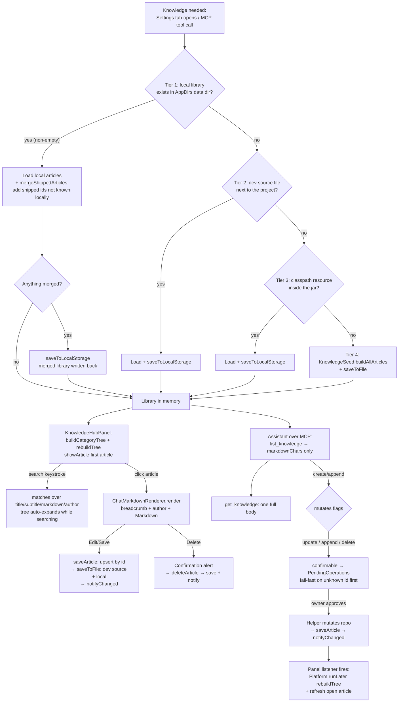

# Chapter 20 — The Knowledge Hub: The App That Documents Itself

> **Part 12 of InvoiceStudio: Zero to Finished Product**
> Files covered in full this chapter: `model/KnowledgeArticle.java`,
> `service/KnowledgeRepository.java`, `service/KnowledgeSeed.java`,
> `ui/KnowledgeHubPanel.java`, `resources/knowledge/knowledge-hub.json`,
> `resources/docs/APP_GUIDE.md`, `resources/docs/MCP_SERVER.md`,
> `resources/docs/TEMPLATE_DESIGN_GUIDE.md`, `mcp/GuideContent.java`,
> the Knowledge-Hub slice of `mcp/McpToolRegistry.java` (tools + helpers —
> the registry itself was Chapter 18's subject), plus four test suites:
> `test/.../service/KnowledgeRepositoryTest.java`,
> `test/.../service/KnowledgeMergeTest.java`,
> `test/.../ui/KnowledgeHubPanelTest.java` and the knowledge acts of
> `test/.../mcp/McpKnowledgeToolsTest.java` — all read and reproduced from
> the repository.
> Goal at the end: **the app ships its own manual inside itself — 30 seeded
> articles, three embedded docs, a searchable Markdown library that the
> owner can edit and the AI assistant can read and write — and the library
> survives every update without ever losing a user's edits.**

---

## 1. Chapter goal

By the end of this chapter you will have built, exactly as the repository
has it:

1. **The article model** (`KnowledgeArticle`) — a tiny Java *record* with a
   self-healing constructor: a null id becomes a generated one, a null path
   becomes "General", a null author becomes "InvoiceStudio Core", and a
   `withUpdates` method produces edited copies instead of mutating.
2. **The repository** (`KnowledgeRepository`) — a singleton that loads the
   library through a **four-tier ladder** (local file → development source →
   bundled classpath resource → built-in seed) and then performs a
   **merge-on-load**: articles the user already has keep their local edits,
   while chapters that ship *new* with an app update are added into stale
   installs. Every mutation notifies listeners so open UI refreshes itself.
3. **The seed** (`KnowledgeSeed`) — 1,552 lines of built-in documentation:
   13 TSC printer & TSPL articles (the Chapter 17 hardware knowledge in
   readable form) plus a 17-chapter AI-chatbot encyclopedia. You will see
   the full mechanics and representative articles verbatim, and an index of
   all thirty.
4. **The panel** (`KnowledgeHubPanel`) — the Settings → Knowledge tab: a
   search box, a multi-level category tree with expand/collapse memory, a
   reader with breadcrumb + author + rendered Markdown, and a full
   view/edit mode pair with add, edit and delete.
5. **The embedded docs trio** (`resources/docs/APP_GUIDE.md`,
   `MCP_SERVER.md`, `TEMPLATE_DESIGN_GUIDE.md`) — three Markdown manuals
   served to AI assistants through the MCP tools `get_app_guide`,
   `get_mcp_docs` and `get_template_design_guide`, loaded by the tiny
   `mcp/GuideContent` class (met in Chapter 18; revisited here from the
   docs' side).
6. **The MCP knowledge tools** — the `list_knowledge`, `get_knowledge`,
   `create_knowledge`, `update_knowledge`, `append_knowledge`,
   `delete_knowledge` slice of `McpToolRegistry`: the assistant's ability to
   read the app's own manual before acting, and to write new knowledge back
   (with confirmation gates on every mutation).
7. **Four test suites** — repository CRUD, the merge contract, the panel
   smoke test, and the MCP round-trips including idempotent retries.

And you will understand the two ideas that make the whole chapter hold
together: **user data never clobbers shipped knowledge, and shipped
knowledge never stays invisible** — the merge rule that fixes both at once.

---

## 2. Story intro

Every serious workshop has two kinds of paper. There is the *job paperwork* —
invoices, receipts, ledgers — which lives in files and cabinets. And then
there is the *manual stand*: the clipboard by the lathe with the maintenance
schedule, the laminated card by the label printer with the "blank labels?
check these four things" list, the binder where the senior mechanic writes
down what he learned so the junior does not rediscover it the hard way.

Software usually ships with the paperwork part covered and the manual stand
missing. Help menus open a browser; knowledge lives in a wiki somewhere
else; the answer to "how do I calibrate this?" is a web search away. And the
app's *own* AI assistant — the one that lives inside the software — knows
less about the software than a stranger on a forum does.

InvoiceStudio builds the manual stand into the workshop. The **Knowledge
Hub** is a Markdown library living *inside the app*: seeded with thirty
articles written by the people who built the printer pipeline and the AI
chatbot, searchable in one box, editable by the owner, persisted back into
the developer's source tree so knowledge added on one machine ships with the
next build — and readable *and writable* by the AI assistant over MCP, so
the machine can consult its own documentation before touching your books.

> **Analogy:** think of the repository as a **library with an acquisitions
> desk**. The *shipped collection* arrives with every new edition of the
> app (the bundled JSON + the seed). The *reading room* is your local copy
> in the app data directory (AppDirs, Chapter 2). The acquisitions rule has
> exactly two clauses: **never overwrite a book a reader has annotated**
> (local edits win for existing ids), and **always shelve new titles the
> publisher added** (new shipped ids merge in). The Knowledge Hub panel is
> the reading room itself — shelves, search, a desk where anyone may write
> a new card for the catalogue.

---

## 3. Concepts first

**Markdown.** A plain-text formatting convention: `#`/`##`/`###` prefix
headings, `-` bullets, `**bold**`, ```` ``` ```` fenced code blocks, `|`
tables, `>` quotes. It matters here for two reasons. First, articles are
*stored* as Markdown strings — no proprietary format, no binary blobs, and
diff-friendly in version control. Second, the app already owns a Markdown
renderer: `ChatMarkdownRenderer` (the AI chat's bubble renderer, Chapter 19)
can turn a Markdown string into a JavaFX node tree — so the Knowledge Hub's
reader costs one call, `ChatMarkdownRenderer.render(markdown, false)`. One
renderer, two consumers.

**Bundled resources vs user data.** A Java app has two kinds of storage.
*Classpath resources* are files packed inside the jar at build time
(`src/main/resources/...`), readable through
`getClass().getResourceAsStream("/knowledge/knowledge-hub.json")` — they are
part of the program, perfect for defaults, but **not writable** at runtime
(and inside a packaged jar, not even a real file). *User data* lives in the
operating system's per-user application directory — `AppDirs.dataDir()`
from Chapter 2 — and is freely writable but starts empty. The Knowledge Hub
needs *both*: defaults that ship with the app, and a copy the user can edit.
The repository's whole load ladder exists to marry them.

**The four-tier load ladder.** On startup the repository fills its article
list from the first tier that yields content:

| Tier | Source | Purpose |
|---|---|---|
| 1 | `AppDirs.dataDir()/knowledge-hub.json` (local library) | The user's real library — edits, added articles, deletions |
| 2 | `src/main/resources/knowledge/knowledge-hub.json` (dev source file) | In a developer workspace, the checked-in copy is authoritative |
| 3 | Classpath resource `/knowledge/knowledge-hub.json` | The copy packed inside the packaged jar |
| 4 | `KnowledgeSeed.buildAllArticles()` | Code-built defaults — the app can never ship empty |

Whichever tier wins, the result is *persisted to tier 1* — so the next run
finds a local library and skips the ladder.

**Merge-on-load.** Tier 1 has one weakness the naive design misses: if the
user's local library was saved by an *older* build, a newer build's new
chapters never reach it — tier 1 wins and stops the ladder. The repository
therefore does a **set-union merge on `id`** after loading tier 1: every
shipped article whose id is unknown locally is added; every id the user
already has keeps its local version untouched. The class comment records
the bug this fixed — a plain "local wins" rule *"froze every install on the
article list it first saved, which is exactly why shipped chapters went
missing ("chapter not showing" reports)."* Chapter 19's `KnowledgeMergeTest`
— sorry, *this* chapter's `KnowledgeMergeTest` — pins the contract.

**Seed pattern (two sources of truth, one test).** The default articles
exist twice: built in Java (`KnowledgeSeed`) and saved as JSON (the
`knowledge-hub.json` resource). Java is the authoring format (text blocks
compile-checked); JSON is the shipped snapshot the packaged app reads.
Two sources can drift — so `KnowledgeMergeTest.bundledResourceContainsToolLimitChapter`
loads the bundled JSON and asserts `assertEquals(30, bundled.size(), "seed
and bundled resource must stay in sync")` plus the presence of the six
newest ids.

**Record with a compact constructor.** A Java *record* declares its fields
in the header and generates constructor, accessors, `equals`, `hashCode`
and `toString`. A *compact constructor* (no parameter list) runs **before**
the implicit field assignments, which makes it the perfect place to
normalize nulls — `KnowledgeArticle` does exactly that, so no other class
in the codebase ever null-checks an article field.

**Category paths.** An article's `path` is a human string like
`"AI Chatbot / 03. MCP & Tool Calling System"` — a hierarchy flattened with
`" / "` separators. `buildCategoryTree()` splits on the regex `\s*/\s*`
(optional whitespace around the slash — tolerant of `"TSC/TSPL"` too),
creates a node per level (case-insensitive matching, so `tsc` and `TSC` are
one shelf), and hangs the article on the deepest node. Top-level nodes
start expanded; deeper ones start collapsed.

**Static change listeners.** The MCP tools mutate articles on *worker
threads* (Chapter 18's executor model), while the panel lives on the JavaFX
Application Thread. The repository keeps a `CopyOnWriteArrayList<Runnable>`
of listeners — a thread-safe list whose iterators never throw
`ConcurrentModificationException` even while another thread appends — and
notifies them after every mutation. The panel wraps its callback in
`Platform.runLater(...)` so the actual UI rebuild hops back onto the FX
thread, which is the only thread allowed to touch scene-graph nodes.

**Token-budget projections.** When the *assistant* lists articles, sending
30 full Markdown bodies would flood its context window. The MCP list
projection therefore ships `id, path, title, subtitle, author, updatedAt`
and `markdownChars` — the body's *size*, not its body. The model reads
metadata first, then fetches exactly one full article with `get_knowledge`.
The same discipline the app applies to its own tables (Chapters 11–14)
applies to the model: show the index, page into the content on demand.

**Full-text search.** The panel's search box matches the query —
case-insensitively — against four fields: `title`, `subtitle`, `markdown`
(the entire body!) and `author`. The tree auto-expands while a query is
active so matches are visible without click-hunting. It is a *contains*
scan, not an index — the honest choice for a library of dozens of articles,
and Section 8 prices the alternative.

---

## 4. Files in this chapter

| # | File | Lines | Role |
|---|---|---|---|
| 1 | `model/KnowledgeArticle.java` | 60 | Immutable article record with self-healing constructor |
| 2 | `service/KnowledgeRepository.java` | 379 | Load ladder, merge-on-load, CRUD, category tree, listeners |
| 3 | `service/KnowledgeSeed.java` | 1,552 | The 30 built-in articles (13 TSC + 17 AI chatbot) |
| 4 | `ui/KnowledgeHubPanel.java` | 614 | Settings → Knowledge tab: tree, reader, editor |
| 5 | `resources/knowledge/knowledge-hub.json` | 240 | Shipped library snapshot (30 articles) |
| 6 | `resources/docs/APP_GUIDE.md` | 185 | The veteran-bookkeeper manual served to AI |
| 7 | `resources/docs/MCP_SERVER.md` | 516 | Operator + developer guide for the MCP server |
| 8 | `resources/docs/TEMPLATE_DESIGN_GUIDE.md` | 613 | Full template design vocabulary |
| 9 | `mcp/GuideContent.java` | 38 | Classpath loader for the docs trio |
| 10 | `mcp/McpToolRegistry.java` (knowledge slice) | ~110 of 2,517 | 6 knowledge tools + 6 helper methods |
| 11 | `test/.../service/KnowledgeRepositoryTest.java` | 160 | Seed, tree, CRUD, search assertions |
| 12 | `test/.../service/KnowledgeMergeTest.java` | 96 | The merge contract + seed/JSON sync pin |
| 13 | `test/.../ui/KnowledgeHubPanelTest.java` | 34 | Panel construction smoke test |
| 14 | `test/.../mcp/McpKnowledgeToolsTest.java` | 369 | MCP round-trips, gates, idempotency, prompt bridge |

Depends on: `AppDirs` (Ch 2 — the data home), `AppLog` (Ch 2),
`ChatMarkdownRenderer` + `ChatbotPanel`'s renderer pipeline (Ch 19),
`IconHelper` / `DialogHelper` / `Toast` (Ch 9), `McpToolRegistry` /
`PendingOperations` (Ch 18), and — thematically — Chapters 17 (the TSC
articles document that pipeline) and 18 (the tools that expose it).

Used by: `SettingsView` (hosts the panel on the Knowledge tab), the MCP
server's `tools/list` surface, the AI assistant's system prompt (pending
approvals, Ch 18), and every future reader of "how does this app work?"

---

## 5. Step-by-step build

We build in dependency order: the record first (everything speaks its
vocabulary), then the repository in three passes (load, CRUD, tree), then
the seed's mechanics with representative articles, then the panel, then the
resources and the MCP surface, and finally the tests that lock the contract.

### Step 1 — `model/KnowledgeArticle.java` (the article, self-healing)

Sixty lines, one record, and a constructor that refuses to store garbage:

```java
package com.invoicestudio.model;

import com.fasterxml.jackson.annotation.JsonIgnoreProperties;

/**
 * An individual article in the Knowledge Hub documentation system.
 *
 * @param id        Unique identifier for the article
 * @param path      Slash-separated hierarchy path, e.g. "TSC / TA210 — Printer" or "Invoicing / GST Rules"
 * @param title     Display title of the article
 * @param subtitle  Short description or summary
 * @param markdown  Full Markdown body text
 * @param updatedAt Timestamp of last modification
 * @param author    Author or contributor of the article (e.g. "InvoiceStudio Core", "Kapto")
 */
@JsonIgnoreProperties(ignoreUnknown = true)
public record KnowledgeArticle(
    String id,
    String path,
    String title,
    String subtitle,
    String markdown,
    long updatedAt,
    String author
) {
    public KnowledgeArticle {
        if (id == null || id.isBlank()) {
            id = "art_" + Long.toHexString(System.nanoTime());
        }
        if (path == null || path.isBlank()) {
            path = "General";
        }
        if (title == null || title.isBlank()) {
            title = "Untitled Article";
        }
        if (subtitle == null) {
            subtitle = "";
        }
        if (markdown == null) {
            markdown = "";
        }
        if (author == null || author.isBlank()) {
            author = "InvoiceStudio Core";
        }
    }
```

Line by line:

- `record KnowledgeArticle(...)` — seven components; the accessors are
  `a.id()`, `a.path()`, and so on (no `get` prefix — records follow the
  field name, as with `ExpenseAnalytics.Bucket` in Chapter 14).
- `@JsonIgnoreProperties(ignoreUnknown = true)` — Jackson (the JSON
  library) may ignore fields it does not recognize. If a future build adds
  an `emoji` or `tags` field, *older* saved files still load — forward
  compatibility for free.
- The **compact constructor** (`public KnowledgeArticle {` — no parameter
  list, no semicolons after the header) reassigns the parameters before the
  record assigns them to fields. Every normalization lives here, which is
  why `buildCategoryTree()` later can call `article.path()` without a null
  check: *the record guarantees the invariant at birth*.
- `id` generation: `"art_" + Long.toHexString(System.nanoTime())` — a
  collision-resistant-enough id for articles created without one. The UI
  and MCP tools both generate their own readable ids
  (`art_<millis>`, `art_mcp_<uuid8>`) and pass them in; this fallback is
  the last line of defense.

```java
    /** Backwards-compatible constructor without author. */
    public KnowledgeArticle(String id, String path, String title, String subtitle, String markdown, long updatedAt) {
        this(id, path, title, subtitle, markdown, updatedAt, "InvoiceStudio Core");
    }

    public KnowledgeArticle withUpdates(String newPath, String newTitle, String newSubtitle, String newMarkdown, String newAuthor) {
        return new KnowledgeArticle(id, newPath, newTitle, newSubtitle, newMarkdown, System.currentTimeMillis(),
                (newAuthor == null || newAuthor.isBlank()) ? author : newAuthor);
    }

    public KnowledgeArticle withUpdates(String newPath, String newTitle, String newSubtitle, String newMarkdown) {
        return withUpdates(newPath, newTitle, newSubtitle, newMarkdown, author);
    }
}
```

Two details worth noticing. First, `withUpdates` returns a **new** record —
records are immutable, so "editing" an article means producing a replacement
with a fresh `updatedAt` (`System.currentTimeMillis()`). Second, the author
rule is subtle: an explicitly *blank* author keeps the **previous** author
rather than resetting to "InvoiceStudio Core" — an edit that does not name
its editor does not erase the original credit.

### Step 2 — `service/KnowledgeRepository.java`, part 1: constants, singleton, listeners

```java
public final class KnowledgeRepository {

    private static final String FILE_NAME = "knowledge-hub.json";
    private static final String CLASSPATH_RESOURCE = "/knowledge/knowledge-hub.json";
    private static final Path SOURCE_DEV_PATH = Paths.get("src", "main", "resources", "knowledge", "knowledge-hub.json");
    private static final ObjectMapper MAPPER = new ObjectMapper().enable(SerializationFeature.INDENT_OUTPUT);

    private static KnowledgeRepository instance;

    private final Path storagePath;
    private final boolean persistToDevSource;
    private final List<KnowledgeArticle> articles = new CopyOnWriteArrayList<>();
    /** Notified after every mutation so open UI (Knowledge Hub panel) and any
     *  future consumers can refresh — MCP/assistant edits happen on worker
     *  threads and would otherwise stay invisible until reopen. */
    private static final List<Runnable> CHANGE_LISTENERS = new CopyOnWriteArrayList<>();
```

Four decisions are packed into these constants:

- **Three file identities.** `FILE_NAME` ("knowledge-hub.json") names the
  *local* library inside `AppDirs.dataDir()`; `CLASSPATH_RESOURCE` names the
  jar-packed copy; `SOURCE_DEV_PATH` names the developer's source tree
  (`src/main/resources/knowledge/knowledge-hub.json`) — a *relative* path,
  which only resolves when the working directory is the project root, i.e.
  exactly when someone is running from an IDE or `mvn javafx:run`.
- `MAPPER` with `INDENT_OUTPUT` — saved JSON is pretty-printed, so the
  checked-in file stays reviewable in git diffs.
- `articles` is a `CopyOnWriteArrayList` — the *iteration-safe* list. The
  MCP tools read this list on worker threads while the UI writes it; a
  plain `ArrayList` would risk `ConcurrentModificationException` mid-render.
- `CHANGE_LISTENERS` is `static` — the panel and the registry never share
  an instance reference, so the notification channel is global, like
  `ChatbotConfig`'s and `ApiKeysVault`'s listener lists (Chapter 19's
  settings surfaces use the same pattern).

```java
    public static void addChangeListener(Runnable l) {
        if (l != null && !CHANGE_LISTENERS.contains(l)) CHANGE_LISTENERS.add(l);
    }

    public static void removeChangeListener(Runnable l) {
        CHANGE_LISTENERS.remove(l);
    }

    private static void notifyChanged() {
        for (Runnable l : CHANGE_LISTENERS) {
            try {
                l.run();
            } catch (Exception e) {
                AppLog.debug(e);
            }
        }
    }

    public static synchronized KnowledgeRepository getInstance() {
        if (instance == null) {
            instance = new KnowledgeRepository(AppDirs.dataDir().resolve(FILE_NAME), true);
        }
        return instance;
    }

    public static KnowledgeRepository createCustom(Path path) {
        return new KnowledgeRepository(path, false);
    }

    KnowledgeRepository(Path storagePath, boolean persistToDevSource) {
        this.storagePath = storagePath;
        this.persistToDevSource = persistToDevSource;
        load();
    }
```

- `notifyChanged` wraps every listener call in its own try/catch — **one
  broken listener can never break the others** (the exact lesson the chat
  log window learned the hard way; see the Round-5 article in the seed).
- `getInstance()` is the production singleton: local library in the app data
  dir (Chapter 2's `AppDirs`), `persistToDevSource = true`.
- `createCustom(path)` is the **test seam**: a repository pointed at any
  file with dev-source persistence *off*, so tests can never write into the
  real source tree. `McpKnowledgeToolsTest` goes one step further and
  *swaps the singleton itself* via reflection — we quote that trick in
  Step 10.
- The package-private constructor runs `load()` immediately — a repository
  is never constructed empty.

### Step 3 — `KnowledgeRepository`, part 2: the load ladder + merge-on-load

This is the heart of the file — and the class javadoc states the storage
architecture before the code confirms it:

```java
/**
 * Repository for managing Knowledge Hub documentation articles.
 *
 * <p>Storage Architecture:</p>
 * <ul>
 *   <li><b>Global Codebase Storage</b>: Loaded from classpath resource {@code /knowledge/knowledge-hub.json}
 *       (or directly from {@code src/main/resources/knowledge/knowledge-hub.json} in development).</li>
 *   <li><b>Global Updates</b>: In development or workspace environments, saving articles writes
 *       directly back to {@code src/main/resources/knowledge/knowledge-hub.json} so that additions
 *       and edits become part of the software codebase and version control.</li>
 *   <li><b>Runtime Fallback</b>: Also syncs to {@code %APPDATA%\InvoiceStudio\knowledge-hub.json}
 *       so that packaged runtime instances persist user additions locally.</li>
 * </ul>
 */
```

```java
    public synchronized void load() {
        articles.clear();

        // 1. If local storagePath exists on disk and is non-empty, use it first (for isolated test repos or runtime edits)
        if (Files.exists(storagePath) && storagePath.toFile().length() > 0) {
            try {
                List<KnowledgeArticle> loaded = MAPPER.readValue(
                        storagePath.toFile(),
                        new TypeReference<List<KnowledgeArticle>>() {});
                if (loaded != null && !loaded.isEmpty()) {
                    articles.addAll(loaded);
                    // ── Merge shipped updates into the local library ──────────
                    // The local copy wins for articles the user already has
                    // (their edits must never be clobbered), but articles that
                    // ship NEW with an app update (e.g. newly seeded chapters)
                    // must reach existing installs too — a plain "local wins"
                    // rule froze every install on the article list it first
                    // saved, which is exactly why shipped chapters went
                    // missing ("chapter not showing" reports).
                    boolean merged = mergeShippedArticles(loadShippedArticles());
                    if (merged) {
                        saveToLocalStorage();
                    }
                    return;
                }
            } catch (Exception ex) {
                AppLog.error(ex);
            }
        }
```

Read the branch as a story about *who owns what*:

- Tier 1 wins if the file exists **and is non-empty** — the `length() > 0`
  guard turns a truncated/corrupt zero-byte file into "no library" instead
  of a crash-and-empty-app.
- On success, the merge runs *before* the method returns. `merged` is true
  only when at least one new id was added, and only then is the merged
  library written back — no needless disk writes on the 99% of launches
  where nothing changed.
- Any parse exception is logged (`AppLog.error`) and the ladder simply
  *continues* — a corrupt local file must never cost the user their manual.

```java
        // 2. Try loading from development source file if it exists on disk
        if (persistToDevSource && Files.exists(SOURCE_DEV_PATH)) {
            try {
                List<KnowledgeArticle> loaded = MAPPER.readValue(
                        SOURCE_DEV_PATH.toFile(),
                        new TypeReference<List<KnowledgeArticle>>() {});
                if (loaded != null && !loaded.isEmpty()) {
                    articles.addAll(loaded);
                    saveToLocalStorage();
                    return;
                }
            } catch (Exception ex) {
                AppLog.error(ex);
            }
        }

        // 3. Try loading from bundled classpath resource
        try (InputStream in = KnowledgeRepository.class.getResourceAsStream(CLASSPATH_RESOURCE)) {
            if (in != null) {
                List<KnowledgeArticle> loaded = MAPPER.readValue(
                        in,
                        new TypeReference<List<KnowledgeArticle>>() {});
                if (loaded != null && !loaded.isEmpty()) {
                    articles.addAll(loaded);
                    saveToLocalStorage();
                    return;
                }
            }
        } catch (Exception ex) {
            AppLog.error(ex);
        }

        // 4. Seed default documentation
        articles.addAll(createDefaultArticles());
        saveToFile();
    }
```

Tiers 2 and 3 are *copies* of shipped knowledge, so on the way out they are
immediately persisted to tier 1 (`saveToLocalStorage()`) — the next run
takes the fast path. Tier 2 is guarded by `persistToDevSource` (only the
production singleton, never `createCustom`, may treat the source tree as a
library). Tier 4 — the in-memory seed — is the floor: `createDefaultArticles()`
is a one-line delegation you will meet at the end of Step 5.

The merge itself is two small methods with one big idea:

```java
    /**
     * Loads the bundled article list for merge-on-load: dev source first
     * (dev workspaces), then the classpath resource shipped in the jar.
     * Returns an empty list when neither is readable — merging then no-ops
     * and the local library loads untouched.
     */
    private List<KnowledgeArticle> loadShippedArticles() {
        List<KnowledgeArticle> shipped = new ArrayList<>();
        if (persistToDevSource && Files.exists(SOURCE_DEV_PATH)) {
            try {
                shipped.addAll(MAPPER.readValue(SOURCE_DEV_PATH.toFile(),
                        new TypeReference<List<KnowledgeArticle>>() {}));
            } catch (Exception ex) {
                AppLog.debug(ex);
            }
        }
        if (shipped.isEmpty()) {
            try (InputStream in = KnowledgeRepository.class.getResourceAsStream(CLASSPATH_RESOURCE)) {
                if (in != null) {
                    shipped.addAll(MAPPER.readValue(in, new TypeReference<List<KnowledgeArticle>>() {}));
                }
            } catch (Exception ex) {
                AppLog.debug(ex);
            }
        }
        return shipped;
    }

    /**
     * Adds every shipped article whose id is missing locally.
     *
     * @return true when at least one article was added (caller should persist)
     */
    private boolean mergeShippedArticles(List<KnowledgeArticle> shipped) {
        if (shipped == null || shipped.isEmpty()) return false;
        Set<String> known = new HashSet<>();
        for (KnowledgeArticle a : articles) known.add(a.id());
        boolean added = false;
        for (KnowledgeArticle b : shipped) {
            if (b != null && b.id() != null && known.add(b.id())) {
                articles.add(b);
                added = true;
            }
        }
        return added;
    }
```

The idiom doing the work is `known.add(b.id())` — `Set.add` returns `true`
only when the element was *not already present*, so one call both dedupes
and detects novelty. Note what the merge deliberately does **not** do: it
never compares `updatedAt` and never picks a "newer" version. An id present
locally is final — the user's copy. Shipped fixes to *existing* articles
reach users only as new ids (this is why the seed's change-log articles
have fresh ids like `art_ai_17_...` instead of editing older rounds).

### Step 4 — `KnowledgeRepository`, part 3: CRUD, saving, categories

```java
    public synchronized void saveArticle(KnowledgeArticle article) {
        if (article == null) return;
        int idx = -1;
        for (int i = 0; i < articles.size(); i++) {
            if (articles.get(i).id().equals(article.id())) {
                idx = i;
                break;
            }
        }
        if (idx >= 0) {
            articles.set(idx, article);
        } else {
            articles.add(article);
        }
        saveToFile();
        notifyChanged();
    }

    public synchronized boolean deleteArticle(String id) {
        if (id == null) return false;
        boolean removed = articles.removeIf(a -> a.id().equals(id));
        if (removed) {
            saveToFile();
            notifyChanged();
        }
        return removed;
    }

    public synchronized void resetToDefaults() {
        articles.clear();
        articles.addAll(createDefaultArticles());
        saveToFile();
    }
```

`saveArticle` is *upsert* semantics: same id replaces in place (preserving
list position), new id appends. Both write paths end in the same two-step
rhythm — `saveToFile(); notifyChanged();` — and `deleteArticle` only saves
and notifies when something was actually removed (deleting an unknown id is
a quiet no-op returning `false`, which the MCP layer converts into a loud
"Article not found" — Step 9).

> **GAP (faithfully preserved):** `resetToDefaults()` is public, tested by
> nobody, and wired to nothing — no menu item, no settings button, no MCP
> tool calls it. It is a perfectly correct factory-reset for the library
> that currently has no front door. It is kept faithfully because it is the
> obvious hook for a future "Restore built-in articles" button — but if you
> go looking for how to trigger it in the shipped UI, there isn't one.

```java
    public List<KnowledgeArticle> getAllArticles() {
        return Collections.unmodifiableList(new ArrayList<>(articles));
    }

    public Optional<KnowledgeArticle> getArticleById(String id) {
        return articles.stream().filter(a -> a.id().equals(id)).findFirst();
    }

    /**
     * Returns a sorted list of all unique category paths currently in use.
     */
    public List<String> getAllCategoryPaths() {
        Set<String> paths = new TreeSet<>(String.CASE_INSENSITIVE_ORDER);
        for (KnowledgeArticle a : articles) {
            if (a.path() != null && !a.path().isBlank()) {
                paths.add(a.path().trim());
            }
        }
        if (paths.isEmpty()) {
            paths.add("General");
        }
        return new ArrayList<>(paths);
    }
```

- `getAllArticles()` — a *defensive copy* wrapped unmodifiable. Callers can
  iterate freely; mutating the copy throws; mutating the repository goes
  through `saveArticle`/`deleteArticle` where the listener notification
  lives. Every read path in the UI and MCP goes through this one door.
- `getAllCategoryPaths()` feeds the editor's path combo box: a
  case-insensitive `TreeSet` (sorted, deduped), with `"General"` as the
  graceful answer when the library is somehow empty.

The save path is where the "two storages" story lands on disk:

```java
    private void saveToFile() {
        // 1. Save to global source in codebase if enabled (dev / source workspace mode)
        if (persistToDevSource) {
            try {
                Path parent = SOURCE_DEV_PATH.getParent();
                if (parent != null && Files.isDirectory(parent)) {
                    MAPPER.writeValue(SOURCE_DEV_PATH.toFile(), articles);
                }
            } catch (Exception e) {
                // Ignored if in read-only environment
            }
        }

        // 2. Save to local storagePath
        saveToLocalStorage();
    }

    private void saveToLocalStorage() {
        try {
            Path parent = storagePath.getParent();
            if (parent != null && !Files.exists(parent)) {
                Files.createDirectories(parent);
            }
            MAPPER.writeValue(storagePath.toFile(), articles);
        } catch (IOException e) {
            AppLog.error(e);
        }
    }
```

Two writes, two postures. The dev-source write checks that its parent
directory actually exists *before* writing (a packaged app installed in
`C:\Program Files` has no `src/main/resources/...` next to it — the check
silently skips instead of throwing) and swallows failures with a comment
saying exactly why. The local write creates missing directories and logs
real errors. In a developer workspace every article you add in the UI is
therefore written **into the git working tree** — knowledge added while
testing becomes part of the next build. Section 7 prices that power
honestly, because it cuts both ways.

### Step 5 — `KnowledgeRepository`, part 4: the category tree

```java
    // ── Tree Construction ─────────────────────────────────────────────

    public static final class CategoryNode {
        private final String name;
        private final String fullPath;
        private final List<CategoryNode> subCategories = new ArrayList<>();
        private final List<KnowledgeArticle> articles = new ArrayList<>();
        private boolean expanded;

        public CategoryNode(String name, String fullPath, boolean expanded) {
            this.name = name;
            this.fullPath = fullPath;
            this.expanded = expanded;
        }

        public String name() { return name; }
        public String fullPath() { return fullPath; }
        public List<CategoryNode> subCategories() { return subCategories; }
        public List<KnowledgeArticle> articles() { return articles; }
        public boolean isExpanded() { return expanded; }
        public void setExpanded(boolean exp) { this.expanded = exp; }

        public int totalArticles() {
            int count = articles.size();
            for (CategoryNode sub : subCategories) {
                count += sub.totalArticles();
            }
            return count;
        }

        public boolean matches(String query) {
            if (query == null || query.isBlank()) return true;
            String q = query.trim().toLowerCase(Locale.ROOT);
            if (name.toLowerCase(Locale.ROOT).contains(q)) return true;
            for (KnowledgeArticle a : articles) {
                if (a.title().toLowerCase(Locale.ROOT).contains(q)) return true;
                if (a.subtitle().toLowerCase(Locale.ROOT).contains(q)) return true;
                if (a.markdown().toLowerCase(Locale.ROOT).contains(q)) return true;
                if (a.author().toLowerCase(Locale.ROOT).contains(q)) return true;
            }
            for (CategoryNode sub : subCategories) {
                if (sub.matches(q)) return true;
            }
            return false;
        }
    }
```

`CategoryNode` is a static nested class — a plain tree node the UI can walk.
Two methods carry real logic:

- `totalArticles()` is **recursive** — a shelf's badge counts its own
  articles plus every sub-shelf's, so the top-level "TSC" chip reads `13`
  without the panel re-implementing the walk.
- `matches(query)` is the tree-side search: a category stays visible if its
  *name*, any *direct article* (four fields), or any *sub-category*
  (recursively) matches. This is what makes search feel like "the tree
  filters itself" instead of "rows vanish".

```java
    /**
     * Builds a multi-level CategoryNode hierarchy from all articles.
     */
    public CategoryNode buildCategoryTree() {
        CategoryNode rootNode = new CategoryNode("Root", "", true);

        for (KnowledgeArticle article : articles) {
            String path = article.path();
            if (path == null || path.isBlank()) path = "General";

            String[] parts = path.split("\\s*/\\s*");
            CategoryNode current = rootNode;
            StringBuilder currentPath = new StringBuilder();

            for (int i = 0; i < parts.length; i++) {
                String part = parts[i].trim();
                if (part.isEmpty()) continue;

                if (currentPath.length() > 0) currentPath.append(" / ");
                currentPath.append(part);

                String pStr = currentPath.toString();
                CategoryNode next = null;
                for (CategoryNode existing : current.subCategories) {
                    if (existing.name.equalsIgnoreCase(part)) {
                        next = existing;
                        break;
                    }
                }
                if (next == null) {
                    boolean defaultExpanded = (i == 0);
                    next = new CategoryNode(part, pStr, defaultExpanded);
                    current.subCategories.add(next);
                }
                current = next;
            }
            current.articles.add(article);
        }

        return rootNode;
    }

    // ── Default Knowledge Seed ────────────────────────────────────────

    private List<KnowledgeArticle> createDefaultArticles() {
        return KnowledgeSeed.buildAllArticles();
    }
}
```

The walk builds `"TSC / TSPL Language"` one segment at a time, carrying the
*canonical* `fullPath` in a `StringBuilder` — so the panel's expand/collapse
memory can key on an exact path string regardless of how the author spelled
the whitespace. Node lookup is case-insensitive (`equalsIgnoreCase`), first
match wins, missing nodes are created on the spot. Note the pattern
discipline: the repository builds *data* (a tree of nodes); the panel
builds *pixels* (rows). The tree logic is testable with no JavaFX at all —
which is exactly what `KnowledgeRepositoryTest` does.

### Step 6 — `service/KnowledgeSeed.java` (the built-in encyclopedia)

At 1,552 lines this is the longest *content* file in the app, and its
mechanics are deliberately boring so its *content* can be interesting:

```java
/**
 * Built-in documentation articles for InvoiceStudio:
 * 1. TSC Printer & Hardware Reference Library (13 articles)
 * 2. Complete AI Chatbot Architecture, Optimization & Build-From-Scratch Encyclopedia (17 chapters)
 */
public final class KnowledgeSeed {

    private KnowledgeSeed() {}

    public static List<KnowledgeArticle> buildAllArticles() {
        List<KnowledgeArticle> list = new ArrayList<>();
        long now = System.currentTimeMillis();

        // =====================================================================
        // SECTION 1: TSC PRINTER REFERENCE LIBRARY (13 Articles)
        // =====================================================================
        list.add(new KnowledgeArticle(
                "art_tsc_overview",
                "TSC / TA210 — Printer",
                "TSC TA210 — Printer Overview",
                "The desktop label printer this app targets: specs, sensors and what makes it different from an A4 printer.",
                """
                The **TSC TA210** is a 4-inch desktop thermal label printer (the TA310 is its 300-dpi sibling). Unlike an office printer, it prints one die-cut label at a time from a roll, burning an image directly with a thermal print head. It supports both direct thermal media (heat-sensitive paper) and thermal transfer (ribbon + media).

                ### Key Specifications (Official TSC Datasheet)
                - **Resolution**: 203 DPI = 8 dots per mm (TA300/TA310 are 300 DPI / 12 dots/mm siblings).
                - **Maximum Print Width**: 4.25 in / 108 mm — the physical width of the print head (300-dpi TA310: 104 mm / 4.09 in).
                - **Maximum Print Speed**: 5 ips (127 mm/s); maximum print length 90 in (2286 mm).
                - **Media Sensors**: Transmissive gap sensor (die-cut labels) and reflective black mark sensor (continuous stock with black marks).
                - **Command Languages**: TSPL / TSPL2 natively (also supports EPL/ZPL emulation on some firmware).

                > [!NOTE]
                > Because the head is 108 mm wide, any liner up to that width prints full-bleed — a 77 mm two-up liner is perfectly in range. The app warns only when the label stock paper width exceeds 108 mm.

                ---
                ### Why this matters in the app
                Every label dimension configured in the **Label Stock dialog** is converted from millimeters to dots at **8 dots/mm**, and the print head receives a 1-bit bitmap at exactly that density.
                """,
                now,
                "TSC Hardware Team"
        ));
```

The pattern, once seen, repeats thirty times:

1. A stable, human-readable **id** (`art_tsc_overview`) — this is the merge
   key from Step 3, so it must be stable across builds.
2. A **path** (`"TSC / TA210 — Printer"`) — two tree levels in one string.
3. **Title** and a one-line **subtitle** (the subtitle is what the list
   projections and search show).
4. A **Java text block** (`"""..."""`) holding the full Markdown body —
   indentation is stripped by the compiler relative to the closing
   delimiter, so the Markdown survives verbatim, `> [!NOTE]` callouts and
   ` ```tspl ` code fences included.
5. `now` — a single timestamp taken once per `buildAllArticles()` call, and
   an **author** string ("TSC Hardware Team" / "InvoiceStudio AI Core").

> **NOTE (kept faithful):** because `now` is captured once per build, every
> article seeded on a given run shares one `updatedAt`. The checked-in
> `knowledge-hub.json` snapshot shows a single instant for all thirty
> entries (a September-2026 timestamp from the dev-mode save that produced
> it) — dates in the Hub mean "when this snapshot was written", not
> per-article edit times. Only UI- and MCP-created articles get true
> per-edit timestamps.

> **NOTE (kept faithful):** the SECTION 2 banner comment still reads
> "(11 Chapters)" while the section ships seventeen `art_ai_*` articles —
> a stale count from before rounds 12–17 were appended. The class javadoc
> above it (correctly) says 17. The comments disagree with each other; the
> articles and the tests agree with the javadoc.

The TSC section is Chapter 17's machinery translated for humans. A second
representative article shows the pattern's teaching style — one full print
job, command by command:

```java
        list.add(new KnowledgeArticle(
                "art_tspl_anatomy",
                "TSC / TSPL Language",
                "Script Anatomy — One Label Job",
                "The exact command sequence InvoiceStudio streams to the TA210 for a print run.",
                """
                Every print run sent by InvoiceStudio follows a clean, deterministic script structure: a setup header followed by an image buffer per strip row and a `PRINT` command specifying copies to feed.

                ```tspl
                SIZE 432 dot,200 dot
                GAP 24 dot,0 dot
                DIRECTION 1
                CLS
                BITMAP 0,0,54,200,0,<binary bitmap data>
                PRINT 1,1
                ```

                ### Command Breakdown
                - `SIZE 432 dot,200 dot`: The strip row (web width × row height) in dots (54 mm × 25 mm at 8 dots/mm = 432 × 200).
                - `GAP 24 dot,0 dot`: The physical die-cut gap between labels (3 mm = 24 dots). The optical sensor uses this to detect label start.
                - `DIRECTION 1`: The bitmap's y=0 edge feeds first, so the label reads upright immediately after tearing.
                - `CLS`: Clears the image memory buffer before rendering.
                - `BITMAP`: Burns the 1-bit monochrome raster image of the full strip row.
                - `PRINT 1,1`: Feeds exactly ONE label row. Five identical copies become one bitmap followed by `PRINT 5,1`.\n""",
                now,
                "TSC Hardware Team"
        ));
```

Section 2 is the AI-chatbot encyclopedia. Its articles quote the *app's own
code* — this one explains the two-pass router from Chapter 19's world with
the actual escalation snippet:

```java
        list.add(new KnowledgeArticle(
                "art_ai_04_smart_routing",
                "AI Chatbot / 02. Optimization & Intelligence",
                "Smart Routing & Schema Pruning Engine",
                "How 50+ tools are dynamically pruned to 1-3 candidates, slashing token usage by 85%.",
                """
                Rather than forcing every conversational turn to carry all 50+ MCP tool schemas, InvoiceStudio introduces a **Two-Pass Smart Router**.

                ### How It Works
                ```mermaid
                flowchart TD
                    A["User: 'Show me top 5 buyers by outstanding'"] --> B["Pass 1: Smart Router"]
                    B --> C{"Does query need tools?"}
                    C -- No --> D["Direct conversational reply (0 tools)"]
                    C -- Yes --> E["Shortlist candidate tool names: ['list_buyers']"]
                    E --> F["Pass 2: Heavy Dispatch (only 'list_buyers' schema)"]
                    F --> G["Model calls list_buyers(limit=5)"]
                    G --> H["McpToolRegistry executes locally"]
                    H --> I["Model outputs formatted Markdown table"]
                ```

                ### 1. Pass 1 — Names-Only Tool Router
                - **Method**: `routeTools(cfg, turns, first, confirmCtx)` in `AiChatClient.java` (lines 296–340).
                - Instead of full JSON parameter schemas, the router sends a lightweight directory of tool names and one-line summaries:
                  ```
                  list_buyers: List all buyers/customers
                  create_buyer: Create a buyer/customer
                  financial_summary: High-level P&L and receivables
                  ...
                  ```
                - Total prompt size: ~400 tokens (vs. 7,500 tokens for full schemas).
                - The router outputs a compact JSON response:
                  `{"needTools": true, "tools": ["list_buyers"]}`

                ### 2. Direct Conversational Answers
                If the user asks a conceptual question (e.g. *"What is GST ITC?"* or *"Explain thermal transfer ribbons"*), the router answers immediately in `route.note()`. The system skips Pass 2 entirely, saving a full API round-trip!

                ### 3. The Escalation Safety Net
                What if the router under-selects and the model realizes mid-thought that it needs a tool outside the shortlist?
                ```java
                // AiChatClient.java lines 194-202
                if (allowed != null && !escalated) {
                    if (resp.toolCalls().stream().anyMatch(tc -> !allowed.contains(tc.name()))) {
                        escalated = true;
                        allowed = null; // restore all 50+ tools
                        ChatbotLogManager.warn("Model requested tool outside shortlist -> escalating to full catalogue", null);
                        continue;
                    }
                }
                ```
                The engine escalates **once** to the full catalogue. This guarantees 100% functional reliability while preserving an average 85% token savings across 95% of queries.
                """,
                now,
                "InvoiceStudio AI Core"
        ));
```

The file ends the way it began — no cleverness, just the list:

```java
        return list;
    }
}
```

**The complete index.** All thirty articles, as the repository seeds them —
path (the shelf), id (the merge key), and what the article is for:

| Path | id | Article |
|---|---|---|
| TSC / TA210 — Printer | `art_tsc_overview` | Printer overview: 203 DPI, 108 mm head, sensors, TSPL |
| TSC / TA210 — Printer | `art_tsc_sensors` | What the printer knows vs what the software must declare; BarTender↔Label Stock mapping |
| TSC / TA210 — Printer | `art_tsc_sizes` | Media envelope (25.4–118 mm) + the 17 Label Stock presets |
| TSC / Print Settings | `art_tsc_brightness` | The brightness threshold: how dots burn black vs white |
| TSC / Print Settings | `art_tsc_knobs` | System-property overrides (engine routing, dots/mm, TSPL dump) |
| TSC / TSPL Language | `art_tspl_language` | The command language: dots, CRLF, why native beats GDI |
| TSC / TSPL Language | `art_tspl_anatomy` | One label job: SIZE/GAP/DIRECTION/CLS/BITMAP/PRINT |
| TSC / TSPL Language | `art_tspl_setup` | Setup commands in depth |
| TSC / TSPL Language | `art_tspl_bitmap` | BITMAP syntax, byte width, bit polarity (0 = burn) |
| TSC / TSPL Language | `art_tspl_print` | PRINT m,n; 100 copies = one bitmap + `PRINT 100,1` |
| TSC / Troubleshooting | `art_tsc_blank_labels` | Four ordered causes for blank labels after a good one |
| TSC / Troubleshooting | `art_tsc_troubleshooting` | Symptom → cause → fix (all-black, faint, clipped, unscannable) |
| TSC / Inside the App | `art_tsc_pipeline` | Canvas → composer → 406 DPI snapshot → threshold → TSPL → USB |
| AI Chatbot / 01. Architecture & Lifecycle | `art_ai_01_lifecycle` | End-to-end execution cycle (keystroke → MCP loop → bubbles) |
| AI Chatbot / 01. Architecture & Lifecycle | `art_ai_02_ui_components` | Design system, auto-growing input, copy, Markdown |
| AI Chatbot / 02. Optimization & Intelligence | `art_ai_03_smalltalk` | Zero-cost greeting interceptor |
| AI Chatbot / 02. Optimization & Intelligence | `art_ai_04_smart_routing` | Two-pass router + escalation (quoted above) |
| AI Chatbot / 02. Optimization & Intelligence | `art_ai_05_confirmation_context` | Multi-turn approvals; `confirm_operation` force-injection |
| AI Chatbot / 03. MCP & Tool Calling System | `art_ai_06_mcp_system` | ToolDef anatomy, 3-tier safety model, McpEnsure, 4,000-char cap |
| AI Chatbot / 03. MCP & Tool Calling System | `art_ai_07_adding_new_tools` | The cookbook: add a tool with zero engine changes |
| AI Chatbot / 04. Multi-Provider & Model Hub | `art_ai_08_multi_provider` | Gemini/OpenAI/Claude/Ollama REST contracts, quota failover |
| AI Chatbot / 04. Multi-Provider & Model Hub | `art_ai_09_realtime_diagnostics` | Live logs, routing decisions, MCP timings |
| AI Chatbot / 05. The Complete Build-From-Scratch Manual | `art_ai_10_build_from_scratch` | The 6-phase master blueprint |
| AI Chatbot / 06. Future Optimization Roadmap | `art_ai_11_future_roadmap` | Embeddings, prompt caching, local SLMs, streaming |
| AI Chatbot / 07. Tool-Call Limit & Quota Failover | `art_ai_12_tool_limit_failover` | Max tool rounds; automatic model failover |
| AI Chatbot / 08. Speed & Cost Optimization | `art_ai_13_speed_optimization` | The optimization pass end to end |
| AI Chatbot / 09. Bug Playbook & Token-Light Speed | `art_ai_14_bug_playbook` | Failure classes and shipped fixes |
| AI Chatbot / 10. Round 3 — Token Meter, GLM Catalogue & Live Pipeline | `art_ai_15_round3_tokens_glm_pipeline` | Per-message tokens, GLM catalogue, pipeline bar |
| AI Chatbot / 16. Round-4 Change Log | `art_ai_16_round4_instant_greetings_new_fullsurface` | Local greetings, `/new`, full-surface harness |
| AI Chatbot / 17. Round-5 Change Log | `art_ai_17_round5_logs_vault_stock_dropdown` | Log-window fix, API key vault, stock dropdowns |

> **NOTE (kept faithful):** the AI section's category numbering runs
> 01…10 and then jumps to 16 and 17 for the round change-logs — the round
> numbers are release-round labels, not tree positions, and the tree
> happily renders them as-is. Nothing sorts by that number; only humans
> notice.

### Step 7 — `ui/KnowledgeHubPanel.java` (the reading room)

The panel is a `VBox` (full-height, self-managed scrolling) with three
zones: a hero bar, a sidebar (search + tree), and a content `StackPane`
that swaps between *view mode* and *edit mode*. Its javadoc states the
contract:

```java
/**
 * Settings → Knowledge Hub: Markdown-driven documentation and knowledge base.
 *
 * <p>Key features:</p>
 * <ul>
 *   <li><b>Markdown-Driven</b>: Articles are formatted and rendered via clean GitHub-Flavored Markdown.</li>
 *   <li><b>Editable & Dynamic</b>: Supports View Mode and Edit Mode; add, edit, and delete topics at any level.</li>
 *   <li><b>Multi-Level Tree</b>: Expandable/collapsible hierarchy with toggle persistence and auto-expanding search filter.</li>
 *   <li><b>Full Monitor Height</b>: Automatically calculates height = monitor/window height - box start Y - margin to prevent outer display scrolling.</li>
 *   <li><b>Global Codebase Storage</b>: Loaded from and saved directly into the application codebase with author tracking.</li>
 * </ul>
 */
public class KnowledgeHubPanel extends VBox {
```

The fields group into sidebar, content and state — note the two *mode
containers* that will trade places inside one `StackPane`:

```java
    private final KnowledgeRepository repo = KnowledgeRepository.getInstance();

    // ── Sidebar Controls ──────────────────────────────────────────────
    private final TextField searchField = new TextField();
    private final VBox treeBox = new VBox(2);
    private final ScrollPane treeScroll = new ScrollPane(treeBox);
    private final Label countChip = new Label();
    private final Set<String> expandedCategories = new HashSet<>();

    // ── Content Controls ──────────────────────────────────────────────
    private final StackPane contentArea = new StackPane();
    private final VBox viewModeContainer = new VBox(10);
    private final VBox editModeContainer = new VBox(10);

    // View Mode elements
    private final Label breadcrumbLbl = new Label();
    private final Label contentTitle = new Label();
    private final Label authorLbl = new Label();
    private final Label contentSubtitle = new Label();
    private final VBox markdownBox = new VBox(10);
    private final ScrollPane articleScroll = new ScrollPane(markdownBox);
    private final Button editBtn = new Button("Edit Article");
    private final Button deleteBtn = new Button("Delete");

    // Edit Mode elements
    private final Label editModeTitleLbl = new Label("Edit Documentation Article");
    private final ComboBox<String> pathCombo = new ComboBox<>();
    private final TextField titleField = new TextField();
    private final TextField authorField = new TextField();
    private final TextField subtitleField = new TextField();
    private final TextArea markdownEditor = new TextArea();
    private final Button saveBtn = new Button("Save Article");
    private final Button cancelBtn = new Button("Cancel");
```

`expandedCategories` is the toggle memory: a `Set<String>` of `fullPath`s —
user expand/collapse state survives tree rebuilds (which happen on every
search keystroke), it just doesn't survive an app restart. The constructor
wires the whole lifecycle in 40 lines:

```java
    public KnowledgeHubPanel() {
        setSpacing(10);
        setPadding(new Insets(10, 10, 8, 10));
        setFillWidth(true);
        VBox.setVgrow(this, Priority.ALWAYS);

        // Expand root topics by default
        expandedCategories.add("TSC");
        expandedCategories.add("AI Chatbot");

        getChildren().addAll(buildHero(), buildBody());

        searchField.textProperty().addListener((obs, oldVal, newVal) -> rebuildTree());
        rebuildTree();

        // Dynamically constrain split height to monitor height minus start Y and bottom margin
        sceneProperty().addListener((obs, oldScene, newScene) -> {
            if (newScene != null) {
                newScene.heightProperty().addListener((o, ov, nv) -> updateSplitHeight());
                Platform.runLater(this::updateSplitHeight);
            }
        });
        layoutBoundsProperty().addListener((obs, ov, nv) -> updateSplitHeight());

        // Select first article
        List<KnowledgeArticle> all = repo.getAllArticles();
        if (!all.isEmpty()) {
            showArticle(all.get(0));
        }

        // Refresh when articles change OUTSIDE this panel (the assistant's
        // knowledge_* MCP tools mutate on worker threads) — the sidebar tree
        // and count chip must not go stale until reopen.
        KnowledgeRepository.addChangeListener(() -> Platform.runLater(() -> {
            rebuildTree();
            if (currentArticle != null) {
                KnowledgeArticle fresh = repo.getArticleById(currentArticle.id()).orElse(null);
                if (fresh != null && fresh != currentArticle) {
                    showArticle(fresh);
                }
            }
        }));
    }
```

Five things happen, in a deliberate order:

1. The two seed root paths start expanded (`"TSC"`, `"AI Chatbot"`) — a
   first-time reader sees content, not thirteen closed drawers.
2. The search listener routes every keystroke into `rebuildTree()`.
3. The **height law** (below) is attached to the scene.
4. The first article opens immediately — the tab is never blank.
5. The **live refresh** subscription. The guard `fresh != currentArticle`
   is a reference comparison: after an MCP mutation the repository holds a
   *new* record instance (records are immutable — Step 1), so an edited
   open article re-renders, while an untouched one does not flicker.

The height law is the panel's one piece of geometry:

```java
    /**
     * Calculates and enforces split height = window/scene height - box start Y - margin.
     * Prevents the whole display/window from scrolling while keeping internal scrollbars active.
     */
    private void updateSplitHeight() {
        if (split == null || getScene() == null) return;
        double sceneH = getScene().getHeight();
        if (sceneH <= 0) return;

        javafx.geometry.Point2D p = split.localToScene(0, 0);
        double startY = (p != null && p.getY() > 0) ? p.getY() : 180.0;
        double bottomMargin = 28.0;
        double avail = Math.max(320.0, sceneH - startY - bottomMargin);

        split.setMaxHeight(avail);
        split.setPrefHeight(avail);
    }
```

The panel measures where its split sits (`localToScene(0, 0)` — "my top
edge, in window coordinates", with a 180 px fallback before layout runs)
and clamps its own height to the space below that line minus a 28 px bottom
margin, never smaller than 320 px. The *outer* page never scrolls; only the
tree and the article body scroll internally. This is why `SettingsView`
hosts the panel specially — no wrapper `ScrollPane`:

```java
        // Full-height multi-pane views (like Knowledge Hub) manage their own internal
        // scrolling and must occupy 100% of the tab viewport height.
        if (content instanceof com.invoicestudio.ui.KnowledgeHubPanel) {
            tab.setContent(content);
            return tab;
        }
```

The view mode's center is one line doing all the rendering work:

```java
    private void showArticle(KnowledgeArticle article) {
        this.currentArticle = article;
        this.isCreatingNew = false;

        breadcrumbLbl.setText(article.path().replace(" / ", "  ›  ").toUpperCase());
        contentTitle.setText(article.title());

        String dateStr = DateTimeFormatter.ofPattern("MMM d, yyyy")
                .withZone(ZoneId.systemDefault())
                .format(Instant.ofEpochMilli(article.updatedAt()));
        authorLbl.setText("👤  By " + article.author() + "  ·  🕒  " + dateStr);

        contentSubtitle.setText(article.subtitle().isEmpty() ? "No description provided." : article.subtitle());

        markdownBox.getChildren().clear();
        Node renderedContent = ChatMarkdownRenderer.render(article.markdown(), false);
        markdownBox.getChildren().add(renderedContent);

        // Reset scroll position to top
        Platform.runLater(() -> articleScroll.setVvalue(0.0));

        contentArea.getChildren().setAll(viewModeContainer);
        rebuildTree();
    }
```

- The breadcrumb turns the path `"AI Chatbot / 01. Architecture & Lifecycle"`
  into `AI CHATBOT › 01. ARCHITECTURE & LIFECYCLE` — the category *is* the
  breadcrumb, one string, no parsing.
- `ChatMarkdownRenderer.render(markdown, false)` — `false` means "not an
  error bubble"; the same renderer the chat uses, so headings, tables, code
  fences and `[!NOTE]` callouts render identically in both places.
- `Platform.runLater(...)` for the scroll reset — the scroll value is set
  *after* the new content has been laid out, otherwise JavaFX clamps it to
  the old height.
- `setAll(viewModeContainer)` — the StackPane swap that ends edit mode.

The editor opens pre-filled and saves through the repository:

```java
    private void startCreatingNewArticle(String defaultPath) {
        isCreatingNew = true;
        editModeTitleLbl.setText("Create New Documentation Article");

        pathCombo.setItems(FXCollections.observableArrayList(repo.getAllCategoryPaths()));
        String path = (defaultPath != null && !defaultPath.isBlank())
                ? defaultPath
                : (currentArticle != null ? currentArticle.path() : "TSC / General");
        pathCombo.setValue(path);

        titleField.clear();
        authorField.setText(System.getProperty("user.name", "InvoiceStudio Core"));
        subtitleField.clear();
        markdownEditor.setText("# Article Title\n\nOverview of this topic...\n\n### Key Concepts\n- Point 1\n- Point 2\n\n```tspl\n// Code sample\n```\n");

        contentArea.getChildren().setAll(editModeContainer);
    }

    private void saveCurrentEdit() {
        String title = titleField.getText() == null ? "" : titleField.getText().trim();
        if (title.isEmpty()) {
            titleField.setStyle(titleField.getStyle() + "-fx-border-color: #EF4444;");
            return;
        }

        String path = pathCombo.getValue() == null ? "" : pathCombo.getValue().trim();
        if (path.isEmpty()) path = "General";

        String author = authorField.getText() == null || authorField.getText().isBlank()
                ? System.getProperty("user.name", "InvoiceStudio Core")
                : authorField.getText().trim();

        String subtitle = subtitleField.getText() == null ? "" : subtitleField.getText().trim();
        String markdown = markdownEditor.getText() == null ? "" : markdownEditor.getText();

        KnowledgeArticle toSave;
        if (isCreatingNew || currentArticle == null) {
            String newId = "art_" + System.currentTimeMillis();
            toSave = new KnowledgeArticle(newId, path, title, subtitle, markdown, System.currentTimeMillis(), author);
        } else {
            toSave = currentArticle.withUpdates(path, title, subtitle, markdown, author);
        }

        repo.saveArticle(toSave);
        showArticle(toSave);
    }
```

Three quiet decisions worth learning: the **author field defaults to the
logged-in OS user** (`System.getProperty("user.name")` — attribution for
free); the **path combo is editable** and pre-filled with existing paths,
so creating a new shelf is typing, not configuration; and the new-article
id is `art_` + epoch millis — human-debuggable and unique enough for a
single user's machine.

> **NOTE (kept faithful):** the failed-save guard appends the red border
> style each time (`titleField.getStyle() + "-fx-border-color: #EF4444;"`)
> and nothing ever removes it. Behavior stays correct — inline-style
> declarations for the same property resolve last-wins, and a successful
> save swaps straight to view mode — but the style string grows a little
> on every failed attempt and the red border is still there the next time
> you open the editor. A `titleField.setStyle(<original>)` reset before the
> check would tidy it (Section 8).

Deletion asks first, and handles the "last article" edge:

```java
    private void confirmDeleteCurrentArticle() {
        if (currentArticle == null) return;
        Alert alert = new Alert(Alert.AlertType.CONFIRMATION);
        alert.setTitle("Delete Article");
        alert.setHeaderText("Delete '" + currentArticle.title() + "'?");
        alert.setContentText("Are you sure you want to delete this article? This action cannot be undone.");
        DialogHelper.styleDialog(alert);

        alert.showAndWait().ifPresent(response -> {
            if (response == ButtonType.OK) {
                repo.deleteArticle(currentArticle.id());
                List<KnowledgeArticle> remaining = repo.getAllArticles();
                if (!remaining.isEmpty()) {
                    showArticle(remaining.get(0));
                } else {
                    currentArticle = null;
                    markdownBox.getChildren().clear();
                    contentTitle.setText("No Articles");
                    contentSubtitle.setText("Click + Add Article to create your first article.");
                }
                rebuildTree();
            }
        });
    }
```

And the tree rendering — the search loop the whole sidebar lives in:

```java
    private void rebuildTree() {
        String query = searchField.getText() == null ? "" : searchField.getText().trim().toLowerCase(Locale.ROOT);
        treeBox.getChildren().clear();

        KnowledgeRepository.CategoryNode root = repo.buildCategoryTree();
        int[] count = {0};

        // Render each top level category under root (e.g. "TSC", "AI Chatbot")
        for (KnowledgeRepository.CategoryNode topCat : root.subCategories()) {
            if (topCat.matches(query)) {
                renderCategoryNode(topCat, query, 0, count);
            }
        }

        countChip.setText(count[0] + " topics");
    }

    private void renderCategoryNode(KnowledgeRepository.CategoryNode node, String query, int depth, int[] count) {
        boolean searching = !query.isEmpty();
        boolean isExp = searching || expandedCategories.contains(node.fullPath());

        treeBox.getChildren().add(buildGroupRow(node, depth, isExp));

        if (isExp) {
            // 1. Render child categories first
            for (KnowledgeRepository.CategoryNode sub : node.subCategories()) {
                if (sub.matches(query)) {
                    renderCategoryNode(sub, query, depth + 1, count);
                }
            }

            // 2. Render articles belonging to this category
            for (KnowledgeArticle art : node.articles()) {
                if (matchesQuery(art, query)) {
                    treeBox.getChildren().add(buildArticleRow(art, depth + 1));
                    count[0]++;
                }
            }
        } else {
            // Count collapsed matching articles as well
            countCollapsedArticles(node, query, count);
        }
    }
```

The single cleverest line is `boolean isExp = searching || expandedCategories.contains(...)`: **an active search expands everything it touches** — matches must be visible to be clicked. When *not* searching, the user's
expand/collapse memory rules. `count[0]` is the mutable-counter-in-closure
idiom (an `int[]` because lambdas need effectively-final locals) feeding
the hero bar's "N topics" chip — and `countCollapsedArticles` walks
collapsed shelves so the count stays honest even for hidden articles.

The row builders close the file — group rows toggle on a click *anywhere*
(the event handler is on the whole `HBox`, with the comment *"Clicking
ANYWHERE on the row toggles expand / collapse reliably"*), article rows
highlight the current selection with a gold left border, and both indent by
`6 + depth * 14` pixels so the hierarchy reads at a glance.

### Step 8 — the shipped resources: `knowledge-hub.json` and the docs trio

`src/main/resources/knowledge/knowledge-hub.json` is the tier-2/3 snapshot
of the seed: a Jackson pretty-printed array of the same 30 articles —
**13 TSC + 17 AI = 30 unique ids** — each with exactly the seven record
fields:

```json
[ {
  "id" : "art_tsc_overview",
  "path" : "TSC / TA210 — Printer",
  "title" : "TSC TA210 — Printer Overview",
  "subtitle" : "The desktop label printer this app targets: specs, sensors and what makes it different from an A4 printer.",
  "markdown" : "The **TSC TA210** is a 4-inch desktop thermal label printer (the TA310 is its 300-dpi sibling). Unlike an office printer, it prints one die-cut label at a time from a roll, burning an image directly with a thermal print head. It supports both direct thermal media (heat-sensitive paper) and thermal transfer (ribbon + media).\n\n### Key Specifications (Official TSC Datasheet)\n- **Resolution**: 203 DPI = 8 dots per mm (TA300/TA310 are 300 DPI / 12 dots/mm siblings).\n- **Maximum Print Width**: 4.25 in / 108 mm — the physical width of the print head (300-dpi TA310: 104 mm / 4.09 in).\n- **Maximum Print Speed**: 5 ips (127 mm/s); maximum print length 90 in (2286 mm).\n- **Media Sensors**: Transmissive gap sensor (die-cut labels) and reflective black mark sensor (continuous stock with black marks).\n- **Command Languages**: TSPL / TSPL2 natively (also supports EPL/ZPL emulation on some firmware).\n\n> [!NOTE]\n> Because the head is 108 mm wide, any liner up to that width prints full-bleed — a 77 mm two-up liner is perfectly in range. The app warns only when the label stock paper width exceeds 108 mm.\n\n---\n### Why this matters in the app\nEvery label dimension configured in the **Label Stock dialog** is converted from millimeters to dots at **8 dots/mm**, and the print head receives a 1-bit bitmap at exactly that density.\n",
  "updatedAt" : 1789786291073,
  "author" : "TSC Hardware Team"
}, {
```

The Markdown body is one giant escaped JSON string — that is what a text
block looks like after `MAPPER.writeValue` with `INDENT_OUTPUT`. The tree
shelves it fills mirror the seed exactly: 3 + 2 + 5 + 2 + 1 on the TSC
side, 2 + 3 + 2 + 2 + 1 + 1 + 1 + 1 + 1 + 1 + 1 + 1 on the AI side.

The three `resources/docs/*.md` manuals are a *different* documentation
channel with the *same* philosophy — the app explaining itself — but
served **read-only to AI assistants** over MCP rather than edited by
humans. `mcp/GuideContent` is the whole loading mechanism (met in Chapter
18's Step 6; quoted here because the docs are this chapter's subject):

```java
/** Loads the embedded docs (APP_GUIDE.md / MCP_SERVER.md) from app resources. */
public final class GuideContent {

    private static final String GUIDE = "/docs/APP_GUIDE.md";
    private static final String MCP_DOCS = "/docs/MCP_SERVER.md";
    private static final String TEMPLATE_DESIGN = "/docs/TEMPLATE_DESIGN_GUIDE.md";

    private GuideContent() {}

    /** Full application manual (what the app is, every feature, how to use it). */
    public static String appGuide() {
        return read(GUIDE);
    }

    /** MCP server documentation (protocol, tools, safety model). */
    public static String mcpDocs() {
        return read(MCP_DOCS);
    }

    /** Full print-template design reference: element types, properties, bindings, workflows. */
    public static String templateDesignGuide() {
        return read(TEMPLATE_DESIGN);
    }

    private static String read(String resource) {
        try (InputStream in = GuideContent.class.getResourceAsStream(resource)) {
            if (in == null) return "Documentation resource missing: " + resource;
            return new String(in.readAllBytes(), StandardCharsets.UTF_8);
        } catch (Exception e) {
            return "Failed to load " + resource + ": " + e.getMessage();
        }
    }
}
```

Note the failure posture: a missing resource returns a *string that says
so*, never null and never an exception — an AI client reading a broken
build's guide gets an honest sentence instead of a protocol error.

**APP_GUIDE.md (185 lines)** — "written the way a 10-year veteran
bookkeeper would explain the software to a new operator." It opens by
placing the app in one paragraph and then maps the whole data model:

```markdown
# InvoiceStudio — Complete Application Guide

*This guide is served to AI assistants through the InvoiceStudio MCP server
(`get_app_guide` tool) and lives in the app resources as
`/docs/APP_GUIDE.md`. It is written the way a 10-year veteran bookkeeper
would explain the software to a new operator.*

## What InvoiceStudio is

InvoiceStudio is a desktop GST billing, inventory and double-entry
accounting application for Indian businesses (Tally-style workflows):

- **Sales cycle** — tax invoices to Buyers (Sundry Debtors), receipts,
  credit notes, buyer ledgers and CC book transactions.
- **Purchase cycle** — purchase bills from Sellers/Suppliers (Sundry
  Creditors), supplier payments, debit-note groundwork, input tax credit.
- **Inventory** — an immutable stock ledger: every purchase adds stock IN,
  every sale records stock OUT; current stock is always
  `opening + Σin − Σout` and can never be hand-edited.
```

...and walks every workflow (invoice → purchase → payments → expenses →
financial statements → stock ledger → templates → auth → shortcuts → bulk
output → settings). Chapter 6's immutability rule appears as one line of
operator wisdom: *"current stock is always `opening + Σin − Σout` and can
never be hand-edited."*

**MCP_SERVER.md (516 lines)** — two parts. Part A is the *operator* guide:
ten numbered flows ("Add item", "Invoice 3 units", "Record a purchase",
"Book an expense", "Anything destructive", …) and the golden habits. Its
**Flow 10** is the docs trio's philosophy in miniature — the app telling
the AI to read its own manual first:

````markdown
### Flow 10 — Knowledge Hub: the app documents ITSELF, read it first

The Knowledge Hub is not help-file decoration — it is the assistant's own
operating manual (chatbot internals, MCP tool semantics, TSC/TSPL printing,
billing workflows). Reading the relevant chapter BEFORE a complex task is
the single cheapest accuracy upgrade available:

```
list_knowledge { path: "AI Chatbot" }             // discover chapters (ids, titles, sizes)
get_knowledge { id: "art_ai_12_tool_limit_failover" }   // read ONE chapter in full
```

Write paths (respect the reading order — discover, read, then write):

```
create_knowledge { path: "AI Chatbot / 09. Team Notes", title: "Idle timeouts",
                   subtitle: "One line", markdown: "## Observation\n...", author: "Ops" }
append_knowledge { id: "art_...", markdown: "\n## 2026-09-18 note\n..." }  // additive
update_knowledge { id: "art_...", markdown: "<FULL new body>" }            // replace
delete_knowledge { id: "art_..." }                                         // remove
```
````

Part B is the developer guide — the entity-relationship map, `McpEnsure`,
per-tool specs, and the extension checklist for adding a tool (the
checklist Chapter 18 walks in full).

**TEMPLATE_DESIGN_GUIDE.md (613 lines)** — the complete design vocabulary
for print templates: the page-size table (A4/A5/LETTER/LEGAL/THERMAL_58/
THERMAL_80/CUSTOM), all 23 element types with their properties, variable
bindings, the TABLE column keys, the proven recipes ("Classic A4 GST
invoice anatomy", "Thermal 80mm receipt anatomy"), and the barcode/label
chapter that pairs with Chapter 17. Its opening rule is the design loop
every AI template session follows:

```markdown
> **The golden loop (never design blind):**
> 1. `duplicate_template` a preset (or `create_template` from scratch) —
> 2. `get_template` to read its anatomy — every element with exact mm
>    coordinates, fonts, colors and bindings,
> 3. `update_template` with your edited element list,
> 4. `render_template_preview` to SEE the rendered bill exactly as it prints,
> 5. read the `warnings` in the response (out-of-bounds elements, unknown
>    bindings), fix, re-render, repeat.
> 6. Only when the preview looks right, declare the template done.
```

### Step 9 — the MCP knowledge tools (the assistant's library card)

The Knowledge Hub's last consumer is the AI assistant. Chapter 18 covered
`McpToolRegistry` as a whole — 77 tools, confirmation gates, audit trail —
so here we read only the knowledge slice, which is self-contained. First
the six `ToolDef` registrations (a `ToolDef` is name + description + JSON
schema + two safety flags, `mutates` and `destructive`):

```java
        // --- Knowledge Hub (assistant self-knowledge: read BEFORE acting) ---
        t.add(new ToolDef("list_knowledge",
                "List Knowledge Hub documentation articles (id, category path, title, subtitle, author, size). Filter by query text and/or category path. THE app documents its own chatbot, MCP tools and printer workflows here — list/get the relevant articles BEFORE complex tasks so your plan follows the app's own best practices.",
                obj(
                        "query", str("Optional search text matched against path/title/subtitle/body"),
                        "path", str("Optional category path filter (e.g. 'AI Chatbot')"),
                        "limit", num("Max rows (default 40)")), false, false));
        t.add(new ToolDef("get_knowledge",
                "Get ONE Knowledge Hub article in full (markdown body). Use after list_knowledge. Best practice: read the relevant chapter before multi-step work (billing flows, template design, label printing, chatbot/MCP behavior).",
                obj("id", str("Article id (from list_knowledge)")), false, false));
        t.add(new ToolDef("create_knowledge",
                "Create a NEW Knowledge Hub article. Check-then-create: an article with the same title in the same category path already exists → it is returned unchanged (existed=true) — use update_knowledge or append_knowledge to change it instead of stacking duplicates. Follow the house style: title without the chapter number (the path carries it), markdown body, subtitle = one-line summary.",
                obj(
                        "path", str("Category path, '/'-separated, e.g. 'AI Chatbot / 09. Team Notes' (required)"),
                        "title", str("Article title (required)"),
                        "subtitle", str("One-line summary"),
                        "markdown", str("Full markdown body (required)"),
                        "author", str("Author (default 'InvoiceStudio Assistant')")), true, false));
        t.add(new ToolDef("update_knowledge",
                "Replace fields of an EXISTING Knowledge Hub article (path, title, subtitle, markdown, author). Read the article with get_knowledge first and send the FULL new markdown (this replaces the body, it does not merge). For additive changes prefer append_knowledge. Requires user confirmation.",
                obj(
                        "id", str("Article id (from list_knowledge)"),
                        "path", str("New category path"),
                        "title", str("New title"),
                        "subtitle", str("New one-line summary"),
                        "markdown", str("FULL replacement markdown body"),
                        "author", str("New author")), true, true));
        t.add(new ToolDef("append_knowledge",
                "APPEND markdown to the END of an existing Knowledge Hub article (keeps everything already there — add new sections, extra steps, dated notes). Idempotent guard: if the exact same block is already the article's tail, nothing is appended (alreadyAppended=true). Requires user confirmation.",
                obj(
                        "id", str("Article id (from list_knowledge)"),
                        "markdown", str("Markdown block to append at the end (required)")), true, true));
        t.add(new ToolDef("delete_knowledge", "Delete a Knowledge Hub article permanently. Prefer update/append unless the article is truly obsolete. Requires user confirmation.",
                obj("id", str("Article id (from list_knowledge)")), true, true));
```

The flag grammar from Chapter 18 maps cleanly: `list`/`get` are
`(false, false)` — execute immediately; `create` is `(true, false)` — a
safe mutation; `update`/`append`/`delete` are `(true, true)` — they route
through `confirmable(...)`, which queues a `PendingOperations` entry with a
human-readable summary and returns `requiresConfirmation: true` plus an
`operationId`. The user (or the model, on the owner's say-so) approves via
`confirm_operation`.

The helper methods behind the dispatch (`case "list_knowledge": return
knowledgeList(args);` and so on) show the projections and the idempotency
guards:

```java
    private static Object knowledgeList(Map<String, Object> args) {
        String query = strOr(args, "query", "").trim().toLowerCase(Locale.ROOT);
        String pathFilter = strOr(args, "path", "").trim().toLowerCase(Locale.ROOT);
        List<Map<String, Object>> out = new ArrayList<>();
        for (com.invoicestudio.model.KnowledgeArticle a : knowledge().getAllArticles()) {
            String p = (a.path() == null ? "" : a.path());
            if (!pathFilter.isEmpty() && !p.toLowerCase(Locale.ROOT).contains(pathFilter)) continue;
            if (!query.isEmpty()
                    && !a.title().toLowerCase(Locale.ROOT).contains(query)
                    && !a.subtitle().toLowerCase(Locale.ROOT).contains(query)
                    && !a.markdown().toLowerCase(Locale.ROOT).contains(query)
                    && !p.toLowerCase(Locale.ROOT).contains(query)) continue;
            out.add(mapOf("id", a.id(), "path", p, "title", a.title(),
                    "subtitle", a.subtitle(), "author", a.author(),
                    "updatedAt", a.updatedAt(), "markdownChars", a.markdown().length()));
        }
        return out.size() > intVal(args, "limit", 40) ? out.subList(0, intVal(args, "limit", 40)) : out;
    }
```

The projection deliberately ships `markdownChars` (the body's *size*) and
never `markdown` — token discipline, as promised in Section 3. Create is
idempotent by *(path, title)* — the guard that stops a retried request from
stacking a twin chapter:

```java
    private static Object knowledgeCreate(Map<String, Object> args) {
        String path = str(args, "path");
        String title = str(args, "title");
        String markdown = str(args, "markdown");
        if (path == null || path.isBlank()) throw new IllegalArgumentException("path is required");
        if (title == null || title.isBlank()) throw new IllegalArgumentException("title is required");
        if (markdown == null || markdown.isBlank()) throw new IllegalArgumentException("markdown is required");
        // Idempotent by (path, title) — never stack duplicate chapters when a
        // create retried or the same note already exists.
        for (com.invoicestudio.model.KnowledgeArticle a : knowledge().getAllArticles()) {
            if (a.title().equalsIgnoreCase(title.trim())
                    && a.path() != null && a.path().equalsIgnoreCase(path.trim())) {
                return mapOf("ok", true, "id", a.id(), "existed", true, "matchedBy", "path+title",
                        "note", "An article with this title already exists in this path; returned unchanged. "
                                + "Use update_knowledge or append_knowledge to change it.");
            }
        }
        com.invoicestudio.model.KnowledgeArticle art = new com.invoicestudio.model.KnowledgeArticle(
                "art_mcp_" + UUID.randomUUID().toString().substring(0, 8),
                path.trim(), title.trim(),
                strOr(args, "subtitle", ""),
                markdown,
                System.currentTimeMillis(),
                strOr(args, "author", "InvoiceStudio Assistant"));
        knowledge().saveArticle(art);
        return mapOf("ok", true, "id", art.id(), "existed", false,
                "path", art.path(), "title", art.title());
    }
```

And `append_knowledge` — the *additive* sibling, whose idempotency guard
recognizes its own tail:

```java
    private static void knowledgeAppend(Map<String, Object> args) {
        com.invoicestudio.model.KnowledgeArticle a = requireKnowledgeArticle(str(args, "id"));
        String block = str(args, "markdown");
        if (block == null || block.isBlank()) throw new IllegalArgumentException("markdown is required");
        String current = a.markdown() == null ? "" : a.markdown();
        // Idempotent guard: appending the exact tail block twice must not
        // duplicate it (retries happen).
        if (current.stripTrailing().endsWith(block.strip())) {
            return; // already appended — nothing to do
        }
        String joined = current.endsWith("\n") || current.isEmpty()
                ? current + "\n" + block : current + "\n\n" + block;
        knowledge().saveArticle(a.withUpdates(a.path(), a.title(), a.subtitle(), joined, a.author()));
    }
```

`requireKnowledgeArticle` is the shared *fail-fast loader* for all three
gated mutations — an unknown id throws **before** `confirmable` queues an
operation, so a hallucinated id can never park a zombie approval in the
pending list (the test in Step 10 asserts exactly that). The delete helper
turns the repository's quiet `false` into a loud error so the model always
learns *why* nothing happened:

```java
    private static void knowledgeDelete(Map<String, Object> args) {
        boolean removed = knowledge().deleteArticle(str(args, "id"));
        if (!removed)
            throw new IllegalArgumentException("Article not found: " + str(args, "id")
                    + " — call list_knowledge for valid ids");
    }
```

Every mutation lands in `saveArticle` → `notifyChanged()` → the panel's
listener from Step 7 — the loop closes: *the assistant writes knowledge,
and the owner watches it appear in the Hub without reopening anything*
(Flow 10's closing promise: "what you author is on screen immediately").

### Step 10 — the four test suites

**`KnowledgeRepositoryTest`** builds each repo against a temp file
(`createCustom`) and pins the seed, the tree, CRUD and search:

```java
    @Test
    void seedsDefaultArticlesWithTscAndAiChatbot() {
        List<KnowledgeArticle> articles = repo.getAllArticles();
        assertFalse(articles.isEmpty(), "Should seed default articles");
        assertTrue(articles.size() >= 24, "Should seed at least 24 articles (TSC + AI Chatbot): got " + articles.size());

        // Verify articles belong to either TSC or AI Chatbot and carry authors
        for (KnowledgeArticle a : articles) {
            assertTrue(a.path().startsWith("TSC") || a.path().startsWith("AI Chatbot"),
                    "Default article path must start with 'TSC' or 'AI Chatbot': " + a.path());
            assertNotNull(a.markdown(), "Article markdown must not be null");
            assertFalse(a.markdown().isBlank(), "Article markdown must not be blank");
            assertNotNull(a.author(), "Article author must not be null");
            assertFalse(a.author().isBlank(), "Article author must not be blank");
        }

        // Verify persistence to disk
        assertTrue(Files.exists(tempFile), "Should create JSON file on disk");
        assertTrue(tempFile.toFile().length() > 500, "JSON file should contain data");
    }
```

> **NOTE (kept faithful):** the threshold is `>= 24` while the shipped seed
> is 30 — the test was written when the seed had 24 articles and was
> deliberately left as a floor so future chapters can be appended without
> touching it. The *exact* count is pinned elsewhere: in
> `KnowledgeMergeTest`, where 30 must match both source and snapshot.

The tree test walks both roots by name and demands substance under them
("TSC should have subcategories like TA210, TSPL, etc.", "AI Chatbot
should have at least 5 chapters"), the CRUD test round-trips a custom
article **through a second repository instance reading the same file from
disk** (the sharpest persistence proof in the suite):

```java
        // Reload from disk to verify persistence
        KnowledgeRepository reloadedRepo = KnowledgeRepository.createCustom(tempFile);
        Optional<KnowledgeArticle> fromDisk = reloadedRepo.getArticleById("art_custom_gst");
        assertTrue(fromDisk.isPresent());
        assertEquals("GST Input Tax Credit Guide", fromDisk.get().title());
        assertEquals("Kapto Accountant", fromDisk.get().author());
```

…and `categoryNodeMatchesQuery` fires six real queries at the whole tree —
`"bitmap"`, `"TA210"`, `"sensor"`, `"Smart Routing"`, `"Smalltalk"`,
`"InvoiceStudio AI Core"` — each matching through a *different* field
(body, title, body, title, title, author), plus one guaranteed miss.

**`KnowledgeMergeTest`** is the chapter's crown jewel — it encodes the
incident report in its javadoc and then proves the fix:

```java
/**
 * Locks the Knowledge Hub merge-on-load contract:
 * <ul>
 *   <li>a stale local library still WINS for the ids it already has
 *       (user edits are never clobbered), and</li>
 *   <li>articles shipped NEW with an app update are merged in — this is the
 *       fix for "chapter not showing" reports (older installs kept their
 *       original 24-article list forever and never received the
 *       "07. Tool-Call Limit &amp; Quota Failover" chapter).</li>
 * </ul>
 */
class KnowledgeMergeTest {
```

The scenario: a local library containing one user article and *one locally
edited seeded article* (`art_tsc_overview` retitled to "Local Edit Title").
Then the assertions, in the order a reviewer wants them:

```java
        // 1. Local-only article survives
        Optional<KnowledgeArticle> mine = repo.getArticleById("art_local_custom");
        assertTrue(mine.isPresent(), "local-only articles must survive the merge");

        // 2. Local edits are NOT clobbered by the shipped copy
        assertEquals("Local Edit Title", repo.getArticleById("art_tsc_overview").orElseThrow().title());

        // 3. Shipped NEW chapters are merged in — including the previously
        //    missing "chapter 7" (Tool-Call Limit & Quota Failover)
        assertTrue(repo.getArticleById("art_ai_12_tool_limit_failover").isPresent(),
                "the previously-missing tool-limit chapter must merge into stale libraries");
        assertTrue(repo.getArticleById("art_ai_13_speed_optimization").isPresent(),
                "newly shipped optimization chapter must merge into stale libraries");

        // 4. Persisted: the merged library is saved back to local storage
        KnowledgeArticle[] persisted = m.readValue(library.toFile(), KnowledgeArticle[].class);
        assertEquals(repo.getAllArticles().size(), persisted.length,
                "merged library must be persisted");
```

> **NOTE (kept faithful):** the test carries a vestigial prop —
> `String localJson = "[" + ObjectMapper.class.getName() + "]";` followed
> by `assertNotNull(localJson); // (keeps the JSON import honest)`. The
> string is never used; the assertion is always true. It exists (per its
> own comment) to keep the Jackson imports meaningful in an earlier
> version of the test. Harmless, and left exactly as shipped.

The second test closes the *other* half of the incident — the snapshot
itself must not lag the seed:

```java
    @Test
    void bundledResourceContainsToolLimitChapter() throws Exception {
        // The shipped resource itself must no longer lag the seed (the root
        // cause of the missing chapter): 13 TSC + 17 AI = 30 articles.
        try (var in = KnowledgeRepository.class.getResourceAsStream("/knowledge/knowledge-hub.json")) {
            assertNotNull(in, "bundled knowledge-hub.json must exist");
            com.fasterxml.jackson.databind.ObjectMapper m = new com.fasterxml.jackson.databind.ObjectMapper();
            List<KnowledgeArticle> bundled = m.readValue(
                    in, m.getTypeFactory().constructCollectionType(List.class, KnowledgeArticle.class));
            assertTrue(bundled.stream().anyMatch(a -> "art_ai_12_tool_limit_failover".equals(a.id())),
                    "bundled resource must contain the tool-limit chapter");
            ...
            assertEquals(30, bundled.size(), "seed and bundled resource must stay in sync");
        }
```

**`KnowledgeHubPanelTest`** is a two-act smoke test:

```java
    @Test
    void loadsAndRendersArticlesInKnowledgeHub() {
        KnowledgeRepository repo = KnowledgeRepository.getInstance();
        List<KnowledgeArticle> articles = repo.getAllArticles();
        assertFalse(articles.isEmpty(), "Knowledge repository must contain articles");

        Platform.runLater(() -> {
            KnowledgeHubPanel panel = new KnowledgeHubPanel();
            assertNotNull(panel);
            assertTrue(panel.getChildren().size() >= 2, "Panel must contain hero and body");
        });
    }
```

> **ISSUE (faithfully preserved):** the two UI assertions live *inside*
> `Platform.runLater(...)` — they are queued onto the JavaFX event queue,
> and nothing ever waits for that queue to drain. The test method can
> (and on a busy machine, will) return green before the panel is ever
> constructed; if construction threw, the exception surfaces on the FX
> thread, not in the test result. The repository assertions outside the
> lambda are real and do run. The standard fix — `CountDownLatch` +
> `Platform.runLater` on the latch, or the TestFX toolkit — is sketched in
> Section 8; the shipped test is kept as-is because its repository-side
> half still carries value.

**`McpKnowledgeToolsTest`** (the suite Chapter 18 introduced) has seven
knowledge acts, run in `@Order` because they build on each other. The
setup does the reflection dance so the tests can never touch real files:

```java
        // Swap the KnowledgeRepository singleton for an isolated copy: the
        // registry's knowledge() helper reads getInstance(), so pointing the
        // singleton at a temp file (dev-source persistence OFF) keeps the
        // bundled JSON and the dev tree untouched.
        tempJson = File.createTempFile("knowledge-mcp-test-", ".json");
        tempJson.delete();
        isolatedRepo = KnowledgeRepository.createCustom(tempJson.toPath());
        var f = KnowledgeRepository.class.getDeclaredField("instance");
        f.setAccessible(true);
        f.set(null, isolatedRepo);
```

The sharpest assertions per act:

- **Act 1** — the list projection's token discipline: every row *must
  omit* `markdown` and *must include* `markdownChars`.
- **Act 3** — idempotent create: the second identical create returns the
  *same id* with `existed=true` — `"duplicate create must NOT stack a twin"`.
- **Act 4** — the gate semantics: `update_knowledge` returns
  `requiresConfirmation`, its summary must warn `"body REPLACED"`, and only
  `PendingOperations.approve(opId)` executes it; then append must
  *"KEEP the original body and add the block at the END"* — asserted by
  index order: `body.indexOf("new body only") < body.indexOf("extra note")`.
- **Act 5** — the append retry loop: the same block appended twice, then
  `assertEquals(1, body.split("## Dated note", -1).length - 1, "retrying
  the same append must not duplicate the block")` — counting occurrences
  by split arithmetic.
- **Act 6** — fail-fast before the gate: an unknown id throws, and
  `PendingOperations.pending()` must contain **no** `update_knowledge`
  entry — `"unknown-id update must not queue a pending operation"`.
- **Act 7** — the listener contract: a counting listener proves create and
  delete both notify (`"create must notify (drives the live UI refresh)"`).
- **Act 11** — the system-prompt bridge: a queued `delete_knowledge`
  operation must appear in the assistant's system prompt with its exact
  `operationId` and tool name, and vanish after rejection — the owner's
  approval loop made visible to the model.

---

## 6. How it works at runtime

One master pattern — **load through the ladder, merge the shipment, notify
on every write** — serves three consumers: the owner reading, the owner
editing, and the assistant working over MCP.



Reading the diagram as four journeys:

1. **First run, packaged app.** No local file, no dev source → the classpath
   resource yields all 30 articles → they are immediately written to the
   local library. Every run after that is tier 1 + a cheap merge.
2. **Dev workspace.** `src/main/resources/knowledge/knowledge-hub.json`
   exists, so tier 2 wins and the developer's edits in the UI flow straight
   back into git (Step 4's dual write).
3. **An app update ships two new chapters.** The user's local library loads,
   `mergeShippedArticles` finds two unknown ids, adds them, persists — the
   "chapter not showing" report never happens again. Their locally edited
   articles are untouched.
4. **The assistant writes a note.** `create_knowledge` → idempotency check →
   `saveArticle` → `notifyChanged` → `Platform.runLater` → the owner, who is
   staring at the Knowledge tab, sees the tree grow a row under
   `AI Chatbot / 09. …` in real time — no reopen, no refresh button.

The knowledge then flows *outward* one more step: the same articles shape
the assistant's behavior (`get_knowledge` before complex work), and the
pending-approval loop (Ch 18) surfaces queued `update/append/delete`
operations — with exact ids — inside the assistant's own system prompt.

---

## 7. How to change it

**Add an article to the built-in library.** Three touch points, in this
order:

1. `KnowledgeSeed.buildAllArticles()` — a new `list.add(new KnowledgeArticle(...))`
   with a **stable, never-before-used id** (the convention:
   `art_<topic>` or `art_ai_NN_<topic>`). Remember the id is the merge key —
   reusing an old id means stale installs will keep their local copy and
   your new text will never reach them.
2. The shipped snapshot: run the app once in dev mode (tier 2 load + merge +
   `saveToFile` refreshes `src/main/resources/knowledge/knowledge-hub.json`),
   or edit the JSON by hand to match.
3. `KnowledgeMergeTest.bundledResourceContainsToolLimitChapter` — bump the
   `assertEquals(30, …)` and (optionally) add your id to the
   `anyMatch` list, keeping "seed and bundled resource must stay in sync"
   a *tested* sentence.

Miss #2 and the merge test fails (the snapshot lags the seed — the exact
root cause of the original missing-chapter bug). Miss #1's id rule and your
new text silently never ships to existing installs.

**Change category paths (the shelf names).** Edit the `path` argument in
the seed (and regenerate the JSON). Nothing else needs touching: the tree,
breadcrumbs, `getAllCategoryPaths`, and the MCP `path` filter all derive
from the string. Two rules to respect: keep the `" / "` separator (the tree
splits on `\s*/\s*`, so a path without slashes becomes one flat shelf under
*no* root — top-level rendering expects at least one segment under Root),
and remember `KnowledgeHubPanel`'s constructor hard-codes the two default
expanded roots (`expandedCategories.add("TSC"); add("AI Chatbot")`) — if
you rename or replace those roots, update those two lines or the first-run
tree opens with everything collapsed.

**Add a fourth docs page** (say, `FAQ.md` for the assistant). Four touch
points: create `src/main/resources/docs/FAQ.md`; add a constant + getter to
`GuideContent` (copy the `read(...)` call — the loader is one line per doc);
register a `ToolDef` + a dispatch `case` in `McpToolRegistry` (copy
`get_mcp_docs`, flags `(false, false)`); and mention the new tool in
`MCP_SERVER.md`'s tool list so the docs never lie about the surface. The
docs and the registry are parallel hand-maintained lists (Chapter 18's
standing GAP about catalogue drift applies here too).

**Change the panel's look.** All colors are inline constants at the top of
`KnowledgeHubPanel` (`GOLD`, `TEXT`, `MUTED`, `CARD_STYLE`) plus inline
styles per node — this panel predates the CSS-class discipline of the
views (Chapters 11–14) and is styled self-contained. Changing the app theme
does *not* change this panel; grep for `#D9A13B` and `#131B28` to find
every site.

**Change the height law.** `updateSplitHeight()`'s three magic numbers are
the whole contract: `180.0` (fallback startY before layout), `28.0` (bottom
margin), `320.0` (minimum height). Raise the minimum if your articles are
dense; lower the margin only if you also check the window bottom on the
smallest supported screen.

**Change the merge rule.** `mergeShippedArticles` is the one method standing
between user edits and shipped knowledge. If you ever want "shipped copy
wins when it's newer", you must also handle the delete case (a shipped
*removal* can never propagate through an id-union merge — deleted-in-code
articles would resurrect from every local library) — and you must update
`KnowledgeMergeTest`'s four numbered assertions, which currently forbid
exactly that behavior.

**Verify any change worked.** `mvn test -Dtest=KnowledgeRepositoryTest,KnowledgeMergeTest`
for the contract; `mvn test -Dtest=McpKnowledgeToolsTest` for the MCP
surface; and for the UI, the Chapter 21 runtime harness
(`./scripts/knowledge_verify_test.sh` with `SettingsKnowledgeLauncher` /
`ChatbotKnowledgeLauncher`) opens the real panel and the real chatbot
against a packaged jar.

---

## 8. Performance & UX analysis

| Decision | What it does | Cost | Better alternative? | Trade-off & difficulty |
|---|---|---|---|---|
| JSON file library (not SQLite table) | Articles version-control cleanly, diff reviewably, and load with one Jackson call | Whole file rewritten on every save (30 articles ≈ 80 KB — trivial) | A `knowledge_article` table (migration + no git history of content) | File wins for a curated, codebase-shaped library. **Easy** |
| Merge-on-load (id union) | New chapters reach stale installs; local edits never lost | One pass + one `HashSet` per launch | Ship-only defaults, no merge ("chapter not showing" forever) | Correctness on both sides. **Easy** |
| Seed as Java text blocks | Compiler-checked authoring; articles participate in refactors | The seed file is 1,552 lines | External `.md` files loaded at build time (a build plugin) | Tooling vs zero new build machinery. **Medium** |
| `CopyOnWriteArrayList` for articles | Safe cross-thread reads while MCP writes | Copy on every write (30-element list — negligible) | Synchronized list (lock contention on reads) | Right tool at this size. **Easy** |
| Full-rebuild tree per keystroke | One rendering path — no incremental update bugs | Rebuilds ~50 rows of labels per character typed | FilteredList-style predicate reuse, or debounce | Consistency vs micro-latency; fine at 30 articles. **Easy** |
| Search = `contains` over full Markdown | Finds anything, no index to maintain | O(articles × body length) per keystroke (~30 × ~4 KB ≈ 120 KB scans — sub-millisecond) | Precomputed lowercase index or inverted index | Honesty vs scalability; revisit past a few hundred articles. **Easy** |
| `markdownChars` projection over MCP | The model buys metadata before bodies | Two calls for read-then-fetch | Sending full bodies (token flood) | Token budget. **Easy** |
| Idempotent create/append guards | Model retries never duplicate content | A linear scan per create; a tail compare per append | None — retries are a *fact* of LLM traffic | — **Easy** |
| Dual write (dev source + local) | UI edits become code in dev workspaces | One extra file write per mutation | Local only (knowledge stops shipping) | Power vs foot-gun — see below. **Easy** |
| Inline styles in the panel | Self-contained, theme-independent | Restyling means touching many string literals | CSS classes like the views | Consistency vs isolation. **Easy** |

**OPTIONAL IMPROVEMENT — reset the red-border style on every save attempt.**
The failed-title guard appends to the existing style string (the NOTE in
Step 7). One-line fix:

```java
// OPTIONAL IMPROVEMENT — clear before marking
private static final String TITLE_STYLE_CLEAN = "-fx-background-color: #0E141F; -fx-text-fill: #FFFFFF; "
        + "-fx-border-color: #273449; -fx-border-radius: 6; -fx-background-radius: 6; "
        + "-fx-padding: 7 10 7 10; -fx-font-size: 13px; -fx-font-weight: bold;";

private void saveCurrentEdit() {
    titleField.setStyle(TITLE_STYLE_CLEAN);           // always start clean
    if (title.isEmpty()) {
        titleField.setStyle(TITLE_STYLE_CLEAN + "-fx-border-color: #EF4444;");
        return;
    }
    ...
}
```
*Why better:* the editor's state stops accumulating and the red border
clears the moment the title is valid. *Difficulty:* Easy. *What the user
notices:* the editor stops remembering old mistakes.

**OPTIONAL IMPROVEMENT — make the panel test wait for the FX queue.** The
`KnowledgeHubPanelTest` ISSUE from Step 10 fixes like this:

```java
// OPTIONAL IMPROVEMENT — deterministic JavaFX assertion
@Test
void loadsAndRendersArticlesInKnowledgeHub() throws Exception {
    assertFalse(KnowledgeRepository.getInstance().getAllArticles().isEmpty());
    CountDownLatch done = new CountDownLatch(1);
    AtomicReference<Throwable> failure = new AtomicReference<>();
    Platform.runLater(() -> {
        try {
            KnowledgeHubPanel panel = new KnowledgeHubPanel();
            assertTrue(panel.getChildren().size() >= 2, "Panel must contain hero and body");
        } catch (Throwable t) {
            failure.set(t);
        } finally {
            done.countDown();
        }
    });
    assertTrue(done.await(10, TimeUnit.SECONDS), "FX queue did not run the block");
    assertNull(failure.get(), "panel construction failed on the FX thread");
}
```
*Why better:* the test turns from "green by timing" into a real assertion
that construction *succeeded* on the FX thread. *Difficulty:* Easy.
*What the user notices:* nothing — but CI stops lying.

**OPTIONAL IMPROVEMENT — debounce the search field.** Every keystroke
rebuilds the tree and rescans every Markdown body. A `TextFormatter` with
a 120 ms `PauseTransition` (or `Timeline`) turns bursts of keystrokes into
one rebuild:

```java
// OPTIONAL IMPROVEMENT (outline) — one rebuild per pause in typing
private final PauseTransition searchPause = new PauseTransition(Duration.millis(120));
// constructor:
searchPause.setOnFinished(e -> rebuildTree());
searchField.textProperty().addListener((o, ov, nv) -> { searchPause.playFromStart(); });
```
*Why better:* identical feel on 30 articles, and the design already scales
when the library grows past a few hundred. *Difficulty:* Easy. *What the
user notices:* nothing today; the absence of lag later.

**OPTIONAL IMPROVEMENT — atomic saves.** `saveToLocalStorage` writes the
target file in place; a crash mid-write leaves a truncated JSON that tier 1
then rejects (the ladder rescues you, but local edits since the last good
write are gone). Write-then-move:

```java
// OPTIONAL IMPROVEMENT (outline) — crash-safe save
Path tmp = storagePath.resolveSibling(storagePath.getFileName() + ".tmp");
MAPPER.writeValue(tmp.toFile(), articles);
Files.move(tmp, storagePath, StandardCopyOption.REPLACE_EXISTING, StandardCopyOption.ATOMIC_MOVE);
```
*Why better:* the local library becomes crash-proof without changing any
caller. *Difficulty:* Easy. *What the user notices:* nothing — which is
the point; their notes survive a power cut.

**OPTIONAL IMPROVEMENT — a front door for `resetToDefaults`.** The GAP in
Step 4 wants one button: a "Restore built-in articles" link in the hero bar
calling `repo.resetToDefaults()` (with the same confirmation dialog the
delete flow uses). *Why better:* the factory reset stops being dead code.
*Difficulty:* Easy. *What the user notices:* an escape hatch after a
well-meaning assistant deletes the wrong shelf.

**What you feel as a user:** a documentation tab that opens *instantly*
(no network, no index build), a search that finds a phrase buried in any
article body as you type, a tree that opens itself while you search and
closes politely when you stop, and — the part nobody sees but everybody
benefits from — an assistant that reads the manual before it touches your
books, and whose additions appear in your library the moment you approved
them.

---

## 9. Common mistakes and fixes

| Symptom | Cause | Fix |
|---|---|---|
| New seeded chapter never appears on an existing install | Snapshot (`knowledge-hub.json`) or the seed id changed, but the test wasn't run / the id was reused | Keep ids stable-and-new; regenerate the JSON in dev mode; let `KnowledgeMergeTest`'s `assertEquals(30, …)` (bumped) catch the lag |
| A locally edited article "loses" the shipped improvements | That's the merge rule working: local wins per id | Ship content changes as *new ids* (the round change-logs do exactly this); update the local copy via `update_knowledge` if you really want to |
| A user-deleted seeded article reappears after restart | Id-union merge re-adds every shipped id missing locally — by design | Delete = "hide" is not supported; remove the article from the seed/JSON too, or accept resurrection (the manual is load-bearing) |
| Tree shows one flat list instead of hierarchy | Paths written without the `" / "` separator (or with trailing junk) | Keep `"A / B"` format; the split is `\s*/\s*` — spaces around slashes are fine, a *missing* slash is not |
| Two tree shelves that look identical | Case differences (`"TSC"` vs `"tsc"`) are one node in the tree (case-insensitive) but two entries in `getAllCategoryPaths`'s combo suggestions? No — the set is case-insensitive too; the real risk is two *spellings* ("TSC " with space vs without) | Normalize paths when creating (`path.trim()`) — the tools already do; fix any hand-typed outliers in the JSON |
| Assistant says it created an article; the panel shows nothing | You're looking at a panel from before the write — the listener notification was consumed by an exception in an earlier listener | `notifyChanged` already isolates listeners (try/catch each); check `AppLog` debug output for a throwing listener |
| Panel never refreshes after MCP writes at all | The panel's listener was registered but the write went through a *different* repository instance (a `createCustom` in test code, or two singletons after reflection tampering) | Always mutate through `KnowledgeRepository.getInstance()` in production paths; restore the singleton in test teardown (as `McpKnowledgeToolsTest` does) |
| `getResourceAsStream` returns null in the packaged jar | The resource path lacks the leading `/` or the file wasn't packaged | Use `/knowledge/knowledge-hub.json` exactly; check the jar contains `knowledge/` under resources root — tier 4's seed is the safety net |
| All seeded articles show the same "updated" date | They do — `now` is one timestamp per build (the NOTE in Step 6) | Not a bug; only UI/MCP-created articles carry true per-edit timestamps |
| Red border on the title field never goes away | Style appended per failed save, never cleared (NOTE in Step 7) | Apply the OPTIONAL IMPROVEMENT — reset the style before validating |
| `IllegalStateException: Not on FX application thread` from a knowledge mutation | A listener touched scene-graph nodes directly from the MCP worker thread | Wrap listener bodies in `Platform.runLater(...)` — the panel already does; copy that shape |
| MCP create stacks duplicate chapters | Someone bypassed `knowledgeCreate`'s idempotency check | Route all writes through the registry helpers (or replicate the path+title check); `McpKnowledgeToolsTest` act 3 pins the behavior |

---

## 10. Checkpoint

You can verify everything this chapter built without writing a line of
code:

1. `mvn javafx:run` → sign in → **Settings → Knowledge**: the tree opens
   with **TSC** and **AI Chatbot** expanded, thirteen and seventeen topics
   respectively; the hero chip reads the total; the first article is
   already rendered with breadcrumb, author and date.
2. Type `bitmap` in the search — the tree auto-expands to the TSPL articles
   whose bodies match; clear it — the tree collapses back to your
   expand/collapse memory. Click through
   `AI Chatbot / 03. MCP & Tool Calling System` and confirm the Markdown
   renders tables, code fences and `> [!NOTE]` callouts exactly like the
   chat does.
3. Press **+ Add Article** — the editor opens with your OS user name as the
   author and the current path pre-filled; save with an empty title to see
   the red-border guard; then save properly and watch the tree grow your
   row. Edit a seeded article's title, delete it, confirm the dialog, and
   watch the library re-shelve.
4. If you run from the project root, open
   `src/main/resources/knowledge/knowledge-hub.json` after step 3 — your
   article is *in the source tree* (the dev write), timestamped and
   attributed. Undo the file in git when you're done playing.
5. `mvn test -Dtest=KnowledgeRepositoryTest,KnowledgeMergeTest` → green,
   including the merge contract's four numbered assertions and the
   30-article sync pin. `mvn test -Dtest=McpKnowledgeToolsTest` → green,
   covering the full knowledge CRUD surface, the gates, the idempotent
   retries and the system-prompt bridge.

**Exercises.** (a) Add a "TSC / FAQ" article to the seed with one question
of your own, regenerate the JSON, and bump the sync test — then prove the
merge by deleting your local library file and relaunching. (b) Implement
the debounced search from Section 8 and add a temporary `System.nanoTime()`
log inside `rebuildTree` to measure the difference while holding a key
down. (c) Wire a "Restore built-in articles" button to the orphaned
`resetToDefaults()` (Section 8's improvement), and write the missing test:
create a custom article, reset, assert it is gone and the 30 are back.

---

## 11. Summary and coverage self-check

The chapter's promise stands: **the app ships its own manual inside
itself — 30 seeded articles, three embedded docs, a searchable Markdown
library that the owner can edit and the AI assistant can read and write —
and the library survives every update without ever losing a user's
edits.** The four-tier ladder plus the id-union merge is the whole
reliability story, and it exists because of a real incident ("chapter not
showing") that the code comments preserve and `KnowledgeMergeTest` forever
forbids. One Markdown renderer serves chat and Hub alike; one repository
serves panel and MCP tools alike; and every write — human or machine —
lands in the same `saveArticle` → `saveToFile` → `notifyChanged` rhythm
that keeps every open window honest.

**Covered in full this chapter:** `model/KnowledgeArticle.java` (record +
compact-constructor normalization + `withUpdates`) ·
`service/KnowledgeRepository.java` (ladder, merge, CRUD, dual save,
category tree, listeners) · `service/KnowledgeSeed.java` (mechanics,
pattern, three representative articles verbatim, the full 30-article
index) · `ui/KnowledgeHubPanel.java` (hero, sidebar tree, view/edit modes,
height law, live refresh) · `resources/knowledge/knowledge-hub.json`
(30-article snapshot, representative entry verbatim) ·
`resources/docs/APP_GUIDE.md`, `MCP_SERVER.md`, `TEMPLATE_DESIGN_GUIDE.md`
(structure + representative sections) · `mcp/GuideContent.java` (full) ·
the knowledge slice of `mcp/McpToolRegistry.java` (six ToolDefs, dispatch,
six helpers) · `test/.../KnowledgeRepositoryTest.java`,
`test/.../KnowledgeMergeTest.java`, `test/.../ui/KnowledgeHubPanelTest.java`
and the knowledge acts of `test/.../mcp/McpKnowledgeToolsTest.java`.

**Markers raised this chapter:** `GAP:` `resetToDefaults()` is public but
wired to nothing (no UI, no tool, no test). `ISSUE:`
`KnowledgeHubPanelTest` schedules its UI assertions inside
`Platform.runLater` without waiting — green-by-timing (fix sketched).
`NOTE:` the seed's SECTION 2 comment says "(11 Chapters)" while 17 ship;
the class javadoc says 17. `NOTE:` all 30 shipped articles share one
`updatedAt` instant (snapshot of a dev-mode save). `NOTE:`
`KnowledgeMergeTest`'s vestigial `localJson` placeholder string and its
always-true assertion. `NOTE:` AI category numbers jump 10 → 16 → 17
(round labels, not tree positions). `NOTE:` the panel's static change
listener is never removed (bounded today: `SettingsView` caches one panel
per run). `NOTE:` `saveCurrentEdit` appends the red-border style per
failed save and never clears it.

📊 **Progress Tracker**

| Done | Remaining |
|---|---|
| Chapters 0–20 complete | 21–22 + appendices A1–A5 |
| Files covered | Ch 21: the whole test suite — 23 launchers + 8 shell scripts, MerchantSimSeed/BulkStress, the verify methodology |
| Markers open | carried from Ch 0–19 + 8 new above |

**Next: Chapter 21 — Testing the Whole App** (23 launchers + 8 shell scripts, MerchantSimSeed/BulkStress, verify methodology).
