# Chapter 21 — Testing the Whole App: The Factory Test Track

> **Part 13 of InvoiceStudio: Zero to Finished Product**
> Files covered in full this chapter: `test/.../db/DatabaseTest.java`,
> `test/.../AppDirsTest.java`, `test/.../service/WorkshopScenarioTest.java`,
> `test/.../service/AuthAndDataPartitioningTest.java`,
> `test/.../service/TemplatePreviewDpiTest.java`,
> `test/.../service/AiChatOptimizerTest.java` (+ the other six AiChat suites
> surveyed), `test/.../ui/VisualFeaturesVerify.java`, `SmokeLauncher.java`,
> `NavSmokeRunner.java`, `MerchantTour.java`, `RulerVerify.java`,
> `ChatbotKnowledgeVerify.java`, `scripts/nav_smoke_test.sh`,
> `scripts/ruler_verify_test.sh`, `scripts/knowledge_verify_test.sh`,
> `merchant-sim/Q.java` — with census tables covering **all 77 Java test
> files** (53 JUnit suites + 24 interactive harness programs — 23 at the test
> root plus `TsplPipelineVerify` in `service/`), **all 8 shell scripts**, and
> the merchant-sim artifacts.
> Goal at the end: **every chapter of this book has a machine-checked guard —
> 389 `@Test` methods over seeded databases, 23 self-driving app harnesses
> over a virtual screen, and a simulated 3-month business that stress-tested
> the whole product — and you can run all of it yourself with one command.**

---

## 1. Chapter goal

This chapter is different from every chapter before it. Chapters 2–20 each
built one feature and ended with the tests that pin it. This chapter walks the
**test estate itself**: the complete armoury that makes InvoiceStudio safe to
change. By the end you will have visited, exactly as the repository has them:

1. **The JUnit 5 suite landscape** — 53 suites under `src/test/java/com/`,
   389 `@Test` methods, one per feature area, each backstopping the chapter
   that introduced its class. You will deep-dive the representative ones:
   the CRUD bedrock (`DatabaseTest`), the install-logic guard (`AppDirsTest`),
   the full-business-year simulation (`WorkshopScenarioTest`), the
   multi-user privacy wall (`AuthAndDataPartitioningTest`), the AI client's
   seven-suite battery, and the pixel-probe regression (`TemplatePreviewDpiTest`).
2. **The interactive launchers** — 23 programs under the root of
   `src/test/java` that boot the *real* JavaFX app, drive it like a user
   (firing real buttons, opening real dialogs), screenshot every stop, and
   exit 0 only when nothing broke. Deep-dives: `SmokeLauncher`,
   `NavSmokeRunner`, `MerchantTour`, `VisualFeaturesVerify`, `RulerVerify`,
   `ChatbotKnowledgeVerify`.
3. **The 8 shell scripts** under `scripts/` — the Xvfb wrappers that make the
   launchers runnable on a headless Linux box, with sanity checks, isolated
   data directories, hard timeouts and log-based verdicts.
4. **The merchant simulation** — `MerchantSimSeed`, `MerchantBulkStress`,
   `MerchantTour` and `MERCHANT_SIM_REPORT.md`: a deterministic fake business
   ("Kumar Textiles, Mumbai") given 3 months of life inside the app, which
   found **six real bugs** that are now fixed and unit-tested.

A note on scope before we start: this chapter *surveys and deep-dives* — every
test file is enumerated and its role named, and the representative files are
reproduced with real code and explained block by block, the same way earlier
chapters treated production files. The suites belonging to a specific feature
were already quoted in that feature's chapter (each row of the census tells
you which); what is new here is the map, the shared patterns, and the
machinery that runs them.

---

## 2. Story intro

Picture a car factory. Two kinds of testing happen before a model reaches the
street, and they happen in **two different places**.

The first is the **test track** inside the factory: sensors bolted to the car,
robots working the pedals, a thousand identical laps measured to the
millisecond. Nobody "drives" — the machines do — and every lap must end
identically or the line stops. This is the **JUnit suite**: hundreds of small,
surgical, repeatable checks that run in a plain JVM with no windows, no
screens, no humans.

The second is the **road test**: a real car on a real road, an engineer's hands
on the wheel, eyes on how it *feels*. It happens less often, it costs more,
and it catches things no sensor rig can — a wobble only a human would notice.
InvoiceStudio's road tests are the **interactive launchers**: programs that
boot the actual application, click the actual buttons, and photograph every
screen. And because the factory's road is private, the launchers run on a
**virtual screen** — Xvfb — so a machine with no monitor at all can still take
the car out for a spin.

Then there is the third thing factories do that most software projects skip:
the **fleet trial**. Before signing off, they hand the car to a driver who
lives like an owner — commutes, shops, idles in traffic — for months. The
merchant simulation is that trial: a synthetic wholesaler with real books,
whose three months inside the app surfaced six bugs the unit suites never
suspected.

This chapter tours all three: the test track (Section 5a), the road (5b, 5c),
and the fleet trial (5d).

---

## 3. Concepts first

Every technical term this chapter leans on, explained before it bites.

**JUnit 5.** The industry-standard Java testing framework. A *test suite* is a
class; a *test* is a method annotated `@Test`. The framework discovers these
by reflection (code that reads code), runs each one, and treats any thrown
exception as a failure. It comes from the `junit-jupiter` dependency
(5.10.2) declared `test`-scoped in `pom.xml` — which is Maven's way of saying
"this library exists for tests only and never ships inside the jar."

**Assertions.** The verdict vocabulary: `assertEquals(expected, actual)`,
`assertNotNull(x)`, `assertTrue(cond, message)`. An assertion either passes
silently or fails loudly with a message. A test with no failed assertion is
green; the *first* failed assertion aborts that test, but never the suite.

**Lifecycle annotations.** `@BeforeAll` runs once before everything in the
suite (build the database, seed the session); `@AfterAll` runs once after
everything (delete the database, clear the session). `@BeforeEach`/`@AfterEach`
run around *each* test — InvoiceStudio's suites mostly prefer `@BeforeAll`
because seeding a whole SQLite schema per test would be slow.

**Test ordering.** Normally JUnit runs tests in an arbitrary order so no test
can secretly depend on another. Scenario suites flip this deliberately with
`@TestMethodOrder(MethodOrderer.OrderAnnotation.class)` + `@Order(1)`,
`@Order(2)`… so a story can unfold: *purchase stock → sell stock → pay the
supplier → check the P&L*. The trade-off (an ordered test run alone fails) is
discussed in Section 8.

**The singleton problem.** `DatabaseManager` and `DataManager` (Chapters 3 and
8) are singletons — one JVM-wide instance each, stored in a private static
`instance` field. Surefire (below) runs *all* suites in *one* JVM, so a suite
that initializes these singletons leaves them pointing at *its* database for
every suite that follows. The next suite's `DataManager.init(db)` then
silently does nothing (the singleton is already set), and its assertions read
the *previous* suite's data. The fix, used by the tidy suites, is to null the
field in `@AfterAll` via **reflection** — `Field.setAccessible(true)` then
`f.set(null, null)` — a sanctioned hammer for test teardown. You will see the
exact code in Step 4.

**Maven Surefire.** The build plugin that runs JUnit suites during `mvn test`.
The `pom.xml` configures it with `<useModulePath>false</useModulePath>`, which
puts everything on the plain classpath instead of the Java module path — the
same choice that lets the app run from a fat jar (Chapter 1). Surefire forks
one JVM, runs every suite in it, and writes reports to `target/surefire-reports`.

**Headless UI testing.** JavaFX normally demands a display (a windowing
system). Two escape hatches exist and this codebase uses both:

- **Monocle** — a headless JavaFX toolkit. Setting the system property
  `javafx.toolkit=javafx.platform.Monocle` makes JavaFX render into memory
  buffers with no OS window at all. Used by the JUnit-side harness
  (`VisualFeaturesVerify`), which then asserts on the *scene graph* (the live
  tree of UI nodes) instead of pixels.
- **Xvfb** ("X virtual framebuffer") — a real X server that draws into a
  virtual screen file instead of a monitor. The shell scripts start one on a
  private display number (`:78`, `:79`, …) so the *unmodified production app*
  opens its real window "on" a screen that exists only in RAM.

**Smoke test / verify harness.** A *smoke test* answers one question: "when
the app boots and we walk through it, does anything catch fire?" The launchers
generalize it into *verification harnesses*: scripted user journeys with
assertions, screenshots, and an exit code a script can gate on.

**Scene-graph probing.** Instead of clicking at screen coordinates, the
launchers walk the live node tree — `scene.getRoot()` and recursive
`getChildrenUnmodifiable()` — to *find* a `Button` by its text, then call
`button.fire()`, which raises the same ActionEvent a real click would. This is
why the harnesses survive layout changes: they ask "where is the Invoices
button?" rather than "what sits at (412, 300)?"

**Pixel verification.** Two flavours live in this repo. *Inside* JUnit:
render a template to a `BufferedImage` and probe raw pixels with
`img.getRGB(x, y)` — `TemplatePreviewDpiTest` is the exemplar. *Inside the
harnesses:* snapshot the whole scene (`scene.snapshot(null)` → PNG) for human
review, and assert geometry on nodes rather than pixels — plus the occasional
colour sweep (Bulk-Print's "no bright azure pixels anywhere" check). The shell
scripts then verify the PNG *files* exist and count them. There is no separate
Python pixel-diff step in this repository — the probing is all Java, and the
scripts verify artifacts and logs.

**Seeded databases and test isolation.** Every suite that touches SQLite
creates its *own* database file (`test_studio.db`, `test_workshop_scenario.db`,
`test_auth_partition.db`…) via `DatabaseManager.initCustom("jdbc:sqlite:…")`,
deletes it in `@BeforeAll` and again in `@AfterAll`. One database per suite is
the isolation contract: no suite can ever read another's rows, and a crashed
run leaves nothing behind that poisons the next run. Tests that need the
*user data directory* instead override it with the
`-Dinvoicestudio.data.dir` system property (Chapter 2) so the developer's real
`%APPDATA%` is never touched.

**`@TempDir`.** A JUnit 5 facility that hands a test a fresh temporary
directory and deletes it afterwards — used by `AppDirsTest` for exactly this
purpose.

**Assumptions (skipped, not failed).** `Assumptions.assumeTrue(cond)` aborts a
test as *skipped* when a precondition is missing. The live AI suites use it to
run only when explicitly opted in (`-Dlive.gemini=true`), because they burn
real API quota.

**Deterministic randomness.** `new Random(42)` — a fixed seed produces the
same "random" sequence every run, so a simulated business can be re-seeded
byte-identically and every report can be verified twice against the same
books.

---

## 4. Files in this chapter

Counts verified with `wc -l` against the repository (all 77 Java test files
enumerated in Section 5's census; the representative files are listed here).

| File | Type | Lines | Purpose |
|---|---|---|---|
| `src/test/java/com/invoicestudio/db/DatabaseTest.java` | JUnit suite | 177 | CRUD bedrock for items, buyers, bills, settings, variables |
| `src/test/java/com/invoicestudio/AppDirsTest.java` | JUnit suite | 81 | Data-dir override, JDBC URL shape, legacy-DB migration |
| `src/test/java/com/invoicestudio/service/WorkshopScenarioTest.java` | JUnit suite | 471 | Full business-year simulation with accountant arithmetic |
| `src/test/java/com/invoicestudio/service/AuthAndDataPartitioningTest.java` | JUnit suite | 160 | Multi-user session model + data partitioning |
| `src/test/java/com/invoicestudio/service/TemplatePreviewDpiTest.java` | JUnit suite | 95 | Pixel-probe regression for preview DPI scaling |
| `src/test/java/com/invoicestudio/service/AiChatOptimizerTest.java` | JUnit suite | 87 | Chatbot router decision parser + history window |
| `src/test/java/com/invoicestudio/service/AiChatLiveMcpTest.java` | JUnit suite | 387 | Opt-in live model round-trip through a real MCP server |
| `src/test/java/com/invoicestudio/ui/VisualFeaturesVerify.java` | JUnit suite | 341 | Headless (Monocle) visual verification of chatbot features |
| `src/test/java/com/invoicestudio/service/KnowledgeGenerator.java` | Generator "suite" | 55 | Regenerates `knowledge-hub.json` from `KnowledgeSeed` |
| `src/test/java/com/invoicestudio/service/TsplPipelineVerify.java` | Harness (main) | 349 | Hardware-less TSPL print-pipeline verification |
| `SmokeLauncher.java` | Launcher | 13 | Bootstrap for `NavSmokeRunner` |
| `NavSmokeRunner.java` | Harness | 1133 | 47-step deep navigation smoke over the real app |
| `MerchantTour.java` / `MerchantTourLauncher.java` | Harness / Launcher | 305 / 10 | 10-stop timed tour over the simulated books |
| `RulerVerify.java` / `RulerLauncher.java` | Harness / Launcher | 357 / 5 | Designer ruler tick hierarchy at every zoom |
| `ChatbotKnowledgeVerify.java` / `ChatbotKnowledgeLauncher.java` | Harness / Launcher | 454 / 5 | Chatbot + Knowledge Hub runtime verification |
| `SettingsKnowledgeVerify.java` / `SettingsKnowledgeLauncher.java` | Harness / Launcher | 394 / 6 | Settings tabs + variable resolution on canvas |
| `ZoomScrollVerify.java` / `ZoomLauncher.java` | Harness / Launcher | 428 / 6 | Zoom anchor drift + horizontal scroll range |
| `SelectionZoomVerify.java` / `SelectionZoomLauncher.java` | Harness / Launcher | 409 / 5 | Zoom-aware selection handles + inline editor |
| `BarcodeFixVerify.java` / `BarcodeVerifyLauncher.java` | Harness / Launcher | 473 / 6 | Barcode-mode fix round verification |
| `BulkDialogVerify.java` / `BulkVerifyLauncher.java` | Harness / Launcher | 876 / 6 | Bulk-Print dialog behaviour (A–J checklist) |
| `LabelStockDialogVerify.java` / `LabelStockLauncher.java` | Harness / Launcher | 551 / 5 | Label Stock dialog geometry round-trip |
| `MerchantSimSeed.java` | Seeder | 357 | Deterministic 3-month Kumar Textiles books |
| `MerchantBulkStress.java` | Stresstester | 75 | Bulk PDF render of every simulated invoice |
| `merchant-sim/Q.java` | Audit query tool | 25 | Per-user row counts straight from the SQLite books |
| `merchant-sim/mcp-server.json` | Config | 5 | Isolated MCP config for the simulation |
| `MERCHANT_SIM_REPORT.md` | Report | 134 | The 3-month trial: numbers, bugs found, verdict |
| `scripts/nav_smoke_test.sh` | Shell script | 112 | Xvfb wrapper + verdict engine for `NavSmokeRunner` |
| `scripts/ruler_verify_test.sh` | Shell script | 56 | Xvfb wrapper for `RulerVerify` |
| `scripts/knowledge_verify_test.sh` | Shell script | 75 | Xvfb wrapper for `SettingsKnowledgeVerify` |
| `scripts/{zoom,selzoom,tspl,bulk,labelstock}_verify_test.sh` | Shell scripts | 58/59/72/101/62 | The five remaining verify wrappers |
| `ls-verify/`, `cb-verify/`, `bulk-verify-run/`, `dash2-smoke/` (JSON) | Verify configs | 50 total | Isolated `chatbot.json`/`mcp-server.json` per harness run |
| `docs/OPTIMIZATION_REPORT_2026-09-16.md` | Report | 79 | The refactoring pass and its test verification contract |
| `docs/PERFORMANCE_OPTIMIZATION_GUIDE.md` | Guide | 276 | Two-pillar non-breaking performance manual |
| `docs/vault/*.md` (9 notes) | Obsidian vault | 490 | Developer navigation notes per layer |
| `.freebuff/skills/javafx-best-practices/SKILL.md` | Skill note | 298 | JavaFX rulebook; "never optimise without a reproducer" |

---

## 5. Step-by-step build

### Step 1 — The landscape: a census of the whole test estate

Run `find src/test/java -name '*.java' | wc -l` in the repository and you get
**77**. They split three ways:

- **53 JUnit suites** under `src/test/java/com/invoicestudio/` — the test
  track, 389 `@Test` methods in total (verified by counting `@Test`
  annotations).
- **23 interactive harnesses and launchers** at the root of
  `src/test/java/` — the road tests, run by hand or by the shell scripts.
- **1 harness + support classes** that complete the set
  (`TsplPipelineVerify` is a `main()`-based suite living in `service/`;
  `KnowledgeGenerator` is a generator disguised as a test).

> **NOTE (kept faithful):** the file-inventory appendix (A5) headlines its
> Tests section "108 files". The repository today holds **77** `.java` files
> under `src/test/java` — that is the number this book reports. The appendix
> is a living ledger and its header count drifts from the working tree; the
> per-file rows remain the authoritative claim.

Here is the full unit-side census, area by area. The "Backstops" column names
the chapter whose feature the suite pins — every suite belongs to the chapter
of the class it tests.

**Database, entry & platform (2 suites)**

| Suite | Tests | Backstops | What it pins |
|---|---|---|---|
| `db/DatabaseTest.java` | 7 | Ch 3–5 | Schema init + CRUD for items, buyers, bills, settings, variables |
| `AppDirsTest.java` | 3 | Ch 2 | Data-dir override, URL shape, legacy DB migration |

**Service layer — billing, buying, money (9 suites)**

| Suite | Backstops | What it pins |
|---|---|---|
| `BillingServiceTest.java` | Ch 12 | Totals engine arithmetic |
| `BillingServiceGuardTest.java` | Ch 12 | Credit-limit guardrail (born in the merchant sim) |
| `RecurringEngineTest.java` | Ch 12 | Due recurring-invoice sweep |
| `PurchaseAndFinancialsTest.java` | Ch 13 | Purchase totals + P&L summaries |
| `ExpenseAccountTest.java` | Ch 13–14 | Ledger heads, backfill, rename propagation, analytics rollup |
| `CsvServiceTest.java` | Ch 13 | CSV export/import |
| `VariableGrouperTest.java` | Ch 13 | Variable definition grouping |
| `WorkshopScenarioTest.java` | Ch 12–14 | 10-act business-year scenario (deep-dive in Step 4) |
| `AuthAndDataPartitioningTest.java` | Ch 10 | Sessions + per-user data walls |

**Service layer — documents, templates, printing (9 suites)**

| Suite | Backstops | What it pins |
|---|---|---|
| `TemplateDesignerV4Test.java` | Ch 15 | Designer v4 behaviours |
| `TemplateV3FeaturesTest.java` | Ch 15 | v3 template features |
| `TemplateTableMinRowsTest.java` | Ch 15 | Table minimum-rows rule |
| `TemplatePreviewDpiTest.java` | Ch 16 | Preview DPI scaling (pixel probes) |
| `PageMarginTest.java` | Ch 16 | Page margin math |
| `TsplCommandBuilderTest.java` | Ch 17 | TSPL command text (23 tests) |
| `LabelPrintLogicTest.java` | Ch 17 | Label pipeline logic (29 tests) |
| `LabelPresetsTest.java` | Ch 17 | Built-in label stock presets |
| `PrintServiceLogicTest.java` | Ch 17 | Print service discovery/jobs logic |

**Service layer — the AI assistant (7 suites)**

| Suite | Backstops | What it pins |
|---|---|---|
| `AiChatOptimizerTest.java` | Ch 19 | Route decision parser, fail-open, history window |
| `AiChatClientPayloadTest.java` | Ch 19 | Request payload shaping |
| `AiChatUsageMetaTest.java` | Ch 19 | Usage metadata extraction |
| `AiChatOptimizationPassTest.java` | Ch 19 | Token/request optimization pass |
| `AiChatFullSurfaceStubTest.java` | Ch 19 | Whole chatbot surface against stub endpoints |
| `AiChatUserJourneyStubTest.java` | Ch 19 | Multi-turn user journeys, stubbed |
| `AiChatLiveMcpTest.java` | Ch 19 | LIVE model + MCP round-trip (opt-in only) |

**Service layer — chatbot state, knowledge, infra (8 suites + 1 generator + 1 harness)**

| Suite | Backstops | What it pins |
|---|---|---|
| `ChatbotConfigTest.java` | Ch 19 | `chatbot.json` preferences |
| `ChatbotLogManagerTest.java` | Ch 19 | Thread-safe log buffer + listener bus |
| `ChatTranscriptStoreTest.java` | Ch 19 | Persisted chat history |
| `ApiKeysVaultTest.java` | Ch 19 | Multi-key vault |
| `ModelCatalogTest.java` | Ch 19 | Live model catalogue parsing |
| `ModelStatusStoreTest.java` | Ch 19 | Learned model status (`model-status.json`) |
| `KnowledgeRepositoryTest.java` / `KnowledgeMergeTest.java` | Ch 20 | Library ladder + merge-on-update |
| `KnowledgeGenerator.java` | Ch 20 | Regenerates the bundled JSON (see the ISSUE in Step 7) |
| `TsplPipelineVerify.java` | Ch 17 | main()-based TSPL end-to-end harness |

**MCP server (6 suites)**

| Suite | Backstops | What it pins |
|---|---|---|
| `McpServerTest.java` | Ch 18 | Embedded HTTP server + JSON-RPC surface |
| `McpEnsureHardeningTest.java` | Ch 18 | find-or-create helpers under hostile input |
| `McpTransportCrudTest.java` | Ch 18 | Transport-party tools |
| `McpTemplateDesignTest.java` | Ch 18 | Template design tools |
| `McpKnowledgeToolsTest.java` | Ch 18 | Knowledge Hub tools |
| `McpSurfaceExtensionTest.java` | Ch 18 | Extended tool surface |

**UI & UI chat (11 suites)**

| Suite | Backstops | What it pins |
|---|---|---|
| `ui/ViewEpochTrackerTest.java` | Ch 9 | Per-view freshness bookkeeping |
| `ui/CopyButtonFactoryTest.java` | Ch 19 | Shared copy-icon button |
| `ui/DatePickerThemeTest.java` | Ch 9 | DatePicker theme wiring |
| `ui/KnowledgeHubPanelTest.java` | Ch 20 | Hub panel construction |
| `ui/ChatbotNewCommandTest.java` | Ch 19 | Chatbot "/new" command |
| `ui/TemplateDesignerEnhancementsTest.java` | Ch 15 | Designer enhancement round |
| `ui/TemplateDesignerVectorEnhancementsTest.java` | Ch 15 | Vector tool enhancements |
| `ui/VisualFeaturesVerify.java` | Ch 19 | Headless visual verification (deep-dive in Step 8) |
| `ui/chat/ChatMarkdownRendererTest.java` | Ch 19 | Markdown → styled nodes |
| `ui/chat/ChatbotLogFilterTest.java` | Ch 19 | Log window filtering |
| `ui/chat/ChatbotModelPickerDialogTest.java` | Ch 19 | Model picker dialog |

And the 23 root-of-test-tree harnesses (each pairs a verify program with a
tiny `main` bootstrap — the launcher pattern is explained in Step 9):

| Harness | Launcher | Lines | Drives |
|---|---|---|---|
| `NavSmokeRunner` | `SmokeLauncher` | 1133 / 13 | 47-step whole-app navigation smoke |
| `MerchantTour` | `MerchantTourLauncher` | 305 / 10 | 10-stop timed tour over the simulated books |
| `MerchantSimSeed` | — (run directly) | 357 | Seeds the simulated books |
| `MerchantBulkStress` | — (run directly) | 75 | Bulk-PDF stress over the books |
| `RulerVerify` | `RulerLauncher` | 357 / 5 | Ruler tick hierarchy at zoom |
| `ZoomScrollVerify` | `ZoomLauncher` | 428 / 6 | Zoom anchor + scroll range |
| `SelectionZoomVerify` | `SelectionZoomLauncher` | 409 / 5 | Selection overlay + inline editor at zoom |
| `BarcodeFixVerify` | `BarcodeVerifyLauncher` | 473 / 6 | Barcode-mode fix round |
| `BulkDialogVerify` | `BulkVerifyLauncher` | 876 / 6 | Bulk-Print dialog A–J checklist |
| `LabelStockDialogVerify` | `LabelStockLauncher` | 551 / 5 | Label Stock dialog geometry |
| `SettingsKnowledgeVerify` | `SettingsKnowledgeLauncher` | 394 / 6 | Settings tabs + canvas variable resolution |
| `ChatbotKnowledgeVerify` | `ChatbotKnowledgeLauncher` | 454 / 5 | Chatbot + Knowledge Hub runtime |

### Step 2 — `DatabaseTest`: the CRUD bedrock

The simplest suite in the estate is the one everything else leans on. It
opens a private SQLite file, and its whole lifecycle is eight lines:

```java
class DatabaseTest {

    private static DatabaseManager db;
    private static ItemDao itemDao;
    private static BuyerDao buyerDao;
    private static BillDao billDao;
    private static TemplateDao templateDao;
    private static SettingsDao settingsDao;
    private static VariableDao variableDao;
    private static final String TEST_DB_FILE = "test_studio.db";

    @BeforeAll
    static void setUp() {
        new File(TEST_DB_FILE).delete();
        com.invoicestudio.service.AuthSessionManager.setActiveSession(
                new com.invoicestudio.model.UserSession("test_suite_user", "test@invoicestudio.test", "Test User", "id_tok", "ref_tok", System.currentTimeMillis() + 86400000L, true)
        );
        db = DatabaseManager.initCustom("jdbc:sqlite:" + TEST_DB_FILE);
        itemDao = new ItemDao(db);
        buyerDao = new BuyerDao(db);
        billDao = new BillDao(db);
        templateDao = new TemplateDao(db);
        settingsDao = new SettingsDao(db);
        variableDao = new VariableDao(db);
    }

    @AfterAll
    static void tearDown() {
        com.invoicestudio.service.AuthSessionManager.clear();
        new File(TEST_DB_FILE).delete();
    }
```

Block by block:

- **`TEST_DB_FILE = "test_studio.db"`** — a relative path. The suite depends
  on the fact that Surefire's working directory is the project root, so the
  file lands beside `pom.xml` during a test run and nowhere near the
  developer's real data. `@BeforeAll` deletes it first (a crashed previous run
  must not leak rows into this one — that is test isolation), then
  `DatabaseManager.initCustom(...)` builds the full schema fresh (Chapter 3).
- **The `AuthSessionManager.setActiveSession(...)` line** — most DAOs stamp
  every row with the current user id (Chapter 10). Without a live session the
  DAOs would fail or write null owners, so the suite fabricates a session for
  a fake user with a token expiring in a day (`86400000L` ms).
- **`@AfterAll`** clears the session *and deletes the file* — the suite leaves
  no trace. Note what it does *not* do: it does not reset the
  `DatabaseManager` singleton, because this suite runs *first alphabetically*
  among DB suites and the singleton is per-suite-initialized everywhere.
  `WorkshopScenarioTest` (Step 4) shows the contract that applies when a suite
  both initializes the singletons *and* shares the JVM with later suites.

Then the tests are pure CRUD round-trips. The item test is the shape of all
seven:

```java
    @Test
    void testItemCrud() {
        ItemRecord it = new ItemRecord("it_test_01", "Graphic Design Services", "998311", "HRS", 1500, 18);
        itemDao.save(it);

        ItemRecord retrieved = itemDao.findById("it_test_01");
        assertNotNull(retrieved);
        assertEquals("Graphic Design Services", retrieved.getName());
        assertEquals(1500.0, retrieved.getRate());

        it.setRate(2000.0);
        itemDao.save(it);
        assertEquals(2000.0, itemDao.findById("it_test_01").getRate());

        itemDao.delete("it_test_01");
        assertNull(itemDao.findById("it_test_01"));
    }
```

Save → read back and compare field-by-field → mutate and save → read again →
delete → confirm gone. Two of the seven tests go further and pin the
*auto-id* behaviour: saving an `ItemRecord` with no id must generate a
non-blank one ("Item ID should be generated when missing"), and a second save
of a blank-id item must generate a *stable, fresh* id. The buyer test also
asserts the `custom` map round-trip (`credit_limit` → `"50000"`) and the
case-insensitive `findByName("solaris enterprises")` — the small behaviours
that the master-data views (Chapter 11) silently depend on.

### Step 3 — `AppDirsTest`: guarding the install story

Chapter 2's `AppDirs` decides where the app's data lives. Getting that wrong
once means losing a user's books, so it has its own suite — and the suite is a
small masterclass in *never touching the developer's machine*:

```java
/**
 * Covers the installed-app data location logic: system-property override,
 * JDBC URL shape, and the one-time migration of a legacy working-directory
 * database into the data dir.
 */
class AppDirsTest {

    @TempDir
    static Path overrideDir;

    @BeforeAll
    static void redirectDataDir() {
        // Keep every touch inside a temp dir — never the developer's real
        // ~/.local/share/InvoiceStudio and never Program Files semantics.
        System.setProperty("invoicestudio.data.dir", overrideDir.toString());
    }

    @AfterAll
    static void clearOverride() {
        System.clearProperty("invoicestudio.data.dir");
    }
```

`@TempDir` asks JUnit for a fresh, disposable directory and wires it in as a
field; the suite then points the *same* system property the production app
honours (`invoicestudio.data.dir`, Chapter 2) at it. The first test asserts
the override wins (`AppDirs.dataDir()` equals the temp dir); the second pins
the URL contract — `databaseUrl()` must start `jdbc:sqlite:`, end
`/invoicestudio.db`, and be an **absolute** path:

```java
    @Test
    void databaseUrlIsAbsoluteSqliteUrl() {
        String url = AppDirs.databaseUrl();
        assertTrue(url.startsWith("jdbc:sqlite:"), url);
        assertTrue(url.endsWith("/invoicestudio.db"), url);
        assertTrue(Path.of(url.substring("jdbc:sqlite:".length())).isAbsolute(), url);
    }
```

The third test is the subtle one — the legacy migration (Chapter 2 moves a
jar-era database sitting next to the working directory into the data dir on
first launch). It must work both on a developer machine (where a real
`invoicestudio.db` may exist in the working directory) *and* on CI (where
none does), so it synthesizes one when missing — and deletes it afterwards:

```java
    @Test
    void legacyWorkingDirDatabaseIsMigrated() throws IOException {
        Path cwdDb = Path.of("invoicestudio.db").toAbsolutePath();
        boolean preExisting = Files.isRegularFile(cwdDb);
        Path synthetic = null;
        if (!preExisting) {
            // CI / fresh checkout: synthesize a stand-in so the flow is tested.
            synthetic = Files.createTempFile("legacy-", ".db");
            Files.copy(synthetic, cwdDb, StandardCopyOption.REPLACE_EXISTING);
            Files.writeString(cwdDb, "legacy-data-probe");
        }

        try {
            String url = AppDirs.databaseUrl();
            Path migrated = Path.of(url.substring("jdbc:sqlite:".length()));
            assertTrue(Files.isRegularFile(migrated), "db must exist after migration: " + migrated);
            assertEquals(Files.size(cwdDb), Files.size(migrated), "migrated copy size mismatch");
            assertNotEquals(cwdDb, migrated);
        } finally {
            if (!preExisting) {
                Files.deleteIfExists(cwdDb);
            }
        }
    }
```

The class javadoc states the safety contract explicitly: the developer's real
database "is only ever READ (copied into the temp override dir), never
modified." Note the honest wrinkle: when a synthetic stand-in is created, its
size is a temp file's size — the assertion that matters is *existence,
absolute-location, and copy completeness*, not content.

### Step 4 — `WorkshopScenarioTest`: a business year in one suite

This is the flagship of the test track: a full scenario suite authored "the
way a CA + workshop owner would actually run it" (its javadoc). It deserves
the longest look because it demonstrates the two hardest test-craft problems
in the codebase at once: ordered storytelling and the singleton teardown
contract.

```java
/**
 * "Sharma Auto Workshop & Spares, Nashik (MH-27)" — a full business-year
 * simulation authored the way a CA + workshop owner would actually run it,
 * validating every subsystem with real-life data and accountant arithmetic.
 *
 * SCENARIO (Sep 2026):
 *  - Two suppliers: OEM dealer (intra-state MH, GST-registered, 30-day credit)
 *    and a tool importer (inter-state DL, IGST).
 *  - Two buyers: a fleet customer (B2B, GST-registered) and a walk-in (B2C).
 *  - Stock: brake pads & engine oil purchased, then partly sold; opening stock of spark plugs.
 *  - Expenses: rent (indirect), freight inward (direct).
 *  - Payments: partial payment to OEM dealer; fleet customer pays part of invoice.
 *
 * Every assertion mirrors what the owner's CA expects on paper.
 */
@TestMethodOrder(MethodOrderer.OrderAnnotation.class)
class WorkshopScenarioTest {
```

Ten tests, `@Order(1)` to `@Order(10)`, each a step in the month's story:
1 purchases record stock-in, payables and ITC → 2 supplier ledgers show
double-entry balances → 3 sales decrement stock and compute GST → 4 partial
payments adjust both sides → 5 expenses classify direct/indirect → 6 financial
statements match accountant arithmetic → 7 stock-summary & item-profitability
reports → 8 deleting a purchase reverses stock → 9 the daybook captures every
voucher type, date-sorted → 10 *another* user sees none of this data.

The teardown is where the singleton lesson lives — and the comment is worth
reading in full because it is the contract every DB-writing suite must honour:

```java
    @AfterAll
    static void tearDown() throws Exception {
        AuthSessionManager.clear();
        new File(TEST_DB).delete();

        // DataManager/DatabaseManager are JVM-wide singletons shared with the
        // other suite classes (surefire runs all classes in one JVM). This
        // class initialized them, so it must release them — otherwise the next
        // suite's DataManager.init(db) is a no-op and its assertions read THIS
        // suite's (deleted) database. Same contract as McpServerTest.tearDown.
        resetSingleton(com.invoicestudio.db.DatabaseManager.class, "instance");
        resetSingleton(DataManager.class, "instance");
    }

    private static void resetSingleton(Class<?> clazz, String fieldName) throws Exception {
        java.lang.reflect.Field f = clazz.getDeclaredField(fieldName);
        f.setAccessible(true);
        f.set(null, null);
    }
```

Reflection — code inspecting code — reaches into the private static `instance`
field of each singleton and nulls it. Without this, the *next* suite in the
same JVM would silently inherit this suite's (just deleted) database. The
javadoc line "Same contract as McpServerTest.tearDown" tells you the pattern
is deliberate and shared.

The middle acts are the CA's arithmetic made executable. Act 6 is the climax:

```java
        // Trading: opening stock = 4*620 + 12*190 = 2480 + 2280 = 4760
        assertEquals(4760.0, f.openingStockValue(), 0.02, "opening stock at cost");
        // Purchases taxable in period = 24800 + 30000 = 54800 (freight NOT in taxable)
        assertEquals(54800.0, f.purchasesValue(), 0.02, "purchases taxable value");
        // Closing stock: pads 18*620 + oil 20*310 + plugs 10*190 = 11160 + 6200 + 1900 = 19260
        assertEquals(19260.0, f.inventoryValue(), 0.02, "closing stock at cost");
        // GP = (Sales 18873 + Closing 19260) − (Opening 4760 + Purchases 54800 + Direct 800) = −22227.00
        // (Correct accounting: heavy stocking-up month → book loss on trading account)
        assertEquals(-22227.00, f.grossProfit(), 0.02, "gross profit per trading account");
        // NP = GP − Indirect 15000 = −37227.00
        assertEquals(-37227.00, f.netProfit(), 0.02, "net profit after indirect expenses");
```

That *negative* gross profit is the best assertion in the codebase: a month
spent stocking up *should* book a trading loss, and the test says so in a
comment a CA would nod at. The suite also checks the privacy wall from the
other side — the final act logs in as a rival garage and asserts zero leakage:

```java
    @Test
    @Order(10)
    void anotherUserSeesNoWorkshopData() {
        AuthSessionManager.setActiveSession(new com.invoicestudio.model.UserSession(
                "uid_rival", "rival@garage.in", "Rival Garage",
                "tok", "ref", System.currentTimeMillis() + 3600_000L, true));
        try {
            assertEquals(0, dm.suppliers().getAllSuppliers().size(), "no supplier leak");
            assertEquals(0, dm.getAllPurchases().size(), "no purchase leak");
            assertEquals(0, dm.getAllBills().size(), "no bill leak");
            assertEquals(0, dm.getAllExpenses().size(), "no expense leak");
        } finally {
            AuthSessionManager.setActiveSession(new com.invoicestudio.model.UserSession(
                    "uid_workshop", "sharma@workshop.in", "Sharma Auto Workshop",
                    "tok", "ref", System.currentTimeMillis() + 3600_000L, true));
        }
    }
```

> **NOTE (kept faithful):** the second act's method name is
> `supplierLedgerShowsTrueDubleEntryBalances` — "Duble" is a typo in the
> source. Renaming a test is harmless, but the book shows the file as it
> ships.

### Step 5 — `AuthAndDataPartitioningTest`: the privacy wall, pinned four ways

Where WorkshopScenarioTest's act 10 *uses* the privacy wall, this suite is the
wall's dedicated guard (Chapter 10). Four tests: the `UserSession` model
(expiry math, `isExpired()`), `AuthDao` session persistence (save → load →
token refresh → clear), `AuthSessionManager` listener notification, and the
partitioning walk — Alpha and Beta take turns at the same database and must
never see each other's rows:

```java
    @Test
    void testMultiUserDataPartitioning() {
        // Step 1: User Alpha logs in and creates buyer & item
        UserSession userAlpha = new UserSession("user_alpha", "alpha@company.com", "Alpha User", "tok_a", "ref_a", System.currentTimeMillis() + 3600_000L, true);
        AuthSessionManager.setActiveSession(userAlpha);

        Buyer buyerAlpha = new Buyer();
        buyerAlpha.setId("byr_alpha_01");
        buyerAlpha.setName("Alpha Corp");
        buyerDao.saveBuyer(buyerAlpha);
        ...
        // Step 2: User Beta logs in and creates buyer & item
        UserSession userBeta = new UserSession("user_beta", "beta@company.com", "Beta User", "tok_b", "ref_b", System.currentTimeMillis() + 3600_000L, true);
        AuthSessionManager.setActiveSession(userBeta);
        ...
        // Verify Beta sees Beta's data but NOT Alpha's data
        List<Buyer> betaBuyers = buyerDao.getAllBuyers();
        assertTrue(betaBuyers.stream().anyMatch(b -> "Beta Logistics".equals(b.getName())));
        assertFalse(betaBuyers.stream().anyMatch(b -> "Alpha Corp".equals(b.getName())),
                "Beta user should not see Alpha user's private buyers");
```

(The ellipses skip Beta's item save; the full method continues switching back
to Alpha and asserting the mirror image.) The three-way switch — Alpha sees
Alpha, Beta sees only Beta, Alpha again sees no Beta — is the cheapest
possible proof that the DAO-layer user filter works in both directions.

### Step 6 — The AI chatbot's seven-suite battery

Chapter 19's client (`AiChatClient`) carries the densest test coverage in the
app: seven suites. Six run offline against stubs and parsers; one is live and
opt-in. The offline anchor is `AiChatOptimizerTest`, which pins the *router*
— the tiny model call that decides CHAT vs ROUTE:

```java
/**
 * Unit tests for the token/request optimizer: the router decision parser
 * (CHAT vs ROUTE lines, unknown-tool filtering, fail-open), the smalltalk
 * zero-cost skip, and the configured history window (regression: it was
 * hardcoded and the Settings slider had no effect).
 */
class AiChatOptimizerTest {

    @Test
    void chatDecisionExtractsAnswerAndNeedsNoTools() {
        AiChatClient.ToolRoute r = AiChatClient.parseRouteDecision(
                "CHAT: Hello! I'm your InvoiceStudio assistant.", null);
        assertFalse(r.needTools());
        assertEquals("Hello! I'm your InvoiceStudio assistant.", r.note());
    }

```

A sibling test (`routeDecisionKeepsOnlyKnownTools`) builds a ROUTE line mixing
real tool names with a fake one and proves the parser drops unknowns and
duplicates. The next test is the one that saves you at 2 a.m. — when the
router model returns garbage, the assistant must *fail open* (fall back to
the full tool catalogue) rather than fail closed (answer with no tools):

```java
    @Test
    void emptyOrGarbageRouterOutputFailsOpenToFullCatalogue() {
        assertTrue(AiChatClient.parseRouteDecision("", null).needTools());
        assertTrue(AiChatClient.parseRouteDecision(null, null).needTools());
        AiChatClient.ToolRoute garbage = AiChatClient.parseRouteDecision(
                "I think maybe list_items but not sure sorry", null);
        assertTrue(garbage.needTools());
        assertTrue(garbage.tools().isEmpty(), "no usable shortlist → full catalogue");
    }
```

And the history-window test pins a real regression — the Settings slider that
had no effect because the window was hardcoded:

```java
    @Test
    void configuredHistoryWindowIsRespected() {
        ChatbotConfig cfg = new ChatbotConfig();
        cfg.setHistoryMessages(6);
        List<AiChatClient.ChatTurn> turns = new java.util.ArrayList<>();
        for (int i = 0; i < 20; i++) turns.add(AiChatClient.ChatTurn.user("msg" + i));
        List<AiChatClient.ChatTurn> prepared = AiChatClient.prepareTurns(turns, cfg);
        // 6 turns kept from prior history plus the 20th user turn
        assertEquals(7, prepared.size());
        assertEquals("msg13", prepared.get(0).text(), "keeps the tail of prior history");
        assertEquals("msg19", prepared.get(prepared.size() - 1).text(), "retains current turn");
    }
```

The live suite, `AiChatLiveMcpTest`, is the estate's only network consumer and
it is guarded like a bank vault — assumptions mean it *skips* (never fails)
unless you opt in, because each run burns real API quota:

```java
/**
 * LIVE end-to-end validation (runs only when a Gemini API key is present in
 * the user's real chatbot.json — otherwise skipped): a real model round-trip
 * that MUST execute an MCP tool and answer from its JSON result. This is the
 * exact path the chat panel exercises, including the multi-round function
 * calling loop and its contents re-emission rules.
 */
@TestMethodOrder(MethodOrderer.OrderAnnotation.class)
class AiChatLiveMcpTest {
    ...
    @BeforeAll
    static void setUp() throws Exception {
        // Live tests burn real quota (free tier: 20 req/day per model) — they
        // run ONLY on explicit opt-in:  mvn test -Dlive.gemini=true
        // (Gemini)  or  mvn test -Dlive.glm=true -Dglm.key=…  (Z.ai GLM)
        boolean geminiOptIn = Boolean.getBoolean("live.gemini");
        boolean glmOptIn = Boolean.getBoolean("live.glm");
        Assumptions.assumeTrue(geminiOptIn || glmOptIn,
                "Live provider test skipped (run with -Dlive.gemini=true or -Dlive.glm=true to opt in)");
```

It even boots a real (localhost-only) MCP server on the first free port of
`{17821, 18345, 19157}` so the model's tool call has something true to hit —
the comment in the source explains that without it "the live tool round
silently took the zero-schema branch and the model said 'MCP is off'."

### Step 7 — `TemplatePreviewDpiTest`: pixel probes as regression tests

Chapter 16's DPI fix (previews at 150 dpi were cropped at ~60% because the
renderer drew at 300 dpi) needed a test that could *see*. The answer: render
the template to a PNG through the real service, decode it into a
`BufferedImage`, and probe raw pixels. The probe helper is four lines of bit
arithmetic:

```java
    private static BufferedImage render(Template t, double dpi) throws Exception {
        byte[] png = TemplatePreviewService.renderPng(t, new Settings(), dpi);
        return ImageIO.read(new ByteArrayInputStream(png));
    }

    private static boolean isDark(BufferedImage img, int x, int y) {
        int rgb = img.getRGB(x, y);
        int r = (rgb >> 16) & 0xFF, g = (rgb >> 8) & 0xFF, b = rgb & 0xFF;
        return r + g + b < 200;
    }
```

The fixture is a 10 mm black band parked at the very bottom of an A4 page
(`y 280..290` mm) — deliberately placed where the pre-fix bug cropped. The
regression test probes the band's centre at 150 dpi and demands darkness:

```java
    @Test
    void test150DpiPreviewIsNotCropped() throws Exception {
        Template t = bottomMarkerTemplate();
        BufferedImage img = render(t, 150);

        // Probe the CENTER of the bottom band (y ≈ 285 mm) — before the fix
        // this region was blank white because the 300-dpi drawing overflowed
        // the 150-dpi canvas.
        int probeY = (int) Math.round(285.0 * 150 / 25.4);
        assertTrue(isDark(img, img.getWidth() / 2, probeY),
                "bottom-of-page content must be visible at 150 dpi (was cropped before the DPI fix)");
        // Band interior, not just the center line
        assertTrue(isDark(img, img.getWidth() / 4, (int) Math.round(283.0 * 150 / 25.4)),
                "band body must render at 150 dpi");
    }
```

The fourth test generalizes it — the band's top edge must appear at the *same
fraction* of page height at 72, 100, 150, 200 and 300 dpi, "proving uniform
scaling, not cropping." This is pixel verification done cheaply: not
image-diffing against golden files (brittle across font rasterizers), but
probing *known-colour* spots whose truth is geometric.

Two support files complete the unit-side picture. `KnowledgeGenerator` is a
JUnit "test" whose method *writes a file*:

```java
public class KnowledgeGenerator {

    @Test
    public void generateGlobalKnowledgeBase() throws IOException {
        List<KnowledgeArticle> articles = buildAllArticles();
        Path outDir = Paths.get("src", "main", "resources", "knowledge");
        Files.createDirectories(outDir);
        Path outFile = outDir.resolve("knowledge-hub.json");

        ObjectMapper mapper = new ObjectMapper().enable(SerializationFeature.INDENT_OUTPUT);
        mapper.writeValue(outFile.toFile(), articles);
        ...
    }
```

> **ISSUE (faithfully preserved):** a `mvn test` run executes this method as
> part of the suite and rewrites `src/main/resources/knowledge/knowledge-hub.json`
> — a test mutating the *main source tree* as a side effect. The class's own
> javadoc documents why delegation replaced an earlier full-copy
> implementation (the copy drifted and "kept shipping 11 AI chapters while
> the seed gained the 12th"), and `mvn test -Dtest=KnowledgeGenerator` is the
> documented regeneration command — but nothing stops an ordinary full-suite
> run from touching the resource. Treat it as a build step wearing a test
> costume.

`TsplPipelineVerify` (349 lines, Chapter 17) is the print pipeline's
hardware-less harness: it verifies TSC-name routing, dots/mm conversion,
"ONE label selected → `PRINT 1,1`" (the historical "selected 1, printed
many" driver bug), copy compression, strip-row ordering and bitmap polarity —
asserting on the *generated TSPL text* and a rendered PNG rather than a real
printer. It runs via `TsplVerifyLauncher` under Xvfb (the snapshot needs a
live FX toolkit).

### Step 8 — The interactive launchers: road tests for the real app

The 23 root-of-test-tree programs fall into two shapes:

**(a) Harness + launcher pairs.** The harness extends `StudioApp` (the real
shell, Chapter 9) so `super.start(stage)` boots the production app; the
launcher is a 5–14 line bootstrap class with a plain `main` that delegates.
Why the second class? `SmokeLauncher`'s entire file is the answer:

```java
/**
 * Bootstrap for the deep navigation smoke harness.
 *
 * The `java` launcher refuses to start a class that extends
 * javafx.application.Application when JavaFX is on the classpath (not module
 * path) — "JavaFX runtime components are missing". Production avoids this via
 * com.invoicestudio.Launcher; the harness uses the identical pattern.
 */
public class SmokeLauncher {
    public static void main(String[] args) {
        NavSmokeRunner.main(args);
    }
}
```

The `java` command's JavaFX check trips on any class that *directly* extends
`Application` when JavaFX is on the classpath rather than the module path
(Chapter 1). A non-JavaFX class whose `main` calls the harness's `main`
sidesteps the check — the same trick production's `Launcher.java` (Chapter 2)
uses. `MerchantTourLauncher`, `RulerLauncher`, `ZoomLauncher`,
`SelectionZoomLauncher`, `BarcodeVerifyLauncher`, `BulkVerifyLauncher`,
`LabelStockLauncher`, `SettingsKnowledgeLauncher`, `ChatbotKnowledgeLauncher`
are all clones of this pattern; `TsplVerifyLauncher` adds a catch-and-exit-4
around the checked exception thrown by its harness's `main`.

**(b) Deep-dive: `NavSmokeRunner` — the 47-step walk.** This is the estate's
flagship road test: 1,133 lines that boot the app, seed data through the
*real* save path, then execute a list of `Step` records — an action plus a
verify predicate:

```java
/**
 * Deep runtime verification harness (v2).
 *
 * Differences vs v1 SmokeRunner:
 *  - Real navigation: fires actual sidebar Buttons / row action Buttons found in
 *    the live scene graph (same ActionEvent path as a user click), not just API calls.
 *  - Seeds realistic data through the REAL save path (DataManager.saveBill → cache
 *    invalidation + listener notification) so tables, KPIs and dialogs have content.
 *  - Drives dialogs: opens History "View" preview + Buyers "Ledger", screenshots them
 *    open, closes them via their own CLOSE button.
 *  - Drives every bill flow: edit / duplicate / convert / repeat + CreateBill with
 *    initialTemplateId and initialItem variants.
 *  - Second full sidebar round to exercise the cached-view refresher paths.
 *  - Captures screenshots of every step + open dialogs.
 *  - Global uncaught-exception trap (default + FX thread handler): ANY rendering
 *    error (layout pass, cell factory, CSS apply) fails the run.
 *
 * Exit code 0 = all steps passed and no uncaught exceptions.
 */
public class NavSmokeRunner extends StudioApp {

    static final List<String> failures = new CopyOnWriteArrayList<>();
    static final List<String> passed = new CopyOnWriteArrayList<>();
    static final List<Throwable> uncaught = new CopyOnWriteArrayList<>();
    static final List<String> shotLog = new CopyOnWriteArrayList<>();
    static final File SHOT_DIR = new File(System.getProperty("smoke.shots", "screenshots"));
    ...
    record Step(String name, Runnable action, Predicate<NavSmokeRunner> verify) {}
```

`main` seeds an auth session *before* `launch(args)` — the production startup
path (Chapter 10) checks the saved session on boot, and a remembered one lands
the harness on the dashboard instead of the sign-in screen:

```java
    public static void main(String[] args) {
        Thread.setDefaultUncaughtExceptionHandler(NavSmokeRunner::recordUncaught);
        // Seed an active (non-expired) auth session into the FRESH data dir so
        // the production startup path lands on the dashboard, not Sign-In.
        // Must happen before launch(): StudioApp checks the session on start.
        try {
            com.invoicestudio.db.DatabaseManager db =
                    com.invoicestudio.db.DatabaseManager.getInstance();
            UserSession s = new UserSession();
            s.setUserId("smoke-user");
            ...
            new com.invoicestudio.db.AuthDao(db).saveSession(s);
            System.out.println("[SEED] auth session written for smoke run");
        } catch (Throwable t) {
            System.err.println("[SEED] auth session seed failed: " + t);
            t.printStackTrace();
        }
        // Do NOT set invoicestudio.init=1 — we want the production path.
        launch(args);
    }
```

The steps read like a user's afternoon. Each is one line of intent — fire a
real button, then assert on the live tree:

```java
        steps.add(new Step("05-history-view-dialog-open", () -> fireAsync(firstButton("View"), "View"),
                NavSmokeRunner::isDialogOpen));
        steps.add(new Step("05b-history-view-dialog-close", () -> closeDialogAsync(),
                r -> !isDialogOpen()));
        steps.add(new Step("06-history-edit-bill", () -> editBill(billNo("INV-SMOKE-001")),
                r -> contentNodeCount() > 40));
```

The step engine is a self-rescheduling loop on the FX thread: run the action,
render, evaluate the predicate, screenshot, next:

```java
    void runStep() {
        if (stepIndex >= steps.size()) { finish(); return; }
        Step s = steps.get(stepIndex);
        try {
            s.action().run(); // may block in dialog nested loop — that's expected
        } catch (Throwable ex) {
            fail(s.name(), "action threw: " + ex);
            ex.printStackTrace();
            renderThen(() -> { shot(s.name()); stepIndex++; runStep(); });
            return;
        }
        renderThen(() -> {
            try {
                if (s.verify() != null && !s.verify().test(NavSmokeRunner.this)) {
                    fail(s.name(), "verify failed (see earlier context if any)");
                } else {
                    pass(s.name());
                }
            } catch (Throwable ex) {
                fail(s.name(), "verify threw: " + ex);
                ex.printStackTrace();
            }
            shot(s.name());
            stepIndex++;
            runStep();
        });
    }
```

And `finish` turns the run into a verdict the shell script can grep:

```java
        boolean ok = failures.isEmpty() && uncaught.isEmpty();
        System.out.println(ok ? "NAV SMOKE: SUCCESS" : "NAV SMOKE: FAILED");
        Platform.exit();
        Runtime.getRuntime().halt(ok ? 0 : 1);
```

Two of the 47 steps deserve a spotlight because they pin *visual* behaviour by
class-name and colour class, not pixels: the dashboard's revenue-delta label
must turn red for a negative month-over-month percent and green with
"+100.0%" for a two-months-back jump (steps 28–30), and Dashboard 2's
section-scoped swaps from Chapter 14 are re-verified live — toggle Recent
Bills at the bottom of a scrolled page and the scroll position must survive
(steps 36–42, including a synthetic wheel `ScrollEvent` for the glide check).

**(c) Deep-dive: `MerchantTour` — the timed owner's walk.** The merchant-sim
companion (Step 11 uses its output) is a chain of `stopN` methods. Its `nav`
helper is the whole measuring instrument — fire, settle, time, count the
biggest table, screenshot:

```java
    void nav(String stop, String button, Runnable next) {
        long t0 = System.nanoTime();
        Button b = btn(button);
        if (b == null) { problems.add(stop + ": button '" + button + "' not found"); next.run(); return; }
        b.fire();
        settle(1500, () -> {
            long ms = (System.nanoTime() - t0) / 1_000_000;
            int rows = countTables(stage.getScene());
            System.out.println("[STOP] " + stop + " via '" + button + "' render+settle=" + ms + "ms maxTableRows=" + rows);
            shot(stop);
            next.run();
        });
    }
```

It also verifies *numbers against the seeded truth* — the expense register
must report all 88 vouchers (the exact bug the simulation caught, see Step 11):

```java
            String count = ls.stream().filter(s -> s.startsWith("Showing ")).findFirst().orElse("");
            notes.add("03: register counter says '" + count + "'");
            if (!count.contains(" of 88 ")) problems.add("03: register does not show all 88 vouchers (" + count + ")");
```

And its teardown is a hard-won ritual — the comment names the lesson:

```java
    void finish() {
        System.out.println("=== TOUR FINDINGS ===");
        for (String n : notes) System.out.println("  NOTE  " + n);
        for (String p : problems) System.out.println("  ISSUE " + p);
        System.out.println(problems.isEmpty() ? "MERCHANT TOUR: CLEAN" : "MERCHANT TOUR: " + problems.size() + " issue(s)");
        // Clean teardown: close every window first, then exit (glass.dll lesson)
        settle(400, () -> {
            for (Window w : new ArrayList<>(Window.getWindows())) {
                if (w instanceof Stage s && s != stage) s.close();
            }
            settle(400, Platform::exit);
        });
    }
```

**(d) Deep-dive: `VisualFeaturesVerify` — headless UI inside JUnit.** This
suite is the bridge between the two worlds: a JUnit suite that runs real
JavaFX — with no screen at all — via the Monocle toolkit:

```java
/**
 * Interactive visual verification for the three chatbot features, driven on
 * a real (headless Monocle) JavaFX toolkit — no humans clicking required:
 * ...
 * Runs with the Monocle headless toolkit (javafx.toolkit system property,
 * set below before Platform.startup) — screenshots aren't possible headless,
 * so each visual state is asserted via the scene graph itself.
 */
@TestMethodOrder(MethodOrderer.OrderAnnotation.class)
class VisualFeaturesVerify {

    private static final String VAULT_FILE = "api-vault.json";
    private static final String TRANSCRIPT_FILE = "chat-transcript.json";
    private static final String STATUS_FILE = "model-status.json";
    private static Path overrideDir;

    @BeforeAll
    static void boot() throws Exception {
        overrideDir = Files.createTempDirectory("visual-features-verify");
        System.setProperty("invoicestudio.data.dir", overrideDir.toString());
        System.setProperty("javafx.toolkit", "javafx.platform.Monocle");
        System.setProperty("testfx.headless", "true");
        // JFXPanel forces full toolkit init (same trick used by the app's
        // existing JavaFX harnesses) — Platform.startup alone is flaky
        // headless on Windows.
        new JFXPanel();
        runAndWait(() -> { });
    }
```

Because screenshots "aren't possible headless," its seven tests assert
structure and state: the vault row's copy button fires and the clipboard holds
the FULL key (including a regression where a ComboBox popup skin swallowed
`MOUSE_RELEASED` — the test constructs a real press→release event pair and
demands the copy happen); chat history survives panel recreation; the model
status `Circle` fills `#EF4444` red after a blocked call and `#22C55E` green
after success. Every UI touch is marshalled to the FX thread by one helper:

```java
    private static void runAndWait(Runnable r) throws Exception {
        if (Platform.isFxApplicationThread()) {
            r.run();
            return;
        }
        CountDownLatch latch = new CountDownLatch(1);
        Throwable[] err = new Throwable[1];
        Platform.runLater(() -> {
            try {
                r.run();
            } catch (Throwable t) {
                err[0] = t;
            } finally {
                latch.countDown();
            }
        });
        assertTrue(latch.await(30, TimeUnit.SECONDS), "FX task timed out");
        if (err[0] != null) throw new RuntimeException(err[0]);
    }
```

And `@AfterAll` closes every stage — "an open stage keeps the FX thread alive
and would hang the JVM after the suite finishes," the same glass.dll lesson
`MerchantTour` encodes.

**(e) Deep-dive: `RulerVerify` and the regression-harness family.** The rest
of the launchers follow one template: extend `StudioApp`, seed a session,
navigate to the feature under suspicion, then measure *geometry* — because
these harnesses were each written to reproduce one bug report. `RulerVerify`'s
javadoc is its specification:

```java
/**
 * Ruler runtime verification (user report: "canvas ruler on zoom shows all
 * same length strips — we don't know the exact measure").
 *
 * For every zoom level (30%…400%) in Barcode Mode it checks, on the real
 * rendered rulers:
 *   1. TICK HIERARCHY — the longest (major) ticks are strictly longer than
 *      the mid/minor ticks (screen-constant 10 / 6.5 / 4 px scaled by 1/zoom).
 *   2. NUMBERS ON MAJORS — every printed number sits exactly at a longest
 *      tick, and its value is a positive multiple of the expected 1-2-5
 *      major step (true millimetres, adapted to zoom).
 *   3. MAJOR STEP adapts: 10 mm at ~90%, 5 mm at 400%, 20 mm at 50% etc.
 *   4. Screenshots of both rulers at each zoom for visual review.
 */
```

The family, each with its own origin bug: `ZoomScrollVerify` (zoom snapped the
canvas back to centre — it measures the designer-space point under the
viewport centre before and after zoom; anchor drift must be ~0 px, in both A4
and label modes); `SelectionZoomVerify` (selection handles blew up to 40 px
blobs at 400% zoom — handles must stay ~10 px *on screen* at every zoom, with
no dark outline); `BarcodeFixVerify` (label preview spilling over its card,
unused variable columns, truncated choice lists, the rotate button);
`BulkDialogVerify` (an A–J checklist for the bulk-print dialog: exactly one
empty row on open, Enter must not "breed" rows, focus-loss commits add no
row, preview shows values not `{{placeholders}}`, spreadsheet-style Enter wrap
from Copies to the next row, compact row height, and even "no bright
azure/cyan pixels anywhere in the dialog scene" — theme regression hunting by
colour sweep); `LabelStockDialogVerify` (physical-vs-design size and the
90°-rotation round trip must rewrite the exact same config); and
`SettingsKnowledgeVerify` / `ChatbotKnowledgeVerify` (the Settings tabs,
Knowledge Hub tree, brightness-threshold slider, chatbot icon toggle, and the
canvas resolving `Size {{size}}` to `Size 28`).

### Step 9 — The 8 shell scripts: the road test's starting motor

The launchers need three things a plain `mvn test` never provides: a display,
the packaged jar, and an isolated data directory. The eight scripts under
`scripts/` provide all three, identically shaped. Here is
`nav_smoke_test.sh` in full — the biggest — with commentary after:

```bash
#!/bin/bash
# InvoiceStudio DEEP runtime verification: launches the real packaged app under
# Xvfb (virtual display) and drives every view through REAL navigation — fired
# UI buttons, dialogs, edit/duplicate/convert flows, dashboard month navigation —
# taking a screenshot of each step, then greps the log for failures.
#
# Usage (Linux, Xvfb required:  sudo apt install xvfb ):
#   mvn package              # harness runs the PACKAGED jar, not target/classes
#   ./scripts/nav_smoke_test.sh
#
# Optional overrides (environment variables):
#   SMOKE_RUN_DIR   working dir for the isolated run (default <repo>/nav-smoke)
#   SMOKE_SHOTS     screenshot output dir (default <run dir>/screenshots)
#   SMOKE_DISPLAY   X display number (default :78)
#   SMOKE_TIMEOUT_S hard kill timeout for the whole run (default 180s)
set -u

BASE="$(cd "$(dirname "${BASH_SOURCE[0]}")/.." && pwd)"
JAR="$(ls "$BASE"/target/invoice-studio-desktop-*.jar 2>/dev/null | grep -v original | head -1)"
TESTCLASSES="$BASE/target/test-classes"
RUN_DIR="${SMOKE_RUN_DIR:-$BASE/nav-smoke}"
SHOTS="${SMOKE_SHOTS:-$RUN_DIR/screenshots}"
LOG="$RUN_DIR/nav-smoke.log"
DISPLAY_NUM="${SMOKE_DISPLAY:-:78}"
TIMEOUT_S="${SMOKE_TIMEOUT_S:-180}"

echo "=== InvoiceStudio Deep Navigation Runtime Test (Xvfb) ==="

# --- sanity checks -----------------------------------------------------------
for tool in Xvfb java timeout; do
    if ! command -v "$tool" >/dev/null 2>&1; then
        echo "[FAIL] $tool not found on PATH (Linux + xvfb required)"; exit 1
    fi
done
if [ -z "$JAR" ] || [ ! -f "$JAR" ]; then
    echo "[FAIL] packaged jar missing in $BASE/target — run 'mvn package' first"; exit 1
fi
if [ ! -f "$TESTCLASSES/SmokeLauncher.class" ]; then
    echo "[FAIL] SmokeLauncher not compiled: $TESTCLASSES — run 'mvn package' (or 'mvn test-compile') first"; exit 1
fi

rm -rf "$RUN_DIR" "$SHOTS"
mkdir -p "$RUN_DIR" "$SHOTS"
cd "$RUN_DIR"   # CWD == fresh dir; -Dinvoicestudio.data.dir below keeps DB isolated

Xvfb $DISPLAY_NUM -screen 0 1440x900x24 &
XVFB_PID=$!
sleep 2
if ! kill -0 $XVFB_PID 2>/dev/null; then
    echo "[FAIL] Xvfb failed to start"; exit 1
fi
echo "Xvfb on $DISPLAY_NUM (pid $XVFB_PID)"

# EXTRA_XLIBS: only needed in stripped-down containers whose system libraries
# are incomplete; on a normal desktop Linux this directory doesn't exist and
# the variable simply stays empty.
XLIBS_DIR="$BASE/../xlibs/extracted/usr/lib/x86_64-linux-gnu"
LD_EXTRA=""
[ -d "$XLIBS_DIR" ] && LD_EXTRA=":$XLIBS_DIR"

DISPLAY=$DISPLAY_NUM LD_LIBRARY_PATH="$LD_EXTRA" \
    timeout --signal=INT ${TIMEOUT_S}s java \
    -Dprism.order=sw \
    -Dinvoicestudio.data.dir="$RUN_DIR" \
    -Dsmoke.shots="$SHOTS" \
    -cp "$JAR:$TESTCLASSES" \
    SmokeLauncher > "$LOG" 2>&1
EXIT_CODE=$?

kill $XVFB_PID 2>/dev/null

echo ""
echo "--- step log (from harness) ---"
grep -E "^\[(PASS|FAIL|SEED|DIALOG|SHOT)" "$LOG" | sed 's/^/  /'

echo ""
echo "--- diagnostics ---"
PASS=0; FAIL=0
check() {
    if [ "$2" = "0" ]; then echo "  [PASS] $1"; PASS=$((PASS+1))
    else echo "  [FAIL] $1"; FAIL=$((FAIL+1)); fi
}

check "harness exit code 0 (all steps + no uncaught exceptions)" "$([ $EXIT_CODE -eq 0 ] && echo 0 || echo 1)"

if grep -q "NAV SMOKE: SUCCESS" "$LOG"; then
    check "harness verdict: SUCCESS" 0
else
    check "harness verdict: SUCCESS" 1
fi

CSS_ERRS=$(grep -icE "css.*(error|parse|warning)|parseexpr|LoadException" "$LOG" 2>/dev/null); CSS_ERRS=${CSS_ERRS:-0}
check "no CSS parse/load errors in log (found $CSS_ERRS)" "$([ "$CSS_ERRS" = "0" ] && echo 0 || echo 1)"

FATALS=$(grep -cE "Exception in thread|Caused by:|NoClassDefFoundError|UnsatisfiedLink" "$LOG" 2>/dev/null); FATALS=${FATALS:-0}
check "no fatal exceptions in log (found $FATALS)" "$([ "$FATALS" = "0" ] && echo 0 || echo 1)"

SHOTS_COUNT=$(ls "$SHOTS"/*.png 2>/dev/null | wc -l)
check "screenshots captured (>= 20, got $SHOTS_COUNT)" "$([ "$SHOTS_COUNT" -ge 20 ] && echo 0 || echo 1)"

check "isolated DB created in $RUN_DIR" "$(test -s "$RUN_DIR/invoicestudio.db" && echo 0 || echo 1)"

echo ""
if [ "$FAIL" = "0" ]; then
    echo "DEEP NAV TEST: SUCCESS"
    exit 0
else
    echo "DEEP NAV TEST: FAILED — full log: $LOG"
    echo "--- exception context ---"
    grep -B2 -A12 -E "UNCAUGHT|Exception|at com.invoicestudio" "$LOG" | head -100
    exit 1
fi
```

What the script actually does, in order:

1. **Resolve paths** — the *packaged* jar (`invoice-studio-desktop-*.jar`,
   skipping Maven's `original-` pre-shade copy, Chapter 22) plus
   `target/test-classes` for the harness classes. The harness runs against the
   artifact users get, not the IDE's class folder.
2. **Sanity-check the toolbox** — `Xvfb`, `java`, `timeout` must exist; jar and
   launcher `.class` must exist. Failures print the exact command you skipped.
3. **Wipe and re-create the run dir**, `cd` into it. Combined with
   `-Dinvoicestudio.data.dir="$RUN_DIR"`, the app builds a brand-new database
   in a brand-new directory every run — the road test never touches real data.
4. **Start Xvfb on `:78`** (a private display number chosen to avoid any real
   `:0`), verify it came up, then run the harness under `timeout` with
   `-Dprism.order=sw` — JavaFX's *software* rendering pipeline, which needs no
   GPU and works inside the framebuffer. The optional `xlibs` `LD_LIBRARY_PATH`
   is a container-only courtesy (stripped-down machines with incomplete system
   libraries); on a normal desktop it stays empty.
5. **Judge by log and artifacts, not vibes** — the `check` helper counts
   verdicts: exit code 0, the harness's own `NAV SMOKE: SUCCESS` line, zero
   CSS parse errors, zero fatal exception signatures, at least 20 screenshots,
   and an isolated database file that actually exists. Any red fails the
   script, and the failure path prints the exception context from the log.

The other seven scripts are the same skeleton with three dials turned. Here
is the mapping (all verified from the sources):

| Script | Harness class | Display | Timeout | Run dir | Extra verdict |
|---|---|---|---|---|---|
| `nav_smoke_test.sh` | `SmokeLauncher` → `NavSmokeRunner` | `:78` | 180 s | `nav-smoke/` | ≥ 20 shots, no CSS errors |
| `zoom_verify_test.sh` | `ZoomLauncher` → `ZoomScrollVerify` | `:79` | 120 s | `zoom-verify/` | `RULER`-style `[OK]/[BAD]` grep |
| `tspl_verify_test.sh` | `TsplVerifyLauncher` → `TsplPipelineVerify` | `:81` | 150 s | `tspl-verify/` | TSPL script artifacts |
| `selzoom_verify_test.sh` | `SelectionZoomLauncher` → `SelectionZoomVerify` | `:82` | 120 s | `selzoom-verify/` | handle-size metrics |
| `knowledge_verify_test.sh` | `SettingsKnowledgeLauncher` → `SettingsKnowledgeVerify` | `:84` | 150 s | `knowledge-verify/` | uncaught-exception scan |
| `labelstock_verify_test.sh` | `LabelStockLauncher` → `LabelStockDialogVerify` | `:85` | 150 s | `labelstock-verify/` | lists shots |
| `ruler_verify_test.sh` | `RulerLauncher` → `RulerVerify` | `:86` | 150 s | `ruler-verify/` | `RULER VERIFY: SUCCESS` grep |
| `bulk_verify_test.sh` | `BulkVerifyLauncher` → `BulkDialogVerify` | `:79` | 150 s | `bulk-verify-run/` | ≥ 4 shots |

`ruler_verify_test.sh` is the same skeleton with its own dials (`RULER_RUN_DIR`,
display `:86`, timeout 150 s) and its own verdict — the harness's success
string must appear *and* the exit code must be 0:

```bash
DISPLAY=$DISPLAY_NUM LD_LIBRARY_PATH="$LD_EXTRA" \
    timeout --signal=INT ${TIMEOUT_S}s java \
    -Dprism.order=sw \
    -Dinvoicestudio.data.dir="$RUN_DIR" \
    -Druler.shots="$RUN_DIR/shots" \
    -cp "$JAR:$TESTCLASSES" \
    RulerLauncher > "$LOG" 2>&1
EXIT_CODE=$?
kill $XVFB_PID 2>/dev/null

echo "--- harness output ---"
grep -E "\[OK\]|\[BAD\]|\[SHOT\]|SUCCESS|FAILED|NODES" "$LOG" | tail -30
if [ "$EXIT_CODE" = "0" ] && grep -q "RULER VERIFY: SUCCESS" "$LOG"; then
    echo "[PASS] ruler verification SUCCESS"
    exit 0
fi
echo "[FAIL] ruler verification FAILED (exit=$EXIT_CODE)"
exit 1
```

`knowledge_verify_test.sh` adds one wrinkle worth knowing: after a green
verdict it *double-checks* the log for `[UNCAUGHT` lines and fails the script
even though the harness exited 0 — belt and braces for the one failure mode
(a swallowed exception) that an exit code can hide.

Four tiny JSON directories complete the isolation story:
`ls-verify/`, `cb-verify/`, `bulk-verify-run/` and `dash2-smoke/` each hold a
`mcp-server.json` (and, where relevant, a `chatbot.json`) so a harness run
that touches MCP or chatbot settings reads *its own* config instead of the
developer's real one — same trick as `-Dinvoicestudio.data.dir`, applied to
the JSON preference files.

### Step 10 — How a run actually executes

The two preceding steps are the two *lanes* of the estate: `mvn test` (the
unit suites) and `scripts/*.sh` (the launchers over Xvfb). Section 6 draws
both lanes end to end in one diagram and shows how they compose with the
merchant sim into a single safety net.

### Step 11 — merchant-sim: the simulated business

The root harnesses include a three-file fleet trial. `MerchantSimSeed` builds
the books of **Kumar Textiles, Mumbai** — a wholesale trouser merchant — with
a determinism guarantee stated in its javadoc:

```java
/**
 * "Kumar Textiles, Mumbai" — a wholesale trouser merchant's first 3 months
 * on InvoiceStudio (June–August 2026), seeded exactly as a real user would
 * enter it. Deterministic (Random(42)) so reports can be verified twice.
 *
 * Run:  java -cp target/invoice-studio-desktop-4.0.0.jar;target/test-classes MerchantSimSeed
 * Then launch the app with -Dinvoicestudio.data.dir=merchant-sim to log in as
 * the seeded remembered session (uid_merchant).
 */
public class MerchantSimSeed {

    static final String DIR = "merchant-sim";
    static final LocalDate START = LocalDate.of(2026, 6, 1);
    static final LocalDate END = LocalDate.of(2026, 8, 31);
```

Twelve trouser SKUs (`Spec` records with buy/sell prices), ten buyer parties
spanning intra-state MH and IGST-forcing states, three suppliers, opening
purchases at cost — then the day loop, which behaves like an owner:

```java
        Random r = new Random(42);
        ...
        for (LocalDate d = START; !d.isAfter(END); d = d.plusDays(1)) {
            if (d.getDayOfWeek() == DayOfWeek.SUNDAY) continue;   // market closed
```

> **NOTE (kept faithful):** the replenishment branch computes the order
> quantity with `Math.max(100, (r.nextInt(4) + 2) * 50 - Math.min(onHand, 0) * 0)`
> — the `- Math.min(onHand, 0) * 0` term multiplies by zero and is dead code.
> The real shortfall correction is the very next line,
> `if (onHand < 0) q += -onHand;`, so the behaviour is right; the dead term is
> preserved as shipped.

The result: 118 invoices, 9 purchase vouchers, 88 expenses, ₹11,12,311
outstanding, and not one negative stock row. `MerchantBulkStress` then pushes
every invoice through the real PDF pipeline (Chapter 16) — the same renderer
bulk print feeds:

```java
/**
 * Bulk-print stress test on the merchant's 3-month book: render EVERY invoice
 * through the real PDF pipeline (the same renderer bulk print feeds), time it,
 * and verify each file landed non-empty. Then multiply copies on a subset.
 */
```

Pass 1 exports all 118 invoices one-copy and verifies each file landed
non-empty (`f.length() > 1000`); pass 2 renders 20 invoices × 5 copies. The
verdict line is a single boolean expression:

```java
        System.out.println(bad == 0 && ok2 == 20 ? "BULK STRESS: SUCCESS" : "BULK STRESS: FAILURES PRESENT");
```

`MerchantTour` (Step 8c) then walks the *real app* over the books, timing and
screenshotting ten stops. And `merchant-sim/Q.java` is the auditor's loupe —
25 lines of plain JDBC that print per-user row counts straight from the books,
so you can prove the partitioning at rest (not just through DAOs):

```java
public class Q { public static void main(String[] a) throws Exception {
  try (Connection c = DriverManager.getConnection("jdbc:sqlite:merchant-sim/invoicestudio.db");
       Statement s = c.createStatement()) {
    String[][] qs = {
      {"bills", "SELECT user_id, COUNT(*) FROM bills GROUP BY user_id"},
      {"expenses", "SELECT user_id, COUNT(*) FROM expenses GROUP BY user_id"},
      {"purchase_bills", "SELECT user_id, COUNT(*) FROM purchase_bills GROUP BY user_id"},
      {"buyers", "SELECT user_id, COUNT(*) FROM buyers GROUP BY user_id"},
      {"items", "SELECT user_id, COUNT(*) FROM items GROUP BY user_id"},
      {"templates", "SELECT user_id, COUNT(*) FROM templates GROUP BY user_id"},
      {"auth", "SELECT user_id, remember_me FROM auth_session"},
    };
```

(`merchant-sim/mcp-server.json` keeps the simulation's MCP settings isolated
from any real configuration.)

The trial's findings live in `MERCHANT_SIM_REPORT.md`. Its headline numbers:
setup in minutes, CGST/SGST-vs-IGST correctness on every inter-state bill,
118/118 + 100 multi-copy bulk pages at ~49 docs/min, and a 10-stop tour that
ended **CLEAN**. Its most valuable section is §6 — six bugs the simulation
*found*, all fixed and re-validated: the "Showing 0 of 88 expenses" filter
sentinel bug (Chapter 13), the missing batch PDF export (now the Export PDFs
button, Chapter 12), the missing credit-limit guard (now `BillingServiceGuardTest`),
duplicate purchase-bill numbers accepted silently, below-cost purchase lines
with no nudge, and payment-mode naming drift ("Bank / NEFT" vs "Bank
Transfer"). The report's re-validation paragraph is the estate working as one:
"Full test suite: **238/238 green, BUILD SUCCESS** … Bulk stress on the new
build: **118/118 single-copy + 20×5 multi-copy, 0 failures** … Real-app tour:
**10 stops, MERCHANT TOUR: CLEAN**."

> **NOTE (kept faithful):** the report's §7 backlog section lists the same
> three feature gaps twice — items 6–8 under "Suspected gaps" restate items
> 1–3 of "Still open" (sales return/credit notes, party-wise price lists,
> size-run matrix). The duplication is preserved as written; the conclusion
> (feature work, not defects) is unaffected.

### Step 12 — The written record: reports, vault, and the skill note

The file inventory assigns four documentation artifacts to this chapter — a
report, a guide, a nine-note vault and a skill note — and the assignment
makes sense: they are the documents the test estate makes
*trustworthy*. None of them is code, but every one of them leans on the
suites and harnesses you have just met.

**`docs/OPTIMIZATION_REPORT_2026-09-16.md` (79 lines)** is the report of the
big refactoring pass — the one that split the god-classes this book's earlier
chapters could therefore show as small focused files (`TemplateDesigner`
7,735 → 7,488 plus `VectorGeometryUtil` and `DesignerState`; `ReportsView`
1,317 → **131** plus `ReportsBuilders`; `StudioApp` 1,011 → 626 plus
`SidebarController`, `AppShortcuts`, `UserProfilePill`). Its opening line is
a testing contract in three clauses:

> **Verification contract:** baseline **230/230 tests green** → re-run
> `mvn test` after every seam → final **230/230 green, BUILD SUCCESS**. No
> test weakened or deleted; one harness (`RulerVerify`) extended to exercise
> the new flush path.

That is the estate doing its real job: the refactor was safe *because* the
suites existed, and the one behavioural change (coalescing the designer
ruler's mid-gesture rebuilds into a trailing-edge ~120 ms `PauseTransition`)
was verified by *extending* `RulerVerify` to flush the pending repaint before
asserting. This is also where `AppExecutors`, `AppFormatters` and `AppLog`
(Chapters 9 and 13) were introduced.

> **NOTE (kept faithful):** the report's scope line reads "~46k lines JavaFX
> 21 / **Java 17** / SQLite", while `pom.xml` targets Java 21. The report was
> evidently written against an earlier branch state; the book notes the
> mismatch rather than correcting it.

**`docs/PERFORMANCE_OPTIMIZATION_GUIDE.md` (276 lines)** is the companion
manual: two pillars (billing and the template designer), bottleneck
catalogues and non-breaking optimization blueprints. Its guiding principle
is quoted at the top: achieve 60 FPS and sub-50 ms interactions "**without
altering any visual output, millimeter precision, calculation formulas, or
user workflows**" — a promise only meaningful because `WorkshopScenarioTest`
and the pixel probes hold the formulas and rendering still.

**`docs/vault/00 Index.md` … `08 MCP Server.md` (9 Obsidian notes, 490 lines)**
are the developer's navigation vault — `[[wikilink]]` notes per layer
(architecture, database, service, UI, models, build/packaging/CI, branches,
MCP) with a "where do I change X?" quick-find table. Note 06 is Chapter 22's
preview; note 07's version history explains how the app reached its current
shape. Documentation of this kind goes stale fast — which is exactly why it
sits beside a test estate that catches the drift instead.

**`.freebuff/skills/javafx-best-practices/SKILL.md` (298 lines)** is the
rulebook the optimization pass was audited against — threading rules, scene
graph rules, profiling discipline — and its Prime Directive is a testing
philosophy in one line: "**Never optimise without a reproducer (test, smoke
run, or profiler trace) proving the need.**" Every harness in Step 8 is
that directive materialized: each one exists because a bug report needed a
reproducer.

---

## 6. How it works at runtime

```mermaid
flowchart TD
    subgraph Lane1["mvn test — the test track"]
        MVN[mvn test] --> SF[surefire forks one JVM<br/>useModulePath=false]
        SF --> Disc[JUnit discovers @Test suites]
        Disc --> Init["@BeforeAll: delete old test db<br/>seed AuthSessionManager<br/>DatabaseManager.initCustom"]
        Init --> Run[Each @Test runs:<br/>CRUD / arithmetic / pixel probes]
        Run --> Pass{assertions green?}
        Pass -- no --> Rep[surefire report: failure]
        Pass -- yes --> Next[next suite in same JVM]
        Next --> Tear["@AfterAll: clear session,<br/>delete db, resetSingleton<br/>DatabaseManager + DataManager"]
        Tear --> Done1[Reports in target/surefire-reports]
    end

    subgraph Lane2["scripts/*.sh — the road test"]
        SH[./scripts/nav_smoke_test.sh] --> Pre[sanity: Xvfb java timeout,<br/>packaged jar, launcher class]
        Pre --> XV[Xvfb starts on :78<br/>1440x900x24 framebuffer]
        XV --> J[timeout 180s java -Dprism.order=sw<br/>-Dinvoicestudio.data.dir=nav-smoke<br/>-cp jar:test-classes SmokeLauncher]
        J --> Boot[NavSmokeRunner seeds session,<br/>extends StudioApp, boots real app]
        Boot --> Steps[47 steps: fire real buttons,<br/>verify scene graph, screenshot]
        Steps --> Verdict[NAV SMOKE: SUCCESS + exit code]
        Verdict --> Judge[script greps log, counts shots,<br/>prints PASS/FAIL summary]
    end
```



Read the two lanes as answering different questions. Lane 1 asks *"is the
logic right?"* — it is fast (no UI), deterministic, and runs on every build.
Lane 2 asks *"does the product behave?"* — it is slower, needs the packaged
jar plus Xvfb, and catches the failures no logic test can see: CSS parse
errors, layout explosions, dialogs that never open, a theme leak rendering
azure focus rings, a scroll position that jumps. The merchant sim asks the
third question: *"would a business survive on it?"*

Zooming out, the estate has three running modes, and they compose into the
safety net you will actually feel as a developer:

1. **Every build** — `mvn test` runs the 53 suites (Lane 1). Seconds per
   suite, no display needed. This is the tripwire: break the totals engine or
   the data partitioning and you cannot *compile-and-run* your way past it.
2. **Before every release (and after any UI change)** — the shell scripts run
   the launchers (Lane 2). Each starts its own Xvfb on its own display number,
   so eight road tests can even run concurrently on one build machine without
   colliding.
3. **On demand** — the merchant-sim trio re-seeds the deterministic books and
   re-runs the stress and tour, giving an end-to-end health check that reads
   like an owner's diary.

The dependency that makes mode 1 safe is the *singleton reset contract*
(Step 4): suites that initialize `DatabaseManager`/`DataManager` must null
them in `@AfterAll`, because all 53 suites share one surefire JVM. The
dependency that makes mode 2 safe is *isolation by directory*: every script
wipes its run dir, points `-Dinvoicestudio.data.dir` at it, and runs the
packaged jar — so a road test can never corrupt a developer's data, and two
scripts can never collide. The dependency that makes mode 3 meaningful is
*determinism*: `Random(42)` means the books are identical every time, so a
report that was correct yesterday and wrong today is a real regression, not a
different sample.

---

## 7. How to change it

**Add a new JUnit suite.** Put it under
`src/test/java/com/invoicestudio/<area>/` matching the class it tests.
Checklist: (1) private test DB file + `new File(...).delete()` in
`@BeforeAll` *and* `@AfterAll`; (2) seed `AuthSessionManager` if the touched
DAOs are user-scoped, and `clear()` it in `@AfterAll`; (3) if you call
`DatabaseManager.initCustom`/`DataManager.init`, you now own the singleton
reset contract — add the `resetSingleton` reflection block from Step 4 or the
next DB suite will read your database; (4) name the suite after the class +
`Test` so `mvn test -Dtest=MyThingTest` finds it. What breaks if you skip #3:
not your suite — the *next* one, with phantom rows, which is the worst kind of
failure because the failing suite looks guilty and isn't.

**Add a test to an existing suite.** Just add an `@Test` method. If the suite
is `@Order`-annotated (like `WorkshopScenarioTest`), your test joins the
story — give it an order and make it robust to running alone, or accept it
can only run with its siblings (Section 8's trade).

**Add an interactive launcher.** Three files, one each from the existing
rows of the census table: (1) the harness — extend `StudioApp`, seed a
remembered session in `main` *before* `launch(args)`, keep a `List<Runnable>`
plan or `Step` list, collect failures into `CopyOnWriteArrayList`, print a
`<NAME> VERIFY: SUCCESS` verdict line and exit 0/1 via
`Runtime.getRuntime().halt(...)`; (2) the launcher — a plain class with a
`main` delegating to the harness (the `SmokeLauncher` pattern; you need it
because `java -cp` refuses to start `Application` subclasses directly);
(3) ideally a `scripts/<name>_verify_test.sh` clone — copy
`ruler_verify_test.sh`, change the class name, display number (pick an unused
`:8x`), run dir and verdict grep. What breaks if you skip the launcher: the
script's `java -cp … MyVerify` dies with "JavaFX runtime components are
missing" before your harness ever runs.

**Add a shell script.** Clone the ruler script and touch exactly four dials:
`RUN_DIR`, `DISPLAY_NUM`, `TIMEOUT_S`, and the verdict `grep` string (it must
match the success line your harness prints). Keep the sanity checks and the
`-Dinvoicestudio.data.dir="$RUN_DIR"` line — they are the whole isolation
model. What breaks if you reuse `:78` while the nav smoke is running: two
Xvfb servers fight for the display number and one fails to start; the sanity
check catches it, but pick a fresh number anyway.

**Run only impacted tests.** `mvn test -Dtest=DatabaseTest` (one suite),
`mvn test -Dtest='AiChat*Test'` (a family), `mvn test
-Dtest='DatabaseTest,BillingServiceTest'` (a list). After touching a DAO,
run that DAO's suite *plus* `WorkshopScenarioTest` — the scenario is the
integration net over the DAOs. After touching any view, the unit suites tell
you almost nothing: run the relevant `*_verify_test.sh` script instead.

**Change the harnesses' outputs.** Screenshot destinations are system
properties (`smoke.shots`, `ruler.shots`, `zoom.shots`, `selzoom.shots`,
`tour.shots`) with per-harness defaults; the scripts pass them explicitly.
The nav smoke's step-count gates (`>= 20` shots) live in the script's `check`
lines — if you add steps beyond 20, no change needed; if you *remove* steps,
lower the gate.

**Regenerate the bundled Knowledge Hub JSON.** `mvn test
-Dtest=KnowledgeGenerator` (Chapter 20). It is a generator wearing a test
costume — see the ISSUE in Step 7 — and a full `mvn test` also runs it, so
expect `knowledge-hub.json` to be rewritten (identically, if seed and
resource are in sync) on every suite run.

**Retire or rename a suite.** Nothing references suites by name except the
scripts' `.class` sanity checks (for launchers) and your own `-Dtest`
invocations — grep the scripts if you rename a *launcher* class, or the next
script run fails its sanity check with "not compiled."

---

## 8. Performance & UX analysis

| Decision | What it does | Cost | Better alternative? | Trade-off & difficulty |
|---|---|---|---|---|
| One surefire JVM for all suites | Fast full-suite runs; shared classloading | Singleton bleed between suites (hence the reset contract) | `forkCount=N` / per-suite forks | Isolation vs speed + JVM warm-up cost. **Easy** |
| DB-per-suite on disk (relative paths) | Perfect isolation; trivial cleanup in `@AfterAll` | Files in the project root during runs; collision if two builds share a working dir | `@TempDir` per suite (as `AppDirsTest` already does) | Habit consistency vs purity. **Easy** |
| Scene-graph probing (`fire()`, lookups) | Harnesses survive layout changes; no coordinate fragility | Cannot catch pure-pixel layout bugs | Snapshot diffing against golden images | Robustness vs pixel fidelity — the estate probes pixels *only* where truth is geometric (Step 7). **Medium** |
| Xvfb + `-Dprism.order=sw` | Real app, no GPU, no monitor | Software rendering is slower; fonts may rasterize differently than desktops | CI-hosted real displays (rare, heavier) | Portability vs render fidelity. **Easy** |
| Log-grep + screenshot-count verdicts in scripts | Zero-dependency judging; failure context printed | A bug that prints nothing and shots nothing is invisible to the script (harness exit code is the backstop) | Structured JSON reports | Simplicity vs observability. **Easy** |
| Ordered scenario suites | Tell a business story end-to-end; share expensive fixtures | Cannot run one test alone; a mid-story failure cascades | `@BeforeEach` re-seeding per test (slow for full-year scenarios) | Narrative power vs debuggability. **Medium** |
| Live AI tests behind `Assumptions` | No quota burn, no flaky CI reds | The riskiest path (network) is exercised least | Record/replay proxies for CI + nightly live runs | Cost control vs coverage. **Medium** |
| `Runtime.halt()` exits in harnesses | Guaranteed exit even with lingering FX threads | Skips shutdown hooks | `Platform.exit` alone (can hang — the glass.dll lesson) | Certainty vs politeness. **Easy** |

**OPTIONAL IMPROVEMENT — extract the singleton reset into a JUnit extension.**
The `resetSingleton` reflection block is copy-pasted across the suites that
need it (the `WorkshopScenarioTest` comment says so: "Same contract as
McpServerTest.tearDown"). A one-file extension makes the contract impossible
to forget:

```java
// OPTIONAL IMPROVEMENT (outline) — test infra, one file
public class SingletonResetExtension implements BeforeAllCallback, AfterAllCallback {
    private final List<Class<?>> singletons = List.of(DatabaseManager.class, DataManager.class);
    @Override public void afterAll(ExtensionContext ctx) {
        for (Class<?> c : singletons) try {
            Field f = c.getDeclaredField("instance"); f.setAccessible(true); f.set(null, null);
        } catch (ReflectiveOperationException ignored) { }
    }
    @Override public void beforeAll(ExtensionContext ctx) { /* symmetric clear */ }
}
// suites then declare: @ExtendWith(SingletonResetExtension.class)
```
*Why better:* one implementation of the trickiest teardown in the estate; a
new suite inherits safety by annotation instead of by reading a comment.
*Difficulty:* Easy. *What the user notices:* nothing — which is the point;
intermittent phantom-row failures stop existing.

**OPTIONAL IMPROVEMENT — move suite databases to `@TempDir`.** Relative
`test_studio.db`-style paths assume one build per working directory. The
`AppDirsTest` pattern scales to every suite:

```java
// OPTIONAL IMPROVEMENT (outline)
@TempDir static Path dbDir;                     // fresh per run, auto-deleted
private static final String TEST_DB_FILE = "";  // replaced by dbDir.resolve("test.db")
```
*Why better:* two checkouts can run tests concurrently; nothing ever lands in
the project root; `@AfterAll` deletes become optional. *Difficulty:* Easy.
*What the user notices:* nothing; CI becomes parallel-safe.

**OPTIONAL IMPROVEMENT — budget the road tests with JUnit-tagged smoke
suites.** The launcher scripts need the packaged jar, so they cannot run
inside `mvn test`. A thin Monocle-based "critical path" suite (boot → new
bill → save → history renders, in the `VisualFeaturesVerify` style) could run
in Lane 1 and catch boot-level breakage minutes earlier:

```java
// OPTIONAL IMPROVEMENT (outline)
@Tag("smoke") class BootSmokeTest {
    @Test void appBootsToDashboardHeadless() { /* Monocle + StudioApp on a temp dir */ }
}
// mvn test -DexcludedGroups='' -Dgroups=smoke   → fast lane runs only smoke
```
*Why better:* shrinks the gap between "logic green" and "app actually opens."
*Difficulty:* Medium — booting the full shell headlessly is exactly what
`VisualFeaturesVerify`'s `boot()` does, so the pieces exist. *What the user
notices:* regressions reach the road tests fixed, not fresh.

**OPTIONAL IMPROVEMENT — golden-frame pixel baselines for the designer.**
`TemplatePreviewDpiTest` probes geometric truth; the designer harnesses
screenshot for human review. A third tier — snapshot a fixed template at a
fixed zoom, hash a downsampled grayscale, compare against a checked-in
baseline — would catch visual drift no assertion writes down. Trade-off
honestly stated: golden images break whenever fonts or antialiasing change,
so keep the tolerance generous and regenerate deliberately.

---

## 9. Common mistakes and fixes

| Symptom | Cause | Fix |
|---|---|---|
| Next DB suite fails with rows from a deleted database | Previous suite skipped the singleton reset; `DataManager.init` was a no-op | Copy the `resetSingleton` block (Step 4) into the *previous* suite's `@AfterAll` — or adopt the extension from Section 8 |
| Test passes on your machine, fails on CI with `Path`/file errors | Suite wrote to a working-directory-relative file that CI's fresh checkout lacks (or already has) | Use `@TempDir`; if you must synthesize fixtures, follow `AppDirsTest`'s create-in-`try`, delete-in-`finally` shape |
| JVM hangs after all tests finish | A harness or suite left a `Stage` open — the FX thread never dies | Close every window in `@AfterAll` (`VisualFeaturesVerify.bye`) or the settle-then-`Platform.exit` ritual (`MerchantTour.finish`) |
| `IllegalStateException: Not on FX application thread` in a UI test | Touched nodes from the JUnit thread | Wrap every UI touch in `runAndWait`-style `Platform.runLater` + latch (Step 8d) |
| `mvn test` unexpectedly rewrites `knowledge-hub.json` | `KnowledgeGenerator` runs as part of the suite | Expected (flagged ISSUE); regenerate deliberately with `-Dtest=KnowledgeGenerator` and commit the result |
| Ordered suite green together, red when run with `-Dtest=` alone | `@Order` tests share `@BeforeAll` state | Run the whole suite; or make each test re-seed what it reads |
| Launcher dies with "JavaFX runtime components are missing" | Started the `Application` subclass directly under `java -cp` | Use its `*Launcher` bootstrap class (Step 8a) |
| Script fails: "packaged jar missing" | Ran the script before `mvn package` (or only `mvn test`) | `mvn package` first — the scripts test the *shaded* jar, not `target/classes` |
| Script fails: "Xvfb failed to start" | Display number already in use, or `xvfb` not installed | Pick a fresh `:8x` number via the env override; `sudo apt install xvfb` |
| Screenshots count is 0 → script red | Harness crashed before the first shot; check `$LOG` | Read the run dir's log; the script prints exception context on failure |
| Live AI suite ran and burned quota on a normal `mvn test` | It can't — unless you passed `-Dlive.gemini=true`/`-Dlive.glm=true` | The `Assumptions` guard skips otherwise; keys come from `-D` flags or env, never your real `chatbot.json` |
| Merchant sim reports differ between two runs | Re-seeded with different code than a teammate's checkout | The seed is deterministic *per build* (`Random(42)`); re-seed and re-verify from the same build the tour runs on |

---

## 10. Checkpoint

You can run the whole estate without writing a line of code:

1. **The test track:** `mvn test` — every suite green. Sample single suites:
   `mvn test -Dtest=DatabaseTest` (7 tests), `mvn test
   -Dtest=WorkshopScenarioTest` (the 10-act business year), `mvn test
   -Dtest=TemplatePreviewDpiTest` (pixel probes), `mvn test
   -Dtest=AiChatOptimizerTest`. Reports land in `target/surefire-reports`.
2. **The road:** `mvn package` then `./scripts/nav_smoke_test.sh` — watch
   Xvfb start on `:78`, the 47 steps print `[PASS]`, and the script finish
   with `DEEP NAV TEST: SUCCESS`. Then try `./scripts/ruler_verify_test.sh`
   and open `ruler-verify/shots/` to see the ruler at every zoom.
3. **The fleet trial:** `java -cp target/invoice-studio-desktop-*.jar:target/test-classes MerchantSimSeed`
   re-seeds the 3-month books byte-identically (the jar's main-class rule does
   not apply — `MerchantSimSeed` is a plain class); then run `MerchantBulkStress`
   the same way → `BULK STRESS: SUCCESS`. To see the books' internals, open
   `merchant-sim/invoicestudio.db` in any SQLite browser and run the per-user
   `GROUP BY user_id` queries printed by `merchant-sim/Q.java` — or read
   `MERCHANT_SIM_REPORT.md` for the recorded verdict of the full trial.

**Exercises.** (a) Add `ExpenseDaoTest` covering round-trip + delete for
`Expense` in the `DatabaseTest` style — then run `WorkshopScenarioTest` and
confirm it still passes (your suite must not break the singleton contract).
(b) Add one more zoom step (say 500%) to `ZoomScrollVerify`'s step queue,
re-run `scripts/zoom_verify_test.sh`, and read the measured anchor-drift
values in `zoom-verify/zoom-verify.log` — notice how the harness turns a
bug report into a number. (c) Clone `ruler_verify_test.sh` into
`scripts/hello_verify_test.sh` that runs `SmokeLauncher` with a 60-second
timeout on display `:90` and greps for `NAV SMOKE: SUCCESS` — your first
self-made road test.

---

## 11. Summary and coverage self-check

The chapter's promise stands: **every chapter of this book has a
machine-checked guard, and the whole armoury is runnable by you in three
commands.** The estate is tiered by cost and confidence: 389 `@Test` methods
over seeded databases (logic, always), seven headless visual tests (structure,
always), 23 launcher journeys over a virtual screen (behaviour, before
releases), and one deterministic simulated business (survival, on demand).
The three shared disciplines — DB-per-suite isolation, the singleton reset
contract, and directory isolation for the road tests — are what let all 77
files coexist in one JVM and one repository without lying to each other.

**Covered in full this chapter:** `db/DatabaseTest.java` ·
`AppDirsTest.java` · `service/WorkshopScenarioTest.java` ·
`service/AuthAndDataPartitioningTest.java` · `service/TemplatePreviewDpiTest.java` ·
`service/AiChatOptimizerTest.java` · `service/AiChatLiveMcpTest.java` (setup
guard) · `ui/VisualFeaturesVerify.java` · `SmokeLauncher.java` ·
`NavSmokeRunner.java` (bootstrap, step engine, finish) · `MerchantTour.java` ·
`RulerVerify.java` (spec + script) · `scripts/nav_smoke_test.sh` ·
`scripts/ruler_verify_test.sh` (invocation + verdict) · `merchant-sim/Q.java`
— with census tables enumerating all 54 unit-side files (53 suites plus the
`TsplPipelineVerify` harness), all 23 root harnesses/launchers, all 8
scripts, and the verify-config JSON dirs; `KnowledgeGenerator.java` and
`MerchantSimSeed`/`MerchantBulkStress` quoted at their load-bearing lines;
the Ch-21-assigned documentation set (`OPTIMIZATION_REPORT_2026-09-16.md`,
`PERFORMANCE_OPTIMIZATION_GUIDE.md`, the 9-note vault, the JavaFX skill
note) covered at their load-bearing passages.

**Markers raised this chapter:** `NOTE:` appendix A5's "108 test files"
header vs 77 `.java` files counted in the tree (ledger drift, rows
authoritative). `ISSUE:` `KnowledgeGenerator` is a test that
writes into `src/main/resources` on every suite run (generator in test
clothing; drift history documented in its javadoc). `NOTE:`
`WorkshopScenarioTest` method-name typo "DubleEntry" preserved. `NOTE:`
`MerchantSimSeed`'s dead `* 0` term in the reorder-quantity math preserved.
`NOTE:` `MERCHANT_SIM_REPORT.md` §7 double-lists three backlog items across
its two sub-lists. `NOTE:` the optimization report's scope line says
"Java 17" where `pom.xml` says Java 21 (earlier branch state).

📊 **Progress Tracker**

| Done | Remaining |
|---|---|
| Chapters 0–21 complete | 22 + appendices A1–A5 |
| Files covered | the test estate (77 Java files, 8 scripts, sim artifacts) |
| Markers open | carried from Ch 0–20 + 6 new above |

**Next: Chapter 22 — Build, Package, Release** (shade plugin, packaging/*, GitHub Actions workflow, scratch verify dirs).
