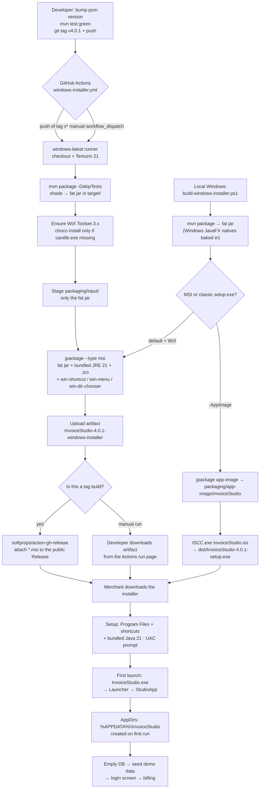

# Chapter 22 — Build, Package & Release: From Source Tree to a Double-Clickable Installer

> **Part 13 of InvoiceStudio: Zero to Finished Product**
> Files covered in full this chapter: `packaging/build-windows-installer.ps1`,
> `packaging/InvoiceStudio.iss`, `packaging/InvoiceStudio.ico`,
> `.github/workflows/windows-installer.yml`, plus the release-facing halves of
> `pom.xml` (the JavaFX and Shade plugin blocks), `.gitignore` and `fx.env`
> (both first read in full in Chapter 1 — revisited here through the release
> lens), and the four committed verification data dirs `ls-verify/`,
> `cb-verify/`, `bulk-verify-run/` and `dash2-smoke/` — all read from the
> repository. `MERCHANT_SIM_REPORT.md` is referenced for its release role
> (Chapter 21 reads it in full).
> Goal at the end: **one command — or one `git tag` — turns this source tree
> into a Windows installer a merchant can double-click without ever knowing
> Java exists.**

---

## 1. Chapter goal

By the end of this chapter you will have built, exactly as the repository has it:

1. **The fat JAR, revisited as a product** — what the `maven-shade-plugin`
   block of `pom.xml` really does at `package` time, where the
   `original-*.jar` and `dependency-reduced-pom.xml` side effects come from,
   and why the manifest's `Main-Class` is `com.invoicestudio.Launcher` and not
   `StudioApp`.
2. **`packaging/build-windows-installer.ps1`** — the one-command PowerShell
   orchestrator that compiles the fat JAR and hands it to `jpackage`, producing
   either a self-contained **MSI installer** (bundled Java 21 runtime, desktop
   icon, Start-menu entry, directory chooser) or a plain **app-image** folder.
3. **`packaging/InvoiceStudio.iss`** — the Inno Setup script that wraps the
   app-image into a classic wizard-style `setup.exe`: directory chooser,
   "create a desktop icon" task, Start-menu group with an Uninstall entry, and
   a launch-after-install checkbox on the finish page.
4. **`packaging/InvoiceStudio.ico`** — the single binary asset every branch of
   the release chain shares (EXE icon, shortcuts, uninstaller display icon).
5. **`.github/workflows/windows-installer.yml`** — the CI pipeline that builds
   the MSI on GitHub's own Windows hardware, on demand or on every `v*` tag,
   uploads the installer as a **workflow artifact**, and attaches it to a
   public **GitHub Release** for tag builds.
6. **The release checklist** — how a version number travels from `pom.xml`
   through the scripts, CI and git tags to a downloadable installer, and where
   the small committed `*-verify` / `*-smoke` data directories and the merchant
   simulation report fit into the quality gate.

And you will understand the three architectural ideas that make this chapter
hold together: a **single source of version truth** (`pom.xml`, read
dynamically by everything else), **one build per operating system** (JavaFX
natives and the bundled Java runtime always match the OS the packaging runs
on — `jpackage` cannot cross-compile), and the **data-directory split**
(installed code lives in `Program Files`, user data lives in
`%APPDATA%\InvoiceStudio`, and the two never meet — Chapter 2's `AppDirs`).

---

## 2. Story intro

For twenty-one chapters we have been inside the workshop. Chapter 1 set up the
kitchen and cooked a first meal; Chapters 2–9 built the furniture; Chapters
10–20 furnished every room; Chapter 21 hired the inspectors. But everything
the workshop produces so far can only be served to one person: *you*, at *your*
desk, with *your* JDK 21 and *your* Maven already installed. Kumar — the
trouser merchant the app is actually for — has none of that, and he should
never need any of it.

Every product has a **shipping department**, and it behaves nothing like the
workshop. It packs, it labels, it follows a checklist, and it never invents a
new box design at 5 p.m. on release day. Walk through its loading dock:

- The workshop's output — hundreds of class files — is loose cargo. The
  **export packer** (`maven-shade-plugin`) consolidates everything into one
  sealed crate: the **fat JAR**, ~34 MB, every dependency inside, one address
  label on the outside (`Main-Class: com.invoicestudio.Launcher`).
- A crate is still not a gift. The **retail packer** (`jpackage`) puts the
  crate in a proper box: an **app-image** folder that carries its own Java 21
  runtime — the product brings its own electricity, so the customer's building
  needs no rewiring.
- The box becomes *shrink-wrapped retail packaging* — an **MSI** or, via the
  **Inno Setup** script, a classic `setup.exe`: printed instructions (the
  wizard pages), a logo sticker (the `.ico`), a spot on the customer's wall
  (desktop icon), a listing in the building directory (Start menu), and —
  courteous to the end — a printed return label (the uninstaller).
- The **freight forwarder** (GitHub Actions) has a standing contract: whenever
  the manager stamps a batch with a tag (`v4.0.1`), a truck leaves
  automatically, no phone call needed. The parcel is photographed before
  dispatch (the uploaded **artifact**) and, for stamped batches, goes onto the
  public shelf (the **GitHub Release**) where anyone can take one.
- And the one rule the shipping department never breaks: *the goods go in the
  customer's storage room, the customer's own books stay at home.* Installed
  code goes to `Program Files`; Kumar's invoices live in
  `%APPDATA%\InvoiceStudio`, untouched by installs, upgrades and uninstalls.

> **Analogy:** the workshop optimizes for *changing* the product; the shipping
> department optimizes for *repeating* a proven hand-off. That is why this
> chapter's files are scripts and definitions rather than Java — they are the
> standing instructions a machine (or a tired human at midnight) can follow
> identically every time.

---

## 3. Concepts first

**Fat JAR (shaded JAR).** Chapter 1 introduced it; now the mechanics. A plain
`mvn package` produces a *thin* JAR — only this project's own classes (the
~1.2 MB `original-invoice-studio-desktop-4.0.0.jar` you find in `target/`).
The Shade plugin re-runs at the same phase and produces the fat JAR: it
*unzips every dependency JAR* (JavaFX, SQLite, PDFBox, ZXing, Jackson), merges
all their class files and resources with yours into one archive, rewrites the
manifest, and renames the thin original with the `original-` prefix. The final
fat jar on disk measures **34,847,645 bytes ≈ 33 MiB**. Two side effects are
expected and pre-ignored in `.gitignore`: the `original-*.jar` (kept for
reference) and `dependency-reduced-pom.xml` (a temporary POM the plugin writes
while merging — it exists in this working tree right now).

**Maven lifecycle phases.** `mvn package` does not run a single command — it
walks Maven's *default lifecycle* up to the phase you name. The phases that
matter here, in order: `validate` → `compile` → `test` → `package` → `verify`
→ `install` → `deploy`. Plugins *bind* to phases: the compiler plugin runs at
`compile`, Surefire at `test`, and Shade's `<execution>` explicitly binds to
`package` (you can see `<phase>package</phase>` in the pom). `mvn javafx:run`
is different in kind — it invokes the JavaFX plugin's *goal* directly without
walking the whole lifecycle. This is also why `mvn package -DskipTests` still
produces a complete installer: it *skips the test phase*, not the packaging.

**Java modules vs classpath.** Java has two ways to assemble a program. The
*module system* (JPMS, a `module-info.java` at the source root) gives strong
boundaries and enables `jlink` runtime trimming — but demands that every
library be modularized. InvoiceStudio deliberately stays a **classpath
application**: no `module-info.java` anywhere. That has one famous
consequence (Chapter 2): a plain `Application` subclass launched from the
classpath makes JavaFX abort with "JavaFX runtime components are missing" —
which is why the 11-line `Launcher` bootstrap exists and why every packaging
path (`--main-class`, the manifest transformer) points at `Launcher`, never at
`StudioApp`. It also explains a pom detail we pass without stopping in
Chapter 1: `<useModulePath>false</useModulePath>` on Surefire keeps tests on
the plain classpath too. The cost of the classpath choice: `jlink`-style
minimal runtimes are off the table, so `jpackage` bundles a complete (large)
JRE — a trade this chapter's decision table revisits.

**`jpackage`.** The packaging tool that ships inside every JDK 21+. It takes
an `--input` folder (here: exactly one fat JAR), a `--main-jar`/`--main-class`
entry point, an `--icon`, and produces a native artifact with a **bundled
private Java runtime** (`--type app-image` = just a folder; `--type msi` =
Windows installer; also `deb`, `rpm`, `dmg`, `pkg` on other OSes). Two rules
drive this whole chapter: `jpackage` **cannot cross-compile** (a Windows MSI
must be built on Windows, because the bundled JRE and the app's JavaFX
*natives* must match the target OS), and the bundled runtime means the *user*
needs nothing installed.

**Inno Setup.** A free, script-driven installer compiler for Windows,
assembled from section files like a tiny INI-flavoured language: `[Setup]`
(identity and behaviour), `[Tasks]` (optional checkboxes the user sees),
`[Files]` (what gets copied where), `[Icons]` (shortcuts), `[Run]` (post-install
actions). Its compiler is `ISCC.exe`. Its *preprocessor* supports `#define`
constants and `#ifndef` fallbacks — InvoiceStudio uses that for the version
number. The repository's `.iss` route exists because some users (and some
shop owners) trust a wizard-style `setup.exe` more than an MSI, and because
Inno needs no WiX toolchain — only the app-image folder as input.

**CI/CD.** *Continuous Integration* — every push is built and checked by a
machine, so "works on my machine" stops being the quality bar. *Continuous
Delivery* — the build machine also produces the shippable artifact. **GitHub
Actions** is the CI system this repo uses: a workflow file (YAML) declares
*triggers* (`on:`), each run executes on a **runner** — a fresh virtual
machine GitHub rents you per job (`windows-latest` = a current Windows VM) —
and steps either run shell commands or call reusable **actions** from the
marketplace (`actions/checkout@v4`, `actions/setup-java@v4`,
`actions/upload-artifact@v4`, `softprops/action-gh-release@v2`). Two
mechanisms appear in this workflow: `GITHUB_ENV` (write
`KEY=value` to this special file and every *later* step sees `$KEY`) and
`GITHUB_PATH` (prepend a directory to the PATH of later steps). An
**artifact** is a per-run downloadable zip for the developer; a **Release** is
the public download page end users see — the workflow produces the first and,
for tag builds, promotes to the second.

**Semantic versioning.** `MAJOR.MINOR.PATCH` (4.0.0 = major 4, minor 0,
patch 0): bump **PATCH** for bug fixes, **MINOR** for backward-compatible
features, **MAJOR** when you break something. The project's history
(vault notes, Ch 1's reading of the README) shows `2.0.x` baseline → `3.0.0`
designer overhaul → `4.0.0` current. The git tag (`v4.0.1`) and the pom
version should move together — the release checklist in Step 8 makes that
explicit.

**Code signing & SmartScreen.** The installers produced here are **unsigned**
(a code-signing certificate costs money and needs renewing). Windows
Defender SmartScreen therefore shows *"Windows protected your PC"* on first
run — the README's §7.6 documents the *More info → Run anyway* escape. This is
the last non-technical friction a merchant feels; the improvement section
sketches how to remove it.

---

## 4. Files in this chapter

| # | File | Type | Lines | Purpose |
|---|---|---|---|---|
| 1 | `pom.xml` (packaging blocks, revisited) | Maven build | 154 | Version truth + shade/javafx plugin wiring (full pom read in Ch 1) |
| 2 | `packaging/build-windows-installer.ps1` | PowerShell | 89 | One-command orchestrator: `mvn package` → `jpackage` → MSI or app-image |
| 3 | `packaging/InvoiceStudio.iss` | Inno Setup script | 48 | Classic wizard `setup.exe` definition over the app-image |
| 4 | `packaging/InvoiceStudio.ico` | Binary asset | 27,179 bytes | App icon (7 embedded sizes) for EXE, shortcuts, uninstaller |
| 5 | `.github/workflows/windows-installer.yml` | CI pipeline (YAML) | 73 | Builds the MSI on GitHub's Windows runners; artifact + Release |
| 6 | `fx.env` (release view) | Shell env | 1 | Dev-only JavaFX classpath convenience — never used by packaging |
| 7 | `.gitignore` (release-relevant lines) | Git config | 46 | Keeps `target/`, `packaging/input|dist|app-image`, verify dirs out of Git |
| 8 | `ls-verify/` (2 JSON files) | Harness data dir | 5 + 7 | Isolated `-Dinvoicestudio.data.dir` leftover from a view smoke run |
| 9 | `cb-verify/` (2 JSON files) | Harness data dir | 5 + 8 | Same, for chatbot verification runs (screenshots dir ignored) |
| 10 | `bulk-verify-run/` (2 JSON files) | Harness data dir | 5 + 15 | Same, for bulk-print verification (`bulk-print-state.json` state) |
| 11 | `dash2-smoke/mcp-server.json` | Harness data dir | 5 | Isolated MCP config for Dashboard-2 smoke runs |
| 12 | `MERCHANT_SIM_REPORT.md` (reference) | Docs | 134 | The 3-month simulated-business acceptance report — release evidence |

Depends on: `Launcher` + `AppDirs` (Ch 2 — why the main class is `Launcher`
and where user data goes), the full dependency set (Ch 1), the test suite and
verification harnesses (Ch 21), the MCP/chatbot config stores (Ch 18–19 —
they are what *wrote* the little JSONs in the verify dirs).

Used by: every human who installs the app, and every future release of it —
this chapter is the last stop before Appendix A1 recaps the whole machine.

---

## 5. Step-by-step build

We build in pipeline order: the artifact the pipeline is built around (the fat
JAR), then the two Windows packaging routes (script and Inno script), the icon
they share, the CI pipeline that automates both, the small config files that
keep the plumbing honest, the scratch directories that record the quality
gate — and finally the checklist that ties it all into a release.

### Step 1 — `pom.xml` through the packaging lens

Chapter 1 read the pom in full and line-by-line; here we re-quote only the two
plugin blocks that the whole release chain stands on, and look at them as
*packaging machinery* instead of build trivia. First, the coordinates the
pipeline will parse later:

```xml
    <groupId>com.invoicestudio</groupId>
    <artifactId>invoice-studio-desktop</artifactId>
    <version>4.0.0</version>
    <packaging>jar</packaging>

    <name>InvoiceStudio</name>
    <description>Standalone JavaFX Billing &amp; Invoice Management Desktop Application</description>

    <properties>
        <project.build.sourceEncoding>UTF-8</project.build.sourceEncoding>
        <maven.compiler.source>21</maven.compiler.source>
        <maven.compiler.target>21</maven.compiler.target>
        <javafx.version>21.0.4</javafx.version>
    </properties>
```

Hold on to three facts: the artifact id is `invoice-studio-desktop` (so jars
are named `invoice-studio-desktop-4.0.0.jar`), the version is `4.0.0`, and the
packaging type is plain `jar`. Every packaging script in this chapter reads
these values **from this file at runtime** — none of them hard-code the
version (with exactly one flagged exception in Step 3).

Now the two build plugins, quoted verbatim (pom lines 111–151):

```xml
            <!-- JavaFX Maven Plugin for running in dev -->
            <plugin>
                <groupId>org.openjfx</groupId>
                <artifactId>javafx-maven-plugin</artifactId>
                <version>0.0.8</version>
                <configuration>
                    <mainClass>com.invoicestudio.Launcher</mainClass>
                </configuration>
            </plugin>

            <!-- Shade Plugin for Runnable Fat JAR -->
            <plugin>
                <groupId>org.apache.maven.plugins</groupId>
                <artifactId>maven-shade-plugin</artifactId>
                <version>3.5.1</version>
                <executions>
                    <execution>
                        <phase>package</phase>
                        <goals>
                            <goal>shade</goal>
                        </goals>
                        <configuration>
                            <transformers>
                                <transformer implementation="org.apache.maven.plugins.shade.resource.ManifestResourceTransformer">
                                    <mainClass>com.invoicestudio.Launcher</mainClass>
                                </transformer>
                            </transformers>
                            <filters>
                                <filter>
                                    <artifact>*:*</artifact>
                                    <excludes>
                                        <exclude>META-INF/*.SF</exclude>
                                        <exclude>META-INF/*.DSA</exclude>
                                        <exclude>META-INF/*.RSA</exclude>
                                    </excludes>
                                </filter>
                            </filters>
                        </configuration>
                    </execution>
                </executions>
            </plugin>
```

Block by block, packaging-first this time:

- **`javafx-maven-plugin` (0.0.8)** exists *only* for the developer's comfort:
  `mvn javafx:run` compiles and launches from sources, assembling the JavaFX
  module path for you. It takes no part in packaging — the installer never
  uses it. Its `<mainClass>com.invoicestudio.Launcher</mainClass>` is the same
  bootstrap rule as everywhere else (Ch 2): `Launcher` is a non-`Application`
  class, so JavaFX tolerates it on the classpath.
- **`<phase>package</phase>` + `<goal>shade</goal>`** — the shade execution is
  wired into the `package` phase. So `mvn package` runs the normal jar
  plugin first (thin jar) and then shade (fat jar), which is exactly why
  `target/` ends with *two* jars: `invoice-studio-desktop-4.0.0.jar`
  (34,847,645 bytes in the current tree) and
  `original-invoice-studio-desktop-4.0.0.jar` (1,243,934 bytes — the thin
  original, renamed and kept for reference).
- **`ManifestResourceTransformer`** — a JAR's `META-INF/MANIFEST.MF` is its
  label; `Main-Class: com.invoicestudio.Launcher` is what makes
  `java -jar invoice-studio-desktop-4.0.0.jar` start. This same manifest is
  also what `jpackage` uses — the installer flags pass `--main-jar` plus
  `--main-class`, and jpackage reads the jar's own manifest for the entry
  point. One label, three consumers: `java -jar`, double-click launchers,
  jpackage.
- **`<filters> ... <exclude>META-INF/*.SF|*.DSA|*.RSA</exclude>`** — the
  signature-strip ritual, explained in Chapter 1 and worth repeating *here*
  because it is a packaging correctness issue, not a nicety: dependency jars
  arrive individually signed; after merging, those signature files would
  describe content that no longer matches, and Java's security layer refuses
  to load the fat JAR. Stripping them is what makes the merged crate loadable.
- What the block does *not* configure is equally visible: no service-file
  transformer and no `dependency-reduced-pom.xml` suppression. The shade
  plugin still writes `dependency-reduced-pom.xml` into the project root
  during the merge — which is precisely why `.gitignore` lists it (Chapter 1,
  Step 6).

One more pom neighbour matters to packaging: Surefire's
`<useModulePath>false</useModulePath>`. Tests run on the plain classpath — the
same world the fat JAR lives in — so a test suite that passes under Maven is
running in the same classloading regime the installer will ship.

### Step 2 — `packaging/build-windows-installer.ps1` (the one-command orchestrator)

Eighty-nine lines of PowerShell that turn "I have a checkout" into "I have an
installer". We read it in order, in full.

```powershell
#Requires -Version 5
<#
.SYNOPSIS
  Builds the InvoiceStudio Windows installer (MSI) with a bundled Java runtime,
  a desktop shortcut and a Start-menu entry - the normal "setup file" experience.

.USAGE
  .\build-windows-installer.ps1              # MSI installer  -> packaging\dist\*.msi
  .\build-windows-installer.ps1 -AppImage    # plain app folder (no installer),
                                             # usable with packaging\InvoiceStudio.iss
                                             # to get a classic setup.exe instead

.PREREQUISITES (on the Windows build machine)
  - JDK 21 on PATH (jpackage ships inside it): https://adoptium.net/temurin/releases/?version=21
  - Maven on PATH: https://maven.apache.org/download.cgi
  - WiX Toolset 3.x (MSI output only): https://wixtoolset.org/releases/
    (installer needs candle.exe/light.exe on PATH)

.NOTES
  - The MSI bundles a private Java 21 runtime: end users need NOTHING installed.
  - The app stores its database in %APPDATA%\InvoiceStudio (never in Program Files).
  - The build MUST run on Windows: JavaFX platform natives and the bundled JRE
    always match the OS the packaging runs on.
#>
param([switch]$AppImage)
$ErrorActionPreference = "Stop"
```

- `#Requires -Version 5` — refuses to run on pre-PowerShell-5 hosts (the
  comment-based help and `Out-Null` idioms used below assume it).
- The `<# ... #>` block is **comment-based help**: `Get-Help
  .\build-windows-installer.ps1` renders it. It is also the script's honest
  contract — note the three `.NOTES` lines, which are this chapter's three
  architecture rules restated from the shipping department's point of view.
- `param([switch]$AppImage)` — the single switch that selects the output
  format: MSI by default, plain folder with `-AppImage`.
- `$ErrorActionPreference = "Stop"` — make every failed cmdlet fatal. For a
  release script, half-completed runs are worse than failed ones.

```powershell
$Root = Split-Path -Parent $PSScriptRoot
foreach ($tool in @("java", "jpackage", "mvn")) {
    if (-not (Get-Command $tool -ErrorAction SilentlyContinue)) {
        throw "$tool not found on PATH - see PREREQUISITES in this script's header"
    }
}
```

- `$PSScriptRoot` is the folder the script lives in (`packaging/`), so
  `$Root` is the project root — the script works from any working directory.
- The `foreach` is a *pre-flight check*: fail in two seconds with a readable
  message instead of five minutes into the build. `Get-Command ...
  -ErrorAction SilentlyContinue` returns nothing when a tool is missing; the
  `throw` then points the reader back at the header's download links.

```powershell
# --- 1) Build the fat jar (shade plugin pulls the Windows JavaFX natives) ----
Write-Host "== mvn package ==" -ForegroundColor Cyan
Push-Location $Root
try {
    mvn -B -ntp package -DskipTests
    if ($LASTEXITCODE -ne 0) { throw "mvn package failed" }
} finally {
    Pop-Location
}
```

- `mvn -B -ntp package -DskipTests` — `-B` (batch) silences the progress-bar
  noise; `-ntp` (`--no-transfer-progress`) silences per-download lines;
  `-DskipTests` skips the Surefire phase (tests are expected to have been run
  already — more on this in the workflow step and the checklist).
- Native executables report failure through an *exit code*, not a PowerShell
  exception — hence the explicit `if ($LASTEXITCODE -ne 0) { throw ... }`
  after every native call in this script. `Push-Location`/`try/finally`/
  `Pop-Location` guarantees the working directory is restored even when the
  build throws.
- The comment says the quiet part: running `package` **on Windows** is what
  puts the *Windows* JavaFX natives into the fat jar (the OpenJFX Maven
  artifacts resolve per-OS — Chapter 1's platform note).

```powershell
# Dynamically resolve project version and fat jar from pom.xml
[xml]$pom = Get-Content (Join-Path $Root "pom.xml")
$AppVersion = $pom.project.version
$ArtifactId = $pom.project.artifactId
$JarName = "$ArtifactId-$AppVersion.jar"
$Jar = Join-Path $Root "target\$JarName"
if (-not (Test-Path $Jar)) { throw "fat jar missing: $Jar" }
```

This is the **single source of version truth** in action. The pom is parsed
as XML; `$AppVersion` becomes `4.0.0`, `$JarName` becomes
`invoice-studio-desktop-4.0.0.jar`. Nothing in the script knows a version
number — bump the pom and this script, the jar name, the installer name and
the jpackage `--app-version` all follow. The `Test-Path` guard converts a
silent downstream failure ("jpackage: input jar not found") into an early,
pointed error.

```powershell
# --- 2) Stage jpackage input: ONLY the shaded jar (target/ holds originals) --
$InputDir = Join-Path $PSScriptRoot "input"
Remove-Item $InputDir -Recurse -Force -ErrorAction SilentlyContinue
New-Item -ItemType Directory -Force $InputDir | Out-Null
Copy-Item $Jar $InputDir
```

`jpackage --input` copies *everything* in the folder into the app image, so
the script stages a **clean, minimal** input directory under
`packaging/input/`: exactly one file, the fat jar. If you pointed `--input`
at `target/` instead, the installer would also swallow the thin
`original-*.jar` and every other build leftover. `Remove-Item -ErrorAction
SilentlyContinue` makes re-runs idempotent (delete-then-recreate).

```powershell
$Common = @(
    "--name", "InvoiceStudio",
    "--description", "Billing & Invoice Design Studio",
    "--app-version", $AppVersion,
    "--vendor", "InvoiceStudio",
    "--icon", (Join-Path $PSScriptRoot "InvoiceStudio.ico"),
    "--input", $InputDir,
    "--main-jar", $JarName,
    "--main-class", "com.invoicestudio.Launcher"
)
```

The jpackage argument list, shared by both output branches. Reading it as the
product's identity card: display **name** (folder name, shortcut text), human
**description**, **version** (parsed from the pom), **vendor**, the shared
**icon**, the staged **input**, and the entry point (`--main-jar` +
`--main-class` = `Launcher`, the Ch 2 rule once more). PowerShell arrays
splatted with `@Common` keep both branches below from duplicating these
lines.

```powershell
if ($AppImage) {
    # --- 3a) Plain folder (feed to Inno Setup for a classic setup.exe) --------
    $Dest = Join-Path $PSScriptRoot "app-image"
    Remove-Item $Dest -Recurse -Force -ErrorAction SilentlyContinue
    jpackage @Common --type app-image --dest $Dest
    if ($LASTEXITCODE -ne 0) { throw "jpackage app-image failed" }
    Write-Host "OK: $Dest\InvoiceStudio\  (then: ISCC /DAppVersion=$AppVersion packaging\InvoiceStudio.iss)" -ForegroundColor Green
} else {
    # --- 3b) MSI: desktop icon + start menu + dir chooser, admin install -----
    if (-not (Get-Command candle.exe -ErrorAction SilentlyContinue)) {
        throw "WiX Toolset 3.x not on PATH (candle.exe) - needed for MSI. " +
              "Install from https://wixtoolset.org or run with -AppImage."
    }
    $Dest = Join-Path $PSScriptRoot "dist"
    Remove-Item $Dest -Recurse -Force -ErrorAction SilentlyContinue
    jpackage @Common --type msi --win-shortcut --win-menu --win-dir-chooser --dest $Dest
    if ($LASTEXITCODE -ne 0) { throw "jpackage msi failed" }
    $msi = Get-ChildItem $Dest -Filter *.msi | Select-Object -First 1
    Write-Host "OK installer: $($msi.FullName)" -ForegroundColor Green
    Write-Host "Double-click it -> UAC -> next -> desktop icon appears. No Java needed on the target PC." -ForegroundColor Green
}
```

The fork in the loading dock:

- **Branch 3a (`-AppImage`)** — `--type app-image` writes a plain,
  self-contained folder `packaging/app-image/InvoiceStudio/` (the app, plus a
  `runtime\` subfolder holding the bundled JRE). This is *input for Inno
  Setup*, not a deliverable — and the success message prints the exact
  follow-up command, including `/DAppVersion=$AppVersion`, which is how the
  version reaches the Inno script (Step 3).
- **Branch 3b (default)** — the MSI route first checks for `candle.exe` (the
  WiX compiler `jpackage` shells out to on Windows) and fails with an
  actionable message naming the alternative (`-AppImage`). Then
  `--type msi` plus three UX flags: `--win-shortcut` (desktop icon),
  `--win-menu` (Start-menu entry), `--win-dir-chooser` (let the user pick the
  install directory). Output lands in `packaging/dist/`.
- Both branches delete their destination directory first — no stale artifacts
  from an earlier version can survive into a fresh run.

> **NOTE (kept faithful):** the `.SYNOPSIS` says "MSI" while the script's
> default output is indeed the MSI and `-AppImage` is the documented second
> mode — but the synopsis never mentions the app-image mode. The `.USAGE`
> block is the complete truth; the synopsis is the MSI-centric summary.

> **GAP (faithfully preserved):** the script never runs `mvn test` — only
> `package -DskipTests`. That is a deliberate speed/feedback trade (tests are
> the developer's and CI's job), but it means a local installer built from a
> dirty, untested tree ships without any machine check. The release checklist
> in Step 8 makes running the suite an explicit manual gate.

### Step 3 — `packaging/InvoiceStudio.iss` (the classic setup.exe)

The Inno Setup script is 48 lines and reads like a form. Full walkthrough:

```ini
; InvoiceStudio - classic setup.exe wrapper around the jpackage app-image.
;
; Usage (on a Windows machine):
;   1) .\packaging\build-windows-installer.ps1 -AppImage     (builds app-image\InvoiceStudio\)
;   2) ISCC.exe packaging\InvoiceStudio.iss                  (Inno Setup 6 compiler)
;      -> packaging\dist\InvoiceStudio-3.0.0-setup.exe
;
; The produced setup.exe behaves like any mainstream installer: dir chooser,
; desktop-icon task, start-menu group, uninstaller, launch-after-install.

#define AppName "InvoiceStudio"
#ifndef AppVersion
  #define AppVersion "4.0.0"
#endif
#define AppExe "InvoiceStudio.exe"
```

- The header comment documents the two-step contract: build the app-image
  first, then compile this script. Note the printed example output name says
  **3.0.0** while the pom and the fallback below say **4.0.0** — comment drift
  from an earlier release, preserved as-is (the same drift pattern Chapter 1
  flagged in the README).
- **Preprocessor defines.** `AppName`, `AppExe` are fixed strings. `AppVersion`
  is defined **only if not already defined** (`#ifndef`) — the `/DAppVersion=`
  command-line define (which the PowerShell script prints for you) overrides
  the fallback. Compile `ISCC.exe packaging\InvoiceStudio.iss` by hand and you
  get the fallback value.

> **ISSUE (faithfully preserved):** the fallback `#define AppVersion "4.0.0"`
> is the one place in the whole pipeline where a version number is hard-coded.
> When pom.xml moves to 4.0.1 and someone forgets either the `/DAppVersion=`
> flag or this fallback, the installer's *displayed* version (Add/Remove
> Programs, uninstaller metadata) silently disagrees with the jar it wraps —
> the file name comes from `OutputBaseFilename` and would still say 4.0.1.
> The pom-driven script always passes the flag; only hand-typed `ISCC` runs
> hit the fallback.

```ini
[Setup]
AppId={{7A1F4C93-6D2E-4B58-9A0F-2C3D4E5F6A7B}}
AppName={#AppName}
AppVersion={#AppVersion}
AppPublisher={#AppName}
DefaultDirName={autopf}\{#AppName}
DefaultGroupName={#AppName}
UninstallDisplayIcon={app}\{#AppExe}
OutputDir=dist
OutputBaseFilename={#AppName}-{#AppVersion}-setup
Compression=lzma2/max
SolidCompression=yes
WizardStyle=modern
PrivilegesRequired=admin
ArchitecturesInstallIn64BitMode=x64compatible
```

- **`AppId={{7A1F4C93-...}}`** — the installer's permanent identity. The
  double `{{` is Inno's escape for a literal `{`. Windows uses this GUID to
  find the product in Add/Remove Programs, so upgrades and uninstalls of
  *this* installer family stay coherent across versions. Never change it
  casually — a new GUID makes Windows treat 4.0.1 as a different product.
- **`DefaultDirName={autopf}\{#AppName}`** — `{autopf}` is the *appropriate
  Program Files* directory (64-bit `Program Files` on 64-bit Windows, which
  the next line enforces). Note what this implies and the `.NOTES` block of
  the PowerShell script confirms: the app is *installed* where it cannot
  write, so its data must live elsewhere — `%APPDATA%`, courtesy of `AppDirs`
  (Ch 2).
- **`UninstallDisplayIcon`** — the uninstall entry in Windows Settings shows
  the app icon, not a generic wizard glyph.
- **`OutputDir=dist` / `OutputBaseFilename=...-setup`** — relative to the
  project root when invoked as documented; the output is
  `packaging/dist/InvoiceStudio-4.0.0-setup.exe`.
- **`Compression=lzma2/max` + `SolidCompression=yes`** — the strongest
  compression Inno offers, treating the payload as one solid block. Smaller
  download; slower compile. For a ~90 MB payload (fat jar + bundled JRE) the
  trade is clearly worth it on a one-way download.
- **`WizardStyle=modern`** — the current look for the wizard pages.
- **`PrivilegesRequired=admin`** — the installer requests elevation (UAC
  prompt) because it writes into Program Files. Data still lands per-user.
- **`ArchitecturesInstallIn64BitMode=x64compatible`** — install as a 64-bit
  application (correct Program Files, correct registry view).

```ini
[Tasks]
Name: "desktopicon"; Description: "{cm:CreateDesktopIcon}"; \
    GroupDescription: "{cm:AdditionalIcons}"; Flags: checkedonce
```

One optional task: a *Create a desktop icon* checkbox on the Additional Icons
page. `checkedonce` means "pre-ticked on first install; afterwards remember
the user's previous choice" — the standard polite behaviour. `{cm:...}` are
Inno's built-in localized messages.

```ini
[Files]
Source: "app-image\{#AppName}\*"; DestDir: "{app}"; \
    Flags: recursesubdirs createallsubdirs replacesameversion
```

The payload line: copy *everything* under `packaging/app-image/InvoiceStudio/`
— including the bundled `runtime\` JRE — into the install directory
(`{app}`). The three flags matter: recurse into subdirectories, recreate the
empty ones, and overwrite same-version files (needed when reinstalling the
same version to repair an installation).

```ini
[Icons]
Name: "{group}\{#AppName}"; Filename: "{app}\{#AppExe}"
Name: "{group}\Uninstall {#AppName}"; Filename: "{uninstallexe}"
Name: "{autodesktop}\{#AppName}"; Filename: "{app}\{#AppExe}"; Tasks: desktopicon
```

Three shortcuts: the app in the Start-menu **group** (`{group}` = the
`DefaultGroupName` folder), an explicit **Uninstall** shortcut beside it, and
the **desktop** icon — created only when the Step-2 `[Tasks]` checkbox is
ticked (`Tasks: desktopicon`). `{autodesktop}` is the all-users desktop
(matching the admin install).

```ini
[Run]
Filename: "{app}\{#AppExe}"; Description: "{cm:LaunchProgram,{#AppName}}"; \
    Flags: nowait postinstall skipifsilent
```

The finish-page checkbox "Launch InvoiceStudio": run the app after the wizard
closes (`postinstall`), don't block the wizard on it (`nowait`), and skip
during silent/automated installs (`skipifsilent`) — so scripted deployments
never get stuck waiting for a GUI app to exit.

> **NOTE (kept faithful):** the MSI (jpackage) and the setup.exe (Inno) are
> two *parallel* install identities. The Inno script fixes its `AppId` GUID;
> the MSI route passes no `--win-upgrade-uuid`, so jpackage manages its own.
> Installing the MSI and later the setup.exe (or the reverse) leaves two
> entries in Apps & Features pointing at one program directory. Each family
> upgrades cleanly within itself; mixing families is a clean-uninstall-first
> situation. The README's §7.6 advice ("install the newer MSI over the old
> one") holds within the MSI family.

### Step 4 — `packaging/InvoiceStudio.ico` (the one binary asset)

This is the only binary in `packaging/`, and it sits at the centre of the
whole chapter: every packaging route consumes it, and no other asset does.

- **What it is:** a multi-resolution Windows icon resource — 27,179 bytes
  containing **seven embedded images** (the smallest are 16×16 and 24×24,
  stored as PNG-compressed 32-bit RGBA). Multi-resolution matters: Windows
  picks the right size for the taskbar, Explorer views, Alt-Tab and the
  desktop, and a single-resolution icon looks mushy somewhere.
- **Who uses it:** `jpackage --icon` (the `InvoiceStudio.exe` inside the
  app-image/MSI, its shortcuts), the Inno `UninstallDisplayIcon`, and by
  inheritance the shortcuts created by both installers.
- **What it is not:** it is *not* the app's window icon — the running JavaFX
  app draws its own window imagery from `src/main/resources/icons/` (the
  `IconHelper` pipeline, Ch 9). The `.ico` is for the *installer/shell*
  layer only.
- **Lifecycle:** it is committed, versioned and essentially never touched —
  the definition of a release asset. If you ever regenerate it, regenerate
  *all seven sizes* (or at least 16/24/32/48/64/128/256) so the shell never
  upscales.

### Step 5 — `.github/workflows/windows-installer.yml` (the CI pipeline)

Seventy-three lines of YAML that make Windows-free development possible:
GitHub's own Windows hardware runs the packaging. Full walkthrough:

```yaml
name: Windows Installer

# Builds the Windows MSI (bundled Java, desktop + start-menu shortcuts) so no
# local Windows toolchain is required. Trigger from the Actions tab
# (workflow_dispatch), or push a tag like v2.0.1 to also attach it to a Release.
# Windows-only on purpose: JavaFX natives and the bundled JRE must match the
# target OS, and jpackage cannot cross-compile.

on:
  workflow_dispatch:
  push:
    tags: ["v*"]
```

- `name:` is what appears in the Actions tab's left sidebar.
- Two triggers: **`workflow_dispatch`** — a manual "Run workflow" button (the
  README's §7.2 Option A); and **`push` of tags matching `v*`** — the
  release trigger. Ordinary pushes to branches build *nothing* — this
  workflow is a release tool, not a per-commit CI gate (the test suite owns
  that job; Ch 21).
- The comment block carries the design rationale again, because it is the
  number-one surprise for newcomers: **no cross-compiling**.

```yaml
jobs:
  msi:
    runs-on: windows-latest
    steps:
      - uses: actions/checkout@v4

      - uses: actions/setup-java@v4
        with:
          distribution: temurin
          java-version: "21"
```

- One job, `msi`, on a fresh **`windows-latest`** VM per run. Everything a
  release needs is either pre-installed on the runner image (Maven,
  Chocolatey, sometimes even WiX) or fetched by the steps.
- `actions/checkout@v4` checks out the exact commit the run was triggered
  for — for a tag push, that is the tagged commit.
- `actions/setup-java@v4` installs **Temurin 21** and puts it on PATH — the
  same distribution the README recommends locally, so the CI artifact matches
  a local build.

```yaml
      - name: Build fat jar
        shell: pwsh
        run: mvn -B -ntp package -DskipTests
```

The same command the PowerShell script runs — the shade plugin produces
`target/invoice-studio-desktop-<version>.jar` right on the runner. `-DskipTests`
again: this workflow packages; it does not gate quality.

> **GAP (faithfully preserved):** a `v*` tag ships whatever it points at with
> **no automated test run and no installer smoke test** — the workflow's only
> checks are that the build and packaging exit non-zero on failure. It works
> because the release checklist (Step 8) makes `mvn test` and the merchant
> simulation a human gate before tagging. Automating that gate is sketched as
> an OPTIONAL IMPROVEMENT below.

```yaml
      - name: Ensure WiX Toolset (MSI backend for jpackage)
        shell: pwsh
        run: |
          if (-not (Get-Command candle.exe -ErrorAction SilentlyContinue)) {
            choco install wixtoolset -y --no-progress
            "C:\Program Files (x86)\WiX Toolset v3.14\bin" |
              Out-File -FilePath $env:GITHUB_PATH -Encoding utf8 -Append
          } else {
            "WiX already present on runner"
          }
```

- Runner images change over time; sometimes WiX is pre-installed, sometimes
  not. This step is *self-healing*: check for `candle.exe`, and only install
  via **Chocolatey** (`choco install wixtoolset`) when missing.
- `GITHUB_PATH` is the documented way a step extends PATH for all *later*
  steps: append the WiX bin directory to that special file. (Without it,
  `choco` installs WiX but `jpackage` in the next step could not find
  `candle.exe`.) The hard-coded `v3.14` path matches the Chocolatey package
  version — a line to revisit when WiX 4+ support lands in jpackage.

```yaml
      - name: Package MSI (desktop + start-menu shortcuts, bundled Java 21)
        shell: pwsh
        run: |
          [xml]$pom = Get-Content pom.xml
          $version = $pom.project.version
          $artifactId = $pom.project.artifactId
          $jarName = "$artifactId-$version.jar"
          Write-Host "Packaging version: $version (jar: $jarName)"
          New-Item -ItemType Directory -Force packaging/input | Out-Null
          Copy-Item "target/$jarName" packaging/input/
          jpackage --type msi `
            --name InvoiceStudio `
            --description "Billing & Invoice Design Studio" `
            --app-version $version --vendor InvoiceStudio `
            --icon packaging/InvoiceStudio.ico `
            --input packaging/input `
            --main-jar $jarName `
            --main-class com.invoicestudio.Launcher `
            --win-shortcut --win-menu --win-dir-chooser `
            --dest packaging/dist
          "APP_VERSION=$version" | Out-File -FilePath $env:GITHUB_ENV -Encoding utf8 -Append
```

This step is the PowerShell script's steps 1b–3b re-implemented inline: parse
the pom for the version, stage `packaging/input/` with only the fat jar, then
jpackage with the **same identity card** (`--name`, `--description`,
`--app-version`, `--vendor`, `--icon`, `--main-jar`, `--main-class`, the three
`--win-*` UX flags). The backticks (`) are PowerShell's line continuations.
Finally the version is exported via **`GITHUB_ENV`** — the next step reads it.

> **ISSUE (faithfully preserved):** the jpackage argument list now exists in
> *two* places — the PowerShell script's `$Common` array and this workflow
> step. They agree today (same description, name, flags, icon path), but any
> future edit must be made twice; nothing mechanical links them. This is the
> classic CI smell of *pipeline logic living outside the pipeline script* —
> the first OPTIONAL IMPROVEMENT addresses it directly.

```yaml
      - name: Upload installer artifact
        uses: actions/upload-artifact@v4
        with:
          name: InvoiceStudio-${{ env.APP_VERSION }}-windows-installer
          path: packaging/dist/*.msi
          if-no-files-found: error
```

- **Artifact upload**: the MSI is zipped under the name
  `InvoiceStudio-4.0.0-windows-installer` (using `env.APP_VERSION` written a
  moment earlier) and attached to the run page for download — this is the
  "no Windows PC needed" delivery route from README §7.2.
- `if-no-files-found: error` converts a silent packaging failure (empty
  `dist/`) into a red run. Without it, the workflow would end green *without
  having produced an installer* — the worst possible CI signal.

```yaml
      - name: Attach to GitHub Release (tag builds only)
        if: startsWith(github.ref, 'refs/tags/')
        uses: softprops/action-gh-release@v2
        with:
          files: packaging/dist/*.msi
```

- The promotion step, gated by `if: startsWith(github.ref, 'refs/tags/')` —
  it runs **only for tag pushes**. `softprops/action-gh-release@v2` creates a
  GitHub Release for tag `v4.0.0` (if one doesn't exist) and attaches the
  MSI as a downloadable asset on the public Releases page. Manual
  `workflow_dispatch` runs stop at the artifact; tagged runs go all the way
  to the storefront shelf.

### Step 6 — `fx.env` and `.gitignore`, the release-relevant lines

Both files were read in full in Chapter 1; here is the release-side view —
why a packaging chapter even mentions them.

`fx.env` is one line:

```bash
FXCP=/c/Users/Kapto/.m2/repository/org/openjfx/javafx-base/21.0.4/javafx-base-21.0.4-win.jar;/c/Users/Kapto/.m2/repository/org/openjfx/javafx-graphics/21.0.4/javafx-graphics-21.0.4-win.jar;/c/Users/Kapto/.m2/repository/org/openjfx/javafx-controls/21.0.4/javafx-controls-21.0.4-win.jar;/c/Users/Kapto/.m2/repository/org/openjfx/javafx-swing/21.0.4/javafx-swing-21.0.4-win.jar
```

It pre-computes a JavaFX classpath for running the app from Git Bash on one
developer's machine (Chapter 1 explained the mechanism and flagged the
machine-specific `/c/Users/Kapto/` path). Release relevance: **packaging
never reads it.** `mvn package` resolves JavaFX through the pom; `fx.env`
exists purely so a human can assemble a manual `java -cp` launch line. It is
the clearest illustration of the dev-run vs shipped-run split: two entirely
different ways to get JavaFX onto the classpath, and only one of them ships.

`.gitignore`'s release-critical block:

```gitignore
# Build artifacts
target/
dependency-reduced-pom.xml

# Installer build outputs (packaging/ sources ARE committed)
packaging/input/
packaging/dist/
packaging/app-image/
```

The rule it encodes: **scripts are source; outputs are not.** The `.ps1`,
`.iss` and `.ico` are committed (they are the shipping department's standing
instructions); everything those instructions *produce* (`target/`, the staged
`packaging/input/`, installers in `packaging/dist/`, the app-image folder,
and shade's `dependency-reduced-pom.xml`) is disposable and ignored. The
verify-directory lines of the same file come back in Step 7 — where the
repo quietly breaks this pattern on purpose.

### Step 7 — the scratch verify dirs: `ls-verify/`, `cb-verify/`, `bulk-verify-run/`, `dash2-smoke/`

Four small directories sit at the repo root, each holding one or two tiny
JSON files. They are easy to dismiss as debris; they are actually the
fossil record of the app's verification harnesses — and understanding them
explains how *any* InvoiceStudio run can be isolated from your real data.

**What they are.** Each directory is (or was) a *data directory* — the
`AppDirs.dataDir()` of a test or smoke run. When the verification scripts
launch the packaged app, they pass
`-Dinvoicestudio.data.dir="$RUN_DIR"` (you can see it in
`scripts/nav_smoke_test.sh`, `scripts/bulk_verify_test.sh`, and their
siblings from Chapter 21). `AppDirs` honors that override *first* (Ch 2's
resolution order), so the run's SQLite database, `app.log`, and its config
stores all materialize inside that folder instead of the developer's real
`%APPDATA%\InvoiceStudio`. What survives in Git today are the *config/state
files* those runs wrote — each written by a store you have already met:

| Directory | Files (lines) | Written by | Contents |
|---|---|---|---|
| `ls-verify/` | `mcp-server.json` (5), `chatbot.json` (7) | `McpConfig`, `ChatbotConfig` (Ch 18–19) | MCP server + chatbot settings of a view smoke run |
| `cb-verify/` | `mcp-server.json` (5), `chatbot.json` (8) | same | same, from a chatbot verification run (its `shots/` screenshots are gitignored) |
| `bulk-verify-run/` | `mcp-server.json` (5), `bulk-print-state.json` (15) | `McpConfig`, `BulkPrintStateStore` (Ch 12's bulk dialog) | bulk-print dialog state: saved rows/printer of the verify run |
| `dash2-smoke/` | `mcp-server.json` (5) | `McpConfig` | isolated config for Dashboard-2 smoke runs |

The actual files, quoted verbatim. `mcp-server.json` is byte-for-byte the
same five lines in all four directories — `ls-verify/`, `cb-verify/`,
`bulk-verify-run/` and `dash2-smoke/`:

```json
{
  "port" : 7800,
  "autoStart" : false,
  "requireToken" : true,
  "token" : ""
}
```

`ls-verify/chatbot.json` (7 lines):

```json
{
  "showIcon" : true,
  "provider" : "gemini",
  "model" : "",
  "apiKey" : "",
  "endpoint" : "",
  "historyMessages" : 30
}
```

`cb-verify/chatbot.json` (8 lines — one key more):

```json
{
  "showIcon" : true,
  "provider" : "gemini",
  "model" : "",
  "apiKey" : "",
  "endpoint" : "",
  "historyMessages" : 30,
  "smartRouting" : true
}
```

And `bulk-verify-run/bulk-print-state.json` (15 lines) — the saved state of
the Bulk Label Print dialog under test, one entry per template with row
values, copies and the target printer:

```json
{
  "tpl_bdv_label" : {
    "rows" : [ {
      "values" : {
        "size" : "28"
      },
      "copies" : 3
    }, {
      "values" : {
        "size" : "XL"
      },
      "copies" : 10
    } ],
    "printer" : "Microsoft Print to PDF"
  }
}
```

**Why they exist — the isolation principle.** Every run of the app needs a
writable data home; tests and smoke runs must never write into the
developer's or a user's real one. The `-Dinvoicestudio.data.dir` override is
the app's official escape hatch (Ch 2 documented it as "tests / portable
deployments"), and these dirs are what that hatch looks like after use. The
scripts themselves are **self-cleaning**: each run begins with
`rm -rf "$RUN_DIR"` and recreates it empty, then the run regenerates
database, logs and config from scratch. That is also why no
`invoicestudio.db` is committed anywhere — only the tiny config JSONs you see
survived.

**Why they are committed at all.** Two honest answers from the evidence:

1. **The `.gitignore` patterns and the directory names disagree.** The ignore
   list knows `bulk-verify/` — the committed folder is named
   `bulk-verify-run/`, so the ignore never matches it. `cb-verify/` is
   ignored only for its `shots/` subfolder, so its two config files stay
   tracked. `ls-verify/` and `dash2-smoke/` have no ignore rule at all.

> **ISSUE (faithfully preserved):** the tracked scratch dirs contradict the
> "outputs are not committed" rule of the same `.gitignore`. Either the
> `bulk-verify-run/` rename postdates the ignore entry, or the dirs were
> committed deliberately as stable harness fixtures. Nothing in the scripts
> reads them (each run wipes and regenerates its own run dir), so they are
> inert either way — but the next cleanup should decide: ignore them all, or
> curate them as fixtures.

2. **They document config-schema history.** `cb-verify/chatbot.json` carries
   `"smartRouting" : true`; `ls-verify/chatbot.json` does not have the key at
   all. Two runs, two generations of `ChatbotConfig`'s schema — a small,
   faithful record that the app's config files evolve (stores write what
   they know; older runs wrote fewer keys).

> **NOTE (kept faithful):** the book's file inventory (Appendix A5) routes
> these directories to Chapter 21, where the harnesses themselves are read in
> full. They are shown here because a release chapter is where "how do we
> know the packaged jar actually runs from a cold, empty data directory?"
> gets answered: every verification run in this repo *is* that test, four
> times over.

**Lifecycle.** Create on demand (the scripts), regenerate every run, safe to
delete at any time — `git status` will simply show them as modified or
untracked debris. For releases they matter as *evidence*: a CI-style clean
run against the **packaged jar** with an empty data dir is exactly the
cold-start scenario an installer user experiences on first launch (Step 8's
checklist leans on this).

### Step 8 — the release checklist: how a version becomes an installer

Everything in this chapter compresses into one repeatable procedure. The
repo's README (§11, "Release checklist (version bump)") states the core:

> When the version changes (e.g. `4.0.0` → `4.0.1`), update it in **one**
> place:
>
> 1. `pom.xml` → `<version>` — all other scripts read from here automatically:
>    - `packaging/build-windows-installer.ps1` parses `pom.xml` for `$AppVersion` and jar name
>    - `.github/workflows/windows-installer.yml` parses `pom.xml` for version and jar name
>    - `packaging/InvoiceStudio.iss` accepts `/DAppVersion=...` from the build script (falls back to a hardcoded default only if invoked manually without `/D`)
> 2. Tag the release: `git tag v4.0.1 && git push origin v4.0.1` → CI builds the MSI
>    and attaches it to a GitHub Release automatically (§7.2, step 5).

> **NOTE (kept faithful):** the project's internal vault notes describe the
> version as living in "5 places" (pom, ps1, iss, yml, git tag). That was
> written before the scripts learned to parse the pom dynamically. Today the
> *build* truth is one place (pom.xml) plus the Inno fallback flagged in
> Step 3, and the *release* truth adds the git tag — which should echo the
> pom but is, mechanically, a separate thing nothing verifies.

The full procedure, end to end:

1. **Gate on quality.** `mvn test` — the full suite green (238/238 at the
   merchant-sim re-validation; today's suite is larger). The merchant
   simulation report (`MERCHANT_SIM_REPORT.md`) is the standing acceptance
   evidence for v4.x: three simulated months of wholesale trade, 118
   invoices rendered through the real PDF pipeline with zero failures, a
   10-stop real-app tour rated CLEAN, every sim-found bug fixed and
   re-validated. That report is what "tested well enough to ship" means for
   this product — Chapter 21 reads it in full.
2. **Bump the version** in `pom.xml` only (semantics: PATCH for fixes, MINOR
   for features, MAJOR for breaks). Verify: `mvn -B -ntp package
   -DskipTests` produces `target/invoice-studio-desktop-4.0.1.jar` with the
   new name. Update the README's example jar names if you care about its
   drift (Ch 1 flagged the existing 2.0.1/3.0.0/4.0.0 spread).
3. **Build the installer locally** (Windows, or skip to 5):
   `.\packaging\build-windows-installer.ps1` → `packaging/dist/*.msi`; or
   `-AppImage` + `ISCC.exe packaging\InvoiceStudio.iss` (pass
   `/DAppVersion=4.0.1`!) → `packaging/dist/InvoiceStudio-4.0.1-setup.exe`.
4. **Cold-start check the artifact**: install it on a clean machine (or VM),
   launch from the desktop icon, confirm `%APPDATA%\InvoiceStudio` appears
   with a seeded database, uninstall, confirm the data folder survives.
   This is the verify-dir isolation story run against the real installer.
5. **Commit and tag**: `git add` the pom (and any ISS fallback fix),
   `git commit`, `git tag v4.0.1`, `git push origin v4.0.1`.
6. **CI takes over** — the workflow in Step 5 runs: Temurin 21 on a
   `windows-latest` VM, `mvn package`, WiX ensured, `jpackage --type msi`,
   artifact uploaded as `InvoiceStudio-4.0.1-windows-installer`, and (tag
   build) the MSI attached to the `v4.0.1` GitHub Release. Watch it in the
   Actions tab; expect a few minutes.
7. **Verify the release page**: the tag's Release lists one `.msi`; download
   it and repeat the cold-start check on the downloaded artifact itself.
8. **Announce** — the release page is the permalink users can download from;
   the SmartScreen caveat (unsigned build) belongs in your announcement
   because a merchant *will* meet it on first install.

From here on, "release" is a verb with a seven-step recipe — which is exactly
what a shipping department is for.

---

## 6. How it works at runtime

Everything this chapter built serves one master flow — from a `git push` to a
merchant's first invoice — with local and CI branches that meet in the same
two deliverables (MSI / setup.exe):



Read it as three guarantees stacked on each other:

- **Guarantee 1 — same artifact, same rules.** Local builds and CI builds run
  the same two commands (`mvn package`, `jpackage` with the same identity
  card). The only machine-dependent part — Windows natives and the bundled
  JRE — is *pinned to the build OS* by running the packaging on Windows in
  both cases.
- **Guarantee 2 — the jar is the product; the installer is packaging.** Every
  branch above funnels through the shaded jar. Nothing in the installer knows
  about Java code: it copies folders, creates shortcuts, registers an
  uninstaller.
- **Guarantee 3 — data lives apart from code.** The install directory
  (`{autopf}\InvoiceStudio` or the MSI default under Program Files) is
  read-only in practice; the first thing the *application* does on first
  launch is create `%APPDATA%\InvoiceStudio` via `AppDirs` (Ch 2) and seed a
  demo database there (Ch 3's seeder). Installs, upgrades and uninstalls
  touch the left box only; Kumar's books stay in the right one.

The verify dirs from Step 7 are this flow rehearsed in miniature: the harness
scripts run the **packaged jar** with an **empty isolated data dir** — the
exact first-launch conditions an installer creates, minus the installer.

---

## 7. How to change it

**Bump the version.** Edit `<version>` in `pom.xml` — the ps1 and the yml
parse it at build time, jar name, installer name and `--app-version` all
follow, and `git tag v<new>` drives the Release. What breaks if you forget
the stragglers: the ISS fallback `#define AppVersion` (manual `ISCC` runs
silently show the old version — Step 3's ISSUE); the README's example jar
names (cosmetic drift, already flagged in Ch 1); and the vault's "5 places"
note if your team treats the vault as the checklist. The tag must match the
pom — nothing compares them today (an OPTIONAL IMPROVEMENT below does).

**Rename the product or the installer.** Four places, all in the two
packaging files plus the workflow: jpackage `--name` (ps1 `$Common` and the
yml step — *two* places, the Step 5 duplication ISSUE), the ISS `#define
AppName` + `AppExe` + `DefaultDirName`/`DefaultGroupName` (they chain off
`AppName`, so one edit covers that file), and the workflow's artifact name
prefix. What breaks: the ISS `[Files]` line reads
`app-image\{#AppName}\*` — it expects the jpackage folder name to equal
`AppName`; rename one side without the other and `ISCC` fails with
"source file not found".

**Change the icon.** Replace `packaging/InvoiceStudio.ico` with a
multi-resolution ICO (16–256 px) and rebuild both installers. What breaks: a
single-resolution icon degrades in taskbar/Explorer; a *corrupt* or
non-ICO file fails `jpackage` immediately (clear error); nothing else in the
repo consumes this file (the running app's window icon comes from
`src/main/resources/icons/` — Ch 9 — so the installer icon and the window
icon can drift apart visually; keep them in sync by hand).

**Add a dependency.** Add it to `<dependencies>` in the pom. Maven + shade
pull it into the fat jar automatically. What breaks: (1) a dependency that
loads native libraries per-OS (like sqlite-jdbc already does — it bundles
all platforms, which is why it "just works") is fine; a JavaFX-like library
whose *Maven artifact itself is OS-specific* would bake the build machine's
natives in — the same platform rule as JavaFX applies; (2) signed
dependencies are already handled by the `META-INF/*.SF|DSA|RSA` filter; (3)
a dependency carrying `META-INF/services` files may need shade's
`ServicesResourceTransformer` — none of the current nine dependencies needs
it, but a new one might (watch for "service not found" failures only in the
packaged jar).

**Add a release step (or any CI step).** Insert a `step` in the workflow
after `Package MSI`. Two mechanics bite: `env.APP_VERSION` is only visible to
steps *after* the `Package MSI` step writes it to `GITHUB_ENV` (earlier steps
must re-parse the pom), and runner tools vary by image (the WiX step's
check-then-install pattern is the template for any "might not be
pre-installed" tool). What breaks: assuming a tool is present because *your*
machine has it — the runner is a different machine rebuilt regularly.

**Ship Linux and macOS too.** `jpackage` on each OS, as README §8 documents
(`--type deb`/`rpm` on Linux with `--linux-shortcut`, `--type dmg` on macOS
with an `.icns` icon). What breaks: the current workflow is hard-wired to
`windows-latest` and `candle.exe`; a cross-platform release needs one job per
OS (a build matrix) and per-OS icons. The fat jar itself is already
cross-platform for *jar* users — only the *installers* are per-OS.

**Sign the installer.** Add a `signtool sign /fd SHA256 ...` step (or
jpackage's `--sign`-adjacent tooling with your certificate) after packaging.
What breaks: nothing — but the certificate must be renewed, kept secret
(most teams hold it in an encrypted CI secret), and timestamped, or signed
builds start failing at certificate expiry. The reward: no SmartScreen
*"Windows protected your PC"* for merchants.

**Per-user install variant.** Two coordinated changes: `PrivilegesRequired=admin`
→ `lowest` in the ISS `[Setup]`, and `--win-per-user-install` added to the
jpackage MSI flags (plus dropping `--win-dir-chooser`'s Program Files
default). What breaks: shortcuts move to the per-user profile, and the
MSI/Inno *install identities* stay separate (Step 3's NOTE) — pick one
family per site if you support upgrades.

---

## 8. Performance & UX analysis

| Decision | What it does | Cost | Better alternative? | Trade-off & difficulty |
|---|---|---|---|---|
| Fat jar (shade) as the packaging atom | One file carries app + all deps; `java -jar` and jpackage both consume it | ~33 MiB; launch scans a flat classpath; no `jlink` trimming possible (classpath app) | `jlink` custom runtime + `jdeps` — requires modularizing JavaFX usage & a `module-info` | Simplicity + jpackage compatibility vs disk size. **Medium-Hard** to modularize |
| `jpackage` bundling a *complete* JRE (~40 MB) | Target machine needs nothing installed | Installer payload grows; disk footprint per install | `--jlink-options` trimming (strips unused JDK modules) — works with the current classpath jar | Few MB saved vs build complexity. **Medium** |
| Two installer families (MSI via WiX, setup.exe via Inno) | Covers IT-managed machines *and* wizard-preferring shops | Two code paths; two upgrade identities; duplicated jpackage args | Keep one family, or generate the ISS from the ps1 | Choice vs maintenance. **Easy** to keep, **Medium** to consolidate |
| `workflow_dispatch` + tag triggers (no branch CI here) | Actions minutes spent only on real packaging runs | No per-push packaging feedback (fine — jar packaging is cheap, the MSI is not) | Add a branch build that only builds the jar (no WiX) | Minutes vs feedback. **Easy** |
| `windows-latest` runner | Real Windows toolchain, WiX-installable, zero local Windows needed | GitHub bills Windows minutes at ×2 for private repos (free for public repos) | Self-hosted runner (you own the Windows box) | Convenience vs cost/control. **Easy** |
| `lzma2/max` + `SolidCompression=yes` | Smallest setup.exe download | Slower ISCC compile (seconds, once per release) | `lzma2/normal` if build time ever matters | Download size vs build time — current choice is right for one-way downloads. **Easy** |
| `-DskipTests` in packaging paths | Fast packaging; tests run separately | A tagged commit ships without machine checks | A pre-release workflow job running `mvn test` before jpackage | Speed vs safety. **Easy** |
| Staging `packaging/input/` with only the fat jar | Installer contains exactly one jar | One `Copy-Item` | Pointing `--input` at `target/` (would ship junk) | The current choice is the correct one. **Easy** |
| Shaded-jar startup | Single classpath, no module resolution | First launch pays JRE extraction (jpackage does this at *install* time, not launch) + classpath scan; demo-data seeding dominates first run | None needed at this scale | Launch is dominated by JavaFX init, not packaging. **—** |

**OPTIONAL IMPROVEMENT — one packaging script for CI and humans.** The
workflow duplicates the ps1's jpackage argument list (Step 5's ISSUE). Have
the workflow call the script itself — the runner is Windows PowerShell
already:

```powershell
# OPTIONAL IMPROVEMENT (workflow step replaces the inline "Package MSI" step)
      - name: Package MSI via the repo script
        shell: pwsh
        run: .\packaging\build-windows-installer.ps1
```

*Why better:* one identity card; edits propagate to local and CI builds
identically, and the pom parsing/staging logic is tested every release by
whichever path runs first. *Difficulty:* Easy (the script already fails fast
and needs only WiX on PATH — the workflow ensures it). *What the user
notices:* nothing today; the next flag added to jpackage appears in both
routes automatically.

**OPTIONAL IMPROVEMENT — gate the tag: version match + tests before
jpackage.** Add a first job that fails fast when the tag disagrees with the
pom, and run the suite before packaging:

```yaml
# OPTIONAL IMPROVEMENT (workflow outline)
      - name: Verify tag matches pom version
        shell: pwsh
        run: |
          [xml]$pom = Get-Content pom.xml
          $expected = "v" + $pom.project.version
          if ("v${{ github.ref_name }}" -ne $expected) {
            throw "tag ${{ github.ref_name }} != pom version $expected"
          }
      - name: Test suite
        shell: pwsh
        run: mvn -B -ntp test
```

*Why better:* closes Step 5's GAP — a `v4.0.1` tag on a pom still saying
4.0.0, or an untested tree, can no longer produce an MSI. *Difficulty:*
Easy. *What the user notices:* releases stop surprising the releaser.

**OPTIONAL IMPROVEMENT — trim the bundled runtime with jlink options.** The
classpath jar blocks full modularization, but `jpackage` can still pass
`--jlink-options` (or the simpler `--strip-native-commands`,
`--strip-debug`, `--no-man-pages`, `--no-header-files`) to slim the bundled
JRE:

```powershell
# OPTIONAL IMPROVEMENT (ps1 $Common addition)
    "--jlink-options", "--strip-debug --no-man-pages --no-header-files",
```

*Why better:* a smaller installer and install footprint for the ~40 MB
runtime. *Difficulty:* Easy-Medium (verify the trimmed runtime still starts
JavaFX + SQLite + PDFBox on a clean VM). *What the user notices:* a faster
download; nothing else.

**OPTIONAL IMPROVEMENT — ship the checksum and the jar with the release.**
The Release currently carries only the MSI. Add a checksum step before the
release step so downloads can be verified, and (optionally) attach the fat
jar for Java-capable users:

```powershell
# OPTIONAL IMPROVEMENT (workflow step before the release step)
      - name: Checksum
        shell: pwsh
        run: Get-ChildItem packaging/dist/*.msi |
             ForEach-Object { (Get-FileHash $_ -Algorithm SHA256).Hash + "  " + $_.Name } |
             Out-File packaging/dist/SHA256SUMS.txt
```

*Why better:* the release page becomes self-verifiable (and mirrors the
"artifacts listed in the report" discipline of `MERCHANT_SIM_REPORT.md`).
*Difficulty:* Easy. *What the user notices:* the release page lists an
extra small file — and support can verify downloads over the phone.

**What you feel as a user:** an installer that behaves like mainstream
software (Next → Next → Finish, desktop icon, Start-menu entry, real
uninstaller), a first launch that seeds demo data so the app is never empty,
and upgrades that never threaten the books. What you *don't* feel is the
point: the packaging scripts run identically on a laptop and on GitHub's
fleet.

---

## 9. Common mistakes and fixes

| Symptom | Cause | Fix |
|---|---|---|
| `java -jar …` prints "Error: JavaFX runtime components are missing" | `StudioApp` was launched directly (or a manifest pointing at it) instead of the `Launcher` bootstrap | Always launch via `com.invoicestudio.Launcher` — manifest, `javafx:run` config and jpackage flags all do (Ch 2) |
| Jar runs on the build OS, crashes on another with `UnsatisfiedLinkError` / blank window | The fat jar carries the *build* OS's JavaFX natives | Package on the target OS — or use the CI workflow, which always builds on Windows |
| `jpackage: WiX Toolset not found` / `candle.exe not on PATH` | MSI output needs WiX 3.x locally, and a fresh shell may not have the new PATH | Install WiX and reopen PowerShell — or build `-AppImage` + Inno, or let CI do it |
| `ISCC.exe packaging\InvoiceStudio.iss` fails: source `app-image\InvoiceStudio\*` not found | The Inno script wraps the *app-image*, which was never built | Run `.\packaging\build-windows-installer.ps1 -AppImage` first (the ISS header's own usage note) |
| Setup.exe metadata shows the wrong version (file name is right) | Manual `ISCC` run without `/DAppVersion=` hit the script's hard-coded fallback | Pass `/DAppVersion=<pom version>` — or bump the fallback together with the pom (Step 3's ISSUE) |
| Installer built, but the Actions run shows `if-no-files-found: error` | jpackage failed (often WiX missing) and `dist/` was empty at upload time | Fix the failing step; the flag correctly refuses to upload nothing |
| SmartScreen blocks the installer on a merchant PC | The build is unsigned | *More info → Run anyway*; long-term, sign with a certificate (How to change it) |
| MSI and setup.exe both appear in Apps & Features for one program | Two install families with independent identities | Uninstall one family before installing the other; don't mix upgrade paths (Step 3's NOTE) |
| Bills "disappeared" after reinstall/uninstall | They didn't — data lives in `%APPDATA%\InvoiceStudio`, never in Program Files | Check the data folder; delete it only for a factory reset (Ch 2) |
| Smoke/verify scripts test *stale* code after an edit | The harnesses run the **packaged jar**, not `target/classes` | `mvn package -DskipTests` before every harness run (the vault's own warning; Ch 21) |
| Verify-run leftovers (`mcp-server.json`, DB, logs) pollute the real `%APPDATA%` | A new harness run forgot `-Dinvoicestudio.data.dir` | Copy the `-Dinvoicestudio.data.dir="$RUN_DIR"` line from any script in `scripts/` (Ch 21) |
| `dependency-reduced-pom.xml` shows up as an untracked change | Shade writes it into the project root on every package | Expected and gitignored (Ch 1) — delete freely; it regenerates |

---

## 10. Checkpoint

You can verify everything this chapter built without writing a line of code:

1. **Fat jar:** `mvn -B -ntp package -DskipTests` → `target/` holds
   `invoice-studio-desktop-4.0.0.jar` (~33 MiB) *and*
   `original-invoice-studio-desktop-4.0.0.jar` (~1.2 MiB); `dependency-reduced-pom.xml`
   appears in the root (and is ignored by Git). Launch it:
   `java -jar target/invoice-studio-desktop-4.0.0.jar` — the login screen
   appears with your real data dir in play.
2. **Isolation:** run it again with
   `java -Dinvoicestudio.data.dir=%TEMP%\demo -jar target/invoice-studio-desktop-4.0.0.jar`
   — a *fresh* dataset (demo seed, login prompt from scratch) lives in the
   temp folder, and your real data is untouched. That is the verify-dir
   mechanism from Step 7, operated by hand.
3. **Windows packaging (on Windows):** `.\packaging\build-windows-installer.ps1`
   → `packaging/dist/InvoiceStudio-4.0.0.msi` (needs WiX); or `-AppImage` →
   `packaging/app-image/InvoiceStudio/InvoiceStudio.exe` launches
   double-clickably with no Java installed, then
   `ISCC.exe packaging\InvoiceStudio.iss /DAppVersion=4.0.0` →
   `packaging/dist/InvoiceStudio-4.0.0-setup.exe`. Install it: Program Files
   entry, desktop icon, Start-menu group — and the data dir still appears
   under `%APPDATA%`.
4. **CI:** push the branch to GitHub, open **Actions → Windows Installer →
   Run workflow**, wait ~3–6 minutes, download the artifact
   `InvoiceStudio-4.0.0-windows-installer`. Then tag `v4.0.0` and push it —
   the same run now also posts the MSI to the Releases page.
5. **Harness evidence:** any script in `scripts/` (e.g.
   `./scripts/nav_smoke_test.sh` on Linux + Xvfb) builds *the packaged jar*
   and drives it with an isolated `-Dinvoicestudio.data.dir` — the cold-start
   conditions an installer user meets, rehearsed automatically.

**Exercises.** (a) Bump the pom to `4.0.1`, run the full release checklist
including the tag, and prove the three artifacts (jar name, MSI
`--app-version`, Release page) all show 4.0.1 — then fix the ISS fallback and
the README's example names so the next bump has nothing to remember. (b) Add
the tag-vs-pom guard and `mvn test` step from the OPTIONAL IMPROVEMENT to a
copy of the workflow, break them on purpose (tag `v0.0.1` on a 4.0.0 pom),
and confirm the run goes red *before* jpackage runs. (c) Give the workflow a
"Checksum" step (SHA256SUMS.txt) and verify a downloaded MSI against it.
(d) Hand-merge the two jpackage argument lists into the ps1-only route and
delete the yml's duplicated block — then add a new flag (say
`--win-per-user-install`) and observe that you only had to edit one file.

---

## 11. Summary and coverage self-check

The chapter's promise stands: **one command — or one git tag — turns this
source tree into a Windows installer a merchant can double-click without
knowing Java exists.** The pipeline has exactly two atoms and two wrappers:
the shaded fat jar (everything, one manifest, one entry point — `Launcher`)
and the jpackage identity card (name, version, icon, shortcuts) which
wraps it — as an MSI with a bundled Java 21 runtime, or as an app-image
folder that Inno Setup turns into a classic `setup.exe`. GitHub Actions
rents a Windows machine whenever a tag says "release now", uploads the
result as an artifact, and posts tagged builds to the public Releases page.
And the whole chain is honest about its one hard-coded value (the Inno
fallback version), its one duplication (jpackage args in ps1 and yml), and
its one unguarded gate (tagged builds run no tests — the checklist covers
that gap with human procedure, the improvements sketch the automation).

**Covered in full this chapter:** `packaging/build-windows-installer.ps1`
(pre-flight checks, pom parsing, input staging, `$Common` identity card,
app-image/MSI branches) · `packaging/InvoiceStudio.iss` (preprocessor,
`[Setup]`, `[Tasks]`, `[Files]`, `[Icons]`, `[Run]`) ·
`packaging/InvoiceStudio.ico` (multi-resolution asset, all consumers) ·
`.github/workflows/windows-installer.yml` (triggers, runner, WiX ensure,
MSI packaging, `GITHUB_ENV`/`GITHUB_PATH`, artifact, release promotion) ·
`pom.xml`'s JavaFX + Shade plugin blocks and coordinates (release lens; full
pom in Ch 1) · `fx.env` (dev-only role, contrasted with the shipped run) ·
`.gitignore`'s release-relevant blocks · `ls-verify/`, `cb-verify/`,
`bulk-verify-run/`, `dash2-smoke/` (all six JSON files quoted; isolation
mechanism and lifecycle) — with `MERCHANT_SIM_REPORT.md` referenced as the
release acceptance evidence (read in full in Ch 21) and `Launcher`/`AppDirs`
reused from Ch 2.

**Markers raised this chapter:** `ISSUE:` the ISS `#define AppVersion "4.0.0"`
fallback is the pipeline's one hard-coded version (manual `ISCC` runs can
disagree with the pom). `ISSUE:` the jpackage argument list is duplicated
between the ps1 and the workflow (consolidation sketched). `ISSUE:` the
committed scratch dirs (`bulk-verify-run/` vs the ignored `bulk-verify/`
name, tracked configs in `ls-verify/`/`cb-verify/`) contradict the
"outputs are not committed" rule of the same `.gitignore`. `GAP:` packaging
runs `mvn package -DskipTests` everywhere — the ps1 locally and the workflow
on tag pushes ship with no automated test run or installer smoke test
(the checklist covers it; automation sketched). `NOTE:` MSI (jpackage) and setup.exe
(Inno) are parallel install identities with separate upgrade tracking.
`NOTE:` the vault's "version lives in 5 places" predates the scripts'
dynamic pom parsing — today it is one build source plus the ISS fallback
plus the tag. `NOTE:` the workflow's hard-coded WiX `v3.14` bin path is
image-dependent. `NOTE:` the ps1's `.SYNOPSIS` describes the MSI mode only
(`.USAGE` is the complete truth).

📊 **Progress Tracker**

| Done | Remaining |
|---|---|
| Chapters 0–22 complete (Parts 1–13) | Appendices A1–A5 (Parts 14–15) |
| Files covered | The whole codebase is now behind us — A1 draws the map |
| Markers open | carried from Ch 0–21 + 8 new above |

**Next: Appendix A1 — Full-Project Architecture Recap & Data-Flow Map**.
