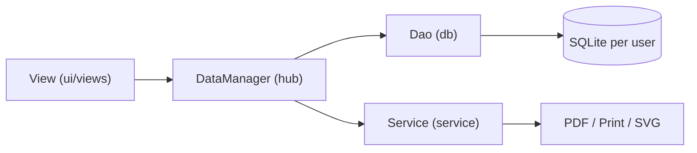

# 🏠 InvoiceStudio — Knowledge Vault

Obsidian vault for fast navigation of the InvoiceStudio codebase.
Open **Graph View** (Ctrl+G) to see how everything connects.

> [!tip] How to use
> Every note uses `[[wikilinks]]` — click any link to jump. Tags like `#dao` `#view` `#service` make search instant.

## Start here

- [[01 Architecture]] — layered map of the whole app (Mermaid diagram)
- [[02 Database Layer]] — every DAO, what it owns, key methods
- [[03 Service Layer]] — business logic, rendering, export, auth
- [[04 UI Layer]] — app shell, all views, dialogs, helpers
- [[05 Domain Models]] — model classes grouped by feature
- [[06 Build Packaging CI]] — Maven, jar, Windows installer, smoke tests
- [[07 Branches and Versions]] — branch topology, version history, recent fixes
- [[08 MCP Server]] — MCP tool surface
- [[09 Template Download & Upload]] — decision record: exporting/importing templates (one, several, all)

## Quick find — "where do I change X?"

| I need to change… | Go to |
|---|---|
| An SQL query / save logic | [[02 Database Layer]] |
| PDF / printing / barcode / CSV behaviour | [[03 Service Layer]] |
| A screen, dialog, keyboard shortcut, theme | [[04 UI Layer]] |
| A field on Bill / Item / Buyer … | [[05 Domain Models]] |
| Build version, installer, CI | [[06 Build Packaging CI]] |
| Item saved with null id (fixed) | [[07 Branches and Versions]] |
| Template download / upload (export / import) | [[09 Template Download & Upload]] |

## Feature map (screen → code path)

Related: [[01 Architecture]]
