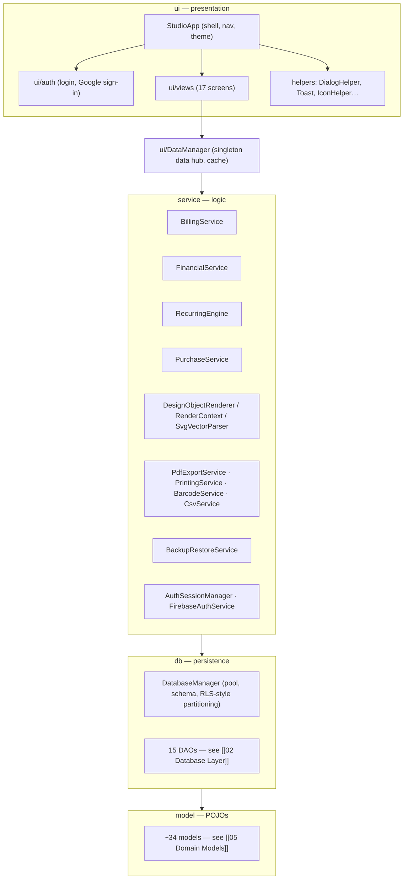

# 01 — Architecture

**Stack:** Java 21 · JavaFX 21 (OpenJFX 21.0.4) · SQLite · Maven Shade fat-jar
**Entry:** `Launcher.java` (main) → `ui/StudioApp` (JavaFX `Application`, "Obsidian & Gold" shell v3)

## Layer diagram

## Data flow (one feature, end-to-end)

1. User acts in a `ui/views/*View` (e.g. [[04 UI Layer]] → ItemsView).
2. View calls `DataManager` (app-wide hub with caching) or a `service/*` directly.
3. Service applies rules (totals, GST, stock, recurring) then calls a `db/*Dao`.
4. DAO executes SQL via `DatabaseManager` — every row is partitioned by `user_id` (multi-user safety).
5. Results return as `model/*` POJOs.

## Cross-cutting

- **Per-user data partitioning** — `DatabaseManager` + every DAO enforce `user_id`; verified by `AuthAndDataPartitioningTest`.
- **Theming** — pure-CSS classes in `globalfile.css`; inline `setStyle` is banned.
- **Template Designer** — biggest subsystem: `ui/views/TemplateDesigner` + `DesignObjectRenderer` + `RenderContext` + `TemplateDao` + `PdfExportService`/`PrintingService`.

Related: [[02 Database Layer]] · [[03 Service Layer]] · [[04 UI Layer]] · [[06 Build Packaging CI]]
