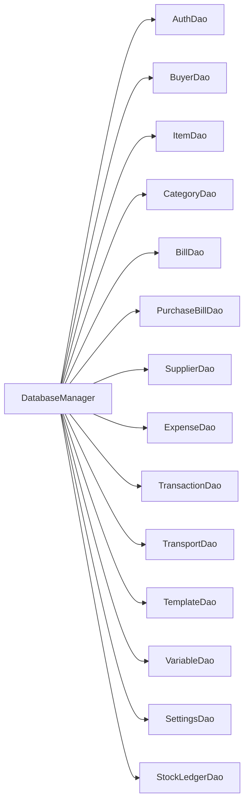

# 02 — Database Layer (`com.invoicestudio.db`)

All persistence lives here. `DatabaseManager` owns connections/schema; each DAO owns one table family and **always scopes queries by the logged-in `user_id`**.

## DAO reference

| DAO | Owns | Notes |
|---|---|---|
| `AuthDao` | user accounts, profiles | pairs with [[03 Service Layer]] → `FirebaseAuthService` |
| `BuyerDao` | buyers + custom buyer fields | |
| `ItemDao` | items (name, hsn, unit, rate, gst, stock) | ⭐ `saveItem` now auto-generates `it_xxxxxxxxxxxx` id when missing — see [[07 Branches and Versions]] |
| `CategoryDao` | item categories (`ItemCategory`) | |
| `BillDao` | invoices/quotes + items + payments | biggest DAO; feeds [[03 Service Layer]] → `BillingService` |
| `PurchaseBillDao` | purchase bills from suppliers | |
| `SupplierDao` | suppliers | |
| `ExpenseDao` | expenses | |
| `TransactionDao` | payments/receipts daybook | |
| `TransportDao` | transport/party details | |
| `TemplateDao` | invoice templates + elements | serialises `Template`/`TemplateElement` ([[05 Domain Models]]) |
| `VariableDao` | user-defined variables (scopes incl. `table`) | powers Template Designer column picker |
| `SettingsDao` | app settings, business profile | |
| `StockLedgerDao` | stock movements ledger | |

## Conventions

- Every write/read filters by `getEffectiveUserId()`; empty user ⇒ no-op (protects UI from saving without login).
- Timestamps are `Instant`; ids are short prefixed strings (`it_…`, `bl_…`).
- Tests: `db/DatabaseTest` covers CRUD + the auto-id regression.

Related: [[01 Architecture]] · [[05 Domain Models]] · [[07 Branches and Versions]]
