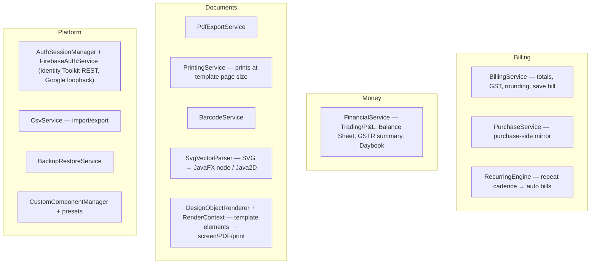

# 03 — Service Layer (`com.invoicestudio.service`)

Business rules, document generation and integrations. Services are called by views (via [[04 UI Layer]] → DataManager) or by each other, and use [[02 Database Layer]] for storage.

## Groups

## Key notes

- **Printing correctness** — `PrintingService` must build the `PrinterJob.PageLayout` from the template's paper (`PageConfig`/`PageSizeName`) so printed output matches the designer exactly (v3.0.0 fix, see [[07 Branches and Versions]]).
- **Renderer parity** — one element model ([[05 Domain Models]] → `TemplateElement`) is drawn three ways: screen (JavaFX), PDF (Java2D), print (PageLayout). Change `DesignObjectRenderer`/`SvgVectorParser` together with the designer.
- **Auth** — Firebase REST for email/password + Google sign-in; session lives in `AuthSessionManager`; every DAO call then partitions by user (see [[02 Database Layer]]).

Related: [[01 Architecture]] · [[04 UI Layer]] · [[05 Domain Models]]
