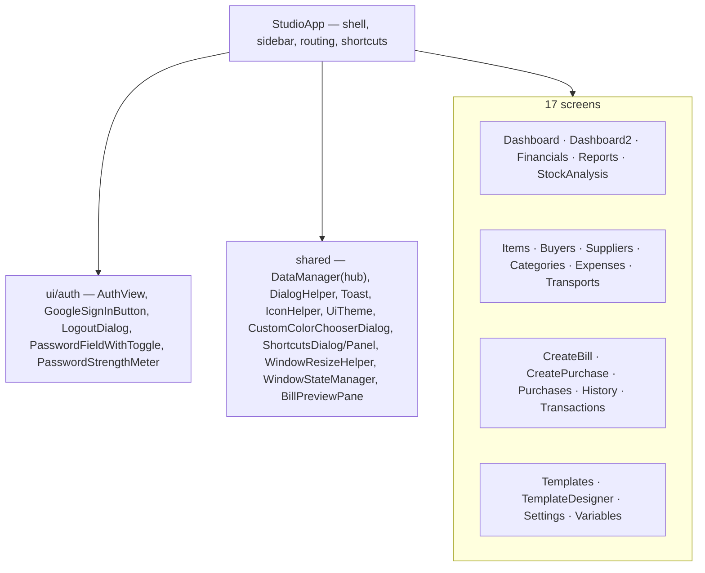

# 04 — UI Layer (`com.invoicestudio.ui`)

JavaFX presentation. Shell = `StudioApp` ("Obsidian & Gold" v3 theme); screens live in `ui/views`, login flow in `ui/auth`, shared widgets at `ui` root.

## Map

## Designer-heavy screens

- **TemplateDesigner** — canvas + layers panel (eye/lock/rename), mm rulers, help dialog (`ShortcutsDialog`), 6 resize handles incl. left-side scaling, magnet snapping to other object borders, per-side stroke editor, shapes (ellipse/star/arrow…). Backspace inside text fields is consumed by the field, never deletes canvas objects (v3.0.0).
- **CustomColorChooserDialog** — in-app themed colour picker replacing the stock JavaFX dialog (which crashed on custom colours), used by designer property fields.

## Conventions

- **No inline `setStyle`** — theme via CSS classes only; new `.accent-*` rules go at the **end** of `globalfile.css` (cascade wins).
- Dialogs/helpers keep views thin; `DataManager` is the single data hub the views bind to.
- Keyboard map lives in `ShortcutsDialog` — keep it in sync when adding shortcuts.

Related: [[01 Architecture]] · [[03 Service Layer]] · [[06 Build Packaging CI]]
