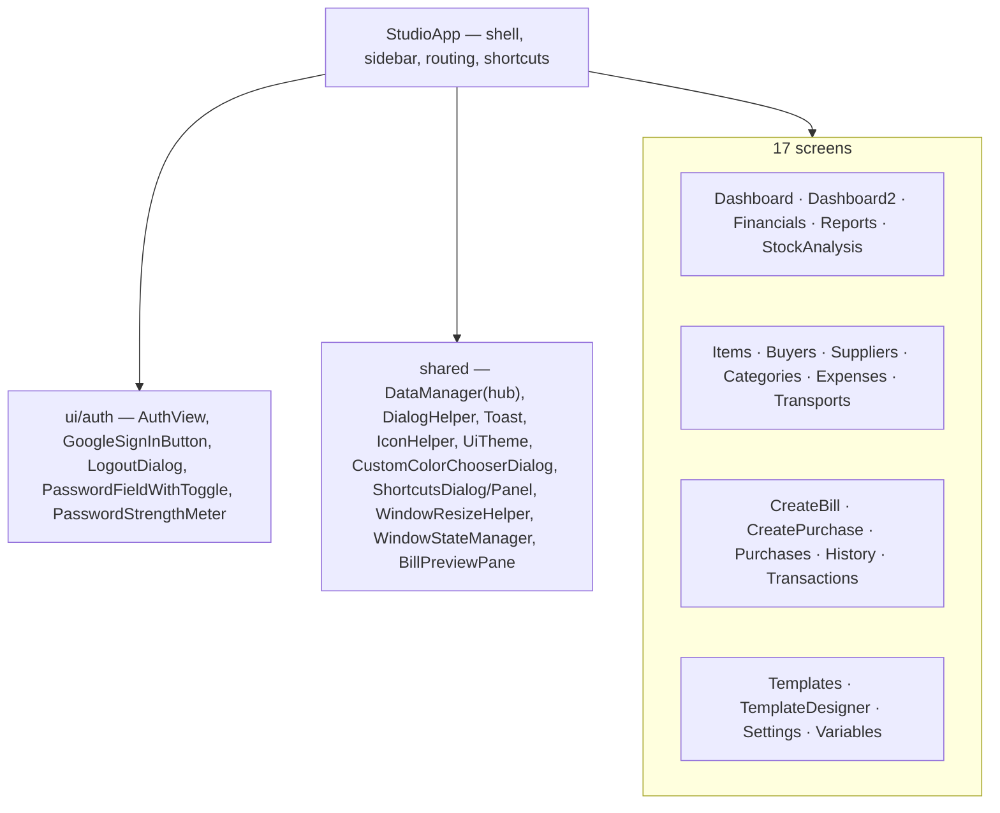

# 04 — UI Layer (`com.invoicestudio.ui`)

JavaFX presentation. Shell = `StudioApp` ("Obsidian & Gold" v3 theme); screens live in `ui/views`, login flow in `ui/auth`, shared widgets at `ui` root.

## Map

## Designer-heavy screens

- **TemplateDesigner** — canvas + layers panel (eye/lock/rename), mm rulers, help dialog (`ShortcutsDialog`), 6 resize handles incl. left-side scaling, magnet snapping to other object borders, per-side stroke editor, shapes (ellipse/star/arrow…). Backspace inside text fields is consumed by the field, never deletes canvas objects (v3.0.0).
- **TemplatesView** — the gallery toolbar holds `Import` plus an `Export` multi-select dropdown (`MenuButton` + one themed `CheckBox` per saved template, `hideOnClick = false`). Choose one or several templates and download them as `.json`; `Import` uploads them back without overwriting anything. Both dialogs open in the user's Downloads folder (`AppDirs.downloadsDir()`). The dropdown carries the extra class `menu-button-sm` — a `MenuButton` sitting in a `button-sm` row needs three small Modena overrides (caption colour, inner padding, arrow padding) to match a plain `Button` box. Implementation + rationale: [[09 Template Download & Upload]]. Duplicate deep-copy, stale-gallery refresh and the designer's resize-handle semantics + text-editor styling are documented in [[10 Designer Selection & Resize]] — rule of thumb there: template writes must call `DataManager.invalidateTemplates()` so the cached gallery re-reads, and content objects (image/barcode/QR) scale their pixels on corner drags while text boxes stay free-resize.
- **CustomColorChooserDialog** — in-app themed colour picker replacing the stock JavaFX dialog (which crashed on custom colours), used by designer property fields.

## Conventions

### Native window chrome

The Windows title bar is OS-drawn and cannot be styled by CSS. It is themed in
`ui/TitleBarTheme.java` (DWM dark caption + brand caption/text/border colors
via JNA, always no-throw) and applied globally from `StudioApp` next to the
app-icon listener. Palette constants there mirror `.root` — see
[[12 Dark OS Title Bar]].

- **No inline `setStyle`** — theme via CSS classes only; new `.accent-*` rules go at the **end** of `globalfile.css` (cascade wins).
- **File dialogs** — exports/imports default to `AppDirs.downloadsDir()` (Downloads, overridable with `-Dinvoicestudio.downloads.dir`); `setInitialDirectory` only when the folder exists.
- **`MenuButton` in a button row** — add `menu-button-sm`; Modena pads the inner `.label` and the arrow-button, so an unmodified menu renders taller and with dark text.
- Dialogs/helpers keep views thin; `DataManager` is the single data hub the views bind to.
- Keyboard map lives in `ShortcutsDialog` — keep it in sync when adding shortcuts.

Related: [[01 Architecture]] · [[03 Service Layer]] · [[06 Build Packaging CI]]
