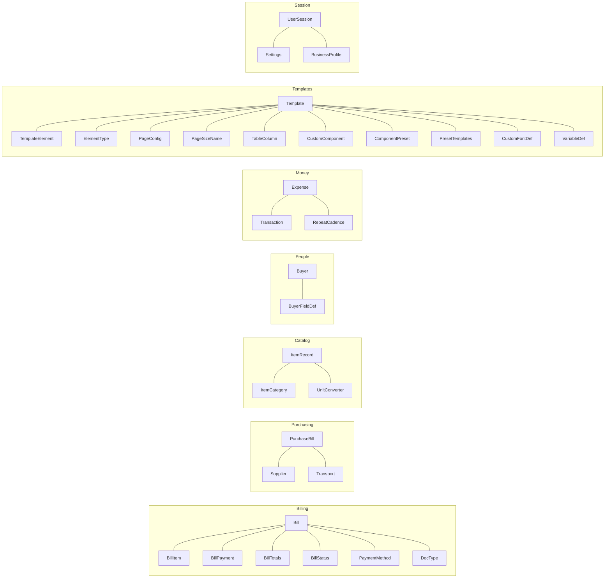

# 05 — Domain Models (`com.invoicestudio.model`)

Plain data classes exchanged between [[04 UI Layer]], [[03 Service Layer]] and [[02 Database Layer]].

## Grouped

## Frequently touched

| Model | Used by |
|---|---|
| `ItemRecord` | ItemsView, BillingService, ItemDao — **id auto-generated in `saveItem` when blank** (null-id bug fix) |
| `Bill` + `BillItem` + `BillTotals` | CreateBillView, BillingService, PdfExportService, PrintingService |
| `Template` + `TemplateElement` | TemplateDesigner, TemplateDao, DesignObjectRenderer |
| `PageConfig` / `PageSizeName` | paper size everywhere (designer ↔ PDF ↔ print) |
| `Buyer` + `BuyerFieldDef` | BuyersView, BillingService (custom fields) |

Related: [[02 Database Layer]] · [[03 Service Layer]] · [[04 UI Layer]]
