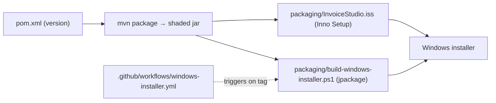

# 06 — Build, Packaging & CI

## Commands

```bash
mvn clean package          # fat jar → target/invoice-studio-desktop-<ver>.jar (~33MB, Shade)
mvn test                   # unit tests (db, service, ui)
mvn javafx:run             # run from source (javafx-maven-plugin, mainClass com.invoicestudio.Launcher)
scripts/nav_smoke_test.sh  # portable 47-step UI smoke test against the PACKAGED jar
```

> [!warning] Smoke test runs the packaged jar
> Editing sources requires a full `mvn package` before `nav_smoke_test.sh` will see changes — `test-compile` alone is not enough.

## Artifacts & pipeline



- **Version string lives in 5 places** — `pom.xml`, `build-windows-installer.ps1` (jar name + `--app-version`), `InvoiceStudio.iss` (`#define AppVersion`), `.github/workflows/windows-installer.yml`, and the git tag. Full checklist: root `README.md` §11.
- `packaging/InvoiceStudio.ico` — app icon; `AppDirs.java` — OS-correct data dir for the SQLite db.

## Test suites (src/test)

- `NavSmokeRunner` + `SmokeLauncher` — scripted UI walk (47 steps).
- `db/DatabaseTest` — DAO CRUD + auto-id regression.
- `service/*` — billing, purchase/financials, CSV, recurring, auth partitioning, template V3/V4 features, page margins, workshop scenario.
- `ui/*` — designer enhancements (incl. vector), date-picker theme.

Related: [[07 Branches and Versions]] · [[01 Architecture]]
