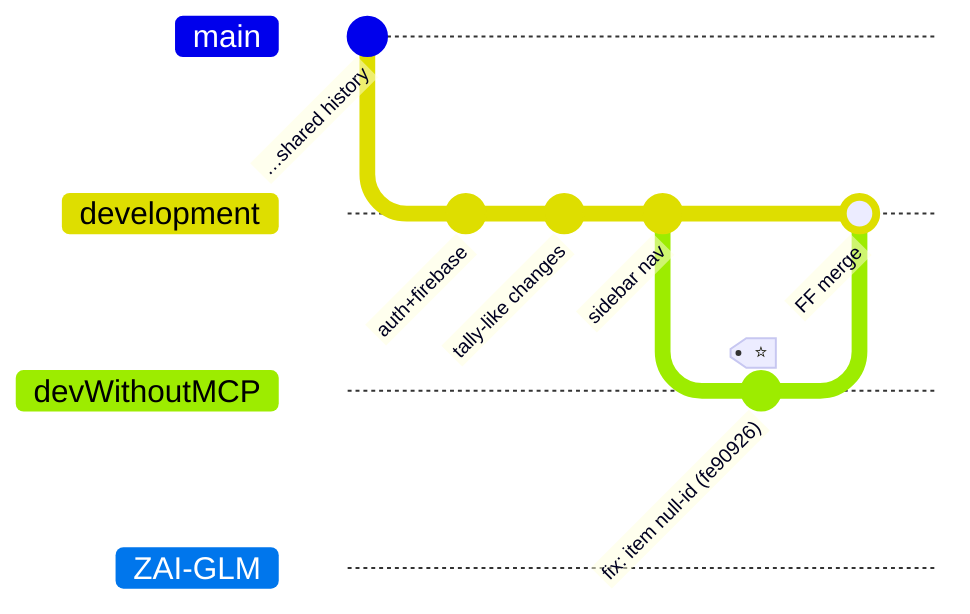

# 07 — Branches & Versions

## Branch topology



| Branch | Purpose | State |
|---|---|---|
| `main` | stable line | independent head |
| `development` | active line (auth, firebase, tally-style UI, sidebar nav) | ✅ now contains the item null-id fix (fast-forward merge of `devWithoutMCP`) |
| `devWithoutMCP` | fix branch created to solve the item bug without MCP tooling | merged into `development`; kept for history |
| `ZAI-GLM` | v3.0.0 UX line — print-size fix, safe text editing, themed color picker, layers eye/lock/rename, mm rulers, help dialog, 6 resize handles, magnet snapping, per-side strokes, extra shapes | diverged after `de469ce`; candidate to merge into `development` later |
| `Antigravity` | older snapshot | archived |

> [!note] "MCP" here refers to the AI tooling used while developing, **not** repo code — the two branch tips differed by exactly 2 files (below).

## ⭐ Item null-id fix (`fe90926`, merged 2026-09-14)

**Symptom:** adding an item via the UI button saved it with a **null id** on `development`.

**Fix (`src/main/java/com/invoicestudio/db/ItemDao.java`):**

```java
private String generateItemId() {
    return "it_" + UUID.randomUUID().toString().replace("-", "").substring(0, 12);
}

public void saveItem(ItemRecord item) {
    String uid = getEffectiveUserId();
    if (uid.isEmpty() || item == null) return;
    if (item.getId() == null || item.getId().isBlank()) {
        item.setId(generateItemId());   // ← the fix
    }
    // INSERT INTO items …
}
```

**Regression test** (`DatabaseTest.testItemSaveGeneratesIdWhenMissing`): saves an item without id → asserts id generated, findable, then deletable. All 6 tests green.

## Version history

- **2.0.x** — baseline app line (tag `v2.0.0`).
- **3.0.0** (branch `ZAI-GLM`) — template-designer overhaul + 3 bug fixes (print size, Backspace deleting objects / cursor jump, ColorPicker crash) + layers/rulers/help/left-resize/magnet/per-side strokes.
- Bumping a version touches 5 files — see [[06 Build Packaging CI]].

Related: [[02 Database Layer]] · [[06 Build Packaging CI]]
