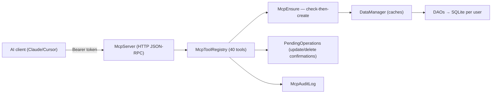

# 08 — MCP Server (`com.invoicestudio.mcp`)

Localhost MCP (Model Context Protocol) server embedded in the app: exposes the
desktop's capabilities as ~40 JSON-RPC tools to AI clients (Claude, Cursor, VS
Code). Started from **Settings → MCP Server**; binds `127.0.0.1:<port>/mcp`
with a bearer token; dies with the app; every call audited.

## Architecture

## The check-then-create contract

Every create tool resolves references (item→category, bill→buyer,
purchase→supplier, line→item) **before** inserting: existing deps are linked
(case-insensitive by id/name), missing deps are **auto-created with defaults**
and listed in `autoCreated[]`. Create tools are idempotent by natural key
(`existed: true` instead of duplicates). Failures roll back auto-created deps
(verified with a DB read-back — DAOs swallow SQL errors).

| Reference | Missing dependency → |
|---|---|
| item → category | auto-create category (unique index `idx_categories_user_name` backstops races) |
| bill → buyer | auto-create buyer (blank buyer = walk-in, by design) |
| purchase → supplier | auto-create supplier (never hard-error) |
| invoice line → item | auto-create item from the line's own data |
| expense → head | free-text accounting head — no auto-create |
| payment → purchase | hard error (operator error) |

## Files

| File | Role |
|---|---|
| `McpServer` | HTTP/JSON-RPC endpoint, bearer auth, lifecycle |
| `McpToolRegistry` | tool catalogue, dispatch, create flows |
| `McpEnsure` | existence layer + ensure + rollback (striped locks) |
| `PendingOperations` | confirmation queue for update/delete |
| `McpAuditLog` / `McpConfig` | audit trail / port+token config |
| `McpSettingsPanel` | Settings tab UI (start/stop, token, approvals) |
| `GuideContent` | serves `APP_GUIDE.md` + `MCP_SERVER.md` as tools |

Docs (operator + developer guide, per-tool contract): `src/main/resources/docs/MCP_SERVER.md`
Tests: `McpServerTest` (protocol/e2e, 20) · `McpEnsureHardeningTest` (both
branches per tool + race + rollback, 17).

Related: [[01 Architecture]] · [[02 Database Layer]] · [[03 Service Layer]] · [[07 Branches and Versions]]
