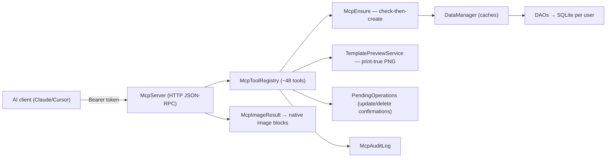

# 08 — MCP Server (`com.invoicestudio.mcp`)

Localhost MCP (Model Context Protocol) server embedded in the app: exposes the
desktop's capabilities as ~48 JSON-RPC tools to AI clients (Claude, Cursor, VS
Code). Started from **Settings → MCP Server**; binds `127.0.0.1:<port>/mcp`
with a bearer token; dies with the app; every call audited.

## Architecture

## Template design toolset (AI as designer)

The AI can design bill templates end-to-end: `get_template_design_guide`
(full vocabulary — 23 element types, every property, bindings, recipes),
lossless `create_template` / `get_template` / `update_template` element I/O
(unknown types → TEXT **with a warning**, never silent), and
`render_template_preview` — saved template or **unsaved draft** rendered to a
PNG by the real print engine (`PdfExportService` Java2D path + sample bill
+ auto-height) and returned as a native MCP image content block with
`warnings` (out-of-bounds elements, unresolved `{{bindings}}`). Thermal page
sizes always carry true roll geometry + `autoHeight`. Guide doc:
`resources/docs/TEMPLATE_DESIGN_GUIDE.md`.

## The check-then-create contract

Every create tool resolves references (item→category, bill→buyer,
purchase→supplier, line→item) **before** inserting: existing deps are linked
(case-insensitive by id/name), missing deps are **auto-created with defaults**
and listed in `autoCreated[]`. Create tools are idempotent by natural key
(`existed: true` instead of duplicates). Failures roll back auto-created deps
(verified with a DB read-back — DAOs swallow SQL errors).

`update_item` is the one update tool that also runs this contract: its
`categoryId`/`categoryName` is resolved via the same ensure path, making
category **reassignment** first-class (create_item never updates an existing
item, so re-calling create with a new category is a documented no-op —
`update_item` is the only way to move an item; the confirm summary spells out
`MOVE category → X`). Same contract for **buyer → default transport**:
`create_buyer`/`update_buyer` accept `transportId`/`transportName`
(`McpEnsure.ensureTransport` — auto-create + race safety).

Categories are also first-class tools now: `create_category` (idempotent by
name), `update_category` (rename **cascaded** to items' denormalized
`category_name` via `ItemDao.updateCategoryNameForCategory`), `delete_category`
(refuses while `ItemDao.countItemsInCategory` > 0, protects the default), and
`list_categories` carries a live `itemCount` per row. `update_buyer` /
`update_supplier` have full create/update field parity (address, stateCode,
openingBalance, creditPeriodDays / creditLimit, city, contactPerson) — the
confirm summaries spell out every field change incl. `ASSIGN default
transport → X`.

| Reference | Missing dependency → |
|---|---|
| item → category | auto-create category (unique index `idx_categories_user_name` backstops races) |
| bill → buyer | auto-create buyer (blank buyer = walk-in, by design) |
| purchase → supplier | auto-create supplier (never hard-error) |
| invoice line → item | auto-create item from the line's own data |
| expense → head | free-text accounting head — no auto-create |
| payment → purchase | hard error (operator error) |

## Files

| File | Role |
|---|---|
| `McpServer` | HTTP/JSON-RPC endpoint, bearer auth, lifecycle, image blocks |
| `McpToolRegistry` | tool catalogue, dispatch, create flows |
| `McpImageResult` | image tool result → native MCP image content block |
| `McpEnsure` | existence layer + ensure + rollback (striped locks) |
| `PendingOperations` | confirmation queue for update/delete |
| `McpAuditLog` / `McpConfig` | audit trail / port+token config |
| `McpSettingsPanel` | Settings tab UI (start/stop, token, approvals) |
| `GuideContent` | serves `APP_GUIDE.md` + `MCP_SERVER.md` + `TEMPLATE_DESIGN_GUIDE.md` as tools |
| `service/TemplatePreviewService` | headless template → PNG preview (print engine) |

Docs (operator + developer guide, per-tool contract): `src/main/resources/docs/MCP_SERVER.md`
Tests: `McpServerTest` (protocol/e2e, 20) · `McpEnsureHardeningTest` (both
branches per tool + race + rollback + category reassignment + buyer transport
+ category CRUD lifecycle, 27) · `McpTemplateDesignTest` (design guide
completeness, styling round-trip, previews + warnings, thermal geometry, 6).

Related: [[01 Architecture]] · [[02 Database Layer]] · [[03 Service Layer]] · [[07 Branches and Versions]]
