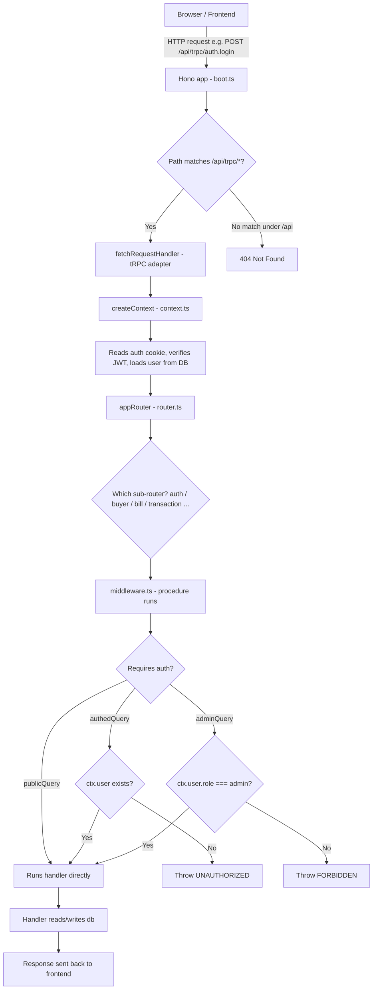
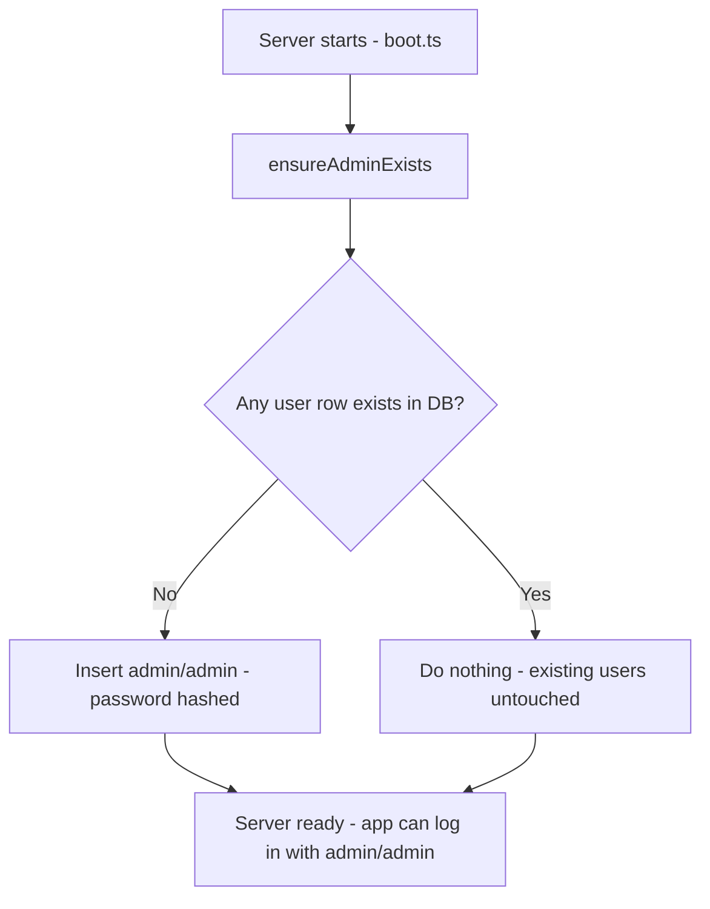
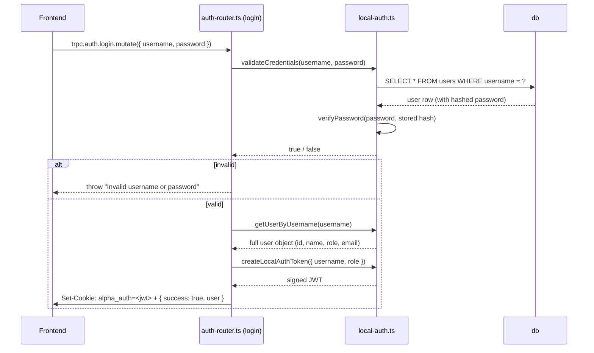
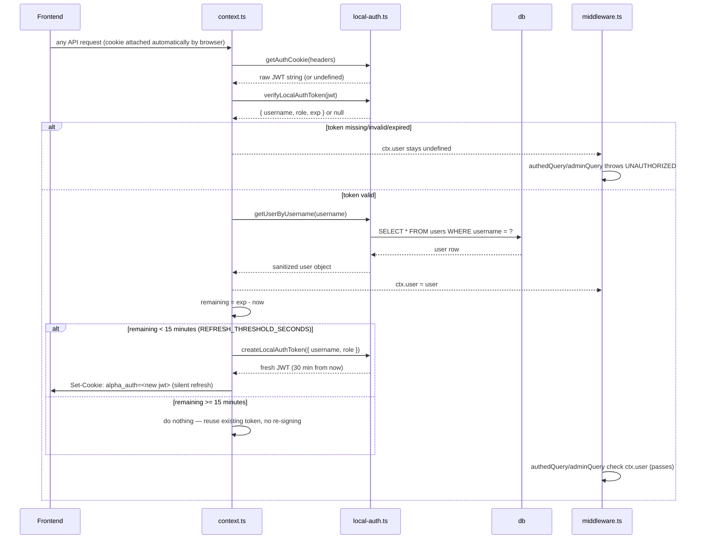

# Alpha ERP — Backend Architecture Guide

This document explains **how the backend works end-to-end**: which file
does what, how a request travels through the system, and how
authentication is wired up. It's written so someone new to the codebase
(or new to backend dev in general) can read this file top-to-bottom and
understand the whole system without opening the source first.

---

## 1. Tech Stack (what each piece is for)

| Tool | Role |
|---|---|
| **Hono** | The HTTP server framework. Think of it like Express, but faster and modern. It listens for incoming HTTP requests. |
| **tRPC** | Sits on top of Hono. Instead of writing REST endpoints like `POST /api/login`, you write plain TypeScript functions and tRPC turns them into type-safe API calls. The frontend gets full autocomplete for your backend functions. |
| **Zod** | Validates input. E.g. "username must be a non-empty string." If validation fails, the request is rejected before your code even runs. |
| **jose** | Creates and verifies JWTs (JSON Web Tokens) — the signed token stored in the login cookie that proves "this user is logged in." |
| **cookie** | Reads/writes the `Set-Cookie` HTTP header. |
| **superjson** | Lets tRPC send richer data types (Dates, undefined, etc.) between frontend/backend, not just plain JSON. |
| **db** | Your custom lightweight database layer (SQL-like `db.prepare(...).get()/.run()` API) — acts like SQLite but backed by JSON files. |

---

## 2. Big Picture: How a Request Flows Through the System



**In plain English:**
1. The frontend calls a tRPC procedure (e.g. `trpc.auth.login.mutate(...)`), which is really just an HTTP POST under the hood.
2. `boot.ts` is the entry point — it starts the Hono server and forwards any `/api/trpc/*` request to tRPC's handler.
3. Before your actual function runs, `createContext` (in `context.ts`) executes — it reads the auth cookie, checks if it's a valid token, and loads the logged-in user from the database.
4. That `ctx` (context) object — containing `user` if logged in — gets passed into every procedure.
5. `router.ts` is the top-level map of all sub-routers (`auth`, `buyer`, `bill`, etc.) — like a table of contents.
6. Each procedure is either `publicQuery` (anyone), `authedQuery` (must be logged in), or `adminQuery` (must be logged in **and** be an admin). This check happens in `middleware.ts`.
7. If the check passes, your handler function runs and talks to the database.

---

## 3. File-by-File Breakdown

### `boot.ts` — The entry point (starts the server)
This is the first file that runs when the app starts.

```ts
ensureAdminExists();   // (1) make sure at least one login exists
const app = new Hono(); // (2) create the web server
app.use("/api/trpc/*", ...); // (3) wire tRPC into Hono
```

- **(1)** Calls `ensureAdminExists()` from `local-auth.ts` immediately on boot. If the `users` table is empty, it inserts a default `admin` / `admin` account so you can log in on a fresh install. If a user already exists, this does nothing.
- **(2)** Creates the Hono app and sets a 50MB body size limit (for file uploads etc.).
- **(3)** Any request to `/api/trpc/*` gets handed off to tRPC's `fetchRequestHandler`, along with the `appRouter` (all your API routes) and `createContext` (auth/session setup).
- Anything else under `/api/*` that doesn't match returns a 404.
- In production, it also serves the built frontend static files and starts listening on a port.

**Why this matters:** if you ever need to run something once at startup (migrations, cache warms, cron jobs), this is the file to put it in.

---

### `context.ts` — Figures out "who is making this request?" (and keeps active sessions alive)
Runs on **every single API call**, before your handler code.

```ts
export async function createContext(opts) {
  const ctx = { req, resHeaders };
  const token = getAuthCookie(opts.req.headers);      // read cookie
  const payload = await verifyLocalAuthToken(token);  // verify JWT (includes exp)
  const dbUser = getUserByUsername(payload.username); // load real user
  ctx.user = dbUser;                                  // attach to context if valid

  // Sliding session: if less than 15 min is left on the token, silently
  // issue a fresh 30-min one so active users are never logged out mid-use.
  const remaining = payload.exp - nowInSeconds;
  if (remaining < REFRESH_THRESHOLD_SECONDS) {
    const freshToken = await createLocalAuthToken({ username, role });
    ctx.resHeaders.append("set-cookie", serializeAuthCookie(freshToken));
  }

  return ctx;
}
```

- Reads the `alpha_auth` cookie from the incoming request.
- If it's present and the JWT signature/expiry is valid, it looks up the **real** user row from the database (not just trusting whatever the token says) and attaches it as `ctx.user`.
- If there's no cookie, or it's invalid/expired, `ctx.user` stays `undefined` — meaning "not logged in." This is wrapped in try/catch specifically so a bad cookie never crashes the whole request; it just falls back to "logged out."
- **Sliding session:** the JWT carries an `exp` (expiry) timestamp. On every authenticated request, this file checks how much time is left. If less than `REFRESH_THRESHOLD_SECONDS` (15 minutes) remains, it silently signs a brand-new 30-minute token and appends a fresh `Set-Cookie` header — the user never notices, they just stay logged in as long as they're active. If they stop using the app for the full 30 minutes, the old token genuinely expires and the next request fails verification, logging them out.
- This check-before-refresh approach avoids re-signing a JWT on *every single request* — it only does the (cheap, but non-zero) signing work roughly once every 15 minutes of activity, not constantly.
- This `ctx` object is what shows up as `ctx` in every procedure you write (`opts.ctx.user`, etc.).

**Why this matters:** this is the *only* place that decides who the current user is, and the *only* place that keeps a session alive. Every other file just trusts `ctx.user`.

---

### `middleware.ts` — Defines the three permission levels
This is where tRPC itself is initialized, and where you define reusable "guards."

```ts
const t = initTRPC.context<TrpcContext>().create({ transformer: superjson });

export const createRouter = t.router;       // groups procedures together
export const publicQuery = t.procedure;      // no auth required

const requireAuth = t.middleware(async ({ ctx, next }) => {
  if (!ctx.user) throw new TRPCError({ code: "UNAUTHORIZED" });
  return next({ ctx: { ...ctx, user: ctx.user } });
});

function requireRole(role) {
  return t.middleware(async ({ ctx, next }) => {
    if (!ctx.user || ctx.user.role !== role) throw new TRPCError({ code: "FORBIDDEN" });
    return next(...);
  });
}

export const authedQuery = t.procedure.use(requireAuth);
export const adminQuery = authedQuery.use(requireRole("admin"));
```

Three building blocks you'll use everywhere else in the codebase:

| Export | Meaning | Use for |
|---|---|---|
| `publicQuery` | No login needed | `ping`, `checkDefault`, `login` |
| `authedQuery` | Must be logged in (any role) | `me`, `logout`, most day-to-day routes |
| `adminQuery` | Must be logged in **and** `role === "admin"` | Sensitive actions: deleting data, managing settings, managing users |

**Why this matters:** you never write `if (!ctx.user) throw ...` by hand in every route. You just pick `publicQuery`, `authedQuery`, or `adminQuery` when defining a procedure, and the check happens automatically before your code runs.

---

### `router.ts` — The master list of all routes
```ts
export const appRouter = createRouter({
  ping: publicQuery.query(...),
  auth: authRouter,
  dashboard: dashboardRouter,
  transaction: transactionRouter,
  buyer: buyerRouter,
  report: reportRouter,
  audit: auditRouter,
  settings: settingsRouter,
  item: itemRouter,
  bill: billRouter,
  transport: transportRouter,
});
export type AppRouter = typeof appRouter;
```

This just nests all the feature-specific routers (each in its own file under `routers/`) under one top-level object. On the frontend, this turns into calls like:
- `trpc.auth.login.mutate(...)`
- `trpc.buyer.list.query(...)`
- `trpc.bill.create.mutate(...)`

The `export type AppRouter` line is what gives the **frontend** full type-safety/autocomplete — it imports this type (not the actual code) to know exactly what inputs/outputs every route has.

**Why this matters:** if you add a new feature (say, "expenses"), you'd create `routers/expense.ts`, then add one line here: `expense: expenseRouter,`.

---

### `local-auth.ts` — The actual auth logic (the "service layer")
This is where all real auth work happens. `auth-router.ts` just calls into these functions.

| Function | What it does |
|---|---|
| `ensureAdminExists()` | Checks if the `users` table is empty. If so, inserts a default `admin`/`admin` account (password hashed). Called on every boot and defensively before login/checkDefault too. |
| `hashPassword(password)` | Turns a plain password into a salted hash (`salt:hash` format) using Node's built-in `scrypt`. Never store plain text passwords. |
| `verifyPassword(password, stored)` | Re-hashes the given password with the stored salt and compares it safely (`timingSafeEqual`, to avoid timing attacks) against the stored hash. |
| `validateCredentials(username, password)` | Looks up the user, verifies the password. Returns `true`/`false`. Used by the `login` route. |
| `getUserByUsername(username)` | Loads a full user row from the DB and returns it in the shape of the `User` type — with `password` stripped out (set to `""`) so it never leaks past this file. |
| `createLocalAuthToken({ username, role })` | Signs a JWT containing `{ username, role }`, valid for **30 minutes** (`COOKIE_MAX_AGE` and `.setExpirationTime("30m")` must be kept in sync — see below). |
| `verifyLocalAuthToken(token)` | Verifies a JWT's signature and expiry; returns the decoded payload (`{ username, role, exp }`) or `null` if invalid/expired. The `exp` field is what `context.ts` uses to decide whether the session needs refreshing. |
| `REFRESH_THRESHOLD_SECONDS` (constant, 15 min) | Not a function, but exported for `context.ts` to use — the "how close to expiry before we silently refresh the token" cutoff for sliding sessions. |
| `updateCredentials(...)` | Changes username/password after verifying the current password. Hashes the new password if provided. |
| `isDefaultCredentials()` | Returns `true` if the admin account is still the seeded `admin`/`admin` — used by the frontend to nag "please change your default password." |
| `getAuthCookie(headers)` | Extracts the raw JWT string out of the `Cookie` header. |
| `serializeAuthCookie(token)` / `serializeClearCookie()` | Builds the `Set-Cookie` header string to log a user in (sets the cookie) or out (clears it). |

**Why this matters:** if you ever need to change *how* auth works (switch to bcrypt, change token expiry, add refresh tokens, support multiple roles), this is the only file you touch. Nothing else in the app needs to know how tokens are made — it just calls these functions.

---

### `auth-router.ts` — The HTTP-facing auth endpoints
This is the thin "controller" layer — it validates input with Zod, calls into `local-auth.ts`, and shapes the HTTP response. It doesn't contain business logic itself.

```
auth.me            → authedQuery  → returns the currently logged-in user (from ctx.user)
auth.checkDefault  → publicQuery  → { isDefault: true/false } — used to prompt password change
auth.login         → publicQuery  → validates creds, signs JWT, sets cookie, returns user info
auth.changePassword→ authedQuery  → verifies current password, updates it, re-issues a token
auth.logout        → authedQuery  → clears the auth cookie
```

Flow for `login`:
1. Zod validates `{ username, password }` are non-empty strings.
2. `validateCredentials()` checks them against the DB (hashed compare).
3. If valid, `getUserByUsername()` fetches the real user (id, name, role, email).
4. `createLocalAuthToken()` signs a JWT with that user's **actual** role (not hardcoded).
5. `serializeAuthCookie()` builds the cookie header and it's appended to the response.
6. The user object is returned to the frontend (for showing "Welcome, {name}").

---

## 4. Auth Flow, Visualized

### 4.1 App startup (first run vs. existing install)



### 4.2 Logging in



### 4.3 Every subsequent request (already logged in) — with sliding session refresh



**Session timeout summary:**
- Each login (or silent refresh) issues a token valid for **30 minutes** (`COOKIE_MAX_AGE` in `local-auth.ts` and `.setExpirationTime("30m")` — these two must always match).
- This is a **sliding** session, not a fixed one: as long as the user keeps making requests, `context.ts` renews the token before it expires, so they're never logged out mid-use.
- Only **30 minutes of total inactivity** (no requests at all) lets the token actually expire — the next request then fails verification and the user must log in again.
- The refresh doesn't happen on literally every request — only when under `REFRESH_THRESHOLD_SECONDS` (15 minutes) remain on the current token — so the server isn't re-signing a JWT on every single API call.

---

## 5. Key Concepts Explained (for beginners)

**What is a "procedure" in tRPC?**
A procedure is just a function exposed over the network, with optional input validation. `.query()` is for reading data (like GET), `.mutation()` is for changing data (like POST/PUT/DELETE). Example:

```ts
someRoute: publicQuery
  .input(z.object({ id: z.number() }))   // validate input shape
  .query(({ input, ctx }) => {           // your actual logic
    return db.prepare("SELECT * FROM items WHERE id = ?").get(input.id);
  }),
```

**What is `ctx` (context)?**
An object created fresh for every request (by `createContext` in `context.ts`) and passed into every procedure. It carries things every route might need: the raw request, response headers (to set cookies), and — most importantly — `ctx.user`, telling you who's logged in.

**Why hash passwords instead of storing them directly?**
If your database file ever leaks (backup, misconfigured server, etc.), plaintext passwords let an attacker log in immediately, and since people reuse passwords, it can compromise their accounts elsewhere too. A hash is one-way — you can check "does this password match?" without ever being able to reverse the hash back into the password.

**Why a JWT and a cookie, not just "is logged in" in the database?**
The JWT is a small signed proof issued to the browser at login time. The server doesn't need to store "sessions" in the database — it just re-verifies the signature on each request, which is fast and stateless. The cookie is simply the transport mechanism (the browser sends it automatically on every request to your domain).

**Why does `getUserByUsername` blank out the password field?**
Because the returned object frequently ends up going straight back to the frontend (e.g. via `auth.me`). Even a password *hash* shouldn't leave the server if it doesn't need to — defense in depth.

**What's the difference between a "fixed" session and a "sliding" session?**
- **Fixed:** the token expires exactly N minutes after login, no matter what — even if the user was actively clicking around the whole time, they get booted out at the deadline.
- **Sliding (what this app uses):** every request the user makes resets the clock. So an active user effectively never gets logged out — the 30-minute timer only actually runs out during a stretch where they make *zero* requests for the full 30 minutes. This is the more common, more user-friendly choice for most apps (banking apps often use short fixed/sliding-hybrid sessions for security; a typical internal business app like this one favors sliding for convenience).

---

## 6. How To Extend This Backend (common tasks)

### Add a new API route
1. Find (or create) the right file under `routers/` (e.g. `routers/expense.ts`).
2. Define a procedure using `publicQuery`, `authedQuery`, or `adminQuery` from `middleware.ts`.
3. Register the router in `router.ts` (e.g. `expense: expenseRouter,`).

### Require login for a route
Use `authedQuery` instead of `publicQuery` when defining the procedure. That's it — the `requireAuth` middleware handles the rest.

### Require admin-only access
Use `adminQuery` instead. It stacks on top of `authedQuery`'s check, then additionally checks `ctx.user.role === "admin"`.

### Change how long a login lasts
Currently sessions last **30 minutes**, sliding (see section 4.3). Three places in `local-auth.ts` are involved:
- `COOKIE_MAX_AGE` — how long the browser keeps the cookie (must match the JWT expiry below)
- `.setExpirationTime("30m")` inside `createLocalAuthToken` — how long the JWT itself is valid
- `REFRESH_THRESHOLD_SECONDS` — how close to expiry (currently 15 min, i.e. half the session) before `context.ts` silently issues a fresh token

If you change the session length, keep `COOKIE_MAX_AGE` and `.setExpirationTime(...)` in sync (same duration, just different formats — seconds vs. a string like `"30m"`/`"1h"`), and keep `REFRESH_THRESHOLD_SECONDS` comfortably smaller (e.g. half) so there's no gap where a token could expire before context.ts gets a chance to refresh it.

If you want a **fixed** (non-sliding) session instead — logging a user out exactly N minutes after login no matter how active they are — remove the refresh logic in `context.ts` (the `if (remainingSeconds < REFRESH_THRESHOLD_SECONDS)` block) entirely; the token will then just expire naturally at its original issue time.

### Add a new user role (e.g. "manager")
1. Update the `role` union type in `types.ts` (`"admin" | "staff" | "manager" | null`).
2. Use `requireRole("manager")` (already generic in `middleware.ts`) to gate specific routes, or export a new `managerQuery` constant like `adminQuery`.

---

## 7. Data Layer Note

`db.prepare(sql).get()` / `.run()` mimics the classic `better-sqlite3` API, but is backed by your custom `db` engine (JSON files on disk instead of a real SQLite binary). Everywhere you see `db.prepare(...)`, treat it exactly like SQL — the shape/behavior is the same, only the storage engine underneath differs. See `types.ts` for the exact shape of every table/view (`User`, `Buyer`, `Transaction`, `Bill`, etc.) and note the comments there — several fields were intentionally removed/denormalized (e.g. `Bill` no longer stores buyer info directly; join through `transactions.buyerId` instead).

---

## 8. Quick Reference: Request Lifecycle Summary

```
Browser
  → Hono (boot.ts)
    → tRPC adapter
      → createContext (context.ts)   [figures out ctx.user]
        → appRouter (router.ts)       [finds the right sub-router]
          → middleware checks (middleware.ts)  [public / authed / admin]
            → your handler function    [reads/writes db]
              → response sent back, typed end-to-end
```

If something breaks, this is the order to debug in:
1. Is the cookie actually being sent/received? (`context.ts`, `local-auth.ts`)
2. Is `ctx.user` populated when you expect it to be?
3. Is the procedure using the right guard (`publicQuery`/`authedQuery`/`adminQuery`)?
4. Is the handler's Zod input schema matching what the frontend sends?
5. Is the DB query itself correct? (check `types.ts` for the real column/field names)
